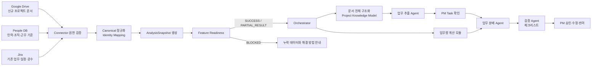
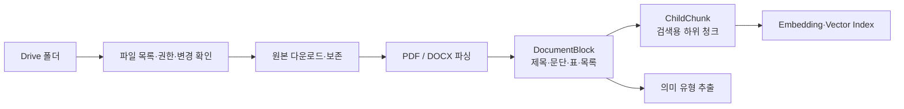
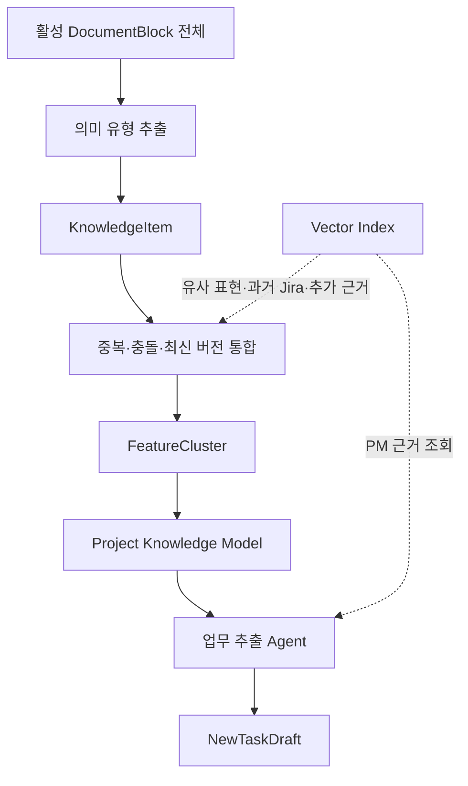
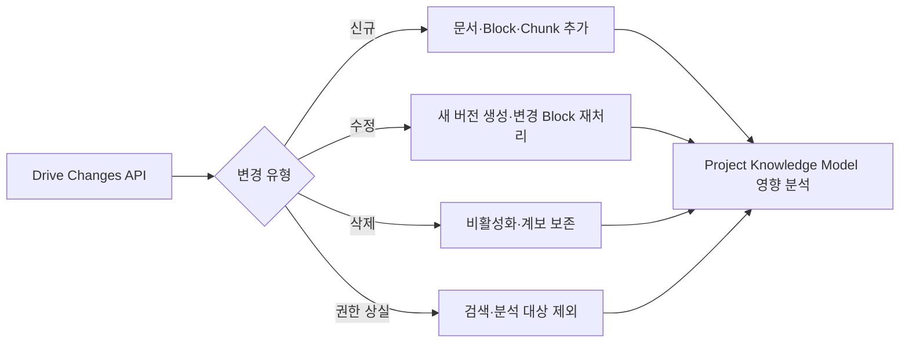
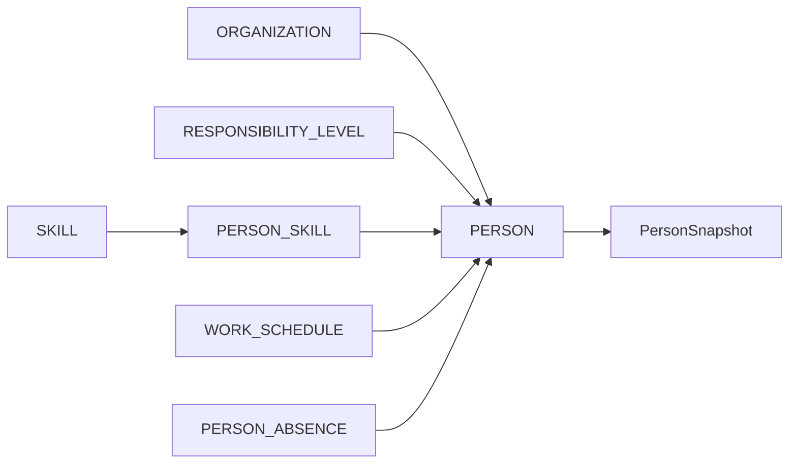
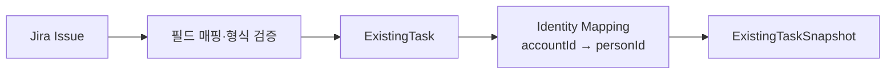
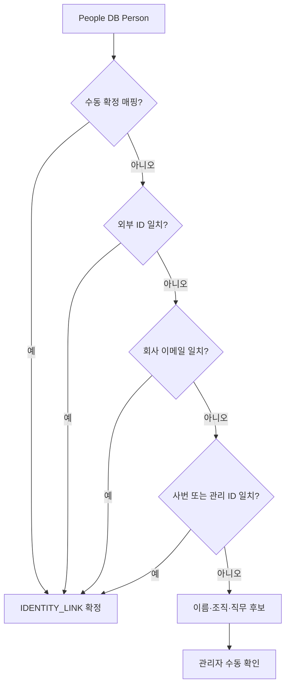
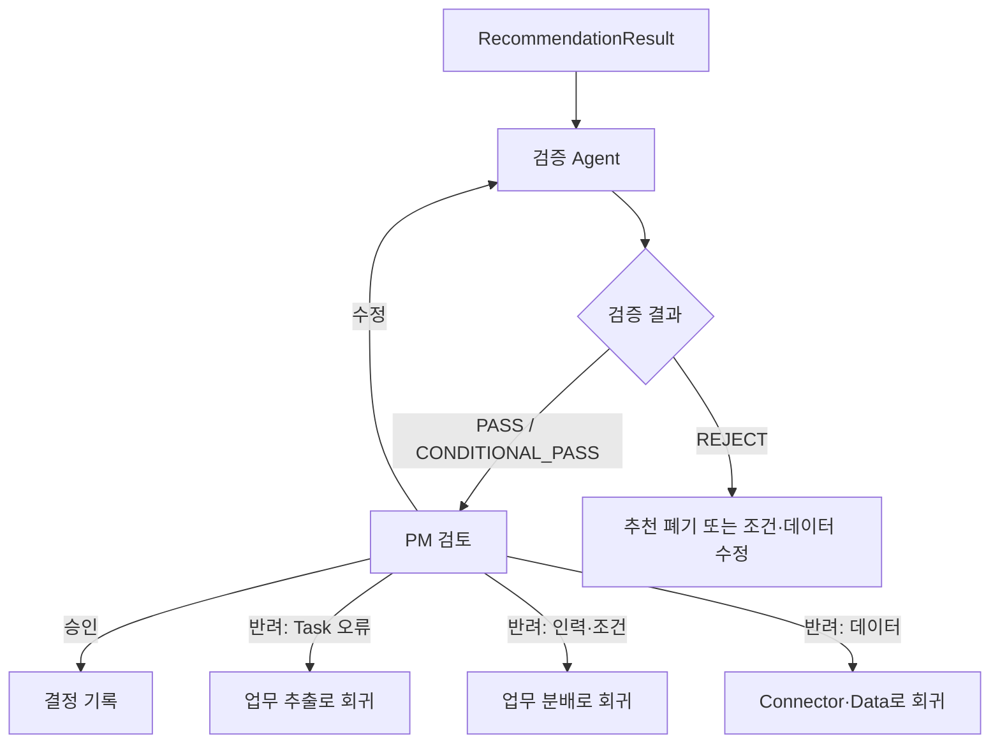

# Data Flow — 수집에서 PM 결정까지

> 기준: 기획서 v5와 Figma Page 1~3  
> 핵심 순서: `수집·원천 검증 → Canonical 정규화 → Snapshot → Feature Readiness → Agent·계산 → 검증 → PM 결정`

---

## 1. 전체 흐름



업무 추출과 업무량 계산은 Orchestrator가 병렬로 시작한다. 업무 추출 Agent가 업무량 계산 모듈을 직접 호출하는 구조가 아니다.

---

## 2. Google Drive 문서 흐름

### 2.1 수집 범위

1. 관리자가 프로젝트별 Drive 폴더를 지정한다.
2. Connector는 해당 폴더와 허용된 하위 폴더만 조회한다.
3. 파일 메타데이터를 먼저 수집하고 권한·형식·수정 시각을 검사한다.
4. 지원 형식의 파일을 내려받아 원본을 보존한다.

8월 6일 시연 기본 형식은 PDF와 DOCX다. OCR, PPTX, Google Docs 변환은 후속 고도화 범위다.

### 2.2 파싱·청킹·메타데이터



문서 구조는 다음 두 층으로 나눈다.

- `DOCUMENT_BLOCK`: 원문 구조와 의미를 보존하는 추출 기준
- `CHILD_CHUNK`: 긴 Block을 검색 가능한 크기로 나눈 보조 기준

공통 메타데이터:

```json
{
  "documentId": "DOC001",
  "projectId": "PRJ001",
  "sourceType": "GOOGLE_DRIVE",
  "sourceFileId": "drive-file-id",
  "fileName": "2026_AI_Project.pdf",
  "mimeType": "application/pdf",
  "owner": "PM 김철수",
  "createdAt": "2026-07-01T00:00:00Z",
  "modifiedAt": "2026-07-20T00:00:00Z",
  "version": "v3",
  "contentHash": "sha256:...",
  "security": "Internal",
  "page": 5,
  "sectionPath": ["3. 요구사항", "3.2 일정"],
  "blockId": "BLK018",
  "chunkId": "CHK018-02"
}
```

### 2.3 전체 구조화와 보조 검색의 역할 분리



RAG는 Project Knowledge Model을 대체하지 않는다. 전체 범위를 빠짐없이 분석해야 하는 기본 경로는 `DocumentBlock 전체 → KnowledgeItem → Project Knowledge Model`이다.

### 2.4 증분 동기화

초기 연결:

1. 폴더 전체 목록 조회
2. `source_file_id`, `modified_at`, `content_hash`, 권한 저장
3. 파싱·Block 생성·보조 임베딩
4. Changes API의 시작 토큰 저장

이후:



파일 수정 시 전체 프로젝트를 무조건 다시 처리하지 않는다. 변경된 Block에서 시작해 KnowledgeItem, FeatureCluster, NewTask, 추천 결과에 미치는 영향을 추적한다.

---

## 3. People DB 흐름

People DB는 외부 HR API를 모사하지 않고 PostgreSQL 기준 테이블에 샘플 데이터를 직접 준비한다.



원천 검증 항목:

- 사번·이메일 중복
- 존재하지 않는 상위 조직 또는 관리자 참조
- 재직 상태 코드
- FTE 범위와 근무시간 형식
- 휴가·부재의 시작·종료 순서
- Skill 숙련도 범위
- 책임수준 코드

조직도는 `ORGANIZATION.parent_organization_id`로 계층을 만들고 `manager_person_id`를 표시한다. 순환 참조, 고아 조직, 복수 관리자 충돌은 자동 수정하지 않고 검증 오류로 남긴다.

---

## 4. Jira 흐름

### 4.1 최초 Discovery

회사마다 Jira 필드와 프로젝트 설정이 다르므로 최초 연결 시 다음을 조회한다.

- `/field`
- `/project/search`
- `/users/search`
- `/board`

Discovery 결과로 Tenant별 Field Mapping을 만든다.

### 4.2 ExistingTaskSnapshot



수집 대상:

- 담당자
- 상태·우선순위
- 시작일·마감일
- 예상·잔여·사용 공수
- Story Point
- Sprint·Velocity
- 최근 갱신 시각

Jira `accountId`와 People DB 직원을 연결하지 못해도 전체 실행을 중단하지 않는다. 해당 직원의 Jira 업무량을 확인할 수 없다는 `PARTIAL_RESULT`를 남긴다.

### 4.3 Jira 비정형 본문

`summary`, `description`, `comment`를 의미 검색이나 과거 업무 근거로 사용할 때는 `sourceType=JIRA`인 가상 `DOCUMENT`를 만들고 `DOCUMENT_BLOCK`으로 저장한다.

- 구조화 공수 계산: `EXISTING_TASK`
- 비정형 의미 검색: `DOCUMENT` / `DOCUMENT_BLOCK` / `VECTOR_INDEX`

두 용도를 섞지 않는다.

---

## 5. Identity Mapping



동명이인이나 다중 후보는 자동 병합하지 않는다. `manual_override=true`인 매핑은 이후 자동 동기화가 덮어쓰지 않는다.

---

## 6. Canonical 정규화·Snapshot

Connector 결과를 Agent에 직접 전달하지 않는다.

1. 연결·권한·원천 필드·값 형식을 검증한다.
2. 원천별 값을 Canonical 필드로 변환한다.
3. Identity Mapping 상태를 확정하거나 미확정으로 기록한다.
4. 프로젝트 문서 버전, People 상태, Jira 업무, 회사 정책, PM 추가 요구사항을 한 시점으로 고정한다.
5. `ANALYSIS_SNAPSHOT`, `PERSON_SNAPSHOT`, `EXISTING_TASK_SNAPSHOT`을 생성한다.

Snapshot을 만든 후 원천이 갱신되면 기존 실행을 조용히 바꾸지 않는다. 재실행 시 새 Snapshot을 만든다.

---

## 7. Feature Readiness

Feature Readiness는 Snapshot을 기준으로 기능별 실행 가능 여부를 판정한다.

예:

| 기능 | 필수 | 조건부 필수 | 누락 처리 |
|---|---|---|---|
| Task 추출 | Project Knowledge Model 또는 추출 가능한 문서 | 일정·공수 계산을 할 때 기간·공수 근거 | 필수 누락 시 BLOCKED |
| 시간 기반 부하 | 기간, 공수, FTE, 근무시간 | 휴가 반영 정책 사용 시 부재 | BLOCKED 또는 제한된 대체 |
| Sprint 기반 부하 | Story Point, Sprint, Velocity | 없음 | 부족하면 시간 방식 검토 |
| Skill 적합도 | Task 필수 Skill | 숙련도 점수를 사용할 때 숙련도 | Skill 미확인은 UNKNOWN |
| Jira 업무량 | Jira 매핑과 잔여 공수 | 고객 정책이 필수로 지정한 경우 | 기본 PARTIAL_RESULT |

결과에는 다음을 항상 포함한다.

- `missingData`
- `limitations`
- `assumptions`
- `confidence`
- `dataReadinessStatus`
- `executableFeatures`

---

## 8. Agent·계산 실행

### 8.1 병렬 시작

Orchestrator는 다음을 병렬로 시작한다.

- Project Knowledge Model 기반 업무 추출
- Snapshot 기반 업무량 계산

PM이 Task를 승인한 뒤 두 결과를 업무 분배 단계에서 합친다.

### 8.2 업무 분배 처리

1. 업무 분배 Agent가 Task별 후보 생성을 요청한다.
2. 규칙 필터가 Hard Constraint를 적용해 적격 후보를 만든다.
3. 코드가 Skill·역할 적합도 지표를 계산한다.
4. 계산 모듈이 기간별 가용성과 부하율을 계산한다.
5. 위험 코드가 일정 충돌·업무 집중·병목을 계산한다.
6. 업무 분배 Agent가 주 후보, 최소 한 명의 대안, 근거를 구성한다.

Agent는 계산값을 임의로 만들거나 수정하지 않는다.

---

## 9. 검증과 PM 결정

검증 Agent는 체크리스트를 실행한다.

- 역할·필수 Skill·책임수준
- 조직 제한
- 권한
- 휴가·휴직 중복
- 일정 충돌
- 추천 근거
- 누락 데이터·신뢰도



중간발표 범위는 추천·검증 결과 출력까지다. PM 승인 후 Jira 쓰기는 중간평가 이후 확장한다.

---

## 10. 재시도·Fallback·감사

- 일시적인 Connector 오류: 제한 횟수 재시도
- 파일 파싱 실패: 파일별 실패 격리, 다른 파일 계속 처리
- 일부 외부 매핑 실패: PARTIAL_RESULT
- 필수 원천 누락: BLOCKED
- 판단이 필요한 충돌: HITL
- 모든 실행: 원천 버전, Snapshot, 모델·정책 버전, 계산 결과, 검증 체크, PM 결정을 기록
