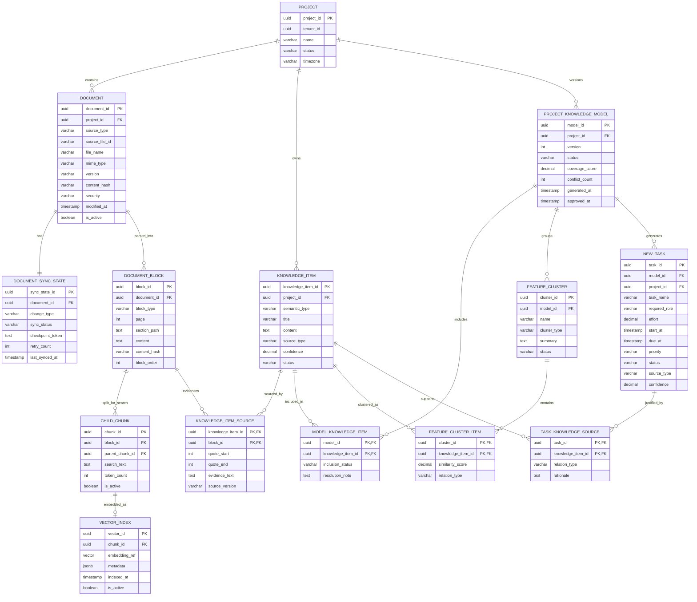
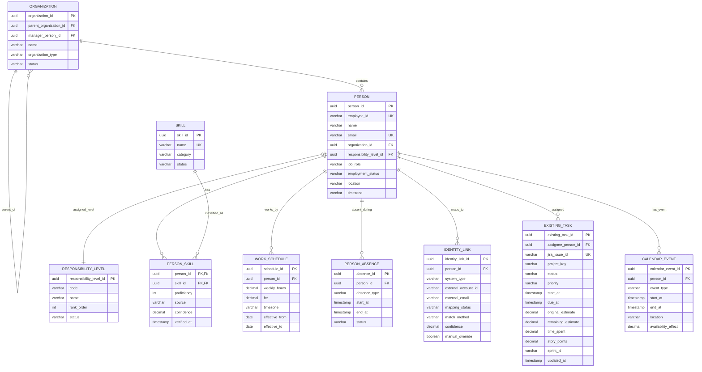
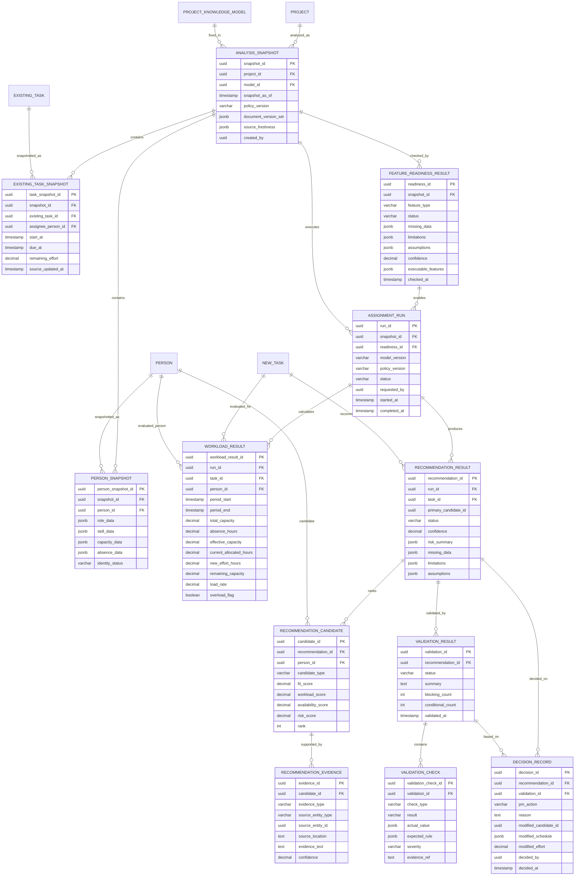

# Canonical Data Model ERD

> Figma Page 3-A·3-B의 테이블 ERD와 동일한 논리 모델이다.  
> 별도 Graph DB는 사용하지 않으며 PostgreSQL의 PK·FK·조인 테이블로 관계를 조회한다.

---

## 1. 프로젝트 문서·Project Knowledge Model

---

## 2. People DB·Jira

`ORGANIZATION.manager_person_id`는 `PERSON.person_id`를 참조한다. 순환 생성 문제를 피하기 위해 조직과 직원을 1차 적재한 뒤 관리자 FK를 2차 갱신한다.

---

## 3. Snapshot·Readiness·추천·검증

---

## 4. 주요 제약조건

| 테이블 | 제약조건 |
|---|---|
| PERSON | `employee_id`, 정규화 이메일은 Tenant 내 UNIQUE |
| ORGANIZATION | 자기 자신을 `parent_organization_id`로 가질 수 없음 |
| PERSON_SKILL | `(person_id, skill_id)` UNIQUE, 숙련도 허용 범위 CHECK |
| WORK_SCHEDULE | `fte > 0`, `fte <= 1`, 적용 시작일 ≤ 종료일 |
| PERSON_ABSENCE | 시작 시각 < 종료 시각 |
| IDENTITY_LINK | `(system_type, external_account_id)` UNIQUE |
| DOCUMENT | `(source_type, source_file_id, version)` UNIQUE |
| DOCUMENT_BLOCK | `(document_id, block_order, content_hash)` 인덱스 |
| VECTOR_INDEX | 활성 Chunk당 활성 Vector 최대 1개 |
| KNOWLEDGE_ITEM_SOURCE | `(knowledge_item_id, block_id)` UNIQUE |
| NEW_TASK | PM 승인 전 Jira 쓰기 대상이 될 수 없음 |
| FEATURE_READINESS_RESULT | `status ∈ {SUCCESS, PARTIAL_RESULT, BLOCKED}` |
| WORKLOAD_RESULT | 유효 가용용량 0일 때 부하율을 강제 계산하지 않음 |
| VALIDATION_RESULT | `REJECT`면 Jira 반영 금지 |

---

## 5. 저장소 배치

| 저장소 | 대상 |
|---|---|
| PostgreSQL | Canonical Entity, Snapshot, 실행 결과, 관계, 정책 버전 |
| Object Storage | Drive 원본 파일, 파싱 중간 산출물 |
| Vector DB 또는 pgvector | ChildChunk 임베딩과 보조 검색 메타데이터 |

Vector DB는 원본의 기준 저장소가 아니다. `VECTOR_INDEX.chunk_id → CHILD_CHUNK.block_id → DOCUMENT_BLOCK.document_id → DOCUMENT.source_file_id`로 원문 근거를 역추적할 수 있어야 한다.
