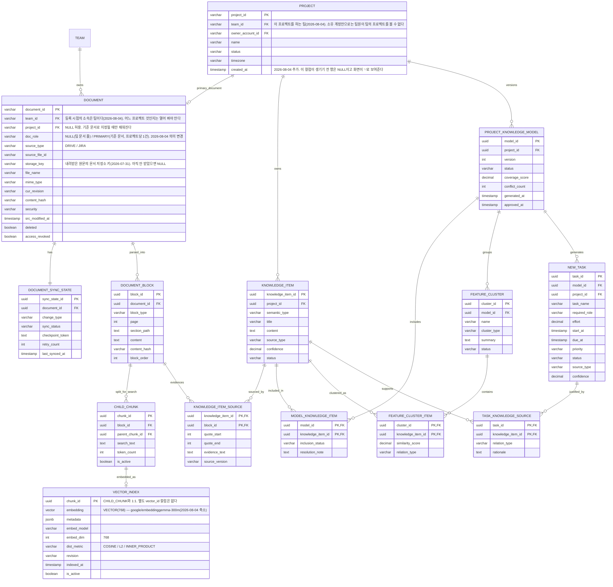
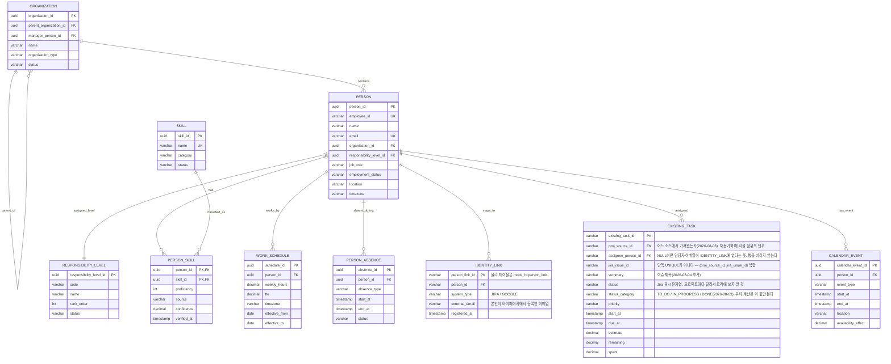
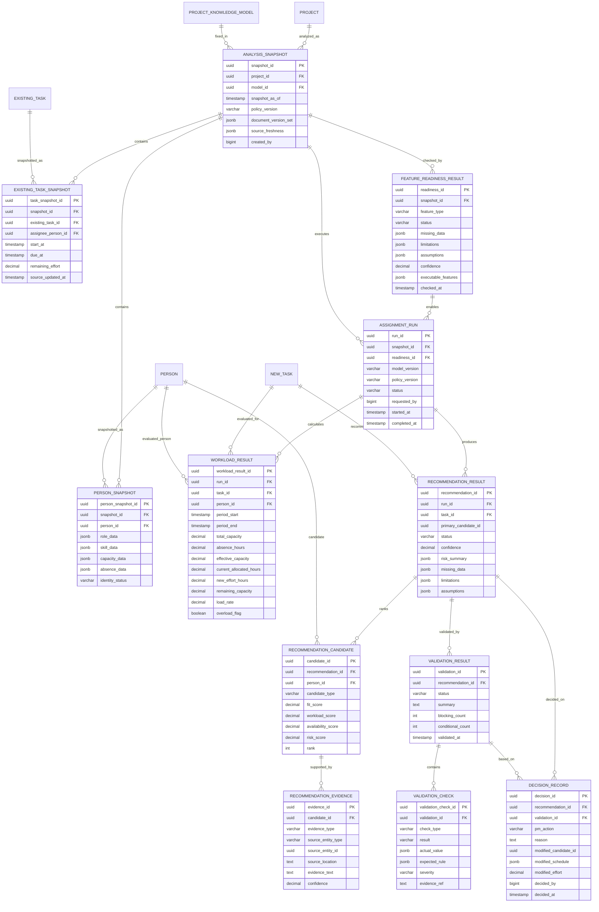
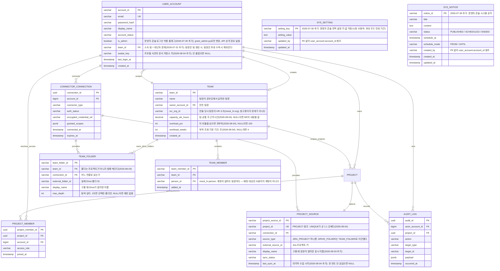

# Canonical Data Model ERD

> Figma Page 3-A·3-B·3-C의 저장 구조와 동일한 논리 모델이다.
> 별도 Graph DB는 사용하지 않으며 PostgreSQL의 PK·FK·조인 테이블로 관계를 조회한다.
> 3-A는 pgvector 검색 인덱스, 3-B는 프로젝트 분석·추천 RDBMS, 3-C는 플랫폼 운영·권한 RDBMS다.
>
> **타입 표기 주의.** 아래 다이어그램에 남아 있는 `uuid`·`bigint`는 논리 표기이지 물리 타입이 아니다.
> `DB/schema.sql`의 실제 PK는 거의 전부 `VARCHAR(5)` 짧은 코드(`PJ001`·`DC001`·`PS001`…)이고,
> UUID를 쓰는 것은 `doc_block`·`chunk`·`vec_idx` **세 개뿐**이다. 물리 타입·제약의 정본은 `DB/schema.sql`이다.

---

## 1. 프로젝트 문서·Project Knowledge Model

```mermaid
erDiagram
    TEAM ||--o{ DOCUMENT : owns
    PROJECT ||--o| DOCUMENT : primary_document
    DOCUMENT ||--|| DOCUMENT_SYNC_STATE : has
    DOCUMENT ||--o{ DOCUMENT_BLOCK : parsed_into
    DOCUMENT_BLOCK ||--o{ CHILD_CHUNK : split_for_search
    CHILD_CHUNK ||--o| VECTOR_INDEX : embedded_as

    PROJECT ||--o{ KNOWLEDGE_ITEM : owns
    DOCUMENT_BLOCK ||--o{ KNOWLEDGE_ITEM_SOURCE : evidences
    KNOWLEDGE_ITEM ||--o{ KNOWLEDGE_ITEM_SOURCE : sourced_by

    PROJECT ||--o{ PROJECT_KNOWLEDGE_MODEL : versions
    PROJECT_KNOWLEDGE_MODEL ||--o{ MODEL_KNOWLEDGE_ITEM : includes
    KNOWLEDGE_ITEM ||--o{ MODEL_KNOWLEDGE_ITEM : included_in
    PROJECT_KNOWLEDGE_MODEL ||--o{ FEATURE_CLUSTER : groups
    FEATURE_CLUSTER ||--o{ FEATURE_CLUSTER_ITEM : contains
    KNOWLEDGE_ITEM ||--o{ FEATURE_CLUSTER_ITEM : clustered_as

    PROJECT_KNOWLEDGE_MODEL ||--o{ NEW_TASK : generates
    NEW_TASK ||--o{ TASK_KNOWLEDGE_SOURCE : justified_by
    KNOWLEDGE_ITEM ||--o{ TASK_KNOWLEDGE_SOURCE : supports

    PROJECT {
        varchar project_id PK
        varchar team_id FK "이 프로젝트를 하는 팀(2026-08-04). 소유 계정만으로는 팀원이 팀의 프로젝트를 볼 수 없다"
        varchar owner_account_id FK
        varchar name
        varchar status
        varchar timezone
        timestamp created_at "2026-08-04 추가. 이 컬럼이 생기기 전 행은 NULL이고 화면이 '-'로 보여준다"
    }
    DOCUMENT {
        varchar document_id PK
        varchar team_id FK "등록 시점의 소속은 팀이다(2026-08-04). 어느 프로젝트 것인지는 열어 봐야 안다"
        varchar project_id FK "NULL 허용. 기준 문서로 지정될 때만 채워진다"
        varchar doc_role "NULL(팀 문서 풀) / PRIMARY(기준 문서, 프로젝트당 1건). 2026-08-04 의미 변경"
        varchar source_type "DRIVE / JIRA"
        varchar source_file_id
        varchar storage_key "내려받은 원문의 문서 저장소 키(2026-07-31). 아직 안 받았으면 NULL"
        varchar file_name
        varchar mime_type
        varchar cur_revision
        varchar content_hash
        varchar security
        timestamp src_modified_at
        boolean deleted
        boolean access_revoked
    }
    DOCUMENT_SYNC_STATE {
        uuid sync_state_id PK
        uuid document_id FK
        varchar change_type
        varchar sync_status
        text checkpoint_token
        int retry_count
        timestamp last_synced_at
    }
    DOCUMENT_BLOCK {
        uuid block_id PK
        uuid document_id FK
        varchar block_type
        int page
        text section_path
        text content
        varchar content_hash
        int block_order
    }
    CHILD_CHUNK {
        uuid chunk_id PK
        uuid block_id FK
        uuid parent_chunk_id FK
        text search_text
        int token_count
        boolean is_active
    }
    VECTOR_INDEX {
        uuid chunk_id PK "CHILD_CHUNK와 1:1. 별도 vector_id 컬럼은 없다"
        vector embedding "VECTOR(768) — google/embeddinggemma-300m(2026-08-04 축소)"
        jsonb metadata
        varchar embed_model
        int embed_dim "768"
        varchar dist_metric "COSINE / L2 / INNER_PRODUCT"
        varchar revision
        timestamp indexed_at
        boolean is_active
    }
    KNOWLEDGE_ITEM {
        uuid knowledge_item_id PK
        uuid project_id FK
        varchar semantic_type
        varchar title
        text content
        varchar source_type
        decimal confidence
        varchar status
    }
    KNOWLEDGE_ITEM_SOURCE {
        uuid knowledge_item_id PK,FK
        uuid block_id PK,FK
        int quote_start
        int quote_end
        text evidence_text
        varchar source_version
    }
    PROJECT_KNOWLEDGE_MODEL {
        uuid model_id PK
        uuid project_id FK
        int version
        varchar status
        decimal coverage_score
        int conflict_count
        timestamp generated_at
        timestamp approved_at
    }
    MODEL_KNOWLEDGE_ITEM {
        uuid model_id PK,FK
        uuid knowledge_item_id PK,FK
        varchar inclusion_status
        text resolution_note
    }
    FEATURE_CLUSTER {
        uuid cluster_id PK
        uuid model_id FK
        varchar name
        varchar cluster_type
        text summary
        varchar status
    }
    FEATURE_CLUSTER_ITEM {
        uuid cluster_id PK,FK
        uuid knowledge_item_id PK,FK
        decimal similarity_score
        varchar relation_type
    }
    NEW_TASK {
        uuid task_id PK
        uuid model_id FK
        uuid project_id FK
        varchar task_name
        varchar required_role
        decimal effort
        timestamp start_at
        timestamp due_at
        varchar priority
        varchar status
        varchar source_type
        decimal confidence
    }
    TASK_KNOWLEDGE_SOURCE {
        uuid task_id PK,FK
        uuid knowledge_item_id PK,FK
        varchar relation_type
        text rationale
    }
```

---

## 2. People DB·Jira

```mermaid
erDiagram
    ORGANIZATION ||--o{ ORGANIZATION : parent_of
    ORGANIZATION ||--o{ PERSON : contains
    PERSON o|--|| RESPONSIBILITY_LEVEL : assigned_level
    PERSON ||--o{ PERSON_SKILL : has
    SKILL ||--o{ PERSON_SKILL : classified_as
    PERSON ||--o{ WORK_SCHEDULE : works_by
    PERSON ||--o{ PERSON_ABSENCE : absent_during
    PERSON ||--o{ IDENTITY_LINK : maps_to
    PERSON ||--o{ EXISTING_TASK : assigned
    PERSON ||--o{ CALENDAR_EVENT : has_event

    ORGANIZATION {
        uuid organization_id PK
        uuid parent_organization_id FK
        uuid manager_person_id FK
        varchar name
        varchar organization_type
        varchar status
    }
    RESPONSIBILITY_LEVEL {
        uuid responsibility_level_id PK
        varchar code
        varchar name
        int rank_order
        varchar status
    }
    PERSON {
        uuid person_id PK
        varchar employee_id UK
        varchar name
        varchar email UK
        uuid organization_id FK
        uuid responsibility_level_id FK
        varchar job_role
        varchar employment_status
        varchar location
        varchar timezone
    }
    SKILL {
        uuid skill_id PK
        varchar name UK
        varchar category
        varchar status
    }
    PERSON_SKILL {
        uuid person_id PK,FK
        uuid skill_id PK,FK
        int proficiency
        varchar source
        decimal confidence
        timestamp verified_at
    }
    WORK_SCHEDULE {
        uuid schedule_id PK
        uuid person_id FK
        decimal weekly_hours
        decimal fte
        varchar timezone
        date effective_from
        date effective_to
    }
    PERSON_ABSENCE {
        uuid absence_id PK
        uuid person_id FK
        varchar absence_type
        timestamp start_at
        timestamp end_at
        varchar status
    }
    IDENTITY_LINK {
        varchar person_link_id PK "물리 테이블은 mock_hr.person_link"
        varchar person_id FK
        varchar system_type "JIRA / GOOGLE"
        varchar external_email "본인이 마이페이지에서 등록한 이메일"
        timestamp registered_at
    }
    EXISTING_TASK {
        varchar existing_task_id PK
        varchar proj_source_id FK "어느 소스에서 가져왔는가(2026-08-03). 재동기화 때 지울 범위의 단위"
        varchar assignee_person_id FK "NULL이면 담당자 이메일이 IDENTITY_LINK에 없다는 뜻. 행을 버리지 않는다"
        varchar jira_issue_id "단독 UNIQUE가 아니다 — (proj_source_id, jira_issue_id) 복합"
        varchar summary "이슈 제목(2026-08-04 추가)"
        varchar status "Jira 표시 문자열. 프로젝트마다 달라서 로직에 쓰지 말 것"
        varchar status_category "TO_DO / IN_PROGRESS / DONE(2026-08-03). 부하 계산은 이 값만 본다"
        varchar priority
        timestamp start_at
        timestamp due_at
        decimal estimate
        decimal remaining
        decimal spent
    }
    CALENDAR_EVENT {
        uuid calendar_event_id PK
        uuid person_id FK
        varchar event_type
        timestamp start_at
        timestamp end_at
        varchar location
        decimal availability_effect
    }
```

`ORGANIZATION.manager_person_id`는 `PERSON.person_id`를 참조한다. 순환 생성 문제를 피하기 위해 조직과 직원을 1차 적재한 뒤 관리자 FK를 2차 갱신한다.

**Story Point·Sprint·`project_key`·`updated_at`은 `EXISTING_TASK`에 없다.** 수집도 저장도 하지 않는다 — 초기 설계에는 있었지만 물리 스키마에 들어가지 않았다. Sprint 기반 부하 계산을 전제로 한 서술이 다른 문서에 남아 있다면 그쪽이 낡은 것이다.

---

## 3. Snapshot·Readiness·추천·검증

```mermaid
erDiagram
    PROJECT ||--o{ ANALYSIS_SNAPSHOT : analyzed_as
    PROJECT_KNOWLEDGE_MODEL ||--o{ ANALYSIS_SNAPSHOT : fixed_in

    ANALYSIS_SNAPSHOT ||--o{ PERSON_SNAPSHOT : contains
    PERSON ||--o{ PERSON_SNAPSHOT : snapshotted_as
    ANALYSIS_SNAPSHOT ||--o{ EXISTING_TASK_SNAPSHOT : contains
    EXISTING_TASK ||--o{ EXISTING_TASK_SNAPSHOT : snapshotted_as

    ANALYSIS_SNAPSHOT ||--o{ FEATURE_READINESS_RESULT : checked_by
    FEATURE_READINESS_RESULT ||--o{ ASSIGNMENT_RUN : enables
    ANALYSIS_SNAPSHOT ||--o{ ASSIGNMENT_RUN : executes

    ASSIGNMENT_RUN ||--o{ WORKLOAD_RESULT : calculates
    NEW_TASK ||--o{ WORKLOAD_RESULT : evaluated_for
    PERSON ||--o{ WORKLOAD_RESULT : evaluated_person

    ASSIGNMENT_RUN ||--o{ RECOMMENDATION_RESULT : produces
    NEW_TASK ||--o{ RECOMMENDATION_RESULT : recommends_for
    RECOMMENDATION_RESULT ||--o{ RECOMMENDATION_CANDIDATE : ranks
    PERSON ||--o{ RECOMMENDATION_CANDIDATE : candidate
    RECOMMENDATION_CANDIDATE ||--o{ RECOMMENDATION_EVIDENCE : supported_by

    RECOMMENDATION_RESULT ||--o{ VALIDATION_RESULT : validated_by
    VALIDATION_RESULT ||--o{ VALIDATION_CHECK : contains
    RECOMMENDATION_RESULT ||--o{ DECISION_RECORD : decided_on
    VALIDATION_RESULT ||--o{ DECISION_RECORD : based_on

    ANALYSIS_SNAPSHOT {
        uuid snapshot_id PK
        uuid project_id FK
        uuid model_id FK
        timestamp snapshot_as_of
        varchar policy_version
        jsonb document_version_set
        jsonb source_freshness
        bigint created_by
    }
    PERSON_SNAPSHOT {
        uuid person_snapshot_id PK
        uuid snapshot_id FK
        uuid person_id FK
        jsonb role_data
        jsonb skill_data
        jsonb capacity_data
        jsonb absence_data
        varchar identity_status
    }
    EXISTING_TASK_SNAPSHOT {
        uuid task_snapshot_id PK
        uuid snapshot_id FK
        uuid existing_task_id FK
        uuid assignee_person_id FK
        timestamp start_at
        timestamp due_at
        decimal remaining_effort
        timestamp source_updated_at
    }
    FEATURE_READINESS_RESULT {
        uuid readiness_id PK
        uuid snapshot_id FK
        varchar feature_type
        varchar status
        jsonb missing_data
        jsonb limitations
        jsonb assumptions
        decimal confidence
        jsonb executable_features
        timestamp checked_at
    }
    ASSIGNMENT_RUN {
        uuid run_id PK
        uuid snapshot_id FK
        uuid readiness_id FK
        varchar model_version
        varchar policy_version
        varchar status
        bigint requested_by
        timestamp started_at
        timestamp completed_at
    }
    WORKLOAD_RESULT {
        uuid workload_result_id PK
        uuid run_id FK
        uuid task_id FK
        uuid person_id FK
        timestamp period_start
        timestamp period_end
        decimal total_capacity
        decimal absence_hours
        decimal effective_capacity
        decimal current_allocated_hours
        decimal new_effort_hours
        decimal remaining_capacity
        decimal load_rate
        boolean overload_flag
    }
    RECOMMENDATION_RESULT {
        uuid recommendation_id PK
        uuid run_id FK
        uuid task_id FK
        uuid primary_candidate_id
        varchar status
        decimal confidence
        jsonb risk_summary
        jsonb missing_data
        jsonb limitations
        jsonb assumptions
    }
    RECOMMENDATION_CANDIDATE {
        uuid candidate_id PK
        uuid recommendation_id FK
        uuid person_id FK
        varchar candidate_type
        decimal fit_score
        decimal workload_score
        decimal availability_score
        decimal risk_score
        int rank
    }
    RECOMMENDATION_EVIDENCE {
        uuid evidence_id PK
        uuid candidate_id FK
        varchar evidence_type
        varchar source_entity_type
        uuid source_entity_id
        text source_location
        text evidence_text
        decimal confidence
    }
    VALIDATION_RESULT {
        uuid validation_id PK
        uuid recommendation_id FK
        varchar status
        text summary
        int blocking_count
        int conditional_count
        timestamp validated_at
    }
    VALIDATION_CHECK {
        uuid validation_check_id PK
        uuid validation_id FK
        varchar check_type
        varchar result
        jsonb actual_value
        jsonb expected_rule
        varchar severity
        text evidence_ref
    }
    DECISION_RECORD {
        uuid decision_id PK
        uuid recommendation_id FK
        uuid validation_id FK
        varchar pm_action
        text reason
        uuid modified_candidate_id
        jsonb modified_schedule
        decimal modified_effort
        bigint decided_by
        timestamp decided_at
    }
```

---

## 4. 플랫폼 운영·권한

```mermaid
erDiagram
    USER_ACCOUNT ||--o{ PROJECT : owns
    USER_ACCOUNT ||--o{ PROJECT_MEMBER : receives_access
    PROJECT ||--o{ PROJECT_MEMBER : grants_access
    USER_ACCOUNT ||--o{ CONNECTOR_CONNECTION : connects
    PROJECT ||--|| PROJECT_SOURCE : selects
    CONNECTOR_CONNECTION ||--o{ PROJECT_SOURCE : provides
    TEAM ||--o{ TEAM_FOLDER : owns_drive_folders
    CONNECTOR_CONNECTION ||--o{ TEAM_FOLDER : provides
    TEAM ||--o{ PROJECT : scopes_projects
    USER_ACCOUNT ||--o{ AUDIT_LOG : acts
    PROJECT ||--o{ AUDIT_LOG : records
    TEAM ||--o{ USER_ACCOUNT : scopes
    TEAM ||--o{ TEAM_MEMBER : contains
    USER_ACCOUNT ||--o| TEAM : creates

    USER_ACCOUNT {
        varchar account_id PK
        varchar email UK
        varchar password_hash
        varchar display_name
        varchar account_status
        boolean is_admin "운영자 콘솔 로그인 허용 플래그(2026-07-30 추가). grant_admin.py로만 변경, API 승격 경로 없음"
        varchar team_id FK "소속 팀 = 테넌트 경계(2026-07-31 추가). 팀장은 팀 생성 시, 팀원은 초대 수락 시 채워진다"
        varchar avatar_key "프로필 사진의 문서 저장소 키(2026-08-04 추가). 안 올렸으면 NULL"
        timestamp last_login_at
        timestamp created_at
    }
    TEAM {
        varchar team_id PK
        varchar name "팀장이 온보딩에서 입력한 팀명"
        varchar owner_account_id FK "만든 팀장"
        varchar src_org_id "만들 당시 팀장의 HR 소속(mock_hr.org). 참고용이지 경계가 아니다"
        decimal capacity_wk_hours "팀 공통 주 근무시간(2026-08-04). NULL이면 HR의 사람별 값"
        int overload_pct "이 비율을 넘으면 과부하(2026-08-04). NULL이면 100"
        int workload_weeks "부하 조회 기본 기간, 주(2026-08-04). NULL이면 4"
        timestamp created_at
    }
    TEAM_MEMBER {
        varchar team_member_id PK
        varchar team_id FK
        varchar person_id FK "mock_hr.person. 계정이 없어도 팀원이다 — 배정 대상은 사람이지 계정이 아니다"
        timestamp added_at
    }
    PROJECT_MEMBER {
        uuid project_member_id PK
        uuid project_id FK
        bigint account_id FK
        varchar access_role
        timestamp joined_at
    }
    CONNECTOR_CONNECTION {
        uuid connection_id PK
        bigint account_id FK
        varchar connector_type
        varchar auth_status
        varchar encrypted_credential_ref
        jsonb granted_scopes
        timestamp connected_at
        timestamp expires_at
    }
    PROJECT_SOURCE {
        varchar project_source_id PK
        varchar project_id UK "PROJECT 참조. UNIQUE가 곧 1:1 강제다(2026-08-04)"
        varchar connection_id FK
        varchar source_type "JIRA_PROJECT 하나뿐. DRIVE_FOLDER는 TEAM_FOLDER로 이관됐다"
        varchar external_source_id "Jira 프로젝트 키"
        varchar display_name "고를 때 원본이 알려준 표시 이름(2026-08-03 추가)"
        varchar sync_status
        timestamp last_sync_at "마지막 수집 시각(2026-08-04 추가). 한 번도 안 읽었으면 NULL"
    }
    TEAM_FOLDER {
        varchar team_folder_id PK
        varchar team_id FK "폴더는 프로젝트가 아니라 팀에 매단다(2026-08-04)"
        varchar connection_id FK "어느 연결로 읽는가"
        varchar external_folder_id "실제 Drive 폴더 ID"
        varchar display_name "고를 때 Drive가 알려준 이름"
        int max_depth "탐색 깊이. 1이면 선택한 폴더만, NULL이면 제한 없음"
    }
    AUDIT_LOG {
        uuid audit_id PK
        bigint actor_account_id FK
        uuid project_id FK
        varchar action
        varchar target_type
        varchar target_id
        jsonb payload
        timestamp occurred_at
    }
    SYS_SETTING {
        varchar setting_key PK "2026-07-30 추가. 운영자 콘솔 전역 설정 키-값 저장소(첫 사용처: 초대 코드 만료 기간)"
        text setting_value
        varchar updated_by "FK 없이 user_account.account_id 참조"
        timestamp updated_at
    }
    SYS_NOTICE {
        varchar notice_id PK "2026-07-30 추가. 운영자 콘솔 시스템 공지"
        varchar title
        text content
        varchar status "PUBLISHED / SCHEDULED / ENDED"
        timestamp schedule_at
        varchar schedule_mode "FROM / UNTIL"
        varchar created_by "FK 없이 user_account.account_id 참조"
        timestamp created_at
        timestamp updated_at
    }
```

`PERSON`은 추천 후보가 되는 HR 직원이고 `USER_ACCOUNT`는 플랫폼 로그인 사용자다. 두 객체는 목적이 다르므로 동일 테이블로 합치지 않는다.

---

## 5. 주요 제약조건

| 테이블 | 제약조건 |
|---|---|
| PERSON | `employee_id` UNIQUE, 활성 People 데이터셋 내 정규화 이메일 UNIQUE |
| USER_ACCOUNT | 정규화 이메일 UNIQUE, 비밀번호 평문 저장 금지 |
| PROJECT_MEMBER | `(project_id, account_id)` UNIQUE |
| PROJECT_SOURCE | **`(project_id)` UNIQUE** — 프로젝트 하나에 Jira 프로젝트 하나(1:1, 2026-08-04, `ux_proj_source_proj`) |
| TEAM_FOLDER | `(team_id, external_folder_id)` UNIQUE |
| EXISTING_TASK | `(proj_source_id, jira_issue_id)` UNIQUE — 같은 이슈가 두 줄이 되면 그 사람 부하가 2배로 잡힌다 |
| ORGANIZATION | 자기 자신을 `parent_organization_id`로 가질 수 없음 |
| PERSON_SKILL | `(person_id, skill_id)` UNIQUE, 숙련도 허용 범위 CHECK |
| WORK_SCHEDULE | `fte > 0`, `fte <= 1`, 적용 시작일 ≤ 종료일 |
| PERSON_ABSENCE | 시작 시각 < 종료 시각 |
| IDENTITY_LINK | `(system_type, external_email)` UNIQUE, `(person_id, system_type)` UNIQUE — `external_account_id` 컬럼은 없다 |
| DOCUMENT | DB 유니크 제약은 없다. 같은 팀에 같은 파일이 두 번 등록되지 않도록 적재 코드가 `(team_id, source_file_id)`를 확인한다. 기준 문서는 프로젝트당 1건 — `(project_id) WHERE doc_role='PRIMARY' AND deleted=false` 부분 유니크 인덱스(`ux_doc_primary_per_proj`) |
| DOCUMENT_BLOCK | `(document_id, block_order, content_hash)` 인덱스 |
| VECTOR_INDEX | 활성 Chunk당 활성 Vector 최대 1개 |
| KNOWLEDGE_ITEM_SOURCE | `(knowledge_item_id, block_id)` UNIQUE |
| NEW_TASK | PM 승인 전 Jira 쓰기 대상이 될 수 없음 |
| FEATURE_READINESS_RESULT | `status ∈ {SUCCESS, PARTIAL_RESULT, BLOCKED}` |
| WORKLOAD_RESULT | 유효 가용용량 0일 때 부하율을 강제 계산하지 않음 |
| VALIDATION_RESULT | `REJECT`면 Jira 반영 금지 |

---

## 6. 저장소 배치

| Figma 영역 | 물리 저장소 | 대상 |
|---|---|---|
| 3-A | PostgreSQL pgvector (`public`) | `VECTOR_INDEX`: Chunk 임베딩과 검색 필터용 최소 메타데이터 |
| 3-B | PostgreSQL RDBMS (`public`) | 프로젝트·문서·Block·Chunk·지식 모델·Jira·Snapshot·추천·검증·PM 결정 |
| 3-B 중 People DB | PostgreSQL RDBMS (**`mock_hr`**) | `ORG`·`RESPONSIBILITY_LEVEL`·`SKILL`·`PERSON`·`PERSON_SKILL`·`IDENTITY_LINK`·`WORK_SCHEDULE`·`ABSENCE` 8개 |
| 3-C | PostgreSQL RDBMS (`public`) | 회원·**팀**·프로젝트 권한·OAuth 연결·프로젝트 연동 대상·감사 로그 |
| 공통 원본 | Object Storage | Drive 원본 파일, 파싱 중간 산출물 |

People DB 8개만 **`mock_hr` 스키마**에 있다(2026-07-31). 이 데이터는 고객사 HR 시스템의 것이고 우리는 읽기만 하기 때문이다. 스키마명을 붙이지 않으면 조회가 실패하므로, 실수로 우리 테이블과 조인할 수 없다 — [[HR_어댑터와_테넌트_경계]] §8. `PERSON_SNAPSHOT`·`ASSIGNMENT_RUN` 등 분석 결과는 같은 3-B라도 우리가 만든 데이터라 `public`에 남는다.

pgvector는 원본의 기준 저장소가 아니다. `VECTOR_INDEX.chunk_id → CHILD_CHUNK.block_id → DOCUMENT_BLOCK.document_id → DOCUMENT.source_file_id`로 원문 근거를 역추적할 수 있어야 한다. 3-A·3-B·3-C는 역할상 구분이며 초기 구현에서는 하나의 PostgreSQL 인스턴스에 함께 배치한다.
