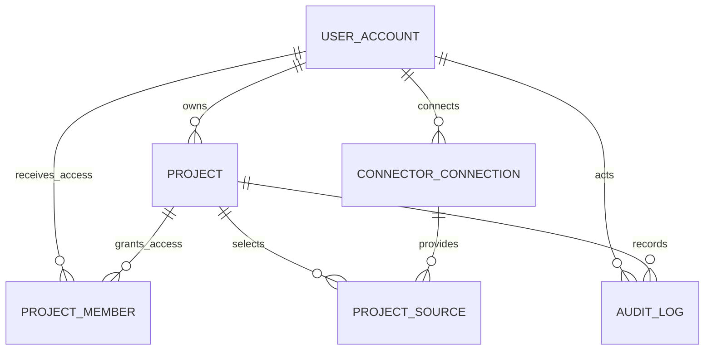

# 플랫폼 운영·권한 DB 설계

> 기준: Figma `Page 3-C | 플랫폼 운영·권한 RDBMS`  
> 적용 범위: 단일 조직용 AI 프로젝트 운영 코파일럿 1차 구현  
> 저장소: PostgreSQL RDBMS

> **2026-07-31 정정 — "단일 조직용"은 더 이상 맞지 않는다.** 테넌트 경계를 `TEAM`으로 세웠다. 아래 1·2번 결정 중 "`TENANT` 엔티티를 쓰지 않는다"는 유효하고, "멀티테넌트가 아니다"는 폐기됐다. 자세한 내용은 [[HR_어댑터와_테넌트_경계]].

## 1. 설계 결정

1. 1차 플랫폼은 여러 고객사가 입점하는 멀티테넌트 SaaS가 아니다.
   > **폐기(2026-07-31).** 사용 단위는 **회사 안의 팀**이다. `TEAM`·`TEAM_MEMBER`를 추가하고 `USER_ACCOUNT.team_id`·`MEMBER_INVITE.team_id`로 경계를 실어 나른다. 팀은 조직도에서 유도하지 않고 팀장이 온보딩에서 팀명을 적어 만든다 — 조직도만으로는 "어디까지가 우리 그룹인가"를 알 수 없기 때문이다.
2. `TENANT`, `TENANT_MEMBER`, 공통 `tenant_id`를 사용하지 않는다.
   > **유효.** 이 세 가지는 지금도 쓰지 않는다. 경계는 `TEAM` 쪽에 있고 전 테이블에 `tenant_id`를 뿌리지 않는다.
3. `USER_ACCOUNT`는 플랫폼 로그인 사용자이고 `PERSON`은 업무 배정 후보 직원이다.
4. 프로젝트 분석·추천 데이터의 중심은 기존 3-B `PROJECT`다.
5. Connector 계정 연결과 프로젝트별 분석 범위를 분리한다.
6. 비밀번호 평문과 외부 서비스 자격증명 원문을 API 응답·애플리케이션 로그·`AUDIT_LOG.payload`에 남기지 않는다.
7. Google Drive/Jira 자격증명은 별도 Secret Manager 참조가 아니라 애플리케이션에서 암호화한 암호문을 DB의 `encrypted_credential_ref`에 저장한다. 컬럼명은 기존 설계 호환을 위해 유지하지만 실제 값은 참조 키가 아니라 암호문이다. 현재 구현된 People DB 연결은 별도 자격증명이 없어 이 컬럼을 `NULL`로 둔다.

## 2. 전체 관계



```text
USER_ACCOUNT
 ├─ PROJECT.owner_account_id
 ├─ PROJECT_MEMBER ── PROJECT
 ├─ CONNECTOR_CONNECTION
 │       └─ PROJECT_SOURCE ── PROJECT
 └─ AUDIT_LOG ── PROJECT
```

## 3. 테이블 정의

### 3.1 USER_ACCOUNT

플랫폼 인증과 화면 표시를 위한 사용자 계정이다. Django의 `AUTH_USER_MODEL`과 대응한다.

| 필드 | 타입 예시 | 제약 | 의미 |
|---|---|---|---|
| `account_id` | BIGINT | PK | Django `accounts.User.id`에 대응하는 플랫폼 계정 ID |
| `email` | VARCHAR(320) | NOT NULL, UNIQUE | 로그인 이메일 |
| `password_hash` | VARCHAR | NOT NULL | Django 인증 체계가 생성한 비밀번호 해시 |
| `display_name` | VARCHAR(100) | NOT NULL | 화면 표시 이름 |
| `account_status` | VARCHAR(20) | NOT NULL | `ACTIVE/LOCKED/WITHDRAWN` |
| `last_login_at` | TIMESTAMPTZ | NULL | 최근 로그인 시각 |
| `created_at` | TIMESTAMPTZ | NOT NULL | 가입 시각 |
| `updated_at` | TIMESTAMPTZ | NOT NULL | 수정 시각 |

논리 모델의 `password_hash`는 Django 물리 모델의 `password` 필드에 대응한다. 평문 비밀번호를 직접 할당하지 않고 Django의 비밀번호 설정·검증 함수를 사용한다.

### 3.2 PROJECT 보강

`PROJECT`는 3-B에 이미 존재하므로 3-C에 중복 생성하지 않는다.

| 보강 필드 | 타입 예시 | 제약 | 의미 |
|---|---|---|---|
| `owner_account_id` | BIGINT | FK, NOT NULL | 프로젝트 생성·관리 PM |
| `created_at` | TIMESTAMPTZ | NOT NULL | 생성 시각 |
| `updated_at` | TIMESTAMPTZ | NOT NULL | 수정 시각 |

`owner_account_id`는 소유권의 기본값이다. 세부 접근권한은 `PROJECT_MEMBER`로 관리한다.

### 3.3 PROJECT_MEMBER

플랫폼 사용자의 프로젝트별 접근권한을 관리한다.

| 필드 | 타입 예시 | 제약 | 의미 |
|---|---|---|---|
| `project_member_id` | UUID | PK | 프로젝트 멤버 ID |
| `project_id` | UUID | FK, NOT NULL | 대상 프로젝트 |
| `account_id` | BIGINT | FK, NOT NULL | 플랫폼 사용자 |
| `access_role` | VARCHAR(20) | NOT NULL | `OWNER/EDITOR/VIEWER` |
| `joined_at` | TIMESTAMPTZ | NOT NULL | 권한 부여 시각 |

제약조건:

- `(project_id, account_id)` UNIQUE
- 프로젝트 소유자는 최소 `OWNER` 권한을 가진다.
- `VIEWER`는 추천·검증 결과를 수정하거나 PM 결정을 생성할 수 없다.

### 3.4 CONNECTOR_CONNECTION

사용자가 People DB, Google Drive 또는 Jira를 연결한 상태를 관리한다. 논리 모델명은 `CONNECTOR_CONNECTION`, 현재 물리 스키마명은 `connector_conn`이다. 물리 구현의 최종 기준은 `DB/schema.sql`이다.

| 필드 | 타입 예시 | 제약 | 의미 |
|---|---|---|---|
| `connection_id` | UUID | PK | Connector 연결 ID |
| `account_id` | BIGINT | FK, NOT NULL | 연결을 생성한 플랫폼 사용자 |
| `connector_type` | VARCHAR(30) | NOT NULL | `PEOPLE_DB/GOOGLE_DRIVE/JIRA` |
| `provider_account_id` | VARCHAR | NULL | 외부 서비스 계정 ID |
| `provider_email` | VARCHAR(320) | NULL | 사용자 확인용 외부 계정 이메일 |
| `auth_status` | VARCHAR(20) | NOT NULL | `CONNECTED/EXPIRED/REVOKED/ERROR` |
| `encrypted_credential_ref` | VARCHAR | NULL | 외부 자격증명을 애플리케이션에서 암호화한 암호문. 기존 `*_ref` 명칭은 유지하되 참조 키로 해석하지 않는다. People DB는 `NULL` |
| `granted_scopes` | JSONB | NOT NULL | OAuth에서 허용된 Scope |
| `connected_at` | TIMESTAMPTZ | NOT NULL | 연결 시각 |
| `expires_at` | TIMESTAMPTZ | NULL | 자격증명 만료 예정 시각 |
| `last_error_code` | VARCHAR | NULL | 최근 연결 오류 코드 |
| `updated_at` | TIMESTAMPTZ | NOT NULL | 상태 수정 시각 |

자격증명 원문은 API 응답, 애플리케이션 로그, `AUDIT_LOG.payload`에 포함하지 않는다.

#### 실제 구현과의 차이 (2026-07-30)

`DB/schema.sql`의 `connector_conn`은 위 표보다 좁다. **구현을 기준으로 삼아야 한다.**

```
conn_id, account_id, connector_type, granted_scopes,
auth_status, encrypted_credential_ref, connected_at
```

없는 것: `provider_account_id`, `provider_email`, `expires_at`, `last_error_code`, `updated_at`. PK도 UUID가 아니라 `VARCHAR(5)`(`CN001`…)이고 `account_id`는 `BIGINT`가 아니라 `VARCHAR(5)`다.

- **`expires_at`이 없어도 된다** — 만료 시각은 암호문 payload 안에 함께 들어 있다. 컬럼으로 빼면 암호문과 어긋날 수 있고, 어차피 호출 직전에 복호화하므로 밖에서 읽을 이유가 없다.
- **`auth_status`는 `CONNECTED`/`EXPIRED`/`ERROR`만 쓴다.** `REVOKED`는 사용하지 않는다 — 사용자가 외부 콘솔에서 권한을 회수하면 갱신이 실패하고 `EXPIRED`가 되며, 화면이 유도하는 행동(재연결)이 같다.
- `provider_email`은 넣지 않았다. 어느 외부 계정으로 연결했는지 보여주려면 필요하지만 지금 화면이 요구하지 않는다.

### 자격증명 저장 결정

- **People DB:** 부트캠프 구현에서는 같은 PostgreSQL의 HR 모의 데이터를 조회하므로 별도 토큰·비밀번호가 없다. `encrypted_credential_ref=NULL`로 저장한다.
- **Google Drive/Jira:** **구현 완료.** access/refresh token(+ Jira는 `cloud_id`)을 JSON으로 묶어 Fernet으로 암호화한 뒤 암호문을 이 컬럼에 저장한다. 키는 `SECRET_KEY`를 sha256으로 파생해 만든다(`SECRET_KEY`를 그대로 쓰지 않는다). 호출 직전에 만료를 확인해 갱신하고 다시 저장하며, 갱신이 실패하면 `auth_status='EXPIRED'`로 전이시킨다. 자세한 내용은 [[Jira_Drive_커넥터_연결_설계]] §1.
- **컬럼 타입:** `VARCHAR(255)`로는 담을 수 없어 `TEXT`로 바꿨다. Fernet 암호문이 Jira 1700자, Drive 632자다.
- **컬럼명 불일치:** `encrypted_credential_ref`는 초기 Secret Manager 참조 설계에서 남은 이름이다. 마이그레이션 비용을 피하기 위해 당장은 이름을 유지하고, 문서·코드에서 “DB 암호문 저장 컬럼”으로 일관되게 해석한다.
- **키 관리:** 암호화 키는 `SECRET_KEY`에서 파생되므로 `.env`로 주입되고 DB에 함께 저장되지 않는다. **`SECRET_KEY`를 바꾸면 저장된 모든 자격증명을 복호화할 수 없어 전원 재연결이 필요하다.** 키 교체·재암호화 절차는 아직 없다.

### 3.5 PROJECT_SOURCE

연결된 계정 중 특정 프로젝트가 실제로 분석할 외부 범위를 관리한다.

| 필드 | 타입 예시 | 제약 | 의미 |
|---|---|---|---|
| `project_source_id` | UUID | PK | 프로젝트 연동 대상 ID |
| `project_id` | UUID | FK, NOT NULL | 내부 프로젝트 |
| `connection_id` | UUID | FK, NOT NULL | 사용한 Connector 연결 |
| `source_type` | VARCHAR(30) | NOT NULL | `DRIVE_FOLDER/JIRA_PROJECT` |
| `external_source_id` | VARCHAR | NOT NULL | Drive folderId 또는 Jira project ID/key |
| `display_name` | VARCHAR | NULL | 화면 표시명 |
| `sync_status` | VARCHAR(20) | NOT NULL | `PENDING/SYNCING/SUCCESS/PARTIAL_RESULT/ERROR` |
| `last_synced_at` | TIMESTAMPTZ | NULL | 마지막 성공 동기화 시각 |
| `is_active` | BOOLEAN | NOT NULL | 현재 분석 범위 사용 여부 |
| `created_at` | TIMESTAMPTZ | NOT NULL | 등록 시각 |
| `updated_at` | TIMESTAMPTZ | NOT NULL | 수정 시각 |

제약조건:

- `(project_id, source_type, external_source_id)` UNIQUE
- `source_type=DRIVE_FOLDER`이면 Google Drive 연결만 참조한다.
- `source_type=JIRA_PROJECT`이면 Jira 연결만 참조한다.
- 연결이 `EXPIRED/REVOKED`이면 신규 동기화를 시작하지 않는다.

`CONNECTOR_SCOPE`는 이 테이블과 역할이 겹치므로 별도로 만들지 않는다.

#### 실제 구현과의 차이 (2026-07-30)

위 표는 설계안이고 `DB/schema.sql`의 `proj_source`는 더 좁다. **구현을 기준으로 삼아야 한다.**

```
proj_source_id  VARCHAR(5)   PK      (UUID 아님. 짧은 코드 PS001…)
proj_id         VARCHAR(5)   NOT NULL
conn_id         VARCHAR(5)   NOT NULL
source_type     VARCHAR(30)  NOT NULL   DRIVE_FOLDER / JIRA_PROJECT
external_source_id VARCHAR(255) NOT NULL
sync_status     VARCHAR(20)  NOT NULL DEFAULT 'PENDING'
default_doc_role VARCHAR(30)          이 폴더의 기본 문서 역할. DOC.doc_role이 상속
max_depth       INT                   폴더 탐색 깊이. 1=선택한 폴더만, NULL=제한 없음
```

없는 것: `display_name`, `last_synced_at`, `is_active`, `created_at`, `updated_at`. UNIQUE 제약도 없다 — 대신 저장 시 같은 `source_type`의 행을 통째로 교체하고 중복 `external_source_id`를 걸러낸다(`ProjectSourceRepository.replace`). `is_active` 대신 선택이 해제되면 행 자체가 사라지고, 그 폴더의 문서는 `DOC.deleted = true`가 된다.

추가된 두 컬럼의 배경은 [[Jira_Drive_커넥터_연결_설계]] §1에 있다.

### 3.6 AUDIT_LOG

사용자의 주요 행위와 프로젝트 변경 이력을 기록한다.

| 필드 | 타입 예시 | 제약 | 의미 |
|---|---|---|---|
| `audit_id` | UUID | PK | 감사 로그 ID |
| `actor_account_id` | BIGINT | FK, NULL 허용 | 행위 사용자, 시스템 작업이면 NULL 가능 |
| `project_id` | UUID | FK, NULL 허용 | 관련 프로젝트 |
| `action` | VARCHAR(50) | NOT NULL | 수행 행위 |
| `target_type` | VARCHAR(50) | NOT NULL | 대상 엔터티 유형 |
| `target_id` | VARCHAR | NULL | 대상 식별자 |
| `payload` | JSONB | NOT NULL | 변경 전후 값·근거의 비민감 요약 |
| `occurred_at` | TIMESTAMPTZ | NOT NULL | 발생 시각 |

우선 기록할 행위:

- 로그인 성공·실패·잠금
- Connector 연결·만료·해제
- 프로젝트 연동 대상 추가·변경·비활성화
- Task 승인·수정·반려
- 추천 실행·재검증
- 추천 결과 승인·수정·반려
- 후속 Jira 쓰기 실행·실패

## 4. 3-B 실행 데이터와 연결

| 3-B 필드 | 3-C 참조 |
|---|---|
| `PROJECT.owner_account_id` | `USER_ACCOUNT.account_id` |
| `ANALYSIS_SNAPSHOT.created_by` | `USER_ACCOUNT.account_id` |
| `ASSIGNMENT_RUN.requested_by` | `USER_ACCOUNT.account_id` |
| `DECISION_RECORD.decided_by` | `USER_ACCOUNT.account_id` |
| `DOCUMENT.project_id` | `PROJECT_SOURCE.project_id`를 통해 수집 범위 확인 |
| `EXISTING_TASK.project_key` | `PROJECT_SOURCE.external_source_id`와 Jira 프로젝트 범위 확인 |

## 5. 권한 판단

| 작업 | OWNER | EDITOR | VIEWER |
|---|---:|---:|---:|
| 프로젝트 조회 | 가능 | 가능 | 가능 |
| 문서·Jira 연결 범위 변경 | 가능 | 가능 | 불가 |
| Task 승인·수정 | 가능 | 가능 | 불가 |
| 추천 실행 | 가능 | 가능 | 불가 |
| PM 최종 결정 | 가능 | 정책에 따라 가능 | 불가 |
| 프로젝트 멤버 관리 | 가능 | 불가 | 불가 |

## 6. 생성 순서

```text
1. USER_ACCOUNT
2. PROJECT
3. PROJECT_MEMBER
4. CONNECTOR_CONNECTION
5. PROJECT_SOURCE
6. AUDIT_LOG
7. 기존 Snapshot·실행·결정 테이블의 사용자 FK 연결
```

## 7. 현재 Django 베이스 코드와의 매핑

| 논리 모델 | 현재 코드 | 확인·수정 사항 |
|---|---|---|
| `USER_ACCOUNT` | `apps.accounts.models.User` | `account_id`는 현재 `User.id` BigAutoField 사용 |
| `password_hash` | Django `User.password` | Django 해시 함수만 사용 |
| `email UNIQUE` | 현재 `AbstractUser.email` | 이메일 로그인 정책을 적용하려면 UNIQUE·로그인 식별자 설정 필요 |
| `PROJECT.owner_account_id` | `Project.owner` | 현재 nullable이므로 초기 데이터 정리 후 필수 전환 여부 확정 |
| 추천 실행 요청자 | `AnalysisRun.requested_by` | Canonical `ASSIGNMENT_RUN.requested_by`와 명칭 매핑 필요 |

현재 `User.role`은 플랫폼 전역 역할이고, 프로젝트별 권한은 `PROJECT_MEMBER.access_role`로 별도 관리한다. 전역 역할만으로 프로젝트 접근을 판단하지 않는다.

## 8. 1차 구현 최소 범위

반드시 구현:

- `USER_ACCOUNT`
- `PROJECT.owner_account_id`
- `PROJECT_MEMBER`
- `CONNECTOR_CONNECTION`
- `PROJECT_SOURCE`
- 주요 행위 `AUDIT_LOG`

후속 가능:

- 세분화된 권한 정책 테이블
- 알림 테이블
- 로그인 세션·기기 관리 화면
- Connector 자격증명 자동 갱신 운영 고도화
