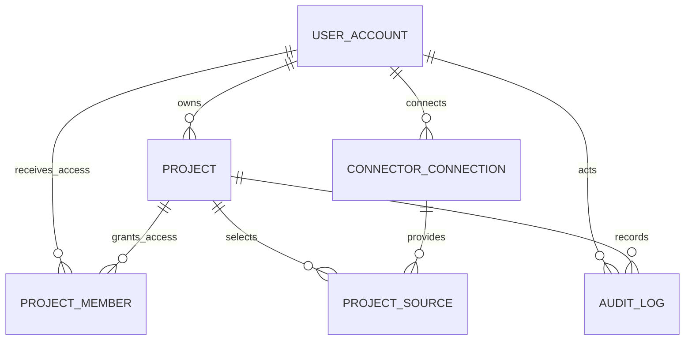

# 플랫폼 운영·권한 DB 설계

> 기준: Figma `Page 3-C | 플랫폼 운영·권한 RDBMS`  
> 적용 범위: 단일 조직용 AI 프로젝트 운영 코파일럿 1차 구현  
> 저장소: PostgreSQL RDBMS

## 1. 설계 결정

1. 1차 플랫폼은 여러 고객사가 입점하는 멀티테넌트 SaaS가 아니다.
2. `TENANT`, `TENANT_MEMBER`, 공통 `tenant_id`를 사용하지 않는다.
3. `USER_ACCOUNT`는 플랫폼 로그인 사용자이고 `PERSON`은 업무 배정 후보 직원이다.
4. 프로젝트 분석·추천 데이터의 중심은 기존 3-B `PROJECT`다.
5. Connector 계정 연결과 프로젝트별 분석 범위를 분리한다.
6. 비밀번호, OAuth access token, refresh token 원문을 일반 컬럼·응답·로그에 저장하지 않는다.

## 2. 전체 관계



```text
USER_ACCOUNT
 ├─ PROJECT.owner_account_id
 ├─ PROJECT_MEMBER ── PROJECT
 ├─ CONNECTOR_CONNECTION
 │       └─ PROJECT_SOURCE ── PROJECT
 └─ AUDIT_LOG ── PROJECT
```

## 3. 테이블 정의

### 3.1 USER_ACCOUNT

플랫폼 인증과 화면 표시를 위한 사용자 계정이다. Django의 `AUTH_USER_MODEL`과 대응한다.

| 필드 | 타입 예시 | 제약 | 의미 |
|---|---|---|---|
| `account_id` | BIGINT | PK | Django `accounts.User.id`에 대응하는 플랫폼 계정 ID |
| `email` | VARCHAR(320) | NOT NULL, UNIQUE | 로그인 이메일 |
| `password_hash` | VARCHAR | NOT NULL | Django 인증 체계가 생성한 비밀번호 해시 |
| `display_name` | VARCHAR(100) | NOT NULL | 화면 표시 이름 |
| `account_status` | VARCHAR(20) | NOT NULL | `ACTIVE/LOCKED/WITHDRAWN` |
| `last_login_at` | TIMESTAMPTZ | NULL | 최근 로그인 시각 |
| `created_at` | TIMESTAMPTZ | NOT NULL | 가입 시각 |
| `updated_at` | TIMESTAMPTZ | NOT NULL | 수정 시각 |

논리 모델의 `password_hash`는 Django 물리 모델의 `password` 필드에 대응한다. 평문 비밀번호를 직접 할당하지 않고 Django의 비밀번호 설정·검증 함수를 사용한다.

### 3.2 PROJECT 보강

`PROJECT`는 3-B에 이미 존재하므로 3-C에 중복 생성하지 않는다.

| 보강 필드 | 타입 예시 | 제약 | 의미 |
|---|---|---|---|
| `owner_account_id` | BIGINT | FK, NOT NULL | 프로젝트 생성·관리 PM |
| `created_at` | TIMESTAMPTZ | NOT NULL | 생성 시각 |
| `updated_at` | TIMESTAMPTZ | NOT NULL | 수정 시각 |

`owner_account_id`는 소유권의 기본값이다. 세부 접근권한은 `PROJECT_MEMBER`로 관리한다.

### 3.3 PROJECT_MEMBER

플랫폼 사용자의 프로젝트별 접근권한을 관리한다.

| 필드 | 타입 예시 | 제약 | 의미 |
|---|---|---|---|
| `project_member_id` | UUID | PK | 프로젝트 멤버 ID |
| `project_id` | UUID | FK, NOT NULL | 대상 프로젝트 |
| `account_id` | BIGINT | FK, NOT NULL | 플랫폼 사용자 |
| `access_role` | VARCHAR(20) | NOT NULL | `OWNER/EDITOR/VIEWER` |
| `joined_at` | TIMESTAMPTZ | NOT NULL | 권한 부여 시각 |

제약조건:

- `(project_id, account_id)` UNIQUE
- 프로젝트 소유자는 최소 `OWNER` 권한을 가진다.
- `VIEWER`는 추천·검증 결과를 수정하거나 PM 결정을 생성할 수 없다.

### 3.4 CONNECTOR_CONNECTION

사용자가 Google Drive 또는 Jira 계정을 연결한 상태를 관리한다.

| 필드 | 타입 예시 | 제약 | 의미 |
|---|---|---|---|
| `connection_id` | UUID | PK | Connector 연결 ID |
| `account_id` | BIGINT | FK, NOT NULL | 연결을 생성한 플랫폼 사용자 |
| `connector_type` | VARCHAR(30) | NOT NULL | `GOOGLE_DRIVE/JIRA` |
| `provider_account_id` | VARCHAR | NULL | 외부 서비스 계정 ID |
| `provider_email` | VARCHAR(320) | NULL | 사용자 확인용 외부 계정 이메일 |
| `auth_status` | VARCHAR(20) | NOT NULL | `CONNECTED/EXPIRED/REVOKED/ERROR` |
| `encrypted_credential_ref` | VARCHAR | NOT NULL | 암호화된 자격증명 저장소 참조 |
| `granted_scopes` | JSONB | NOT NULL | OAuth에서 허용된 Scope |
| `connected_at` | TIMESTAMPTZ | NOT NULL | 연결 시각 |
| `expires_at` | TIMESTAMPTZ | NULL | 자격증명 만료 예정 시각 |
| `last_error_code` | VARCHAR | NULL | 최근 연결 오류 코드 |
| `updated_at` | TIMESTAMPTZ | NOT NULL | 상태 수정 시각 |

자격증명 원문은 API 응답, 애플리케이션 로그, `AUDIT_LOG.payload`에 포함하지 않는다.

### 3.5 PROJECT_SOURCE

연결된 계정 중 특정 프로젝트가 실제로 분석할 외부 범위를 관리한다.

| 필드 | 타입 예시 | 제약 | 의미 |
|---|---|---|---|
| `project_source_id` | UUID | PK | 프로젝트 연동 대상 ID |
| `project_id` | UUID | FK, NOT NULL | 내부 프로젝트 |
| `connection_id` | UUID | FK, NOT NULL | 사용한 Connector 연결 |
| `source_type` | VARCHAR(30) | NOT NULL | `DRIVE_FOLDER/JIRA_PROJECT` |
| `external_source_id` | VARCHAR | NOT NULL | Drive folderId 또는 Jira project ID/key |
| `display_name` | VARCHAR | NULL | 화면 표시명 |
| `sync_status` | VARCHAR(20) | NOT NULL | `PENDING/SYNCING/SUCCESS/PARTIAL_RESULT/ERROR` |
| `last_synced_at` | TIMESTAMPTZ | NULL | 마지막 성공 동기화 시각 |
| `is_active` | BOOLEAN | NOT NULL | 현재 분석 범위 사용 여부 |
| `created_at` | TIMESTAMPTZ | NOT NULL | 등록 시각 |
| `updated_at` | TIMESTAMPTZ | NOT NULL | 수정 시각 |

제약조건:

- `(project_id, source_type, external_source_id)` UNIQUE
- `source_type=DRIVE_FOLDER`이면 Google Drive 연결만 참조한다.
- `source_type=JIRA_PROJECT`이면 Jira 연결만 참조한다.
- 연결이 `EXPIRED/REVOKED`이면 신규 동기화를 시작하지 않는다.

`CONNECTOR_SCOPE`는 이 테이블과 역할이 겹치므로 별도로 만들지 않는다.

### 3.6 AUDIT_LOG

사용자의 주요 행위와 프로젝트 변경 이력을 기록한다.

| 필드 | 타입 예시 | 제약 | 의미 |
|---|---|---|---|
| `audit_id` | UUID | PK | 감사 로그 ID |
| `actor_account_id` | BIGINT | FK, NULL 허용 | 행위 사용자, 시스템 작업이면 NULL 가능 |
| `project_id` | UUID | FK, NULL 허용 | 관련 프로젝트 |
| `action` | VARCHAR(50) | NOT NULL | 수행 행위 |
| `target_type` | VARCHAR(50) | NOT NULL | 대상 엔터티 유형 |
| `target_id` | VARCHAR | NULL | 대상 식별자 |
| `payload` | JSONB | NOT NULL | 변경 전후 값·근거의 비민감 요약 |
| `occurred_at` | TIMESTAMPTZ | NOT NULL | 발생 시각 |

우선 기록할 행위:

- 로그인 성공·실패·잠금
- Connector 연결·만료·해제
- 프로젝트 연동 대상 추가·변경·비활성화
- Task 승인·수정·반려
- 추천 실행·재검증
- 추천 결과 승인·수정·반려
- 후속 Jira 쓰기 실행·실패

## 4. 3-B 실행 데이터와 연결

| 3-B 필드 | 3-C 참조 |
|---|---|
| `PROJECT.owner_account_id` | `USER_ACCOUNT.account_id` |
| `ANALYSIS_SNAPSHOT.created_by` | `USER_ACCOUNT.account_id` |
| `ASSIGNMENT_RUN.requested_by` | `USER_ACCOUNT.account_id` |
| `DECISION_RECORD.decided_by` | `USER_ACCOUNT.account_id` |
| `DOCUMENT.project_id` | `PROJECT_SOURCE.project_id`를 통해 수집 범위 확인 |
| `EXISTING_TASK.project_key` | `PROJECT_SOURCE.external_source_id`와 Jira 프로젝트 범위 확인 |

## 5. 권한 판단

| 작업 | OWNER | EDITOR | VIEWER |
|---|---:|---:|---:|
| 프로젝트 조회 | 가능 | 가능 | 가능 |
| 문서·Jira 연결 범위 변경 | 가능 | 가능 | 불가 |
| Task 승인·수정 | 가능 | 가능 | 불가 |
| 추천 실행 | 가능 | 가능 | 불가 |
| PM 최종 결정 | 가능 | 정책에 따라 가능 | 불가 |
| 프로젝트 멤버 관리 | 가능 | 불가 | 불가 |

## 6. 생성 순서

```text
1. USER_ACCOUNT
2. PROJECT
3. PROJECT_MEMBER
4. CONNECTOR_CONNECTION
5. PROJECT_SOURCE
6. AUDIT_LOG
7. 기존 Snapshot·실행·결정 테이블의 사용자 FK 연결
```

## 7. 현재 Django 베이스 코드와의 매핑

| 논리 모델 | 현재 코드 | 확인·수정 사항 |
|---|---|---|
| `USER_ACCOUNT` | `apps.accounts.models.User` | `account_id`는 현재 `User.id` BigAutoField 사용 |
| `password_hash` | Django `User.password` | Django 해시 함수만 사용 |
| `email UNIQUE` | 현재 `AbstractUser.email` | 이메일 로그인 정책을 적용하려면 UNIQUE·로그인 식별자 설정 필요 |
| `PROJECT.owner_account_id` | `Project.owner` | 현재 nullable이므로 초기 데이터 정리 후 필수 전환 여부 확정 |
| 추천 실행 요청자 | `AnalysisRun.requested_by` | Canonical `ASSIGNMENT_RUN.requested_by`와 명칭 매핑 필요 |

현재 `User.role`은 플랫폼 전역 역할이고, 프로젝트별 권한은 `PROJECT_MEMBER.access_role`로 별도 관리한다. 전역 역할만으로 프로젝트 접근을 판단하지 않는다.

## 8. 1차 구현 최소 범위

반드시 구현:

- `USER_ACCOUNT`
- `PROJECT.owner_account_id`
- `PROJECT_MEMBER`
- `CONNECTOR_CONNECTION`
- `PROJECT_SOURCE`
- 주요 행위 `AUDIT_LOG`

후속 가능:

- 세분화된 권한 정책 테이블
- 알림 테이블
- 로그인 세션·기기 관리 화면
- Connector 자격증명 자동 갱신 운영 고도화
