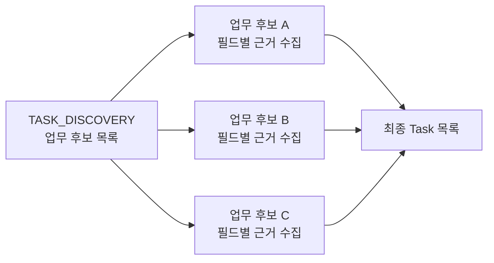
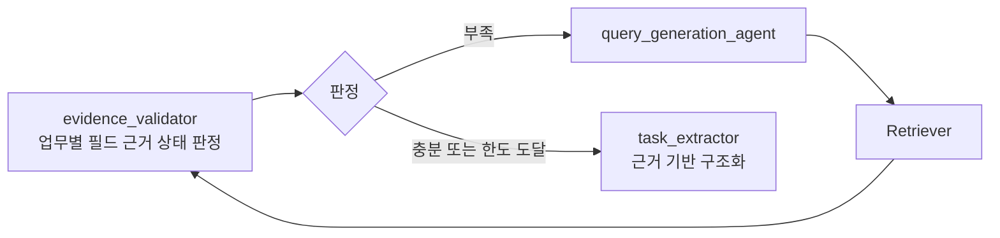
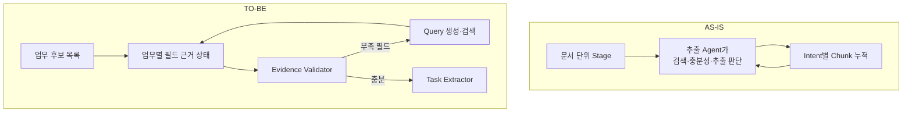

# Agent1 AS-IS 점검과 TO-BE 개선 후보

> 기준: 2026-08-04 중간발표  
> AS-IS: 원빈님 설계에서 Mock Agent·하드코딩·Placeholder를 제외한 두 Agent 기반 업무 추출 Loop  
> TO-BE: AS-IS를 실행·검토하며 확인한 로직 한계를 개선하는 후속 설계

## 1. 점검 결론

AS-IS의 핵심인 `업무 추출 Agent → Query 생성 Agent → Retriever → 근거 보강` Loop는 중간발표 기준선으로 사용할 수 있다. 다만 “검색을 반복한다”만으로는 여러 업무의 필드별 근거를 안정적으로 채웠다고 보기 어렵다. 현재 발표에서는 동작 구조와 한계를 분리하고, 아래 개선 후보 중 우선순위 1~3을 TO-BE로 제시하는 것이 적절하다.

## 2. AS-IS 점검 결과

| 점검 항목 | 현재 상태 | 중간발표 판단 |
|---|---|---|
| 입력 범위 | 대표 요청 문서와 허용 `document_ids` 사용 | 유지 |
| Agent 책임 | 추출 Agent와 Query 생성 Agent 분리 | 유지하되 추출 Agent 책임 과다를 한계로 설명 |
| 검색 Loop | `SEARCH → QueryPlan → Retriever → merge → 재판단` | AS-IS 핵심 |
| 근거 추적 | Task가 복수 `evidence_chunk_ids` 보유 | 유지 |
| 누락 처리 | 근거 없는 값은 `null/[]/missing_fields` | 유지 |
| Mock Agent | Rule-based 추출·Query 생성과 고정 결과 존재 | 발표·운영 경로에서 제거 |
| Retriever | 단어 중복 기반 InMemory 구현 | 테스트 Adapter로만 구분 |
| 업무량 | Task 공수를 옮기는 Placeholder | 최신 main의 결정론적 계산 모듈과 별개임을 명시 |
| 후보 분석 | 빈 배열 Placeholder | Agent1 발표 흐름에서 제외 |
| Validation | 근거 ID 존재 여부만 검사 | TO-BE 핵심 후보 |

## 3. TO-BE 우선순위

### 우선순위 1. 문서 단위 Stage를 업무별 근거 수집으로 개선

#### AS-IS 문제

현재 Graph는 문서 전체에 대해 `TASK_DISCOVERY → TASK_CORE → ASSIGNMENT_REQUIREMENT → EXECUTION_CONDITION`을 각각 한 번씩 진행한다. 업무 후보가 여러 개이면 어떤 역할·기술·공수 근거가 어느 업무에 속하는지 명확하지 않을 수 있다.

#### TO-BE

`TASK_DISCOVERY`에서 업무 후보를 먼저 식별한 뒤, 각 `task_candidate_id`별로 필요한 필드와 근거를 관리한다.



#### 기대 효과

- 역할·공수·일정이 다른 업무에 잘못 연결되는 문제 감소
- 특정 업무에 부족한 정보만 Query로 요청 가능
- 업무별 검색 종료와 누락 사유 설명 가능

### 우선순위 2. Intent 중심 Chunk 분류를 필드별 근거 매핑으로 개선

#### AS-IS 문제

검색 Chunk에는 요청 당시의 `intent` 하나가 붙고, 현재 단계는 같은 Intent의 Chunk만 확인한다. 하나의 Chunk가 업무·역할·일정을 모두 포함해도 다른 단계에서 재사용되지 않거나 동일 Chunk를 다시 검색할 수 있다.

#### TO-BE

검색 Intent는 검색 이력으로 남기되, Chunk 근거는 Task의 어떤 필드를 지지하는지 별도로 매핑한다.

```json
{
  "chunk_id": "DOC-001:chunk:0021",
  "retrieved_by": "TASK_CORE",
  "supports": [
    {"task_candidate_id": "candidate-01", "fields": ["description", "required_role", "required_skills"]}
  ]
}
```

#### 기대 효과

- 하나의 근거를 여러 필드에서 재사용
- 불필요한 재검색과 Token 사용 감소
- 결과 화면에서 필드별 출처 설명 가능

### 우선순위 3. 추출과 근거 충분성 검증 책임 분리

#### AS-IS 문제

`extract_tasks_agent`가 업무 구조화뿐 아니라 근거 충분성, 검색 여부, Stage 전환까지 판단한다. 멘토 피드백에서 이름과 책임이 섞인 지점으로 확인됐다.

#### TO-BE



Validator가 출력할 최소 상태:

- `sufficient_fields`
- `missing_fields`
- `conflicting_fields`
- `low_quality_evidence`
- `next_action`: `SEARCH`, `EXTRACT`, `REVIEW`

#### 기대 효과

- 동일 근거에서 추출 결과가 달라지는 문제와 검색 판단 불일치 감소
- Node 이름과 실제 책임 일치
- 추후 Human Review 연결점 확보

### 우선순위 4. 고정 횟수에서 검색 수렴도 기반 종료로 개선

#### AS-IS 문제

단계별 2회, Query 최대 3개, 누적 Chunk 20개는 종료 보장을 위한 초기값이지만 품질 근거가 없다.

#### TO-BE

하드 상한은 안전장치로 유지하되 다음 수렴 신호를 함께 사용한다.

- 이전 검색 대비 새 Chunk 수
- 새로 채워진 필드 수
- 같은 Query·Chunk 반복률
- 충돌 근거 해소 여부
- 검색 비용과 Token 예산

새 근거와 필드 변화가 없으면 상한 전에 종료하고 `NO_NEW_EVIDENCE`를 남긴다.

### 우선순위 5. Validation을 결과 상태로 확장

#### AS-IS 문제

현재 `task_tools`는 근거 ID가 실제 누적 Chunk에 존재하는지만 확인한다. 해당 문장이 필드값을 실제로 뒷받침하는지, 근거가 충돌하는지는 판단하지 않는다.

#### TO-BE

```text
근거 존재·범위 검증
→ 필드별 근거 정합성 검증
→ 품질·충돌 검증
→ ACCEPT / RETRY / REVIEW
```

Confidence 임계값은 중간발표에서 임의로 확정하지 않는다. 정답 Task·Chunk가 표시된 평가셋으로 보정하기 전에는 규칙 기반 상태와 산출 근거를 우선 제시한다.

## 4. 중간발표에서 선택할 TO-BE

발표에서는 다음 세 가지를 묶어 하나의 개선 이야기로 제시한다.

1. 문서 전체 단계를 **업무 후보별 필드 수집**으로 세분화한다.
2. 검색 Intent에 묶인 근거를 **업무·필드별 근거 매핑**으로 바꾼다.
3. 추출 Agent에 섞인 충분성 판단을 **Evidence Validator**로 분리한다.



발표 설명:

> AS-IS는 단계별로 필요한 근거를 검색해 업무를 생성하는 Loop를 구현했다. 다만 여러 업무가 있을 때 근거가 어느 업무의 어떤 필드를 지지하는지 불명확하고, 추출 Agent가 검색 판단까지 담당한다. TO-BE에서는 업무 후보별 근거 상태와 필드별 출처를 관리하고, 충분성 판단을 Validator로 분리해 검색 정확성과 설명 가능성을 높인다.

## 5. 평가 계획

TO-BE 개선 효과는 다음 지표로 비교한다.

| 지표 | 확인할 질문 |
|---|---|
| 업무 후보 재현율 | 정답 업무를 얼마나 놓치지 않았는가 |
| 필드 근거 정확도 | 역할·공수·일정 값이 올바른 Chunk에 연결됐는가 |
| 근거 없는 값 생성률 | 문서에 없는 값을 만들지 않았는가 |
| 평균 검색 횟수 | 같은 결과를 더 적은 검색으로 얻었는가 |
| 중복 Chunk 비율 | 이미 확인한 근거를 반복해서 가져오지 않았는가 |
| 미결 상태 정확성 | 찾지 못한 값을 누락·충돌·검색 실패로 올바르게 구분했는가 |

## 6. 구현 전 확인 항목

- 파싱·청킹/Retriever의 최종 Chunk 계약이 `text/raw_text`인지 확인한다.
- 실제 Retriever가 `project_id`, `document_ids`, `exclude_chunk_ids`, 문맥 확장을 지원하는지 확인한다.
- Query 수·검색 횟수·Chunk 예산은 기본값과 평가로 조정할 값으로 구분한다.
- 원빈님 노트북과 기존 `services/agent1` 중 어떤 코드를 기준으로 통합할지 결정한다.
- 업무량은 최신 main의 `services/workload/calculator.py`를 단일 계산 기준으로 사용한다.

