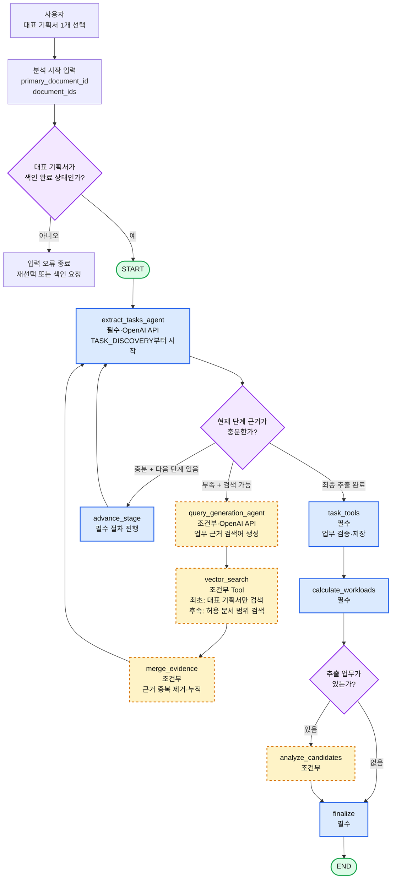
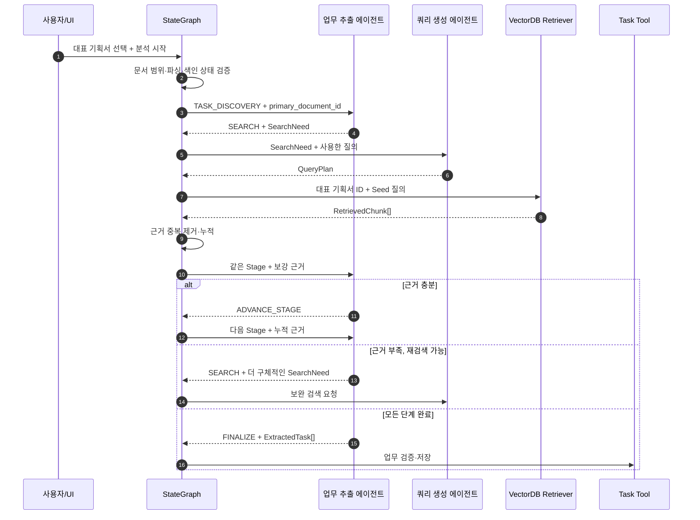
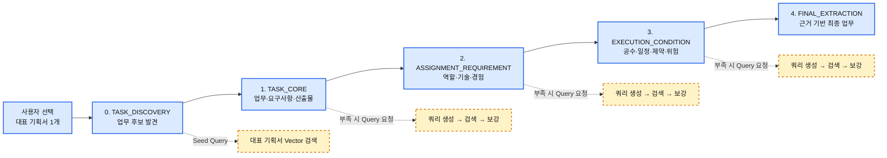

# 업무 근거 쿼리 생성 에이전트 다이어그램

## 1. 전체 StateGraph

```mermaid
flowchart TD
    USER["사용자<br/>대표 기획서 1개 선택"] --> INPUT["분석 시작 입력<br/>primary_document_id<br/>document_ids"]
    INPUT --> VALIDATE{"대표 기획서가<br/>색인 완료 상태인가?"}
    VALIDATE -->|아니오| ERROR["입력 오류 종료<br/>재선택 또는 색인 요청"]
    VALIDATE -->|예| START([START])
    START --> EXTRACT["extract_tasks_agent<br/>필수·OpenAI API<br/>TASK_DISCOVERY부터 시작"]

    EXTRACT --> DECISION{"현재 단계 근거가<br/>충분한가?"}
    DECISION -->|"부족 + 검색 가능"| QUERY["query_generation_agent<br/>조건부·OpenAI API<br/>업무 근거 검색어 생성"]
    QUERY --> SEARCH["vector_search<br/>조건부 Tool<br/>최초: 대표 기획서만 검색<br/>후속: 허용 문서 범위 검색"]
    SEARCH --> MERGE["merge_evidence<br/>조건부<br/>근거 중복 제거·누적"]
    MERGE --> EXTRACT

    DECISION -->|"충분 + 다음 단계 있음"| NEXT["advance_stage<br/>필수 절차 진행"]
    NEXT --> EXTRACT

    DECISION -->|"최종 추출 완료"| STORE["task_tools<br/>필수<br/>업무 검증·저장"]
    STORE --> WORKLOAD["calculate_workloads<br/>필수"]
    WORKLOAD --> ROUTE{"추출 업무가<br/>있는가?"}
    ROUTE -->|있음| CANDIDATE["analyze_candidates<br/>조건부"]
    ROUTE -->|없음| FINALIZE["finalize<br/>필수"]
    CANDIDATE --> FINALIZE
    FINALIZE --> END([END])

    classDef required fill:#dbeafe,stroke:#2563eb,stroke-width:2px,color:#111;
    classDef optional fill:#fef3c7,stroke:#d97706,stroke-width:2px,stroke-dasharray:5 5,color:#111;
    classDef decision fill:#f3e8ff,stroke:#9333ea,stroke-width:2px,color:#111;
    classDef terminal fill:#dcfce7,stroke:#16a34a,stroke-width:2px,color:#111;

    class EXTRACT,NEXT,STORE,WORKLOAD,FINALIZE required;
    class QUERY,SEARCH,MERGE,CANDIDATE optional;
    class VALIDATE,DECISION,ROUTE decision;
    class START,END terminal;
```

## 2. 에이전트 간 통신 시퀀스

```mermaid
sequenceDiagram
    autonumber
    participant U as 사용자/UI
    participant O as StateGraph
    participant E as 업무 추출 에이전트
    participant Q as 쿼리 생성 에이전트
    participant V as VectorDB Retriever
    participant T as Task Tool

    U->>O: 대표 기획서 선택 + 분석 시작
    O->>O: 문서 범위·파싱·색인 상태 검증
    O->>E: TASK_DISCOVERY + primary_document_id
    E-->>O: SEARCH + SearchNeed
    O->>Q: SearchNeed + 사용한 질의
    Q-->>O: QueryPlan
    O->>V: 대표 기획서 ID + Seed 질의
    V-->>O: RetrievedChunk[]
    O->>O: 근거 중복 제거·누적
    O->>E: 같은 Stage + 보강 근거

    alt 근거 충분
        E-->>O: ADVANCE_STAGE
        O->>E: 다음 Stage + 누적 근거
    else 근거 부족, 재검색 가능
        E-->>O: SEARCH + 더 구체적인 SearchNeed
        O->>Q: 보완 검색 요청
    else 모든 단계 완료
        E-->>O: FINALIZE + ExtractedTask[]
        O->>T: 업무 검증·저장
    end
```

## 3. 고정 업무 추출 절차

```mermaid
flowchart LR
    S["사용자 선택<br/>대표 기획서 1개"] --> DISC["0. TASK_DISCOVERY<br/>업무 후보 발견"]
    DISC --> A["1. TASK_CORE<br/>업무·요구사항·산출물"] --> B["2. ASSIGNMENT_REQUIREMENT<br/>역할·기술·경험"]
    B --> C["3. EXECUTION_CONDITION<br/>공수·일정·제약·위험"]
    C --> F["4. FINAL_EXTRACTION<br/>근거 기반 최종 업무"]

    DISC -. "Seed Query" .-> DQ["대표 기획서 Vector 검색"]
    A -. "부족 시 Query 요청" .-> AQ["쿼리 생성 → 검색 → 보강"]
    B -. "부족 시 Query 요청" .-> BQ["쿼리 생성 → 검색 → 보강"]
    C -. "부족 시 Query 요청" .-> CQ["쿼리 생성 → 검색 → 보강"]

    classDef stage fill:#dbeafe,stroke:#2563eb,stroke-width:2px,color:#111;
    classDef loop fill:#fef3c7,stroke:#d97706,stroke-width:2px,stroke-dasharray:5 5,color:#111;
    class S,DISC,A,B,C,F stage;
    class DQ,AQ,BQ,CQ loop;
```

파란색 실선 노드는 모든 정상 실행에서 거치는 필수 절차이고, 노란색 점선 노드는 근거가 부족할 때만 실행되는 조건부 검색 루프다.
