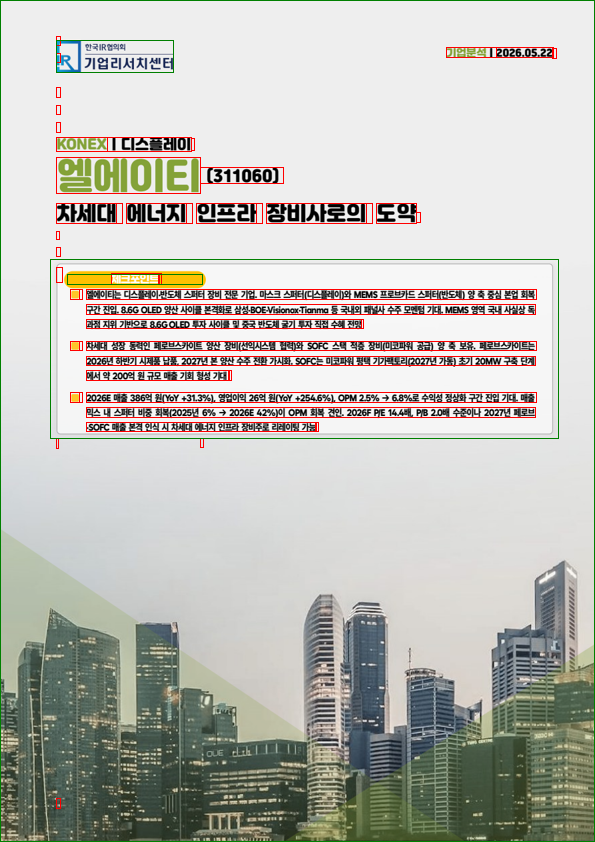
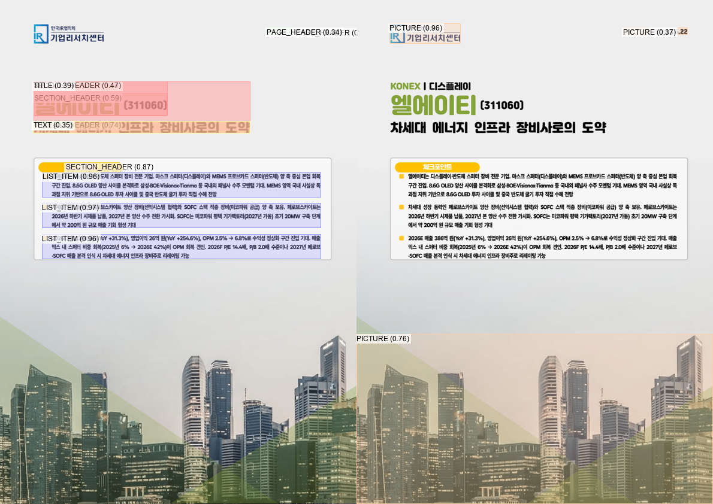
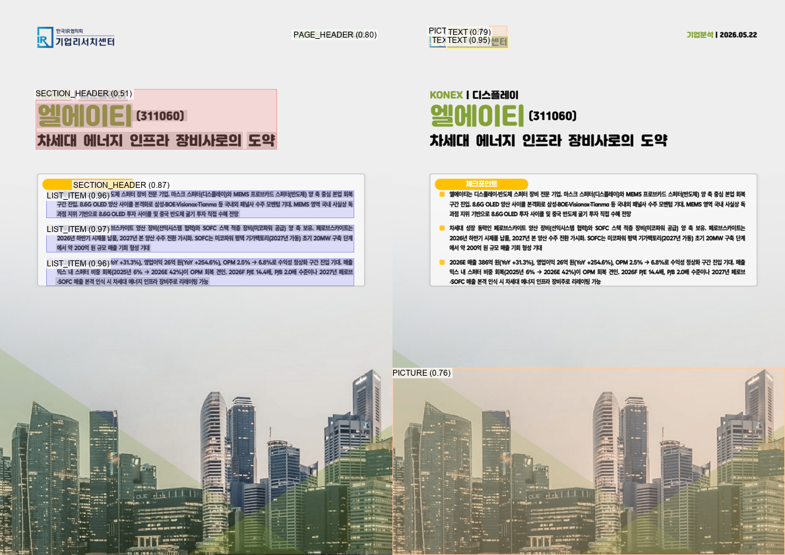
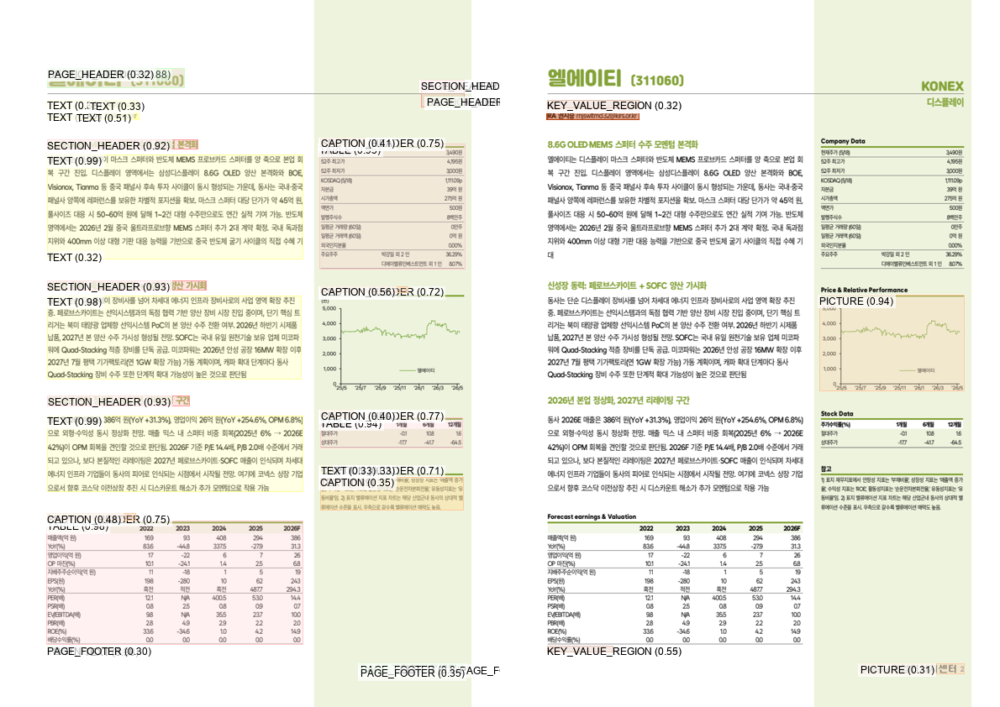
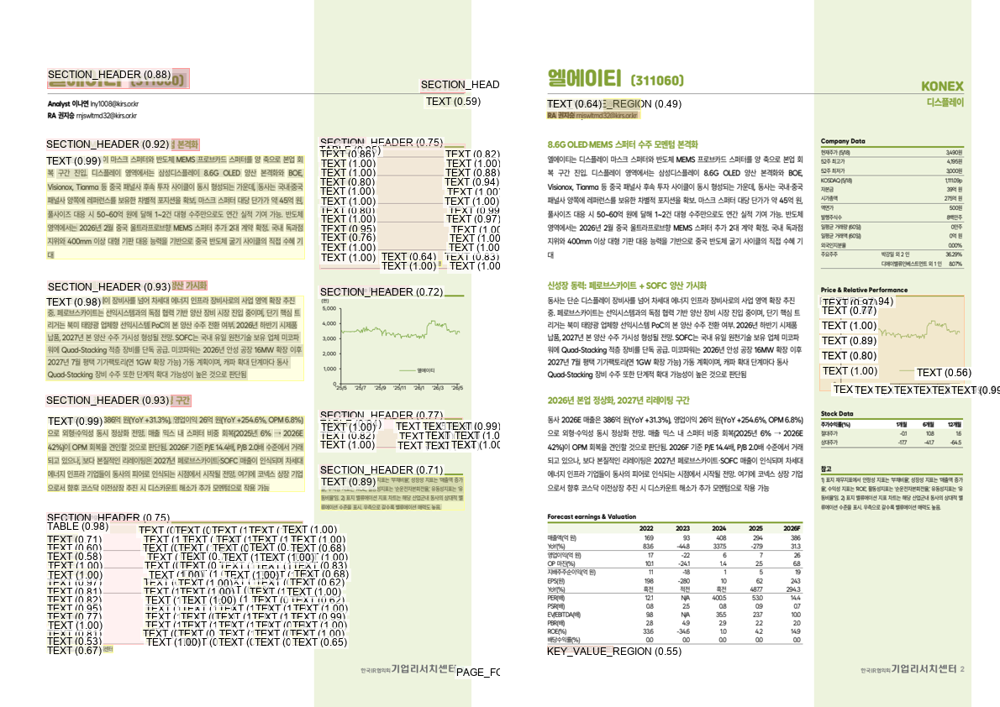
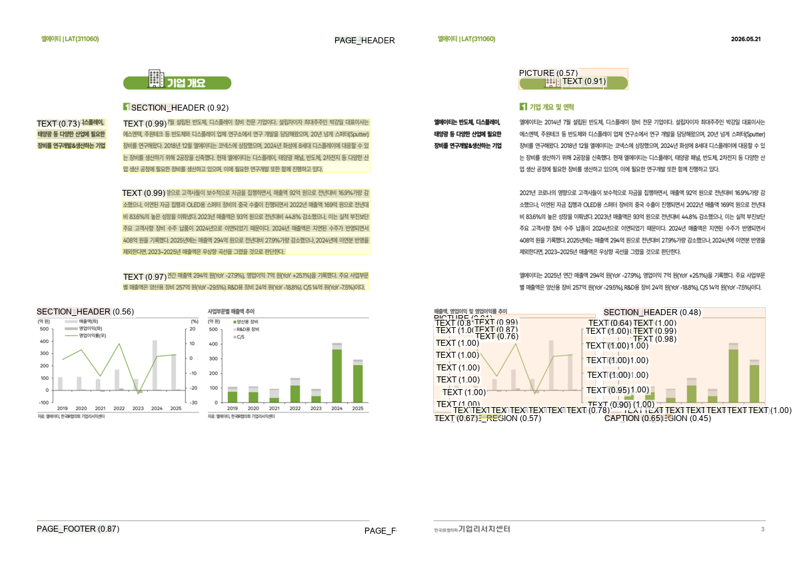
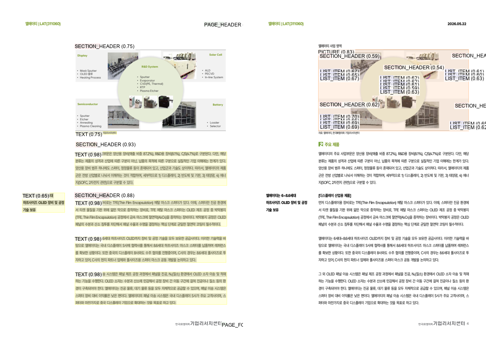
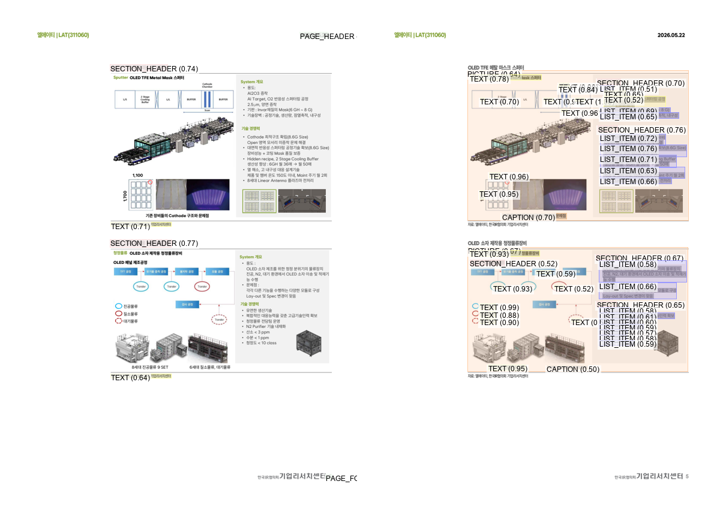

# Docling 기반 문서 구조 파싱

## 중간 발표 자료 구성안

**발표 주제**  
Docling의 기본 구조와 파라미터 튜닝, 현재 구현 결과 및 향후 계획

**구현 기준**  
`C:\final_project\parser\base\docling_base_parser.ipynb`

> 각 `---` 구분선은 하나의 발표 슬라이드를 의미한다.

---

# 1. 왜 문서 파싱이 필요한가

### 목표

> PDF와 DOCX를 단순 텍스트가 아닌, 문서 구조가 보존된 JSON으로 변환한다.

```text
원본 문서
  ↓
텍스트 · 헤딩 · 표 · 이미지 분석
  ↓
문서 구조 복원
  ↓
Markdown + Docling JSON
```

### 우리가 해결하려는 문제

- 텍스트의 누락·중복 없이 정확하게 추출
- 제목과 본문을 구분하고 제목 깊이 복원
- 복잡한 표의 행·열·병합 구조 복원
- 이미지 안의 글자·차트·도표를 각각 분석

---

# 2. Docling의 기본 구조

```text
DocumentConverter
├─ PDF Pipeline
│  ├─ PDF Backend
│  ├─ Layout Model
│  ├─ OCR
│  ├─ TableFormer
│  ├─ Picture / Chart 분석
│  └─ Reading Order + Heading Hierarchy
└─ DOCX Pipeline
   ├─ Word 문서 구조 직접 해석
   └─ Picture / Chart 분석
```

| 구성 요소 | 역할 |
|---|---|
| PDF Backend | PDF 내부 텍스트, 좌표, 글꼴 정보 추출 |
| Layout Model | 본문, 제목, 표, 그림 등의 영역 분류 |
| OCR | 이미지 기반 글자 인식 |
| TableFormer | 표의 행·열·셀 구조 복원 |
| Reading Order | 문서의 읽기 순서 조립 |
| Heading Hierarchy | 검출된 제목의 깊이 추론 |

---

# 3. PDF가 JSON으로 변환되는 과정

```text
PDF Backend ── 텍스트와 bbox ─────────┐
                                      ├─→ Layout 후처리
Layout Model ─→ OCR 영역 ─→ OCR 결과 ─┘        ↓
                                           문서 조립
                                              ↓
                              texts / tables / pictures / groups
```

### 꼭 구분해야 하는 세 가지

```text
텍스트 인식
= 어떤 문자열이 존재하는가

레이아웃 분류
= 해당 영역이 본문·제목·표·그림 중 무엇인가

구조 추론
= 제목 깊이, 표 행·열, 읽기 순서가 어떻게 연결되는가
```

---

# 4. 현재 구현 범위

### 입력과 출력

| 구분 | 현재 구현 |
|---|---|
| 입력 | PDF, DOCX |
| 출력 | Markdown, Docling JSON |
| OCR | EasyOCR |
| OCR 언어 | 한국어 + 영어 |
| OCR 영역 | Layout model이 검출한 영역 |
| 헤딩 계층 | 활성화 |
| 표 구조 분석 | 활성화 |
| 그림 분류 | 활성화 |
| 그림 설명 | 활성화 |
| 차트 추출 | 활성화 |

### 현재 코드의 역할

```text
문서 입력
  → 형식별 Pipeline 실행
  → DoclingDocument 생성
  → Markdown 저장
  → JSON 저장
```

---

# 5. 파라미터를 이렇게 설정한 이유

### OCR: `ko + en`

- 한국어 본문과 영문 제품명·약어를 함께 처리
- 기업 보고서와 기술 문서의 혼합 언어 대응

### OCR 영역: `LAYOUT_REGIONS`

- 페이지 전체가 아닌 필요한 영역 중심으로 OCR
- 처리량과 중복 인식 감소
- 같은 조건에서 결과를 비교하기 위한 기준 설정

### 표: `ACCURATE + Cell Matching`

- 속도보다 복잡한 표 구조의 정확도 우선
- 예측한 표 셀에 실제 PDF/OCR 텍스트 연결

### 헤딩 계층 활성화

- Bookmark, 제목 번호, 글꼴 스타일을 활용
- 이미 제목으로 검출된 항목의 깊이를 추론

### 그림 분석 기능 활성화

- 그림 분류, 설명, 차트 추출 경로를 초기 기준에 포함
- 이후 이미지 분석 고도화의 기반 확보

---

# 6. 현재 설정의 핵심 한계

### 헤딩

- 헤딩 계층 기능은 제목을 새로 찾는 모델이 아님
- Layout Model이 제목을 본문으로 분류하면 깊이 추론 불가능
- 글꼴 기반 추론에는 중간 style 정보 보존이 필요

### OCR

- Layout Model이 놓친 영역은 OCR 대상에서도 빠질 수 있음
- 작은 글자와 이미지 내부 텍스트는 현재 해상도에서 불리

### 표

- 표 구조 설정이 기본값에 의존
- 페이지를 넘어가는 표는 페이지별 객체로 나뉠 수 있음

### 이미지

- 하나의 복합 도식과 내부 요소의 관계를 동시에 표현하기 어려움
- 작은 차트 글자와 범례가 일반 텍스트로 파편화될 수 있음

---

# 7. 디버깅 이미지를 보는 방법

```text
① cells
PDF Backend가 무엇을 읽었는가?
          ↓
② ocr
필요한 이미지 글자를 OCR이 읽었는가?
          ↓
③ raw_layout
모델이 영역과 라벨을 맞게 예측했는가?
          ↓
④ postprocessed_layout
후처리 뒤에도 구조가 유지됐는가?
          ↓
⑤ Final JSON
읽기 순서와 계층이 올바른가?
```

---

# 8. 문제 사례 ① 표지의 중첩 영역







### 발견한 문제

- 로고가 그림과 텍스트로 중복 해석될 가능성
- 여러 제목 줄에 `TITLE`, `SECTION_HEADER`, `TEXT` 후보가 중첩
- 장식용 배경 이미지와 핵심 콘텐츠의 구분 필요
- 상위 문구와 본 제목 사이의 계층 관계가 불명확

### 보완 방향

- 반복 로고·페이지 헤더·장식 배경 분리
- 중첩 bbox의 라벨 우선순위 설정
- 표지 전용 title hierarchy와 reading order 보완

---

# 9. 문제 사례 ② 다중 컬럼과 표





### 발견한 문제

- 본문, Company Data, 차트, 표의 읽기 순서가 섞일 가능성
- 표와 차트 내부의 작은 글자가 다수의 `TEXT` 객체로 분리
- 차트가 그림이 아닌 제목·본문·캡션 조합으로 분해
- 재무 표의 셀 텍스트가 과도하게 파편화

### 보완 방향

```text
컬럼 영역 우선 분리
  → 컬럼 내부의 세로 읽기 순서 계산
  → 표 bbox에는 TableFormer 구조 우선 적용
  → 차트 제목·축·범례를 picture 하위 요소로 연결
```

---

# 10. 문제 사례 ③ 차트와 복합 이미지

### 차트 사례



- 축·범례·숫자가 독립 텍스트로 파편화
- 차트 제목이 문서 헤딩으로 잘못 포함될 가능성
- 차트와 주변 설명의 관계가 불명확

### 복합 도식 사례





- 하나의 도식 안에 사진·라벨·목록이 중첩
- 그림 내부 목록이 본문 요소와 혼합
- 전체 그림과 개별 요소의 관계가 분산

### 보완 방향

```text
전체 복합 이미지 영역 검출
  → 내부 사진·차트·라벨·텍스트 영역 재분리
  → Parent Picture - Child Region 관계 생성
  → 요소별 설명을 전체 설명으로 통합
```

---

# 11. 구현 범위 구분

## 구현 범위

| 구분 | 중간 발표에서 보여줄 부분 | 중간 발표 이후 발전시킬 부분 |
|---|---|---|
| 텍스트 | 정확한 본문 추출, 누락·중복·파편화 개선 | 이미지·스캔 영역의 OCR 정확도 향상 |
| 레이아웃 | 다중 컬럼 구분과 정확한 읽기 순서 | 이미지 내부의 복합 레이아웃 분리 |
| 헤딩 | 제목 검출과 섹션 깊이 추론 | 이미지 안의 제목·라벨과 본문 구조 연결 |
| 표 | 다중 컬럼 속 표, 병합 셀, 페이지 연속 표 구조 파싱 | 이미지로 삽입된 표의 OCR 및 구조 복원 |
| 이미지 | 디버그 이미지로 현재 문제점과 원인 제시 | 사진·도표·차트의 crop 분리와 상세 설명 |
| 최종 JSON | 텍스트·헤딩·표 중심 구조화 결과 | 이미지 결과를 결합한 뒤 검증·보완 레이어 추가 |

### 범위 경계

```text
[중간 발표 구현 범위]
텍스트 + 다중 컬럼 + 헤딩 깊이 + 표 구조

──────────────── 명확한 경계 ────────────────

[중간 발표 이후 발전 범위]
OCR 고도화 + 이미지 요소 분리 + 이미지 상세 설명
                    ↓
             검증·보완 레이어
                    ↓
          완전하게 파싱된 JSON
```

> 8~10번 슬라이드의 이미지는 현재 문제를 설명하기 위해 중간 발표에서 보여준다.  
> 다만 이미지 OCR·요소 분리·상세 설명의 실제 고도화는 중간 발표 이후 범위다.

---

# 12. 중간 발표에서 보여줄 구현 결과

## A. 텍스트의 정확한 추출

- PDF backend와 OCR에서 확보한 텍스트의 누락·중복 확인
- 과도하게 분리된 텍스트 객체의 조립 결과
- 반복 page header/footer와 장식 텍스트의 분리
- 다중 컬럼을 컬럼별 순서로 읽은 결과

### 중간 발표 완료 기준

```text
원문 텍스트 보존
+ 중복 최소화
+ 컬럼 간 순서가 섞이지 않음
+ 최종 JSON에서 page와 bbox 추적 가능
```

## B. 헤딩 섹션의 정확한 깊이 추론

- 일반 본문과 `section_header`의 구분
- Bookmark, Numbering, Style 단서를 이용한 제목 깊이
- 제목이 모두 같은 레벨로 평탄화되는 문제의 개선
- 반복 헤더·차트 제목·강조 문구의 거짓 헤딩 억제

### 중간 발표 완료 기준

```text
제목 검출 정확도
≠ 제목 깊이 정확도

두 결과를 분리해 확인하고
JSON의 label + level + prov로 제시
```

## C. 표의 정확한 구조 파싱

- 다중 컬럼 문서 안에서 표 영역과 본문 영역 분리
- 행·열·병합 셀 및 셀 텍스트 복원
- 페이지 하단 표와 다음 페이지 상단 표의 연속성 판단
- 반복 헤더, 열 수, 열 X 좌표, 데이터 타입을 이용한 연결

### 중간 발표 완료 기준

```text
표 bbox 검출
  → 행·열 구조
  → 병합 셀
  → 셀 텍스트
  → 페이지 연속 표 관계
```

> 중간 발표의 핵심 결과물은 **텍스트·헤딩·표 구조가 보존된 Docling JSON**이다.

---

# 13. 중간 발표 이후 발전시킬 부분

## A. OCR 및 이미지 텍스트 정확도 향상

- 작은 글자와 스캔 영역의 텍스트 인식 개선
- 이미지 안의 한글·영문·숫자 정확도 향상
- OCR 영역 정책과 이미지 배율 비교
- 한국어 문서에 적합한 OCR 엔진 비교
- 텍스트 검출 실패와 문자 인식 실패를 분리해 개선

## B. 이미지 내부 요소의 명확한 Crop 분리

- 사진, 표, 차트, 도표, 범례, 캡션, 텍스트 박스 분리
- 전체 이미지와 내부 요소를 parent-child 구조로 연결
- 오버래핑 bbox 처리
- 복합 도식 안의 여러 의미 단위를 계층적으로 분리

```text
전체 Picture
├─ Chart
│  ├─ Title
│  ├─ Axis
│  ├─ Legend
│  └─ Data Label
├─ Diagram
├─ Photograph
└─ Description Text
```

## C. 이미지 상세 설명 향상

- 단순 캡션이 아닌 구성 요소와 관계 설명
- 차트의 수치·추세와 OCR 문자열을 함께 활용
- 도표 내부 요소별 설명 생성
- 하위 요소 설명을 전체 이미지 설명으로 통합

## D. 최종 완성 단계

```text
텍스트·헤딩·표·이미지 파싱 결과
                 ↓
            검증 레이어
                 ↓
            보완 레이어
                 ↓
       완전하게 파싱된 JSON
```

> 검증·내용 보완 관련 기존 코드와 명세는 현재 발표의 구현 근거에 포함하지 않는다.  
> 계속 구현 중인 영역이므로 최종 발전 단계로만 제시한다.

---

# 14. 단계별 파라미터 튜닝 계획

## 중간 발표 범위에서 튜닝할 값

| 대상 | 비교 항목 | 확인 결과 |
|---|---|---|
| 텍스트·컬럼 | Layout 결과와 cell assignment | 누락, 중복, 읽기 순서 |
| 헤딩 단서 | Bookmark / Numbering / Style | 제목 깊이 정확도 |
| 표 모델 | Accurate / Fast / V2 후보 | 행·열·병합 셀 정확도 |
| Cell Matching | 적용 여부 | 셀 구조와 텍스트 보존 |

## 중간 발표 이후 튜닝할 값

| 대상 | 비교 항목 | 확인 결과 |
|---|---|---|
| OCR 영역 | Layout / PDF-aware / Full-page | 이미지 텍스트 누락과 중복 |
| OCR 해상도 | 기준 배율 / 상향 배율 | 작은 글자 정확도와 메모리 |
| OCR 엔진 | 한국어 지원 엔진 비교 | 문자 정확도와 처리 속도 |
| 이미지 Crop | 단일 bbox / 계층형 crop | 내부 요소 분리율 |
| 이미지 설명 | 전체 설명 / 요소별 통합 설명 | 설명의 구체성과 정확성 |

### 공통 실험 원칙

- 한 번에 하나의 값만 변경
- 동일 문서와 동일 페이지로 비교
- 텍스트 PDF, 스캔 PDF, 다중 컬럼, 연속 표, 복합 이미지로 문서 유형 분리

---

# 15. 결론: 중간 발표와 향후 계획

## 중간 발표에서 보여주는 것

```text
1. 텍스트의 정확한 추출
2. 다중 컬럼의 읽기 순서
3. 헤딩 섹션의 정확한 깊이 추론
4. 다중 컬럼·병합 셀·페이지 연속 표의 구조 파싱
5. Layout Debug 이미지를 통한 현재 문제와 원인 분석
```

## 중간 발표 이후 발전시키는 것

```text
1. OCR 및 이미지 텍스트 정확도 향상
2. 이미지 안의 표·차트·도표·사진 영역 분리
3. 오버래핑 영역과 복합 이미지의 계층형 crop
4. 이미지·차트 상세 설명 향상
5. 검증·보완 레이어를 결합한 완전한 JSON 생성
```

### 한 문장 요약

> 중간 발표에서는 **텍스트·헤딩·표의 구조 정확도**를 보여주고, 이후에는 **OCR·이미지 분석·검증 및 보완**으로 확장한다.

---

# 부록. 참고한 현재 구현 자료

- `base/docling_base_parser.ipynb`
- `base/도클링 텍스트 및 헤딩 추출 방법.md`
- `base/도클링 테이블 추출 방법.md`
- `base/도클링 호출 모델 및 교체 가능 범위.md`
- `docs/DOCLING_BASE_CONFIGURATION_SPEC.md`
- `docs/DOCLING_PDF_DOCX_STRUCTURE_SPEC.md`
- `docs/DOCLING_SDK_PARAMETERS.md`
- `layout_debug/LAYOUT_DEBUG_IMAGE_SPEC.md`
- `layout_debug/debug_64829120260601095426/*.png`
- `output/**/*.md`

검증 및 내용 보완 관련 코드와 명세는 현재 발표의 구현 근거에서 제외했다.
