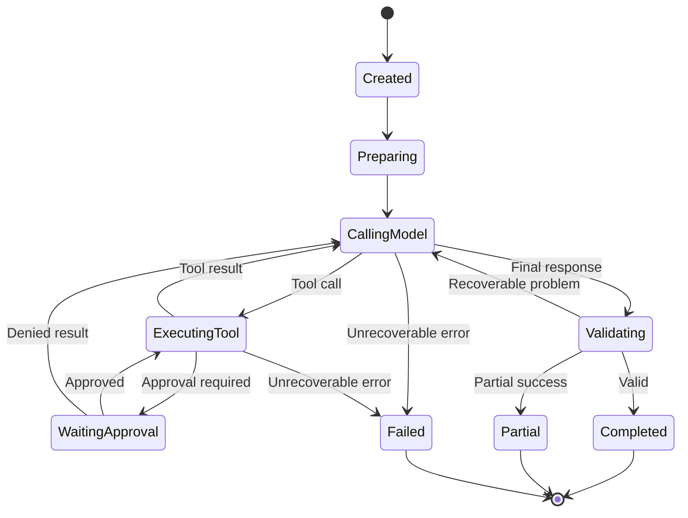

# Agent 정의와 실행 계약

> 2026-08-10 작성. Cowork 세션에서 나눈 대화를 정리한 것.
> 관련 문서: `Deep-Agent_활용_설계_정리.md`(Harness 설계 논의 전반),
> `../2_아키텍처_초안.md`(스키마 초안).

## 1. 에이전트 빌딩 시 고려할 것

### 1) 사용자가 직접 입력하는 것

- 이름
- 설명
- 시스템 instruction (behavior 프롬프트)
- 허용 Tool
- 결과 출력 형식 — 별도 필드가 아니라 instruction 텍스트 안에 자연어로 녹아
  들어간다 (예: "표로 정리해줘")

### 2) 백엔드가 자동으로 계산하는 것

- Retrieval 범위 — 별도 설정 없이 기존 `team_id` 스코프(`_require_team`
  패턴)가 그대로 적용된다. Agent가 어떤 tool로 검색하든 "이 팀 문서만"이라는
  경계가 자동으로 걸린다.

### 3) 우리(개발자/설계자)가 미리 정해서 코드·설정에 넣어둬야 하는 것

- **스캐폴드**(근거 원칙·Planning 규칙·Loop 상한) — Harness 코드 안의 고정
  템플릿. `agent` 레코드에는 저장되지 않고, 모든 에이전트 실행 시점마다
  공통으로 앞에 붙는다.
- **모델** — MVP는 플랫폼 전체 하나로 고정. 사용자가 직접 고르게 할지,
  빌더 에이전트가 behavior 복잡도를 보고 판단하게 할지, 에이전트마다 다르게
  할지는 추가 설계가 필요하다 (미결).
- **최대 반복 횟수** (하드 상한 숫자)
- **시간·토큰 예산**
- **승인 정책** — Agent 필드보다는 Tool 쪽 속성에 더 가깝다. Tool을
  카탈로그에 등록할 때 "이 Tool은 쓰기니까 승인 필요"라고 미리 표시해두는
  것이다.

## 2. 세 가지는 서로 다른 층이다

비슷해 보이지만 실제로는 다른 층에 있는 세 가지가 이 문서에 등장한다.
헷갈리기 쉬워서 먼저 구분해둔다.

| 구분 | 언제 정해지는가 | 누가 보는가 |
|---|---|---|
| AgentDefinition (위 1절 빌딩 고려사항) | 에이전트 하나 만들 때, Builder 단계 | 에이전트마다 다른 값 |
| 스캐폴드 | 개발자가 미리 한 번, Harness 코드 안 | 모델(LLM)이 프롬프트로 읽음 |
| Agent 실행 계약 (아래 3절) | 개발자가 미리 한 번, Harness 코드 안 | 코드끼리만 주고받음, 모델은 모름 |

## 3. Agent 실행 요청 계약

Agent Loop가 Chat에 종속되지 않도록 입력·출력 계약을 설계해야 한다. 채팅
메시지든, API 호출이든, 배치 스케줄러든, 다른 에이전트의 위임(A2A)이든, Loop을
실행시키는 사건은 전부 같은 모양의 "쪽지"를 주고받는 방식으로 통일한다.

```
run_agent(
    agent_id,
    user_input,
    actor,
    context,
    budget,
) -> AgentRunResult
```

### 입력 — AgentRunRequest

```
AgentRunRequest
├── agent_id
├── team_id
├── user_id
├── session_id 또는 null
├── user_input
├── project_id 또는 null
├── selected_document_ids
├── approval_channel
└── execution_budget
```

| 필드 | 의미 |
|---|---|
| agent_id | 어떤 에이전트를 실행할지 |
| team_id | 어느 팀 소속인지 — 팀 경계를 벗어난 접근을 막는 기준 |
| user_id | 누가 요청했는지 |
| session_id 또는 null | 채팅에서 왔으면 그 채팅방 번호, 아니면(배치·API·A2A) 비어있음 — Loop이 채팅에 종속되지 않게 하는 핵심 필드 |
| user_input | 실제 요청 내용 |
| project_id 또는 null | 어느 프로젝트 얘기인지 |
| selected_document_ids | 사용자가 특정 문서를 지정했으면 그 목록 — 팀 전체 Retrieval 범위와는 별개로, 요청 단위로 더 좁히는 것 |
| approval_channel | 되돌릴 수 없는 작업(Jira 등록 등) 전에 확인을 어디로 물어볼지 |
| execution_budget | 이번 실행에 쓸 수 있는 툴 호출 횟수·시간·비용 예산. 플랫폼 기본값을 호출하는 쪽이 더 좁혀서 넘길 수 있음(A2A에서 부모→자식 budget 전파에 쓰임) |

### 출력 — AgentRunResult

```
AgentRunResult
├── status
│   ├── COMPLETED
│   ├── PARTIAL
│   ├── FAILED
│   ├── CANCELLED
│   └── WAITING_APPROVAL
├── final_message
├── artifacts
├── evidence
├── tool_calls
├── usage
└── error
```

| 필드 | 의미 |
|---|---|
| status | 실행이 어떻게 끝났는지. COMPLETED(정상 완료) / PARTIAL(예산 소진으로 중간에 잘림) / FAILED(에러) / CANCELLED(취소됨) / WAITING_APPROVAL(사람 확인 대기 중) |
| final_message | 사용자에게 보여줄 최종 답변 텍스트 |
| artifacts | 텍스트 답변 말고 만들어낸 결과물 (예: 새로 생성된 Jira 이슈 링크) |
| evidence | 답의 근거 — 어느 문서·어느 부분에서 나온 건지. "근거 열람" UI가 이 필드를 그대로 렌더링 |
| tool_calls | 실행 중 어떤 툴을 언제 어떤 값으로 불렀고 결과가 뭐였는지 기록 |
| usage | 실제 사용한 시간·토큰·비용 |
| error | 실패했으면 뭐가 잘못됐는지 |

`WAITING_APPROVAL`이 있다는 건 Loop이 중간에 멈췄다가 나중에 이어서 재개될
수 있어야 한다는 뜻이다 — 함수 호출 한 번으로 끝나는 게 아니라, 중간 상태가
어딘가 저장돼 있어야 한다.

## 4. 실행 하나는 agent_run 레코드로 남는다

Loop이 한 번 실행될 때마다 `agent_run` 테이블에 행이 하나 생긴다. 이 행은
위 계약의 입력·출력을 그대로 담는다 — 단순히 끝나고 남기는 로그가 아니라,
시작할 때 생기고 실행 중 상태가 바뀌다가 끝나면 최종값으로 고정되는 살아있는
레코드다.

### ① 실행을 시작할 때 정해지는 것 (요청 쪽)

| 항목 | 내용 |
|---|---|
| 실행 번호 | 이 실행 하나를 가리키는 고유 ID |
| 어떤 에이전트인지 | 실행된 에이전트 |
| 어느 팀 소속인지 | 팀 경계 기준 |
| 누가 요청했는지 | 사람이 직접 물어봤는지, 다른 에이전트가 위임했는지 |
| 부모 실행이 있는지 | 다른 에이전트가 이 에이전트를 불러서 시작된 거면 그 원래 실행 번호(`parent_run_id`). 사람이 직접 부른 거면 비어있음 |
| 어느 채팅방에서 왔는지 | 채팅이면 그 방 번호, 아니면 비어있음 |
| 실제 요청 내용 | 사용자 입력 텍스트 |
| 어느 프로젝트 얘기인지 | 관련 프로젝트 |
| 지정한 문서가 있는지 | 사용자가 특정 문서를 콕 집어 지정했으면 그 목록 |
| 확인을 어디로 물어볼지 | 되돌릴 수 없는 작업 전 확인 경로 |
| 이번 실행 예산 | 툴 호출 횟수·시간·비용 상한 |
| 시작 시각 | 언제 시작됐는지 |

### ② 실행되면서/끝나고 채워지는 것 (결과 쪽)

| 항목 | 내용 |
|---|---|
| 지금 상태 | 진행 중 / 완료 / 중간에 잘림 / 에러 / 취소 / 확인 대기 중 |
| 최종 답변 | 사용자에게 보여줄 텍스트 |
| 만들어낸 것 | 텍스트 답변 말고 실제로 만든 결과물 |
| 근거 | 답이 어느 문서·어디서 나온 건지 |
| 툴 사용 기록 | 실행 중 호출한 tool들 — 개수가 여러 개라 별도 표(`tool_call`)로 쌓이고 실행 번호로 연결 |
| 실제 사용한 자원 | 걸린 시간·토큰·비용 |
| 에러 내용 | 실패 원인 |
| 종료 시각 | 끝난 시각(진행 중이면 비어있음) |

①은 시작할 때 한 번 채워지고 안 바뀌고, ②는 실행되는 동안 계속 갱신되다가
끝나면 고정된다.

## 5. Agent Loop 상태 머신

Loop을 단순한 `while True` 반복문으로 짜면 승인 대기·검증·부분 실패 같은
경우를 처리할 자리가 없다. 그래서 상태(state)를 명시적으로 나눠서, 어느
시점에 뭘 해야 하는지를 코드 레벨에서 분명히 한다.



### 상태별 역할

| 상태 | 하는 일 |
|---|---|
| Created | `run_agent()` 호출 직후, `agent_run` 레코드가 막 생긴 시점 |
| Preparing | 스캐폴드 + `agent.instruction` 조립, team/project/selected_document 컨텍스트 채움 (§3 계약의 입력을 여기서 씀) |
| CallingModel | 모델에게 다음 행동 판단을 요청 (ReAct의 Reason) |
| ExecutingTool | 모델이 낸 tool_call을 실제로 실행 (ReAct의 Act) |
| WaitingApproval | 승인이 필요한 tool(쓰기 Tool) 실행 전 대기 — `AgentRunResult.status = WAITING_APPROVAL`과 대응 |
| Validating | 모델이 "완료"라고 해도 바로 안 믿고 근거 원칙 등을 검증 |
| Completed / Partial / Failed | 종료 상태 |

### 결정해야 할 6가지

1. **모델 재호출 조건** — CallingModel로 돌아가는 경로가 셋(tool 결과, 승인
   거부, 검증에서 복구 가능한 문제)인데, 공통점은 "모델이 몰랐던 새 정보가
   생겼다"는 것이다. 이 세 경로 각각이 §6(설계 정리 문서)의 소프트/하드
   상한 카운터를 깎는지를 정해야 한다.
2. **tool call 순차 vs 병렬** — `deep-agents_분석.md`에 이미 나온 "독립적인
   작업은 병렬 실행 지원"이 우리 프로젝트에도 적용될지의 문제. 병렬로 하면
   A2A에서 짚었던 "동시 실행 제어" 문제가 여기서도 똑같이 생긴다. MVP는
   순차가 안전한 기본값으로 보인다.
3. **도구 실패 재시도 횟수** — tool 실패엔 두 종류가 있다: 재시도하면
   나아질 수 있는 것(ExecutingTool→CallingModel)과 재시도해도 소용없는
   것(ExecutingTool→Failed). 이 구분을 tool 실행 코드가 판정해서 Loop에
   알려줘야 하고, 그 위에 "같은 tool이 N번 연속 실패하면 그냥 Failed 처리"
   같은 별도 상한이 하나 더 필요하다.
4. **완료 선언 후 검증 여부** — Validating 상태가 있다는 것 자체가 "그렇다"
   는 답이다. 스캐폴드의 근거 원칙(§6, 소프트)을 실제로 지켰는지 코드가
   확인(하드)하는 지점이 여기다 — 소프트/하드 구분이 루프 상한뿐 아니라
   근거 원칙에도 똑같이 적용된다.
5. **중단·재개 처리** — WaitingApproval이 이 경우다. 재개하려면 지금까지의
   대화 턴 전체와 실행하려던 tool_call의 구체적 인자까지 저장해뒀다가,
   승인/거부 응답에 따라 ExecutingTool 또는 CallingModel로 분기해야 한다.
   §4에서 "agent_run은 로그가 아니라 살아있는 레코드"라고 한 이유가 여기서
   구체화된다.
6. **최대 반복 초과 시 부분 결과 보존** — `Partial` 상태. 지금까지 모은
   tool_calls·evidence는 그대로 두고, 못 끝낸 부분만 missing_fields로 남겨
   `AgentRunResult.status = PARTIAL`로 반환한다.

### 다이어그램에서 빠진 부분

- **하드 상한 초과 → Partial 전이가 명시돼 있지 않다.** CallingModel이나
  ExecutingTool 어느 지점에서든 카운터 초과 시 Partial로 바로 빠지는 경로가
  필요한데 지금 그림엔 없다.
- **CANCELLED 상태 자체가 없다.** 사용자가 중간에 취소하면 어느 상태에서든
  발생할 수 있는 예외적 전이라서, "임의 상태 → CANCELLED"를 별도로 명시해야
  `AgentRunResult.status` 다섯 개(COMPLETED/PARTIAL/FAILED/CANCELLED/
  WAITING_APPROVAL)와 맞아떨어진다.

## 6. Planning 전략

모든 요청에 TODO와 복잡한 계획을 강제할 필요는 없다. 난이도 정책을 직접
정할 수 있다.

| 요청 유형 | 처리 |
|---|---|
| 단순 질문 | 계획 없이 한 번 호출 |
| Tool 1회로 끝나는 요청 | 짧은 실행 계획 |
| 문서→추출→Jira 등록 | 명시적 단계 계획 |
| 실패 가능성이 높은 작업 | 단계별 검증 포함 |
| 사용자 승인이 필요한 작업 | 승인 전후로 계획 분리 |

예를 들어 현재 대표 E2E는 순서가 이미 알려져 있다.

```
문서 선택 → 근거 검색 → 업무 추출 → 사용자 확인 → Jira 등록 → 결과 검증
```

이 흐름은 모델에게 매번 처음부터 계획하게 하기보다, 플랫폼이 기본 계획
템플릿으로 제공하고 모델은 필요한 세부 행동만 결정하게 하는 것이 안정적이다.

즉 두 가지 계획 방식을 함께 둘 수 있다.

- **STATIC_PLAN**: Pre-built Agent의 검증된 고정 단계
- **DYNAMIC_PLAN**: Builder Agent가 요청에 따라 생성하는 계획

## 7. 반복·시간·비용 Budget

Claw Code처럼 무제한 반복을 기본으로 두면 서비스형 플랫폼에서는 위험하다.
설계할 예산은 다음과 같다 — §3의 `AgentRunRequest.execution_budget` 필드를
구체적으로 펼친 것이다.

```
ExecutionBudget
├── max_model_calls
├── max_tool_calls
├── max_elapsed_seconds
├── max_input_tokens
├── max_output_tokens
├── max_cost
├── max_retries_per_tool
└── max_result_bytes
```

MVP에서는 최소한 아래 정도가 필요하다.

- 단순 요청: 모델 호출 1~2회
- 일반 Tool 요청: 최대 3회
- 복합 E2E: 최대 5회
- Tool별 timeout
- 전체 run timeout
- 도구 결과 크기 제한

중요한 것은 프롬프트에 "5회까지만 하라"고 쓰는 것과 런타임 코드가 실제로
5회에서 중단시키는 것을 분리하는 것이다 — `Deep-Agent_활용_설계_정리.md`
§6의 소프트(프롬프트)/하드(Harness 코드) 구분이 여기서 `ExecutionBudget`
전체가 하드 쪽을 담당하는 것으로 구체화된다. `max_result_bytes`는 같은
문서 §10/§12의 "Tool 결과 크기 제한·잘라내기/요약 정책" 액션 항목의 실제
구현 지점이고, `max_retries_per_tool`은 §5(상태 머신)의 "도구 실패 재시도
횟수" 결정 포인트에 대한 답이다.

## 8. Tool 추상화

기존 기능을 모두 같은 Tool 인터페이스로 정규화할 수 있다.

```
class Tool:
    name: str
    description: str
    input_schema: dict
    output_schema: dict
    risk_level: str
    timeout_seconds: int

    def execute(context, arguments) -> ToolResult:
        ...
```

- `risk_level` — §1에서 "승인 정책은 Agent 필드가 아니라 Tool 쪽 속성"이라고
  한 게 이 필드다. 쓰기 작업(`create_jira_issue` 등)은 risk_level이 높아서
  §5(상태 머신)의 `WaitingApproval`로 가고, 읽기 전용은 바로 실행된다.
- `timeout_seconds` — §7(ExecutionBudget)의 "Tool별 timeout"이 이 필드값이다.
- `execute(context, arguments)` — `context`에 §3의 `AgentRunRequest` 정보
  (team_id·session_id 등)가 담겨, tool 내부에서도 팀 경계를 지킬 수 있다.

### 현재 프로젝트에서 Tool 후보

**기존 기능 기반 내장 Tool** — 회의록 §22 "Priority 5. 기존 Agent 재구성"이
이 작업이다. 새로 짜는 게 아니라 기존 함수를 Tool 인터페이스로 감싸는 것.

- `search_documents`
- `get_document_outline`
- `extract_project_tasks`
- `calculate_workload`
- `recommend_assignees`
- `check_project_readiness`
- `list_projects`
- `list_team_members`
- `get_member_availability`

**Connector Tool** — 외부 서비스를 REST API로 직접 감싼 것.
`create_jira_issue`/`update_jira_issue`가 risk_level 높은 tool의 실제
예시고, 대표 E2E의 Jira 쓰기 단계가 이 tool을 쓴다.

- `list_jira_projects`
- `search_jira_issues`
- `create_jira_issue`
- `update_jira_issue`
- `list_drive_files`
- `read_drive_document`

**MCP Tool** — 사용자가 등록한 외부 MCP 서버에서 발견해서 쓰는 것.
`Deep-Agent_활용_설계_정리.md` §4의 MCP 보안·운영 경계 논의가 특히 이
카테고리에 집중된다.

- 외부 MCP 서버에서 발견한 도구
- Jira MCP
- 향후 Slack, Notion 등의 도구

이 Tool 계약이 잘 잡히면 내장 Python 함수, REST Connector, MCP Tool을
Agent 입장에서는 동일하게 취급할 수 있다 — Builder의 "허용 Tool" 체크박스도
이 세 출처를 합친 하나의 카탈로그에서 고르는 것이 된다.

## 9. Tool Description 설계

Tool 선택 정확도는 모델보다 Tool description과 schema에 크게 좌우된다.
모델이 tool_call을 낼 때 실제로 보는 건 구현 코드가 아니라 description과
input_schema뿐이라서, description이 부실하면 아무리 좋은 모델을 써도
잘못된 tool을 고르거나 불필요하게 부르거나 필요할 때 안 부른다.

나쁜 예:

```
search_documents: 문서를 검색한다.
```

좋은 예:

```
search_documents:
현재 팀에 등록되고 임베딩이 완료된 문서에서 사용자 요청과 관련된
근거 청크를 검색한다. 프로젝트 계획, 요구사항, 일정, 역할에 대한
질문에 사용한다. Jira의 최신 상태를 조회할 때는 사용하지 않는다.
```

나쁜 예는 "언제 써야 하는지"만 있고 "언제 쓰지 말아야 하는지"가 없다 —
그래서 "Jira 최신 상태 알려줘" 같은 요청에도 잘못 불릴 수 있다. 좋은 예는
범위·용도·명시적 배제 세 가지를 다 담는다.

### 설계해야 하는 요소

| 요소 | 왜 필요한가 |
|---|---|
| 언제 써야 하는지 | 용도 명시 |
| 언제 쓰지 말아야 하는지 | 배제 조건 — 가장 빠지기 쉬운 부분 |
| 입력 필드 의미 | 타입이 아니라 "무엇을 넣어야 하는지" |
| 반환 결과 의미 | 모델이 결과를 어떻게 해석해야 하는지 |
| 데이터 최신성 | 예: 임베딩 완료된 문서만 검색됨 → 방금 올라온 문서는 "근거 없음"이 아니라 "아직 인덱싱 중"으로 정직하게 답할 근거가 됨 |
| 읽기/쓰기 여부 | §8의 `risk_level`과 직결 — 쓰기면 §5 `WaitingApproval`로 감 |
| 사용 전 필요 조건 | 예: project_id가 먼저 있어야 호출 가능 |
| 실패 가능한 이유 | §5(상태 머신)의 "이 실패가 recoverable인지" 판단에 쓰일 재료 |

### G-PROMPT 평가셋과의 연결

`4_평가_설계.md` §4에 이미 정의돼 있다 — 15~20개 프롬프트에 "기대 Tool"을
라벨로 단 정답셋이고, 1/3은 Tool이 필요 없는 질문을 섞어 불필요 호출률까지
잰다. 측정 지표는 올바른 Tool 선택률(기대 Tool = 실제 첫 호출 Tool),
불필요 호출률, Tool 실행 성공률 — 전부 §3의 `tool_call` 로그 자동 집계다.

같은 문서 §7 담당표: **"G-PROMPT | 준 + Harness 분석 3인 | Harness Tool
목록 확정 후"**. "Harness 분석 3인"이 지훈·준억·주연이고, 시점 조건은
§8에서 정리한 Tool 후보 목록이 확정되는 시점이다 — 즉 이 description 설계가
끝나야 G-PROMPT를 만들 수 있는 순서 관계다. description이 부실하면 Tool
선택률이 낮게 나오는데, 그게 모델 탓인지 description 탓인지 미리 가려두지
않으면 발표 때 원인 설명이 막힌다.

## 10. Tool Registry와 실행 시 필터링

등록된 모든 Tool을 모든 Agent에게 보여주면 안 된다. 실행 시 다음 교집합을
계산해야 한다.

```
이번 실행의 Tool
=
Agent에 연결된 Tool
∩ 사용자가 사용할 수 있는 Tool
∩ 현재 팀에서 활성화된 Tool
∩ Connector가 정상인 Tool
∩ 현재 프로젝트 범위에서 허용된 Tool
```

예를 들어 Agent에 Jira 생성 Tool이 연결돼 있어도 다음 조건이면 노출하지
않아야 한다.

- Jira Connector 인증 만료
- 다른 팀의 Connector
- 현재 사용자에게 생성 권한 없음
- 해당 Agent가 read-only 모드
- MCP 서버 health check 실패

기존 §4(활성화·연결 메커니즘)의 pseudo-code —

```
활성 에이전트 = SELECT * FROM agent WHERE team_id=? AND status='ACTIVE'
   → 매칭된 에이전트의 tool_ids 로드
   → 각 tool이 요구하는 connector 상태 확인
   → 통과한 tool만 이번 실행에 노출
```

— 는 사실상 "①Agent 연결 Tool ∩ ④Connector 정상"만 다루고 있었다. 이번
5중 교집합은 여기에 **②사용자 권한**, **③팀 단위 활성화**, **⑤프로젝트
범위**를 추가로 명시한 것이다. "read-only 모드"는 에이전트 전역 스위치로,
`risk_level`(§8)이 높은 tool을 무조건 거르는 안전장치다.

이 "실행 시점 Tool resolution"은 우리 플랫폼에서 직접 설계해야 할 중요한
부분이다.

## 11. Tool 결과 계약과 컨텍스트 절약

Tool 출력은 그대로 모델에게 넘기지 않는 것이 좋다. §8에서
`execute(context, arguments) -> ToolResult`라고 타입만 남겨뒀던 그
`ToolResult`를 여기서 구체화한다.

```
ToolResult
├── status
├── summary
├── data
├── evidence
├── artifacts
├── retryable
├── error_code
├── user_action_required
└── metadata
```

예를 들어 문서 검색 결과는 DB row 전체가 아니라 필요한 값만 전달해야 한다.

```json
{
  "status": "SUCCESS",
  "summary": "관련 근거 8건을 찾았습니다.",
  "data": [
    {
      "ref": "E1",
      "document": "제안요청서.pdf",
      "heading": "3.2 개발 범위",
      "text": "...",
      "score": 0.87
    }
  ]
}
```

| 필드 | 역할 |
|---|---|
| status | 성공/실패 — §5(상태 머신)에서 CallingModel로 갈지 Failed로 갈지 가르는 근거 |
| summary | 한 줄 요약 — 모델이 raw data를 다 안 파싱해도 됨 |
| data | 필요한 값만 추린 것 — §7의 `max_result_bytes`, `Deep-Agent_활용_설계_정리.md` §12 "Tool 결과 크기 제한 정책"이 실제로 구현되는 지점 |
| evidence | 짧은 ID로 근거 축약(`ref: E1`) — §3의 `AgentRunResult.evidence`가 이 조각들을 모아서 채워짐 |
| artifacts | tool 하나 단위의 부산물 — 여러 개가 모여 §3의 run 단위 artifacts가 됨 |
| retryable | 재시도 가치가 있는 실패인지 — §5 recoverable/unrecoverable 판정, §7 `max_retries_per_tool`과 직결 |
| error_code | 구조화된 실패 코드 — §9 "실패 가능한 이유"가 description에 문서화돼 있어야 의미가 생김 |
| user_action_required | 실행 도중 사용자 조치가 필요해진 경우(예: 인증 만료) — §10의 사전 필터링과 달리, 실행 중 갑자기 발생하는 케이스 |
| metadata | 로깅·디버깅용 부가정보, 모델에겐 안 보일 수도 있음 |

현재 `task_extraction`에서 이미 불필요한 metadata를 제거하고 `E1`, `E2`로
근거를 축약한 경험이 있다(AS-IS §6, Luna/Sol 파이프라인). 새로 발명하는
정책이 아니라, 회의록 §22 "Priority 5. 기존 Agent 재구성" 때 이미 검증된
이 로직을 Harness 전체의 `ToolResult` 정책으로 일반화하면 된다.

**계약 체인 정리**: Tool(§8)이 실행돼서 → ToolResult(이번 절)로 정제되고
→ 여러 tool의 ToolResult가 모여 최종 AgentRunResult(§3)의 evidence·
artifacts로 취합된다.

## 12. Context 구성 정책

매번 모델에 넣을 컨텍스트를 정해야 한다.

```
Model Context
├── Platform Scaffold
├── Agent Instruction
├── 사용자·팀 권한 정보
├── 현재 날짜와 프로젝트
├── 대화 이력
├── 현재 계획
├── 관련 문서 근거
├── 이전 Tool 결과
└── 사용 가능한 Tool Schema
```

| 구성요소 | 출처 |
|---|---|
| Platform Scaffold | `Deep-Agent_활용_설계_정리.md` §6 |
| Agent Instruction | §1의 사용자 behavior가 다듬어진 것 |
| 사용자·팀 권한 정보 | §10의 5중 필터링 결과를 모델이 알아야 할 때 텍스트로 반영 |
| 현재 날짜와 프로젝트 | 프로젝트는 §3의 `project_id`. 날짜는 §9 "데이터 최신성" 판단·상대 시간 해석에 필요 |
| 대화 이력 | session_id(§3)가 있을 때 과거 메시지. 상한은 §7 `max_input_tokens`와 직결 |
| 현재 계획 | §6(Planning 전략)의 write_todos 상태 |
| 관련 문서 근거 | search_documents 등 tool 결과(§11 `ToolResult.evidence`) |
| 이전 Tool 결과 | §11의 ToolResult 누적분 |
| 사용 가능한 Tool Schema | §10 필터링을 통과한 최종 목록의 input_schema(§8) |

### 설계 질문 — 하나는 이미 답이 나와 있음

- **Agent가 문서 후보를 검색하는가** — **이미 결정됨.** `5_E2E_시나리오.md`
  STEP 2: "기준 문서 미지정" 상황이면 Agent가 후보 문서를 제시하고 사용자가
  고르는 되묻기 스텝으로, 기존 `/tasks/distribution/documents` 선택 UI를
  그대로 흡수한다.

나머지는 미결이다.

- 프로젝트를 사용자가 직접 선택하는가 — IA §4 "Chat-Project 관계" 미결과
  같은 축
- 몇 개의 이전 메시지를 유지하는가 / 오래된 Tool 결과를 계속 유지하는가 —
  `Deep-Agent_활용_설계_정리.md` §12 Context Offloading 논의보다 앞선 질문
- 검색 근거를 언제 주입하는가 — 매 턴 재검색 vs 캐시 재사용
- 사용자 확인 후 어떤 상태만 다시 넣는가 — §5 `WaitingApproval` 재개 시
  무엇을 복원할지, §4의 "재개 가능해야 한다"를 구체화하는 질문
- **다른 팀 데이터가 섞이지 않음을 어디서 보장하는가** — 컨텍스트 조립
  단계의 사후 필터링이 아니라, **Tool의 데이터 쿼리 자체**에 team_id가
  강제로 박혀 있어야 한다(§1의 "백엔드가 자동 계산", 기존 `_require_team`
  패턴). 모델이 한 번이라도 다른 팀 데이터를 봤다면 그 시점에 이미 유출.

MVP는 "모든 정보를 처음부터 넣기"보다 필요한 시점에 Retrieval Tool을
호출하는 방식이 적합하다 — 새 결정이 아니라 `Deep-Agent_활용_설계_정리.md`
§6에서 이미 잡아둔 방향(스캐폴드+instruction만 초기 제공, 검색은 tool_call
로)의 재확인이다.

## 13. 다음에 정할 것

- [ ] 모델 결정 방식(플랫폼 고정 / 사용자 선택 / 빌더 에이전트 판단 /
      에이전트별 상이) — §1의 3)에서 미결로 남긴 항목
- [ ] `agent_run`/`tool_call` 스키마에 위 ①·②표의 컬럼 반영 —
      `../2_아키텍처_초안.md` §3과 대조
- [ ] `WAITING_APPROVAL` 상태의 재개(resume) 처리 흐름 설계 — Loop을
      멈췄다가 이어가는 구체적인 방법은 아직 정하지 않음
- [ ] 상태 머신에 하드 상한 초과 → Partial 전이, 임의 상태 → CANCELLED
      전이 추가
- [ ] tool 실패의 recoverable/unrecoverable 판정 기준과 재시도 상한 값 결정
- [ ] tool call 순차/병렬 여부 결정 (MVP는 순차 제안)
- [ ] 사용자별 Tool 실행 권한 모델 설계 — 기존 "에이전트 편집 권한" 미결과는
      다른 축(누가 수정하나 vs 누가 이 tool을 실행할 수 있나)
- [ ] 프로젝트 범위별 Tool 허용 목록 필요 여부
- [ ] "read-only 모드" 스위치를 Agent 필드에 추가할지 여부
- [ ] 대화 이력·이전 Tool 결과 유지 상한(개수/토큰) 결정
- [ ] 검색 근거 매 턴 재검색 vs 캐시 재사용 정책
- [ ] `WaitingApproval` 재개 시 복원 범위(전체 대화 vs 승인 결과+계획만) 결정
