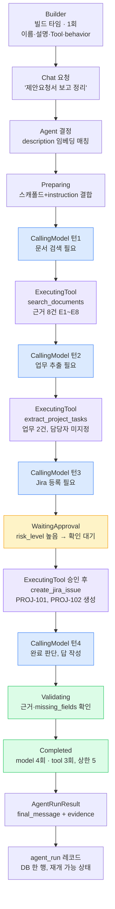

# E2E 실행 흐름 예시

> 2026-08-10 작성. Cowork 세션에서 나눈 대화를 정리한 것.
> 관련 문서: `Deep-Agent_활용_설계_정리.md`, `Agent_정의와_실행_계약.md`.
> 목적: 두 문서에서 따로 정의한 개념(AgentDefinition, AgentRunRequest/Result,
> 상태 머신, ExecutionBudget, Tool, ToolResult, Context 구성)이 실제 요청
> 하나를 처리할 때 어떻게 맞물리는지, 대표 E2E("문서 보고 업무 정리해서
> Jira 등록해줘")를 예시 데이터와 함께 처음부터 끝까지 따라간 기록이다.

## 0단계 — 에이전트 빌딩 (사전, 1회)

팀장이 Builder에서 입력:

```
이름: "업무 정리 에이전트"
설명: "프로젝트 문서를 보고 업무를 추출해 Jira에 등록해주는 에이전트"
Tool: search_documents, extract_project_tasks, list_jira_projects, create_jira_issue
behavior: "문서를 보고 업무를 정리해서 Jira에 등록해줘. 항상 근거를 남기고,
          Jira 등록 전엔 꼭 확인받아."
```

빌더 에이전트가 판단하는 3가지: behavior를 instruction으로 다듬음(문장
정리), description이 라우팅에 쓸 만큼 명확한지 체크(통과), behavior와
tools가 맞는지 체크(Jira 언급 있고 Jira tool 있음 — 통과). 백엔드는
`team_id` 주입, `max_iterations=5`(플랫폼 기본값) 채움. `agent` 레코드
1개, `agent_tool` 레코드 4개 저장.

## 1단계 — 사용자가 채팅에 입력

```
"제안요청서 문서 보고 업무 정리해서 Jira에 등록해줘"
```

## 2단계 — Agent 결정

선택 방식은 미결이지만, 자동 라우팅이라고 가정 — description 임베딩
매칭으로 "업무 정리 에이전트" 선택. 이 매칭 자체는 Deep 아님, 계획·상한
없음.

## 3단계 — AgentRunRequest 조립

```
agent_id: "agent_001"
team_id: "team_skn"
user_id: "user_jihoon"
session_id: "chat_9382"
user_input: "제안요청서 문서 보고 업무 정리해서 Jira에 등록해줘"
project_id: null          ← 아직 안 정해짐(미결 항목)
selected_document_ids: []  ← 사용자가 문서를 콕 집지 않음
approval_channel: "chat:chat_9382"
execution_budget: { max_model_calls: 5, max_tool_calls: 5, max_cost: ... }
```

## 4단계 — 상태 머신 진행 (핵심)

`Created` → `Preparing`: 스캐폴드("근거 없이 추측 마라, 툴 최대 5회, 쓰기
전 확인") + agent.instruction을 합쳐 시스템 프롬프트 조립.

**턴 1 — CallingModel**: 모델 판단 — "문서가 지정 안 됐다, 먼저 근거를
찾아야겠다" → `search_documents` tool_call 발행.

**ExecutingTool**: `search_documents` 실행 → risk_level 낮음(읽기) → 바로
실행 → `ToolResult`:
```json
{
  "status": "SUCCESS",
  "summary": "관련 근거 8건을 찾았습니다.",
  "data": [
    {"ref": "E1", "document": "제안요청서.pdf", "heading": "3.2 개발 범위", "text": "...", "score": 0.87}
  ]
}
```
→ `CallingModel`로 복귀(tool 결과를 새 정보로 받음).

**턴 2 — CallingModel**: 모델 판단 — "근거를 봤으니 이제 업무를 추출하자"
→ `extract_project_tasks` tool_call.

**ExecutingTool**: 기존 Luna/Sol 5단계 파이프라인이 이 tool 뒤에서 그대로
돎(Priority 5 재구성) → `ToolResult`:
```json
{
  "status": "SUCCESS",
  "summary": "업무 3건을 추출했습니다.",
  "data": [
    {"title": "요구사항 정의서 작성", "evidence": ["E1", "E3"], "deadline": null},
    {"title": "API 설계", "evidence": ["E2"], "deadline": "2026-08-20"}
  ],
  "artifacts": {"missing_fields": ["담당자 미지정 — 문서에 근거 없음"]}
}
```

**턴 3 — CallingModel**: 모델 판단 — "다 나왔다, 이제 Jira에 등록하자" →
`create_jira_issue` tool_call 준비. 근데 이 tool은 `risk_level: high`.

**ExecutingTool → WaitingApproval**: 실행 직전 멈춤. `approval_channel`
(chat_9382)로 확인 요청 전송 — 화면에 "이 2건을 Jira에 등록할까요?" 뜸.
`agent_run` 레코드 상태 = `WAITING_APPROVAL`로 저장, Loop 함수는 잠깐
멈춘다(재개 처리 흐름은 미결 — `Agent_정의와_실행_계약.md` §13).

**(사용자가 "확인" 클릭)** → `WaitingApproval` → `ExecutingTool`:
`create_jira_issue` 실제 실행 → `ToolResult`:
```json
{
  "status": "SUCCESS",
  "summary": "Jira 이슈 2건 생성 완료",
  "artifacts": [{"jira_key": "PROJ-101"}, {"jira_key": "PROJ-102"}]
}
```

**턴 4 — CallingModel**: 모델 판단 — "다 끝났다, 최종 답 정리" → Final
response 발행.

**Validating**: 근거 원칙 지켜졌는지(evidence 채워짐 — E1, E2, E3 있음),
missing_fields 정직하게 남겼는지(담당자 미지정 명시됨) 확인 → 통과 →
`Completed`.

지금까지 소모: model_calls 4회, tool_calls 3회 — `execution_budget`
(상한 5) 안에서 끝남.

## 5단계 — AgentRunResult 반환

```json
{
  "status": "COMPLETED",
  "final_message": "제안요청서 기준으로 업무 2건을 정리해 Jira에 등록했습니다. 담당자는 문서에 명시가 없어 비워뒀습니다. (PROJ-101, PROJ-102)",
  "artifacts": [{"jira_key": "PROJ-101"}, {"jira_key": "PROJ-102"}],
  "evidence": ["E1", "E2", "E3"],
  "tool_calls": ["search_documents", "extract_project_tasks", "create_jira_issue"],
  "usage": {"model_calls": 4, "tool_calls": 3, "elapsed_seconds": 42, "cost": 0.031}
}
```

## 6단계 — agent_run 레코드 최종 상태

`status=COMPLETED`, 시작·종료 시각, 위 필드 전부가 한 행에 고정 저장 →
"근거 열람" 클릭하면 evidence의 E1/E2/E3를 원문 위치와 함께 보여줌,
`tool_call` 테이블엔 3개 행이 각각 남는다.

이 흐름 하나가 그대로 회의록 §18 대표 E2E 시나리오이자, `4_평가_설계.md`의
E2E 성공률 측정 대상이다.

## 흐름도



파란색 = 모델 판단(CallingModel), 보라색 = Tool 실행, 주황색 = 승인 대기,
초록색 = 검증·완료 단계.
