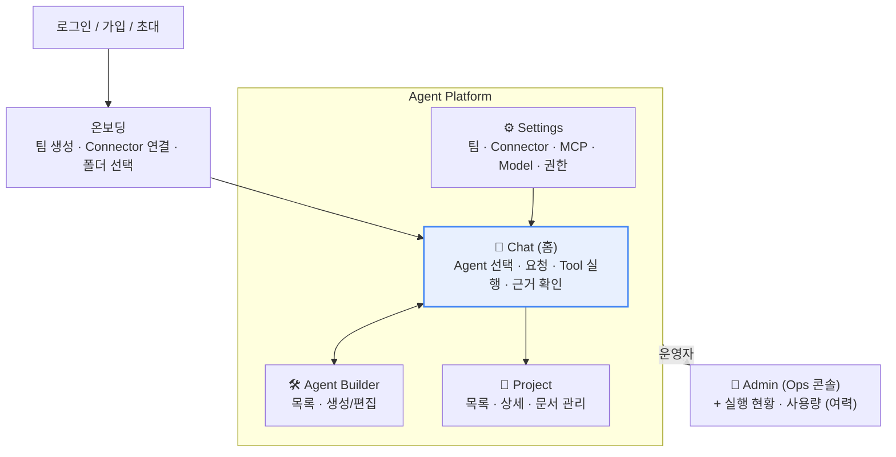
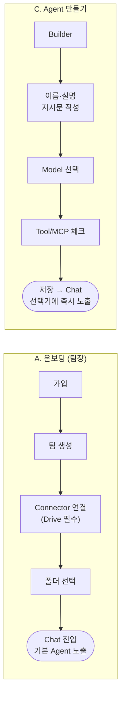
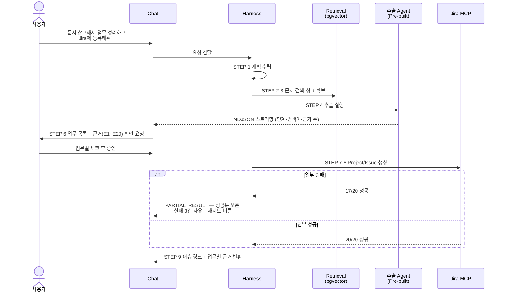
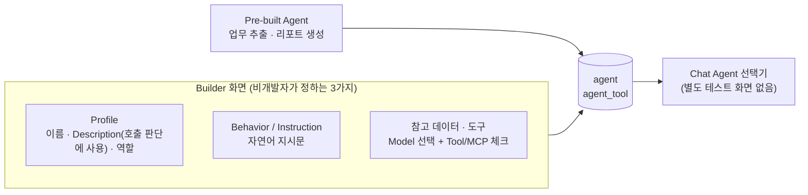
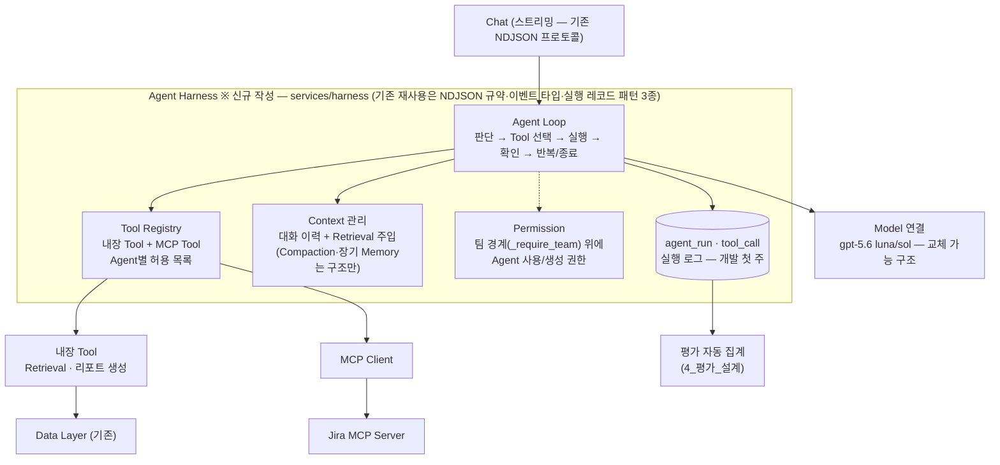
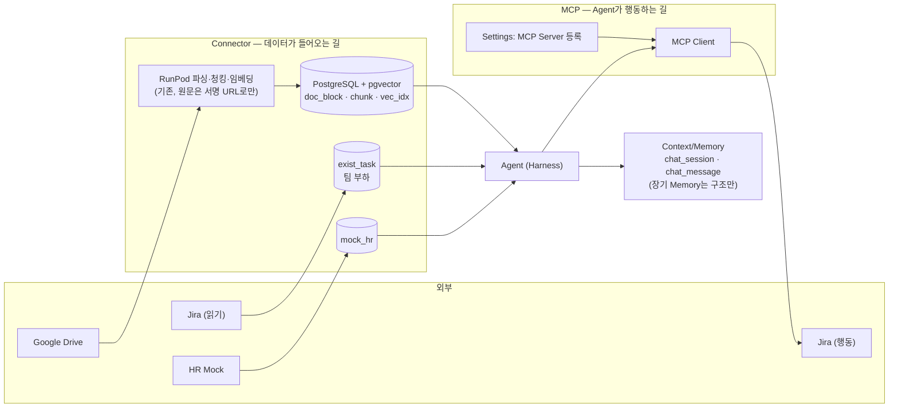
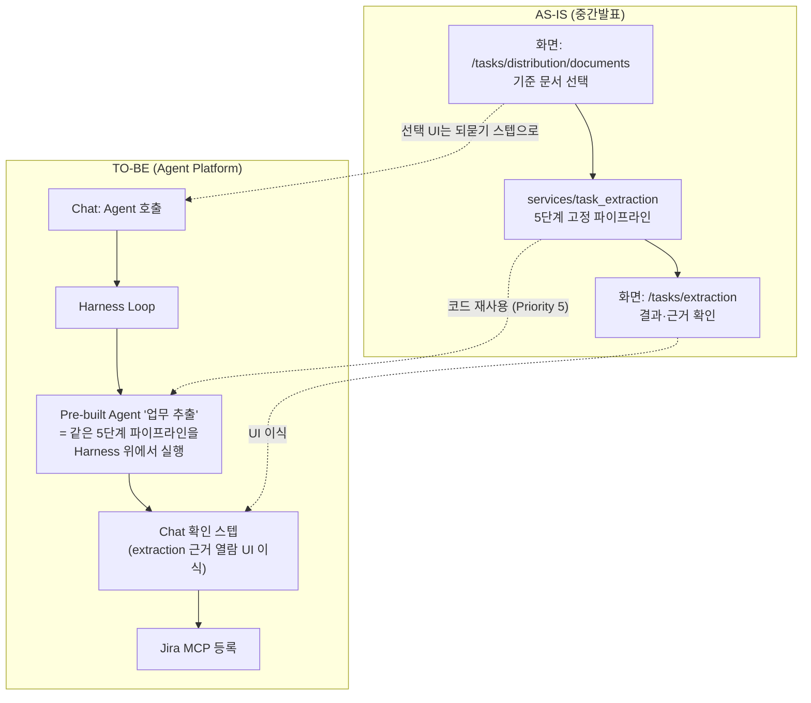

# 시각화 초안 — Mermaid (8/12 멘토링용)

> 2026-08-10 작성. 팀 검토 후 발표용만 Figma로 옮긴다. GitHub에서 바로
> 렌더링된다. 근거: 1_서비스구조_IA·2_아키텍처_초안·5_E2E_시나리오 v1.
> Harness 분석(화) 반영 시 ⑤가 갱신될 수 있다.

## ① 전체 서비스 화면 구조

## ② 사용자 Flow — 온보딩 · Agent 생성

## ③ 대표 E2E Flow (시퀀스)

## ④ Agent Builder 구조

## ⑤ Agent Harness Architecture

## ⑥ Connector / MCP / Memory 연결 구조

## ⑦ 기존 업무 추출 Agent가 들어가는 위치

