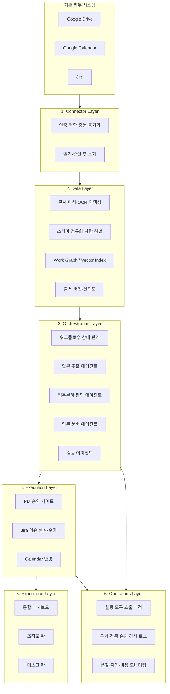

# AI 프로젝트 운영 코파일럿 — 기획서 v3

> 문서 상태: 재설계 초안  
> 작성 기준일: 2026-07-20  
> 작성 근거: 2026-07 멘토 피드백 및 팀 논의  
> 핵심 변경: 업무 자동 배정 플랫폼 → 커넥터 기반 엔터프라이즈 프로젝트 운영 의사결정 지원

---

## 0. 방향 전환 요약

기존 v2는 문서에서 태스크를 추출하고 팀원별 업무량과 역량을 계산하여 담당자를 자동 추천·재배분하는 플랫폼을 지향했다. 그러나 실제 기업에서는 구성원별 스킬·역량 데이터가 충분히 관리되지 않는 경우가 많고, 임의로 만든 인사 데이터에 근거한 추천은 신뢰받기 어렵다. 또한 작은 팀에서는 PM이 구성원의 상황을 직접 파악할 수 있어 별도의 부하 조율 플랫폼이 주는 가치가 제한적이다.

v3는 제품의 타겟과 역할을 다음과 같이 바꾼다.

| 구분 | 기존 방향 | 신규 방향 |
| --- | --- | --- |
| 타겟 | 일반적인 소규모·중규모 협업팀 | 100~300명 규모 프로젝트를 운영하는 대기업 PMO·컨설팅사·SI사 |
| 제품 정의 | AI 업무 분배·부하 조율 플랫폼 | AI 프로젝트 운영 코파일럿 |
| AI의 역할 | 담당자 자동 배정·재배정 | 데이터 통합, 프로젝트 분석, 추천과 근거 설명 |
| 최종 결정 | 일부 자동 실행 | PM 검토·승인 후 실행 |
| 데이터 확보 | 자체 입력, 업로드, 내부 DB 구축 | 기존 업무 제품에 커넥터로 연결 |
| 데이터 저장 | 서비스가 원본 문서를 보관 | 원본은 기존 시스템에 유지, 필요한 데이터만 인덱싱·정규화 |
| 핵심 가치 | 공정한 업무 배분 | 대규모 프로젝트의 현황·리스크·담당자 판단을 하나의 근거 체계로 연결 |

이 프로젝트는 새로운 그룹웨어나 HR 시스템을 만드는 것이 아니다. 회사가 이미 사용하는 Google Workspace와 Jira 위에 연결되어, 흩어진 프로젝트 정보를 `사람 ↔ 업무 ↔ 프로젝트 ↔ 문서 ↔ 일정` 관계로 구조화하고 PM의 운영 판단을 지원하는 도구를 만든다.

---

## 1. 프로젝트 개요

### 1.1 프로젝트명

**AI 프로젝트 운영 코파일럿**  
영문 가칭: **Project Operations Copilot**

### 1.2 한 줄 소개

Google Drive·Google Calendar·Jira에 흩어진 프로젝트 데이터를 연결해 업무·인력·일정·근거 관계를 구성하고, 대규모 프로젝트의 태스크 생성, 담당자 추천, 일정 위험과 액션아이템을 근거와 함께 제안하는 PM 의사결정 지원 시스템이다.

### 1.3 핵심 메시지

> 새로운 업무 데이터를 다시 입력하게 하지 않는다. 기존 업무 시스템의 데이터를 연결하고, AI는 자동 결정이 아니라 검증 가능한 추천을 제공한다.

### 1.4 핵심 사용자 가치

- PM이 여러 시스템을 오가며 프로젝트 현황을 수작업으로 취합하는 시간을 줄인다.
- 기획서·회의록에서 발견된 업무를 Jira 태스크 후보로 구조화한다.
- 담당자 추천 시 현재 부하, 일정, 최근 프로젝트 경험과 같은 실제 근거를 함께 제시한다.
- 프로젝트 이력과 액션아이템이 어느 문서·회의·티켓에서 발생했는지 추적할 수 있게 한다.
- 일정 지연과 과부하 가능성을 조기에 발견하되, 최종 판단과 실행 권한은 PM에게 둔다.

### 1.5 만들지 않는 것

- 자체 HR·ERP 시스템
- 자체 메일·메신저·캘린더
- 원본 문서를 이전·보관하는 사내 드라이브
- 근거 데이터가 없는 완전 자동 업무 배정
- 소규모 팀을 위한 범용 태스크 관리 도구
- 모든 기업용 제품을 한 번에 지원하는 범용 커넥터 플랫폼

---

## 2. 문제 정의

### 2.1 대상 조직이 겪는 문제

100~300명이 참여하는 프로젝트에서는 PM이 모든 구성원의 업무와 맥락을 직접 파악할 수 없다. 프로젝트 계획서는 Drive에, 실제 태스크와 담당자는 Jira에, 휴가·출장·회의는 Calendar에 흩어져 있어 다음 문제가 발생한다.

1. 기획서와 회의에서 합의한 업무가 실제 Jira 티켓으로 누락되거나 늦게 등록된다.
2. 한 사람이 여러 프로젝트와 태스크를 동시에 담당해도 전체 부하를 한눈에 보기 어렵다.
3. 담당자를 선정할 때 최근 경험과 현재 일정에 대한 근거가 여러 문서와 시스템에 분산되어 있다.
4. 일정 지연·블로킹·담당자 공백을 사전에 발견하기보다 문제가 발생한 뒤 대응한다.
5. 담당자 추천 또는 일정 변경의 이유가 기록되지 않아 이후 감사와 회고가 어렵다.

### 2.2 기존 접근의 한계

- 새로운 플랫폼에 조직도·스킬·일정·태스크를 다시 입력하게 하면 회사가 이중으로 관리해야 한다.
- 회사마다 스킬 데이터의 존재 여부와 관리 수준이 달라 이를 필수 전제로 삼을 수 없다.
- LLM이 임의로 추론한 역량 데이터는 추천 근거로 사용할 수 없다.
- 완전 자동 배정은 조직 정책, 책임 관계, 비공식 맥락을 반영하지 못하고 신뢰와 책임 문제를 만든다.
- 기존 그룹웨어 기능을 다시 구현하면 핵심 문제보다 기능 범위만 커진다.

### 2.3 해결하려는 핵심 문제

> PM이 대규모 프로젝트의 업무·인력·일정 정보를 한 번에 파악하기 어렵고, 담당자와 실행 우선순위를 결정할 때 사용할 수 있는 통합된 근거가 부족하다.

---

## 3. 타겟 사용자

### 3.1 1차 타겟

- 100~300명 규모 프로젝트를 운영하는 대기업 PMO
- 다수의 고객·협력사·전문 인력이 함께 일하는 SI 프로젝트 관리자
- 여러 워크스트림을 병렬 운영하는 컨설팅 프로젝트 리더

### 3.2 주요 사용자

| 사용자 | 주요 업무 | 제품에서 얻는 가치 |
| --- | --- | --- |
| PM·프로그램 매니저 | 전체 일정·인력·리스크 조율 | 통합 현황, 담당자 추천, 위험 알림, 승인 |
| 워크스트림 리더 | 세부 태스크와 팀원 운영 | 태스크 누락 확인, 팀 부하와 블로킹 파악 |
| 프로젝트 구성원 | 태스크 수행과 상태 갱신 | 업무 의도·근거·상위 목표 확인 |
| 시스템 관리자 | 커넥터·권한·감사 관리 | 최소 권한 연결, 동기화 상태와 감사 로그 확인 |

### 3.3 비타겟

- PM이 모든 팀원의 상황을 직접 파악할 수 있는 5~30명 규모 팀
- 단순 칸반·일정 관리만 필요한 팀
- Jira·Drive·Calendar 등 연결 가능한 업무 시스템을 사용하지 않는 조직

### 3.4 검증이 필요한 가설

- 대규모 프로젝트의 PM이 실제로 세 시스템 간 정보 취합에 반복 시간을 사용하고 있는가?
- 담당자 추천보다 일정 위험·업무 누락 탐지가 더 높은 우선순위일 가능성은 없는가?
- 프로젝트 단위 읽기 권한만으로 필요한 데이터에 접근할 수 있는가?
- 추천 근거로 사용할 수 있을 만큼 Jira의 예상시간·담당자·우선순위 데이터가 관리되고 있는가?

---

## 4. 제품 설계 원칙

1. **Connector-first**  
   원본 데이터는 기존 시스템에 남겨두고 필요한 범위만 API로 읽고 쓴다.

2. **Recommendation, not automation**  
   AI는 담당자와 조치를 추천하지만 승인 없이 배정·변경하지 않는다.

3. **Evidence before inference**  
   추천에 사용한 데이터의 출처, 시점, 불확실성을 함께 표시한다. 근거가 없으면 모른다고 표시한다.

4. **No duplicate work**  
   사용자가 기존 시스템과 새 플랫폼에 같은 정보를 두 번 입력하지 않도록 한다.

5. **Human-in-the-loop**  
   영향이 큰 작업은 `추천 → 검증 → PM 승인 → 실행` 순서를 따른다.

6. **Least privilege**  
   프로젝트 운영에 필요한 최소 범위만 요청하고 원본 시스템의 접근 권한을 넘어서지 않는다.

7. **Periodic analysis**  
   에이전트가 상시 임의 실행되지 않도록 최초 분석과 하루 1회 등 명시된 주기로 동작한다.

8. **Auditable operations**  
   입력, 근거, 추천, 검증 결과, 승인자, 실행 결과를 추적할 수 있어야 한다.

---

## 5. 핵심 사용자 시나리오

### 5.1 최초 연결 및 분석

1. 관리자가 Google Drive, Google Calendar, Jira 커넥터를 연결한다.
2. 프로젝트별로 접근할 Drive 폴더, Calendar 범위, Jira 프로젝트를 선택한다.
3. 시스템이 사용자 이메일을 기준으로 Jira 담당자와 문서 속 인물을 식별·정규화한다.
4. 기획서·계획서·회의록을 파싱하고 필요한 문서는 OCR·청킹·인덱싱한다.
5. Jira의 프로젝트·이슈·담당자·우선순위·마감·상태 정보를 읽는다.
6. Calendar에서 회의, 휴가, 출장, 근무 위치 등 가용성 관련 이벤트를 읽는다.
7. 사람·업무·프로젝트·문서·일정의 관계를 Work Graph로 구성한다.
8. 조직도 분석과 태스크 분석이 완료되면 업무 할당·재배정 기능을 활성화한다.

### 5.2 프로젝트 계획서에서 실행 태스크 생성

1. PM이 분석할 프로젝트 계획서 또는 기획서를 선택한다.
2. 업무 추출 에이전트가 목표, 산출물, 태스크, 역할, 일정, 선후행 관계를 추출한다.
3. 기존 Jira 이슈와 비교하여 신규·중복·수정 후보를 구분한다.
4. 검증 에이전트가 원문 근거, 필수 필드, 중복 가능성과 일정 충돌을 확인한다.
5. PM이 후보를 수정·승인한다.
6. 승인된 태스크만 Jira에 생성하거나 기존 이슈에 반영한다.

### 5.3 담당자 추천

1. 시스템이 태스크에 필요한 역할과 경험 근거를 추출한다.
2. Jira에서 현재 담당 업무와 마감·우선순위를 조회한다.
3. Calendar에서 휴가·출장·회의 등 가용성 제약을 조회한다.
4. 최근 유사 프로젝트·태스크 수행 이력이 확인되는 후보를 찾는다.
5. 업무 분배 에이전트가 후보별 점수와 추천 근거를 생성한다.
6. 검증 에이전트가 과부하, 일정 충돌, 근거 누락, 권한 위반을 확인한다.
7. PM이 추천 결과와 대안을 비교하고 최종 담당자를 승인한다.
8. 승인 결과를 Jira에 반영하고 추천·검증·승인 이력을 저장한다.

추천 결과 예시:

> 김철수 추천 — 현재 추정 부하율 60%, 최근 6개월 내 Java 기반 결제 API 태스크 3건 완료, 해당 기간 휴가 일정 없음. 단, Jira 예상시간이 누락된 진행 중 태스크 2건이 있어 추천 신뢰도는 ‘중간’입니다.

### 5.4 주기적 프로젝트 운영

1. 하루 1회 또는 PM의 수동 요청으로 데이터를 재동기화한다.
2. 신규 액션아이템, 미등록 업무, 마감 임박, 블로킹, 담당자 공백을 탐지한다.
3. 일정 지연 가능성과 과부하 후보를 표시한다.
4. 필요한 경우 태스크 분할·담당자 변경·일정 조정안을 제안한다.
5. 검증과 PM 승인 후 Jira에 반영한다.

---

## 6. 데이터 커넥터 전략

MVP 커넥터는 세 개로 제한한다.

| 커넥터 | 읽기 대상 | 쓰기 대상 | 주요 용도 |
| --- | --- | --- | --- |
| Google Drive | 프로젝트 계획서, 기획서, 회의록, 조직도 문서, 이력 문서 | 분석 결과 문서 또는 승인된 산출물 | 목표·태스크·역할·경험 근거 추출 |
| Google Calendar | 회의, 휴가, 출장, 근무 위치, 일정 | 승인된 일정 후보 | 가용성·일정 충돌 판단 |
| Jira | 프로젝트, 이슈, 담당자, 상태, 우선순위, 마감, 예상시간 | 승인된 이슈 생성·수정·담당자 반영 | 업무 현황과 실행 시스템 |

### 6.1 데이터 소싱 원칙

- 별도 HR 제품 연동은 MVP에서 제외한다.
- 임의로 설계한 가짜 인사 DB를 추천 근거로 사용하지 않는다.
- 개발·시연에는 실제 API 스키마를 사용하는 테스트 계정과 테스트 프로젝트를 사용한다.
- 조직·직급·경력 정보가 원본에 없으면 생성하지 않고 `미확인`으로 처리한다.
- Drive의 조직도 문서는 비정형 자료이므로 최신성·정확성·권위 있는 원본 여부를 별도로 표시한다.
- 이메일을 1차 사람 식별키로 사용하되, 계정 불일치와 동명이인은 사용자 확인 대상으로 보낸다.

### 6.2 커넥터별 확인이 필요한 사항

#### Google Drive

- OAuth 또는 서비스 계정 연결 방식
- Shared Drive 지원 여부
- 접근할 폴더를 프로젝트별로 제한하는 방법
- PDF·DOCX·Google Docs·이미지 문서별 추출 방법
- 변경 파일 증분 동기화와 삭제 처리
- 조직도 문서가 실제로 어떤 형식으로 관리되는지

#### Google Calendar

- 사용자별 캘린더 접근 동의와 관리자 위임 범위
- `outOfOffice`, `workingLocation`, 일반 일정의 구분
- 참석 상태와 비공개 이벤트 처리
- 시간대·반복 일정·종일 일정 정규화
- 개인 일정의 제목·본문을 저장하지 않고 가용성만 사용하는 방식

#### Jira

- Jira Cloud 기준 OAuth/API 인증 방식
- 프로젝트·이슈 유형·커스텀 필드 매핑
- 담당자, due date, priority, story point 또는 time estimate 확보 가능 여부
- 웹훅과 주기적 동기화의 역할 분리
- 승인 후 이슈 생성·수정 시 필요한 쓰기 권한

---

## 7. Work Graph 설계

Work Graph는 특정 그래프 DB 제품을 의미하지 않는다. 사람·업무·프로젝트·문서·일정 간 관계를 추적하기 위한 논리적 데이터 모델이다. 물리 저장소는 구현 난이도와 조회 패턴을 검토한 뒤 PostgreSQL 관계 모델, 그래프 확장 또는 별도 Graph DB 중에서 결정한다.

### 7.1 핵심 노드

- `Person`: 이메일, 표시 이름, 확인된 조직 정보
- `Project`: 프로젝트명, 기간, 상태, 연결된 원본 시스템
- `Task`: 제목, 상태, 담당자, 우선순위, 마감, 예상시간
- `Document`: 원본 위치, 버전, 수정 시각, 접근 권한
- `Event`: 회의, 휴가, 출장, 근무 위치, 마감 일정
- `Role`: 프로젝트에서 요구되는 역할
- `ExperienceEvidence`: 과거 태스크·프로젝트·문서에서 확인된 경험 근거
- `Recommendation`: 추천 대상, 점수, 근거, 신뢰도, 모델·규칙 버전
- `Approval`: 승인자, 승인 시각, 수정 내용, 실행 결과

### 7.2 주요 관계

```text
Person ──ASSIGNED_TO──> Task
Person ──MEMBER_OF────> Project
Person ──HAS_EVIDENCE─> ExperienceEvidence
Task ───PART_OF───────> Project
Task ───DERIVED_FROM──> Document
Task ───DEPENDS_ON────> Task
Task ───REQUIRES──────> Role
Event ──AFFECTS───────> Person / Task / Project
Recommendation ───────> Person / Task
Recommendation ─SUPPORTED_BY─> Document / Task / Event
Approval ──APPLIES_TO─> Recommendation
```

### 7.3 출처 추적

모든 추출·추천 데이터는 다음 정보를 가져야 한다.

- 원본 커넥터와 원본 객체 ID
- 원본 URL 또는 접근 가능한 참조
- 데이터 수집 시각과 원본 수정 시각
- 원문 위치 또는 근거 필드
- 추출·계산·검증에 사용한 규칙과 모델 버전
- 신뢰도와 누락된 데이터

---

## 8. 부하율 및 담당자 추천 로직

### 8.1 기본 원칙

- 확인되지 않은 스킬·역량 점수를 만들지 않는다.
- 부하와 경험을 서로 다른 지표로 계산한다.
- 데이터가 누락되면 점수를 임의 보정하지 않고 신뢰도를 낮춘다.
- 추천 점수보다 추천 근거와 제약 위반 여부를 우선 표시한다.
- 계산식과 가중치는 버전으로 관리하고 PM이 결과를 재현할 수 있어야 한다.

### 8.2 부하율 초안

```text
기간 내 실질 가용시간
= 기준 근무시간
  - 휴가·출장·근무 불가 시간
  - 회의 등 고정 일정

확정 업무 잔여시간
= Σ(Jira 태스크 예상 잔여시간 × 우선순위/마감 가중치)

추정 부하율
= 확정 업무 잔여시간 / 기간 내 실질 가용시간 × 100
```

단, Jira에 예상시간이 없는 태스크는 별도로 개수와 위험도를 표시한다. 예상시간을 AI가 추정할 경우에는 `확정값`이 아니라 `AI 추정값`으로 구분하고 PM 확인 전에는 배정 판단의 강한 근거로 사용하지 않는다.

### 8.3 후보 추천 요소

| 요소 | 근거 데이터 | 처리 원칙 |
| --- | --- | --- |
| 가용성 | Calendar, Jira | 휴가·출장·마감 충돌을 우선 제약으로 적용 |
| 현재 부하 | Jira 예상시간·상태·우선순위 | 누락 데이터와 계산 기준을 함께 표시 |
| 최근 유사 경험 | 완료 Jira 이슈, 프로젝트 문서 | 원본 태스크·문서 링크 제공 |
| 프로젝트 역할 | 프로젝트 계획서, 조직도 문서 | 명시된 역할만 사용 |
| 일정 영향 | 선후행 태스크, 마감, 블로킹 | 배정 시 예상되는 지연 위험 표시 |
| 데이터 신뢰도 | 필드 충족률·최신성·출처 | 최종 점수와 별도로 표시 |

### 8.4 검증 에이전트

검증 에이전트는 업무 분배 결과와 PM 승인 사이에서 독립적으로 다음을 확인한다.

- 추천 결과에 원본 근거가 연결되어 있는가?
- 후보자의 휴가·출장·일정과 충돌하지 않는가?
- 과부하 임계치를 초과하지 않는가?
- 필수 데이터가 누락되었는데도 높은 확신으로 표현하지 않았는가?
- 동일 업무가 Jira에 이미 존재하지 않는가?
- 원본 시스템의 접근 권한을 위반하지 않는가?
- 추천 설명과 실제 계산 결과가 일치하는가?

검증 실패 시 자동 실행하지 않고 수정 요청 또는 PM 확인 상태로 전환한다.

---

## 9. 멀티에이전트 구성

### 9.1 업무 추출 에이전트

- 기획서·계획서·회의록에서 목표, 산출물, 태스크, 역할, 마감, 의존관계를 추출한다.
- 기존 Jira 이슈와 비교하여 신규·중복·수정 후보를 구분한다.
- 모든 결과에 원문 근거를 연결한다.

### 9.2 업무부하 판단 에이전트

- 팀원별 Jira 업무와 Calendar 가용성 데이터를 병렬 분석한다.
- 부하율, 마감 집중도, 블로킹, 데이터 누락과 신뢰도를 계산한다.
- 다른 팀원의 불필요한 개인정보를 컨텍스트에 포함하지 않는다.

### 9.3 업무 분배 에이전트

- 태스크 요구 역할, 부하 판단 결과, 확인된 경험 근거를 조합한다.
- 추천 담당자와 대안 후보, 일정 영향, 추천하지 않는 이유를 생성한다.
- 자동 확정하거나 Jira를 직접 수정하지 않는다.

### 9.4 검증 에이전트

- 추천과 근거의 정합성, 정책·일정·부하 제약, 중복 여부를 검사한다.
- 통과·조건부 통과·반려 상태와 이유를 반환한다.
- 통과 결과도 PM 승인 전에는 실행하지 않는다.

### 9.5 오케스트레이터

- 커넥터 동기화 상태와 선행 분석 완료 여부를 확인한다.
- 사용자 요청을 적절한 워크플로우와 에이전트에 전달한다.
- 병렬 실행, 상태 전달, 실패·재시도, 승인 대기를 관리한다.

---

## 10. 아키텍처

아키텍처는 하나의 긴 에이전트 흐름이 아니라 책임이 다른 레이어로 분리한다.



운영 레이어에는 내부 추론 전문을 저장하는 것이 아니라, 감사에 필요한 입력·출력·근거·도구 호출·상태 전이·승인 기록을 저장한다. LangSmith, Langfuse, OpenTelemetry는 필요한 관측 범위와 자체 호스팅 요구를 기준으로 비교한다.

---

## 11. 핵심 화면

### 11.1 커넥터 설정

- Google Drive·Calendar·Jira 연결 상태
- 접근 범위와 마지막 동기화 시각
- API 오류와 권한 부족 안내
- 프로젝트별 데이터 범위 선택

### 11.2 분석 준비 화면

- `조직도·데이터 분석` 실행 버튼
- 문서·사람·태스크 식별 결과와 오류
- 데이터 충족률과 최신성
- 선행 분석 완료 전 업무 할당 버튼 비활성화

### 11.3 프로젝트 운영 대시보드

- 전체 일정, 마감 임박, 블로킹, 미할당 태스크
- 구성원별 부하율과 신뢰도
- 신규 액션아이템과 Jira 미등록 후보
- 데이터 원본과 마지막 분석 시각

### 11.4 추천 검토 화면

- 태스크별 추천 담당자와 대안 후보
- 현재 부하, 일정 충돌, 최근 경험 근거
- 검증 에이전트 결과
- PM 수정·승인·반려
- 승인 후 Jira 반영 결과

### 11.5 조직도 판·태스크 판 — 최종 발표 후보

- 조직도 판: 조직 구조 위에 부하 집중과 위험 상태를 표시
- 태스크 판: 담당자·워크스트림별 업무 중복, 경계, 공백을 표시
- 시각화는 핵심 데이터 파이프라인이 완성된 후 추가한다.

---

## 12. MVP 범위

### 12.1 중간발표 목표 — 핵심 플랫폼 뼈대

1. Google Drive·Calendar·Jira 테스트 계정 연결
2. 프로젝트별 읽기 범위 지정 및 동기화
3. 이메일 기반 사람 식별과 기본 정규화
4. 기획서에서 태스크·역할·일정·근거 추출
5. Jira 현재 업무와 Calendar 가용성 통합
6. 기본 Work Graph 구성
7. 업무 추출·부하 판단·분배·검증 워크플로우 실행
8. 추천·근거·신뢰도 확인 및 PM 승인
9. 승인된 태스크를 Jira에 생성하는 단일 end-to-end 시연

### 12.2 최종발표 목표

- 증분 동기화와 오류 복구
- 부하율·일정 위험 계산 개선
- 재배정 추천과 Jira 변경 반영
- 추출·추천·검증 평가 체계
- 권한·감사·관측성 보강
- 와우팩터 최소 2개
  - 조직도 판
  - 태스크 중복·경계 판
  - 업무 의도·상위 목표 영향 설명
  - 숨은 전문가 탐색

### 12.3 MVP 제외

- Workday·ERPNext·Frappe HR 연동
- SharePoint·Teams·Slack·Outlook·GitHub 커넥터
- 자체 메일·메신저·캘린더·HR 기능
- 수천 개 범용 커넥터 지원
- PM 승인 없는 자동 배정·재배정
- 근거 없는 스킬 프로필 생성
- 실시간 상시 에이전트 실행
- 복잡한 조직 애니메이션과 고급 시뮬레이션

---

## 13. 모델 전략

- 범용 LLM은 문서 이해, 태스크·역할 추출, 근거 기반 설명 생성에 사용한다.
- 계산 가능한 부하율·일정 충돌·권한 검사는 코드와 규칙을 우선 사용한다.
- LLM 출력은 정형 스키마로 제한하고 원문 근거 필드를 필수화한다.
- sLLM 파인튜닝이 교육과정 필수 산출물에 해당할 경우, 범용 대화 모델이 아니라 `태스크 구조화` 또는 `검증 분류`처럼 평가 가능한 단일 작업에 적용한다.
- 모델이 추천 점수를 직접 임의 생성하지 않도록 계산 결과와 근거 데이터를 입력으로 제공한다.

---

## 14. 평가 방법

### 14.1 데이터·커넥터

- 커넥터 인증·동기화 성공률
- 원본 대비 필드 누락률
- 사람 식별 정확도와 미확인 비율
- 증분 동기화 지연시간
- Jira 쓰기 성공·중복 생성 방지율

### 14.2 업무 추출

- 원문 기준 태스크 Precision·Recall·F1
- 담당 역할·마감·액션아이템 필드 정확도
- 원문 근거 연결 정확도
- 기존 Jira 이슈 중복 판별 정확도

### 14.3 부하·추천

- 휴가·일정 충돌 위반 건수
- 과부하 임계 초과 후보 추천 건수
- 추천 근거가 실제 원본과 일치하는 비율
- 데이터 누락 시 과도한 확신을 표시하지 않는 비율
- PM의 추천 수락·수정·반려 비율
- 동일 시나리오에서 결과 재현 가능 여부

### 14.4 검증 에이전트

- 의도적으로 삽입한 잘못된 추천 탐지율
- 정상 추천 오탐률
- 근거 누락·일정 충돌·중복 이슈별 탐지 성능
- 검증 실패 후 자동 실행 차단률

### 14.5 사용자 가치

- 계획서 확인부터 Jira 태스크 등록까지 걸리는 시간
- PM이 여러 시스템에서 수작업으로 확인해야 하는 횟수
- 누락 액션아이템과 미할당 태스크 발견 건수
- 추천 결과를 이해하고 승인하는 데 걸리는 시간

---

## 15. 보안·권한·감사

- 커넥터별 OAuth 토큰을 암호화하여 저장하고 최소 scope만 요청한다.
- 원본 시스템에서 접근할 수 없는 문서는 플랫폼에서도 노출하지 않는다.
- Calendar의 비공개 일정은 상세 내용 대신 가용·불가 시간만 사용한다.
- 에이전트별로 필요한 최소 데이터만 컨텍스트에 제공한다.
- 추천·검증·승인·실행 단계의 사용자와 시각을 기록한다.
- Jira 쓰기 작업은 멱등성 키를 사용해 중복 생성·수정을 방지한다.
- 개인정보와 문서 본문을 관측성 로그에 그대로 기록하지 않는다.

---

## 16. 주요 리스크와 대응

| 리스크 | 영향 | 대응 |
| --- | --- | --- |
| Jira 예상시간이 관리되지 않음 | 부하율 신뢰도 하락 | 필드 충족률 표시, 개수 기반 보조 지표, PM 확인 |
| Drive 조직도 문서가 오래되거나 없음 | 조직 관계 오류 | 원본 수정 시각 표시, 미확인 처리, 권위 있는 원본 지정 |
| Calendar 접근 권한 확보 어려움 | 가용성 판단 제한 | 상세 비공개, free/busy 수준 최소 권한 검토 |
| 이메일·계정 불일치 | 사람 중복·오매핑 | 식별 후보와 충돌 목록을 관리자에게 확인 |
| LLM이 경험·근거를 과장 | 추천 신뢰 훼손 | 원문 근거 필수, 검증 에이전트, 미확인 표현 강제 |
| 커넥터 구현에 일정 과다 소요 | 핵심 로직 지연 | 세 커넥터의 최소 필드와 단일 시나리오만 구현 |
| 대기업 타겟이나 실제 데이터 검증이 어려움 | 문제·효과 입증 부족 | 실제 API 기반 테스트 환경과 PM 인터뷰·시나리오 평가 병행 |
| 기능 확장으로 다시 그룹웨어화 | MVP 실패 | 커넥터·분석·추천·승인 외 기능은 최종 후보로 제한 |

---

## 17. 확정 사항과 미확정 사항

### 17.1 확정

- 제품 정의: AI 프로젝트 운영 코파일럿
- 타겟: 100~300명 규모 엔터프라이즈 프로젝트 운영 조직
- 방식: 커넥터 기반, 원본 시스템 유지
- MVP 커넥터: Google Drive, Google Calendar, Jira
- 별도 HR 제품과 가짜 인사 DB 제외
- 완전 자동 배정 제외
- 추천 → 검증 → PM 승인 → 실행 구조
- 업무 추출·부하 판단·업무 분배·검증 에이전트 구성
- 중간발표는 커넥터와 핵심 end-to-end 흐름 우선

### 17.2 결정 필요

- 최종 검증 도메인: 디지털 마케팅 vs 소프트웨어 개발
- 조직도 원본 문서의 실제 형식과 최신성 관리 방식
- Jira 부하 계산에 사용할 필드와 누락 시 대체 기준
- Calendar 권한 범위와 개인정보 비노출 방식
- Work Graph의 물리 저장 기술
- 커넥터 인증 방식과 테스트용 계정 구성
- 관측성 도구: LangSmith vs Langfuse vs OpenTelemetry 조합
- 최종발표 와우팩터 2개

---

## 18. 도메인 선택 기준

| 기준 | 디지털 마케팅 | 소프트웨어 개발 |
| --- | --- | --- |
| Jira 데이터 확보 | 조직별 편차 큼 | 비교적 자연스러움 |
| 태스크·담당자 경계 | 캠페인·콘텐츠 단위 | 이슈·컴포넌트·코드 단위로 명확 |
| GitHub 확장 가능성 | 낮음 | 높음 |
| 기존 팀의 이해도·자료 | 기존 조사 활용 가능 | 추가 도메인 조사 필요 |
| 태스크 판 시각화 | 캠페인/채널 기준 | 모듈/컴포넌트/담당 코드 기준 |

도메인은 제품 타겟이 아니라 MVP 데이터와 평가 시나리오를 제한하기 위한 선택이다. 최종 선택 전 실제 확보 가능한 Jira 프로젝트와 문서 샘플을 먼저 확인한다.

---

## 19. 즉시 실행 항목

1. Google Drive·Calendar·Jira별 인증 방식, 필수 API, 읽기·쓰기 필드를 조사한다.
2. 실제 API 기반 테스트 계정과 프로젝트를 준비한다.
3. 세 커넥터의 공통 식별자와 정규화 스키마를 정의한다.
4. 조직도 생성, 태스크 추출, 부하율, 추천, 검증 로직을 입력·출력 예시로 작성한다.
5. 디지털 마케팅과 개발 중 실제 데이터 확보 가능성을 기준으로 도메인을 결정한다.
6. 단일 end-to-end 데모 시나리오와 평가용 정답 데이터를 만든다.
7. 본 기획서 확정 후 요구사항 정의서, 정보구조도, 아키텍처, WBS를 v3 기준으로 다시 작성한다.

---

## 20. 발표 서사

1. **문제** — 100~300명 프로젝트에서 PM은 Drive·Calendar·Jira에 흩어진 상태를 직접 취합한다.
2. **기존 접근의 실패** — 별도 플랫폼과 가짜 인사 DB는 이중 관리와 신뢰 문제를 만든다.
3. **해결** — 기존 제품에 커넥터로 연결해 사람·업무·프로젝트·문서·일정 관계를 구성한다.
4. **핵심 화면** — 계획서에서 추출된 Jira 태스크와 담당자 추천 근거를 한 화면에서 검토한다.
5. **안전장치** — 검증 에이전트가 근거·부하·일정·중복을 확인하고 PM이 최종 승인한다.
6. **실행** — 승인된 결과만 Jira에 반영되고 모든 판단과 변경 이력이 남는다.
7. **확장** — 조직도 판·태스크 판·숨은 전문가 탐색으로 대규모 프로젝트 운영 인사이트를 확장한다.

### 발표용 핵심 문장

> 우리는 새로운 그룹웨어를 만드는 것이 아니라, 기업이 이미 사용하는 업무 시스템 위에서 프로젝트 운영 판단에 필요한 근거를 연결하는 AI 코파일럿을 만든다.
