# 1슬라이드

저희는 여러가지 문서처리 오픈소스 중 도클링을 사용했습니다.

도클링은 커뮤니티가 가장 크게 형성되어있는 오픈소스 입니다

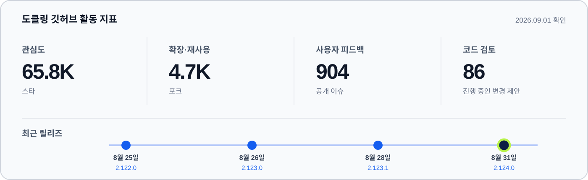

플렛폼을 운영하는 입장에서 유지 보수와 지속 가능성을 고려했을 때 도클링을 사용하는게 적합하다고 판단했습니다

# 2슬라이드

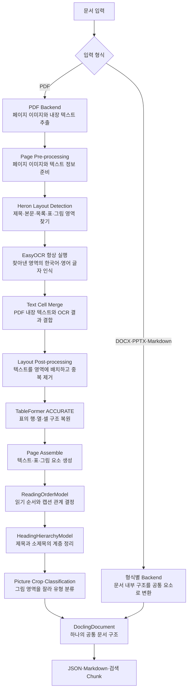

기본 파싱 파이프라인은 다음과 같습니다.

여러확장자의 파일이 들어오면

백엔드, ocr, 레이아웃 영역을 거쳐 읽기 순서, 표의 구조, 이미지 분류를 통해 최종 파싱결과가 출력됩니다

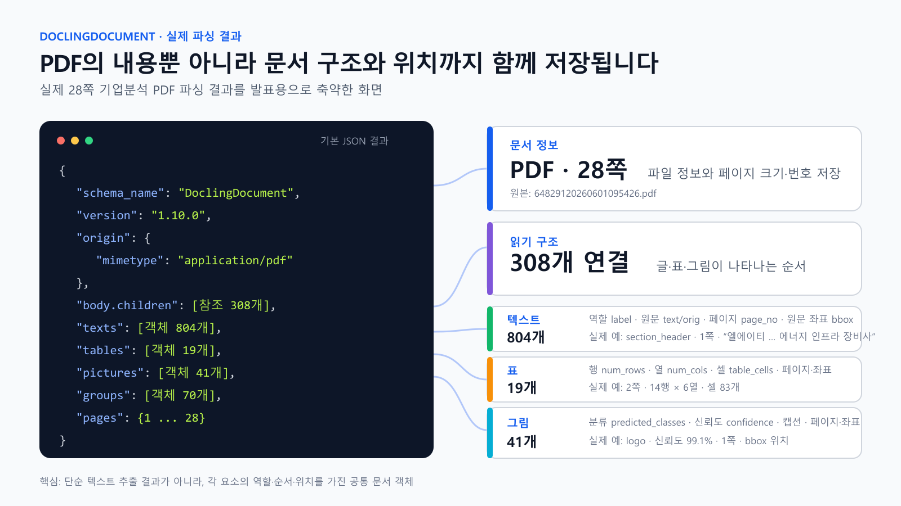

json 출력 결과를 보면 다음과 같습니다. body에 글이나 표 그림 문서내 요소들이 순서상으로 정렬이 되어있습니다

text는 역할 원문 좌표값 등이 파싱이되고

표는 셀에 대한 정보와 페이지 좌표가 파싱이 되고

이미지는 이 이미지가 어떤 이미지인지에 대한 분류와 그에 대한 신뢰도 그리고 이미지의 캡션 마찬가지로 페이지와 좌표 정보가 파싱이됩니다

# 3슬라이드

다음으로는 파싱 결과가 실제 문서의 구조와 내용을 정확하게 반영하는지 확인해야 했습니다.

기업에서 사용하는 기획서, 제품 자료, 소프트웨어 개발 방법론, 사업·감사보고서, 지속가능경영보고서, 정책·규정 문서, 공공기관 가이드와 보안모델, 연구·트렌드 보고서, 회사소개서, 제품 카탈로그와 브로슈어 등 총 206개의 PDF를 통해 파싱 결과를 확인했습니다.

그중 정형화된 보고서와 가이드 문서는 기본적인 문서 구조가 비교적 안정적으로 파싱됐지만, 브로슈어형 PDF에서는 파싱 정확도가 낮아지는 사례가 집중적으로 확인됐습니다.

브로슈어는 페이지마다 글꼴과 글자 크기가 달라지고, 여러 개의 문단·그림·표·장식 요소가 자유롭게 배치됩니다. 또한 위에서 아래로 이어지는 일반적인 문서와 달리 읽는 방향과 제목의 경계가 디자인에 따라 달라질 수 있습니다.

이 문제는 기존 연구에서도 확인됩니다. DocLayNet 연구에서는 학술 문서처럼 구성이 일정한 데이터로 학습한 모델을 다양하고 복잡한 문서 배치에 적용하면 영역 구분 정확도가 크게 낮아진다고 설명합니다. 기업 문서의 다양한 구조를 다룬 ICDAR 문서 배치 분석 대회에서도 복잡한 구조와 형식의 다양성을 문서 변환의 핵심 난제로 정의했습니다.

따라서 저희 플랫폼은 정형화된 문서뿐 아니라, 자유도가 가장 높은 브로슈어형 PDF에서도 높은 정확도로 문서 구조를 복원하는 것을 목표로 설계를 진행했습니다.

근거자료

- [DocLayNet: 다양한 문서 배치에서 기존 모델의 정확도가 낮아지는 문제](https://arxiv.org/abs/2206.01062)
- [ICDAR 2023 기업 문서 배치 분석 대회: 복잡한 구조와 다양한 형식의 문서 분석 문제](https://arxiv.org/abs/2305.14962)

# 4슬라이드

문서 파싱 결과를 검토한 결과, 크게 네 가지 문제를 확인할 수 있었습니다.

## 1. 문서의 제목을 정확하게 검출하지 못한다

문서에서 제목인 `section_header`는 매우 중요한 정보입니다. 제목은 현재 텍스트가 어떤 주제와 섹션에 속해 있는지를 나타내기 때문에, 문서의 맥락을 구성하는 기준이 됩니다.

제목을 일반 텍스트나 목록으로 잘못 인식하면 섹션의 경계가 사라지고, 서로 다른 내용이 하나의 맥락으로 연결될 수 있습니다.

## 2. 문서의 읽기 순서가 부정확하다

문서의 읽기 순서 역시 문맥을 표현하는 중요한 정보입니다.

페이지에 있는 텍스트를 잘 추출하더라도 순서가 뒤바뀌면 문장과 문장 사이의 연결이 끊어지고, 원래 문서가 전달하려던 의미와 다른 결과가 만들어질 수 있습니다.

## 3. 표를 잘못 인식하거나 복잡한 표의 구조를 정확하게 복원하지 못한다

표가 아닌 디자인 요소를 표로 잘못 인식하는 경우가 있었습니다.

또한 복잡한 표에서는 행·열·셀의 관계를 정확하게 복원하지 못하거나 일부 셀 정보가 누락되는 문제가 확인됐습니다.

## 4. 이미지에 대한 설명 정보가 부족하다

이미지에 대한 설명은 이미지의 내용을 검색 대상으로 활용하기 위해 필요한 정보입니다.

하지만 기본 파싱 결과만으로는 이미지가 무엇을 나타내는지, 이미지 안에 어떤 정보와 관계가 포함되어 있는지를 충분히 설명하지 못했습니다.

# 5슬라이드

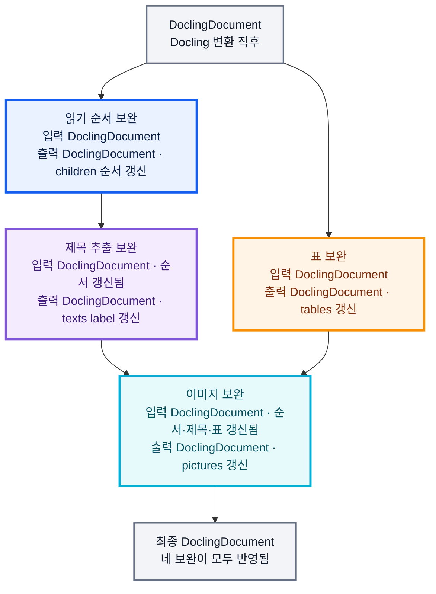

그래서 총 네 가지의 보완 레이어를 설계했습니다.

보완 레이어는 다음 세 가지 원칙을 기준으로 설계했습니다.

## 1. 구조적인 오류는 규칙 기반으로 먼저 보완한다

읽기 순서, 제목, 표처럼 위치와 구조 정보를 이용해 판단할 수 있는 문제는 우선 명확한 규칙으로 보완했습니다.

모든 단계에 LLM이나 머신러닝 모델을 추가하면 처리 자원과 시간이 증가하고, 모델 결과의 변동성과 운영해야 할 구성요소도 함께 늘어나기 때문입니다.

다만 규칙만으로 의미를 파악하기 어려운 이미지 설명에는 모델을 제한적으로 사용했습니다.

## 2. 기존 Docling 파이프라인을 직접 변경하지 않는다

Docling 내부 모델과 기본 처리 과정을 크게 수정하는 대신, 생성된 DoclingDocument를 검수하고 필요한 부분만 수정하는 후처리 레이어로 구성했습니다.

이를 통해 Docling이 업데이트되더라도 기존 파이프라인과의 결합을 최소화하고, 각 보완 기능을 독립적으로 수정하거나 교체할 수 있도록 했습니다.

## 3. 제한된 기간 안에서 검증 가능한 범위부터 구현한다

모든 오류를 한 번에 해결하기보다, 테스트 과정에서 반복적으로 확인됐고 규칙을 통해 원인을 설명할 수 있는 문제부터 구현했습니다.

즉, 이번 단계에서는 완전히 새로운 파싱 모델을 만드는 것이 아니라 기존 Docling의 결과를 유지하면서 명확한 오류를 안정적으로 줄이는 것을 목표로 했습니다.

# 5-1슬라이드

실제 사례를 보면, 삼성SDS 검증범위 문서(p.156)에서 인접한 두 항목의 읽기 순서가 4·5에서 5·4로 뒤바뀐 것을 확인할 수 있습니다.

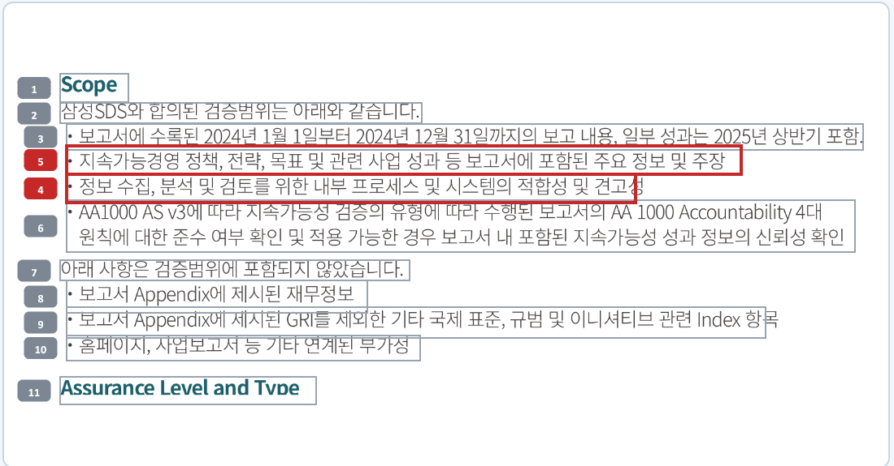

이런 사례들을 통해 좌표 기반 원칙을 세웠습니다. 핵심은 간단합니다 — 인접한 두 요소의 좌표를 비교했을 때 화면상 더 아래에 있는 요소가 오히려 읽기 순서상 더 앞서 있으면, 그 둘의 순서만 맞바꿉니다. 같은 parent인지, 간격·정렬이 비슷한지는 이 교환이 잘못 걸리지 않도록 막는 안전장치입니다.

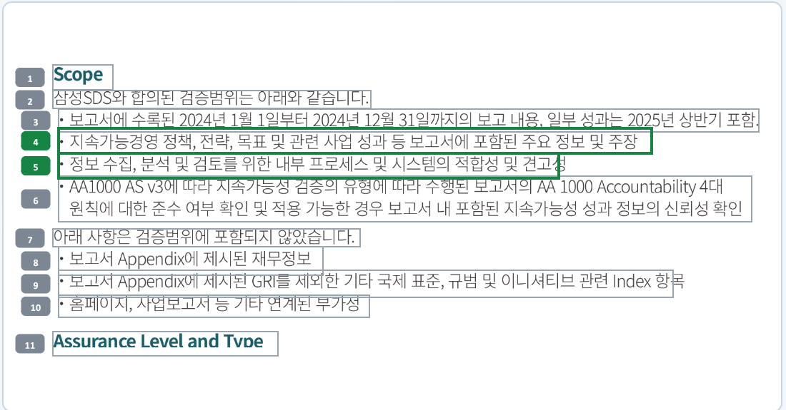

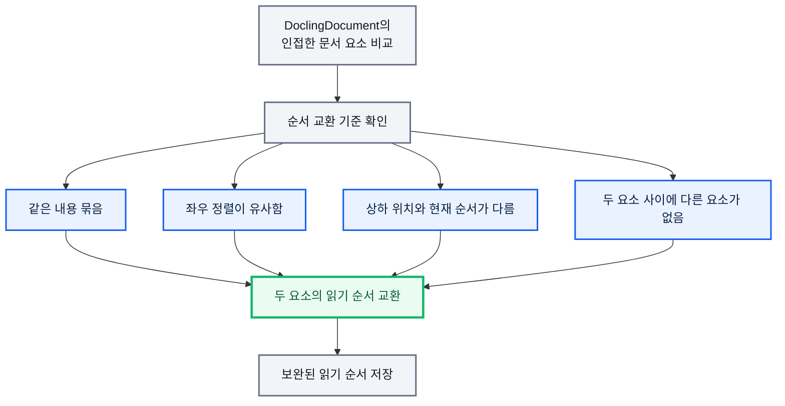

다만 현재는 같은 parent(그룹) 안에서 바로 인접한 두 요소가 뒤바뀐 국소적인 경우만 자동으로 교환합니다. Docling이 애초에 요소를 잘못된 parent로 묶었거나, 순서가 어긋난 두 요소 사이에 다른 요소가 끼어 있거나, 페이지·섹션 단위로 순서가 크게 뒤섞인 경우는 이번 범위에 포함하지 않았습니다. 증거는 있지만 자동 적용 조건을 만족하지 못하는 후보는 REVIEW_REQUIRED로 분류해 원본을 그대로 보존하는데, 공개 문서 5건 홀드아웃 검증에서 이런 폭넓은 사례까지 포함하면 7 TP / 2 FP / 14 FN으로 아직 놓치는 실제 오류가 더 많았습니다. parent 복구와 문서 전체 단위의 읽기 순서 재구성까지 포함한 범용 설계는 저희 프로덕트의 퓨처 워크로 남아있습니다.

# 5-2슬라이드

제목 추출 보완 레이어는 제목이 아닌 요소를 제목으로 승격시키는 역할을 합니다.

다음과 같은 문서가 있습니다. 사람이 보면 Asia-Pacific, Europe, Americas, Middle East가 각 지역 정보를 묶는 제목이라는 것을 바로 알 수 있습니다.

하지만 도클링이 판정한 결과를 보면 Asia-Pacific이 제목이 아니라 list_item으로 분류되어 있습니다.

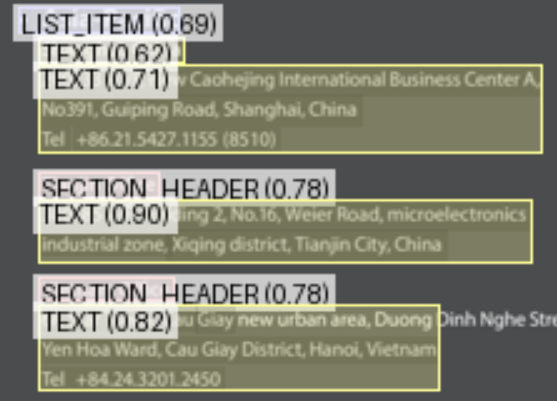

이는 도클링 자체에서도 보고된 문제입니다. 깊게 중첩된 목록에서 같은 구조의 항목인데도 어떤 것은 section_header로, 어떤 것은 list_item으로 일관성 없이 인식되어 마크다운 변환과 제목 기반 청킹이 깨진다는 이슈가 실제로 제기되어 있습니다.

근거자료

- [Docling GitHub Issue #2246: Inconsistent section_header vs list_item on deeply nested list items](https://github.com/docling-project/docling/issues/2246)

그래서 저희는 list_item으로 분류된 요소 중 다음 네 가지 규칙을 모두 통과하는 항목만 section_header로 승격시키도록 구성했습니다.

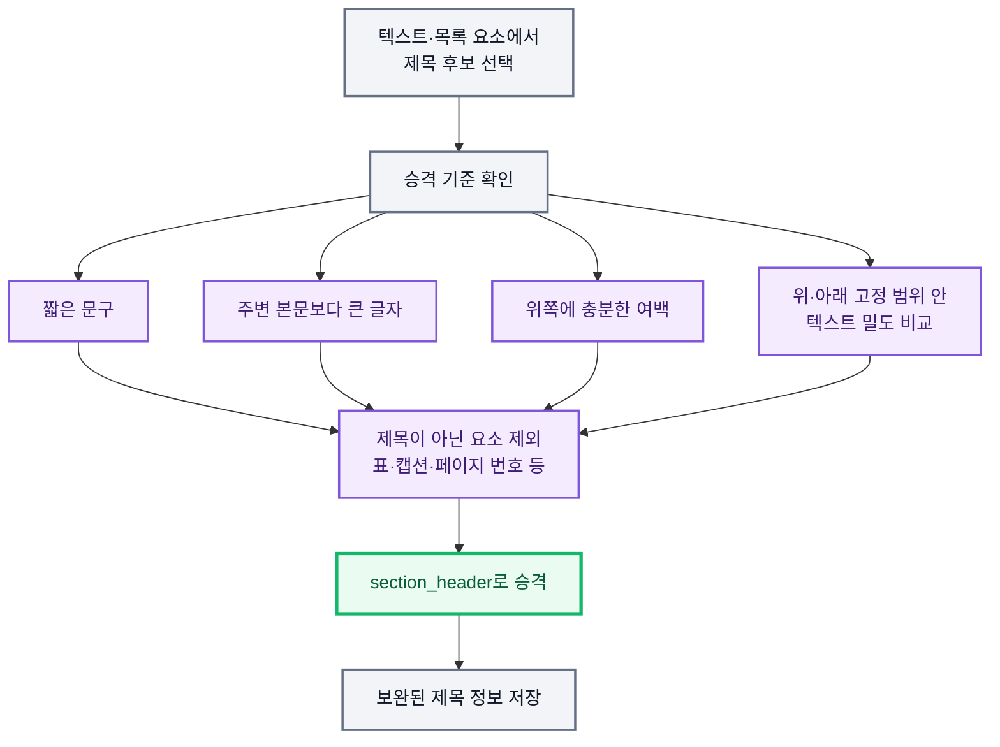

하지만 현재 방식은 제목의 기본적인 물리적 배치(짧은 문구·글자 크기·여백·밀도)만을 신호로 사용하기 때문에 모든 부분이 보완되지는 않습니다. 폰트 스타일(bold 등) 신호를 함께 고려한 범용성 있는 설계는 저희 프로덕트의 퓨처 워크로 남겨두었습니다.

# 5-3슬라이드

표에서는 표를 잘못 인식하는 경우가 있었습니다.

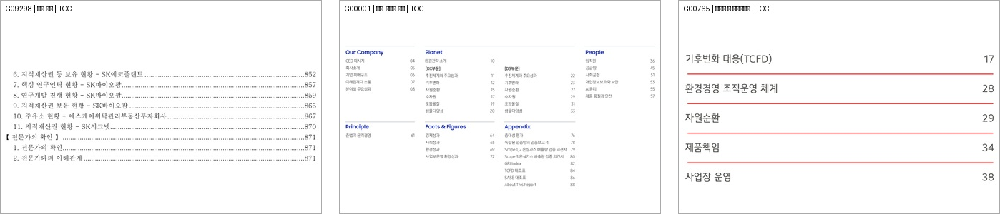

이미지와 같이 격자가 있는 디자인을 표로 잘못 인식하는 경우가 있었습니다. 그래서 우선 표라고 인식한 것 중에 실제 표가 아닌 것을 걸러내도록 설계를 하였습니다.

`final_table_develop_v1` 게이트는 TableFormer가 표로 인식한 TableItem 28,885건을 원본 crop 이미지로 직접 대조 검증해서 만들었습니다. 그중 실제 표는 27,647건, 비표는 1,238건이었는데, 이 비표들을 훑어보니 목차·페이지 번호·단일 셀 조각·긴 서술문처럼 JSON 특징값만으로도 확실하게 구분되는 패턴이 있었고, 그 패턴에서 다음 6개 거절 규칙을 뽑았습니다.

| 규칙 | 조건 | 걸러내는 패턴 |
|---|---|---|
| `DOT_LEADER_TOC` | 셀에 점 5개 이상 또는 줄임표 2개 이상 | 점선 목차 |
| `TITLE_PAGE_LIST` | 페이지 번호 셀 30% 이상 + 제목형 셀 2개 이상 | 제목·페이지 목록 |
| `SHORT_SINGLE_CELL_FRAGMENT` | 셀 1개가 격자 전체 차지 + 높이 33.781pt 이하 | 짧은 단일 셀 조각 |
| `ALL_BULLETED_LONG_TEXT` | 전체 셀이 불릿형 + 75% 이상 30자 이상 | 긴 불릿 텍스트 |
| `ALL_SENTENCE_EXTREME_TEXT` | 전체 셀이 문장형 + 최장 셀 407자 이상 | 서술문 조각 |
| `FULL_WIDTH_PAGE_NUMBER_LIST` | 마지막 열 전부 페이지 번호 + 너비 542.878pt 이상 | 전폭 페이지 목록 |

이 6개 규칙 중 하나라도 걸리면 REJECT, 아무것도 안 걸리면 무조건 PASS로 남기는 fail-open 방식입니다. 실제 검증에서 이 규칙으로 확실한 비표 134건을 제거했고, 실제 표를 잘못 제거한 사례는 0건이었습니다.

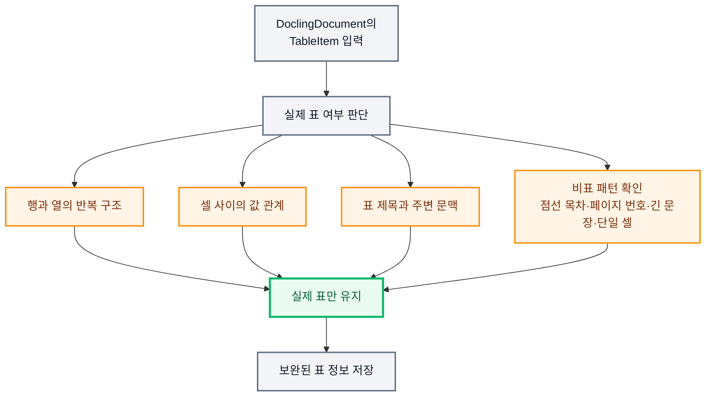

다만 게이트를 통과한 표라고 구조가 완전한 것은 아닙니다. PASS된 표 27,647개를 다시 조사해보니 약 42%에서 선언된 행·열 격자 안에 빈 슬롯이 남거나 헤더·행 그룹의 병합 범위가 부족한 구조 오류가 발견됐습니다. 다만 이 빈 슬롯을 자동으로 셀을 채우거나 병합 범위를 넓히는 방식으로 고치면 원인이 제각각이라(빈 값, 병합 부족, 이미지 셀 등) 오히려 잘못된 구조를 만들 위험이 있어서, 이번 단계에서는 원본 표는 그대로 두고 어디가 비어있는지만 별도로 기록하는 안전한 진단 정보(sidecar)까지만 만들었습니다. 셀 구조 자체를 자동으로 복원·병합하는 범용 설계는 저희 프로덕트의 퓨처 워크로 남아있습니다.

# 5-4슬라이드

이미지 보완 레이어에서는 이미지의 설명 정보를 보완합니다.

기존 도클링의 이미지 설명 기능을 그대로 사용했을 때 확인된 문제점은 크게 세 가지였습니다.

**한국어 안정성이 떨어진다.** "이 이미지는 한국어로 설명할 수 없습니다"처럼 설명 자체를 거부하거나, 반복 생성이 끝나지 않고 이어지는 무효 응답이 그대로 결과에 저장되는 사례가 확인됐습니다.

**할루시네이션이 심하다.** 사진 설명에서는 이미지나 문맥 어디에도 없는 국적, 연령대, 직업, 생몰년도, 역사적 사건 같은 정보가 지어내듯 생성됐고, 장식용 점무늬 이미지가 표로 잘못 분류되면 존재하지 않는 행·열과 값까지 만들어내는 경우도 있었습니다.

**VLM 프롬프트가 고정된다.** 이미지 분류 종류는 많고 분류마다 주로 봐야 할 정보도 다른데, 지침이 하나로 고정돼 있다 보니 설명 품질이 떨어졌습니다. 또한 그림에 연결된 캡션·각주 같은 문맥 정보를 프롬프트에 함께 넣지 못해서, 있는 정보인데도 VLM 답변 생성에 활용되지 못했습니다.

우선 Docling이 지원하는 프리셋 VLM 모델 중 여러 모델(SmolVLM 기본 프리셋, Granite Vision 등)을 같은 조건으로 테스트했고, 그중 한국어 안정성이 가장 우수하다고 판단한 Qwen2.5-VL을 최종 모델로 선택했습니다.

이미지 유형에 따라 프롬프트를 라우팅하도록 설계했습니다. 다만 라우팅만으로는 부족해서, 문맥을 사용하는 우선순위도 함께 정했습니다 — 이미지에 직접 연결된 캡션·각주·참조 정보를 가장 먼저 쓰고, 가장 가까운 제목과 앞뒤 문맥은 보조로만 사용합니다. 여기에 생성된 설명에 대한 언어·환각·반복 검사까지 거친 것만 저장하도록 설계했습니다.

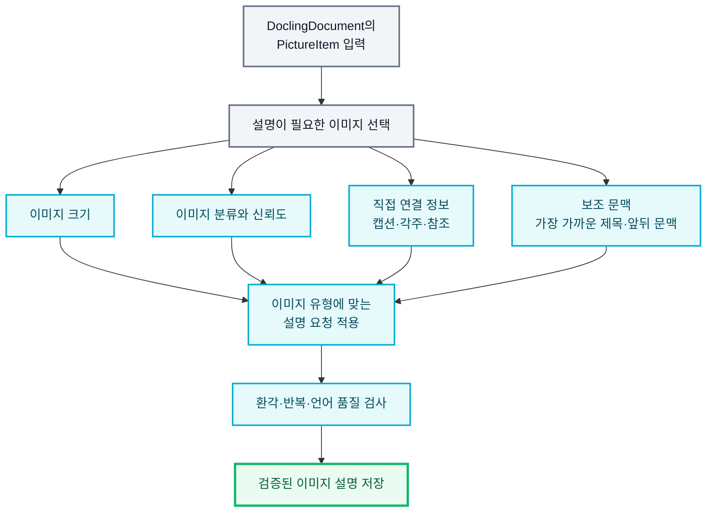

# 6슬라이드

청킹을 위해서는 계층적으로 구성된 파싱 데이터를 일직선으로 직렬화해야 합니다.

텍스트, 표, 목록, 제목은 Docling 기본 시리얼라이저를 그대로 사용했고, 그림만 커스텀 시리얼라이저를 따로 만들었습니다. 승인된 VLM 설명이 있으면 그 설명 텍스트만 임베딩 대상 텍스트로 쓰고, 설명이 없는 경우에만 Docling 기본 그림·메타데이터 시리얼라이저로 대체해서 그림이 청크 목록에서 통째로 빠지지 않도록 했습니다.

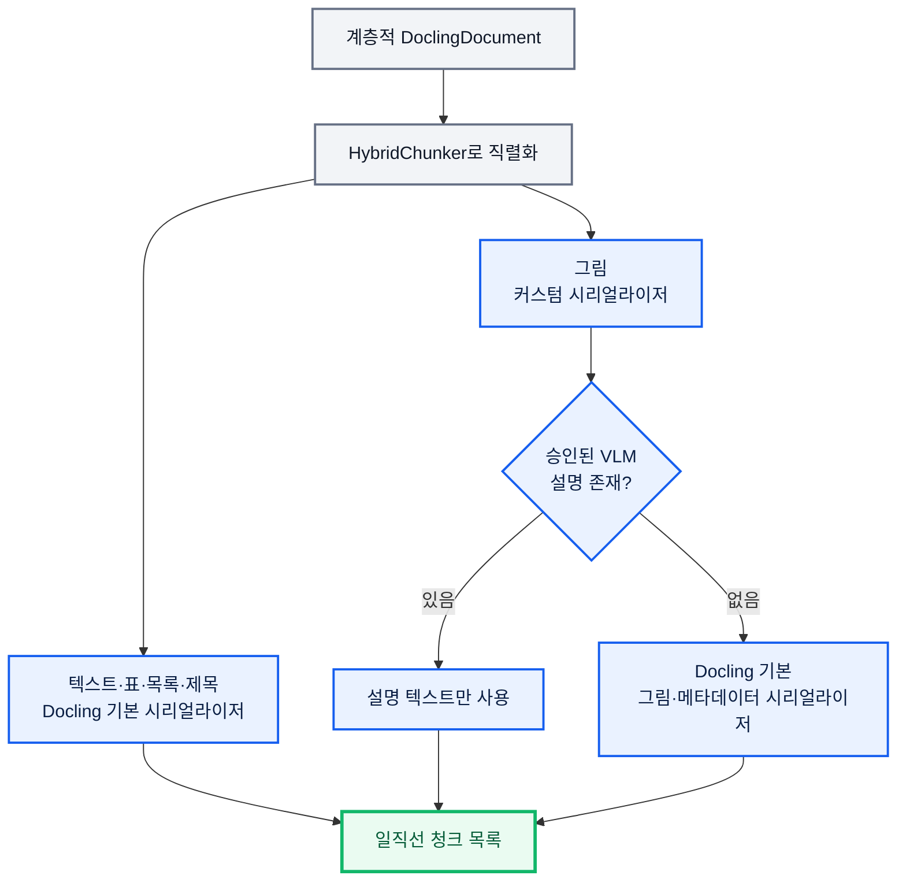

임베딩은 `google/embeddinggemma-300m`(768차원) 모델을 사용했습니다. 청크 상한은 512토큰으로 설정했는데, 청킹 단계에서 토큰 수를 세는 tokenizer도 이 임베딩 모델의 tokenizer와 동일하게 맞췄습니다. 자르는 기준과 실제 임베딩에 들어가는 기준이 다르면 상한 자체가 의미가 없어지기 때문입니다. 

