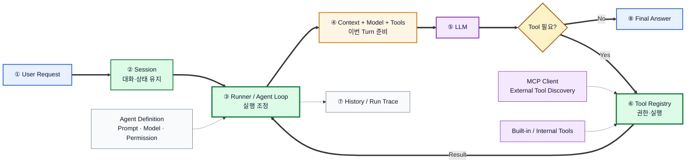

# OpenCode 분석

> 2026-08-10 작성. 담당: 준억.  
> 기준: [`3_Harness_조사/README.md`](https://github.com/SKNETWORKS-FAMILY-AICAMP/SKN29-FINAL-2TEAM/blob/jihun/docs/설계 및 구현/3_중간발표 이후/설계/3_Harness_%EC%A1%B0%EC%82%AC/README.md)  
> 목적: OpenCode 자체를 공부하는 것이 아니라 **우리 Agent Harness Architecture의 설계 근거**를 뽑는다.  
> 상세 코드·용어·구현 근거는 [`opencode_전체조사내용.md`](./opencode_전체조사내용.md)에 남기고, 이 문서는 팀 비교에 필요한 항목만 정리한다.

**분석 대상**: [anomalyco/opencode](https://github.com/anomalyco/opencode) `dev` 브랜치

> **주의**: 현재 OpenCode `dev`는 V2 Core로 이동 중이다. 따라서 Session·Runner·Tool Registry 등은 `packages/core`와 `specs/v2`의 방향을 중심으로 보고, 아직 V2에 완전히 옮겨지지 않은 MCP·Subagent는 현재 제품 코드인 `packages/opencode`도 함께 확인했다. 아래 구조를 하나의 완성된 클래스 다이어그램으로 오해하면 안 된다.

---

## 1. 전체 Architecture

OpenCode에서 가장 중요한 구조는 **Agent 설정과 실제 실행 Runtime을 분리**한다는 점이다.

- **Agent**: Prompt, Model, Permission, Step Limit 등 “어떻게 일할지”에 대한 설정
- **Session**: 대화와 실행 이력이 이어지는 상태 단위
- **Runner**: Session을 읽고 Context·Model·Tool을 조립해 실제 Agent Loop를 실행
- **Tool Registry**: Agent에게 허용된 Tool을 노출하고 실제 Tool Call을 실행
- **MCP**: 외부 MCP Server에서 Tool을 가져오는 연결 계층
- **Model Resolver**: 선택한 Provider/Model을 실제 실행 가능한 LLM 연결로 변환



핵심은 **LLM 한 번 호출이 아니라 `Session → Runner → LLM → Tool → Result → 다시 Runner`가 반복되는 실행 환경**이라는 점이다.

**주요 근거**  
[Session Spec](https://github.com/anomalyco/opencode/blob/dev/specs/v2/session.md) ·
[Session Runner](https://github.com/anomalyco/opencode/blob/dev/packages/core/src/session/runner/llm.ts) ·
[Agent Definition](https://github.com/anomalyco/opencode/blob/dev/packages/opencode/src/agent/agent.ts)

---

## 2. Agent 실행 흐름 (Loop)

OpenCode V2의 Runner는 한 요청을 대략 다음 순서로 처리한다.

1. Session을 읽고 실행할 Agent를 선택한다.
2. System Context와 Session History를 준비한다.
3. Session에서 사용할 Model을 resolve한다.
4. Agent의 Permission을 기준으로 사용할 Tool 목록을 만든다.
5. `llm.stream(request)`로 한 번의 Provider Turn을 실행한다.
6. LLM이 Tool을 호출하면 Tool Call을 기록하고 Tool을 실행한다.
7. Tool Result를 Session에 반영한다.
8. 결과를 포함한 Context로 다음 Provider Turn을 실행한다.
9. 더 이상 Tool이 필요 없거나 Step Limit에 도달하면 종료한다.

즉 Agent Loop의 본질은 단순한 `while`문보다 **Runner가 Session·Context·Model·Tool·실행 결과를 한 곳에서 조정하는 것**이다.

우리 Harness의 기존 초안인

> 요청 분석 → Tool 선택 → 실행 → 결과 확인 → 반복 / 종료

와 방향이 일치한다. 다만 OpenCode처럼 다중 노드 실행, 복잡한 crash recovery, Event Replay까지 구현할 필요는 없다.

**주요 근거**  
[Session Runner](https://github.com/anomalyco/opencode/blob/dev/packages/core/src/session/runner/llm.ts) ·
[Session Spec](https://github.com/anomalyco/opencode/blob/dev/specs/v2/session.md)

---

## 3. Context 유지 방식

OpenCode는 **저장된 전체 Session History와 이번 LLM 호출에 실제로 보여줄 Context를 구분**한다.

V2에서는 System Context를 별도로 관리하며 현재 확인되는 Source는 환경 정보, 날짜, 프로젝트 Instruction(`AGENTS.md`), 선택 Agent의 Skill Guidance 등이다. Runner는 Provider Turn마다 필요한 History와 System Context를 조립해 LLM Request를 만든다.

Context가 길어지면 **Compaction**을 사용한다. 전체 Transcript는 그대로 보존하고, LLM에게 보여주는 과거 표현만 요약 + 최근 Context 형태로 줄인다.

우리 프로젝트에서 중요한 것은 OpenCode의 `Context Epoch` 자체를 복제하는 것이 아니라 다음 정보를 한 계층에서 조립하는 것이다.

- Agent Instruction
- 최근 Chat History
- 현재 사용자 요청
- Team / Project Scope
- 기존 pgvector Retrieval 결과
- 직전 Tool Result

즉 **Context Manager가 “이번 Turn에 무엇을 보여줄지” 결정하는 구조**를 가져오는 것이 핵심이다.

**주요 근거**  
[Session Spec — Context Epoch / Compaction](https://github.com/anomalyco/opencode/blob/dev/specs/v2/session.md)

---

## 4. Memory 구조

OpenCode에서 이번 조사로 명확히 확인되는 기억 방식은 크게 두 가지다.

1. **Durable Session History**: 대화, Tool Call, Tool Result 등 실행 이력을 Session에 유지
2. **Compaction**: 긴 History를 LLM Context Window 안에서 다시 사용할 수 있도록 요약

조사한 Core Runtime에서는 별도의 중앙 **Semantic / Vector Long-term Memory**가 핵심 Runtime 구성요소로 드러나지는 않았다. 따라서 OpenCode의 “Memory”를 우리 pgvector Knowledge와 같은 것으로 보면 안 된다.

우리 프로젝트에서는 다음처럼 구분하는 편이 적절하다.

| 구분 | 역할 | 현재 자산 |
|---|---|---|
| Conversation Memory | 대화 이력 | `chat_session`, `chat_message` |
| Current Run State | Tool Call·실행 결과·진행 상태 | `agent_run`, `tool_call` |
| Enterprise Knowledge | 프로젝트/회사 문서 검색 | 기존 PostgreSQL + pgvector |

**판단**: Session History는 필수이고, Compaction은 확장 가능 구조만 남긴다. 별도의 장기 개인/팀 Semantic Memory는 이번 범위에서 만들지 않는다.

**주요 근거**  
[Session Spec — Automatic Compaction](https://github.com/anomalyco/opencode/blob/dev/specs/v2/session.md)

---

## 5. Tool 호출 구조

OpenCode V2의 `ToolRegistry`는 Tool을 Agent 코드에 직접 연결하지 않고 **공통 Registry를 통해 노출·실행**한다.

핵심 흐름은 다음과 같다.

```text
Tool 등록
→ Agent Permission 기준으로 사용할 Tool만 materialize
→ LLM에게 Tool Definition 노출
→ LLM Tool Call
→ Registry가 입력 검증·실행
→ Tool Result 반환
→ Runner가 다음 Turn 계속
```

Tool 실행 시 `sessionID`, `agent`, `assistantMessageID`, `toolCallID` 같은 실행 Context가 함께 전달된다. 또한 완전히 금지된 Tool은 LLM에게 애초에 노출하지 않는다.

이 구조가 중요한 이유는 **Built-in Tool, 기존 REST 기능, MCP Tool을 같은 Agent 실행 경계 안에 넣을 수 있기 때문**이다.

우리 Harness도 다음 정도의 공통 계약을 두는 것이 적절하다.

```text
Tool
- name
- description
- input schema
- permission
- execute()
```

특히 Tool Description은 LLM이 어떤 Tool을 선택할지 판단하는 입력이므로 단순 UI 설명문이 아니라 **실행 품질에 직접 영향을 주는 Harness 요소**다.

**주요 근거**  
[Tool Registry](https://github.com/anomalyco/opencode/blob/dev/packages/core/src/tool/registry.ts) ·
[V2 Tool Spec](https://github.com/anomalyco/opencode/blob/dev/specs/v2/tools.md)

---

## 6. MCP 연결

OpenCode의 MCP 계층은 **Agent Loop 자체가 아니라 외부 Tool을 공급하는 연결 계층**이다.

현재 제품 코드에서는 공식 MCP SDK를 사용해 다음을 관리한다.

- Local `stdio`
- Remote Streamable HTTP
- SSE fallback
- OAuth / 인증 상태
- MCP Server 연결 상태
- Tool Definition Discovery
- Tool 목록 변경 감지
- Resource / Prompt 조회

MCP에서 발견한 Tool은 그대로 Agent가 직접 호출하는 것이 아니라 **Runtime의 Tool 형식으로 변환되어 일반 Tool과 함께 사용**된다.

따라서 우리 구조도 다음처럼 가는 것이 맞다.

```text
Settings: MCP Server 등록
→ MCP Client 연결 / Tool Discovery
→ Builder에서 Agent에 사용할 Tool 선택
→ Harness의 Tool Registry에 노출
→ LLM이 선택
→ MCP Client 실행
→ Tool Result를 Agent Loop에 반환
```

우리 프로젝트의 대표 구현은 **Jira MCP** 하나를 E2E로 완성하는 데 집중한다. OpenCode가 지원하는 Local Transport, Resource, Prompt, 전체 OAuth 기능을 모두 구현할 필요는 없다.

**주요 근거**  
[MCP Runtime](https://github.com/anomalyco/opencode/blob/dev/packages/opencode/src/mcp/index.ts) ·
[Current Tool Assembly](https://github.com/anomalyco/opencode/blob/dev/packages/opencode/src/session/tools.ts)

---

## 7. LLM·Model 연결 구조

OpenCode는 Agent와 특정 LLM 호출 코드를 직접 묶지 않는다.

V2의 Model Resolver는 Session에서 선택한 Model을 Catalog에서 찾고, Provider 연결 정보와 Credential을 resolve한 뒤 실제 실행 가능한 LLM Route로 변환한다.

현재 V2 Runner의 이 코드 경로에서 확인되는 실행 Adapter는 다음과 같다.

- OpenAI
- Anthropic
- OpenAI-compatible endpoint

중요한 점은 **Model 목록과 실제 실행 Adapter를 분리한다는 것**이다.

우리 프로젝트에서는 OpenCode 수준의 거대한 Provider Catalog보다 다음 정도면 충분하다.

```text
Agent.model
   ↓
Model Registry / Resolver
   ├─ OpenAI
   └─ OpenAI-compatible (Local / vLLM)
```

이렇게 하면 Builder에서 Model을 선택할 수 있고, Harness의 Agent Loop는 어떤 Provider를 쓰는지 몰라도 된다.

**주요 근거**  
[Session Model Resolver](https://github.com/anomalyco/opencode/blob/dev/packages/core/src/session/runner/model.ts) ·
[Provider / Model Spec](https://github.com/anomalyco/opencode/blob/dev/specs/v2/provider-model.md)

---

## 8. 여러 Agent·Tool 연결 방식

OpenCode에서는 다른 Agent에게 일을 맡기는 기능도 **Tool 호출 형태**로 연결한다.

`Task Tool`이 실행되면:

1. 호출할 Subagent를 선택한다.
2. `parentID`를 가진 별도 Child Session을 만든다.
3. 부모 Permission과 Subagent Permission을 조합한다.
4. Subagent가 별도 Context에서 작업한다.
5. 결과를 Parent Agent에 반환한다.
6. 필요하면 `task_id`로 기존 Subagent Session을 다시 사용할 수 있다.

즉 구조는 다음과 같다.

```text
Parent Agent / Session
→ Task Tool
→ Child Session
→ Subagent
→ Result
→ Parent Agent
```

장점은 **Subagent의 Context·Permission·실패·실행 이력을 부모 Session과 분리할 수 있다는 것**이다.

다만 우리 Architecture 초안에서 Agent-to-Agent는 **“여지만 남기고 이번 완성 목표에서는 제외”**로 정해져 있다. 이 판단을 유지하는 것이 맞다. Child Session, Permission 상속, 실패 전파, Depth 제한, Background 실행까지 구현하면 대표 E2E에 비해 범위가 크게 늘어난다.

따라서 v1에서는 기존 `task_extraction`을 다른 Agent가 호출하는 Subagent로 만들기보다 **Chat에서 선택되는 Pre-built Task Extraction Agent의 내부 로직으로 재사용**하는 편이 안전하다.

**주요 근거**  
[Task Tool / Subagent](https://github.com/anomalyco/opencode/blob/dev/packages/opencode/src/tool/task.ts) ·
[Agent Definition](https://github.com/anomalyco/opencode/blob/dev/packages/opencode/src/agent/agent.ts)

---

## 9. 우리 Harness에 적용할 것 / 적용하지 않을 것과 이유

| 패턴 | 적용 여부 | 이유 |
|---|---|---|
| **Session + Runner / Agent Loop 분리** | **적용** | 범용 Agent Platform의 실행 중심이다. Agent 설정과 실행 코드를 분리하고 `LLM → Tool → Result → 다음 Turn`을 반복할 수 있어야 한다. |
| **Context 조립 계층** | **적용** | Chat History·Project Scope·Retrieval·Tool Result를 매 Turn에 필요한 형태로 조립해야 한다. OpenCode의 Context Epoch 전체를 복제할 필요는 없다. |
| **Durable Session History** | **적용** | 대화와 Tool 실행 결과를 이어가고 실패 원인을 확인하려면 필요하다. |
| **Context Compaction** | **구조만** | 긴 Session 대응에는 유용하지만 현재 대표 E2E의 핵심은 아니다. 향후 추가 가능한 경계만 남긴다. |
| **Tool Registry / 공통 Tool 계약** | **적용** | Internal Tool·기존 REST 기능·MCP Tool을 Agent에 하드코딩하지 않고 하나의 실행 인터페이스로 묶을 수 있다. |
| **MCP Client / Adapter** | **적용** | Jira 같은 외부 업무 도구를 표준 Tool 공급 경로로 연결하기 위해 필요하다. 단, Jira 대표 E2E에 필요한 범위만 구현한다. |
| **Model Resolver** | **적용** | OpenAI와 Local/OpenAI-compatible Model을 Agent Loop와 분리하고 Builder의 Model 선택과 연결할 수 있다. |
| **Agent별 Permission** | **최소 적용** | Agent마다 사용할 수 있는 Tool을 제한해야 한다. Jira 생성 같은 Side Effect는 기존 E2E의 사용자 확인 단계와 함께 처리한다. |
| **Subagent / Agent-as-Tool** | **인터페이스 여지만** | 구조는 유용하지만 Child Session·권한 상속·실패 전파까지 구현하면 범위가 커진다. 이번에는 단일 Top-level Agent 중심으로 간다. |
| **Persistent Semantic Memory** | **비적용** | OpenCode 핵심 Runtime에서 필수 구조로 확인되지 않았고, 현재는 기존 pgvector Knowledge와 Session History로 대표 시나리오를 충분히 구성할 수 있다. |
| **Full Event Sourcing / Replay / Cluster Session Ownership** | **비적용** | 실제 제품 운영을 위한 고급 안정성 구조로, 8월 대표 E2E와 학습 목표에 비해 구현 비용이 지나치게 크다. |
| **Background Subagent / Plugin Hot Reload / MCP 전체 Spec** | **비적용** | 확장성은 보여줄 수 있지만 이번 프로젝트의 핵심 가치와 평가에 직접 기여하지 않는다. |

**한 줄 결론**: OpenCode에서 가져갈 핵심은 특정 코드가 아니라 **`Session → Runner → Context·Model·Tool 조립 → LLM → Tool 실행 → Result → 다음 Turn`으로 이어지는 Harness의 책임 분리**다. 우리 프로젝트는 이 구조를 최소 동작 수준으로 구현하고, Subagent·Compaction·분산 실행 같은 제품급 기능은 구조만 남기거나 이번 범위에서 제외한다.
