# OpenCode Agent Harness 구조 분석

> **조사 대상**: [`anomalyco/opencode`](https://github.com/anomalyco/opencode)  
> **조사 기준**: 2026-08-10, 기본 브랜치 `dev`  
> **우리 프로젝트 기준**: [`docs/설계 및 구현/3_중간발표 이후/설계/`](https://github.com/SKNETWORKS-FAMILY-AICAMP/SKN29-FINAL-2TEAM/tree/main/docs/설계 및 구현/3_중간발표 이후/설계) 및 [`docs/설계 및 구현/3_중간발표 이후/설계/3_Harness_조사/README.md`](https://github.com/SKNETWORKS-FAMILY-AICAMP/SKN29-FINAL-2TEAM/blob/main/docs/설계 및 구현/3_중간발표 이후/설계/3_Harness_%EC%A1%B0%EC%82%AC/README.md)  
> **목적**: OpenCode 코드를 가져다 쓰는 것이 아니라, 실제 Agent Product가 **Session·Context·Model·Tool을 어떻게 연결해 Agent를 실행하는지** 이해하고 우리 Agent Harness의 설계 근거를 만든다.

---

<a id="section-0"></a>

## 0. 이 문서를 어떻게 읽으면 되는가

이 문서는 OpenCode 사용법이나 코드 전체를 설명하는 문서가 아니다.

**OpenCode를 처음 보는 팀원도 이 문서만으로 전체 구조를 설명할 수 있게 만드는 것**을 우선한다. 그래서 처음에는 쉬운 개념과 전체 흐름을 보고, 뒤로 갈수록 실제 OpenCode 구조와 우리 TO-BE 판단을 확인하는 순서로 구성했다.

### 0.1 OpenCode를 한 문장으로 먼저 이해하기

OpenCode는 **사용자의 요청을 LLM에게 전달하는 데서 끝나지 않고, 대화 상태를 유지하면서 필요한 Tool을 선택·실행하고 그 결과를 다시 LLM에게 전달해 작업을 이어가는 오픈소스 AI Coding Agent 제품**이다.

우리 팀이 OpenCode를 보는 이유는 코딩 기능 자체가 아니라, 이 과정이 가능하도록 만든 **Agent Runtime / Harness 구조**를 이해하기 위해서다.

### 0.2 먼저 알아두면 좋은 핵심 용어

| 용어 | 이 문서에서의 쉬운 뜻 | 기억할 한 문장 |
|---|---|---|
| **Agent** | 역할과 실행 규칙을 담은 설정 | “무슨 일을 하고 무엇을 쓸 수 있는가” |
| **Harness / Runtime** | Agent가 실제로 일할 수 있게 해주는 실행 환경 | Agent를 움직이는 기반 |
| **Session** | 한 대화를 이어가는 작업 공간 | 지금까지 무엇을 했는지 이어준다 |
| **Agent Run** | 사용자 요청 한 번을 처리하는 실행 단위 | **우리 TO-BE에서 쓰는 실행/로그 단위**다 |
| **Turn / Provider Turn** | LLM에 요청을 한 번 보내고 응답을 받는 한 라운드 | Tool 결과 뒤에는 다음 Turn이 올 수 있다 |
| **Context** | 이번 LLM 호출에 실제로 넣는 정보 | 저장된 모든 정보와 같지 않다 |
| **Tool** | Agent가 사용할 수 있는 기능 | 검색·계산·Jira 생성 같은 행동 |
| **Tool Registry** | 사용할 Tool을 모으고 골라 실행시키는 계층 | Agent와 Tool을 직접 묶지 않는다 |
| **MCP** | 외부 기능을 Tool로 연결하는 표준 방식 중 하나 | Harness 전체가 아니라 연결 경로다 |
| **Provider / Model** | LLM 제공자와 실제 모델 | OpenAI와 특정 GPT 모델은 구분해서 본다 |
| **Subagent** | 부모 Agent가 별도 작업으로 위임하는 다른 Agent | OpenCode는 Child Session으로 분리한다 |

> **OpenCode 코드 용어 메모**: 뒤에서 나오는 `materialize`는 “이번 Turn에 LLM이 볼 수 있는 Tool 목록을 확정한다”, `settle`/`settlement`는 “Tool 호출을 실행하고 성공·실패 결과를 정리해 Runner로 돌려준다” 정도로 이해하면 충분하다.

### 0.3 OpenCode의 실제 이름과 우리 문서의 개념명을 구분하기

이 문서는 이해를 위해 몇몇 책임을 묶어 이름 붙인다. 따라서 **아래 이름이 전부 OpenCode에 동일한 클래스/모듈명으로 존재하는 것은 아니다.**

| 표현 | 성격 | 설명 |
|---|---|---|
| `Session`, `SessionRunner`, `ToolRegistry`, `MCP`, `Agent` | **OpenCode에서 실제 확인되는 핵심 명칭** | 코드/Spec의 직접 근거가 있다 |
| `Context Epoch`, `Compaction` | **OpenCode V2의 실제 설계 개념** | V2 Session Spec과 Core에서 확인 |
| **Agent Harness** | **우리 프로젝트의 상위 개념** | OpenCode의 Runner·Session·Tool·Context 책임을 참고하기 위해 묶어 부른다 |
| **Context Manager** | **우리 TO-BE 설계명** | OpenCode의 Context 조립 패턴을 우리 서비스 구조로 단순화한 표현 |
| **Agent Run** | **우리 TO-BE의 실행/로그 단위** | OpenCode 구조를 참고하지만 우리 DB의 `agent_run` 설계를 뜻한다 |
| **Model Registry / Resolver** | **우리 TO-BE에서 축약한 책임명** | OpenCode의 Catalog·Provider·Model Resolver 구조를 작은 범위로 가져온다 |

이 구분을 해두면 “OpenCode에 `AgentHarness`라는 클래스가 있나?” 같은 혼동을 피할 수 있다.

### 0.4 읽는 방법

- **전체를 빨리 이해하려면**: [§1](#section-1) → [§2](#section-2) → [§14](#section-14) → [§15](#section-15) → [§16](#section-16) → [§17](#section-17) → [§19](#section-19)
- **구현 구조까지 이해하려면**: [§3](#section-3)~[§13](#section-13)을 순서대로 읽는다.
- **팀 공유 때 설명하려면**: [§1의 전체 그림](#section-1)과 [§17의 우리 E2E](#section-17)를 먼저 보여준 뒤, 질문이 나온 항목을 [§3](#section-3)~[§13](#section-13)에서 설명하면 된다.


### 0.5 문서 바로가기

긴 문서이므로 아래 링크를 기준으로 필요한 깊이까지 읽으면 된다.

| 읽는 목적 | 바로가기 |
|---|---|
| **전체 구조 먼저 이해** | [§1 전체 그림](#section-1) · [§2 실행 흐름](#section-2) |
| **Harness 구성요소 이해** | [§3 Agent](#section-3) · [§4 Session/Loop](#section-4) · [§5 Context](#section-5) · [§6 Memory](#section-6) · [§7 Tool](#section-7) · [§8 MCP](#section-8) · [§9 Model](#section-9) · [§10 Permission](#section-10) · [§11 Subagent](#section-11) · [§12 Observability](#section-12) · [§13 Core/Adapter](#section-13) |
| **우리 TO-BE에 적용 판단** | [§14 매핑](#section-14) · [§15 적용/제외 판단](#section-15) · [§16 권장 Architecture](#section-16) · [§17 대표 E2E](#section-17) · [§18 주의점](#section-18) |
| **결론과 근거 확인** | [§19 최종 결론](#section-19) · [§20 조사 체크리스트](#section-20) · [§21 주요 소스](#section-21) · [§22 최종 적용 판단](#section-22) |

우리 팀이 확인하기로 한 다음 질문에 답하는 데 집중한다.

- OpenCode의 전체 Architecture는 어떻게 생겼는가?
- Agent는 실제로 어떤 Loop를 따라 실행되는가?
- Context는 어떻게 만들고 유지하는가?
- Memory는 무엇을 저장하고, 긴 대화는 어떻게 다루는가?
- Tool은 어떻게 등록·선택·실행되는가?
- MCP는 Tool 구조와 어떻게 연결되는가?
- LLM / Model은 어떻게 교체 가능한 구조로 연결되는가?
- 여러 Agent는 어떻게 연결되는가?
- 우리 TO-BE의 Permission·Observability에는 무엇을 참고할 수 있는가?
- 그래서 **우리 Harness에 무엇을 적용하고, 무엇은 적용하지 않을 것인가?**

### 먼저 알아둘 점 — OpenCode는 V2 구조로 이동 중이다

OpenCode `dev` 브랜치에는 현재 제품 코드([`packages/opencode`](https://github.com/anomalyco/opencode/tree/dev/packages/opencode))와 새 Core 구조([`packages/core`](https://github.com/anomalyco/opencode/tree/dev/packages/core), [`specs/v2`](https://github.com/anomalyco/opencode/tree/dev/specs/v2))가 함께 존재한다.

따라서 이 문서는 두 종류의 근거를 구분해서 사용한다.

- **V2 Core / Specs**: OpenCode가 책임을 어떻게 분리하려는지, Session·Runner·Tool Registry·Model 구조의 설계 의도를 확인하는 데 사용
- **현재 제품 코드**: MCP 연결, Agent 정의, Subagent 등 실제 제품에서 이미 동작하는 기능을 확인하는 데 사용

즉 아래의 전체 그림은 특정 파일 하나를 그대로 옮긴 클래스 다이어그램이 아니라, **OpenCode의 현재 동작과 V2 설계 방향에서 공통적으로 확인되는 Agent Runtime의 책임을 합쳐 표현한 개념 Architecture**다.

---

> **PART A · OpenCode 전체 동작 이해**  
> 먼저 “무엇이 어떤 순서로 움직이는가”를 잡는다. 세부 구현보다 메인 실행 흐름이 우선이다.

<a id="section-1"></a>

## 1. OpenCode 전체 그림부터 보기

> **이 섹션에서 답할 질문**: OpenCode에서 한 요청은 어떤 메인 경로를 따라 실행되고, 어디에서 반복되는가?

> **주요 근거**: [OpenCode README](https://github.com/anomalyco/opencode/blob/dev/README.md) · [V2 Session Spec](https://github.com/anomalyco/opencode/blob/dev/specs/v2/session.md) · [Session Runner](https://github.com/anomalyco/opencode/blob/dev/packages/core/src/session/runner/llm.ts) · [Tool Registry](https://github.com/anomalyco/opencode/blob/dev/packages/core/src/tool/registry.ts) · [MCP Runtime](https://github.com/anomalyco/opencode/blob/dev/packages/opencode/src/mcp/index.ts)

OpenCode는 스스로를 오픈소스 AI Coding Agent로 소개한다. 하지만 우리 조사에서 중요한 것은 “코딩을 잘한다”가 아니라 **Agent가 계속 일할 수 있도록 어떤 실행 환경을 만들었는가**이다.

### 1.1 먼저 6단계로 이해하기

OpenCode 내부 이름을 보기 전에 **한 요청이 어디를 거쳐 다시 답으로 돌아오는지**만 먼저 잡으면 된다.

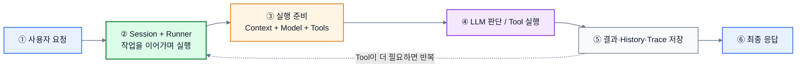

> **읽는 법**: 굵은 화살표(`==>`)가 **사용자 요청에서 최종 응답까지의 메인 경로**이고, 점선은 Tool 결과가 생겼을 때 Runner로 돌아가는 **반복 경로**다.

이 그림에서 기억할 것은 하나다. **OpenCode는 LLM을 한 번 호출하는 프로그램이 아니라, Session/Runner가 상태를 유지하면서 LLM과 Tool 실행을 필요할 만큼 반복하는 제품**이다.

### 1.2 세부 Architecture

이제 위 6단계 안에 실제로 어떤 책임들이 들어가는지 펼쳐 보면 다음과 같다.

아래 그림에서는 **색을 기능별 의미로만 사용**한다. 장식 목적의 색상은 넣지 않았다.

- 🔵 **파랑**: 사용자 입력·Agent 설정
- 🟢 **초록**: 실제 실행을 조정하는 Runtime 핵심
- 🟠 **주황**: Context·History처럼 실행 중 상태를 유지하는 영역
- 🟣 **보라**: Model·Tool·MCP 같은 외부 실행 연결
- ⚪ **회색**: 기록·결과
- **굵은 실선**: 반드시 따라가는 메인 실행 경로
- **점선**: 메인 경로를 준비하거나 보조하는 연결

> Mermaid의 폰트·페이지 배경은 GitHub/Notion 등 렌더러 환경에 따라 달라질 수 있어 강제로 지정하지 않았다. 대신 **노드 색·테두리 두께·선 스타일처럼 구조 이해에 직접 도움이 되는 요소만** 사용했다.

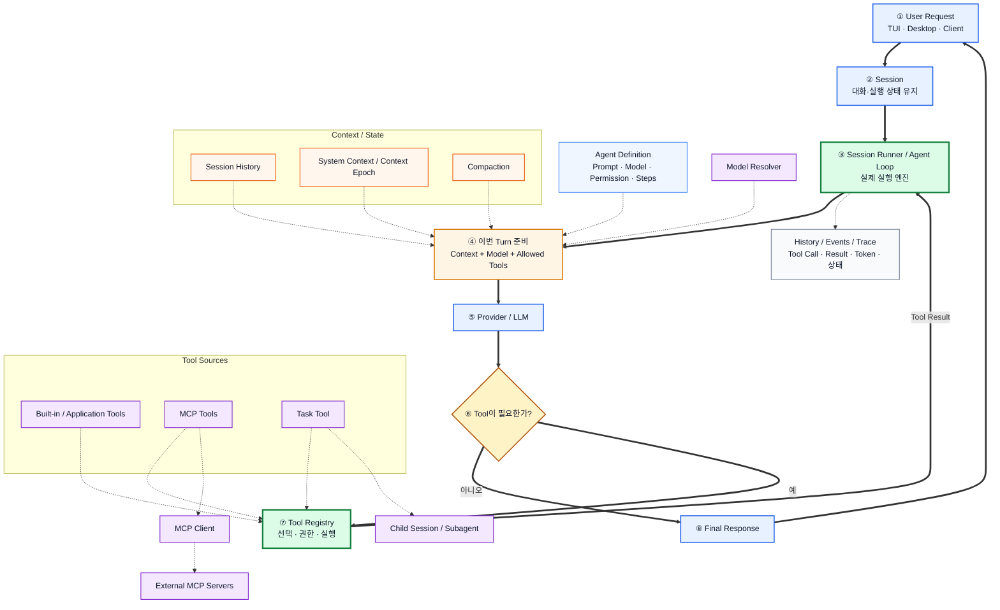

#### 30초 설명

위 그림을 가장 쉽게 풀면 다음과 같다.

1. **Agent**는 “무슨 일을 하고 어떤 모델·도구를 쓸 수 있는가”라는 **설정**이다.
2. **Session**은 한 대화와 그 안에서 일어난 실행을 이어가는 **작업 공간**이다.
3. **Runner**가 Session을 읽고 실제 Agent 실행을 시작한다.
4. Runner는 이번 LLM 호출에 필요한 **Context**, 사용할 **Model**, 허용된 **Tool**을 준비한다.
5. LLM이 Tool이 필요하다고 판단하면 Tool을 실행한다.
6. Tool 결과를 Session에 남기고 다시 LLM에게 보여준다.
7. 더 이상 Tool이 필요 없을 때 최종 답변을 반환한다.
8. 이 과정의 Tool Call·결과·실패·토큰 등은 추적 가능한 상태로 남는다.

따라서 OpenCode를 보며 가장 먼저 가져가야 할 관점은 다음이다.

> **Agent Product의 핵심은 Agent 객체 하나가 아니라, Session을 중심으로 Context·Model·Tool을 조립하고 `LLM → Tool → 결과 → 다시 LLM`을 반복시키는 Runtime이다.**

---

<a id="section-2"></a>

## 2. 한 요청이 실제로 어떻게 처리되는가 — Agent 실행 흐름

> **이 섹션에서 답할 질문**: 사용자 요청 한 번이 Runner·LLM·Tool을 거쳐 최종 응답이 되기까지 어떤 순서로 진행되는가?

> **주요 근거**: [V2 Session Spec](https://github.com/anomalyco/opencode/blob/dev/specs/v2/session.md) · [Session Runner](https://github.com/anomalyco/opencode/blob/dev/packages/core/src/session/runner/llm.ts)

우리 프로젝트의 대표 요청을 그대로 대입해 보자.

> **“이번 프로젝트 문서를 참고해서 업무를 정리하고 Jira에 등록해줘.”**

OpenCode의 Runtime 패턴을 우리 예시에 대입하면 다음과 같은 흐름으로 이해할 수 있다.

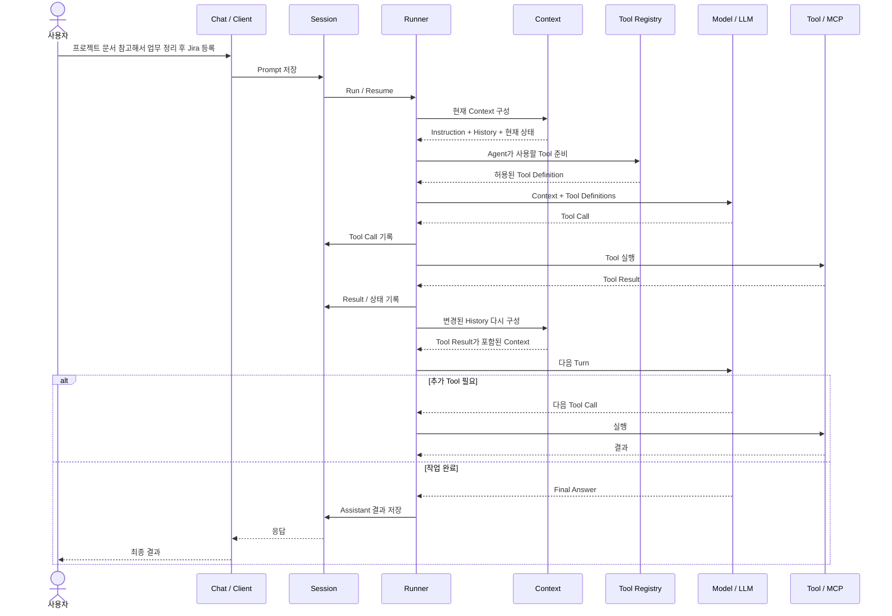

OpenCode V2 `SessionRunner`의 실제 코드도 이 책임을 분리한다. 여기서 **Provider Turn은 “LLM에 요청을 한 번 보내고 응답을 받는 한 라운드”**를 뜻한다. Tool을 사용하면 Tool Result를 반영한 다음 새 Turn이 이어질 수 있다.

- Session을 읽는다.
- Agent를 선택한다.
- System Context를 준비한다.
- Model을 resolve한다.
- Session History를 불러온다.
- Agent Permission을 기준으로 Tool을 materialize한다.
- `llm.stream(request)`로 한 번의 Provider Turn을 실행한다.
- Tool Call이 발생하면 실제 Side Effect 전에 Tool Call을 먼저 기록한다.
- Tool을 실행하고 결과를 기록한다.
- Tool 결과가 생겼다면 다음 Provider Turn을 실행한다.
- Agent의 step limit 또는 최종 응답에 도달하면 종료한다.

### 우리 TO-BE에서의 의미

현재 우리 Architecture 초안은 Harness의 Agent Loop를 다음처럼 정의한다.

> 요청 분석 → Tool 선택 → 실행 → 결과 확인 → 반복 / 종료

OpenCode를 보면 이 Loop에서 중요한 것은 단순히 `while`문을 만드는 것이 아니다.

**Runner가 다음 책임을 한 곳에서 조정해야 한다.**

- 어떤 Session인가?
- 어떤 Agent인가?
- 지금 Context는 무엇인가?
- 어떤 Model을 쓸 것인가?
- 어떤 Tool까지 허용되는가?
- Tool 실행은 성공했는가?
- 결과를 다시 LLM에게 보여줘야 하는가?
- 언제 종료해야 하는가?
- 무엇을 로그로 남겨야 하는가?

#### 판단

**우리 Harness에 핵심 적용한다.**

다만 OpenCode 수준의 실행 Queue·다중 프로세스 Session ownership·복잡한 crash recovery까지 구현할 필요는 없다. 우리 프로젝트가 보여줘야 하는 것은 **범용 Agent Loop의 핵심 동작과 대표 E2E의 안정성**이기 때문이다.

---

> **PART B · Harness 구성요소 해부**  
> Agent, Session, Context, Memory, Tool, MCP, Model, Permission, Subagent, Observability를 하나씩 분리해서 본다.

<a id="section-3"></a>

## 3. Agent — “실행 코드”가 아니라 “실행 설정”

> **이 섹션에서 답할 질문**: Agent 자체가 담당하는 것과 Runner가 담당하는 것은 어떻게 다른가?

> **주요 근거**: [Agent 정의](https://github.com/anomalyco/opencode/blob/dev/packages/opencode/src/agent/agent.ts) · [OpenCode README](https://github.com/anomalyco/opencode/blob/dev/README.md)

### 3.1 OpenCode에서 Agent는 무엇인가

OpenCode의 Agent 정보에는 다음과 같은 값이 들어간다.

- `name`
- `description`
- `mode` — primary / subagent 등
- `model`
- `prompt`
- `permission`
- `variant`
- `steps`
- temperature / topP / options 등

기본 Agent도 역할에 따라 다르게 구성된다.

- `build`: 일반 실행 Agent
- `plan`: 편집 도구를 제한하는 계획 중심 Agent
- `general`, `explore`: Subagent
- `compaction`, `title`, `summary`: 내부 용도 Agent

여기서 중요한 점은 Agent가 Runner 자체가 아니라는 것이다.

```text
Agent = “누구이며, 무엇을 할 수 있는가”
Runner = “그 Agent를 실제로 어떻게 실행하는가”
```

### 3.2 우리 서비스 예시

우리 Builder에서 사용자가 만드는 Agent를 생각하면 쉽다.

**프로젝트 운영 Agent**

- 이름: 프로젝트 운영 Agent
- 설명: 프로젝트 문서와 Jira를 활용해 업무를 정리한다.
- Instruction: 근거가 있는 업무만 추출하고 Jira 등록 전 사용자의 승인을 받는다.
- Model: OpenAI 또는 Local Model
- Tool:
  - Project Document Search
  - Jira Search
  - Jira Create Issue
- Permission:
  - 팀 문서 읽기 허용
  - Jira Issue 생성 허용
- Max Steps: 필요 시 제한

이 정보는 Agent 정의이고, 실제 실행은 Harness Runner가 한다.

### 3.3 우리 TO-BE 연결

현재 스키마 초안의 `agent`, `agent_tool`이 이 역할에 해당한다.

```text
agent
- name
- description
- instruction
- model
- is_prebuilt

agent_tool
- agent가 사용할 수 있는 Tool
```

#### 판단 — **적용**

**이유**

1. Agent Builder가 존재하려면 Agent를 코드가 아니라 **데이터/설정으로 정의**할 수 있어야 한다.
2. Model·Tool·Permission을 Agent 코드와 분리해야 사용자가 Agent를 바꾸더라도 Harness를 다시 만들 필요가 없다.
3. 기존 업무 추출·분배 기능도 “별도 서비스 메뉴”가 아니라 Pre-built Agent로 재배치하기 쉬워진다.

---

<a id="section-4"></a>

## 4. Session과 Agent Loop — Harness의 실행 중심

> **이 섹션에서 답할 질문**: Session은 무엇을 이어가고, Agent Loop는 실제 실행을 어떻게 반복하는가?

### 4.1 Session은 왜 필요한가

Session을 쉽게 말하면 **한 대화가 이어지는 실행 노트**다.

예를 들어 사용자가 다음처럼 대화했다고 하자.

```text
사용자: 프로젝트 A 문서에서 업무를 정리해줘.
Agent: 12개 업무를 찾았습니다.

사용자: 그중 일정이 명시된 것만 Jira에 넣어줘.
```

두 번째 문장의 “그중”을 이해하려면 이전 요청과 결과가 남아 있어야 한다.

Session은 이런 맥락을 이어가는 기준점이 된다.

### 4.2 OpenCode의 Session 특징

OpenCode V2에서는 Prompt를 기록하는 것과 Agent 실행을 분리한다.

```text
Prompt 기록
   ↓
Session에 대기
   ↓
Runner 실행 / Resume
```

그리고 SessionRunner는 한 Session을 실행하면서 Tool 결과가 발생하면 다음 LLM Turn으로 이어간다.

또 하나 주목할 점은 **Tool Call을 실제 Side Effect 전에 먼저 기록한다는 것**이다.

예를 들어 Jira Issue 생성 같은 작업이라면:

```text
Tool Call 발생
   ↓
"Jira Issue를 생성하려 한다" 기록
   ↓
실제 Jira 호출
   ↓
성공 / 실패 결과 기록
```

이 순서는 “무슨 작업을 하려다가 실패했는가?”를 추적하기 쉽게 한다.

### 4.3 우리 서비스에서는 Session과 Run을 구분해야 한다

우리 스키마 초안에 이미 다음이 존재한다.

- `chat_session`
- `chat_message`
- `agent_run`
- `tool_call`

여기서 역할을 명확히 구분하는 것이 좋다.

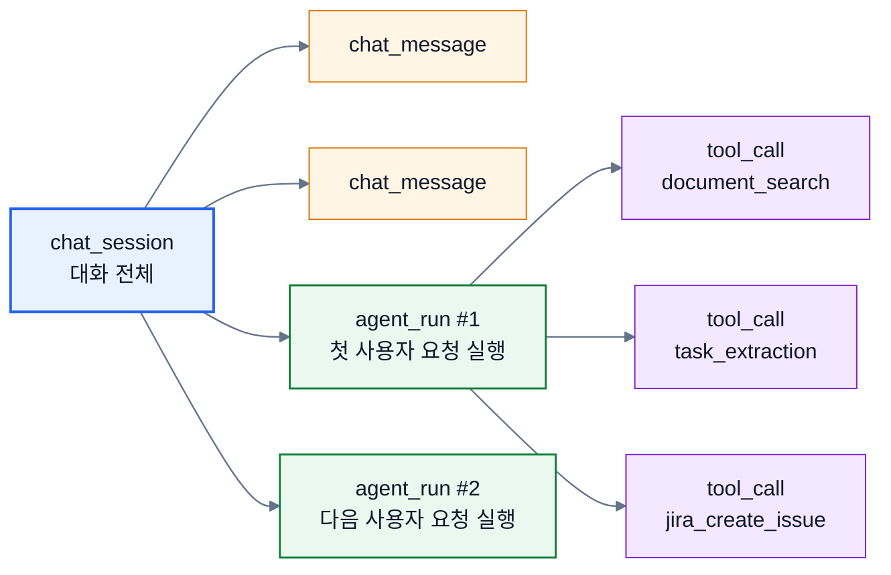

- **Session**: 대화 전체의 수명
- **Message**: 사용자/Agent 메시지
- **Agent Run**: 사용자 요청 하나를 처리하기 위한 실행 단위
- **Tool Call**: Run 안에서 실제 실행된 Tool

#### 판단 — **핵심 적용**

**이유**

- Chat 기반 서비스에서 대화 지속성이 필요하다.
- Tool Call과 실패 단계를 정확히 추적할 수 있다.
- 우리 평가 문서의 Tool 선택률·E2E 성공률·실패 단계 측정을 자동화할 수 있다.

**적용하지 않을 것**

OpenCode의 `steer / queue`, 다중 프로세스 coordinator, durable multi-node ownership 등은 이번 범위에서 제외한다.

이유는 우리 E2E가 요구하는 핵심보다 복잡도가 훨씬 크기 때문이다.

---

<a id="section-5"></a>

## 5. Context — “저장된 것”과 “이번 LLM에게 보여줄 것”은 다르다

> **이 섹션에서 답할 질문**: 저장된 전체 정보 중 이번 LLM 호출에는 무엇을 보여줘야 하는가?

Session과 Context를 혼동하면 안 된다.

> **Session = 지금까지 있었던 일**  
> **Context = 그중 이번 LLM 호출에 실제로 보여줄 정보**

### 5.1 OpenCode의 Context 구성

OpenCode V2는 System Context의 기준 상태를 `Context Epoch`이라는 개념으로 관리한다.

현재 확인되는 Context Source에는 다음이 있다.

- 실행 환경 정보
- 날짜
- 프로젝트 `AGENTS.md` 계열 Instruction
- 선택된 Agent의 Skill Guidance

Runner는 Provider Turn의 안전한 경계에서 Context Source가 바뀌었는지 확인하고, 변경이 있다면 다음 Context에 반영한다.

핵심 목적은 단순하다.

> **Agent가 오래 실행되는 동안 외부 Context가 달라져도, 어느 시점의 Context로 판단했는지 일관되게 관리한다.**

### 5.2 우리 서비스에 그대로 대입할 필요는 없다

우리에게 필요한 Context Source는 OpenCode와 다르다.

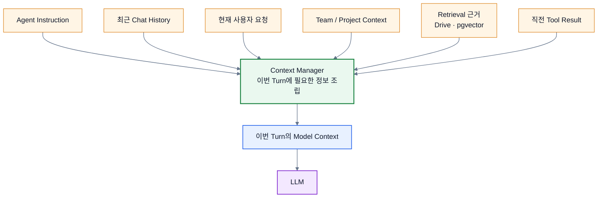

우리 프로젝트에서는 특히 **기존 Retrieval 결과를 Agent Context에 주입하는 것**이 중요하다.

예:

```text
사용자:
"이번 프로젝트 업무를 정리해줘."

Context:
- Agent Instruction
- 사용자가 현재 선택한 프로젝트
- 최근 대화
- 프로젝트 문서에서 검색한 관련 Chunk
- 이전 Tool 실행 결과
```

### 5.3 Chat과 Project 관계가 아직 미결정이어도 Harness를 막을 필요는 없다

현재 IA에서 “Chat이 프로젝트에 귀속되는가, 팀 레벨 Chat에서 프로젝트를 선택하는가”는 미결정이다.

따라서 Harness의 Context 인터페이스는 다음처럼 **project가 선택적**이도록 잡는 것이 안전하다.

```text
ContextScope
- team_id
- user_id
- session_id
- project_id?   ← 선택
```

그러면 UI 결정이 나중에 바뀌어도 Context Manager 전체를 다시 만들 필요가 없다.

#### 판단 — **개념은 핵심 적용, Context Epoch 자체는 축소**

**적용**

- Context Manager
- Agent Instruction
- 최근 대화
- Team/Project Scope
- Retrieval 결과
- Tool Result

**구조만 남김**

- Context Epoch와 같은 정교한 버전/변경 추적

**이유**

현재 프로젝트에서는 “어떤 정보를 LLM에게 조립해 줄 것인가”가 중요하며, OpenCode 수준의 Context Source 변경 감지는 대표 E2E에 필수적이지 않다.

---

<a id="section-6"></a>

## 6. Memory — “대화 기록·현재 실행 상태·회사 지식”을 구분해서 본다

> **이 섹션에서 답할 질문**: 대화 기록, 현재 실행 상태, 기업 지식은 각각 어디에 두어야 하는가?

> **주요 근거**: [V2 Session Spec — Session History / Automatic Compaction](https://github.com/anomalyco/opencode/blob/dev/specs/v2/session.md). 별도의 Vector/Semantic Memory는 이번에 확인한 Core Runtime의 중심 구성요소로 확인되지 않았으므로, 이 절에서는 **확인된 Session/Compaction 패턴만** 설계 근거로 사용한다.

Memory를 모두 Vector DB라고 생각하면 구조가 꼬이기 쉽다.

### 6.1 OpenCode에서 확인되는 핵심 Memory 방식

검토한 OpenCode Core Runtime에서 중심이 되는 것은 별도의 Semantic Vector Memory 시스템이 아니라 다음이다.

1. **Durable Session History**
2. **현재 Model에 보여주는 Context**
3. **Context가 길어질 때 Compaction**

OpenCode는 Context Window가 부족해지면 전체 대화 기록 자체를 삭제하지 않는다.

대신:

```text
전체 Session 기록
= 계속 보존

Model이 보는 Context
= 이전 내용의 구조화 Summary + 최근 Context
```

형태로 바꾼다.

즉 **저장 Memory와 Model-visible Context를 분리**한다.

### 6.2 우리 서비스에서는 세 층으로 나누는 것이 이해하기 쉽다

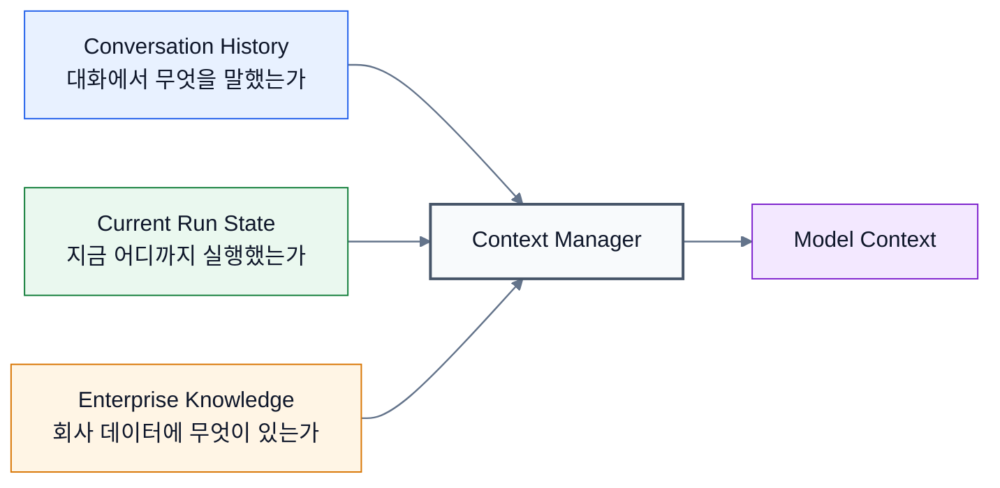

> **정확성 메모**: `Conversation History`, `Current Run State`, `Enterprise Knowledge`는 우리 팀이 이해하기 쉽게 나눈 개념이다. OpenCode에 `Working Memory`라는 이름의 별도 핵심 모듈이 있다는 뜻은 아니다. OpenCode에서 직접 확인되는 중심 구조는 Session History·Context·Compaction이다.

#### Conversation History

```text
chat_session
chat_message
```

예:

> “아까 사용자가 프로젝트 A를 선택했다.”

#### Current Run State

```text
agent_run
tool_call
직전 Tool Result
현재 Step
```

예:

> “문서 검색은 완료했고, 아직 Jira 등록은 하지 않았다.”

#### Enterprise Knowledge

기존 Data Layer:

```text
Drive / Connector
→ Parsing
→ Chunking
→ Embedding
→ PostgreSQL + pgvector
→ Retrieval
```

예:

> “프로젝트 A 제안요청서에는 8월 25일까지 화면 설계를 완료하라고 적혀 있다.”

### 6.3 우리 프로젝트에서의 범위

#### 판단

| 구분 | 이번 범위 |
|---|---|
| Chat History | **동작** |
| Run / Tool Result | **동작** |
| 기존 Retrieval Knowledge | **동작** |
| Context Summary / Compaction | **구조만** |
| 사용자 성향을 장기간 학습하는 Semantic Memory | **제외** |

**이유**

우리 대표 E2E는 “기업 문서 근거를 활용해 작업하고 Jira에 등록”하는 것이다. 별도 장기 개인 Memory보다 **Session + Retrieval을 정확히 연결하는 것이 우선순위가 높다.**

---

<a id="section-7"></a>

## 7. Tool Calling과 Tool Registry — Harness의 두 번째 핵심

> **이 섹션에서 답할 질문**: Agent가 Tool을 직접 붙잡지 않고 Registry를 거치게 하는 이유는 무엇인가?

> **주요 근거**: [V2 Tool 설계](https://github.com/anomalyco/opencode/blob/dev/specs/v2/tools.md) · [V2 Tool Registry](https://github.com/anomalyco/opencode/blob/dev/packages/core/src/tool/registry.ts) · [현재 Session Tool 조립](https://github.com/anomalyco/opencode/blob/dev/packages/opencode/src/session/tools.ts)

Agent Loop와 함께 OpenCode에서 가장 참고 가치가 큰 부분이다.

### 7.1 Tool은 무엇을 가져야 하는가

OpenCode V2의 Tool은 개념적으로 다음 계약을 가진다.

```text
Tool
- name
- description
- input schema
- output schema
- execute()
```

즉 LLM에게 “이 Tool이 무슨 일을 하는지”만 알려주는 것이 아니라:

- Tool이 어떤 입력을 받는가?
- 실행 결과는 어떤 형식인가?
- 실제 실행 함수는 무엇인가?

를 하나의 계약으로 묶는다.

### 7.2 Tool Registry는 왜 필요한가

Tool을 Agent 코드에 직접 붙이면 확장이 어려워진다.

```text
나쁜 구조

Agent A → Jira API 직접 호출
Agent B → Drive API 직접 호출
Agent C → Workload 함수 직접 호출
```

대신:

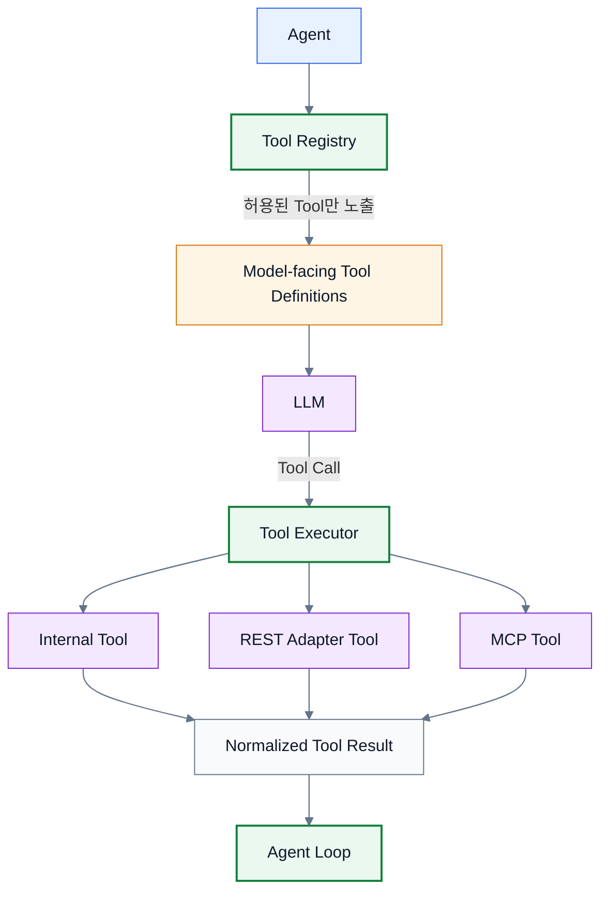

이렇게 중간 계층을 두면 Agent 입장에서는 Tool의 내부 구현이 중요하지 않다.

### 7.3 OpenCode Registry에서 특히 참고할 부분

OpenCode V2 Tool Registry는 Provider Turn마다 Tool을 `materialize`한다. **쉽게 말하면 “지금 이 Agent가 이번 LLM 호출에서 실제로 사용할 수 있는 Tool 목록을 확정한다”는 뜻**이다.

그 과정에서:

1. 현재 등록된 Tool을 모은다.
2. Agent Permission으로 완전히 금지된 Tool은 제거한다.
3. LLM에게 보여줄 Tool Definition을 만든다.
4. LLM이 Tool을 호출하면 실제 등록된 Tool과 매칭한다.
5. 입력을 검증한다.
6. Tool을 실행한다.
7. Output을 검증·정규화한다.
8. 결과를 Runner로 돌려준다.

OpenCode 코드에서 이 실행·결과 정리 단계를 `settle` / `settlement`라고 부른다. 이 문서에서는 **“Tool을 실제 실행하고 결과를 성공/실패 형태로 정리하는 과정”**으로 이해하면 된다.

Tool 실행 Context에도 다음 ID가 연결된다.

- Session ID
- Agent ID
- Assistant Message ID
- Tool Call ID

그래서 “어떤 Agent가 어느 Session에서 어떤 Tool을 호출했는가”를 추적할 수 있다.

### 7.4 Tool Description은 단순 설명문이 아니다

우리 평가 설계에는 `G-PROMPT`로 **올바른 Tool 선택률**을 측정하는 항목이 있다.

LLM은 Tool의 이름·Description·Input Schema를 보고 어떤 Tool을 사용할지 판단한다.

따라서 Tool Registry의 metadata는 최소한 다음을 가져야 한다.

```text
ToolDefinition
- name
- description
- input_schema
- source: internal | mcp | rest
- executor
- permission_key
```

Tool Description 품질 자체가 Agent 성능의 일부다.

### 7.5 우리 프로젝트 예시

```text
Tool Registry

Internal
├ project_document_search
├ workload_report
└ ...

MCP
├ jira_search_issue
└ jira_create_issue

REST / Existing Service
└ 필요한 기존 내부 API Adapter
```

#### 판단 — **핵심 적용**

**이유**

1. Builder에서 Agent별 Tool 선택 기능을 만들기 위한 기본 구조다.
2. Internal Tool과 MCP Tool을 Agent 입장에서 같은 방식으로 사용할 수 있다.
3. Tool Permission을 한 곳에서 적용할 수 있다.
4. 향후 Tool Selection 평가를 자동화하기 쉽다.
5. Tool 구현이 바뀌어도 Agent/Runner가 직접 의존하지 않는다.

---

<a id="section-8"></a>

## 8. MCP — Harness가 아니라 “외부 Tool 공급 경로”

> **이 섹션에서 답할 질문**: MCP는 Harness 전체가 아니라 어떤 위치의 연결 계층인가?

> **주요 근거**: [MCP Client / Lifecycle](https://github.com/anomalyco/opencode/blob/dev/packages/opencode/src/mcp/index.ts) · [MCP Tool → Runtime Tool 변환](https://github.com/anomalyco/opencode/blob/dev/packages/opencode/src/session/tools.ts)

MCP를 Harness 자체와 동일시하면 안 된다.

> **Harness = Agent를 실행하는 전체 환경**  
> **Tool Registry = Agent가 사용할 기능을 관리하는 계층**  
> **MCP = 외부 기능을 Tool 형태로 연결하는 방법 중 하나**

### 8.1 OpenCode MCP 구조

OpenCode의 현재 MCP 구현은 공식 MCP SDK Client를 사용한다.

지원되는 연결 방식에는 다음이 확인된다.

- Local: `stdio`
- Remote:
  - Streamable HTTP
  - SSE fallback
- OAuth
- Header 기반 설정
- Timeout

또 MCP Server 상태를 구분한다.

```text
connected
disabled
failed
needs_auth
needs_client_registration
```

연결에 성공하면 MCP Server의 Tool 목록을 가져와 저장하고, Tool 목록 변경 Notification도 감지한다.

현재 Session Tool 조립 코드에서는 MCP에서 발견한 Tool을 일반 Tool 형태로 변환한 뒤 Agent가 사용할 수 있도록 한다.

즉 구조는 다음과 같다.

```mermaid
flowchart LR
    SET["Settings<br/>MCP Server 등록"]:::ui --> MC["MCP Client<br/>연결 · 인증 · 상태"]:::mcp
    MC --> SRV["MCP Server<br/>예: Jira"]:::external
    SRV -->|"Tool Discovery"| MC
    MC --> AD["MCP Tool Adapter<br/>일반 Tool 형태로 변환"]:::adapter
    AD --> TR["Tool Registry / Runtime Tool Set"]:::runtime
    TR --> A["Agent"]:::agent

    A -->|"Tool Call"| TR
    TR --> AD
    AD --> SRV
    SRV -->|"Result"| AD
    AD --> TR
    TR --> A

    classDef ui fill:#E8F1FF,stroke:#2563EB,color:#0F172A;
    classDef mcp fill:#F3E8FF,stroke:#7E22CE,color:#0F172A,stroke-width:2px;
    classDef external fill:#F3E8FF,stroke:#7E22CE,color:#0F172A;
    classDef adapter fill:#FFF5E5,stroke:#D97706,color:#0F172A;
    classDef runtime fill:#EAF8EF,stroke:#15803D,color:#0F172A,stroke-width:2px;
    classDef agent fill:#E8F1FF,stroke:#2563EB,color:#0F172A;
    linkStyle default stroke:#64748B,stroke-width:1.2px;
```

### 8.2 우리 TO-BE와 거의 직접 연결된다

현재 우리 Architecture의 MCP 흐름은 다음이다.

```text
Settings
→ MCP Server 등록
→ Tool 목록 조회

Builder
→ Agent가 사용할 MCP Tool 선택

Runtime
→ Tool Registry에 MCP Tool 포함

LLM
→ 필요 시 Tool 선택

MCP Client
→ 외부 Server 호출

Result
→ Agent Loop
→ tool_call 로그
```

OpenCode 사례는 이 구조가 실제 Agent Product에서도 자연스러운 책임 분리라는 근거가 된다.

### 8.3 우리 프로젝트에서 어디까지 할 것인가

#### 이번에 반드시 필요한 것

- Remote MCP Server 등록
- 연결 상태 확인
- Tool Discovery
- Agent별 Tool 선택
- Tool 실행
- 실패 결과 반환
- `tool_call` 기록

#### 이번에 굳이 만들 필요가 없는 것

- Local `stdio` MCP 지원
- 모든 OAuth 예외 케이스
- MCP Resource / Prompt 전체 기능
- 동적 Tool List Changed의 완벽한 실시간 반영

우리 서비스는 웹 기반 Enterprise Agent Platform을 목표로 하므로 **Jira 대표 Remote MCP 하나를 E2E로 완성하는 것**이 우선이다.

### 8.4 기존 Jira Connector와 MCP가 둘 다 있는 이유

현재 우리 시스템에는 기존 Jira REST Connector가 있고 TO-BE에는 Jira MCP도 추가된다.

둘의 역할을 다음처럼 구분하면 이해하기 쉽다.

```text
Connector / Data Layer
→ 데이터를 수집·저장·검색에 활용

MCP Tool
→ Agent가 실행 중 필요한 행동을 On-demand로 수행
```

예:

```text
Jira Connector
→ 기존 업무량 데이터 동기화

Jira MCP Tool
→ 지금 Agent가 승인된 업무 12건을 Issue로 생성
```

v1에서는 두 경로를 병행하되, Harness 입장에서는 실행 경로를 **Tool Adapter 뒤로 숨기는 것**이 좋다.

#### 판단 — **핵심 범위만 적용**

**이유**

MCP 자체를 많이 구현하는 것이 목표가 아니라, **외부 Tool을 Harness에 동적으로 연결할 수 있음을 하나의 완성된 E2E로 증명하는 것**이 목표이기 때문이다.

---

<a id="section-9"></a>

## 9. Model / Provider — Agent와 LLM을 직접 묶지 않는다

> **이 섹션에서 답할 질문**: Model을 Agent 코드에 고정하지 않으려면 어떤 분리가 필요한가?

> **먼저 한 줄**: Provider는 **LLM을 제공하는 회사/연결 방식**, Model은 그 안에서 실제로 선택하는 **구체적인 모델**이다. 예를 들면 `OpenAI(Provider) → GPT 계열 Model`처럼 생각하면 된다.

> **주요 근거**: [Provider / Model Catalog](https://github.com/anomalyco/opencode/blob/dev/specs/v2/provider-model.md) · [Session Model Resolver](https://github.com/anomalyco/opencode/blob/dev/packages/core/src/session/runner/model.ts)

### 9.1 OpenCode의 구조

OpenCode V2는 **Provider와 Model을 분리**한다.

Provider 예:

```text
OpenAI
Anthropic
OpenRouter
Azure
...
```

Model은 Provider 아래에서 다음과 같은 정보를 가진다.

- Model ID
- Provider ID
- Tool 지원 여부
- Input / Output Capability
- Context Limit
- Output Limit
- Variant
- Endpoint / Options
- 활성 상태

Runner는 Session에 설정된 Model을 직접 API 호출 코드로 연결하지 않고 **Model Resolver**를 통해 실제 실행 가능한 LLM Route로 변환한다.

여기서 한 가지 주의할 점이 있다. Catalog Schema에 여러 Provider ID가 정의되어 있다고 해서 현재 V2 Runner가 그 모든 Provider 경로를 동일 수준으로 지원한다는 뜻은 아니다. 현재 `SessionRunnerModel`은 지원 가능한 API Route를 명시적으로 판별하고, 지원하지 않는 경로는 오류로 처리한다. 이 점도 **“Model 목록”과 “실제 실행 Adapter”를 분리해야 한다**는 근거가 된다.

### 9.2 우리 서비스에서는 훨씬 작게 가져오면 된다

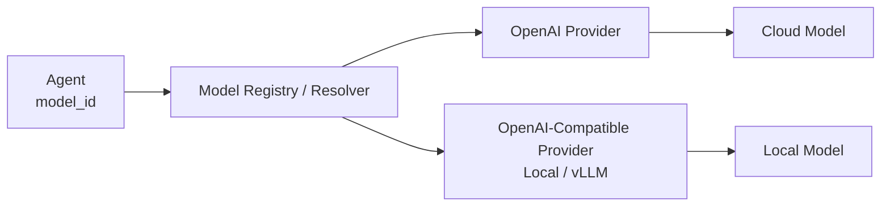

최소한 다음 정도면 충분하다.

```text
ModelDefinition
- provider
- model_id
- endpoint?
- supports_tools
- context_window?
- enabled
```

특히 Local Model을 vLLM 등의 **OpenAI-compatible endpoint**로 맞출 수 있다면, Provider 구현을 크게 늘리지 않고도 교체 가능 구조를 만들 수 있다.

### 9.3 우리 Builder에서는

사용자는 다음만 고르면 된다.

```text
Model
[ GPT 계열 ▼ ]
```

Harness 내부에서는:

```text
Agent.model
   ↓
Model Resolver
   ↓
실제 Provider Client
```

로 처리한다.

#### 판단 — **적용하되 축소**

**적용**

- Agent와 Model 호출 코드 분리
- Provider / Model 식별자
- Tool 지원 여부
- OpenAI + Local/OpenAI-compatible Adapter

**이번 범위에서 제외**

- 상세 비용 Catalog
- release date
- 수많은 Provider별 Variant
- 자동 Small Model 선택 등

**이유**

우리의 목적은 “모델 Catalog 제품”이 아니라 **Agent가 Model을 교체할 수 있는 Harness 경계**를 만드는 것이다.

---

<a id="section-10"></a>

## 10. Permission — “사용 가능한가?”와 “지금 실행해도 되는가?”를 분리

> **이 섹션에서 답할 질문**: 누가 Tool을 사용할 수 있는지와, 실제 Side Effect를 지금 허용할지는 어떻게 나눌까?

> **먼저 한 줄**: Permission은 “이 Agent/Tool을 사용할 권한이 있는가?”, Approval은 “권한은 있지만 이 위험한 행동을 지금 실제로 실행해도 되는가?”에 가깝다.

> **주요 근거**: [Agent Permission 정의](https://github.com/anomalyco/opencode/blob/dev/packages/opencode/src/agent/agent.ts) · [V2 Tool 권한 필터](https://github.com/anomalyco/opencode/blob/dev/packages/core/src/tool/registry.ts) · [현재 Tool 실행 권한 확인](https://github.com/anomalyco/opencode/blob/dev/packages/opencode/src/session/tools.ts)

OpenCode에서 `build`, `plan`, `explore` Agent는 같은 Runtime을 사용해도 Tool Permission이 다르다.

또 Tool 실행 시점에도 Permission을 확인한다.

우리 Enterprise 서비스에서는 이를 두 개의 질문으로 나누는 것이 좋다.

1. **Authorization** — 이 사용자/Agent가 이 Tool을 사용할 권한이 있는가?
2. **Approval** — 권한은 있어도, 이번 Side Effect를 지금 실행해도 되는가?

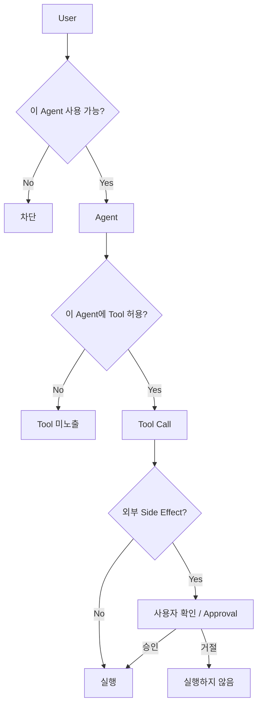

### 우리 대표 E2E와의 연결

현재 E2E에는 Jira 등록 전에 **사용자 확인 STEP**이 있다.

따라서:

- 팀원에게 Jira 생성 권한이 있는가? → Permission
- 지금 추출된 12개 업무를 실제 Jira에 만들 것인가? → Approval

로 나누면 구조가 명확해진다.

#### 우리 최소 구현

```text
User → Agent 사용 권한
Agent → Tool Allowlist
Side-effect Tool → 사용자 확인
```

#### 판단 — **최소 동작 적용**

**이유**

Jira처럼 외부 시스템을 변경하는 Tool은 잘못 실행하면 단순 답변 오류보다 비용이 크다.  
또 우리 기존 팀/역할 권한 구조를 폐기하지 않고 Harness 위로 확장할 수 있다.

---

<a id="section-11"></a>

## 11. Multi-Agent / Subagent — OpenCode는 “Child Session”으로 분리한다

> **이 섹션에서 답할 질문**: 다른 Agent에게 일을 맡길 때 왜 별도 Child Session이 필요한가?

> **먼저 한 줄**: OpenCode는 다른 Agent에게 일을 맡길 때 단순 함수 호출처럼 섞지 않고, **별도의 Child Session을 만들어 그 Agent의 대화·권한·실행을 분리**한다.

> **주요 근거**: [Task Tool / Child Session 구현](https://github.com/anomalyco/opencode/blob/dev/packages/opencode/src/tool/task.ts)

### 11.1 OpenCode 방식

OpenCode의 `Task Tool`은 다른 Agent에게 일을 위임할 때 별도 Child Session을 만든다.

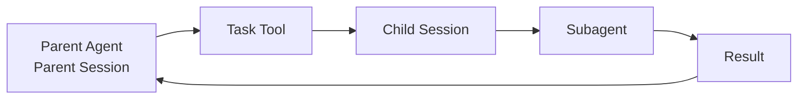

Child Session에는 다음 특징이 있다.

- `parentID`로 부모 Session과 연결
- Subagent 종류 선택
- 부모 Permission과 Subagent Permission을 조합
- 필요한 경우 다른 Model 선택
- `task_id`로 기존 Subagent Session 재개 가능
- Subagent depth 제한
- 실험적으로 Background Subagent 지원

이 방식의 장점은 **Subagent의 Context·Permission·실패·실행 이력을 부모와 분리할 수 있다는 것**이다.

### 11.2 우리 TO-BE에서는 지금 구현 대상이 아니다

현재 Architecture는 A2A에 대해:

> “Agent가 다른 Agent를 Tool처럼 호출할 수 있는 인터페이스 자리만 남긴다.”

라고 범위를 잡고 있다.

이 판단을 유지하는 것이 좋다.

#### 이유

1. 대표 E2E를 위해 다단계 Subagent Runtime까지 만들 필요는 없다.
2. Child Session·Permission 상속·재개·실패 전파까지 들어가면 개발 범위가 급격히 커진다.
3. OpenCode에서도 Background Subagent는 별도 실험 기능으로 다룬다.

### 11.3 현재 TO-BE에서 확인해야 할 Agent / Tool 경계

여기에는 한 가지 중요한 설계 포인트가 있다.

현재 문서에서는:

- 기존 `task_extraction` → **Pre-built Agent**
- `workload` → **Pre-built Tool**
- A2A → **이번에는 인터페이스만**

으로 정의되어 있다.

그런데 대표 E2E가 “상위 Agent가 업무 추출 Agent를 호출한다”는 형태가 되면 사실상 A2A가 필요해진다.

#### v1 권장 방식

**업무 추출 Agent를 Chat에서 선택되는 Top-level Agent로 두고**, 이 Agent가:

- Retrieval
- 기존 5단계 업무 추출 로직
- 사용자 확인
- Jira MCP Tool

을 자신의 실행 흐름 안에서 사용하도록 한다.

즉 기존 5단계 파이프라인은 **업무 추출 Agent의 내부 구현**으로 두고, 다른 Agent를 또 호출하는 구조로 만들지 않는다.

향후에는:

```text
General PM Agent
   ↓
Agent Tool
   ↓
Task Extraction Agent
```

형태로 확장할 수 있도록 인터페이스만 남긴다.

#### 판단 — **구조만 남김**

---

<a id="section-12"></a>

## 12. Observability — 부가 기능이 아니라 “평가 가능한 Harness”의 기반

> **이 섹션에서 답할 질문**: 실행 로그를 왜 단순 기록이 아니라 평가·디버깅 기반으로 봐야 하는가?

> **주요 근거**: [Session Runner](https://github.com/anomalyco/opencode/blob/dev/packages/core/src/session/runner/llm.ts) · [V2 Session Spec](https://github.com/anomalyco/opencode/blob/dev/specs/v2/session.md) · 우리 측 [평가 설계](https://github.com/SKNETWORKS-FAMILY-AICAMP/SKN29-FINAL-2TEAM/blob/main/docs/설계 및 구현/3_중간발표 이후/설계/4_%ED%8F%89%EA%B0%80_%EC%84%A4%EA%B3%84.md)

OpenCode Runner는 실행 중 다음과 같은 정보를 Event / History에 남긴다.

- Assistant 출력
- Reasoning 관련 Event
- Tool Call
- Tool Result / Failure
- Step 종료
- Token 사용량
- 실행 중단 상태
- Snapshot 등

우리가 OpenCode 수준의 Event Sourcing을 만들 필요는 없다.

하지만 **무엇을 실행했는지는 반드시 남겨야 한다.**

### 12.1 우리 평가 설계와 직접 연결된다

현재 [평가 설계 문서](https://github.com/SKNETWORKS-FAMILY-AICAMP/SKN29-FINAL-2TEAM/blob/main/docs/설계 및 구현/3_중간발표 이후/설계/4_%ED%8F%89%EA%B0%80_%EC%84%A4%EA%B3%84.md)는 다음 지표를 `agent_run`·`tool_call` 로그에서 자동 집계하도록 설계되어 있다.

- 올바른 Tool 선택률
- 불필요 Tool 호출률
- Tool 실행 성공률
- E2E 성공률
- 평균 처리 시간
- 실패 단계 분포
- 재시도 성공률

따라서 로그는 “나중에 Admin Dashboard가 있으면 좋은 것”이 아니다.

> **Harness의 성능을 측정하기 위한 데이터 원천이다.**

### 12.2 최소 로그 권장

```text
agent_run
- run_id
- session_id
- agent_id
- model_id
- status
- started_at
- ended_at
- input_tokens?
- output_tokens?
- error_code?

tool_call
- call_id
- run_id
- tool_name
- source: internal | mcp | rest
- status
- started_at
- ended_at
- latency_ms
- error_code?
- external_ref?   # Jira issue key 등
```

기업 데이터가 들어갈 수 있으므로 **인증 Token이나 전체 민감 Payload를 그대로 로그에 저장하지 않는 것**도 중요하다.

#### 판단 — **P0에 가깝게 적용**

UI 대시보드는 여력 기능이어도 되지만, **로그 적재 자체는 Harness 초기 구현부터 넣는 것이 맞다.**

---

<a id="section-13"></a>

## 13. Core와 Adapter / Plugin을 분리하는 원칙

> **이 섹션에서 답할 질문**: Harness Core와 외부 Integration을 어디까지 분리해야 교체 가능한 구조가 되는가?

> **주요 근거**: [V2 Core / Plugin 설계 원칙](https://github.com/anomalyco/opencode/blob/dev/specs/v2/instructions.md)

OpenCode V2의 Architecture 방향에서 참고할 만한 또 하나의 포인트는 **Core에 모든 Integration 로직을 집어넣지 않는 것**이다.

OpenCode V2는 Core를 작은 상태/도메인 서비스로 만들고, Provider·Auth·Model Discovery 같은 Integration 정책은 Plugin 쪽으로 분리하려 한다.

우리 프로젝트에서는 완전한 Plugin Framework까지 만들 필요는 없다.

대신 다음 정도의 경계는 유지할 가치가 있다.

```text
Harness Core
├ Session Manager
├ Agent Runner
├ Context Manager
├ Tool Registry
├ Permission
└ Trace

Adapters
├ OpenAI / Local Model Adapter
├ MCP Adapter
├ Retrieval Adapter
└ Internal Tool Adapter
```

#### 왜 필요한가

예를 들어 Jira MCP를 다른 MCP Server로 바꾸더라도 Runner를 수정하지 않아야 한다.

Local Model을 OpenAI로 바꾸더라도 Tool Registry를 수정하지 않아야 한다.

이것이 바로 “범용 Harness”라는 주장에 필요한 최소한의 분리다.

#### 판단 — **원칙 적용 / Plugin Framework 자체는 제외**

---

> **PART C · 우리 TO-BE에 적용하기**  
> OpenCode에서 배운 구조를 그대로 복제하지 않고, 우리 범위에 맞게 적용·축소·제외한다.

<a id="section-14"></a>

## 14. OpenCode 구조를 우리 TO-BE에 대입하면

> **이 섹션에서 답할 질문**: OpenCode의 각 구조가 우리 TO-BE의 어느 컴포넌트와 대응되는가?

### 14.0 여기까지 이해했다면

OpenCode를 처음 보는 입장에서는 아래 다섯 문장만 먼저 설명할 수 있으면 충분하다.

1. **Agent는 설정이고 Runner가 실제 실행한다.**
2. **Session은 대화를 이어가고 Context는 매 Turn LLM에게 보여줄 정보를 만든다.**
3. **Tool은 Registry를 통해 노출·실행되며, Agent가 API를 직접 붙잡지 않는다.**
4. **MCP는 외부 Tool을 가져오는 연결 방식이고 Model도 Resolver 뒤에 분리한다.**
5. **실행 결과는 Run/Tool 로그로 남겨야 평가·디버깅이 가능하다.**

이제 이 다섯 원칙이 우리 TO-BE의 어느 컴포넌트에 들어가는지 매핑하면 된다.

> **우리 측 기준**: [서비스 IA](https://github.com/SKNETWORKS-FAMILY-AICAMP/SKN29-FINAL-2TEAM/blob/main/docs/설계 및 구현/3_중간발표 이후/설계/1_%EC%84%9C%EB%B9%84%EC%8A%A4%EA%B5%AC%EC%A1%B0_IA.md) · [Harness Architecture 초안](https://github.com/SKNETWORKS-FAMILY-AICAMP/SKN29-FINAL-2TEAM/blob/main/docs/설계 및 구현/3_중간발표 이후/설계/2_%EC%95%84%ED%82%A4%ED%85%8D%EC%B2%98_%EC%B4%88%EC%95%88.md) · [평가 설계](https://github.com/SKNETWORKS-FAMILY-AICAMP/SKN29-FINAL-2TEAM/blob/main/docs/설계 및 구현/3_중간발표 이후/설계/4_%ED%8F%89%EA%B0%80_%EC%84%A4%EA%B3%84.md) · [대표 E2E](https://github.com/SKNETWORKS-FAMILY-AICAMP/SKN29-FINAL-2TEAM/blob/main/docs/설계 및 구현/3_중간발표 이후/설계/5_E2E_%EC%8B%9C%EB%82%98%EB%A6%AC%EC%98%A4.md)

| OpenCode에서 확인한 구조 | 하는 일 | 우리 TO-BE 대응 | 판단 | 이유 |
|---|---|---|---|---|
| Agent Definition | Prompt·Model·Permission·Step 정의 | `agent`, Builder | **적용** | 비개발자 Agent 생성의 기본 데이터 구조 |
| Session | 대화·실행 상태 유지 | `chat_session`, `chat_message` | **적용** | Chat 연속성과 Run 추적에 필요 |
| Session Runner / Loop | LLM↔Tool 반복 실행 | Agent Harness Runner | **핵심 적용** | TO-BE의 신규 기술 중심 |
| Context Assembly | 이번 Turn 입력 구성 | Context Manager | **적용** | History·Retrieval·Tool Result 조립 필요 |
| Context Epoch | Context Source 변화 추적 | 별도 없음 | **축소/구조만** | 개념은 좋지만 v1 E2E 대비 구현비용 큼 |
| Compaction | 긴 Context 압축 | Summary Interface | **구조만** | 짧은 데모에서는 우선순위 낮음 |
| Tool Definition | Description·Schema·Executor | Tool Metadata | **적용** | Tool 선택 품질·확장성에 필요 |
| Tool Registry | Tool 등록·필터·실행 | Tool Registry | **핵심 적용** | Internal/MCP Tool 통합 지점 |
| MCP Client | 외부 Tool Discovery/Execution | MCP Client / `mcp_server` | **핵심 범위 적용** | Jira E2E와 Builder Tool 선택에 직접 필요 |
| Model Resolver | Provider/Model 추상화 | Model Registry | **축소 적용** | OpenAI/Local 교체 가능 구조 필요 |
| Permission | Agent/Tool별 실행 제한 | 기존 권한 + Agent Tool 권한 | **최소 적용** | Enterprise Side Effect 제어 |
| Task Tool / Child Session | Subagent 위임 | Future A2A | **구조만** | 이번 범위에서 과함 |
| Durable Events | 실행 전체 추적 | `agent_run`, `tool_call` | **축소 적용** | 평가·디버깅에 필요 |
| Full Event Sourcing | 복구·Replay 중심 Runtime | 없음 | **제외** | 프로젝트 규모 대비 과도 |
| Plugin Hot Reload | Integration 동적 교체 | Adapter 경계 | **원칙만 적용** | 완전한 Plugin Engine은 불필요 |
| Background Subagent | 병렬 비동기 Agent | 없음 | **제외** | 대표 E2E와 무관하고 실패처리 복잡 |

---

<a id="section-15"></a>

## 15. 최종 판단 — 우리 Harness에 적용할 것 / 적용하지 않을 것

> **이 섹션에서 답할 질문**: 이번 프로젝트에서 반드시 구현할 것, 구조만 남길 것, 제외할 것은 무엇인가?

> **판단 기준**: 대표 E2E 기여도, 3주 내 구현 현실성, 기존 코드 재사용성, 평가 가능성, 향후 확장 경계. [`3_Harness_조사/README.md`](https://github.com/SKNETWORKS-FAMILY-AICAMP/SKN29-FINAL-2TEAM/blob/main/docs/설계 및 구현/3_중간발표 이후/설계/3_Harness_%EC%A1%B0%EC%82%AC/README.md)의 “적용/미적용과 이유” 산출 규칙을 따른다.

[`3_Harness_조사/README.md`](https://github.com/SKNETWORKS-FAMILY-AICAMP/SKN29-FINAL-2TEAM/blob/main/docs/설계 및 구현/3_중간발표 이후/설계/3_Harness_%EC%A1%B0%EC%82%AC/README.md)의 산출 규칙에 따라 최종 결론을 명확히 나눈다.

### 15.1 반드시 적용할 것

#### 1) Agent Definition과 Runner 분리

**적용 이유**

Builder에서 만든 Agent를 코드 변경 없이 실행하려면 Agent는 설정이고 Runner는 실행 엔진이어야 한다.

---

#### 2) Session과 Agent Run 분리

**적용 이유**

대화 전체와 사용자 요청 1회의 실행은 수명이 다르다.  
또 평가·실패 추적을 위해 Run 단위가 별도로 필요하다.

---

#### 3) 범용 Agent Loop

```text
Context 구성
→ Model 호출
→ Tool Call?
→ 실행
→ Result 기록
→ 다음 Turn
→ 종료
```

**적용 이유**

기존 고정 5단계 파이프라인에서 범용 Agent Platform으로 전환할 때 가장 본질적으로 새로 생기는 기능이다.

---

#### 4) Context Manager

**적용 이유**

대화·프로젝트 범위·Retrieval·Tool Result를 한 곳에서 조립해야 Agent별 Context 정책을 관리할 수 있다.

---

#### 5) Tool Registry

**적용 이유**

Internal Tool, REST 기반 기존 기능, MCP Tool을 하나의 Agent 실행 인터페이스로 묶는 핵심 계층이다.

---

#### 6) MCP Adapter / Client

**적용 이유**

우리 Platform이 외부 업무 도구를 연결할 수 있다는 것을 Jira 대표 시나리오로 증명할 수 있다.

단, **Remote MCP + Jira E2E 범위부터** 구현한다.

---

#### 7) Model Resolver

**적용 이유**

OpenAI API와 Local/OpenAI-compatible Model을 Agent Runtime 코드와 분리할 수 있다.

---

#### 8) Permission + 사용자 Approval

**적용 이유**

Enterprise Tool은 읽기와 쓰기의 위험도가 다르며 Jira 생성 같은 Side Effect는 사용자 확인이 필요하다.

---

#### 9) `agent_run` / `tool_call` Trace

**적용 이유**

디버깅뿐 아니라 우리 최종발표 평가 지표의 자동 측정 원천이다.

---

### 15.2 구조는 남기지만 이번에 깊게 구현하지 않을 것

#### Context Compaction

**이유**

장기 Chat에서는 필요하지만 현재 대표 E2E에서는 긴 Session이 핵심 문제가 아니다.

**남길 구조**

```text
ContextManager.compact(...)
```

같이 추후 Summary 전략을 넣을 수 있는 경계만 고려한다.

---

#### Agent-to-Agent / Agent-as-Tool

**이유**

확장 방향으로는 필요하지만 Child Session·Permission 상속·실패 전파까지 구현하면 범위가 커진다.

**남길 구조**

Tool Registry가 향후 `agent:*` 형태 Tool을 등록할 수 있도록 인터페이스만 열어 둔다.

---

#### 고급 Model Capability Routing

**이유**

Tool 지원 여부 정도는 필요하지만 Cost 기반 자동 모델 선택이나 복잡한 Variant는 이번 목표가 아니다.

---

#### 외부 Observability Platform

Langfuse / LangSmith 등은 여력 시 연결한다.

**이유**

핵심은 외부 제품을 붙이는 것이 아니라, 먼저 우리 DB에 일관된 Run/Tool Trace가 남는 것이다.

---

### 15.3 이번 범위에서는 적용하지 않을 것

#### Full Event Sourcing / Replay Runtime

**제외 이유**

OpenCode는 실제 제품으로서 재연결·복구·Replay까지 고려하지만 우리 프로젝트 E2E에는 지나치게 복잡하다.

---

#### Multi-node Session Ownership / Cluster Coordination

**제외 이유**

현재 프로젝트는 분산 Agent Runtime 운영 자체가 평가 대상이 아니다.

---

#### 정교한 Crash Recovery

**제외 이유**

“Jira 생성 요청이 실제로 외부에서 성공했는지 모르는 상태에서 자동 재실행” 같은 문제는 중요하지만 이번에는 **실패 표시 + 사용자 재시도** 정책으로 단순화한다.

---

#### Background Subagent

**제외 이유**

병렬 Agent 실행보다 단일 대표 E2E의 정확성과 안정성이 우선이다.

---

#### OpenCode 수준 Plugin Hot Reload

**제외 이유**

Adapter 경계만으로도 현재 확장성을 충분히 설명할 수 있다.

---

#### MCP 전체 Spec 구현

**제외 이유**

MCP Product를 만드는 것이 아니다.  
Tool Discovery + 실행 + 상태 관리라는 우리 사용 범위만 구현하는 것이 맞다.

---

<a id="section-16"></a>

## 16. OpenCode 조사 결과를 반영한 우리 Harness 권장 Architecture

> **이 섹션에서 답할 질문**: OpenCode 조사 결과를 반영하면 우리 Harness의 최종 책임 경계는 어떻게 생기는가?

> **설계 기준**: 기존 [`2_아키텍처_초안.md`](https://github.com/SKNETWORKS-FAMILY-AICAMP/SKN29-FINAL-2TEAM/blob/main/docs/설계 및 구현/3_중간발표 이후/설계/2_%EC%95%84%ED%82%A4%ED%85%8D%EC%B2%98_%EC%B4%88%EC%95%88.md)를 폐기하지 않고, OpenCode에서 확인한 책임 분리만 구체화한다.

현재 [`2_아키텍처_초안.md`](https://github.com/SKNETWORKS-FAMILY-AICAMP/SKN29-FINAL-2TEAM/blob/main/docs/설계 및 구현/3_중간발표 이후/설계/2_%EC%95%84%ED%82%A4%ED%85%8D%EC%B2%98_%EC%B4%88%EC%95%88.md)의 구조를 유지하면서 OpenCode에서 확인한 책임 분리를 조금 더 구체화하면 다음과 같다.

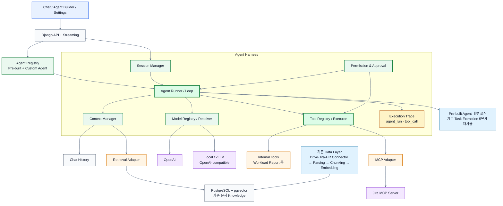

> **그림 읽는 법**: 진한 초록(`Agent Runner`, `Tool Registry`)은 이번 TO-BE에서 새로 만들 Harness의 실행 핵심이다. 하늘색은 기존 자산 재사용, 보라는 외부 시스템/모델, 주황은 연결 Adapter, 회색은 데이터·기록 영역이다.

### 16.1 핵심 책임

#### Agent Registry

- Pre-built Agent
- 팀이 Builder에서 만든 Custom Agent
- Agent Instruction / Model / Tool / Permission

#### Session Manager

- Chat Session
- Message
- 현재 선택 Agent
- 선택적 Project Scope

#### Agent Runner

- Agent Loop
- Step 관리
- LLM 호출
- Tool Call 처리
- 종료 판단

#### Context Manager

- Agent Instruction
- Chat History
- Team / Project Context
- Retrieval
- 직전 Tool Result
- 향후 Compaction

#### Tool Registry

- Internal Tool
- 기존 REST Service Adapter
- MCP Tool
- Permission Filter
- Tool Schema / Description

#### MCP Adapter

- Server 연결
- 상태
- Tool Discovery
- Tool Call
- Result Normalization

#### Model Registry

- OpenAI
- Local / vLLM
- Tool 지원 여부
- 모델 식별 / 선택

#### Permission & Approval

- User → Agent 권한
- Agent → Tool 권한
- Jira 생성 등 Side Effect 실행 전 사용자 확인

#### Execution Trace

- agent_run
- tool_call
- latency / token / error
- E2E 평가 데이터

---

<a id="section-17"></a>

## 17. 대표 E2E에 실제로 대입하면

> **이 섹션에서 답할 질문**: 권장 Architecture가 대표 E2E에서 실제로 어떻게 작동하는가?

> **우리 측 근거**: [`docs/설계 및 구현/3_중간발표 이후/설계/5_E2E_시나리오.md`](https://github.com/SKNETWORKS-FAMILY-AICAMP/SKN29-FINAL-2TEAM/blob/main/docs/설계 및 구현/3_중간발표 이후/설계/5_E2E_%EC%8B%9C%EB%82%98%EB%A6%AC%EC%98%A4.md)

최종 구조가 추상적으로 느껴지지 않도록 현재 시나리오에 다시 대입한다.

> **사용자: “이번 프로젝트 문서를 참고해서 업무를 정리하고 Jira에 등록해줘.”**

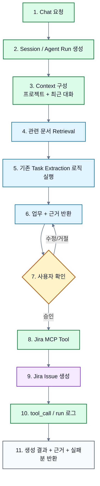

> **색상 기준**: 초록 = 새 Harness 구현, 하늘색 = 기존 코드 재사용, 노랑 = 사용자 승인, 보라 = 외부 시스템 실행. 이 그림은 “무엇을 새로 만들고 무엇을 살리는가”까지 한 번에 보이도록 구성했다.

이 시나리오에서 각 Harness 요소가 왜 필요한지 다시 보면:

| 단계 | 필요한 Harness 요소 |
|---|---|
| 요청을 이어서 이해 | Session |
| 어떤 Agent인지 결정 | Agent Definition |
| 프로젝트 문서와 대화 조합 | Context Manager |
| 문서 검색 | Retrieval Adapter |
| 어떤 Tool을 사용할지 제공 | Tool Registry |
| Jira 실행 | MCP Adapter |
| Jira 생성 가능 여부 | Permission |
| 실제 등록 직전 확인 | Approval |
| OpenAI / Local 선택 | Model Resolver |
| 성공률·실패 위치 측정 | agent_run / tool_call |

따라서 이번 OpenCode 조사의 결과는 특정 기능 하나를 가져오는 것이 아니라, **우리 대표 E2E가 어떤 Runtime 책임 위에서 동작해야 하는지 구체화했다는 데 의미가 있다.**

---

<a id="section-18"></a>

## 18. 설계 시 특히 주의할 점

> **이 섹션에서 답할 질문**: OpenCode를 참고하면서도 과설계·복제를 피하려면 무엇을 조심해야 하는가?

### 18.1 OpenCode를 그대로 복제하지 않는다

OpenCode는 Coding Agent이고 우리는 Project Operation Agent Platform이다.

따라서:

```text
OpenCode의 AGENTS.md / Filesystem Context
→ 우리에게는 Team / Project / Enterprise Knowledge

OpenCode의 Bash / Edit Tool
→ 우리에게는 Retrieval / Jira / Workload Tool

OpenCode의 Coding Session
→ 우리에게는 Project Operation Chat Session
```

처럼 **패턴만 가져와 도메인에 맞춰 바꿔야 한다.**

---

### 18.2 “LangGraph를 쓰느냐”와 “Harness 구조를 아느냐”는 별개다

OpenCode가 자체 Runner를 가지고 있다고 해서 우리도 무조건 Framework 없이 전부 직접 만들어야 한다는 결론은 나오지 않는다.

LangGraph 등을 사용하더라도 우리 설계에서 다음 책임은 보여야 한다.

```text
Session
Context
Model
Tool Registry
Permission
Trace
```

즉 Framework는 **구현 수단**이고 Harness Architecture는 **우리 서비스의 책임 구조**다.

최종 “직접 구현 vs Framework” 결정은 Deep Agents / Claw Code 분석까지 합쳐서 판단하는 것이 맞다.

---

### 18.3 기존 5단계 업무 추출 파이프라인을 억지로 범용 Loop로 다시 만들지 않는다

현재 잘 동작하는 자산은 버리는 것이 아니라 **Pre-built Agent 내부 구현으로 재사용**한다.

새 Harness 개발의 목표는 그 안의 모든 Node를 다시 만드는 것이 아니라:

> **기존 자산도 Harness 위에서 하나의 Agent 경험으로 실행되고, 다른 Model/Tool/MCP와 연결될 수 있게 하는 것**

이다.

---

> **PART D · 결론과 근거 인덱스**  
> 팀 설명용 핵심 결론과 조사 범위, 실제 확인 소스를 빠르게 찾는 구간이다.

<a id="section-19"></a>

## 19. 최종 결론

> **이 섹션에서 답할 질문**: 팀원에게 가장 짧게 설명해야 한다면 어떤 구조만 기억하면 되는가?

### 19.1 팀원에게 1분 안에 설명한다면

> OpenCode를 보면 Agent 하나가 모든 걸 직접 하는 구조가 아닙니다. Agent는 역할·모델·권한 같은 **설정**이고, 실제 실행은 **Session Runner**가 담당합니다. Runner는 현재 대화와 필요한 정보를 **Context**로 만들고, 사용할 **Model과 Tool**을 준비해 LLM을 호출합니다. LLM이 Tool을 고르면 **Tool Registry**를 통해 실행하고, 결과를 다시 LLM에 넣으면서 작업을 이어갑니다. **MCP는 외부 Tool을 가져오는 연결 방식**이고, 실행 기록은 평가와 디버깅을 위해 남깁니다. 우리도 OpenCode 전체를 복제하는 것이 아니라, 대표 E2E에 필요한 Runner·Session·Context·Tool Registry·MCP·Model Resolver·Permission·Trace만 가져오는 것이 핵심입니다.

핵심 관계만 다시 쓰면 다음과 같다.

```text
Agent(설정)
  ↓
Session + Runner(실행)
  ↓
Context + Model + Allowed Tools
  ↓
LLM ↔ Tool
  ↓
History / Trace
```

세부적인 적용/제외 근거는 **[§15](#section-15)**, 실제 권장 구조는 **[§16](#section-16)**, 대표 시나리오 흐름은 **[§17](#section-17)**에서 확인할 수 있다. README 산출 규칙에 맞춘 최종 의사결정 요약은 문서의 마지막 절인 **[§22](#section-22)**에 둔다.

> **최종 판단**: OpenCode는 우리에게 “기능을 더 많이 만들라”는 참고자료가 아니라, **Agent Platform의 핵심 책임을 어떻게 분리할지 보여주는 설계 참고자료**다. 이번 프로젝트에서는 그중 대표 E2E를 실제로 완성하는 데 필요한 최소 Harness만 추출하는 것이 맞다.

---

<a id="section-20"></a>

## 20. 조사 범위 체크리스트

> **이 섹션에서 답할 질문**: Harness 조사 README가 요구한 항목을 모두 다뤘는가?

[Harness 조사 규칙](https://github.com/SKNETWORKS-FAMILY-AICAMP/SKN29-FINAL-2TEAM/blob/main/docs/설계 및 구현/3_중간발표 이후/설계/3_Harness_%EC%A1%B0%EC%82%AC/README.md) 기준으로 누락 여부를 마지막에 확인한다.

| 조사 항목 | 반영 위치 | 상태 |
|---|---|---|
| **조사 목적: 우리 Harness Architecture의 설계 근거 만들기** | [§14](#section-14)~[§18](#section-18), [§22](#section-22) | ✅ |
| **OpenCode 담당 핵심: 실제 제품의 Loop·Model·Session·MCP** | [§2](#section-2), [§4](#section-4), [§8](#section-8), [§9](#section-9) | ✅ |
| **팀원에게 설명할 수 있는 수준의 전체 이해** | [§0](#section-0), [§1](#section-1), [§19](#section-19) | ✅ |
| 전체 Architecture | [§1](#section-1) | ✅ |
| Agent 실행 흐름 / Loop | [§2](#section-2), [§4](#section-4) | ✅ |
| Context 유지 방식 | [§5](#section-5) | ✅ |
| Memory 구조 | [§6](#section-6) | ✅ |
| Tool 호출 구조 | [§7](#section-7) | ✅ |
| MCP 연결 | [§8](#section-8) | ✅ |
| LLM / Model 연결 | [§9](#section-9) | ✅ |
| 여러 Agent / Tool 연결 | [§11](#section-11) | ✅ |
| Permission | [§10](#section-10) | ✅ TO-BE 추가 |
| Observability | [§12](#section-12) | ✅ TO-BE 추가 |
| 우리 TO-BE 매핑 | [§14](#section-14), [§16](#section-16) | ✅ |
| 적용 / 미적용과 이유 | [§15](#section-15), [§22](#section-22) | ✅ |
| **마지막 절 산출 규칙** | [§22](#section-22) | ✅ 문서가 `우리 Harness에 적용할 것 / 적용하지 않을 것과 이유`로 끝남 |
| 대표 E2E 연결 | [§17](#section-17) | ✅ |
| Mermaid / Architecture | [§1](#section-1), [§2](#section-2), [§4](#section-4)~[§11](#section-11), [§16](#section-16)~[§17](#section-17) | ✅ |

---

<a id="section-21"></a>

## 21. 주요 확인 소스

> **이 섹션에서 답할 질문**: 이 문서의 판단을 다시 검증할 때 어떤 실제 소스를 보면 되는가?

### OpenCode

| 목적 | 파일 |
|---|---|
| 프로젝트 개요 / 기본 Agent | [`README.md`](https://github.com/anomalyco/opencode/blob/dev/README.md) |
| Agent Definition / Permission | [`packages/opencode/src/agent/agent.ts`](https://github.com/anomalyco/opencode/blob/dev/packages/opencode/src/agent/agent.ts) |
| V2 Session / Context Epoch / Compaction | [`specs/v2/session.md`](https://github.com/anomalyco/opencode/blob/dev/specs/v2/session.md) |
| V2 Session Runner / Agent Loop | [`packages/core/src/session/runner/llm.ts`](https://github.com/anomalyco/opencode/blob/dev/packages/core/src/session/runner/llm.ts) |
| V2 Tool 설계 | [`specs/v2/tools.md`](https://github.com/anomalyco/opencode/blob/dev/specs/v2/tools.md) |
| V2 Tool Registry | [`packages/core/src/tool/registry.ts`](https://github.com/anomalyco/opencode/blob/dev/packages/core/src/tool/registry.ts) |
| MCP Client / Transport / 상태 / Discovery | [`packages/opencode/src/mcp/index.ts`](https://github.com/anomalyco/opencode/blob/dev/packages/opencode/src/mcp/index.ts) |
| MCP Tool → Runtime Tool 변환 | [`packages/opencode/src/session/tools.ts`](https://github.com/anomalyco/opencode/blob/dev/packages/opencode/src/session/tools.ts) |
| Provider / Model Catalog | [`specs/v2/provider-model.md`](https://github.com/anomalyco/opencode/blob/dev/specs/v2/provider-model.md) |
| Model Resolver | [`packages/core/src/session/runner/model.ts`](https://github.com/anomalyco/opencode/blob/dev/packages/core/src/session/runner/model.ts) |
| Subagent / Child Session | [`packages/opencode/src/tool/task.ts`](https://github.com/anomalyco/opencode/blob/dev/packages/opencode/src/tool/task.ts) |
| Core / Plugin 설계 원칙 | [`specs/v2/instructions.md`](https://github.com/anomalyco/opencode/blob/dev/specs/v2/instructions.md) |

### 우리 프로젝트

| 목적 | 파일 |
|---|---|
| TO-BE 전체 목표 | [`docs/설계 및 구현/3_중간발표 이후/설계/README.md`](https://github.com/SKNETWORKS-FAMILY-AICAMP/SKN29-FINAL-2TEAM/blob/main/docs/설계 및 구현/3_중간발표 이후/설계/README.md) |
| 서비스 IA | [`docs/설계 및 구현/3_중간발표 이후/설계/1_서비스구조_IA.md`](https://github.com/SKNETWORKS-FAMILY-AICAMP/SKN29-FINAL-2TEAM/blob/main/docs/설계 및 구현/3_중간발표 이후/설계/1_%EC%84%9C%EB%B9%84%EC%8A%A4%EA%B5%AC%EC%A1%B0_IA.md) |
| Harness Architecture 초안 | [`docs/설계 및 구현/3_중간발표 이후/설계/2_아키텍처_초안.md`](https://github.com/SKNETWORKS-FAMILY-AICAMP/SKN29-FINAL-2TEAM/blob/main/docs/설계 및 구현/3_중간발표 이후/설계/2_%EC%95%84%ED%82%A4%ED%85%8D%EC%B2%98_%EC%B4%88%EC%95%88.md) |
| Harness 조사 규칙 | [`docs/설계 및 구현/3_중간발표 이후/설계/3_Harness_조사/README.md`](https://github.com/SKNETWORKS-FAMILY-AICAMP/SKN29-FINAL-2TEAM/blob/main/docs/설계 및 구현/3_중간발표 이후/설계/3_Harness_%EC%A1%B0%EC%82%AC/README.md) |
| 평가 설계 | [`docs/설계 및 구현/3_중간발표 이후/설계/4_평가_설계.md`](https://github.com/SKNETWORKS-FAMILY-AICAMP/SKN29-FINAL-2TEAM/blob/main/docs/설계 및 구현/3_중간발표 이후/설계/4_%ED%8F%89%EA%B0%80_%EC%84%A4%EA%B3%84.md) |
| 대표 E2E | [`docs/설계 및 구현/3_중간발표 이후/설계/5_E2E_시나리오.md`](https://github.com/SKNETWORKS-FAMILY-AICAMP/SKN29-FINAL-2TEAM/blob/main/docs/설계 및 구현/3_중간발표 이후/설계/5_E2E_%EC%8B%9C%EB%82%98%EB%A6%AC%EC%98%A4.md) |

---

### 다음 비교 단계에서 확인할 질문

OpenCode 분석 하나만으로 최종 Harness 구현 방식을 확정하지 않는다.

Deep Agents와 Claw Code 분석이 모이면 다음 질문으로 세 프로젝트를 비교하면 된다.

1. **세 프로젝트 모두 Session / State를 별도 관리하는가?**
2. **Agent Loop를 직접 소유하는가, Framework에 맡기는가?**
3. **Context가 커질 때 어떤 전략을 쓰는가?**
4. **Tool Registry 또는 그에 대응하는 추상화가 공통적으로 있는가?**
5. **MCP/외부 Tool은 Core와 어떻게 분리하는가?**
6. **Subagent는 독립 Context / Session을 가지는가?**
7. **우리 3주 범위에서 세 프로젝트가 공통적으로 보여주는 최소 Harness는 무엇인가?**

이 비교 후 공통 구조만 [`2_아키텍처_초안.md`](https://github.com/SKNETWORKS-FAMILY-AICAMP/SKN29-FINAL-2TEAM/blob/main/docs/설계 및 구현/3_중간발표 이후/설계/2_%EC%95%84%ED%82%A4%ED%85%8D%EC%B2%98_%EC%B4%88%EC%95%88.md)의 §3·§6에 반영한다.

---

<a id="section-22"></a>

## 22. 우리 Harness에 적용할 것 / 적용하지 않을 것과 이유

> **이 섹션에서 답할 질문**: OpenCode 조사를 끝낸 뒤, 이번 프로젝트 Harness에 실제로 무엇을 가져오고 무엇을 가져오지 않을 것인가?

> 이 절은 [`3_Harness_조사/README.md`](https://github.com/SKNETWORKS-FAMILY-AICAMP/SKN29-FINAL-2TEAM/blob/main/docs/설계 및 구현/3_중간발표 이후/설계/3_Harness_%EC%A1%B0%EC%82%AC/README.md)의 산출 규칙에 맞춘 **최종 의사결정 요약**이다. 자세한 근거와 설명은 [§15](#section-15)를 참고한다.

### 적용할 것 — 이번 Harness의 핵심으로 구현

| 항목 | 판단 | 이유 |
|---|---|---|
| **Session + Agent Runner / Loop** | **적용** | Agent 설정과 실제 실행 책임을 분리하고, `LLM → Tool → Result → 다음 Turn`을 반복시키는 실행 중심이 필요하다. |
| **Context 조립 계층** | **적용** | 대화 이력·프로젝트 범위·Retrieval·직전 Tool Result를 매 Turn에 필요한 형태로 조립해야 한다. |
| **Tool Registry / Executor** | **적용** | Internal Tool과 MCP Tool을 Agent에 직접 하드코딩하지 않고, 허용 목록·Schema·실행을 한 경계에서 관리해야 한다. |
| **MCP Client / Adapter** | **적용** | Jira 같은 외부 Tool을 연결하기 위한 대표 표준 경로가 필요하다. 다만 MCP 전체 제품을 만드는 것은 아니다. |
| **Model Resolver** | **적용** | OpenAI와 Local/vLLM을 Agent 코드에서 분리해 Builder의 Model 선택과 연결할 필요가 있다. |
| **Permission + Approval** | **최소 적용** | Agent별 Tool 허용과 Jira 생성 같은 Side Effect 직전 사용자 확인이 엔터프라이즈 사용 흐름에 필요하다. |
| **agent_run / tool_call Trace** | **적용** | 디버깅뿐 아니라 Tool 선택률·실행 성공률·E2E 성공률을 측정하는 평가 데이터의 기반이다. |

### 구조는 남기되 이번에는 깊게 구현하지 않을 것

| 항목 | 판단 | 이유 |
|---|---|---|
| **Context Compaction** | **구조만** | 긴 대화 대응에는 유용하지만 현재 대표 E2E의 우선순위보다 낮다. Session/Context 경계를 만들어 향후 추가 가능하게 한다. |
| **Agent-to-Agent / Subagent** | **인터페이스 여지만** | OpenCode의 Child Session 패턴은 참고 가치가 있지만, 이번 목표는 단일 대표 E2E 안정화다. 기존 Task Extraction은 우선 Pre-built Agent 내부 로직으로 재사용한다. |
| **고급 Model Capability Routing** | **구조만** | Provider/Model 분리는 필요하지만 모델별 세밀한 Capability 자동 라우팅까지 구현할 필요는 없다. |
| **외부 Observability 플랫폼** | **선택 사항** | Langfuse/LangSmith보다 자체 `agent_run`·`tool_call` 적재가 먼저다. |

### 이번 범위에서는 적용하지 않을 것

| 항목 | 판단 | 이유 |
|---|---|---|
| **Full Event Sourcing / Replay Runtime** | **제외** | 3주 범위의 대표 E2E에 비해 복잡도가 지나치게 크다. |
| **Multi-node Session Ownership / Cluster Coordination** | **제외** | 분산 Agent Runtime 운영은 현재 평가 대상이 아니다. |
| **정교한 Crash Recovery / 자동 Side-effect 재실행** | **제외** | 외부 시스템의 중복 실행 위험이 있어, 이번에는 실패 표시와 사용자 재시도로 단순화하는 편이 안전하다. |
| **Background Subagent** | **제외** | 병렬 실행보다 단일 E2E의 정확성·안정성·설명 가능성이 우선이다. |
| **OpenCode 수준 Plugin Hot Reload** | **제외** | 현재는 Adapter 경계만으로도 모델·Tool·MCP 확장성을 충분히 확보할 수 있다. |
| **MCP 전체 Spec 구현** | **제외** | 우리 목적은 MCP 제품 개발이 아니라 필요한 Tool Discovery·호출·상태 관리만 사용하는 것이다. |

### 한 문장 결론

> **OpenCode에서 가져올 것은 코드 자체가 아니라 `Session → Runner → Context/Model/Tool 조립 → Tool 실행 → 다시 Loop → Trace`라는 책임 분리다.** 우리 프로젝트는 이 구조를 대표 E2E가 실제로 동작하는 최소 Harness 수준으로만 구현하고, 분산 실행·고급 복구·복잡한 Subagent Runtime은 이번 범위에서 제외한다.
