# 작업자 B — Deep Agent 실행 흐름 추적

`2026-08-13_04_작업자B_실행코어_세부계획.md`의 순서를 기준으로 현재 코드를 설명한다.

이번 갱신에서 반영한 변경:

- 실제 의존성을 연결하는 `build_default_executor()` 추가
- 내장 Tool 13개 adapter와 `ToolLoader.load()` 구현
- 제너레이터 Tool의 진행 상황을 `tool_progress`로 전달
- Deep Agents 파일 Tool 제외 정책을 Harness Profile에 실제 연결
- MCP, API 연결, Memory·Checkpoint·Todo는 아직 미완료

## 1. 전체 흐름

사용자가 Agent를 선택해도 Builder가 Memory에 올라가는 것은 아니다.
저장된 Agent version 또는 Builder draft를 읽어 이번 실행에 사용할 graph를 새로 만든다.

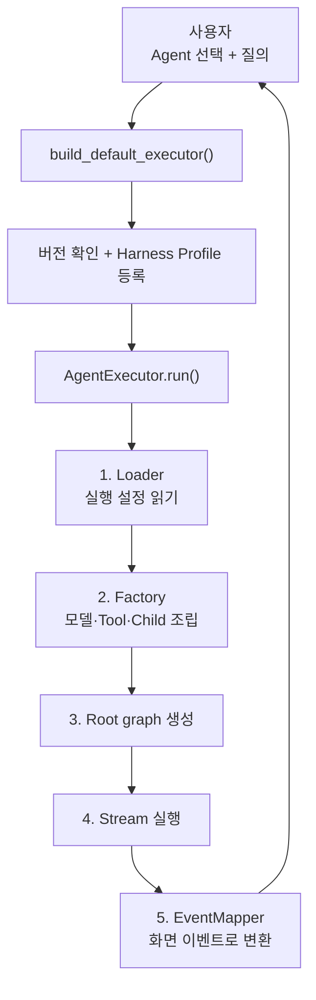

현재 Chat과 Builder API는 이 새 Executor에 연결되지 않았다.
내장 Tool 13개는 새 Runtime에서 불러올 수 있지만 MCP Tool은 아직 연결되지 않았다.

### `build_default_executor()`가 하는 일

```text
RuntimeCapabilityPolicy 생성
  → deepagents==0.7.5 확인
  → anthropic/openai Harness Profile 등록
  → 실제 Loader·ModelFactory·ToolLoader·MiddlewareFactory 조립
  → AgentExecutor 반환
```

`openai_compatible` 모델도 실제 객체는 `ChatOpenAI`이므로 `openai` Profile을 사용한다.
Executor는 싱글턴으로 캐시하지 않고 `build_default_executor()` 호출마다 새로 조립한다.

## 2. Executor가 받는 값

`AgentExecutor.run()` 입력:

| 값 | 의미 |
|---|---|
| `agent_id`, `agent_version_id` | 저장된 Agent version 실행 |
| `draft` | 저장 전 Builder 설정 테스트 |
| `user_input` | 사용자 질의 |
| `context` | 계정, 팀, 역할, 세션, run 정보 |

실행 대상은 둘 중 하나만 허용한다.

```text
저장 실행 = agent_id + agent_version_id
Draft 실행 = draft
```

둘을 같이 보내거나 둘 다 보내지 않으면 `InvalidExecutionTargetError`다.

현재 입력에 없는 것:

- 질의마다 토글한 Tool/MCP 목록
- 이전 대화 메시지
- Memory 조회 결과

따라서 현재 Factory는 저장 설정 또는 draft의 `tool_refs`만 사용한다.

## 3. Loader — 실행 설정 읽기

### 결과 구조

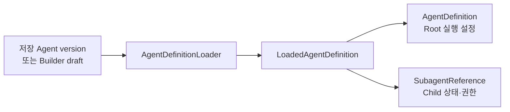

`AgentDefinition`에 들어가는 값:

| 필드 | 용도 |
|---|---|
| `agent_id`, `agent_version_id` | 실행 대상 식별 |
| `name`, `description` | Agent 정보 |
| `system_prompt` | LLM 지시문 |
| `model`, `reasoning_effort` | 모델 설정 |
| `max_iterations` | 최대 LLM 호출 횟수 |
| `tool_refs` | Agent에 노출할 Tool ID |
| `subagents` | Root에 연결할 저장 Child |

### 저장 Agent: `load()`

```text
AgentVersionRepository.get_definition()
  → Root version 조회
AgentSubagentRepository.list_for_parent_version()
  → 연결된 Child 목록 조회
각 Child version 조회
  → LoadedAgentDefinition 반환
```

Child가 비활성·권한 없음·조회 실패 상태여도 목록에서 삭제하지 않는다.
상태를 `SubagentReference`에 남겨 Factory 검증에서 정확한 오류를 낸다.

### Builder 테스트: `from_draft()`

draft의 prompt, model, max_iterations, tool_refs를 읽고,
선택된 저장 Child version을 DB에서 조회해 ID가 없는 Root 정의를 만든다.

| 실패 | 결과 |
|---|---|
| Root version 없음 또는 권한 없음 | `AgentVersionNotFound` |
| Child가 다시 Child를 가짐 | `DelegationDepthError` 대상 |
| draft 필수 값 누락 | 최종적으로 `AgentBuildError` |

## 4. Factory — graph 조립

`AgentRuntimeFactory.build()` 순서:

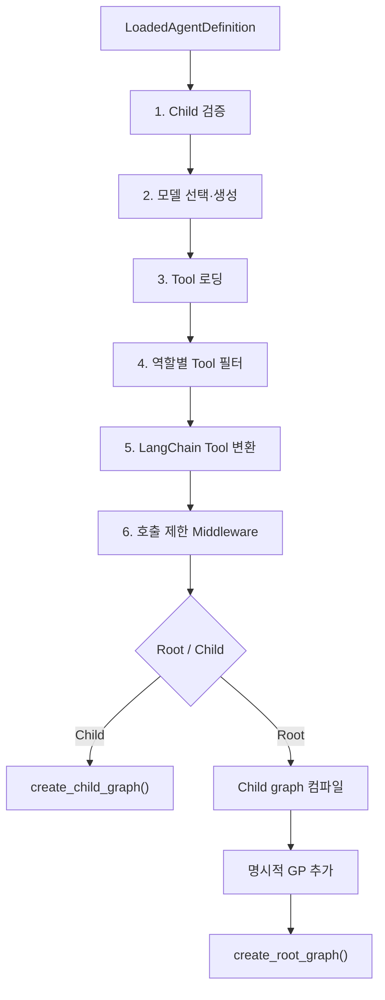

검증을 먼저 하므로 잘못된 Child 구성에서는 모델과 Tool을 불러오지 않는다.

### 4.1 Child 검증

`validate_subagents()` 검사 순서:

1. 자기 자신을 Child로 선택했는가?
2. Child ID 또는 alias가 중복됐는가?
3. alias와 위임 설명이 비어 있는가?
4. Child가 활성 상태인가?
5. 요청자에게 실행 권한이 있는가?
6. 위임 깊이 제한을 넘는가?
7. Parent → Child 연결이 순환을 만드는가?

첫 오류에서 중단하며 재시도하지 않는다.

주의: 현재 Root 조립 경로에서 `has_subagents=True`인 저장 Child를 확실히 거부하는지는 보강이 필요하다.

### 4.2 모델 선택

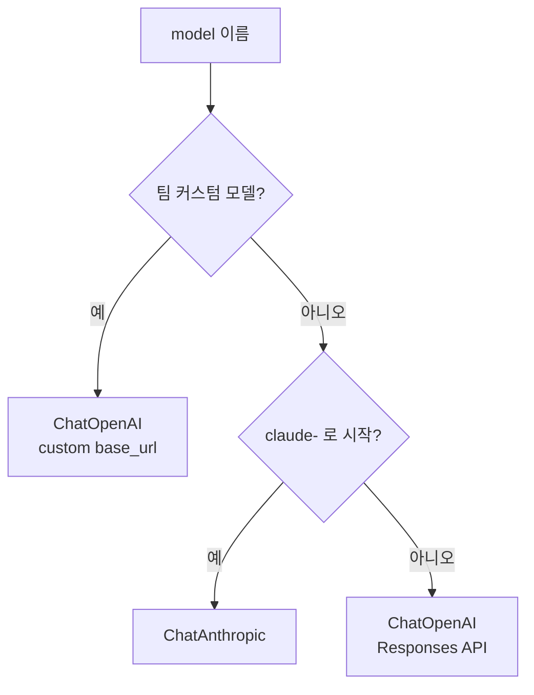

API key가 없으면 `ModelUnavailableError`다. 다른 모델로 자동 전환하지 않는다.

### 4.3 Tool과 MCP

계획한 흐름:

```text
tool_refs
  → ToolLoader.load()
  → Tool 데이터 구조
  → 권한 필터
  → LangChain StructuredTool
  → LLM에 name·description·input schema 노출
```

MCP 기능도 `Tool` 형식으로 변환한 뒤 같은 목록에 넣는다.
LLM 입장에서는 내장 Tool과 MCP Tool 모두 호출 가능한 Tool이다.

현재 상태:

- 기존 Harness의 내장 Tool 13개를 `Tool` 형식으로 바꾸는 adapter가 구현됐다.
- `ToolLoader.load()`는 `tool_refs`로 선택된 내장 Tool만 순서대로 반환한다.
- 존재하지 않는 ref와 `mcp:<id>` ref는 `ToolUnavailableError`를 낸다.
- MCP Tool 로딩은 아직 구현되지 않았다.

권한 필터:

```text
side_effect=False → leader/member에게 노출
side_effect=True  → leader에게만 노출
member의 write Tool → LLM에 처음부터 미노출
```

Tool 실행 직전 서버가 덮어쓰는 값:

`team_id`, `account_id`, `session_id`, `project_id`, `run_id`, `parent_run_id`

추가 변환:

- 레거시 Handler의 `proj_id` 인자는 Runtime의 `project_id`에서 변환한다.
- `task_extraction`에는 현재 Agent의 `definition.model`을 서버가 넣는다.
- 사용자가 같은 model 값을 보내도 서버가 정한 Agent model이 우선한다.

### 제너레이터 Tool

`task_extraction`, `jira_get_issues`처럼 중간 진행 상황을 `yield`하는 Handler는
adapter가 끝까지 실행한다.

```text
Handler yield
  → get_stream_writer()
  → mode="custom" raw event
  → EventMapper
  → tool_progress 이벤트

Handler return
  → 최종 Tool 결과
```

graph 밖에서 Handler를 직접 실행하면 stream writer는 no-op으로 처리한다.

### 4.4 Middleware

Middleware는 Factory가 graph에 연결하고, graph 실행 중 모델·Tool 호출 전에 작동한다.

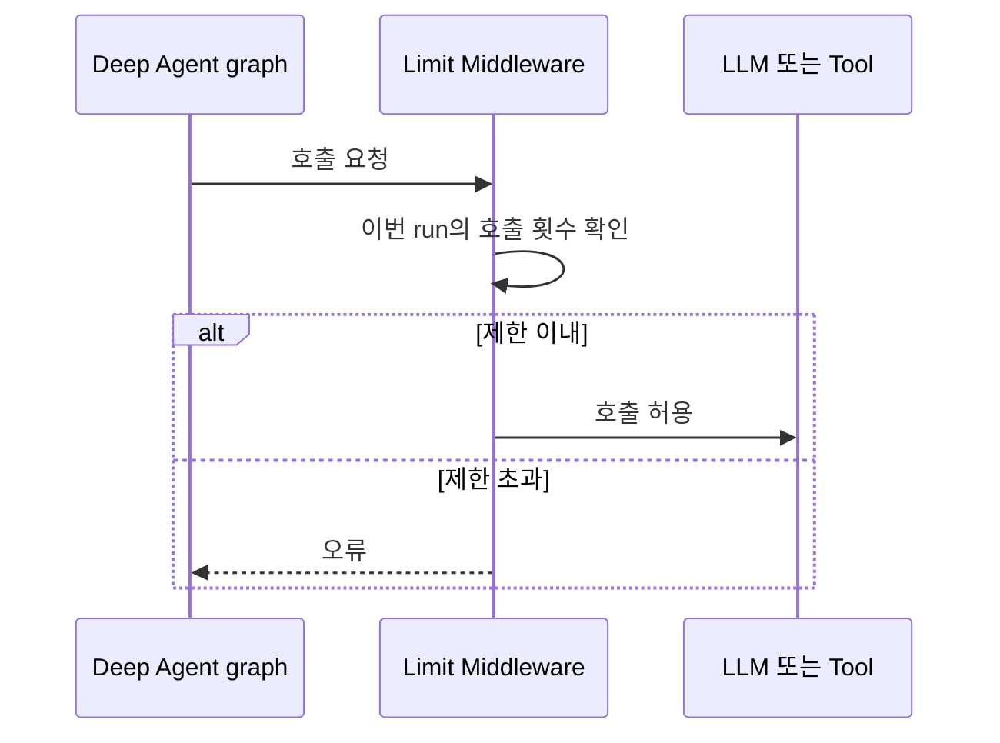

| 대상 | 모델 호출 상한 | Tool 호출 상한 |
|---|---:|---:|
| Root·저장 Child | `min(max_iterations, 20)` | 40 |
| general-purpose | 6 | 12 |

한도 초과 시 오류로 종료한다. 자동 재시도는 없다.

## 5. Root, GP, 저장 Child

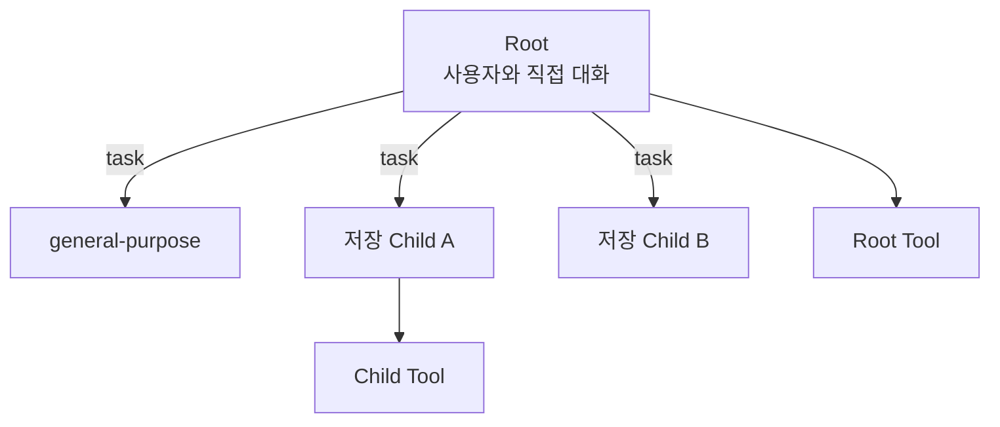

`04` 계획의 GP 정책:

1. 앱 시작 시 Deep Agents 자동 GP를 전역 비활성화한다.
2. Root에는 명시적 GP를 직접 넣는다.
3. Child는 `subagents=[]`로 만든다.

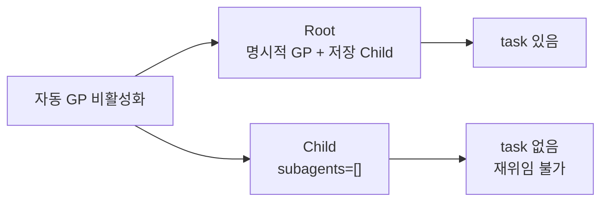

현재 `build_default_executor()`가 다음 순서로 Profile을 실제 등록한다.

```text
deepagents 버전 확인
  → anthropic Profile 등록
  → openai Profile 등록
  → excluded_builtin_tools 전달
```

기본적으로 제외하는 Deep Agents 파일 Tool:

`ls`, `read_file`, `write_file`, `edit_file`, `delete`, `glob`, `grep`

같은 Profile을 여러 번 등록해도 Deep Agents registry에서 병합되므로 호출마다 등록할 수 있다.

## 6. LLM 실행 Loop

애플리케이션이 질의를 먼저 간단/복잡으로 분류하지 않는다.
graph 안에서 LLM이 다음 행동을 고른다.

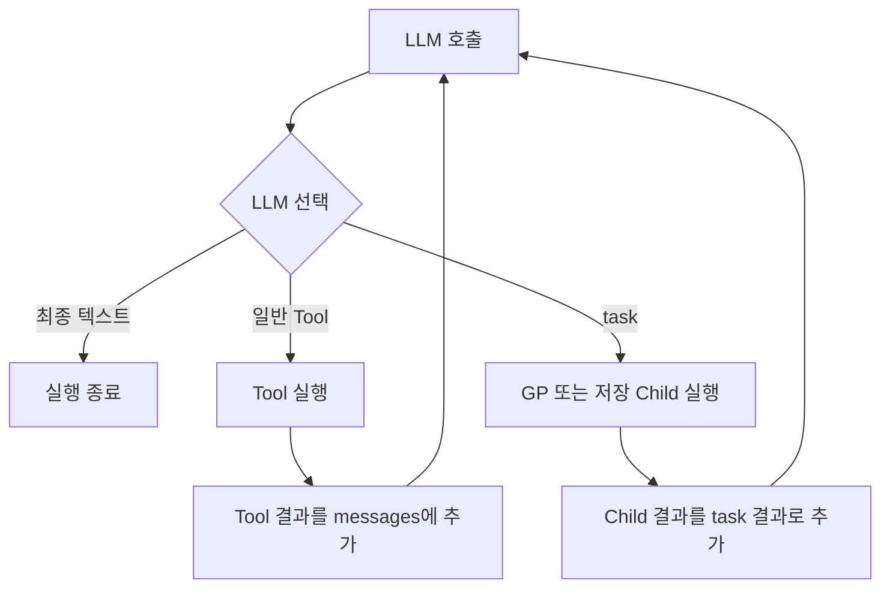

LLM이 결정하는 것:

- 직접 답변할지
- 어떤 Tool을 호출할지
- 어떤 Child에게 어떤 작업을 맡길지
- 결과를 보고 다시 호출할지
- 최종 답변을 만들지

Todo를 먼저 만들고 무조건 단계별로 실행하는 구조가 아니다.
현재 `enable_todo=False`는 graph 조립 코드와 연결되지 않아 실제 Todo 비활성화를 보장하지 않는다.

### Child 호출 값

Root가 `task`를 선택하면 다음 값을 만든다.

```text
subagent_type = Child alias 또는 general-purpose
description   = Child가 수행할 작업
```

Child는 자신의 system prompt, model, Tool, Middleware로 실행된다.
Child의 최종 답변은 `task` 결과로 Root messages에 들어가며 Root LLM이 다시 호출된다.

### LLM에 전달되는 정보

```text
system prompt
+ 현재 messages
+ 허용된 Tool schema
+ Deep Agents 기본 실행 설정
+ 서비스 호출 제한 Middleware
```

현재 첫 실행 messages에는 `user_input` 한 건만 들어간다.
`04` 계획의 `conversation_messages`는 아직 구현되지 않았다.

## 7. Stream과 화면 이벤트

`DeepAgentStreamAdapter` 실행 옵션:

```text
stream_mode=["updates", "custom"]
subgraphs=True
```

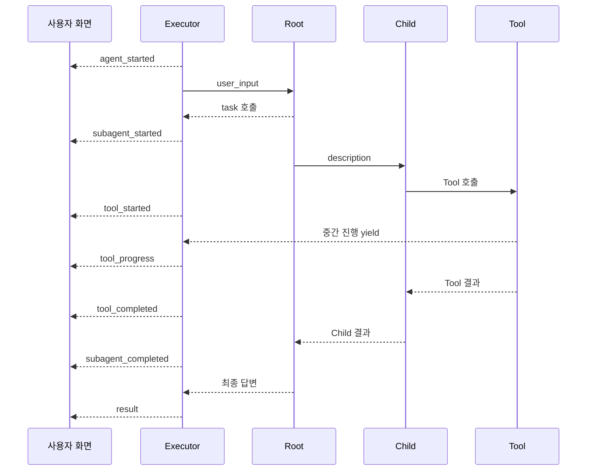

현재 변환하는 이벤트:

- `agent_started`
- Root/Child의 `tool_started`, `tool_completed`
- 제너레이터 Tool의 `tool_progress`
- `subagent_started`, `subagent_completed`
- `result`, `error`

현재 제한:

- 순차 Child 위임만 FIFO로 연결한다.
- 병렬 위임의 `tool_call_id` 연결은 없다.
- 한 raw event의 여러 Tool call을 모두 반환하는 `convert_many()`가 없다.
- token 단위 `message_delta`는 없다.

## 8. 실패 흐름

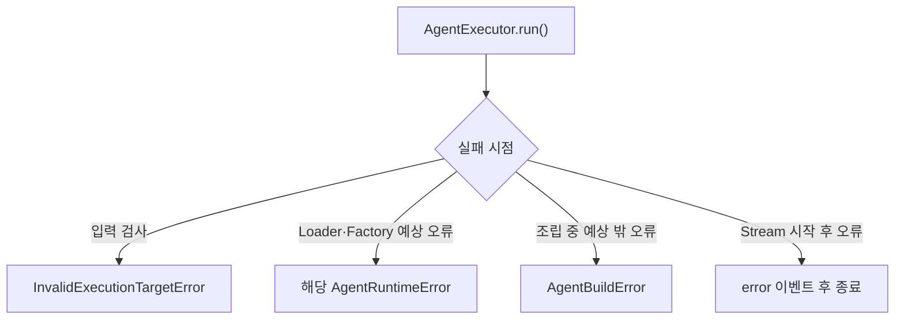

현재 모든 오류의 재시도 횟수는 0회다.

## 9. Memory, Checkpoint, Todo

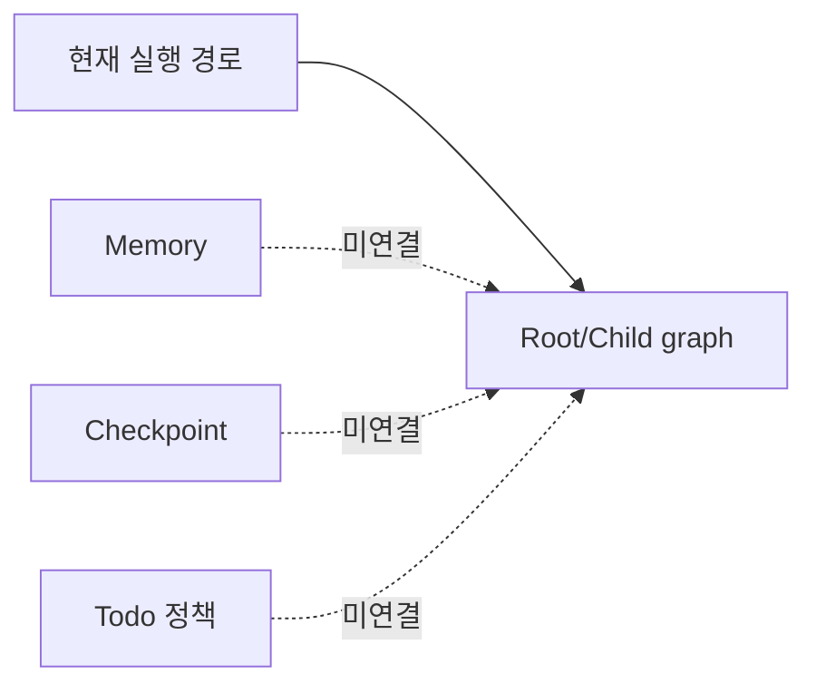

| 기능 | 현재 상태 |
|---|---|
| 이전 대화 | Executor 입력에 없음 |
| Short/Long-term Memory | 비활성 |
| Checkpointer | `build()`가 `None`, graph에 미연결 |
| Todo | 정책 값만 있고 graph 적용 코드 없음 |

현재 흐름에는 Memory 조회나 Checkpoint 저장 시점이 없다.

## 10. `04` 계획과 비교한 남은 일

| 계획 | 현재 | 남은 일 |
|---|---|---|
| 6-1~6-3 Skeleton·Compat·Model | 완료 | 유지 |
| 6-4 Runtime policy | 일부 | Todo 정책 연결 |
| 6-5 Tool loader | 내장 Tool 완료 | MCP Tool 로더 구현 |
| 6-6 Middleware | 호출 제한 완료 | Todo/HITL 별도 결정 |
| 6-7~6-8 Child·Factory | 완료 | 위임 깊이 검증 보강 |
| 6-9 Stream/Event | 진행 이벤트까지 완료 | 병렬 call·`convert_many()` |
| 6-10 Executor | `run()`으로 구현 | `prepare_run()`/`stream()` 분리는 미적용 |
| 6-11 A 통합 | 내장 Tool 연결 완료 | MCP 연결 |
| 6-12 API 연결 | 미완료 | Builder Test API부터 연결 |

현재 내장 Tool 경로로 바로 진행할 통합 순서는 `Builder Test API → Chat API`다.
MCP Tool 로더와 병렬 이벤트 보강은 별도 남은 작업이다.
