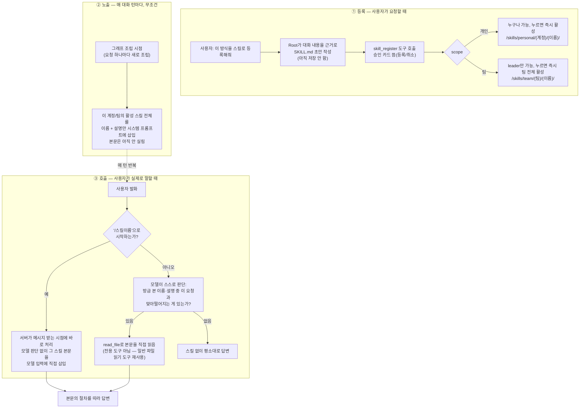

# 스킬(Skill), 언제 어디서 움직이는가

이 문서는 스킬 기능이 실제로 어떻게 돌아가는지를 시점 순서로 설명한다. 무슨 버그를
어떻게 고쳤는지가 아니라, 지금 켜져 있는 동작 자체를 다룬다.

먼저 한 줄로: 스킬은 "반복되는 업무 절차를 적어 둔 문서"다. 새 권한을 주지 않는다 —
어떤 도구를 실행할 수 있는지는 원래 있던 권한 체계가 그대로 맡고, 스킬은 그 앞에
아무것도 끼워 넣지 않는다.

## 전체 흐름



## ① 언제 만들어지는가 — 등록

스킬은 사용자가 "이 방식을 스킬로 등록해줘"라고 요청할 때만 생긴다. 자동으로 만들어지는
경로는 없다.

1. Root가 지금까지 나눈 대화를 근거로 `SKILL.md` 초안(이름·설명·절차 본문)을 먼저
   보여준다. 이 시점엔 아무 데도 저장되지 않는다.
2. 사용자가 승낙하면 `skill_register`라는 도구가 실제로 불린다. 이 도구는
   `side_effect=True`로 표시돼 있어서, 다른 쓰기 도구(업무 등록 등)와 똑같은 승인
   카드가 뜬다 — 내용 미리보기 + 등록/취소 버튼.
3. **개인 스킬**은 누구나 요청할 수 있고, 등록 버튼을 누르는 순간 바로 활성화된다.
   본인 계정에서만 보인다.
4. **팀 스킬**은 `leader`만 요청할 수 있다 — 팀원에게는 애초에 "팀 스킬로
   등록해줘"가 통하는 경로 자체가 없다. leader가 등록을 누르면 그 즉시 팀 전체에
   활성화된다. 이미 팀장의 결정으로 등록한 것이라, 별도로 다시 승인받을 대상이
   없다.

두 경우 다 "승인 대기 중" 같은 중간 상태가 없다. 등록 버튼을 누르는 순간이 곧 활성화
시점이다.

## ② 언제부터 "보이기" 시작하는가 — 자동 노출

등록된 스킬은 다음번 그래프가 조립될 때부터(=다음 요청부터) 자동으로 노출된다. 이건
사용자가 무슨 말을 하든 상관없이 **항상** 일어난다 — 도구를 켜고 끄는 설정과 무관하다.

여기서 "노출"이 뜻하는 건 이름과 설명 딱 두 줄이다. 예를 들면:

```
- natural-korean-tone: 답변이 번역체처럼 딱딱하게 들릴 때 자연스러운 한국어로 다듬는다
```

본문은 이 시점엔 실리지 않는다. 스킬이 10개든 100개든 매 턴 시스템 프롬프트에 얹히는
건 항상 이 요약 줄들뿐이고, 본문은 필요할 때만 따로 불러온다("progressive
disclosure").

## ③ 언제 실제로 "실행"되는가 — 두 가지 경로

여기서부터 흐름이 둘로 갈린다. 사용자가 스킬을 부르는 방식에 따라 완전히 다른
길을 탄다.

**자연어로 말했을 때**: 사람이 "스킬 써줘"라고 명시할 필요가 없다. 사용자가 "이 답변
너무 번역체 같아"라고 하면, 모델이 방금 자기가 본 이름·설명 목록 중에 이 상황과
맞아떨어지는 게 있는지 스스로 판단한다. 맞는 게 있다고 판단하면, 그제서야 그 스킬의
`SKILL.md`를 `read_file`로 직접 읽는다 — 스킬 전용 도구가 아니라 이미 갖고 있는
일반 파일 읽기 도구를 그대로 쓴다. 이 경로의 성패는 전적으로 **설명이 그 상황을
얼마나 잘 짚었는지**에 달려 있다. "자연스러운 한국어로 답변한다"처럼 막연하면
매칭이 안 될 수 있고, "번역체", "딱딱한 말투"처럼 사용자가 실제로 쓸 법한 표현이
들어 있으면 매칭될 확률이 올라간다.

**"/스킬이름"으로 불렀을 때**: 이건 모델의 판단을 아예 거치지 않는다. 채팅 서버가
메시지를 받는 그 순간 바로 처리한다. 이름이 개인/팀에 겹치면 팀 스킬이 이기고,
찾은 스킬의 본문을 곧바로 모델 입력에 박아 넣는다 — `read_file` 호출 한 번을 더
시키지 않는다. 이미 어느 스킬인지 확정됐으니 "고르는" 절차 자체가 필요 없고, 그
사이에 모델이 다른 판단을 끼워 넣을 여지도 없다. 화면에는 사용자가 실제로 친
"/humanizer 이 문장을..."이 그대로 남고, 모델에게 가는 입력만 바뀐다.

## 어디에 저장되고, 어떻게 격리되는가

개인 스킬과 팀 스킬은 물리적으로 같은 저장소(Store)를 쓰지만 경로와 namespace로
나뉜다.

- 개인: `/skills/personal/{계정 ID}/{이름}/SKILL.md`
- 팀: `/skills/team/{팀 ID}/{이름}/SKILL.md`

개인 스킬이 다른 계정에서 안 보이는 건 경로 이름 규칙 때문이 아니라, 요청을 처리하는
서버 쪽에서 계정 ID 자체가 그 계정 것으로 닫혀 있기 때문이다 — 다른 계정 것을
가리킬 방법이 구조적으로 없다.

같은 이름의 개인 스킬과 팀 스킬이 동시에 있으면, 나중에 로드되는 쪽(팀)이 이긴다.
이건 새로 만든 규칙이 아니라 스킬 미들웨어 자체의 기본 동작이다. 화면에는 이름
옆에 "(팀)" / "(개인)" 태그를 붙여 사람이 구분하게 해 둔다.

## 누가 이 스킬을 보는가 — Root / GP / Child

셋이 똑같이 취급되지 않는다.

- **Root(메인 채팅 에이전트)**: 자동으로 붙는다. 등록된 스킬 전체를 항상 본다.
- **general-purpose(내장 보조 에이전트)**: Root와 같은 목록을 명시적으로 넘겨받아,
  결과적으로 Root와 같은 스킬을 본다.
- **Child(위임받은 서브 에이전트)**: 기본적으로 아무 스킬도 없다. 특정 Child에
  필요해지면 그 서브 에이전트 정의에만 개별로 붙여야 한다 — 위임받아 한 번 돌고
  끝나는 일회성 작업이라, 기본으로 다 물려주지 않는 쪽을 택했다.

## 스킬과 메모리가 동시에 걸릴 때 — 우선순위

"번역체 같다"처럼 지금 이 답변에 대한 피드백은 스킬이 처리할 몫이고, "앞으로는
항상 이렇게 해줘"처럼 지속적인 선호를 말한 건 메모리가 처리할 몫이다. 이 둘이
헷갈리지 않도록 프롬프트에 명시적인 우선순위가 박혀 있다.

1. 지금 요청이 등록된 스킬의 설명과 명확히 관련되면, 메모리에 저장할지 고민하기
   전에 먼저 그 스킬을 찾아 읽는다.
2. 스킬은 "어떻게 할지"를 정의하는 자리지, 사용자의 장기 선호나 사실을 저장하는
   자리가 아니다.
3. 지금 답변이나 지금 작업의 문체·방식에 대한 수정 요청이면 스킬을 먼저 확인한다 —
   이건 지금 처리할 일이지 나중에 기억해 둘 일이 아니다.
4. "앞으로", "항상", "기억해줘"처럼 명시적으로 지속되는 선호를 말한 경우에만
   메모리 저장을 고려한다.

지금은 Root에만 이 규칙이 붙어 있다.

## 한 줄로 정리하면

`등록(사용자 요청 + 승인) → 저장(개인/팀 namespace) → 매 턴 자동 노출(이름·설명만)
→ 사용자 발화 → [/이름이면 서버가 즉시 본문 삽입] 또는 [자연어면 모델이 설명과
매칭 판단 후 read_file로 본문 로드] → 절차 적용`