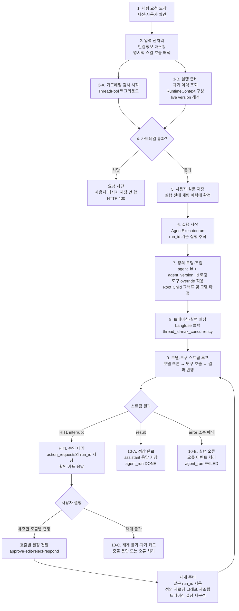

# 01. 채팅 실행 흐름 10단계 순서도 (2026-08-24 검토)

> 이전에 작성했던 00~15번 문서는 워킹 디렉토리에서 사라져서(git 이력에는
> 남아 있지만 디스크에는 없음) 이 문서를 새 1번으로 삼고 처음부터 다시
> 시작한다. 이 문서는 2026-08-24 현재 워킹 디렉토리의 **채팅 세션 실행
> 경로**를 기준으로 작성한다.

## 적용 범위

이 순서도는 사용자가 채팅 메시지를 보낸 뒤 Deep Agents 런타임을 거쳐 결과,
승인 요청 또는 오류를 받기까지의 흐름을 설명한다.

- 채팅 세션은 항상 `agent_id` + `agent_version_id` 조합으로 실행한다.
- 레거시 `agent` 스키마와 레거시 Harness 재개 경로는 채팅에서 폐기됐다.
- 다만 공통 런타임의 `AgentExecutor.run()`/`resume()`에는 저장 전 에이전트
  시험 실행을 위한 `draft` 경로가 별도로 남아 있다. 따라서 프로젝트 전체에서
  `draft` 실행 자체가 폐기됐다는 뜻은 아니다.
- 아래 3-A와 3-B는 순차 단계가 아니라 동시에 진행된 뒤 4단계에서 합류한다.
- HITL은 조건부 분기다. 승인이 필요한 도구 호출이 없으면 승인 대기를 거치지
  않고 정상 결과 또는 오류로 종료된다.

## 전체 순서도

## 흐름을 읽을 때 주의할 점

### 사용자 메시지와 응답의 저장 시점은 다르다

가드레일을 통과한 사용자 원문은 런타임 실행 전에 먼저 저장한다. 실행이 실패해도
사용자가 무엇을 질문했는지는 남기기 위해서다. 반면 assistant 응답은 정상적인
`result` 이벤트가 도착했을 때 저장한다.

### 종료는 한 종류가 아니다

- `result`: assistant 응답을 저장하고 실행을 정상 종료한다.
- `awaiting_confirmation`: `action_requests`와 `run_id`를 승인 카드로 저장하고
  현재 스트림을 멈춘다.
- `error` 또는 실행 예외: 오류 이벤트를 처리하고 실행을 실패 상태로 종료한다.
- 과거 레거시 승인 카드: 현재 Deep Agents 실행으로 재개하지 않고 충돌 또는
  오류로 처리한다.

### HITL 재개는 새 실행이 아니다

사용자가 승인 결정을 보내면 멈췄던 실행의 `run_id`를 그대로 사용한다. 다만
체크포인터에는 대화 상태가 저장될 뿐 그래프 구조 자체는 저장되지 않으므로,
정의를 다시 로딩하고 Root·Child 그래프를 재조립한 뒤 스트림 루프로 돌아간다.
이때 `EVENT_AGENT_STARTED`는 다시 발행하지 않는다.

## 코드 확인 근거

- `apps/chat/api_views.py`
  - 입력 마스킹과 명시적 스킬 호출을 처리한다.
  - 가드레일 검사를 스레드풀에 제출한 뒤 이력 조회, `RuntimeContext` 구성,
    `live_version_id` 해석을 진행하고 검사 결과와 합류한다.
  - 가드레일 통과 후 사용자 원문을 실행 전에 저장한다.
  - `_run_deep_agent()`는 `agent_id` + `agent_version_id`로 실행한다.
  - `_resume_deep_agent()`는 같은 `run_id`와 호출별 결정을 이용해 재개한다.
- `services/agent_runtime/executor.py`
  - `run()`과 `resume()`이 정의를 로딩하고 `factory.build()`로 그래프를 조립한다.
  - 조립 후 `_tracing_callbacks()`를 구성하고 스트림 어댑터를 호출한다.
  - `resume()`은 `EVENT_AGENT_STARTED`를 새로 발행하지 않는다.
  - 공통 런타임의 저장 전 시험 실행용 `draft` 경로는 유지한다.
- `services/agent_runtime/factory.py`
  - `build()`는 `(runtime, resolved_model, child_resolved_models)`를 반환한다.
- `services/agent_runtime/stream_adapter.py`
  - 일반 실행과 재개 모두 `thread_id`, 트레이싱 설정과 `max_concurrency`를
    LangGraph 실행 설정으로 전달한다.

## 단계별 상세 문서 작성 순서

앞으로 아래 순서대로 각 단계를 코드와 함께 자세히 확인한다.

1. 채팅 요청 도착과 세션·사용자 확인
2. 입력 전처리: 민감정보 마스킹과 명시적 스킬 호출
3. 병렬 준비: 가드레일 검사와 실행 컨텍스트 준비
4. 가드레일 합류와 차단 판단
5. 사용자 원문 선저장
6. `AgentExecutor.run()` 실행 시작과 실행 추적
7. 에이전트 정의 로딩, 도구 override, Root·Child 조립
8. Langfuse 콜백과 실행 설정
9. 모델·도구 스트림 루프와 HITL 중단·재개
10. 정상 결과, 승인 대기, 오류의 저장과 종료 처리

## 단계별 상세

다음 문서부터 1단계를 시작으로 실제 호출 함수, 입력값, 출력값, DB 접근,
실패 경로와 테스트 근거를 하나씩 확인한다.
