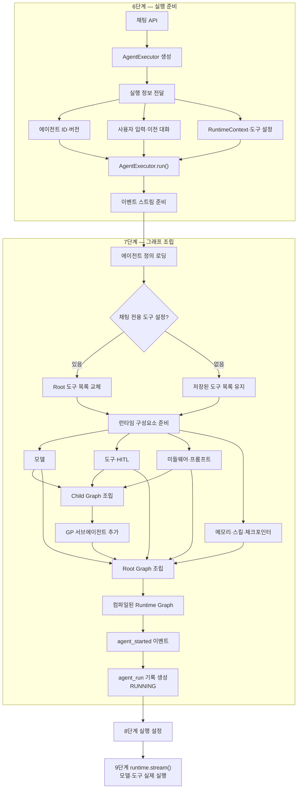

# 08. 7단계 — 정의 로딩과 Runtime Graph 조립

## 7단계에서 하는 일

저장된 에이전트 설정을 읽고 실제로 실행할 수 있는 Deep Agents Runtime Graph로
조립한다.

```text
7-A. 에이전트 정의 로딩
7-B. 채팅 전용 설정 반영
7-C. Runtime Graph 조립
```

완료되면 다음 세 값이 만들어진다.

```text
runtime
+ resolved_model
+ child_resolved_models
```

| 결과 | 의미 |
|---|---|
| `runtime` | 실행 가능한 Root Graph |
| `resolved_model` | Root가 실제 사용할 모델 설정 |
| `child_resolved_models` | Child별 실제 모델 설정 |

## 6·7단계 통합 아키텍처



## 전체 동작 흐름

```text
AgentExecutor.run() 실제 시작
    ↓
실행 대상 검증
    ↓
Root 에이전트 버전 조회
    ↓
Root에 연결된 Child 조회
    ↓
LoadedAgentDefinition 생성
    ↓
채팅 전용 도구 설정 반영
    ↓
Child 관계와 실행 권한 검증
    ↓
Root·Child의 모델과 도구 준비
    ↓
미들웨어와 HITL 설정 준비
    ↓
시스템 프롬프트 조립
    ↓
Child Graph 조립
    ↓
범용 GP 서브에이전트 추가
    ↓
Root Graph 조립
    ↓
컴파일된 runtime 반환
    ↓
agent_started 이벤트 생성
    ↓
agent_run 실행 기록 생성
    ↓
8단계로 이동
```

## 7-A. 에이전트 정의 로딩

### 하는 일

1. `agent_id`와 `agent_version_id`가 올바른 실행 대상인지 확인한다.
2. DB에서 Root 에이전트 버전을 조회한다.
3. Root에 연결된 Child 에이전트 목록을 조회한다.
4. Child별 실행 버전과 위임 정보를 조회한다.
5. 조회 결과를 런타임용 정의 객체로 변환한다.

### Root 실행 정의

```text
AgentDefinition
├─ agent_id
├─ agent_version_id
├─ name
├─ description
├─ system_prompt
├─ model
├─ reasoning_effort
├─ max_iterations
├─ tool_refs
└─ subagents
```

### Child 실행 정의

```text
SubagentDefinition
├─ agent_id
├─ agent_version_id
├─ name
├─ description
├─ system_prompt
├─ model
├─ reasoning_effort
├─ max_iterations
├─ alias
├─ delegation_description
└─ tool_refs
```

`alias`와 `delegation_description`은 Root가 어떤 Child에게 작업을 위임할지
판단할 때 사용한다.

### 로딩 결과

```text
LoadedAgentDefinition
├─ definition
│  ├─ Root 실행 정의
│  └─ Child 실행 정의
│
└─ subagent_references
   └─ Child 상태와 실행 가능 여부
```

## 7-B. 채팅 전용 도구 설정 반영

채팅 세션에 `tool_refs_override`가 있으면 Root 정의의 도구 목록을 교체한다.

```text
tool_refs_override가 None
→ 에이전트 버전에 저장된 Root 도구 사용

tool_refs_override가 빈 목록
→ Root 도구를 모두 끔

tool_refs_override에 값이 있음
→ 해당 도구 목록으로 Root 도구 교체
```

이 변경은 메모리에 로딩된 현재 실행 정의에만 적용하며 DB의 에이전트 버전과
Child의 도구 목록은 변경하지 않는다.

## 7-C. Runtime Graph 조립

### 1. Child 관계 검증

다음 항목을 검사한다.

```text
Child가 활성 상태인가
Child를 실행할 권한이 있는가
Child 버전이 실행 가능한가
Child가 또 다른 Child를 가지고 있지 않은가
순환 위임 관계가 없는가
```

현재 프로젝트는 `Root → Child`까지만 허용하고 `Root → Child → Grandchild`는
허용하지 않는다.

### 2. 모델 준비

```text
저장된 model 설정
+ reasoning_effort
+ team_id
    ↓
ResolvedModelConfig
    ↓
실제 모델 객체
```

Root의 설정은 `resolved_model`, Child별 설정은 `child_resolved_models`에 보관한다.

### 3. 도구 준비

```text
tool_refs
    ↓
ToolLoader
    ↓
ToolDefinition
    ↓
LangChain Tool
```

도구에는 현재 `RuntimeContext`와 실행 권한 정책이 연결된다.

### 4. HITL 승인 설정

```text
side_effect가 없는 도구
→ 바로 실행 가능

side_effect가 있는 도구
→ interrupt_on에 등록
→ 실행 전 사용자 승인 필요
```

HITL 재개에 필요한 Checkpointer가 있을 때만 승인 중단 기능을 구성한다.

### 5. 미들웨어 준비

에이전트 정의와 실행 컨텍스트를 바탕으로 다음 실행 정책을 조립한다.

```text
권한 검사
도구 실행 제한
도구 timeout
쓰기 충돌 방어
메모리
스킬
```

### 6. 시스템 프롬프트 조립

```text
공통 Runtime Scaffold
+ 에이전트 system_prompt
+ 메모리 지침
+ 스킬 지침
+ 위임 지침
    ↓
최종 시스템 프롬프트
```

Root와 Child는 서로 다른 프롬프트 조립 방식을 사용한다.

### 7. Child Graph 조립

```text
Child 모델
+ Child 프롬프트
+ Child 도구
+ Child 미들웨어
+ Child HITL 설정
    ↓
Compiled Child Graph
```

Child는 1단계 위임 제한 때문에 자신의 Child를 다시 조립하지 않는다.

### 8. 범용 GP 서브에이전트 추가

```text
Root의 서브에이전트 목록
├─ General Purpose 서브에이전트
└─ 사용자가 연결한 Child 에이전트들
```

GP 서브에이전트에는 외부 상태를 변경하는 side-effect 도구를 직접 넘기지 않는다.

### 9. Root Graph 조립

```text
Root 모델
+ Root 시스템 프롬프트
+ Root 도구
+ Root 미들웨어
+ Memory
+ Skills
+ Checkpointer
+ HITL 설정
+ General Purpose 서브에이전트
+ 사용자 Child 에이전트
    ↓
Compiled Root Runtime Graph
```

이 Graph가 이후 `runtime.stream()`에서 실제로 실행된다.

## 실행 시작 이벤트와 기록

그래프 조립에 성공하면 `AgentExecutor`가 다음 정보를 가진 `agent_started`
이벤트를 생성한다.

```text
run_id
+ agent_id
+ agent_version_id
+ resolved_provider
+ resolved_endpoint_hash
```

`trace_events()`가 이 이벤트를 확인하면 DB에 `agent_run` 실행 기록을 만들고
상태를 `RUNNING`으로 기록한다. 그래프 조립 전에 오류가 발생하면
`agent_started`가 만들어지지 않으므로 정상적인 `agent_run` 시작 기록도 없다.

## 각 동작을 확인할 파일

| 동작 | 확인할 파일 |
|---|---|
| 7단계 전체 실행 순서 | `services/agent_runtime/executor.py` |
| Root·Child 정의 로딩 | `services/agent_runtime/loader.py` |
| 런타임 정의 구조 | `services/agent_runtime/definitions.py` |
| DB 에이전트 버전 조회 | `backend/db/agent_platform.py` |
| Runtime Graph 전체 조립 | `services/agent_runtime/factory.py` |
| 모델 설정 해석과 생성 | `services/agent_runtime/models/factory.py` |
| 도구 로딩 | `services/agent_runtime/tools/loader.py` |
| 도구 실행 어댑터 | `services/agent_runtime/tools/adapters.py` |
| 미들웨어 조립 | `services/agent_runtime/middleware/factory.py` |
| 시스템 프롬프트 조립 | `services/agent_runtime/prompts.py` |
| Child 검증 | `services/agent_runtime/subagents/validation.py` |
| Child Graph 조립 | `services/agent_runtime/subagents/builder.py` |
| Deep Agents 호환 계층 | `services/agent_runtime/compat/deepagents_v075.py` |
| 실행 시작 DB 기록 | `services/agent_runtime/tracing/__init__.py` |

## 다음 단계와의 경계

7단계는 실행 가능한 Runtime Graph를 만드는 단계다. LangSmith·Langfuse 콜백,
`thread_id`, `max_concurrency` 같은 실행 옵션은 8단계에서 연결하고 실제 모델·도구
루프는 9단계의 `runtime.stream()`에서 시작한다.
