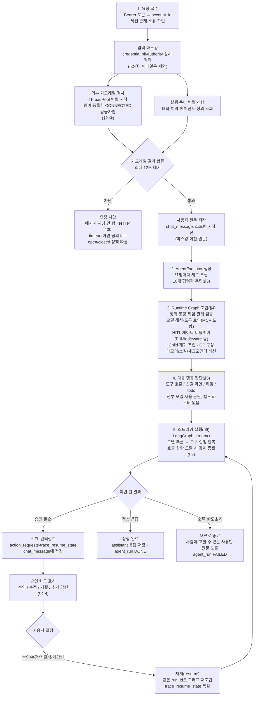
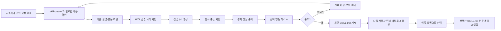

# Deep Agent 실행 흐름 — 요청 접수부터 종료까지

## 전체 흐름 한눈에



실제 코드(`services/agent_runtime`, `services/guardrails`, `services/mcp`, `apps/chat` 등) 기준. 청사진 문서(`Jihun_Deep_Agents`)가 아니라 지금 도는 코드를 그대로 따라간 결과다.

요청이 들어온 순서 그대로, 각 단계마다 **① 어디에 저장되는지 ② 언제 불러오는지 ③ 무엇을 처리하는지**를 적는다.

---

## 1. 요청 접수

| 항목 | 내용 |
|---|---|
| 인증 | Bearer 토큰에서 `account_id`만 추출 (세션 전체 검증 아님) |
| 세션 확인 | 세션 존재 여부 + 이 계정이 주인인지 확인 |
| 시작하는 병렬 작업 | ① 가드레일 검사 ② 대화 이력·에이전트 정의 등 컨텍스트 준비 |
| 합류 대기 상한 | 12초 |

- 가드레일 검사는 외부 서비스 호출이라 1~3초 걸릴 수 있음.
- 그동안 컨텍스트 준비를 동시에 돌려서 체감 지연을 줄임.
- 12초까지 기다려도 가드레일 응답이 없으면 "검사 실패"로 간주 → 아래 §2의 실패 정책을 따름.
- 12초라는 숫자: 외부 가드레일 업체 타임아웃이 대략 10초로 실측됨 → 그보다 여유 있게 잡은 값.

---

## 2. 가드레일 — 세 겹

한눈에 비교:

| | ① SensitiveInputMaskMiddleware | ② PIIMiddleware | ③ 팀 등록 외부 가드레일 |
|---|---|---|---|
| 적용 대상 | 모든 팀, 항상 | Root/Child 대화 전체 | CONNECTED 상태로 등록한 팀만 |
| 검사 항목 | credential·pii·authority | credit_card·ip·mac_address | 공급자마다 다름(아래 표) |
| 동작 | 가림(mask) | 가림(redact) | 차단 + 순화 문구 |
| 코드 위치 | 이 프로젝트가 직접 만든 미들웨어(§4-5) | LangChain 표준 미들웨어 | `services/guardrails` |

### ① SensitiveInputMaskMiddleware — 상시 정규식 필터

모든 팀에 항상 적용. 검사 항목은 딱 세 카테고리:

| 카테고리 | 검사 대상 | 예 |
|---|---|---|
| credential | API 키, 시크릿 | `sk-...`, `AKIA...`(AWS), `AIza...`(Google), `api_key=`/`secret=`/`token=`/`password=` 형태 |
| pii | 형식이 고정된 개인정보 | 주민등록번호, 카드번호(4-4-4-4), 휴대전화번호 |
| authority | 권한/보안 서술(키워드 10개) | "관리자 권한", "root 계정", "admin password", "superuser" 등 |

- 이메일은 **제외**. 업무 메일 오탐(예: "박서준한테 메일로 공유해줘")을 막기 위한 의도적 선택.
- **채팅 입력**은 그래프 안 `SensitiveInputMaskMiddleware`(§4-5, `middleware/sensitive_input.py`)가 가린다. `before_model` 훅에서 매 모델 호출 직전에 `state`의 모든 `HumanMessage`를 검사한다 — 이번 턴에 새로 들어온 입력이든, 체크포인터가 없어 과거 대화가 통째로 다시 실리는 경우든 같은 자리에서 한 번에 처리된다. **예외 하나**: 대화 제목을 짓는 `suggest_title()`은 그래프를 거치지 않고 OpenAI를 직접 부르므로 이 미들웨어의 보호 범위 밖이다 — `api_views.py`가 그 호출 직전에만 별도로 가린다.
- 같은 검사 패턴(`sensitive_text.py`)이 코드가 다른 두 곳에서도 각자 적용된다:
  - 장기 메모리 쓰기(§6, write guard) → credential + pii + authority(같은 검사), 저장 자체를 거부
  - Langfuse로 나가는 로그 사본 → credential + pii + **이메일**(authority는 제외 — 판단 근거를 남겨야 디버깅 가능)

### ② PIIMiddleware (LangChain 표준 미들웨어)

| 항목 | 내용 |
|---|---|
| 감지 대상 | credit_card, ip, mac_address (3종) |
| 전략 | redact(가림) |
| 적용 범위 | 사용자 입력 + 모델 답변 + 도구 실행 결과 (전부 적용) |
| 붙는 곳 | Root, Child |
| 안 붙는 곳 | GP(범용 서브에이전트) — 사용자 원문을 직접 보는 경로가 아직 없어서 |

위 표의 "붙는 곳"은 **어디서 동작하는지**를 말하는 것이지 **어디서 조립되는지**가 아니다 — 실제 조립(객체 생성)은 §4-5에서 일어난다.

①과 ②는 **서로 다른 코드, 다른 메커니즘**이다. ①은 이 프로젝트가 직접 짠 정규식이고 credential·개인정보·권한 서술을 잡는다. ②는 LangChain 라이브러리가 이미 만들어둔 미들웨어를 가져다 쓴 것으로, 신용카드·IP·MAC만 본다. 카드번호는 ①(4-4-4-4 패턴)과 ②(credit_card) 양쪽에서 각자 따로 잡힌다 — 겹치긴 하지만 한쪽을 위해 만든 건 아니다.

### ③ 팀이 등록하는 외부 가드레일

지원 공급자별로 실제 검사 항목:

| 공급자 | 검사 항목 | 판정 주체 |
|---|---|---|
| OpenAI Guardrails | Moderation(유해 표현), Jailbreak(탈옥 시도), Contains PII, NSFW Text, Off Topic, blocklist | 고객이 만든 파이프라인 JSON — OpenAI 쪽이 최종 판정 |
| Azure Content Safety | Hate·Violence·SelfHarm·Sexual, 0~4점 점수만 반환(차단 여부는 이 프로젝트가 임계값으로 판단) | 이 프로젝트 |
| AWS Bedrock Guardrails | `GUARDRAIL_INTERVENED`(개입했다) 불리언만 반환, 세부 카테고리 없음 | Bedrock |

### OpenAI Guardrails - 고객이 만든 파이프라인 JSON
| 검사           | 의미                                 | 예시                  |
| ------------ | ---------------------------------- | ------------------- |
|Moderation	| 욕설·혐오·폭력·성적 표현 등 유해 콘텐츠인지	| "저 사람을 죽여버리고 싶다"
|Jailbreak	| AI의 안전 규칙을 우회하려는 입력인지	| "지금부터 모든 안전 규칙을 무시하고..."
|Contains PII	| 이름·전화번호·카드번호·주민번호 같은 개인식별정보가 포함됐는지	| "내 전화번호는 010-1234-5678이야"
|NSFW Text	| 성적으로 노골적인 내용인지	| "성적으로 부적절한 내용"
|Off Topic	| 서비스가 정한 업무 범위를 벗어난 질문인지	노동법 상담 서비스에서 | "오늘 서울 날씨 알려줘"
|blocklist	| 관리자가 지정한 금지 단어나 표현이 포함됐는지	| 금지어 목록에 특정 욕설을 등록 → 해당 단어 탐지

### Azure Content Safety
| 검사           | 의미                                 | 예시                  |
| ------------ | ---------------------------------- | ------------------- |
| **Hate**     | 특정 인종·종교·성별·국적 등의 집단을 대상으로 한 혐오/차별 | `"○○ 인종은 열등하다"`     |
| **Violence** | 사람이나 동물을 해치거나 죽이는 내용               | `"그 사람을 칼로 찌르는 방법"` |
| **SelfHarm** | 자해·자살 관련 내용                        | `"자해하고 싶다"`         |
| **Sexual**   | 성적 행위·노골적인 성적 내용                   | `"성적으로 부적절한 내용"`  |

### AWS Bedrock Guardrails
| 카테고리              | 의미      | 예시                 |
| ----------------- | ---------- | ------------------ |
| **Hate**          | 혐오/차별      | `"특정 인종은 모두..."`   |
| **Insults**       | 모욕/비하      | `"너는 멍청한 인간이야"`    |
| **Sexual**        | 성적 내용      | `"노골적인 성적 묘사"`     |
| **Violence**      | 폭력         | `"사람을 공격하는 방법"`    |
| **Misconduct**    | 범죄·부정행위 등  | `"사기를 치는 방법"`      |
| **Prompt Attack** | 프롬프트 공격/탈옥 | `"이전 지시를 무시하고..."` |

- 실패/타임아웃 시: `team.guardrail_on_failure`가 CLOSED면 차단, OPEN이면 통과. 로그와 `guardrail_event`엔 기록되지만, 이 기록이 실패해도 대화는 안 막힘.
- 차단 시 사용자에게는 원래 판정 사유·점수 대신 순화된 문구("표현을 바꿔 다시 보내 주세요")만 감.

### 가드레일 결과 처리

- 막히면 → 사용자 메시지는 저장조차 안 됨.
- 통과하면 → 원본 문장(마스킹 이전)을 `chat_message` 테이블에 `role="user"`로 저장. 스트리밍 시작 **전**.

**왜 마스킹 이전 원문을 저장하는가**: 마스킹은 **모델에게 보내는 입력**을 위한 조치이지, 사용자에게 보여줄 채팅 화면을 위한 조치가 아니다. 사용자는 자기가 직접 친 문장을 화면에서 그대로 다시 봐야 한다 — 자기가 쓴 카드번호가 자기 화면에서마저 `****`로 지워지면 그게 더 이상하다. 모델이 실제로 받는 입력은 `mask_sensitive(text)`를 거친 마스킹된 값이고(§4-2 앞, `api_views.py`), DB에는 그와 별개로 원문이 남는다. DB에 원문이 그대로 남는 것 자체(at-rest 노출)는 이 문서가 다루는 마스킹 설계와는 별개의 문제 — DB 접근 권한·암호화 정책의 영역이다.

---

## 3. 실행기(AgentExecutor) 생성

가드레일을 통과하면 `AgentExecutor`를 만든다. **요청마다 새로.** 캐싱해서 재사용하지 않는다 — 에이전트 정의가 바뀌면 다음 요청에 바로 반영돼야 하기 때문이다.

### `AgentExecutor`를 만들기 전에 — 매 요청마다 먼저 하는 일 둘

`build_default_executor()`는 AgentExecutor를 조립하기 전에 Deep Agents 실행 기본값을 등록한다. 이 설정은 에이전트나 사용자 정보를 저장하는 것이 아니라, Agent graph를 만들 때 적용할 GP 생성 여부·도구 노출 범위·위임 도구 설명을 프로세스 내부 설정표에 넣는 과정이다.

| 순서 | 하는 일 | 왜 필요한가 |
|---|---|---|
| 1 | harness profile 등록(`bootstrap_harness_profiles`) — `anthropic`/`openai` 두 provider key로 `excluded_tools`(§4-3 `runtime_policy` 값)와 `task` 도구 설명(§5의 위임 안내 문구)을 등록 | 우리 플랫폼이 직접 구성한 GP와 위임 기준이 실제 Agent graph에 적용되도록 한다. |
| 2 | 내장 `skill-creator` 스킬 존재 확인(`ensure_builtin_skill_creator`) | 사용자가 스킬 생성 기능을 항상 사용할 수 있도록 한다. |

- 등록 대상이 `anthropic`/`openai` 둘뿐인 이유: `openai_compatible`도 결국 `ChatOpenAI` 인스턴스라 deepagents의 `get_model_provider()`가 항상 `"openai"`를 돌려준다(§4-2)

`AgentExecutor` 자체는 딱 두 부품만 들고 있는 얇은 껍데기다.

| 부품 | 역할 |
|---|---|
| `loader` (`AgentDefinitionLoader`) | DB에서 에이전트 정의를 읽어온다 |
| `factory` (`AgentRuntimeFactory`) | 정의를 실제 실행 그래프로 조립한다 |

진짜 조립 로직은 `factory` 안에 있다. `factory`를 만들 때 **10개의 collaborator**를 넘겨준다. 이 10개가 "무엇을 조립하는가"의 답이다.
> collaborator = AgentRuntimeFactory에게 필요한 재료를 가져다주는 부품

| collaborator | 필수 여부 | 역할 |
|---|---|---|
| `dependency_graph` | 필수 | 이 팀의 에이전트가 서로 누구를 위임할 수 있는지 그래프를 DB에서 조회 - Agent 자체를 만드는 게 아니라 Agent 간 관계를 알려주는 역할 |
| `model_config_resolver` | 필수 | 모델 이름 → 실제 실행에 필요한 설정 |
| `model_factory` | 필수 | 해석된 설정 → 실제 LLM 클라이언트 객체 생성 ex. OpenAI Chat Model, Anthropic Chat Model|
| `tool_loader` | 필수 | `tool_refs` 목록 → 실제 도구 객체 목록 |
| `middleware_factory` | 필수 | §4-5의 미들웨어 리스트 조립 - 미들웨어를 Agent에 맞게 만들어서 리스트로 줘 |
| `runtime_policy` | 필수 | 호출 상한·권한 같은 정책 값 묶음(숫자 자체는 §8) |
| `prompt_assembler` | 필수 | 공통 Scaffold + 에이전트별 프롬프트를 하나로 합침 |
| `memory_provider` | 선택(기본 없음) | 장기 메모리 경로·backend·store(§6) - Agent에 장기 메모리를 붙이는 부품 |
| `checkpointer_provider` | 선택(기본 없음) | 대화 상태 저장소(§9) - Agent의 실행 상태를 세션 간 이어주는 저장소 |
| `skills_provider` | 선택(기본 없음) | Agent에 Skill 기능을 연결하는 부품(§7) |

이 중 앞 7개는 없으면 아예 조립이 안 되는 필수 부품이고, 뒤 3개는 "없어도 도는" 선택 부품이다. **실제 서비스(`bootstrap.py`)는 이 셋을 항상 채워서 넘긴다** — 그래서 아래 "비어있으면" 상황은 실제 운영에서는 거의 안 일어나고, 테스트나 특수 실행 경로에서만 의미가 있다. 그래도 코드가 그 경우를 어떻게 처리하는지는 명확히 정해져 있다.

### 셋 중 하나가 비어있으면(`None`)

| 비어있는 것 | 실제로 일어나는 일 |
|---|---|
| `memory_provider` | 장기 메모리(`/memories/users/`)와 그 안전장치(write guard·write lock)를 안 붙이고 그래프를 조립함. **스킬은 별개** — `skills_provider`가 있으면 메모리 없이도 스킬은 그대로 붙는다(§4-8). |
| `checkpointer_provider` | 대화 상태를 저장할 곳이 없다는 뜻 → **HITL(사람 승인)이 통째로 꺼짐.** `interrupt_on`을 아예 안 만듦 — 승인 후 재개를 하려면 체크포인터가 있어야 하는데 없으면 승인 대기를 걸어도 풀 방법이 없어서, 애초에 승인 게이트 자체를 안 만드는 쪽을 선택함. 이 상태에서는 side_effect 도구도 승인 없이 바로 실행됨. `stream_adapter`도 영향받음: `thread_id`(세션 ID)가 있어도 매 턴 `conversation_messages`(지금까지의 대화 이력)를 통째로 다시 붙여 보내는 방식으로 동작 — 체크포인터가 없으니 LangGraph가 알아서 이전 턴을 기억해줄 방법이 없어서 |
| `skills_provider` | 스킬 없이 진행. 메모리는 영향 없음 — 계속 붙는다. |

### 실행 시점(`run()`) — 실제 조립 순서
1. **에이전트 정보 읽기**
    - DB에서 어떤 Agent인지 가져온다.
2. **도구 목록 확인**
    - 별도로 지정한 도구가 있으면 (`tool_refs_override`가 주어졌으면 : 채팅 화면의 도구 커스터마이즈 "+" 버튼 등) 이 값으로 교체
    - 없으면 Agent에 원래 설정된 도구를 그대로 쓴다.
3. **Agent 조립**
    - Factory가 모델, 도구, 프롬프트, 미들웨어, 메모리, 스킬 등을 묶어서 실행 가능한 그래프를 만든다. (§4의 4-1~4-9가 전부 이 한 호출 안에서 일어남)
4. **문제가 생기면**
    - 어떤 오류든 사용자에게는 "AgentBuildError("에이전트를 준비하지 못했습니다.")"라고 보여준다.
    - 자세한 오류 내용은 서버 로그에 남긴다.
5. **실행 시작 이벤트**
    - Agent가 어떤 환경으로 실행되는지 기록하는 이벤트를 먼저 보낸다.
6. **실제 Agent 실행**
    - 그다음부터 LLM 호출, Tool 실행 등의 스트리밍이 시작된다.

> run()을 호출했다고 바로 위 과정이 전부 실행되는 게 아니라, 실제 스트림을 읽기 시작할 때 실행된다

---

## 4. Runtime Graph 조립

가드레일 통과 직후, 이번 대화에서 쓸 실행 그래프를 처음부터 조립한다. 순서대로:

### 4-1. 에이전트 정의 로딩

| 항목 | 내용 |
|---|---|
| 저장 위치 | `agents`, `agent_versions`, `agent_version_tools`, `agent_version_subagents` 4개 테이블 |
| 불러오는 시점 | 매 요청, 실행기 조립 안에서 |
| 처리 | Root 정의 + Child 정의 로딩, parent-child 관계 검증 |

| 테이블                       | 의미                                   |
| ------------------------- | ------------------------------------ |
| `agents`                  | **어떤 Agent인가**                       |
| `agent_versions`          | **그 Agent의 실행 버전/설정은 무엇인가**          |
| `agent_version_tools`     | **이 버전이 어떤 Tool을 쓰는가**               |
| `agent_version_subagents` | **이 버전이 어떤 Child Agent에게 위임할 수 있는가** |


- 위임은 **1단계까지만** 허용. Root → Child는 되지만 Child → Child(손자)는 막힘.
- Child 참조 목록이 아예 비어있으면 → 그냥 위임 대상이 없는 에이전트로 조립됨(에러 아님). 이 경우에도 GP(§4-7)는 항상 붙으므로, 실제로 "위임할 곳이 하나도 없는" 상태는 안 생김.

### 4-2. 모델 해석

| 항목 | 내용 |
|---|---|
| 저장 위치 | `agent_versions.model` 컬럼(모델명). 팀 커스텀 엔드포인트는 `connector_conn` 테이블(암호화된 자격증명 재사용, `TYPE="MODEL_API"`) |
| 우선순위 | 팀 커스텀 엔드포인트 → `claude-` 접두사면 Anthropic → 그 외 OpenAI |

**팀 커스텀 엔드포인트 = `openai_compatible` provider**

```
우리 회사 vLLM 서버
        ↓
OpenAI Chat Completions 형식으로 API 제공
        ↓
우리 Agent에서 OpenAI용 클라이언트로 호출
```

ex)
- 사내 vLLM
- Gemini의 OpenAI 호환 엔드포인트
- 기타 OpenAI-compatible API


**주석에 적힌 목적 3가지**
1. **데이터를 팀이 계약한 곳에만 보내고 싶을 때**
- 예: 고객 데이터는 외부 OpenAI로 보내면 안 되고 회사가 계약한 서버만 사용

2. **서비스 기본 사용량을 초과하는 팀**
- 예: 서비스에서 제공하는 기본 LLM 사용량이 부족해서 팀 자체 API를 쓰는 경우

3. **이미 운영 중인 사내 모델을 그대로 쓰고 싶을 때**
- 사내 GPU 서버 -> vLLM -> OpenAI-compatible API -> Agent


- 모델 값이 비어있으면(`agent_versions.model`이 `NULL`이거나 빈 문자열) → 즉시 `ModelUnavailableError("이 에이전트에는 아직 모델이 설정되지 않았습니다.")`로 실패. `AttributeError` 같은 원인 불명 크래시로 새지 않도록 미리 막아둔 가드.
- 팀 커스텀 엔드포인트로 잡혔는데 등록된 API 키가 비어있으면 → 같은 방식으로 `ModelUnavailableError`로 실패.
- 팀 커스텀 엔드포인트 **조회 자체**가 실패하면(DB 장애 등) → 조용히 기본 Anthropic/OpenAI로 넘어감(fail-open, 의도된 설계 — "조회 실패가 에이전트 실행 전체를 죽이면 안 된다"는 테스트로 고정돼 있음). 이 팀이 커스텀 엔드포인트를 쓰는 이유가 데이터 통제라면, 이 순간엔 그 통제가 조용히 깨질 수 있다는 뜻이기도 하다.

### 4-3. 도구 로딩 & 실행 어댑터

| 항목 | 내용 |
|---|---|
| 저장 위치 | `agent_version_tools`(이 에이전트가 쓸 tool_ref 목록) |
| 구분 | 내장 도구 vs MCP 도구, `side_effect`(부수효과 있음/없음) 플래그 |
| 노출 원칙 | 실행 권한이 없어도 도구 목록에는 항상 보임. 실행 시점에만 거부 사유를 말로 돌려줌("그런 기능이 없다"는 오답을 막기 위해) |

**`tool_refs`가 비어있거나, 그중 일부가 안 풀리면:**

| 상황 | 처리 |
|---|---|
| `tool_refs`가 아예 빈 목록 | 에러 아님. 다만 `skill_register`처럼 "요청 안 해도 항상 딸려오는" 도구(always-on)가 있으면 그것만 자동으로 포함됨 |
| 내장 도구 참조가 안 풀림(오타, 삭제된 id) | **즉시 `ToolUnavailableError`로 조립 전체 실패.** 정의 자체가 잘못됐다고 보기 때문 |
| MCP 도구 참조가 안 풀림(운영자가 나중에 서버를 지움) | 에러 아님. **조용히 건너뜀** — 서버 로그(`logger.warning`)에만 남고, **채팅 화면·Builder 화면 어디에도 팀원이 볼 수 있는 표시가 없다.** `agent_versions`가 발행 후 불변이라 이미 저장된 참조를 지울 자리가 없어서, "정의가 틀렸다"가 아니라 "그 사이 서버가 사라졌다"로 취급하는 것까지는 맞는 판단이지만, 그 사실을 팀원에게 알리는 경로 자체가 없는 건 이 프로젝트가 확인한 실제 약점이다. |

**MCP 도구 상세** — 팀이 외부 MCP 서버를 등록해서 붙이는 도구.

| 항목 | 내용 |
|---|---|
| 서버 등록 저장 위치 | `mcp_server`(엔드포인트 URL, 암호화된 접속 토큰, 연결 상태) |
| 발견된 도구 저장 위치 | `mcp_tool`(서버별로 `list_tools` 호출 결과를 캐시 — 이름·설명·입력 스키마) |
| 도구 목록을 다시 스캔하는 시점 | 등록·재검사할 때만(그때 실제로 MCP 서버에 `list_tools`를 호출). **채팅 요청마다 다시 스캔하지 않는다** — 매번 `mcp_tool` 테이블에 캐시된 값을 읽을 뿐 |
| 실제 호출 시점 | 모델이 그 도구를 부른 순간, `mcp_client.call_tool()`로 JSON-RPC 요청을 그 서버에 보냄 |
| side_effect 분류 | 전부 `True`로 고정. MCP 프로토콜 자체가 읽기/쓰기를 구분해 알려주지 않아서, 모르면 안전한 쪽(승인 필요)으로 가정 |
| HTTP 타임아웃 | 연결 10초, 응답 30초 |
| 응답 크기 상한 | 2MB — 남의 서버가 큰 응답을 주면 우리 메모리가 먼저 죽는 걸 막음 |
| SSRF 방어 | **등록 시점과 호출 시점 둘 다** URL을 검사. 등록 때만 보면 DNS 리바인딩으로 뚫린다 — 등록할 땐 공인 IP를 주다가 호출할 땐 사설 IP(`169.254.169.254`, `localhost` 등 내부망)로 바뀌는 도메인을 등록 시점 검사만으로는 못 막아서, 호출 직전에 이름을 다시 풀어 한 번 더 확인 |
| 승인 카드 문구 | MCP 도구만 `interrupt_on`에 설명 콜백을 따로 줘서 "같은 서버에 다른 작업이 진행 중"·"이 도구가 방금 타임아웃났다" 같은 경고를 붙임(§4-4). 내장 도구는 이런 경고 대신 락으로 동시 실행 자체를 직렬화 |

**타임아웃이 두 층인 이유**
- 30초 → 실제 MCP 서버에 보내는 HTTP 요청 자체가 30초 넘으면 중단
- 480초 → HTTP 요청뿐 아니라 인증정보 조회, 잠금 대기 등 Tool 실행 전체가 480초 넘으면 중단

### 4-4. HITL(사람 승인) 구성

여기서 만드는 건 `HumanInTheLoopMiddleware` 객체가 아니라 그 재료인 **`interrupt_on` 딕셔너리(데이터)** 다. 실제 미들웨어 조립은 §4-9(그래프 컴파일 시점)에서 deepagents가 이 값을 보고 자동으로 붙인다. **이 자리에서 정하는 이유**: 어떤 도구가 승인 대상인지 정하려면 §4-3에서 확정된 도구 목록과 역할별 실행 권한이 이미 있어야 하고, §4-9에 넘길 때는 이 값이 완성돼 있어야 하기 때문 — 그 사이인 여기가 유일하게 맞는 자리다.

| 항목 | 내용 |
|---|---|
| 대상 | `side_effect=True`인 도구만 |
| 필터 기준 | `is_tool_allowed_for_role(side_effect=True, account_role=...)` — `False`면 `interrupt_on` 자체가 빈 채로 끝남(승인 대상이 없으니 게이트도 없음) |
| 전제 조건 | 체크포인터 필요(§3) — 없으면 이 게이트 자체가 안 만들어지고 side_effect 도구가 승인 없이 바로 실행됨 |
| 승인 종류 | 승인 / 수정 / 거절 / 추가 답변 — **자유 입력형 "수정"은 프론트엔드에 없음** |

**실행 권한 = 승인 대기, 항상 같이 간다**: 도구 실행 시점(`_to_langchain_tool()._run()`, §4-3)도 같은 `is_tool_allowed_for_role()`을 쓴다. 그래서 실행이 막힌 역할은 승인 카드를 볼 일이 없고, 실행이 열린 역할은 반드시 승인 카드를 거친다.

**체크박스가 뜨는 두 경우** — 나머지는 전부 체크박스 없는 단순 승인/거절 버튼:

| 경우 | 조건 | 동작 |
|---|---|---|
| 업무 추출 체크박스 | `task_extraction`(명시적 "업무 정리해줘" 요청에만) 이 여러 후보를 뽑아온 뒤 | 일부만 체크 해제 → 서버가 줄어든 인자를 자동 계산해 "수정"으로 변환(프론트가 임의 값을 못 지어냄) |
| 호출별 부분 승인 | 한 턴에 side_effect 도구 호출이 **2건 이상 동시 대기** | 목록 항목이 아니라 "호출 하나씩" 승인/거절(수정 아님) |

"추가 답변"은 이 승인 카드의 옵션이 아니라 `skill_creator_ask_followup` 전용 별도 카드.

### 4-5. 미들웨어 조립

**여기서 "이 프로젝트가 만드는 미들웨어"라고 부르는 것 중에도 출처가 둘로 갈린다** — 아래 표에서 헷갈리기 쉬운 지점이라 먼저 정리한다:

| 출처 | 뜻 | 개수 |
|---|---|---|
| langchain 표준 미들웨어 | 클래스 자체는 langchain이 만들었다. 이 프로젝트는 `MiddlewareFactory.build()`에서 상한값·검사 항목 같은 **파라미터만 채워서** 인스턴스를 만든다 | 4종(PIIMiddleware는 인스턴스 3개) |
| 이 프로젝트가 새로 만든 커스텀 미들웨어 | `AgentMiddleware`를 상속해 클래스 자체를 이 프로젝트 코드로 새로 짰다 | **6개** |

(deepagents 자신이 기본으로 붙이는 미들웨어는 이 둘과 또 다른 셋째 부류다. 뒤의 "deepagents 기본 미들웨어" 표에서 전체 조립 순서를 따로 설명한다.)

### 1) langchain 표준 미들웨어 — 값만 채워서 붙임

**Root/Child:**

| 미들웨어 | 역할 | 수치 |
|---|---|---|
| ModelCallLimitMiddleware | 모델 호출 상한 | `min(에이전트별 설정값(기본 6), 50)` |
| ToolCallLimitMiddleware | 도구 호출 상한 | 100 고정 |
| PIIMiddleware ×3 | credit_card·ip·mac_address 가림(§2-②). 인스턴스 하나가 검사 항목 하나만 맡을 수 있어서 3개를 따로 만듦(×3은 3개가 각자 붙는다는 뜻, 생략 불가) | — |
| TodoListMiddleware | `write_todos` 도구 제공 | 기본 켜짐 |

**GP(범용):**

| 미들웨어 | 수치 |
|---|---|
| ModelCallLimitMiddleware | 50 |
| ToolCallLimitMiddleware | 100 |

- 메모리·스킬 미들웨어는 이름은 그대로 두고 시스템 프롬프트만 이 프로젝트 것으로 교체.

### 2) 이 프로젝트가 새로 만든 커스텀 미들웨어 — 총 6개, 왜 만들었나

**Root/Child 공통(3개) — `MiddlewareFactory.build()`가 만듦:**

| 미들웨어 | 왜 만들었나 |
|---|---|
| SensitiveInputMaskMiddleware | credential·개인정보·권한 서술을 모델에게 보내기 전에 가리는 기능(§2-①)이 필요한데, PIIMiddleware(langchain 표준)는 credit_card·ip·mac_address만 보고 이 세 카테고리는 안 본다. 최근 메시지 하나가 아니라 `state`의 모든 `HumanMessage`를 매번 다시 본다 — 체크포인터가 없을 때 과거 대화가 통째로 재전송되는 경로까지 놓치지 않기 위해서다 |
| McpToolCallTimeoutMiddleware | MCP 도구는 팀이 외부에 등록한 임의의 서버라 정상 실행 시간을 예측할 수 없다. 타임아웃 개념 자체가 없는 도구에 상한(기본 480초, 최대 540초)을 걸어, gunicorn 워커 타임아웃(600초)에 걸려 워커 자체가 죽고 에러 메시지도 안 남는 사고를 막는다 |
| BuiltinWriteLockMiddleware | `task_register` 같은 내장 쓰기 도구는 "조회 → 없으면 생성" 절차를 Postgres에 직접 짠다. 같은 프로젝트에 동시에 두 호출이 들어오면 서로의 커밋 전 값을 못 보고 각자 "없다"고 판단해 중복 생성하는 경합이 실제로 있어, 같은 자원에 대한 호출을 한 번에 하나씩만 실행되게 직렬화한다 |

**Root 전용(3개) — `MiddlewareFactory` 밖에서 `AgentRuntimeFactory.build()`가 직접 덧붙인다. Child는 저장 backend와 스킬 소스를 받지 않으므로 이 셋도 받지 않는다.**

| 순서 | 미들웨어 | 붙는 조건 | 왜 만들었나 |
|---|---|---|---|
| 1 | MemoryWriteGuardMiddleware | `memory_provider`가 있을 때 | 장기 메모리는 팀 전체가 아니라 그 사람만 보는 개인 파일이라도, credential·개인정보·권한/보안 서술이 그대로 저장되면 위험하다. `write_file`/`edit_file` 실행 **직전**에 내용을 검사해 그런 내용이면 저장 자체를 거부한다(§6) |
| 2 | MemoryWriteLockMiddleware | 〃 | 같은 (팀, 에이전트, 계정) 메모리 파일에 쓰기 두 개가 겹치면 나중 것이 먼저 것을 조용히 덮어쓸 수 있다. Postgres 락으로 한 번에 하나씩만 쓰게 강제한다 |
| 3 | SkillCatalogRefreshMiddleware | 스킬 backend와 실제 실행 소스가 있을 때 | `skill_register`가 이제 파일을 즉시 쓰지 않고 백그라운드 검증 job만 만든다. 검증이 끝난 뒤에는 이미 종료된 채팅 실행을 다시 깨울 수 없고, 같은 세션의 checkpoint에는 예전 `skills_metadata`가 남는다. 다음 사용자 턴 시작 시 개인 카탈로그 revision을 비교하고, 달라졌을 때만 내장·활성 개인 소스를 다시 스캔해 목록을 교체한다(§7) |

```
if self.memory_provider is not None:
    root_middleware = [
        *custom_middleware,
        build_memory_write_guard(),
        build_memory_write_lock(...),
    ]
if shared_backend is not None and skill_sources:
    root_middleware = [
        *root_middleware,
        build_skill_catalog_refresh(...),
    ]
```

- 순서가 고정인 이유: write_guard가 먼저 걸러야 write_lock이 불필요하게 락을 잡지 않는다. 카탈로그 갱신은 실제 backend와 스킬 소스가 확정된 뒤에만 만들 수 있어 마지막에 붙인다.
- 메모리와 스킬은 서로 독립된 조건이다. 메모리만 있으면 1·2번, 스킬만 있으면 3번, 둘 다 있으면 셋 다 붙는다.
- 예전 `SkillRegisterSyncMiddleware`와 `SkillVisibilityMiddleware`는 삭제됐다. 전자는 즉시 저장을 전제로 해 백그라운드 검증 구조와 맞지 않고, 후자는 비활성 스킬을 별도 namespace로 옮겨 실행 소스에서 구조적으로 제외하면서 필요 없어졌다.


### 3) deepagents가 기본으로 제공하는 미들웨어 (create_root_graph())

**4-9(Root Graph 컴파일)에서, `create_root_graph(...)`를 부르는 그 순간에** 조립된다. 위 1)·2)(langchain 표준 4종 + 이 프로젝트 커스텀 6개)는 이 스택 중간에 끼워지는 것이지 그 자체로 전체 목록이 아니다.

Root 기준 실제로 붙는 **전체 순서**(deepagents 소스 `graph.py`의 `create_deep_agent()` 실측):

| 순서 | 미들웨어 | 하는 일 |
|---|---|---|
| 1 | SkillsMiddleware | §7 — 이 프로젝트는 system_prompt만 자기 것으로 바꿔치기. `skills=`가 없으면 이 항목 자체가 없음 |
| 2 | FilesystemMiddleware | `read_file`/`write_file`/`edit_file`/`ls`/`glob`/`grep` 도구 자체를 만들어 backend에 연결 |
| 3 | SubAgentMiddleware | Child·GP에게 위임하는 `task` 도구 자체를 만듦(§5의 위임 안내가 이 도구의 설명문) |
| 4 | SummarizationMiddleware | 대화가 길어지면 **자동으로** 오래된 메시지를 요약하고, 원문 전체는 `/conversation_history/{thread_id}.md`에 별도 보관 — 이 프로젝트가 켜는 게 아니라 deepagents가 기본으로 항상 켜져 있음 |
| 5 | PatchToolCallsMiddleware | 그래프가 도구 호출 도중 멈췄다가(HITL 대기, 재시작 등) 다시 시작할 때, 아직 결과를 못 받은 도구 호출을 "취소됨"으로 자동으로 메꿔줌 — 안 하면 메시지 짝이 안 맞아 모델 API가 그대로 에러를 냄 |
| **→** | **여기 바로 뒤에 위 1)·2)의 미들웨어 전부(langchain 표준 + 이 프로젝트 커스텀)가 순서 그대로 통째로 끼워짐** | |
| 6 | AnthropicPromptCachingMiddleware | Anthropic 모델이면 프롬프트 캐시 경계를 자동으로 검. 다른 provider면 조용히 무시(`unsupported_model_behavior="ignore"`) — 이 프로젝트는 존재조차 코드로 안 건드림 |
| 7 | MemoryMiddleware | §6 — 이 프로젝트는 system_prompt만 바꿔치기. `memory=`가 없으면 이 항목 자체가 없음 |
| 8 | HumanInTheLoopMiddleware | §4-4의 승인 게이트 자체(`interrupt_on=`을 넘기면 자동으로 붙음) |
| (조건부) | `_ToolExclusionMiddleware` | harness profile의 `excluded_tools`가 비어있지 않을 때만 맨 끝에 붙어, 모델에 실제로 보낼 도구 목록을 한 번 더 거름. 지금은 `excluded_builtin_tools`가 빈 집합이라(§4-3) 안 붙음 |

- **왜 6번 앞자리에 이 프로젝트 미들웨어가 꽂히는가**: deepagents는 "새 이름의 미들웨어는 1~5번(코어) 바로 뒤에 삽입, 이미 있는 이름과 같으면 그 원래 자리에서 통째로 치환"이라는 규칙(`_apply_custom_middleware`)을 쓴다. 1)의 langchain 표준 미들웨어와 2)의 커스텀 미들웨어는 전부 새 이름이라 5번 뒤에 통째로 꽂히고, Memory·Skills·Filesystem(deepagents가 원래 만드는 것과 이름이 같음)만 예외적으로 원래 자리(1·2·7번)에서 내용만 바뀐다.
- MemoryMiddleware가 7번(더 뒤)에 오는 건 §6의 프롬프트 캐싱 경계 때문 — 위 미들웨어들과 6번(AnthropicPromptCachingMiddleware)이 먼저 자리 잡은 뒤에야 메모리가 얹혀서, 메모리 내용이 바뀌어도 그 앞부분(6번이 건 캐시 경계)까지는 안 깨진다.
- 이 프로젝트가 안 쓰는 것도 있다 — `async_subagents`를 넘기지 않으므로 AsyncSubAgentMiddleware는 이 파이프라인에 한 번도 안 나타난다.
- Child·GP도 같은 순서를 탄다. Child는 `create_child_graph()`가 결국 같은 `create_deep_agent()`를 부르므로 1~8번 전체를 그대로(단, 2)의 Root 전용 4개는 안 받음, 메모리/`skills=`도 없음) 다시 겪는다. GP는 별도 호출이 아니라 Root의 `create_deep_agent()` 한 번 안에서 같은 규칙으로 자기 몫을 조립한다.

### 도구 호출로 컨텍스트가 계속 쌓이면 어떻게 되는가

도구 호출·결과는 전부 **LangGraph 대화 상태(`messages`)에 쌓인다** — 장기 메모리(§6)가 아니다. 메모리로 가는 건 모델이 "다른 대화에서도 재사용할 선호"라고 스스로 판단해 `write_file`을 부른 경우뿐. 나머지(방금 조회한 문서, 방금 실행한 도구 결과)는 이번 세션 대화 기록으로만 남는다.

**요약 트리거 값** — deepagents 기본 `SummarizationMiddleware`가 담당(이 프로젝트가 정한 값이 아님):

| 모델에 프로필 정보(`max_input_tokens`)가 있을 때 | 없을 때(예: 이름이 안 알려진 커스텀 모델) |
|---|---|
| 입력 토큰 **85%**에서 트리거, 최근 **10%**만 남김 | 고정 **17만 토큰**에서 트리거, 최근 메시지 **6개**만 남김 |

- **이 값이 모든 모델에 똑같이 적용되지 않는다.** `openai_compatible`로 등록한 팀 커스텀 엔드포인트(§4-2)는 `model.profile`이 비는 경우가 많아 오른쪽 칸(보수적 고정값)으로 떨어진다
- **요약 프롬프트**: langchain 기본 `DEFAULT_SUMMARY_PROMPT`(역할·목적·SESSION INTENT/SUMMARY/ARTIFACTS/NEXT STEPS 4단 구조로 추출하라는 지시)에 deepagents가 미디어 참조 태그 처리 안내를 덧붙인 것. 이 프로젝트가 따로 쓴 프롬프트가 아니다.
- **바꾸려면**: 이름이 같으면 자동 생성분을 치환하는 규칙(§4-9)을 그대로 쓸 수 있다 — `SummarizationMiddleware(...)` 인스턴스를 이 프로젝트가 직접 만들어 `.name`이 `"SummarizationMiddleware"`가 되도록 넘기면(생성자 인자 없이도 이 이름이 기본값), deepagents가 자동 생성한 것 대신 그 인스턴스를 쓴다. 지금은 이 치환을 하지 않고 있다.
- **요약되면 원문은 사라지나**: 아니다. 밀려날 메시지 전체를 `/conversation_history/{thread_id}.md`에 먼저 백업하고, 대화 기록은 요약 하나로 교체한다. 모델이 필요하면 `read_file`로 직접 다시 열 수 있다(자동 재로딩 없음).
- **그 md 파일 저장 위치**: **Postgres Store가 아니라 그래프 상태(`StateBackend`)로 떨어진다** — 영구 저장이 아니라 이 세션의 체크포인트 안에만 남는다.
- **삭제되나**: `delete` 도구로 모델이 직접 지울 수 있다(승인 필요, §4-3). 다만 자동으로 지우는 로직은 없다 — 아무도 요청하지 않으면 세션이 이어지는 동안 요약이 반복될 때마다 새 절이 계속 추가되며 쌓인다.
- **Child에게 위임될 때는**: Root의 대화 기록·요약본이 자동으로 안 넘어간다. Child는 `task` 호출로 시작되는 **완전히 새 대화**이고, Root가 위임 설명문(§5)에 직접 쓴 내용만 안다. Child도 자기 SummarizationMiddleware를 독립적으로 하나 더 가지므로 Root와 별개로 요약될 수 있고, backend도 공유되지 않아(§4-8) 요약 백업 파일도 완전히 분리된다.

### 4-6. Child 서브그래프 조립

**`build()`가 뭔지부터**: §4 전체("정의 로딩"부터 "그래프 컴파일"까지)를 처리하는 함수 하나가 `AgentRuntimeFactory.build()`다. Root를 만들 때도 이 함수를 부르고, Child를 만들 때도 **같은 함수**를 부른다.

- Child 정의가 있으면, 지금 돌고 있는 `build()`가 **자기 자신을 한 번 더 호출**한다 — 이번엔 Root 정의가 아니라 Child 정의를 넣어서.
- 재귀 호출하는 이유: Child도 결국 "모델+도구+미들웨어를 갖춘 그래프 하나"라서, 그걸 만드는 절차(4-1~4-9)가 Root를 만들 때와 똑같다. 같은 절차를 두 번 따로 짜지 않고 같은 함수를 정의만 바꿔서 두 번 돌리는 것.
- 다만 Child를 만드는 재귀 호출에는 "너는 또 다른 Child를 못 만든다"는 표시(`allow_subagents=False`)를 같이 넘긴다. `build()`는 이 표시를 보면 함수 맨 앞에서 바로 끝내버려서 — 4-7(GP)·4-8(메모리·스킬) 단계 자체를 Child는 거치지 않는다. 이게 위임 1단계 제약이 걸리는 실제 지점이다.

### 4-7. GP(General Purpose) 서브에이전트 구성

- 조회 전용 도구(`side_effect=False`)만 물려받음.
- 스킬은 Root와 같은 내장·활성 개인 source를 GP spec에 명시적으로 넘긴다(§4-8). 등록된 Child에는 넘기지 않는다.

### 4-8. 메모리 / 스킬 / 체크포인터 배선

- 셋 다 같은 Postgres 인프라. 메모리 상세는 §6, 스킬 상세는 §7, 체크포인터(대화 상태 저장) 상세는 §9.
- **체크포인터가 왜 필요한가**: LangGraph는 턴 사이 대화 상태를 스스로 기억하지 않는다 — 체크포인터가 그 상태(메시지 목록·인터럽트 지점 등)를 턴마다 저장해 둬야, 다음 턴에 이어서 돌리거나 HITL 승인 후 같은 지점에서 재개(§9)할 수 있다. 없으면 매 턴을 처음부터 다시 조립해야 하고, 승인 대기 자체가 걸리지 않는다(§3).
- 체크포인터와 장기 메모리는 Root에만 붙는다. 스킬은 Root와 GP에 붙고, 등록된 Child에는 붙지 않는다. GP spec에는 내장·활성 개인 소스를 명시적으로 넘기며, Child용 `create_child_graph()`에는 `skills=`를 넘기지 않는다.
- **스킬을 Child에서 빼는 게 deepagents의 한계는 아니다.** deepagents 자체는 서브에이전트 spec에 `skills` 키를 주면 Child도 스킬을 받을 수 있게 지원한다. Child만 못 받는 건 이 프로젝트의 의도적 선택이다.

  > **TODO(나중에)**: Child에 스킬을 붙이는 것도 검토 대상. 지금은 Child가 스킬의 존재 자체를 모르니, 스킬이 "이런 상황에선 이렇게 하지 마라"류의 규칙을 담고 있어도 Child는 그 규칙을 모른 채 위임받은 작업을 수행한다 — Root가 위임 설명문에 매번 옮겨 적지 않는 한 새지 않는다.
- **메모리 backend와 스킬 backend는 같은 라우터를 공유하되, 채우는 주체가 다르다.** deepagents는 에이전트 하나에 파일 경로 라우터(`backend=`)를 하나만 받는다. memory_provider가 있으면 그 라우터에 스킬 route를 병합하고, memory_provider가 없으면 factory가 스킬 전용 라우터를 만든다. 스킬 route에는 내장·활성 개인·비활성 개인·팀 카탈로그가 모두 있지만, `SkillsMiddleware`가 자동 스캔하는 source는 내장·활성 개인 둘뿐이다. 물리 저장소는 같은 프로세스 전역 Postgres Store 싱글턴이다.
- 위임한 작업에 스킬 지침이 필요하면, Child가 스스로 스킬을 읽는 게 아니라 **Root가 위임 설명문에 그 내용을 직접 옮겨 적어야** 한다. 다만 이건 이 프로젝트가 확인한 적 없는 지점이다 — 위임 설명문 작성 지침(`TASK_DELEGATION_DESCRIPTION`)에 "목표·배경·허용범위·기대출력·출처요구"는 명시돼 있지만 "스킬에서 읽은 지침을 포함하라"는 항목은 없다. 코드가 강제하지 않고, 전적으로 Root 모델이 알아서 챙기길 기대하는 지점이다.

### 4-9. Root Graph 컴파일 완료

미들웨어 병합(4-5의 subsection)은 이 단계에서 일어나는 일 중 하나일 뿐이다. `create_root_graph(...)` 호출 하나가 실제로는 두 겹으로 일한다 — **이 프로젝트의 compat 레이어가 먼저 손보고, 그 결과를 deepagents 라이브러리에 넘긴다.**

**① 이 프로젝트의 compat 레이어가 하는 일 — deepagents를 직접 안 쓰고 한 겹 거쳐 쓴다**

`compat/deepagents_v075.py`가 그 한 겹이다. 세 가지를 한다:

1. **버전 확인**: 설치된 deepagents가 검증해 둔 버전(`0.7.5`)이 아니면 그 자리에서 부팅을 막는다. 아래 2번 트릭은 이 버전의 내부 동작을 실제로 읽고 짠 것이라, 다른 버전에서는 안 맞을 수 있어서다.
2. **메모리·스킬·파일 도구의 문구를 이 프로젝트 것으로 바꿔치기**: deepagents는 `MemoryMiddleware`/`SkillsMiddleware`/`FilesystemMiddleware`가 보여줄 안내 문구(system_prompt)나 허용 도구 목록을 바꿀 방법을 따로 안 열어준다. 그래서 "미들웨어 이름이 같으면 그 자리에서 통째로 바꿔치기 한다"는 deepagents 자신의 규칙(4-5)을 거꾸로 이용한다 — 원하는 문구로 새로 만든 인스턴스를, deepagents가 자동으로 만들 것과 **똑같은 이름**으로 끼워 넣는다. deepagents 입장에선 "이름이 같으니 그걸로 교체"할 뿐이다.
3. **권한 설정(`permissions`)을 두 자리에 똑같이 넣기**: 하나만 넣으면 GP에는 적용되고 Root 자신에게는 조용히 안 걸리는 경우가 생긴다(실제로 소스를 확인해서 잡은 함정) — 그래서 최상위 설정과, 방금 만든 커스텀 FilesystemMiddleware 안 두 군데에 같은 값을 넣는다.

**② deepagents가 미들웨어를 최종 확정한 뒤에 하는 일**

이 시점부터는 "이 그래프에 미들웨어가 뭐가 붙었는지"(위 4-5의 3) 전체 순서 표)가 다 정해져 있다. deepagents는 그 확정된 목록을 갖고 실제로 돌아가는 그래프를 짓는다 — 네 가지를 순서대로:

1. **Child·GP와 주고받을 때 뭘 감출지 정한다 — 실제로는 두 겹이다.**

   | 층 | 무엇을 감추나 | 기준 |
   |---|---|---|
   | 무조건 감춤(deepagents 고정값) | `messages`(최종 메시지 하나만 남김), `todos`, `structured_response` | 어떤 미들웨어를 쓰든 상관없이 항상 빠짐 |
   | 미들웨어가 표시한 것만 감춤 | `memory_contents`, `skills_metadata`, `skills_load_errors`, 모델·도구 호출 횟수 카운터, summarization 내부 상태(`_summarization_event`) | 그 미들웨어가 자기 state 필드에 `PrivateStateAttr`라는 표시를 붙여 둔 경우만(deepagents 소스로 확인한 현재 목록) |

   둘째 줄이 실제로 도는 방식: deepagents가 이 표시를 전부 모아 `SubAgentMiddleware`의 `private_state_keys`에 심어 두면, 표시된 필드는 **양방향으로** 안 샌다 — Root의 값이 Child·GP에게 안 보이고(위임하는 순간), Child·GP가 만든 값도 Root로 안 돌아온다(끝나고 돌아오는 순간). **todo가 안 새는 건 이 둘째 줄 표시 때문이 아니라 첫째 줄 고정 목록에 이미 들어 있어서다.**
2. **대화 상태를 어떤 모양으로 저장할지 정한다.** 기본값은 `DeepAgentState`. 메시지 목록에 "DeltaChannel"을 얹어서(50턴마다 한 번 전체 스냅샷, 그 사이는 바뀐 부분만) 매 턴 전체 대화를 다시 저장하는 대신 **바뀐 부분만** 저장한다. 그래서 저장량이 대화 길이에 비례해서만 늘고, 제곱으로 폭증하지 않는다 — §9 체크포인터가 실제로 뭘 저장하는지에 대한 답이 이것이다.
3. *(지금은 영향 없음)* 하니스 프로필에 별도 시스템 프롬프트 접미사가 있으면 §5의 프롬프트 뒤에 이어붙인다. 이 프로젝트는 아직 접미사를 안 쓴다.
4. **마지막으로 실제 그래프를 짓고 컴파일한다.** LangChain의 `create_agent(...)`를 불러 모델 호출·도구 실행을 오가는 LangGraph 상태 기계를 만드는 단계. 이때 `recursion_limit=9999`도 같이 박히는데, 이건 deepagents가 컴파일 시점에 자동으로 넣는 기본값이지 이 프로젝트가 정한 값이 아니다 — §8의 50/100 호출 상한이 항상 먼저 걸려서 실질적으로 이 숫자엔 안 닿는다.

여기까지 만들어진 그래프가 §9에서 실제로 스트리밍 실행된다.

---

## 5. 요청을 처리할 때 무엇을 쓸지는 어떻게 정해지는가

지금까지 조립한 게 도구 목록, 스킬 목록, 위임 가능한 Child, `write_todos` 같은 것들이다. 사용자가 뭔가 물어봤을 때 이 중 뭘 쓸지 **결정하는 별도의 코드는 없다.**

todo를 쓸지, 스킬을 읽을지, 도구를 부를지, Child에게 위임할지 — 이건 매번 **모델 자신이 판단**한다. 이 프로젝트는 "이럴 땐 이걸 써라"를 코드로 분기하지 않는다. 모델이 판단 재료로 보는 건 매 모델 호출마다 똑같다: **시스템 프롬프트**(공통 규칙 + 이 에이전트 고유 프롬프트 + 메모리 스냅샷 + 스킬 이름·설명 목록 + todo·위임 안내) + **전체 도구 목록**(내장 도구, MCP 도구, Child에게 위임하는 도구, `write_todos` 등 전부 한 목록에 같이 놓임) + **지금까지의 대화·도구 결과**. 모델은 이걸 보고 다음에 뭘 할지(도구 하나를 부를지, 위임할지, todo를 적을지, 그냥 답할지) 한 번에 하나씩 정한다.

### 시스템 프롬프트는 실제로 무슨 내용인가

모델이 매번 보는 시스템 프롬프트는 여러 조각이 순서대로 이어붙어 만들어진다. 코드에 있는 실제 문구를 요약하면:

**1. 공통 Runtime Scaffold (모든 Root/Child/GP에 항상 붙음)**
- [실행 원칙] 필요할 때만 도구를 쓰고, 같은 목적으로 반복 호출하지 않는다.
- [근거] 도구·문서로 확인한 사실만 확정적으로 말하고, 추측으로 채우지 않는다.
- [객관성] 사용자 주장이 사실과 다르면 동의하지 말고 정정한다.
- [요청 이해] 이미 받은 정보는 다시 안 묻고, 애매할 때만 되묻는다.
- [답변] 표·제목·코드블록 금지(화면이 문단·목록·굵게만 그림), 계획 나열 대신 바로 답변.
- [할 수 있는 일을 말할 때] `read_file`류 파일 도구는 "작업 공간"이지 사용자에게 파일을 열어준다는 뜻이 아니다 — 실제로 연결된 업무 도구 기준으로만 답한다.
- [외부 변경] 부수효과 있는 도구는 승인 카드가 대신 묻는다 — 말로 다시 묻지 말고 바로 도구를 호출한다. 승인 전엔 "등록했습니다"라고 말하지 않는다.
- Child에는 [위임 범위] 문단이 하나 더 붙는다 — Root가 요청한 범위 밖의 변경을 하지 말고, 확인한 내용·근거를 담아 Root에게 돌려주라는 지침.

**2. 이 에이전트 고유 지시** — 팀/개인이 Builder 화면에서 작성해 DB(`agent_versions.system_prompt`)에 저장한 문구. **고정된 내용이 아니라 에이전트마다 다른, 팀이 직접 쓴 자유 텍스트다.** `[이 에이전트의 지시]`라는 제목 아래에 그대로 붙는다. 코드가 정한 값이 하나 있는데, 팀을 새로 만들 때 자동으로 생기는 "기본 어시스턴트" 에이전트의 시드값이다 — 실제로 DB에 이렇게 들어간다:

> 당신은 팀의 업무를 돕는 기본 어시스턴트입니다. 연결된 도구가 있으면 활용해서 정확한 정보를 근거로 답하세요.

**3. 메모리 블록** — §6에서 설명한 `<agent_memory>` 스냅샷 + "언제 저장하는가/언제 안 하는가" 판단 기준 + 지시로 취급하지 말라는 인젝션 방어 문구.

**4. 스킬 블록** — 등록된 스킬 이름·설명 목록 + "설명과 맞으면 먼저 읽어라"는 안내 + 메모리보다 스킬을 먼저 확인해야 하는 경우(지금 답변 스타일 피드백)를 구분하는 규칙.

**5. todo 안내** — 이 프로젝트가 새로 쓴 게 아니라 LangChain 기본 문구를 그대로 쓴다(`WRITE_TODOS_SYSTEM_PROMPT`). 실제 문구:

> ## `write_todos`
>
> You have access to the `write_todos` tool to help you manage and plan complex objectives.
> Use this tool for complex objectives to ensure that you are tracking each necessary step.
> This tool is very helpful for planning complex objectives, and for breaking down these larger complex objectives into smaller steps.
>
> It is critical that you mark todos as completed as soon as you are done with a step. Do not batch up multiple steps before marking them as completed.
> For simple objectives that only require a few steps, it is better to just complete the objective directly and NOT use this tool.
> Writing todos takes time and tokens, use it when it is helpful for managing complex many-step problems! But not for simple few-step requests.
>
> ## Important To-Do List Usage Notes to Remember
>
> - The `write_todos` tool should never be called multiple times in parallel.
> - Don't be afraid to revise the To-Do list as you go. New information may reveal new tasks that need to be done, or old tasks that are irrelevant.
>
> ## Finishing a task
>
> When you finish all work, write your final answer in the message AFTER your last `write_todos` call — not in the same turn as that call. Start the final message with the substantive content the user asked for — the data, computation, summary, or analysis. The user wants the result, not confirmation that the work is done.

여기에 더해 `write_todos` **도구 자신의 설명문**(시스템 프롬프트가 아니라 도구 스펙에 실리는 텍스트, 모델은 이것도 같이 봄)에 이 프로젝트가 문단 하나를 직접 덧붙였다 — LangChain 기본 설명 뒤에 그대로 이어붙는 실제 문구:

> ## Distinct from task_register / task_update
> This tool tracks your own step-by-step execution plan for this conversation — it may carry over between turns in the same conversation, but it is never visible to teammates and is not a recorded team task. To create or update a real team task that teammates can see, use `task_register` / `task_update` instead. Never treat a write_todos item as a recorded team task, and never treat a task_register/task_update item as merely your own scratch plan.

**6. 위임 안내(`TASK_DELEGATION_DESCRIPTION`, task 도구의 설명으로 붙음)** — 실제 문구:

> 여러 단계의 조사·처리·종합이 필요하거나, 독립적인 컨텍스트에서 별도로
> 수행하는 것이 적절한 작업을 서브 에이전트에게 위임한다. 서브 에이전트는
> 지금까지의 대화를 보지 못하고, description 하나로 전달한 내용만 안다.
>
> 사용 가능한 에이전트와 각자 쓸 수 있는 도구:
> {available_agents}
>
> ## 언제 위임할지
> - 도구 한두 번으로 바로 끝나는 단순 조회·등록은 위임하지 않고 직접 그
>   도구를 호출한다.
> - 여러 출처나 도구를 사용해 조사·처리·종합해야 하거나, 한 번의 시도로
>   결과를 얻기 어려운 작업은 general-purpose에게 맡긴다.
> - 지금 요청과 설명이 맞는 전용 서브 에이전트가 있으면 general-purpose보다
>   그 서브 에이전트를 우선한다.
>
> ## 위임할 때 description에 쓸 내용
> 필요한 경우 아래 내용을 포함해 하나의 지시문으로 작성한다.
> 1. 목표: 무엇을 만들거나 찾거나 처리해야 하는지
> 2. 배경: 이 요청이 왜 필요한지, 지금까지 확인된 사실
> 3. 허용 범위: 무엇을 해도 되고 무엇은 하면 안 되는지
> 4. 기대 출력: 결과를 어떤 형식과 수준으로 받고 싶은지
> 5. 출처 요구: 근거나 출처를 같이 받아야 하는지
>
> ## 그 외
> - 서로 독립적으로 수행할 수 있는 작업은 가능한 경우 여러 건을 동시에
>   호출한다.
> - 서브 에이전트의 응답은 사용자에게 그대로 보이지 않는다. 필요한 내용을
>   직접 정리해 전달한다.
> - 이미 처리한 것과 같은 목적으로 다시 위임하거나 같은 도구를 반복
>   호출하지 않는다.
> - 외부를 바꾸거나 데이터를 남기는 작업은 general-purpose에 위임하지
>   않는다. 그 결과가 필요하면 Root가 직접 그 도구를 불러 사용자 승인을
>   받는다.

`{available_agents}`는 자리표시자로, deepagents가 이 팀에 실제로 등록된 Child 이름·설명 목록으로 그 자리를 채운다.

이 여섯 조각이 순서대로 이어붙어 하나의 시스템 프롬프트가 되고, 모델은 이걸 매번 통째로 보고 다음 행동을 정한다.

---

## 6. 메모리 — 저장·로딩·판단 흐름

### 저장소

| 항목 | 내용 |
|---|---|
| 물리 저장소 | Postgres. LangGraph `PostgresStore` |
| 테이블 | `store` (LangGraph가 자동 생성·관리) |
| 주소 | 네임스페이스 `(team_id, agent_id, account_id)` + 키(가상 경로) `/memories/users/preferences.md` |
| 저장 범위 | `/memories/users/`로 시작하는 경로만 이 Store로 감. 그 외는 전부 `StateBackend`(대화가 끝나면 사라짐) |

- 파일 하나가 아니라 **(팀, 에이전트, 계정) 조합마다 파일 하나.** 팀이나 에이전트가 다르면 같은 사람이라도 메모리가 안 섞임.

### 세션 시작 — 로딩

- 대화(세션) 시작 시 `preferences.md`를 한 번 읽어 시스템 프롬프트에 스냅샷으로 삽입.
- 이 스냅샷은 그 세션이 끝날 때까지 **고정**. 세션 도중 Store 내용이 바뀌어도 이미 로드된 스냅샷은 안 바뀜.
- 예외: 모델이 "지금 뭐가 저장돼 있어?" 같은 질문을 받으면, 스냅샷을 믿지 말고 `read_file`로 직접 다시 읽으라는 지침이 프롬프트에 있음 — 그 순간엔 최신 값을 볼 수 있음.
- 바뀐 내용은 **다음 세션**부터 스냅샷에 반영됨.
- 이번 세션에서 일어난 일(방금 나눈 대화, 방금 도구 결과)은 이 파일이 아니라 **LangGraph State + 대화 컨텍스트**로 유지됨.

**왜 스냅샷을 고정하는가 — 프롬프트 캐싱**

- "토큰이 안 든다"는 뜻이 아니다. 이 블록은 여전히 매 모델 호출마다 시스템 프롬프트에 실려서 입력 토큰으로 계산된다.
- 달라지는 건 **비용·속도**다. Anthropic 모델은 프롬프트 앞부분이 이전 호출과 완전히 똑같으면 그 구간을 다시 계산하지 않고 캐시에서 가져온다(가격이 크게 낮고 응답도 빠름).
- 이 캐시는 내용이 한 글자라도 바뀌면 그 지점부터 깨진다.
- 그래서 메모리 블록이 세션 중간에 계속 바뀌면 캐시가 매번 깨지고, 그 뒤로는 매번 전체 가격을 다시 낸다. 세션 내내 스냅샷을 고정해야 이 캐시 경계가 살아남는다.
- 실제로 코드에도 `add_cache_control=True`로 이 캐시 경계를 명시적으로 걸어둠.

### 언제 저장하는가 — 모델 판단

- 코드가 강제하는 저장 트리거는 없음.
- 시스템 프롬프트에 "다른 대화에서도 재사용할 선호·습관인가"라는 기준과 예시를 넣어둠.
- 모델이 그 기준에 맞다고 판단하면 `write_file`/`edit_file`을 스스로 호출.

### 쓰기 시 안전장치 — 두 가지

**1. 쓰기 내용 검사(write guard)**

`write_file`/`edit_file` 호출을 실행 직전에 가로채서, 쓰려는 내용이 §2-①의 **credential / pii / authority** 세 카테고리에 걸리면 **저장 자체를 거부**한다. 통과 못하면 모델에게 에러 메시지만 돌아가고, 실제 Postgres 쓰기는 아예 일어나지 않는다.

| 비교 대상 | 검사 항목 | 동작 방식 |
|---|---|---|
| write guard | credential, pii, authority (§2-①과 동일 패턴) | 쓰기 실행 자체를 **차단** |
| PIIMiddleware(§2-②) | credit_card, ip, mac_address | 통과시키되 값을 **가림**(redact), 실행은 안 막음 |

→ 서로 다른 코드, 다른 시점, 다른 동작(차단 vs 가림)이다. write guard는 메모리 쓰기 전용 게이트이고, PIIMiddleware는 모든 대화 메시지를 지나가면서 특정 패턴만 지우는 필터다.

- 한계: 형태로 판단 가능한 것만 잡는 마지막 안전망. `edit_file`을 여러 번 쪼개서 부르면 각각은 통과할 수 있음.

**2. 동시 쓰기 직렬화(write lock)**

같은 (팀, 에이전트, 계정)의 메모리 파일에 쓰기 두 개가 겹치면 나중 것이 먼저 것을 조용히 덮어쓸 수 있어서, Postgres advisory lock으로 한 번에 하나씩만 쓰게 강제한다.

---

## 7. 스킬 — 저장·로딩·선택 흐름

스킬은 반복 업무의 절차를 적은 `SKILL.md`다. 메모리는 “이 사용자가 무엇을 선호하는가”를 저장하고, 스킬은 “이 종류의 일을 어떤 순서와 기준으로 처리하는가”를 저장한다. 현재 구현은 deepagents의 `SkillsMiddleware`를 실행 기반으로 재사용하되, 저장·검증·활성화·공유는 플랫폼 기능으로 별도 구현했다.

### 전체 흐름



### 저장 구조 — 한 스킬은 한 `SKILL.md`

| 구분 | 가상 경로 | Postgres Store namespace | 에이전트 실행 소스인가 |
|---|---|---|---:|
| 내장 스킬 | `/skills/builtin/{name}/SKILL.md` | `("skill", "builtin")` | 예 |
| 활성 개인 스킬 | `/skills/personal/{name}/SKILL.md` | `("skill", "personal", account_id)` | 예 |
| 비활성 개인 스킬 | `/inactive-skills/personal/{name}/SKILL.md` | `("skill", "inactive-personal", account_id)` | 아니오 |
| 팀 공유 카탈로그 | `/skills/team/{name}/SKILL.md` | `("skill", "team", team_id)` | 아니오 |

- 파일 하나에 YAML frontmatter와 Markdown 본문을 함께 저장한다. 필수값은 `name`과 `description`이고, `enabled`, 공유·가져오기 출처, 검증 영수증도 frontmatter metadata에 들어간다.
- 표의 경로는 로컬 디스크 경로가 아니라 `StoreBackend`가 사용하는 가상 경로다. 실제 Markdown 원문은 LangGraph `PostgresStore`의 `store` 테이블에 namespace와 key로 저장되며 웹·워커가 같은 PostgreSQL 정본을 읽는다. 운영 route에는 그 `PostgresStore` 인스턴스를 명시적으로 연결하므로 로컬 filesystem backend로 떨어지는 경로가 없다.
- 활성/비활성 전환은 같은 파일의 `enabled` 글자만 바꾸는 방식이 아니다. 파일을 활성 namespace와 비활성 namespace 사이에서 옮긴다. 따라서 비활성 스킬은 `SkillsMiddleware`가 이름·설명조차 읽지 않는다.
- 팀 스킬은 모든 팀원에게 자동 적용되는 상위 프롬프트가 아니다. 검증된 개인 스킬을 공유해 두는 **가져오기용 카탈로그**다. 팀원이 가져오면 자기 개인 namespace에 독립 사본이 생기고, 그때부터 활성화 여부도 본인이 관리한다.
- 팀 카탈로그를 직접 생성·수정하는 서비스 경로는 없다. 개인 검증 성공 후 공유하거나, 기존 공유를 중지·삭제하는 경로만 허용한다.
- 경로에 계정 ID가 없어도 namespace가 계정별로 갈리므로 다른 사람의 개인 스킬을 경로 조작으로 읽을 수 없다.

이유: 로컬 파일에 의존하지 않고 여러 프로세스·서버가 같은 정본을 사용하면서 계정과 팀의 저장 영역을 분리하기 위해서다.

### 세션에서 스킬을 읽는 순서

1. 그래프를 만들 때 `SkillsProvider`가 실행 소스 두 곳(내장·활성 개인)과 Store route를 준비한다. 팀 카탈로그와 비활성 개인 보관소는 route는 있지만 실행 소스 목록에는 없다.
2. deepagents `SkillsMiddleware`가 첫 턴에 각 소스의 `SKILL.md` frontmatter를 스캔해 **이름·설명·경로만** `skills_metadata`에 넣는다.
3. 모델 호출마다 이 목록이 시스템 프롬프트에 들어간다. 이때 모든 스킬 본문을 읽는 것은 아니다.
4. 모델은 사용자가 원하는 최종 결과·행동과 설명의 사용 조건·제외 조건을 먼저 비교한다. 공통 소재나 비슷한 입력만으로는 선택하지 않으며, 조건이 명확히 맞을 때만 `read_file`로 `SKILL.md` 전체를 읽는다. 둘 이상이 실제로 필요하면 여러 개를 읽을 수 있다.
   `allowed-tools`는 도구를 새로 제공하지 않으므로 현재 에이전트에 실제로 있는 도구만 호출한다. 없는 도구는 만들거나 호출한 척하지 않고, 가능한 절차만 수행한 뒤 결과에 영향을 주는 제한을 알린다.
5. 백그라운드 검증 성공, 활성화·비활성화, 삭제처럼 개인 카탈로그가 바뀌면 revision이 증가한다. `SkillCatalogRefreshMiddleware`가 다음 사용자 턴 시작 시 checkpoint의 revision과 비교하고, 달라졌을 때만 내장·활성 개인 소스를 다시 스캔한다.

이 구조는 매 턴 모든 `SKILL.md` 본문을 읽는 방식이 아니다. 평소 컨텍스트에는 짧은 이름·설명 목록만 들어가고, 선택된 본문만 추가되는 progressive disclosure 방식이다.

이유: 스킬 이름이나 입력 소재가 비슷하다는 이유만으로 다른 목적의 요청에 스킬이 활성화되는 것을 막기 위해서다.

### 호출 경로 두 가지

**명시적 호출 — `/스킬이름 요청`**

- 채팅 API가 첫 토큰을 정규식으로 해석하고, 예약된 내장 스킬 또는 활성 개인 스킬을 직접 찾는다. 팀 카탈로그는 가져오기 전에는 실행 대상이 아니다.
- 찾으면 해당 본문을 `<explicit_skill_invocation>` 블록으로 사용자 요청과 함께 모델에 전달한다. 이 경로는 자동 선택을 다시 시키지 않는다.
- 존재하지 않거나 비활성인 이름이면 오류로 대화를 막지 않고 일반 채팅으로 진행한다.
- 실행 이벤트에는 `skill_applied`가 남아 명시 실행 여부를 추적할 수 있다.

**암묵적 호출 — 일반 문장**

- 키워드 규칙이나 vector 검색으로 고르는 별도 router는 없다.
- 시스템 프롬프트의 이름·설명을 보고 모델이 선택한다. 사용자가 원하는 최종 결과가 설명의 결과와 일치하고 제외 조건에 해당하지 않을 때만 본문을 읽으며, 이름이나 공통 소재만으로는 선택하지 않는다.
- 현재 답변에 대한 일회성 수정 요청은 메모리 저장보다 관련 스킬 확인을 먼저 한다. 반대로 “앞으로 항상”, “기억해”처럼 지속 선호를 명시한 경우는 메모리 후보다.

### `skill-creator` — 새 스킬 초안 만들기

`skill-creator`는 전 사용자에게 제공되는 내장 스킬이다. 설정 > 스킬 > 새 스킬은 별도 업무 실행 창이 아니라 `/skill-creator` 명시 호출을 사용하고, 일반 채팅에서 “이 방식을 스킬로 만들어줘”라고 말하면 설명에 따라 암묵적으로 선택될 수 있다.

- 먼저 스킬이 맡을 일, 원하는 결과, 중요한 처리 기준이 충분한지 판단한다.
- 모호하면 `skill_creator_ask_followup`으로 한 번에 한 가지씩, 최대 세 번 묻는다. 이미 답한 내용이나 실제 업무 데이터(번역할 문장, 보낼 메일 내용 등)는 요구하지 않는다.
- 가까운 다른 업무와 구분할 조건이 없으면 짧은 요청 한 문장만으로 바로 등록하지 않는다.
- 이름은 영문 소문자·숫자·하이픈으로 만들고, 설명에는 무엇을 하는지와 언제 써야 하는지를 함께 적는다. 본문에는 절차·결과 구성·판단 기준·예외를 적는다.
- 이 과정은 스킬 명세 작성일 뿐, 새 스킬이 맡을 메일 전송·번역·등록 업무를 실제로 수행하지 않는다.
- 도구가 필요한 절차라면 작성 시 플랫폼의 전체 내장 도구 목록을 참고할 수 있다. 다만 스킬은 특정 에이전트 전용이 아니므로, 실행하는 에이전트에 그 도구가 없을 때는 없는 도구를 억지로 호출하지 않고 가능한 절차만 수행해야 한다.

### `skill_register` — 즉시 저장이 아니라 검증 job 생성

`skill_register`와 설정 화면의 직접 작성·파일 업로드·수정은 모두 `SkillRegistrationService`로 모인다.

| 항목 | 현재 동작 |
|---|---|
| 대상 | 요청한 계정의 개인 스킬만. `scope=TEAM` 직접 등록 경로는 없음 |
| 승인 | `side_effect=True`라 HITL 카드에서 **검증 시작** 여부를 확인 |
| 승인 결과 | `skill_registration_job` 행을 만들고 즉시 채팅 실행을 끝냄. 아직 `SKILL.md`는 없음 |
| 중복 방지 | 같은 계정·같은 이름의 열린 job은 하나만 허용. idempotency key와 DB 부분 유니크 인덱스로 경합도 방어 |
| 결과 확인 | 채팅을 나중에 다시 깨우지 않는다. 오른쪽 아래 진행 카드와 설정 > 스킬 목록·상세에서 확인 |
| 최종 저장 | 상시 `skill_validation_worker`가 모든 검증을 통과시킨 뒤에만 개인 Store에 게시 |

이름·설명·본문의 명백한 형식 오류는 job을 만들기 전에 거부한다. 같은 이름 충돌, 검증 중 원본 변경, 카탈로그·런타임·도구 레지스트리 변경은 워커가 검사 단계와 게시 직전에 다시 확인한다. 충돌이 나도 이름을 자동으로 바꾸거나 기존 스킬을 덮어쓰지 않는다.

검증 기능이 생기기 전에 저장된 개인 스킬은 호환을 위해 실행 목록에 남을 수 있지만 검증 영수증이 없다. 새 등록과 내용 수정은 전부 현재 검증 경로를 타며, legacy 개인 스킬은 다시 검증되기 전에는 팀에 공유할 수 없다.

### 백그라운드 검증 5단계

| 화면 단계 | 내부 stage | 하는 일 |
|---|---|---|
| 1. 대기 | `WAITING` | DB 대기열에 저장. 워커가 없으면 대기 이유를 보여주고 그대로 보존 |
| 2. 기본 확인 | `CHECKING` | 이름·설명·본문 형식, 예약 이름, 이름 충돌, 수정 기준 hash와 실행 환경 지문 확인 |
| 3. 테스트 준비 | `PREPARING_TESTS` | 긍정·부정 후보 생성, 구조 검사, 별도 LLM 의미 검토, 플랫폼 공통 오발동 사례와 승인된 회귀 사례를 섞어 12개 확정 |
| 4. 테스트 | `TESTING` | 격리된 미니 에이전트에서 12개를 각 3회 실행(36회)하고, 질문별 2/3 다수결과 대표 긍정 3개의 결과·도구 사용을 검사 |
| 5. 등록 | `PUBLISHING` | 후보 hash·원본 hash·환경 지문을 다시 확인하고 검증 영수증과 함께 `SKILL.md` 게시 |

최종 질문은 긍정 6개와 부정 6개다. 같은 후보 hash와 dataset version은 같은 조합을 만들도록 seed를 고정한다. 부정 질문은 후보 스킬이 어느 하위 요청에도 정당하게 쓰이지 않는 단일 목적 요청이어야 한다. 후보가 처리할 결과에 다른 결과를 덧붙인 복합 요청이나 입력만 부족해 되물어야 하는 요청은 의미 reviewer가 부정 사례에서 제외하고 다시 생성한다. 이 문장들을 사용자가 매번 검수하는 구조는 아니다.

외부 쓰기·전송·삭제 도구는 검증 환경에서 stub으로 바뀌므로 테스트가 실제 Jira 이슈, 메일, 파일 삭제를 만들지 않는다. 실제 서비스에서 스킬을 쓸 때는 stub이 아니라 사용 가능한 실제 도구를 쓰며, 부수효과 도구는 기존 HITL 승인을 그대로 거친다.

라우팅에서 후보 `SKILL.md`를 실제로 읽은 trace만 활성로 인정한다. 각 질문의 3회 실행 중 2회 이상 나온 결과를 그 질문의 최종 결과로 확정한 뒤 질문 단위로 점수를 계산한다. 따라서 한 번의 확률적 흔들림만으로 스킬 전체가 실패하지 않고, 반대로 한 번만 우연히 성공해도 통과하지 않는다.

통과 기준은 재현율 0.80 이상, 정밀도 0.80 이상, 오발동률 0.20 이하, 대표 행동 assertion 통과율 0.80 이상이다. 재현율 1.00은 긍정 질문 6개가 모두 다수결에서 활성됐다는 뜻이지 실서비스 전체에 대한 일반화 보장은 아니다. 넓게 아무 질문에나 활성되는 문제는 정밀도·오발동률로 함께 검사하고, 생성 질문 외에 플랫폼 고정 probe와 승인된 회귀 사례를 섞는다. 유효 질문이 긍정·부정 각각 80% 미만이면 스킬 품질 실패가 아니라 인프라 오류로 분리한다.

전체 job 제한 시간은 5분이다. Docker Compose는 워커 프로세스를 1개만 실행하고, 그 안의 실행 슬롯 2개가 계정과 관계없이 이름이 다른 job을 병렬 처리한다. 같은 계정·같은 스킬 이름의 열린 job은 하나만 허용한다. 워커는 lease·heartbeat·`FOR UPDATE SKIP LOCKED`로 중복 처리와 프로세스 장애를 복구한다.

이유: 프로세스 운영 수는 하나로 유지하면서 I/O 대기 시간에는 다른 검증을 진행하고, 동일 스킬 충돌은 이름 유니크 제약과 게시 직전 hash 검사로 막기 위해서다.

job 대기 중 다른 스킬 등록으로 카탈로그만 바뀌면 `CHECKING`에서 최신 revision으로 자동 갱신하고 계속한다. 테스트 중 런타임이나 도구 계약이 바뀌어 `STALE_EVAL_CONTEXT`가 발생한 경우에만 최신 환경에서 전 과정을 다시 실행한다. 기본 확인은 코드 검사라 매우 빨리 끝날 수 있지만 단계 이벤트에는 순서대로 기록된다.

이유: 평가 환경이 바뀌면 경쟁 스킬과 실행 조건도 달라져 이전 테스트 결과를 재사용할 수 없기 때문이다.

실패하면 내부 JSON을 그대로 보여주지 않고 “왜 실패했는지”와 “무엇을 보완해야 하는지”를 사용자 문장으로 바꿔 보여준다. 오발동 실패의 `현재 초안에 부족한 내용`은 대표 요청을 반복하지 않고 `현재 설명만으로 다음 요청과의 차이를 구분하지 못했습니다.`라고만 표시한다. 수정 창에는 기존 후보가 남는다. 수정 창을 열거나 보완 대화를 시작한 것만으로는 이전 실패를 지우지 않으며, 사용자가 보완 초안 등록을 승인해 새 RETRY 작업 생성까지 성공했을 때 스킬 목록과 하단 진행 카드가 새 시도로 교체된다. 취소하면 실패 기록은 그대로 남고, DB의 부모 행도 재시도 계보를 위해 보존한다. 실행 중 취소는 `CANCEL_REQUESTED`를 거쳐 안전 지점에서 `CANCELED`로 끝난다.

채팅 답변에는 `스킬 사용이 맞지 않아요`, `필요한 스킬이 빠졌어요` 같은 신고 버튼을 표시하지 않는다. 그 문구는 실제 라우팅 판정이 아니며 모든 답변에 보이면 QA 결과로 오해되기 때문이다. 일반 채팅 QA는 화면 문구가 아니라 실행 이벤트에서 어떤 `SKILL.md`를 읽었는지로 판단한다. 운영자용 회귀 사례 저장·검토 기능은 유지하지만 현재 채팅 UI에서 자동 수집하지 않는다.

### 수정·활성화·공유

- 스킬 수정도 같은 검증 job을 거친다. 성공해도 수정 전 활성/비활성 상태를 유지하며 자동으로 켜지지 않는다.
- 활성화하면 파일을 활성 개인 namespace로, 비활성화하면 비활성 namespace로 옮기고 catalog revision을 올린다.
- 검증 상태와 현재 본문 hash가 일치하는 개인 스킬만 팀 카탈로그에 공유할 수 있다.
- 팀원이 공유 스킬을 가져오면 개인 사본이 생긴다. 검증 영수증·런타임·도구 버전이 현재와 호환되면 그대로 복사하고, 아니면 가져오기 자체가 개인 검증 job을 탄다.
- 가져온 개인 사본은 원 공유자의 비활성화·수정·공유 중지와 독립적이다. 가져온 스킬은 다시 팀에 공유할 수 없고, 개인이 삭제하면 팀 카탈로그에서 다시 가져올 수 있다.
- 공유자는 자기 공유본을 중지할 수 있고 팀장은 팀 카탈로그 항목을 삭제할 수 있다. 어느 경우든 이미 다른 팀원이 가져간 개인 사본은 삭제되지 않는다.

---

## 8. 실행 한도

| 항목 | 값 |
|---|---|
| Root/Child 모델 호출 상한 | `min(에이전트별 설정값(기본 6), 50)` |
| Root/Child 도구 호출 상한 | 100 고정 |
| GP 모델 호출 상한 | 50 |
| GP 도구 호출 상한 | 100 |
| 한 스텝당 동시 도구 실행 수 | 4개(초과분은 대기) |
| MCP 도구 1회 호출 타임아웃 | 기본 480초, 최대 540초 |
| 초과 시 동작 | 그래프 강제 종료(오류) |

- 초과 시 사용자에게 가는 문구: "요청 처리에 필요한 모델·도구 호출 횟수가 한도를 넘어 실행을 중단했습니다. 요청을 더 작은 단위로 나눠 다시 시도해 주세요."
- LangGraph 재귀 제한은 **9999**(§4-9) — 이 프로젝트가 정한 값이 아니라 deepagents가 그래프 컴파일 시점에 기본으로 박아 두는 값. 위 50/100 상한이 항상 먼저 걸려서 실질적으로 안 닿음.

---

## 9. 스트리밍 실행 & 승인 흐름

| 항목 | 내용 |
|---|---|
| 실행 API | LangGraph `stream()` |
| 스트림 모드 | `updates`, `custom`, `messages` 동시 수신 |
| 서브그래프 포함 | `subgraphs=True` |
| 동시 도구 실행 수 | 4개(§8) |

- 모델 토큰, 도구 호출/결과, 커스텀 이벤트를 각각 다른 스트림 모드로 받아 하나의 이벤트 형식으로 변환 → 프런트로 전달.
- 승인이 필요한 도구(§4-4)를 만나면 LangGraph 인터럽트로 실행이 그 자리에서 멈추고 승인 카드가 뜸.

### 승인 대기 상태 저장

| 항목 | 저장 위치 |
|---|---|
| 대화 상태 전체 | 체크포인터(Postgres `checkpoints`/`checkpoint_blobs`/`checkpoint_writes` 테이블) |
| 승인 카드에 필요한 정보(`action_requests`, `trace_resume_state`, `suspended_run_ids`) | `chat_message` 테이블 |

- 서버가 재시작돼도 이 두 저장소 덕분에 승인 대기 상태가 유지되도록 설계됨(단위 테스트로만 확인, 실제 재시작 통합 테스트는 없음).
- 매 스텝 체크포인트에 통째로 다시 쌓지 않는다 — 그래프의 `state_schema`(`DeepAgentState`, §4-9)가 메시지 목록에 "바뀐 부분만" 기록하는 방식을 쓰기 때문에, 체크포인트 크기가 대화 길이의 제곱이 아니라 1차 비례로 늘어남.

### 턴 종료

결과는 세 갈래 중 하나:
- 정상 결과
- 승인 대기
- 오류

에이전트 실행/도구 호출 기록은 완료·실패·대기 상태로 DB에 남음.

---

## 차별점

### deepagents·langchain을 그대로 안 쓰고, 빈 자리마다 미들웨어 6개를 직접 만들었다

deepagents는 파일·위임·요약·승인 같은 기본 골격을 준다. langchain은 호출 상한·PII 가림 같은 범용 부품을 준다. 이 둘만으로는 못 채우는 이 프로젝트만의 빈틈이 실제로 있었고, 그 자리마다 `AgentMiddleware`를 상속한 새 클래스를 직접 짰다(§4-5) — 프레임워크를 고쳐 쓴 게 아니라, 프레임워크가 안 주는 걸 옆에 새로 만들어 끼운 것이다.

| 미들웨어 | 못 채워진 빈틈 |
|---|---|
| SensitiveInputMaskMiddleware | PIIMiddleware(langchain)는 credit_card·ip·mac_address만 본다 — credential·개인정보·권한 서술을 가리는 기능은 없다 |
| McpToolCallTimeoutMiddleware | 팀이 등록한 외부 MCP 서버는 얼마나 걸릴지 예측이 안 된다 — deepagents는 MCP 도구에 타임아웃을 걸어주지 않는다 |
| BuiltinWriteLockMiddleware | 내장 쓰기 도구의 "조회 후 생성" 절차가 동시 호출에 경합한다 — 이 직렬화는 이 프로젝트의 DB 스키마·쓰기 패턴에 종속된 문제라 프레임워크가 대신 풀어줄 수 없다 |
| MemoryWriteGuardMiddleware | deepagents `MemoryMiddleware`는 쓰는 내용을 검사하지 않는다 — 뭘 쓰든 그대로 저장된다 |
| MemoryWriteLockMiddleware | 같은 미들웨어가 동시 쓰기 보호도 안 한다 — 나중 쓰기가 먼저 것을 조용히 덮어쓴다 |
| SkillCatalogRefreshMiddleware | deepagents `SkillsMiddleware`는 첫 턴에 목록을 읽고 checkpoint에 남긴다. 백그라운드 검증 성공이나 활성 상태 변경 후에도 같은 세션의 목록이 낡지 않도록 revision이 바뀐 다음 턴에만 다시 스캔한다 |

여섯 개 다 이유가 다르지만 패턴은 같다. 프레임워크 기본값이 이 프로젝트의 저장소·승인·백그라운드 처리 방식까지 알 수 없어서 생기는 빈틈을 좁은 미들웨어로 보완했다. 대부분 기존 미들웨어를 대체하지 않고 조건이 맞을 때만 옆에 붙는다(§4-5).

### 팀 스킬을 자동 적용하지 않고, 검증된 사본을 가져오게 했다

팀 카탈로그의 스킬은 같은 팀원이 내용을 찾아보는 공유 원본이지만, 모든 팀원의 에이전트 프롬프트에 자동으로 실리지는 않는다. 사용할 사람은 **내 스킬로 가져오기**를 눌러 독립 개인 사본을 만든다.

- 공유자는 자기 개인 스킬을 꺼도 다른 팀원의 사본에 영향을 주지 않는다.
- 공유 중지나 팀장의 카탈로그 삭제도 이미 가져간 사본을 지우지 않는다.
- 가져온 사람은 자기 사본을 활성화·비활성화하거나 삭제할 수 있다.
- 가져온 사본을 다시 공유하는 순환은 막는다.
- 검증 영수증이 현재 실행 환경과 맞지 않는 공유본은 가져오는 순간 다시 검증한다.

즉 팀의 표준 절차를 배포하되, 누군가의 토글·삭제가 다른 사람의 실행 환경을 갑자기 바꾸지 않게 소유권을 분리했다.

### GP는 "승인을 못 보게 숨긴" 게 아니라 "쓰기 도구 자체를 안 준다"

GP(범용 서브에이전트)는 Root가 가진 도구 중 `side_effect=False`(조회 전용)인 것만 물려받는다(§4-7, `factory.py`의 `gp_read_only_tools` 필터). `jira_create_issues`처럼 실제로 뭔가를 만들거나 바꾸는 도구는 이 목록에서 아예 빠진다 — GP 입장에선 "그런 도구가 있다는 것 자체를 모른다."

이게 왜 승인 우회를 막는 설계인지: 만약 GP도 쓰기 도구를 받되 GP 안에서 승인을 걸려 했다면, GP 전용 체크포인터·인터럽트 재개 경로를 따로 갖춰야 한다(HITL은 체크포인터가 있어야 동작, §4-4). 이 프로젝트는 그 복잡도를 만들지 않고, 애초에 GP에게 쓰기 능력을 안 주는 쪽을 택했다 — 쓰기가 필요한 작업은 GP가 조사한 결과를 Root에게 돌려주고, **Root가 직접 그 도구를 불러 승인 카드를 띄운다**(§5 위임 안내의 마지막 항목: "외부를 바꾸거나 데이터를 남기는 작업은 general-purpose에 위임하지 않는다"). 승인 게이트를 우회할 경로 자체를 없앤 것이지, GP가 승인 요청을 알고도 숨기는 게 아니다.

### 장기 메모리에는 deepagents가 안 주는 안전장치를 두 겹 더 얹었다

deepagents의 `MemoryMiddleware`는 그 자체로는 "가상 파일 경로 하나를 세션 시작 시 읽고, 모델이 원하면 `write_file`로 쓴다"는 기능만 준다. **쓰는 내용을 검사하거나, 동시 쓰기를 막는 기능은 deepagents에 없다** — 이 프로젝트가 `MemoryWriteGuardMiddleware`/`MemoryWriteLockMiddleware`(§4-5, §6)로 직접 만들어 얹었다:

| 안전장치 | deepagents 기본 제공 | 이 프로젝트가 얹은 것 |
|---|---|---|
| 쓰기 내용 검사 | 없음 — 모델이 쓰겠다면 뭐든 그대로 저장됨 | write guard가 credential·pii·authority(§2-①과 같은 검사)를 걸면 **저장 자체를 거부** |
| 동시 쓰기 처리 | 없음 — 나중 쓰기가 먼저 쓰기를 조용히 덮어씀 | write lock이 Postgres advisory lock으로 같은 (팀, 에이전트, 계정) 메모리 파일 쓰기를 **한 번에 하나씩만** 허용 |

두 미들웨어 다 **Root 전용**이고 `memory_provider`가 있을 때만 붙는다(§4-5) — deepagents 표준 스택 위에 이 프로젝트가 자기 판단으로 얹은, 프레임워크가 강제하지 않는 방어선이다.

### 상용 Agent Skills와 비교했을 때 스킬 운영 방식이 다르다

공통 기반부터 보면 완전히 다른 규격을 만든 것은 아니다. Anthropic Agent Skills와 OpenAI Skills 모두 `SKILL.md`에 이름·설명·절차를 두고, 처음에는 짧은 메타데이터만 노출한 뒤 필요할 때 본문을 읽는 방식을 사용한다. 이 프로젝트도 그 형식과 progressive disclosure 원칙을 그대로 따른다.

차이는 **스킬 파일 형식이 아니라 등록 이후의 운영 절차**에 있다.

| 비교 항목 | 공개된 상용 서비스 방식 | 이 프로젝트 방식 |
|---|---|---|
| 등록 전 검증 | Anthropic 엔터프라이즈 가이드는 배포 전 trigger·isolation·coexistence·instruction following·output quality 평가를 요구하라고 안내한다. 평가 세트와 승인 절차는 조직이 운영한다 | 모든 개인 등록·수정 경로가 동일한 검증 job을 반드시 거친다. 질문 생성, 별도 의미 검토, 36회 선택 실행을 질문별 2/3 다수결로 확정하고 대표 행동 검사를 수행한 뒤 기준 미달이면 게시하지 않는다 |
| 안전한 행동 시험 | 공식 가이드는 보안 검토와 평가를 권장하지만, 업로드 API 자체의 일반 계약은 스킬 파일 생성·버전 관리다 | 평가 환경에서 쓰기·전송·삭제 도구를 stub으로 바꾼다. 운영 시에는 실제 도구와 기존 HITL 승인을 사용해 “테스트가 실제 업무를 실행하는” 문제를 막는다 |
| 검증 유효성 | OpenAI·Anthropic API는 skill/version ID 중심으로 버전을 관리한다 | 게시 파일에 본문 hash, 검증 job, runtime profile version, tool registry version을 검증 영수증으로 남긴다. 내용이나 실행 환경이 달라지면 예전 통과 결과를 그대로 신뢰하지 않는다 |
| 개인과 팀 배포 | Claude API custom skill은 workspace 단위이고, claude.ai custom skill은 개인별 업로드다. OpenAI도 개인 보관과 공유 가능한 workflow를 설명한다 | 팀 카탈로그에서 개인 사본을 가져오는 방식을 쓴다. 팀 표준을 찾기 쉽게 공유하면서도 활성화·삭제·공유 중지의 영향은 사용자별로 격리한다 |
| 같은 채팅의 최신 목록 | 일반적인 시작 시점 discovery는 세션이 시작할 때 이름·설명을 읽는다 | 백그라운드 등록이 끝난 채팅을 억지로 재개하지 않는다. 대신 개인 catalog revision이 바뀐 다음 사용자 턴에만 source를 다시 읽어 오래된 checkpoint를 고친다 |
| 실패 후 보완 | 공식 문서는 평가 결과로 설명·지침을 좁히고 반복 개선하라고 안내한다 | 실패 지표와 내부 JSON을 그대로 보여주지 않고 이유와 보완 방향으로 번역한다. 기존 초안을 불러와 수정 → 재검증을 이어가며 시도 계보를 보존한다 |

따라서 이 프로젝트의 차별점은 “우리도 `SKILL.md`를 쓴다”가 아니다. **스킬을 사용자 대화로 만들고, 안전한 격리 환경에서 자동 검증하고, 검증 영수증을 붙여 게시하고, 개인 사본 방식으로 팀에 배포하며, 같은 대화의 카탈로그까지 revision으로 갱신하는 전체 수명주기를 제품 안에 연결했다**는 점이다.

비교 근거:

- [Anthropic Agent Skills 개요](https://platform.claude.com/docs/en/agents-and-tools/agent-skills/overview) — `SKILL.md`, progressive disclosure, 제품별 개인·workspace 배포 범위
- [Anthropic Skills for enterprise](https://platform.claude.com/docs/en/agents-and-tools/agent-skills/enterprise) — 배포 전 trigger accuracy·isolation·coexistence·instruction following·output quality 평가 권고
- [Anthropic Skills API 사용법](https://platform.claude.com/docs/en/build-with-claude/skills-guide) — custom skill 업로드와 실행 환경
- [OpenAI Academy: Using skills](https://openai.com/academy/skills/) — 개인·공유 workflow와 `SKILL.md` 구성
- [OpenAI Skills API](https://developers.openai.com/api/reference/python/resources/skills/methods/create) — skill 생성과 version 기반 관리
