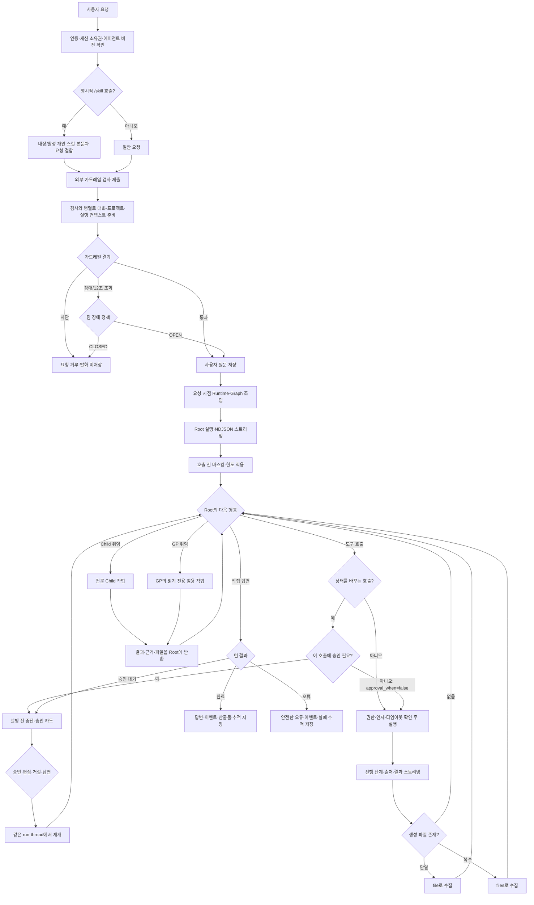

# Deep Agent 내부 동작 흐름

> 현재 코드의 최종 동작만 설명한다. 과거 구현 내역은 다루지 않으며, 프롬프트는 원문 대신 실제 의미를 한국어로 요약한다.

## 1. 전체 흐름



별도 의도 분류기는 없다. Root가 직접 답변·도구·위임 중 하나를 고르고 코드는 권한, 승인, 깊이와 호출 한도를 검사한다.

### Child 또는 GP에 위임한 뒤

1. Root가 task에 목표, 배경, 제약, 원하는 결과 형식을 적는다.
2. 전문 Child가 있으면 Child를, 범용 조사라면 GP를 실행한다.
3. Child/GP는 자기 모델과 허용된 도구로 작업하고 과정은 스트림에 표시된다.
4. 결과, 근거, 오류, 생성 파일 정보를 Root에 돌려준다.
5. Root가 결과를 검토해 최종 답변하거나 필요한 작업을 더 한다.
6. Child와 GP는 재위임할 수 없다. 구조는 Root → Child/GP 한 단계다.

발표에서는 “Root가 전체 작업을 지휘하고 전문 부분만 위임한다. Child/GP의 결과를 Root가 다시 받아 검토하고 최종 답변한다”고 설명하면 된다.

## 2. 요청 접수와 문서 동기화

### 2.1 요청 처리 순서

1. Bearer 인증과 세션 접근권을 확인한다.
2. /<skill-name> 요청이면 내장·활성 개인 스킬을 찾는다. 유효하면 스킬 지침과 요청을 합치며, 없으면 일반 채팅으로 처리한다.
3. 외부 가드레일을 전용 thread pool에 제출한다.
4. 그동안 최근 대화, 계정·팀·프로젝트, 에이전트 버전, 도구 override를 준비한다.
5. API가 준비하는 최근 대화는 사용자·에이전트 텍스트 최대 20개다. 이전 도구 호출과 추론 원문은 재전송하지 않는다.
6. RuntimeContext에 계정, 팀, 역할, 세션, 프로젝트, 새 run_id를 담는다.
7. 가드레일 통과 후에만 사용자 원문을 DB에 저장한다.
8. Runtime Graph를 만들고 스트림을 연다.

### 2.2 기본 챗의 live version과 별도 에이전트의 고정 버전

- **기본 챗**은 매 요청마다 현재 활성 기본 에이전트 버전을 찾는다. 관리자가 기본 구성을 갱신하면 기존 기본 채팅방도 다음 요청부터 새 활성 버전을 쓴다.
- **사용자가 선택한 별도 에이전트**는 세션 생성 때 연결된 agent_version_id를 계속 쓴다. 새 버전이 게시돼도 기존 세션의 성격과 재현성이 갑자기 바뀌지 않는다.

“고정”은 소스 파일을 메모리에 영원히 들고 있다는 뜻이 아니라 세션이 참조하는 버전 ID가 유지된다는 뜻이다.

### 2.3 daemon thread와 수정 문서 반영

세션을 만들면 Drive 동기화를 daemon thread로 시작한다. 채팅 요청과 별도로 돌며 서버 종료를 붙잡지 않는 일회성 백그라운드 스레드다.

세션 생성 응답은 동기화를 기다리지 않는다. 따라서 직후 질문은 이전 색인을 검색할 수 있다.

- 백그라운드 동기화가 변경 파일 다운로드와 **색인까지 성공**하면 현재 세션의 다음 document_search부터 수정본을 쓸 수 있다. 새 세션은 필요 없다.
- 현재 세션에서 document_sync를 호출하면 동기화·색인 완료를 기다린다. 성공 후 같은 세션의 이후 호출과 다음 턴에서 수정본을 검색한다.
- 이미 시작된 검색은 이전 색인을 볼 수 있고, 색인 실패 시 다음 성공 전까지 수정본이 반영되지 않는다.

즉, 반영 기준은 새 세션 여부가 아니라 **동기화와 색인의 성공 시점**이다.

## 3. 외부 입력 가드레일

### 3.1 CONNECTED 공급자

공급자는 팀이 선택한 외부 안전 검사 서비스다. CONNECTED는 주소·키·정책 저장과 연결 확인을 마친 상태다. 한 팀은 연결된 공급자 하나만 사용한다.

| 공급자 | 실제 판정 항목 |
|---|---|
| OpenAI Guardrails | 팀 input pipeline의 Moderation, Jailbreak, PII, NSFW, Off Topic, 금지어 등에서 tripwire 발생 여부. pre_flight와 input만 실행한다. |
| Azure AI Content Safety | Hate, SelfHarm, Sexual, Violence 심각도와 선택적 blocklist. 기본 임계값 4, FourSeverityLevels의 0·2·4·6 눈금, 입력 최대 10,000자다. |
| AWS Bedrock Guardrails | AWS 콘솔에서 팀이 설정한 금지 주제, 콘텐츠·단어·민감정보 필터 등이 GUARDRAIL_INTERVENED를 냈는지 본다. 구체적인 강도는 팀 AWS 설정에 있다. |

원문 조각은 판정 상세에 저장하지 않고 걸린 guardrail/category/policy 종류만 남긴다.

### 3.2 12초와 thread 수

공급자 클라이언트 timeout은 10초다. API는 정리와 future 전달 여유를 더해 최대 12초 기다린다. 외부 장애가 채팅을 무기한 붙잡지 않게 하는 상한이다.

가드레일 pool은 프로세스당 4개다. 검사 네 개까지 동시에 실행하며 나머지는 기다린다. MCP timeout과 스킬 평가는 별도 pool이다.

### 3.3 장애 정책과 기록 실패

가드레일 호출에는 세 가지 결과가 있다.

- 통과: 안전 검사 완료 → Agent 실행 → 답변 제공
- 차단: 위험하다고 판정 → Agent를 실행하지 않음 → 답변 막음
- 실패: 안전한지 판단하지 못함 → 팀 설정에 따라 결정
    - OPEN: Agent 실행, 답변 제공
    - CLOSED: Agent 실행 안 함, 답변 막음

여기서 실패는 유해하다고 판정했다는 뜻이 아니다. 공급자 연결 오류, 잘못된 자격증명, 공급자 서버 오류, 12초 timeout 등으로 **검사를 끝내지 못해 안전 여부를 모르는 상태**다.


### 3.4 통과한 질문이 Runtime에 들어가는 방식

질문 내용으로 Runtime 설정을 만드는 것은 아니다. 계정·팀·프로젝트·에이전트 버전은 검사와 병렬로 준비하고 Graph 실행은 통과 뒤 시작한다.

통과 후 데이터 흐름은 다음과 같다.

1. 일반 채팅이면 같은 원문을 graph의 새 HumanMessage 입력으로 전달한다.
2. 명시적인 /skill-name 호출이면 원문 전체를 그대로 넣는 대신, 조회한 스킬 절차와 /skill-name 뒤의 사용자 요청을 결합한 model_input을 전달한다.
3. Root나 Child가 모델을 호출하기 직전에 SensitiveInputMaskMiddleware와 PIIMiddleware가 현재 입력과 checkpoint에서 다시 읽은 과거 HumanMessage를 검사하고 민감정보를 가린다.
4. 따라서 DB에는 사용자가 자기 발화를 그대로 볼 수 있도록 원문이 남지만, LLM provider에는 미들웨어가 처리한 메시지가 전달된다.

정리하면 **가드레일은 원문 입력을 먼저 허용할지 결정하고, 통과한 입력은 graph에 들어가되 LLM 호출 직전에 다시 마스킹된다.** Runtime 조립과 사용자 질문 입력은 서로 다른 단계다.

## 4. 요청마다 Runtime을 조립하는 순서

Runtime 조립은 Deep Agents의 기본 생성 함수를 그대로 부르는 과정이 아니다. 우리 DB 구조, 도구 정책, 메모리와 스킬 저장소, HITL 규칙을 먼저 계산한 뒤 create_deep_agent에 넣을 값으로 바꾸는 과정이다.

```text
Chat API
  → build_default_executor()       실행 부품 준비
  → AgentExecutor.run()            세션의 에이전트 버전 조회
  → AgentRuntimeFactory.build()    Root·Child·GP Graph 생성
  → StreamAdapter.stream()         질문을 넣고 실행
```

### 4.1 우리 코드가 준비하는 부품

| 부품 | 실제 구현 | 프로젝트에서 정한 값 |
|---|---|---|
| 모델 | ModelConfigResolver, ModelFactory | 기본 gpt-5.6-luna, reasoning effort low. 에이전트 버전에 값이 있으면 그 값이 우선 |
| 모델 선택 순서 | ModelConfigResolver | 팀 커스텀 endpoint → claude 계열 Anthropic → 그 밖의 OpenAI |
| 반복 한도 | RuntimeCapabilityPolicy | Root·Child 기본 10, 최대 50. GP는 50 |
| 도구 한도 | RuntimeCapabilityPolicy | 역할별 실행당 100회 |
| 동시 실행 | RuntimeCapabilityPolicy | 한 super-step에 4개 |
| 도구 | ToolLoader | 에이전트 버전의 내장·MCP 도구 + 상시 도구 2개 |
| 프롬프트 | RuntimePromptAssembler | 프로젝트 공통 지침 + 에이전트 버전의 system_prompt |
| 장기 저장 | MemoryProvider, SkillsProvider | PostgreSQL Store 한 개를 메모리와 스킬이 공유 |
| 세션 저장 | CheckpointerProvider | PostgreSQL PostgresSaver |

### 4.2 조립할 때 우리 코드가 하는 일

| 순서 | 프로젝트 코드가 추가한 처리 |
|---:|---|
| 1 | 세션의 agent_version_id로 Root 모델·지침·도구와 Child 연결을 DB에서 읽는다. |
| 2 | 채팅에서 도구를 바꿨다면 이번 Root의 도구만 메모리에서 교체한다. DB 원본과 Child는 바꾸지 않는다. |
| 3 | 자기 위임, Child의 재위임, 순환 참조, 중복 alias를 실행 전에 차단한다. |
| 4 | ToolLoader가 도구 이름을 실행 객체로 바꾸고 서버 컨텍스트·권한 검사·멱등 실행을 감싼다. |
| 5 | 실제 도구 목록의 side_effect와 approval_when으로 HITL 대상을 자동 계산한다. |
| 6 | Child를 각자의 모델·도구·프롬프트로 먼저 컴파일하되 allow_subagents=false로 고정한다. |
| 7 | GP에는 Root 모델, 읽기 전용 도구, 내장·활성 개인 스킬 경로만 넣는다. |
| 8 | Root에 메모리·스킬 backend, PostgreSQL Store, checkpointer와 프로젝트 미들웨어를 붙인다. |
| 9 | compat/deepagents_v075.py가 기본 미들웨어 일부를 우리 설정으로 교체한 뒤 Graph를 완성한다. |

### 4.3 Root Graph에 실제로 전달하는 값

| 인자 | 전달값 | 왜 이렇게 정했는가 |
|---|---|---|
| model | 에이전트 버전의 모델 객체. 기본 챗 생성값은 gpt-5.6-luna/low | 환경변수마다 모델이 달라지는 일을 막고 Builder에서 고른 모델을 우선하기 위해서다. |
| system_prompt | 공통 실행 지침 + agent_versions.system_prompt | 공통 정책을 바꿀 때 모든 에이전트 버전을 다시 발행하지 않기 위해 실행 시 합친다. |
| tools | 선택된 내장·MCP 도구 + skill_register + skill_creator_ask_followup | 스킬 생성 흐름은 어떤 에이전트에서도 시작할 수 있어 두 도구는 항상 넣는다. |
| subagents | GP 한 개 + 미리 컴파일한 Child 목록 | GP는 항상 준비하고 전문 Child는 DB 연결에 따라 추가한다. |
| interrupt_on | side_effect=true인 현재 도구 이름과 승인 설정 | 쓰기 도구 목록을 따로 하드코딩하지 않아 새 MCP·쓰기 도구도 자동으로 승인 대상이 된다. |
| middleware | 호출 한도·PII·todo·커스텀 미들웨어와 Root 전용 메모리 보호 | Deep Agents에 없는 프로젝트 정책을 실행 경계에서 강제한다. |
| backend | CompositeBackend | 경로에 따라 세션 파일은 StateBackend, 메모리·스킬은 StoreBackend로 보낸다. |
| store | RAW_DATABASE_URL로 연 PostgresStore 싱글턴 | 메모리와 스킬을 다른 세션에서도 읽기 위한 장기 저장소다. 날짜나 단순 딕셔너리가 아니다. |
| memory | [/memories/users/preferences.md] | MemoryMiddleware가 매 모델 호출에 자동으로 넣을 장기 메모리 파일 목록이다. 저장소 객체가 아니다. |
| skills | [/skills/builtin/, /skills/personal/] | SkillsMiddleware가 이름·설명을 스캔할 실행 가능한 스킬 위치다. 비활성·팀 경로는 제외한다. |
| checkpointer | RAW_DATABASE_URL로 연 PostgresSaver 싱글턴 | session_id를 thread_id로 사용해 메시지·todo·중단 위치를 저장하고 HITL을 재개한다. 날짜값이 아니다. |
| fs_excluded_tools | {delete} | Deep Agents 가상 파일 도구 중 삭제만 숨긴다. 읽기·작성·수정은 메모리와 작업 파일에 필요하지만 삭제는 되돌리기 어렵고 팀 스킬 삭제의 역할 권한을 우회할 수 있어서다. |

#### memory 인자와 MemoryMiddleware의 차이

- memory는 읽을 파일 경로 목록이다.
- MemoryMiddleware는 그 경로를 backend에서 읽어 모델 프롬프트에 넣는 실행 부품이다.
- 우리 compat 코드는 MemoryMiddleware를 같은 이름의 커스텀 인스턴스로 교체한다.
- 교체 인자는 backend=공유 CompositeBackend, sources=[preferences.md], add_cache_control=true, system_prompt=프로젝트 메모리 저장 기준이다.

#### interrupt_on에 들어가는 값

내장 도구 중 현재 side_effect=true인 항목은 다음과 같다.

- 파일·문서: table_export, document_create, document_convert, pdf_edit, file_sanitize, archive_manage
- 업무·외부 변경: task_register, task_update, jira_create_issues
- 생성: diagram_create, chart_create, graph_create
- 스킬: skill_register, skill_creator_ask_followup
- 조건부: table_transform
- MCP: 연결된 MCP 도구 전부

table_transform은 output_format이 있을 때만 승인한다. skill_creator_ask_followup은 외부 상태를 바꾸지는 않지만 사용자 답을 받아야 계속할 수 있어 respond 카드로 멈춘다.

### 4.4 Graph 완성 후

StreamAdapter에 Graph, 가드레일을 통과한 질문, thread_id=session_id, max_concurrency=4와 추적 callback을 넣는다. 이때부터 모델 판단·도구 실행·위임이 시작된다.

## 5. Root, Child, GP

| 구분 | Root | 전문 Child | GP |
|---|---|---|---|
| 책임 | 전체 판단·최종 답변 | 맡겨진 전문 작업 | 범용 조사·분석 |
| 모델 | Root 버전 | Child 버전 | Root와 동일 |
| 도구 | Root 선택 도구 | Child 선택 도구 | Root의 읽기 전용 도구만 |
| 장기 메모리 | 있음 | 독립 배선 없음 | 없음 |
| 스킬 | 내장+활성 개인 | 독립 배선 없음 | SkillsProvider가 반환한 같은 경로 목록 |
| 독립 checkpointer | 있음 | 없음 | 없음 |
| 재위임 | 가능 | 불가 | 불가 |

Child에는 메모리·스킬·checkpointer를 따로 연결하지 않는다. 다만 Root Graph 안에서 실행되므로 Child 이벤트와 중단 상태는 Root의 스트림·checkpoint에 남는다.

### Child는 왜 Root의 스킬을 자동 상속하지 않는가

현재 Child Graph를 만드는 create_child_graph()에는 skills, backend, store 인자가 없다. factory.py의 Child 분기도 모델, 프롬프트, 도구, 미들웨어, HITL 설정만 넘긴다. 즉 실수로 빠진 설명이 아니라 현재 Runtime 배선 자체가 Root와 Child의 스킬 컨텍스트를 분리한다.

이 구조의 효과는 다음과 같다.

- Child는 자기 버전에 저장된 전문 지침과 도구에만 집중한다.
- 사용자 개인 스킬 전체가 모든 Child에 불필요하게 노출되지 않는다.
- Child Graph가 가벼워지고 위임 결과의 범위가 Root가 작성한 task 설명으로 제한된다.

반면 Root가 읽은 스킬 절차를 Child도 반드시 따라야 할 때는 누락 위험이 있다.

### 현재 위임 프롬프트가 스킬을 전달하는가

아니다. prompts.py의 TASK_DELEGATION_DESCRIPTION은 task 설명에 다음 다섯 가지만 넣도록 안내한다.

1. 목표
2. 배경과 확인된 사실
3. 허용 범위
4. 기대 출력
5. 출처 요구

스킬 이름, 선택한 SKILL.md 경로, 스킬 본문이나 핵심 절차를 전달하라는 규칙은 없다. 코드에서도 Root의 skills_metadata나 읽은 SKILL.md 내용을 task 인자에 자동 삽입하지 않는다.

따라서 현재 동작은 다음과 같다.

- Root가 task 설명에 스킬 절차를 자발적으로 요약하면 Child가 그 내용을 따른다.
- Root가 적지 않으면 Child는 Root가 어떤 스킬을 사용했는지 알 수 없다.
- 반드시 같은 스킬 절차를 지켜야 하는 작업이라면 Root가 직접 수행하거나 task 설명에 절차를 명시해야 한다.

즉, 현재 구현에는 **Root가 선택한 스킬을 Child에게 확실히 전달하는 보장 장치가 없다.**

GP의 동작은 다르다. factory.py는 SkillsProvider.sources()의 반환값을 GP와 Root의 skills 인자에 각각 넣는다. sources()의 실제 반환값은 내장 스킬 경로와 활성 개인 스킬 경로다. 팀 스킬 경로는 가져오기용 backend에는 있지만 실행 목록에는 없다.

실제 배선은 다음 두 줄로 확인할 수 있다.

```python
skill_sources = self.skills_provider.sources()
gp_spec = build_general_purpose_spec(..., skills=skill_sources or None)
create_root_graph(..., skills=skill_sources, ...)
```

다만 Root가 이번 요청에서 선택한 스킬 본문이 GP에 자동 전달되지는 않는다. GP는 위임받은 요청과 같은 스킬 목록을 보고 필요할 때 직접 SKILL.md를 읽는다.

## 6. ToolLoader와 도구 실행

### 6.1 ToolLoader와 middleware의 차이

ToolLoader는 Graph 생성 전에 DB의 도구 이름을 실제 실행 객체로 바꾼다. 선택된 내장 도구와 상시 도구를 합치고 필요한 경우에만 팀 MCP를 가져온다.

그 뒤 LangChain Tool로 변환해 Graph에 넣는다. ToolLoader는 도구를 준비하고 middleware는 실행 전후를 통제한다.

### 6.2 도구 군

| 목적 | 도구 |
|---|---|
| 검색 | document_search, document_list, document_sync, web_search |
| 문서 | document_create, table_export, document_read, document_convert, pdf_edit, file_inspect, file_sanitize, archive_manage |
| 데이터·계산 | table_transform, data_quality_check, file_compare, calculate, get_current_datetime |
| 업무·Jira | project_list, task_list, task_register, task_update, task_extraction, jira_get_issues, jira_create_issues |
| 팀 | people_list, workload_report, absence_list |
| 스킬 | skill_register, skill_creator_ask_followup |

write_todos는 대화 내부 실행 계획이고 task_register·task_update는 팀 DB의 실제 업무다.

### 6.3 쓰기 도구, 상태 변경, HITL, approval_when

Deep Agents는 우리 업무 도구가 조회인지 쓰기인지 모른다. 이 구분은 services/harness/registry.py의 Tool 정의에 우리가 side_effect 값을 넣어 만든 것이다.

| 구분 | 뜻 | 예 |
|---|---|---|
| side_effect=false | 실행해도 DB·파일·외부 서비스가 바뀌지 않음 | document_search, task_list, calculate |
| side_effect=true | 실행 결과가 남거나 외부 상태가 바뀔 수 있음 | task_register, Jira 생성, 파일 생성, 스킬 등록 |
| HITL | side_effect 호출을 핸들러 직전에 멈추는 장치 | 승인·편집·거절 카드를 표시 |

우리가 고친 핵심은 side_effect 값을 단순 설명으로만 쓰지 않고 세 군데에 함께 사용한 점이다.

1. 현재 계정 역할이 실행할 수 있는지 검사한다.
2. Root/Child의 interrupt_on 승인 목록을 자동 생성한다.
3. GP를 만들 때 side_effect=true 도구를 목록에서 제거한다.

따라서 새 쓰기 도구를 registry에 추가할 때 side_effect=true만 정확히 지정하면 권한 검사, HITL, GP 읽기 전용 정책이 함께 적용된다.

#### approval_when을 추가한 이유

table_transform은 하나의 도구가 두 가지 일을 한다.

| 호출 인자 | 실제 동작 | 승인 |
|---|---|---|
| output_format 없음 | 계산·필터 결과를 채팅에 미리보기로 반환 | 필요 없음 |
| output_format 있음 | CSV·XLSX 같은 새 파일을 저장 | 필요 |

Tool 전체를 side_effect=false로 두면 파일 생성도 승인 없이 실행된다. 반대로 항상 승인시키면 단순 통계 조회까지 카드가 뜬다. 그래서 Tool에는 side_effect=true를 두고 approval_when=lambda args: bool(args.get("output_format"))을 추가했다.

factory.py는 이 함수를 HumanInTheLoopMiddleware의 when 조건으로 바꾼다. 모델이 보낸 실제 인자에 output_format이 있을 때만 Graph가 멈춘다. 현재 approval_when을 쓰는 내장 도구는 table_transform 하나다.

### 6.4 실제 실행 순서

<details>
<summary>도구 실행, 중복 방지, 중간 이벤트 상세 보기</summary>


| 순서 | 실행 과정 | 우리 프로젝트가 건드린 부분 |
|---:|---|---|
| 1 | 모델이 도구 이름과 인자를 생성 | MCP의 콜론이 모델 함수명 규칙에 걸리지 않도록 mcp:ID를 mcp__ID로 바꾸고 기록 때 복원 |
| 2 | HITL 대상 확인 | registry의 side_effect와 approval_when으로 interrupt_on을 자동 생성 |
| 3 | 승인 필요 시 Graph 중단 | run_id, thread_id, 모든 action request와 Child 경로를 DB에 저장 |
| 4 | 승인 후 Tool 진입 | 모델 인자를 믿지 않고 account·team·project·session·run ID를 서버가 주입 |
| 5 | 실행 권한 확인 | leader/member 역할과 side_effect 정책을 Tool 핸들러 바로 앞에서 검사 |
| 6 | 중복 실행 방지 | (run_id, tool_call_id)를 원자적으로 claim하고 성공 결과를 JSON으로 보관 |
| 7 | 동시 실행 보호 | task_register·task_update·jira_create_issues는 project_id 단위 PostgreSQL advisory lock 적용 |
| 8 | 외부 MCP 보호 | 기본 480초 timeout과 실행 중·timeout 기록 적용 |
| 9 | 핸들러 실행 | account_id 같은 서버 컨텍스트를 넣고 제너레이터의 stage·sources를 스트리밍 |
| 10 | 결과 처리 | 성공 결과 저장, MCP 실행 표시 제거, 예상 밖 오류 원문은 숨기고 추적 코드만 반환 |

같은 호출이 이미 성공했다면 핸들러를 다시 부르지 않고 저장 결과를 재생한다. 실행 중이면 기다리고 죽은 실행의 점유는 180초 뒤 회수한다. 승인 재개와 네트워크 재시도에서 Jira 이슈·파일이 두 번 생기는 것을 막기 위한 코드다.

### 6.5 제너레이터 Tool과 이벤트

일부 도구는 처리 중간에도 값을 보낸다. stage는 현재 작업 단계, sources는 사용한 문서·웹 근거다. 긴 작업의 진행 상황과 근거를 먼저 보여 주기 위한 이벤트다.

별도 middleware hook은 쓰지 않는다. 도구 어댑터가 제너레이터를 순회해 LangGraph stream writer에 custom 이벤트를 쓰고 EventMapper가 화면용 이벤트로 바꾼다.

예상 밖 예외에는 문서 내용이나 토큰이 섞일 수 있다. 화면에는 일반 문구와 추적 코드만 표시하고 traceback은 서버 로그에 남긴다. 검토된 입력·권한 오류는 구체적으로 보여 준다.

한 super-step의 동시 도구 호출은 최대 4개이며 초과분은 대기한다. 4는 최적값이 아니라 무제한 병렬 실행을 막는 보수적 초기 상한이다. 한 단계 위임에서 Root 4개와 각 Child 내부 4개가 겹치면 이론상 최대 16개가 움직일 수 있어 먼저 유한하게 제한했다.

</details>

## 7. 미들웨어와 실행 한도

미들웨어의 시점은 다음 네 가지로 구분한다.

| 시점 | 의미 |
|---|---|
| before_agent | 사용자 요청 한 번의 Graph 실행이 시작되기 전 |
| before_model / after_model | LLM 호출 직전 / 직후 |
| wrap_model_call | 실제 LLM 호출을 감싸 횟수나 오류를 통제 |
| wrap_tool_call | 실제 Tool 핸들러 실행을 감싸 검사·timeout·lock 적용 |

<details>
<summary>미들웨어별 실제 파라미터와 동작 자세히 보기</summary>

### 7.1 LangChain 표준 미들웨어에 우리가 넣은 값

| 미들웨어 | 훅·대상 | 실제 값 | 선택 이유 |
|---|---|---|---|
| ModelCallLimitMiddleware | before/after model, Root·Child·GP | Root/Child는 min(max_iterations, 50), 기본 10. GP 50. 초과 시 error | 호출 전 한도 확인, 호출 후 누적. 반복 계획과 재시도의 무한 루프 차단 |
| ToolCallLimitMiddleware | before/after model, 전 역할 | 모델이 만든 Tool call을 누적해 실행당 100회, 초과 시 error | 모델 호출 한 번이 여러 Tool을 만들 수 있어 별도 상한 필요 |
| PIIMiddleware | before_model·after_model·Tool 결과, Root·Child | credit_card, ip, mac_address를 각각 redact. apply_to_output=true, apply_to_tool_results=true | 입력, 도구 결과, 모델 출력 세 경로를 모두 가림. email·URL은 업무 오탐 때문에 제외 |
| TodoListMiddleware | 모델 프롬프트·write_todos Tool, Root·Child | LangChain 기본 시스템 지침 사용. Tool 설명에 write_todos와 task_register/update 차이만 추가 | 개인 실행 계획이 팀 DB 업무로 오인되는 것을 방지 |

### 7.2 우리가 직접 만든 미들웨어

#### SensitiveInputMaskMiddleware

| 항목 | 값 |
|---|---|
| 시점 | before_model |
| 대상 | Root·Child의 모든 HumanMessage |
| 처리 | 걸린 문자열만 [가려짐]으로 교체하고 같은 message id로 원래 자리를 갱신 |

credential은 로그인·API 접근에 쓰는 비밀값이다. 현재 다음 형태를 가린다.

- OpenAI·Anthropic형 키: sk-로 시작하고 뒤가 20자 이상
- AWS Access Key: AKIA + 대문자·숫자 16자
- Google API Key: AIza + 35자
- api_key, secret, token, password, passwd, pwd 뒤에 붙은 값
- aws_secret, db_password, secret_key, private_key 항목
- 주민등록번호, 16자리 카드번호, 국내 휴대전화번호
- 관리자 권한·root access·superuser 같은 권한/보안 표현

LangChain PIIMiddleware가 처리하지 않는 API 키와 권한 표현을 보완하고, checkpoint에서 다시 올라온 과거 HumanMessage까지 매번 검사하려고 만들었다.

#### Tool 실행용 커스텀 미들웨어

| 미들웨어 | 시점·대상 | 실제 값 | 프로젝트에서 필요한 이유 |
|---|---|---|---|
| McpToolCallTimeoutMiddleware | wrap_tool_call, Root·Child의 MCP | 기본 480초, 도구별 override 가능, 최대 540초, 공유 pool 32개 | 임의 MCP가 Gunicorn 600초를 넘겨 연결을 끊는 일을 방지. timeout은 스레드를 죽이지 못하므로 “실행 여부 불명, 자동 재시도 금지” 결과 반환 |
| BuiltinWriteLockMiddleware | wrap_tool_call, Root·Child | task_register, task_update, jira_create_issues만 project_id 단위 잠금 | 같은 프로젝트의 읽기-수정-쓰기가 겹쳐 중복 업무가 생기는 것을 방지 |
| MemoryWriteGuardMiddleware | wrap_tool_call, Root | preferences.md에 대한 write_file·edit_file만 검사 | credential·개인정보·권한 서술이 장기 저장되는 것을 코드로 거부 |
| MemoryWriteLockMiddleware | wrap_tool_call, Root | write_file·edit_file·delete, 키=(team, agent, account, file path) | 같은 메모리 파일의 동시 수정이 서로 덮어쓰는 것을 방지 |
| SkillCatalogRefreshMiddleware | before_agent, Root | account별 catalog revision 비교 | 백그라운드 스킬 검증이 끝난 뒤 같은 세션의 낡은 skills_metadata를 다음 턴에 갱신 |

### 7.3 Deep Agents 자동 미들웨어와 우리가 바꾼 값

| 미들웨어 | 시점 | 쉬운 설명 | 우리 프로젝트의 실제 값 |
|---|---|---|---|
| SkillsMiddleware | before_agent | 실행 가능한 스킬의 이름·설명을 실행 시작 때 읽음 | sources=[/skills/builtin/, /skills/personal/], backend=공유 backend, system_prompt=기본 지침+프로젝트 선택 규칙으로 교체 |
| FilesystemMiddleware | Tool 제공·실행 | 가상 파일 도구를 backend에 연결 | ls, read_file, write_file, edit_file, glob, grep, execute 허용. delete 제외. Root는 공유 backend, Child는 StateBackend. permissions=[] |
| SubAgentMiddleware | task Tool 실행 | task 호출을 GP·Child Graph 실행으로 변환 | task 설명을 프로젝트 위임 기준으로 교체. Root subagents=[GP, Child...], Child subagents=[] |
| SummarizationMiddleware | before_model | 모델 호출 전에 입력 길이를 보고 필요하면 예전 대화 요약 | 최대 입력을 알면 85%에서 요약·최근 10% 보존. 모르면 170,000 token·최근 6개 보존. 프로젝트 override 없음 |
| PatchToolCallsMiddleware | before_agent | Tool 호출은 있는데 결과가 없는 메시지에 취소 결과 추가 | 별도 인자 없음. HITL·요약 뒤 다음 모델 API의 메시지 형식 오류 방지 |
| AnthropicPromptCachingMiddleware | 모델 호출 전 | Anthropic 프롬프트에 캐시 경계 추가 | unsupported_model_behavior=ignore. OpenAI 계열은 건너뜀. 프로젝트 override 없음 |
| MemoryMiddleware | before_agent | preferences.md를 읽어 Root 시스템 프롬프트에 삽입 | backend=공유 backend, sources=[preferences.md], add_cache_control=true, system_prompt=프로젝트 저장·충돌·인젝션 방어 규칙으로 교체 |
| HumanInTheLoopMiddleware | after_model | 모델 응답의 Tool call을 보고 승인 대상이면 Graph 중단 | approve·edit·reject·respond 허용. table_transform은 output_format 조건. Checkpointer가 있을 때만 설치 |
| Tool exclusion | 모델에 Tool을 주기 전 | 제외된 가상 Tool을 목록에서 제거 | excluded_tools={delete}. Filesystem 허용목록에서도 다시 제거 |

#### SummarizationMiddleware의 실제 과정

1. 모델 호출 전에 현재 메시지 token을 계산한다.
2. 85% 또는 170,000 token 기준을 넘으면 오래된 메시지를 고른다.
3. 밀려나는 원문을 /conversation_history/{thread_id}.md에 먼저 보관한다.
4. 모델 입력에서는 오래된 부분을 요약문 하나로 바꾼다.
5. 최근 10% 또는 최근 6개 메시지는 원문으로 유지한다.

conversation_history 파일은 장기 Postgres Store가 아니라 세션의 StateBackend에 들어간다. Root의 Postgres checkpointer가 이 상태를 저장하므로 같은 세션에서는 다시 읽을 수 있지만 다른 세션의 장기 메모리는 아니다.

#### MemoryMiddleware의 실제 과정

1. Graph 시작 시 /memories/users/preferences.md를 공유 backend에서 읽는다.
2. namespace는 (team_id, agent_id, account_id)라 다른 팀·에이전트·사용자와 섞이지 않는다.
3. 읽은 내용을 agent_memory 블록으로 Root 시스템 프롬프트에 넣는다.
4. 모델이 지속 선호라고 판단하면 edit_file로 같은 파일을 수정한다.
5. 저장 직전에 MemoryWriteGuard와 MemoryWriteLock이 실행된다.

PostgreSQL에는 LangGraph Store 테이블로 저장한다. MemoryMiddleware가 DB에 직접 SQL을 쓰는 것이 아니라 StoreBackend가 PostgresStore를 사용한다.

### 7.4 한도 요약

| 대상 | 값 |
|---|---:|
| Root·Child 모델 호출 | 기본 10, 최대 50 |
| GP 모델 호출 | 50 |
| Tool 호출 | 100 |
| 동시 Tool | super-step당 4 |
| MCP timeout | 기본 480초, 최대 540초 |
| MCP timeout pool | 프로세스당 32 threads |
| 부수효과 claim lease | 180초 |
| 위임 깊이 | Root → Child/GP 한 단계 |

</details>

## 8. 단기 상태와 장기 메모리

“최근 대화”, “단기 상태”, “장기 메모리”는 서로 다르다.

| 종류 | 저장소·키 | 언제 읽는가 | 무엇을 담는가 |
|---|---|---|---|
| 채팅 메시지 | 채팅 DB, session | 화면 복원과 API 보조 이력 준비 시 | 사용자 원문, 에이전트 답변, 턴 이벤트 |
| 단기 상태 | Postgres checkpointer, thread_id=session_id | 같은 세션의 매 graph 실행·HITL 재개 시 | 메시지 상태, todo, 중단 위치, Tool call 관계, 요약 상태 |
| 장기 메모리 | Postgres Store, (team_id, agent_id, account_id) | Root가 모델을 호출할 때와 메모리 파일을 명시적으로 읽을 때 | 다른 세션에서도 유용한 사용자 선호·습관·지속 사실 |

### 8.1 단기 상태는 언제 읽는가

정상 채팅에서는 현재 발화만 graph 입력에 추가한다. graph가 시작될 때 checkpointer가 같은 thread_id의 기존 상태를 읽어 이전 대화 상태와 이어 붙인다. 그래서 같은 세션의 todo, 요약, Tool call 관계가 다음 턴에도 남는다.

HITL 재개도 같은 checkpointer를 읽어 정확히 중단된 노드와 Tool call로 돌아간다. thread_id가 없는 스크립트·테스트 경로만 API가 준비한 최근 대화를 직접 함께 넣는다.

### 8.2 장기 메모리는 언제 읽는가

Root의 MemoryMiddleware가 모델 호출 컨텍스트에 사용자 메모리를 제공한다. 모델은 현재 질문에 장기 선호가 관련 있을 때 이를 참고한다. 더 자세한 내용이 필요하면 Root가 /memories/users/preferences.md를 파일 도구로 읽을 수 있다.

메모리는 명령보다 우선하지 않는다. 현재 사용자 요청이나 최신 Tool 결과가 메모리와 충돌하면 현재 정보가 우선이다. Child와 GP에는 장기 메모리를 주지 않는다.

### 8.3 언제 저장하는가

Root는 다음 대화에서도 반복해서 도움이 될 안정적인 정보일 때만 메모리 저장을 선택한다.

- 저장: 선호하는 보고 형식, 반복 업무 방식, 지속적인 의사소통 선호, 장기간 유효한 사용자 사실
- 저장하지 않음: 현재 프로젝트에서만 쓰는 수치, 일회성 지시, 아직 확인되지 않은 추측, 순간적인 상태, 문서 원문 복사
- 저장 거부: 비밀번호·API 키·토큰, 개인정보, 접근 권한이나 인증 관련 민감 서술

저장할 때는 원문을 그대로 복사하지 않고 다른 대화에서도 의미가 통하도록 짧은 사실로 정규화한다. write guard가 민감정보를 검사하고 write lock이 같은 메모리의 동시 덮어쓰기를 막는다.

## 9. 스킬 선택과 등록

### 9.1 스킬의 범위

| 종류 | 경로 | 실행 가능 여부 |
|---|---|---|
| 내장 | /skills/builtin/{name}/SKILL.md | 가능 |
| 활성 개인 | /skills/personal/{name}/SKILL.md | 가능 |
| 비활성 개인 | /inactive-skills/personal/{name}/SKILL.md | 불가 |
| 팀 공유 | /skills/team/{name}/SKILL.md | 카탈로그·가져오기용, 직접 실행 불가 |

Root와 GP는 현재 요청의 주 결과가 스킬 설명과 분명히 맞을 때 스킬을 선택한다. 선택 후 설명만 보고 추측하지 않고 SKILL.md를 읽은 뒤 절차를 따른다. 팀 스킬은 조직 표준 원본이고, 팀원이 사용할 때 개인 사본으로 가져와 활성화한다. 원본의 이후 변경을 개인 사본에 자동 덮어쓰지 않아 개인 수정과 실행 재현성을 보호한다.

명시적 /skill-name 호출은 graph 시작 전에 스킬 본문과 요청을 결합하고 skill_applied 이벤트를 먼저 보낸다.

### 9.2 정보가 부족할 때 묻는 과정

내장 skill-creator는 이름, 언제 사용해야 하는지, 입력, 처리 절차, 결과 형식, 필요한 도구와 예외 조건을 점검한다. 가까운 다른 작업과 구별할 수 있는지도 최소 한 번 확인한다.

- 한 번에 질문 하나만 한다.
- 사용자가 이미 준 내용은 다시 묻지 않는다.
- 선택지가 도움이 될 때만 두세 개의 가까운 예를 함께 제시한다.
- 답을 받은 뒤 남은 모호함을 다시 판단한다.
- 전체 과정에서 최대 세 번만 질문한다.
- 정보가 충분하면 더 묻지 않고 초안을 보여 준 뒤 skill_register를 호출한다. 별도의 “등록할까요?” 문장으로 중복 승인받지 않는다. 실제 승인은 HITL 카드가 담당한다.

skill_creator_ask_followup은 상태를 변경하지 않지만 답을 받아야 다음 단계로 갈 수 있어 HITL의 respond 결정을 이용한다.

### 9.3 등록·검증·테스트

<details>
<summary>스킬 검증 단계와 합격 기준 보기</summary>

skill_register 승인으로 바로 SKILL.md를 게시하지 않는다. 개인 스킬 검증 job을 만들고 다음 단계를 통과한 뒤에만 활성 카탈로그에 발행한다.

1. **WAITING**: 후보 문서, 작업 종류, 후보 hash, 기존 버전 hash, 카탈로그·Runtime·Tool registry 버전을 고정한다. 같은 계정·이름의 열린 job은 중복 생성하지 않는다.
2. **CHECKING**: 이름·설명·본문 형식, 예약 규칙, 생성 시 이름 충돌, 수정 시 기존 hash 일치를 코드로 검사한다.
3. **PREPARING_TESTS**: 평가 모델이 긍정 8개·부정 8개 후보를 만든다. 이름 노출, 중복·유사 중복, polarity, fixture·도구·행동 기준의 구조를 검사하고 실패한 묶음을 제한적으로 재생성한다. 별도 의미 검토 모델이 실제 적용 상황인지, 부정 사례가 충분히 헷갈리는 근접 사례인지 검토한다. 플랫폼 고정 probe와 회귀 사례를 섞어 최종 긍정 6개·부정 6개, 총 12개 suite를 만든다.
4. **TESTING—라우팅**: 후보와 기존 개인 스킬들을 격리된 임시 Store에 넣고 실제와 같은 미니 에이전트가 각 12개 요청을 세 번씩 실행한다. 한 질문에서 3회 중 2회 이상 같은 결과가 나와야 그 질문의 선택 여부를 확정한다.
5. **TESTING—행동**: 긍정 사례 중 직접 요청 1개, 문서 문맥 요청 1개, 필요한 Tool이 가장 많은 요청 1개를 대표 표본으로 골라 최종 답과 Tool 사용을 검증한다. 실제 외부 상태를 바꾸지 않도록 stub 도구와 HITL 재생을 쓴다. 의미 판정이 UNCERTAIN이면 한 번 더 검토해 합친다.
6. **점수 판정**: 긍정 recall 0.80 이상, 전체 precision 0.80 이상이어야 한다. 긍정·부정·행동 실행의 유효 비율도 각각 80% 이상이어야 하며, 행동의 결정적 Tool 조건과 의미 assertion을 통과해야 한다.
7. **PUBLISHING**: 후보 hash, 수정 대상의 base hash, 평가 때의 Runtime·Tool registry 버전을 다시 확인한다. 모두 같을 때만 개인 SKILL.md를 저장하고 카탈로그 revision을 올린다.

### 9.4 별도 worker를 둔 이유

질문 생성, 의미 검토, 12개×3회 라우팅, 대표 행동 테스트는 여러 모델 호출을 사용해 수분이 걸릴 수 있다. 이를 채팅 HTTP 요청 안에서 실행하면 브라우저 연결, 웹 worker timeout, 사용자의 승인 응답과 긴 검증 작업이 하나의 생명주기에 묶인다.

별도 worker는 DB job을 lease로 점유하고 heartbeat를 갱신한다. 웹 요청이 끝나거나 worker가 재시작돼도 상태를 이어갈 수 있고, 같은 계정 job의 충돌을 피하면서 다른 계정 job은 제한적으로 병렬 처리한다. 실패 원인과 재시도 가능 여부도 job에 남는다. 검증 worker는 파일 저장 정리 outbox도 처리해 HTTP 요청에서 실패한 storage 삭제를 나중에 복구한다.

</details>

## 10. HITL 승인과 재개

### 10.1 왜 이 방식을 선택했는가

프롬프트로 “실행해도 될까요?”라고 묻는 방식은 모델이 질문을 빼먹거나, 사용자의 “네”가 어느 병렬 호출을 가리키는지 모호할 수 있다. 현재 구조는 실제 Tool 핸들러 바로 앞에서 graph를 중단하고 호출 이름·인자를 카드로 보여 준다. 사용자의 결정이 구조화된 데이터로 같은 Tool call에 적용되므로 승인 전 실행과 중복 실행을 함께 막을 수 있다.

### 10.2 승인 대기

실행 가능한 side_effect=true 도구를 interrupt_on에 넣는다. MCP는 현재 모두 side-effect로 취급해 승인 대상이며 동시 실행과 timeout 경고를 설명에 붙인다. table_transform은 파일 생성일 때만 조건부 승인한다. 가상 파일 delete는 HITL만으로 팀 스킬 삭제 역할 권한을 보장할 수 없어 현재 도구 목록에서 숨긴다.

중단하면 다음을 하나의 awaiting_confirmation 이벤트와 agent 메시지에 저장한다.

- 원래 run_id, thread_id, interrupt_id
- 병렬 호출을 포함한 모든 action_requests
- Root/Child 중 어디서 멈췄는지와 하위 graph 경로
- EventMapper의 중복 제거·Tool 상태
- 추적과 Langfuse 재개 정보

이 상태가 이 요청의 정상적인 **턴 결과**가 된다. 턴 결과란 사용자 요청 한 번이 끝날 때의 상태로, 완료, 승인 대기, 오류 중 하나다.

### 10.3 사용자 결정

- approve: 제시된 인자로 실행한다.
- edit: 허용된 필드만 바꿔 실행한다.
- reject: 해당 호출을 실행하지 않고 거절 결과를 graph에 돌려준다.
- respond: 스킬 보완 질문처럼 Tool 실행이 아니라 사용자 답을 graph에 전달한다.

병렬 action은 index별 결정을 모두 보내야 하며 일부는 승인하고 일부는 거절할 수 있다. Jira 구조화 편집은 제목·설명·유형·기한만 바꾸고 프로젝트·담당자는 유지한다.

### 10.4 재개

1. API가 결정 개수, index 중복·누락, action 종류, 편집 schema를 스트림 전에 검사한다.
2. 거절된 Tool call은 추적 DB에 확정한다.
3. 원래 run, thread, 에이전트 버전, 도구 override로 Runtime을 다시 조립한다.
4. 저장한 EventMapper와 하위 graph 상태를 복원한다.
5. Command(resume={decisions: [...]})를 같은 checkpoint에 보낸다.
6. graph는 처음부터 재실행하거나 모델에게 다시 허락을 묻지 않고 중단된 호출부터 이어 간다.
7. 승인된 쓰기는 멱등 실행권을 거쳐 한 번만 수행된다. 거절 결과도 Root가 받아 대안을 설명하거나 최종 답변한다.

## 11. 스트리밍, 추적, 턴 종료

### 11.1 NDJSON 스트림

NDJSON(Newline-Delimited JSON)은 JSON 객체 하나를 한 줄에 보내는 형식이다.

```text
{"type":"agent_started",...}
{"type":"tool_started",...}
{"type":"tool_progress",...}
{"type":"sources",...}
{"type":"result",...}
```

하나의 큰 JSON이 완성될 때까지 기다리지 않으므로 브라우저는 답변 글자, 도구 진행, 출처, 승인 카드를 즉시 표시할 수 있다. HTTP 스트림을 연 뒤에는 상태 코드를 다시 바꾸기 어려워 이후 장애도 error 한 줄로 보낸다.

### 11.2 원시 stream을 화면 이벤트로 바꾸는 과정

<details>
<summary>화면 이벤트 변환과 추적 저장 상세 보기</summary>

DeepAgentStreamAdapter는 하위 graph까지 포함해 세 종류를 함께 읽는다.

- updates: 모델·Tool·Child 노드가 끝난 상태
- custom: 제너레이터 Tool의 stage, sources 등 진행 정보
- messages: 사용자에게 보여 줄 reasoning summary와 응답 delta

EventMapper는 이를 다음 화면 이벤트로 정규화한다.

| 사건 | 이벤트 |
|---|---|
| Root/Child 시작 | agent_started, subagent_started |
| 요약된 생각·응답 진행 | reasoning |
| Tool 수명주기 | tool_started, tool_progress, tool_completed |
| 검색 근거 | sources |
| Child 종료 | subagent_completed |
| 사람 결정 필요 | awaiting_confirmation |
| 정상 완료 | result |
| 실패 | error |

Child 내부 Tool도 버리지 않고 subagent_alias와 부모 run 정보를 붙인다. 명시 스킬 호출은 graph 이벤트 앞에 skill_applied를 추가한다.

### 11.3 추적과 저장

스트림 이벤트를 보내는 동시에 Root·Child agent_run, 실제 provider와 endpoint hash, 부모 run, 모델·Tool 호출 횟수, token 사용량, 검색 문서 ID, 응답 시간, 오류를 저장한다. Langfuse가 활성화돼 있으면 trace에 session, user, team, agent, 평가 메타데이터를 연결한다. 실패하더라도 이미 사용한 호출·token·Tool 이벤트는 남긴다.

턴 종료 처리는 다음과 같다.

- **완료**: 최종 답변, 완료 이벤트, 출처와 산출물을 agent 메시지에 저장하고 run을 완료 처리한다. 첫 답변이면 마스킹된 질문·답으로 제목을 한 번 만든다.
- **승인 대기**: 승인 정보를 agent 메시지에 저장하고 run을 대기 상태로 둔다.
- **오류**: 한도 초과는 요청을 나누라는 안내, 검토된 오류는 구체적 사유, 예상 밖 오류는 일반 문구와 추적 코드를 저장한다.
- **연결 단절**: 최종 이벤트가 없으면 agent 최종 답변은 저장하지 않는다. 스트림 전에 저장한 사용자 발화는 남는다.

승인 재개 뒤 성공 여부는 모델이 “완료했다”고 말했는지가 아니라 실제 tool_completed(status="OK") 이벤트를 기준으로 확정한다.

</details>

## 12. 실행 도중 생기는 파일 산출물

파일 산출물은 모든 채팅의 고정 단계가 아니다. document_create, table_export, document_convert, pdf_edit, 출력 형식을 지정한 table_transform, 압축·분할 계열처럼 **도구 실행 결과가 파일일 때만** 발생하는 선택적 결과다. 그래서 전체 흐름에서는 도구 실행 뒤의 분기로 배치한다.

입력 파일을 받는 도구는 file_id의 계정 접근권을 서버에서 확인한다. storage 원문이 있으면 사용하고, 연결 저장소 참조만 있으면 Drive에서 받아 실제 MIME과 내용을 처리기에 넘긴다.

생성 파일은 원본을 덮어쓰지 않고 새 GENERATED 문서로 만든다.

1. 안전한 제목, 한국 날짜, 확장자로 255자 이내 파일명을 만든다.
2. 개인 문서 row를 kept=false로 만들고 storage 저장 후 hash와 revision을 확정한다.
3. DB와 storage 중 한쪽만 성공하면 성공한 부분을 정리한다. storage 삭제 실패는 cleanup outbox로 worker가 재시도한다.
4. 복수 생성 도중 실패하면 이미 만든 부분 결과도 회수한다.
5. 도구 결과에 식별자, 파일명, MIME을 반환한다.

file은 도구 하나가 파일 **한 개**를 만들었을 때 쓰는 객체이고, files는 변환·분할·일괄 생성처럼 파일 **여러 개**를 만들었을 때 쓰는 배열이다. 둘을 합친다는 의미가 아니라 도구 결과의 두 가지 공통 계약이다.

EventMapper는 두 형식을 모두 읽어 중복을 제거하고 produced_files로 보낸다. Child가 만든 파일도 Root 결과에 유지한다. UI는 최종 답변 아래에 다운로드 카드를 표시하며 답변 문장이 없고 파일만 있어도 카드를 보여 준다. 사용자가 “내 파일에 저장”을 누르면 kept=true가 되어 일반 개인 파일 목록에 나타난다.

## 13. 차별점

### 13.1 프레임워크의 빈틈을 미들웨어 6개로 메웠다

Deep Agents는 파일·위임·요약·HITL 골격을 제공하고 LangChain은 호출 한도·PII 같은 범용 부품을 제공한다. 하지만 우리 DB와 MCP, 장기 메모리, 백그라운드 스킬 검증 구조는 알지 못한다. 이 빈틈을 좁은 미들웨어로 직접 구현했다.

| 직접 만든 미들웨어 | 프레임워크에 없던 문제 해결 |
|---|---|
| SensitiveInputMask | API 키·전화번호·권한 서술을 모든 과거 사용자 메시지에서 가림 |
| MCP Timeout | 임의 외부 MCP가 웹 worker보다 오래 실행되는 문제 통제 |
| Builtin Write Lock | 같은 프로젝트의 동시 업무 등록으로 중복 데이터가 생기는 문제 차단 |
| Memory Write Guard | 모델이 민감정보를 장기 메모리에 그대로 쓰는 문제 차단 |
| Memory Write Lock | 같은 메모리 파일의 동시 수정이 서로 덮어쓰는 문제 차단 |
| Skill Catalog Refresh | 백그라운드 등록 후 기존 세션의 스킬 목록이 낡는 문제 해결 |

와우 포인트는 프레임워크를 fork하지 않았다는 점이다. Deep Agents의 확장 지점과 “같은 이름이면 자동 미들웨어를 교체”하는 규칙을 이용해 업그레이드 경계를 compat/deepagents_v075.py 한 곳에 모았다.

### 13.2 GP의 승인 우회 경로를 구조적으로 없앴다

GP에 쓰기 도구를 주고 승인 화면만 숨긴 것이 아니다. Root 도구 중 side_effect=false인 것만 GP 명세에 넣는다. GP는 Jira 생성·파일 생성·MCP 도구가 있다는 사실 자체를 모른다.

쓰기 작업이 필요하면 GP는 조사 결과만 Root에 반환한다. 실제 변경은 Root가 실행하고 기존 HITL 카드로 승인받는다. GP 전용 checkpointer와 복잡한 승인 재개 경로를 추가하지 않고 우회 가능성을 제거했다.

### 13.3 장기 메모리에 저장 전용 안전장치를 추가했다

Deep Agents의 MemoryMiddleware는 파일을 읽고 쓰는 기능만 제공한다. 무엇을 저장하는지 검사하거나 동시 쓰기를 막지 않는다.

우리 프로젝트는 저장 직전에 두 번 검사한다.

1. Write Guard가 credential·개인정보·권한 서술이면 저장을 거부한다.
2. Write Lock이 같은 사용자 메모리 파일을 한 번에 하나씩만 수정하게 한다.

입력 마스킹과 장기 저장 방어를 분리했기 때문에 모델이 대화 중 민감정보를 다시 구성해도 영구 메모리 경계에서 다시 막을 수 있다.

### 13.4 스킬 등록을 CI/CD 형태의 검증·배포 과정으로 만들었다

SKILL.md를 저장하면 바로 실행되는 방식이 아니다.

| 검증 장치 | 코드로 보장하는 효과 |
|---|---|
| 긍정 6개·부정 6개를 각 3회 라우팅 | 질문별 2/3 다수결, recall·precision 0.80 미만 게시 차단 |
| 대표 행동 테스트 3개 | 최종 답변과 필수 Tool 사용을 함께 검사 |
| 모든 검증 Tool을 stub으로 교체 | 검증 중 Jira·메일·파일 같은 실제 부수효과 0건 |
| 후보·기존·Runtime·Tool registry hash 재확인 | 검증 후 내용이나 실행 환경이 바뀐 후보의 게시 차단 |
| 별도 worker와 lease | HTTP 연결이 끝나도 수분짜리 검증을 안전하게 계속 수행 |

일반 skill-creator가 “스킬을 잘 작성하는 도구”라면 이 구조는 “검증을 통과한 스킬만 실행 환경에 배포하는 게이트”다.

### 13.5 팀 스킬은 원본 공유와 실행 소유권을 분리했다

팀 스킬을 모든 에이전트에 자동 적용하지 않는다. 사용자가 팀 카탈로그에서 가져오면 검증된 개인 사본이 생기고 그 사본을 실행한다.

- 공유자가 원본을 비활성화·삭제해도 이미 가져온 사본은 유지된다.
- 가져온 사용자는 자기 사본을 독립적으로 활성화·비활성화할 수 있다.
- 가져온 사본의 재공유를 막아 순환 배포를 방지한다.
- 검증 영수증이 현재 Runtime·Tool 환경과 맞지 않으면 다시 검증한다.

팀 표준을 배포하면서도 다른 사람의 토글 하나가 내 에이전트 동작을 갑자기 바꾸지 않는다.

### 13.6 HITL 재개와 멱등 실행을 하나로 연결했다

병렬 Tool을 호출별로 승인·편집·거절하고 Root/Child 중단 위치를 PostgreSQL checkpoint에 저장한다. 재개할 때는 같은 run·thread·tool_call_id를 사용한다.

승인 재개나 네트워크 재시도가 겹쳐도 멱등 claim이 같은 Jira 이슈·파일을 다시 만들지 않는다. “사람이 승인한다”에서 끝나지 않고 승인 이후의 중복 실행까지 막은 구조다.

## 14. 주요 코드 위치

| 관심사 | 코드 |
|---|---|
| 채팅·가드레일 병렬화·HITL API·저장 | apps/chat/api_views.py |
| 실행기 조립·정의 로딩 | services/agent_runtime/bootstrap.py, loader.py |
| Graph·Tool 변환·HITL | services/agent_runtime/factory.py |
| 정책·미들웨어·프롬프트 | services/agent_runtime/runtime_policy.py, middleware/factory.py, prompts.py |
| Tool 로딩·컨텍스트 주입 | services/agent_runtime/tools/loader.py, tools/adapters.py |
| 내장 Tool·파일 산출물 | services/harness/registry.py, services/builtin_tools/ |
| 스트림·이벤트·추적 | services/agent_runtime/stream_adapter.py, events.py, tracing/ |
| Child 검증·컴파일 | services/agent_runtime/subagents/ |
| 메모리·스킬 | services/agent_runtime/memory/, skills/ |
| 스킬 검증 worker | apps/skills/management/commands/skill_validation_worker.py |
| 외부 가드레일 | services/guardrails/ |
| 산출물 보관·다운로드 | apps/personal_files/api_views.py, backend/db/document_pipeline.py |
| 화면 스트림·산출물 카드 | frontend/src/pages/ChatPage/liveChat.ts, cards/ChatCards.tsx |
