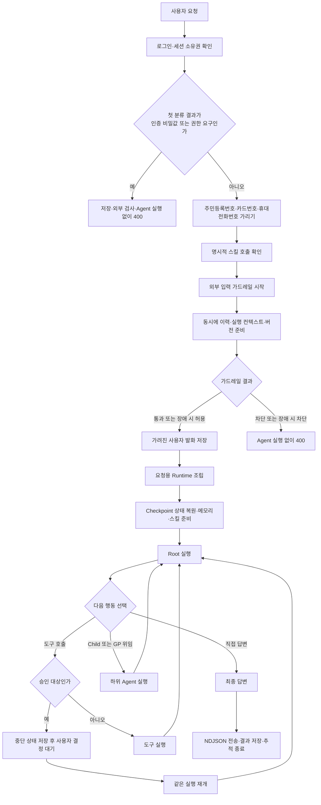

# 에이전트 내부 동작 설명

> 이 문서는 사용자 요청 한 건이 서버에 들어온 순간부터 답변이 저장될 때까지를 시간순으로 설명한다. 프레임워크의 일반 기능보다 현재 프로젝트가 실제로 연결한 값과 그 이유에 초점을 맞췄다.

## 0. 먼저 구분할 네 가지

비슷해 보이는 용어부터 나누면 뒤의 흐름이 훨씬 쉽다.

| 용어 | 뜻 | 현재 프로젝트에서의 역할 |
|---|---|---|
| Runtime | 이번 요청을 처리할 실행 그래프 | 모델, 도구, 하위 에이전트, 메모리, 스킬, 미들웨어를 요청마다 조립한다. |
| Checkpointer | 같은 대화의 실행 상태 저장소 | 이전 메시지, 작업 계획, 승인 대기 위치를 PostgreSQL에 저장한다. |
| Store | 세션을 넘어 쓰는 장기 저장소 | 개인 메모리와 스킬을 PostgreSQL에 저장한다. |
| Middleware | 실행 중 특정 시점에 정책을 적용하는 부품 | 모델 호출 횟수 제한, 입력 가림, 도구 승인, 쓰기 잠금 등을 담당한다. |

`.md` 경로가 보인다고 실제 서버 디스크나 S3에 Markdown 파일이 생기는 것은 아니다. 에이전트에는 파일처럼 보이지만 현재 메모리와 스킬의 실물은 PostgreSQL의 LangGraph Store에 들어간다.

## 1. 전체 흐름



Root는 한 번만 판단하고 끝나는 분류기가 아니다. 답변이 완성될 때까지 `모델 판단 → 도구 또는 위임 → 결과 반환 → 다시 판단`을 반복한다.

---

## 2. 요청 입구에서 먼저 하는 일

### 2.1 로그인과 세션 확인

서버는 Bearer 인증으로 사용자를 확인한 뒤 요청한 채팅 세션이 그 사용자 소유인지 조회한다. 여기서 얻은 계정과 팀 정보가 이후 모든 접근 범위의 기준이 된다.

사용자가 문장 안에 적은 계정 ID나 팀 ID는 신뢰하지 않는다. 서버가 인증 결과와 세션에서 읽은 값을 `RuntimeContext`에 넣는다.

| 값 | 출처 | 사용처 |
|---|---|---|
| `account_id` | 로그인 사용자 | 개인 메모리, 개인 스킬, 파일 접근 범위 |
| `team_id` | 채팅 세션 | 팀 MCP, 가드레일, 팀 데이터 범위 |
| `role` | 계정 프로필 | 상태 변경 도구 실행 권한 |
| `session_id` | URL의 세션 | LangGraph의 `thread_id` |
| `project_id` | 세션에서 선택한 프로젝트 | 업무 도구와 쓰기 잠금 범위 |
| `run_id` | 이번 실행에서 발급 | 추적, HITL 재개, 도구 중복 실행 방지 |

### 2.2 인증 비밀값과 권한·보안 요청 차단

세션 확인 직후 원문을 한 번 검사한다. 이 단계가 외부 가드레일보다 앞선다.

| 분류 | 현재 감지 형태 | 처리 |
|---|---|---|
| API 키 | `sk-` 계열, `AIza` 계열 | 요청 전체 거부 |
| AWS Access Key ID | `AKIA` 뒤 16자 | 요청 전체 거부 |
| 이름이 붙은 비밀값 | `api_key`, `secret`, `token`, `password`, `pwd` 등에 `:` 또는 `=`로 값을 붙인 형태 | 요청 전체 거부 |
| 주요 비밀 필드 | `aws_secret`, `db_password`, `secret_key`, `private_key` 뒤에 `:` 또는 `=`가 있는 형태 | 요청 전체 거부 |
| 권한·보안 정보 요구 | 관리자 권한·계정·비밀번호, 루트 계정, 내부 접속 정보, `root access`, `superuser` 등 | 요청 전체 거부 |

차단되면 다음 처리는 모두 생략한다.

```text
대화 DB 저장 안 함
외부 가드레일 호출 안 함
Runtime 조립 안 함
Graph와 Checkpoint에 넣지 않음
HTTP 400과 수정 안내만 반환
```

로그에도 매칭된 값은 쓰지 않는다. 어떤 종류를 감지했는지와 세션 ID만 남긴다. 아직 유효할 수 있는 키를 마스킹해서 계속 처리하지 않고 아예 끊은 이유는 외부 공급자, 대화 DB, Checkpoint 중 어느 곳에도 값이 닿지 않게 하려는 것이다.

> **듣는 사람이 묻기 쉬운 점 — 정규식이면 모든 비밀값을 잡나요?**
>
> 아니다. 등록된 문자열 형태만 찾는다. 띄어 쓴 키, 여러 메시지로 나눈 키, 인코딩한 값, 새 공급자 형식은 놓칠 수 있다. 그래서 모델 직전 마스킹과 장기 메모리 쓰기 가드도 별도로 둔다.

> **현재 코드의 주의점 — 한 문장에 개인정보와 권한 표현이 같이 있으면?**
>
> `match_category()`는 인증 비밀값 → 개인정보 → 권한 표현 순서로 첫 분류 하나만 반환한다. 인증 비밀값이 있으면 항상 차단되지만, 개인정보와 권한 표현만 함께 있으면 `pii`가 먼저 반환되어 권한 차단 분기를 건너뛴다. 개인정보는 가려지고 요청은 계속 진행되며 권한 표현은 모델 직전 미들웨어가 다시 가린다. 모든 권한 요청을 입구에서 막겠다는 정책과는 어긋나는 현재 구현상의 빈틈이다.

### 2.3 개인정보는 가리고 계속 진행

차단 대상이 아니면 서버가 저장용 문자열을 하나 만든다.

| 감지 대상 | 허용 형식 | 바뀌는 값 |
|---|---|---|
| 주민등록번호 | 하이픈이나 공백이 있거나 없는 13자리 형식 | `[가려짐]` |
| 카드번호 | 숫자 네 자리씩 네 묶음 | `[가려짐]` |
| 국내 휴대전화번호 | 010·011·016·017·018·019 형식 | `[가려짐]` |

이름과 업무용 이메일은 이 단계에서 유지한다. 담당자 조회나 Jira 처리에 필요한 값이기 때문이다. IP와 MAC 주소도 이 저장용 정규식에는 없고 모델 호출 경계의 PII 미들웨어가 담당한다.

가림이 끝난 문자열 하나를 아래 소비자가 함께 쓴다.

```text
가려진 입력
├─ 명시적 스킬 호출 해석
├─ 외부 입력 가드레일
├─ chat_message 저장
├─ 일반 요청의 model_input
└─ LangGraph Checkpoint에 들어갈 새 사용자 메시지
```

소비처별로 원문과 마스킹본을 따로 만들지 않은 이유는 새 경로가 추가될 때 한 곳만 가림을 빠뜨리는 문제를 줄이기 위해서다.

### 2.4 `/스킬이름`을 먼저 확인

가려진 입력이 `/스킬이름 요청` 형태라면 내장 스킬과 활성 개인 스킬에서 이름을 찾는다.

- 찾으면 Graph에 보낼 입력을 `스킬 본문 + 가려진 실제 요청`으로 바꾼다.
- 못 찾으면 오류로 막지 않고 일반 채팅으로 처리한다.
- DB에는 스킬 본문을 복사하지 않고 사용자가 보낸 가려진 문장만 저장한다.
- 외부 가드레일도 스킬 본문이 아니라 가려진 사용자 문장만 검사한다.

명시적 호출은 사용자가 사용할 스킬을 이미 골랐다는 뜻이다. 따라서 모델이 스킬 목록을 보고 다시 선택하기를 기다리지 않는다.

---

## 3. 외부 입력 가드레일과 사용자 발화 저장

### 3.1 가드레일은 Graph 밖에서 실행

가드레일은 Agent 미들웨어가 아니다. Graph를 만들기 전에 Chat API가 가려진 입력을 외부 검사기로 보낸다.

팀에 등록된 공급자가 없거나 상태가 `CONNECTED`가 아니면 외부 검사를 생략한다. `CONNECTED`는 주소·정책·인증 정보를 저장한 뒤 실제 연결 확인까지 통과한 상태다. 팀당 현재 활성 공급자 하나를 사용한다.

| 공급자 | 현재 확인하는 것 |
|---|---|
| OpenAI Guardrails | 입력 파이프라인의 Moderation, Jailbreak, PII, NSFW, Off Topic, 금지어 등 |
| Azure AI Content Safety | Hate, SelfHarm, Sexual, Violence와 선택한 차단 목록 |
| AWS Bedrock Guardrails | AWS에 설정한 콘텐츠 필터, 금지 주제, 단어, 민감정보 정책 |

OpenAI Guardrails는 `pre_flight`와 `input` 단계만 실행한다. 아직 모델 답변이 나오기 전이므로 `output` 검사는 연결하지 않았다.

### 3.2 검사하는 동안 함께 준비하는 값

외부 호출을 시작한 뒤 곧바로 기다리지 않는다. 프로세스당 4개 스레드인 가드레일 전용 풀에 검사를 맡기고 서버는 다음 작업을 진행한다.

1. 직전 대화 이력을 조회한다.
2. `RuntimeContext`를 만든다.
3. 기본 채팅이면 현재 공개된 최신 버전을 확인한다.
4. 별도 에이전트면 세션에 고정된 버전을 유지한다.

준비가 끝난 뒤 검사 결과를 기다린다. 공급자 자체 제한은 10초이고 Chat API의 대기 상한은 12초다. 2초 차이는 공급자 쪽 제한이 끝난 뒤 오류를 정리해 반환할 시간을 남긴 값이다.

### 3.3 네 가지 결과

| 결과 | 사용자 발화 저장 | Agent 실행 |
|---|---|---|
| 통과 | 가려진 값 저장 | 실행 |
| 정책 차단 | 저장 안 함 | 실행 안 함 |
| 공급자 장애 + `OPEN` | 장애 기록 후 가려진 값 저장 | 실행 |
| 공급자 장애 + `CLOSED` | 저장 안 함 | 실행 안 함 |

`OPEN`과 `CLOSED`는 팀이 정한다. 내부 업무처럼 가용성이 우선이면 `OPEN`, 규제 업무처럼 검사를 못 한 요청도 보내면 안 되면 `CLOSED`를 선택할 수 있다.

가드레일 기록에는 차단 규칙 종류나 장애 코드만 남기고 걸린 문장 조각은 복사하지 않는다. 기록 저장이 실패해도 이미 나온 통과·차단 판정은 바꾸지 않는다. 감사 기록은 실행 결정을 남기는 부가 작업이지 안전 판정 자체가 아니기 때문이다.

### 3.4 왜 사용자 질문을 Agent보다 먼저 저장하는가

가드레일을 통과하면 가려진 사용자 발화를 먼저 `chat_message`에 저장하고 스트림을 연다. 이후 Runtime 조립이나 모델 실행이 실패해도 사용자가 무엇을 물었는지는 남는다. 답변만 실패한 대화는 다시 시도할 수 있지만 질문까지 사라지면 복구하기 어렵다는 판단이다.

화면은 전송 직후 로컬 상태로 원문을 잠깐 보여줄 수 있다. 새로고침하면 서버에 저장된 가려진 문장을 보게 된다. 차단된 요청은 DB에 없으므로 오류만 남는다.

---

## 4. 요청마다 Runtime을 조립하는 순서

### 4.1 어디에서 시작하나

Chat API가 `build_default_executor()`를 호출하면 다음 객체를 새로 연결한다.

```text
RuntimeCapabilityPolicy
→ ModelConfigResolver + ModelFactory
→ ToolLoader
→ MiddlewareFactory
→ MemoryProvider
→ SkillsProvider
→ CheckpointerProvider
→ AgentRuntimeFactory
→ AgentExecutor
```

조립 객체는 요청마다 새로 만들지만 PostgreSQL Store와 Checkpointer 연결은 프로세스의 첫 사용 때 한 번 열고 재사용한다. “Runtime을 매번 조립한다”와 “DB 연결까지 매번 새로 만든다”는 다른 말이다.

### 4.2 실제 조립 순서

| 순서 | 하는 일 | 만들어지는 값 |
|---:|---|---|
| 1 | 저장된 `agent_version`을 읽음 | 모델, 추론 강도, 프롬프트, 최대 반복 수, 도구, Child 정의 |
| 2 | 팀 의존 그래프로 순환·2단계 위임 여부 확인 | 실행 가능한 Child 목록 |
| 3 | 모델 이름과 팀 설정을 해석 | 실제 ChatModel과 공급자 정보 |
| 4 | 내장 도구와 팀 MCP를 로딩 | Runtime Tool 목록 |
| 5 | 도구를 LangChain Tool로 변환 | 스키마, 서버 컨텍스트 주입, 권한·멱등 처리 래퍼 |
| 6 | 상태 변경 도구를 보고 `interrupt_on` 계산 | HITL 승인 규칙 |
| 7 | Root·Child용 프로젝트 미들웨어 조립 | 호출 제한, 입력 보호, timeout, 쓰기 잠금 |
| 8 | 각 Child를 재위임 없는 leaf Graph로 컴파일 | 전문 Child 목록 |
| 9 | Root의 읽기 전용 도구만 골라 GP 구성 | 범용 조사 Agent |
| 10 | 메모리·스킬 경로를 하나의 Backend에 연결 | CompositeBackend와 PostgresStore |
| 11 | Root 전용 메모리 보호와 스킬 갱신 미들웨어 추가 | 최종 Root 미들웨어 목록 |
| 12 | PostgresSaver를 연결 | 세션 상태와 HITL 재개 지점 |
| 13 | 모든 값을 `create_deep_agent()`에 전달 | 실행 가능한 Root Graph |

### 4.3 모델 선택값

| 항목 | 현재 값 | 선택 이유 |
|---|---|---|
| 기본 모델 | `gpt-5.6-luna` | 환경에 따라 기본 모델이 달라지지 않게 고정 |
| 기본 추론 강도 | `low` | 일반 업무 채팅의 지연과 비용을 우선 |
| Agent별 설정 | 저장된 버전의 모델·추론 강도가 우선 | 전문 Agent마다 성능 요구가 다름 |
| 공급자 우선순위 | 팀 커스텀 endpoint → `claude-`면 Anthropic → 나머지는 OpenAI | 팀이 등록한 연결을 우선하고 모델 이름에 맞는 SDK 사용 |

OpenAI 모델은 Responses API와 추론 요약 `auto`를 사용한다. Anthropic은 `output_config.effort`에 추론 강도를 넣는다. OpenAI 호환 서버는 추론 옵션 지원을 보장할 수 없어 이를 넣지 않고, 사용량을 받기 위해 `stream_usage=True`를 사용한다.

### 4.4 Root Graph에 실제로 넣는 값

| 인자 | 현재 전달값 | 왜 이렇게 했나 |
|---|---|---|
| `model` | 해석이 끝난 ChatModel 객체 | 팀 endpoint와 서버의 인증 정보를 모델 입력과 분리 |
| `system_prompt` | 공통 Runtime 지침 + Agent 버전 지침 | 공통 정책 변경 때 모든 버전을 다시 발행하지 않기 위해 |
| `tools` | Agent 선택 도구 + 항상 켜는 스킬 도구 | 실행 시점의 도구 구성을 반영 |
| `subagents` | GP 1개 + 연결된 Child | GP의 읽기 권한과 스킬을 직접 통제 |
| `interrupt_on` | 이번 Tool 목록에서 계산한 승인 규칙 | 새 상태 변경 Tool과 MCP도 메타데이터에 따라 승인 대상으로 만들기 위해 |
| `middleware` | 표준 제한 + 프로젝트 미들웨어 | 모델과 도구 실행 경계에 정책 적용 |
| `backend` | 경로별 저장소를 고르는 CompositeBackend | 작업 파일, 메모리, 스킬 저장 위치 분리 |
| `store` | PostgreSQL PostgresStore | 메모리와 스킬을 세션 밖에서도 유지 |
| `memory` | `/memories/users/preferences.md` | 짧은 개인 선호만 매 실행에 읽기 위해 |
| `skills` | `/skills/builtin/`, `/skills/personal/` | 내장·활성 개인 스킬만 실행 후보로 노출 |
| `checkpointer` | PostgreSQL PostgresSaver | 같은 대화 상태와 승인 중단 위치 보존 |
| 파일 도구 제외 | `delete` | 가상 경로에서 역할 검사를 우회해 팀 스킬을 삭제할 수 있는 경로 차단 |

> **듣는 사람이 묻기 쉬운 점 — Checkpoint에 Graph도 저장하나요?**
>
> 아니다. Checkpoint에는 메시지와 중단 상태가 들어간다. 모델·도구·미들웨어로 구성된 Graph 구조는 새 요청과 HITL 재개 때 다시 조립한다.

---

## 5. 미들웨어는 어디서 붙고 언제 실행되나

### 5.1 조립 위치와 실행 위치는 다르다

`MiddlewareFactory`는 Graph를 만들 때 프로젝트 미들웨어 목록을 만든다. `AgentRuntimeFactory`가 Root·Child·GP에 맞는 목록을 받아 `create_deep_agent()`에 넘긴다. 실제 훅 호출은 Graph가 실행될 때 LangChain과 Deep Agents가 한다.

```text
Graph 조립 시: 미들웨어 인스턴스와 파라미터 결정
Graph 실행 시: before_agent → 모델 호출 경계 → after_model → wrap_tool_call
```

미들웨어와 훅은 같은 말이 아니다. 미들웨어는 정책 객체이고 `before_agent`, `before_model`, `after_model`, `wrap_tool_call`은 그 객체가 끼어드는 시점이다. `.deepagents/hooks.json`의 `PreToolUse` 같은 Code Hook은 현재 웹 Runtime에 연결하지 않았다.

### 5.2 프로젝트가 직접 넣은 표준 미들웨어

| 미들웨어 | 대상·시점 | 기본 동작 | 우리 값 | 선정 이유 |
|---|---|---|---|---|
| ModelCallLimit | Root·Child·GP, 모델 호출 경계 | 지정하지 않으면 실행별 상한 없음 | Root·Child는 버전 `max_iterations`, 기본 10, 최대 50. GP는 50. 초과 시 오류 | 반복 루프와 비용 폭증 방지 |
| ToolCallLimit | Root·Child·GP, Tool 호출 경계 | 지정하지 않으면 실행별 상한 없음 | 실행당 100, 초과 시 오류 | 다단계 작업은 허용하되 폭주 방지 |
| PIIMiddleware | Root·Child의 모델 입출력과 Tool 결과 | 검사 종류와 적용 범위를 선택 | `credit_card`, `ip`, `mac_address` 각각 `redact`. 입력·출력·Tool 결과 모두 검사 | 모델이나 Tool이 새로 돌려준 값도 화면으로 새지 않게 함 |
| TodoListMiddleware | Root·Child | 기본 계획 도구와 안내 | 활성화. 기본 안내에 “개인 실행 계획과 팀 업무 DB는 다르다”는 설명 추가 | `write_todos`와 `task_register` 혼동 방지 |

이메일과 URL은 PII 미들웨어에서 뺐다. 이 프로젝트의 정상 업무 요청에 담당자 이메일과 문서 링크가 자주 들어가 오탐 비용이 크기 때문이다. GP에는 PII·Todo 미들웨어를 따로 넣지 않았다. GP는 Root가 만든 작업 설명만 받고 직접 사용자 원문이나 쓰기 도구를 받지 않는 현재 구조를 전제로 한 선택이다.

### 5.3 프로젝트가 만든 커스텀 미들웨어

| 미들웨어 | 훅 | 대상 | 하는 일 |
|---|---|---|---|
| SensitiveInputMask | `before_model` | Root·Child | 모든 사용자 메시지에서 인증 비밀값, 개인정보, 권한 표현을 `[가려짐]`으로 치환 |
| MCP Tool Call Timeout | `wrap_tool_call` | Root·Child의 MCP 호출 | 공유 스레드 풀에서 실행하고 정해진 시간까지만 결과 대기 |
| Builtin Write Lock | `wrap_tool_call` | Root·Child | 같은 프로젝트의 `task_register`, `task_update`, `jira_create_issues`를 직렬 실행 |
| Memory Write Guard | `wrap_tool_call` | Root 메모리 쓰기 | 비밀값·개인정보·권한 표현이 있으면 저장 handler 호출 전 거부 |
| Memory Write Lock | `wrap_tool_call` | Root 메모리 쓰기 | 같은 사용자 메모리 파일의 동시 수정을 PostgreSQL advisory lock으로 직렬화 |
| Skill Catalog Refresh | `before_agent` | Root | 개인 스킬 revision이 바뀌면 Checkpoint의 낡은 카탈로그를 Store 내용으로 교체 |

SensitiveInputMask는 최신 질문 하나만 보지 않는다. Checkpoint에서 복원한 과거 `HumanMessage`까지 전부 다시 검사한다. API를 거치지 않는 내부 실행과 과거 저장 데이터가 모델로 재전송되는 경로를 막는 두 번째 방어선이다.

MCP timeout 기본값은 480초, 개별 override의 최대값은 540초다. Gunicorn worker 제한 600초보다 먼저 오류 메시지를 만들기 위해 60초를 남겼다. MCP 실행 풀은 프로세스당 32개 스레드다. timeout이 나도 실행 중인 Python 스레드를 강제로 죽이지는 못하므로 의미는 “실패 확정”이 아니라 “실행 결과를 확인하지 못함”이다. 자동 재시도를 금지하는 이유도 중복 변경 가능성 때문이다.

### 5.4 Deep Agents가 자동으로 넣는 미들웨어

현재 `deepagents==0.7.5`를 고정하고 이 버전에서 확인한 자동 미들웨어를 사용한다.

| 미들웨어 | 실제 설정 | 실행 중 역할 |
|---|---|---|
| PatchToolCallsMiddleware | 라이브러리 자동값 | 중단이나 메시지 정리 뒤 Tool 호출만 있고 결과가 없으면 취소 결과를 채워 메시지 형식을 복구 |
| SummarizationMiddleware | 기본 trigger 85%, 최근 컨텍스트 10% 유지 | 컨텍스트가 차기 전에 오래된 대화를 요약하고 원문은 대화 기록 파일로 옮김 |
| FilesystemMiddleware | Root는 공유 CompositeBackend, Child는 StateBackend, `delete` 제외 | `read_file`, `write_file`, `edit_file`, `grep` 같은 가상 파일 도구 제공 |
| SubAgentMiddleware | Root에 GP·Child, Child에는 빈 하위 목록 | `task` 도구로 한 단계 위임 |
| SkillsMiddleware | Root·GP에 내장·개인 source | 스킬 목록을 읽고 필요한 SKILL.md를 모델 컨텍스트에 추가 |
| MemoryMiddleware | Root에 `preferences.md`, `add_cache_control=True` | 장기 메모리를 읽어 시스템 컨텍스트에 추가 |
| HumanInTheLoopMiddleware | 계산된 `interrupt_on` | 모델이 승인 대상 Tool을 고르면 `after_model`에서 Graph 중단 |

요약된 오래된 대화는 `/conversation_history/{thread_id}.md`라는 가상 파일에 들어간다. 이것은 사용자 장기 메모리가 아니라 해당 대화의 Checkpoint에 속한 단기 상태다.

> **듣는 사람이 묻기 쉬운 점 — 왜 미들웨어를 모두 직접 만들지 않았나요?**
>
> Deep Agents가 Backend와 함께 정확히 연결하는 Filesystem, SubAgent, Summarization 같은 부품은 자동 구성을 사용한다. 프로젝트 정책값을 바꿔야 하는 Memory·Skills·Filesystem은 같은 이름의 커스텀 인스턴스를 넣어 자동 생성분을 교체한다. 같은 기능을 두 번 붙이면 상태 필드와 Tool이 중복될 수 있기 때문이다.

---

## 6. 상태와 메모리는 언제 읽고 어디에 저장하나

### 6.1 세 저장소는 목적이 다르다

| 저장 대상 | 논리 저장소 | 실제 보관 | 수명 |
|---|---|---|---|
| 화면에 보이는 대화 | `chat_message` | 프로젝트 PostgreSQL 테이블 | 세션을 삭제할 때까지 |
| Graph 메시지·todo·승인 위치·작업 파일 | Checkpointer + StateBackend | PostgresSaver가 쓰는 PostgreSQL 테이블 | 같은 `thread_id`의 대화 동안 |
| 개인 장기 메모리 | `/memories/users/preferences.md` | PostgresStore의 `store` 테이블 | 다른 세션에서도 유지 |
| 개인·팀·내장 스킬 | `/skills/.../SKILL.md` | 같은 PostgresStore의 `store` 테이블 | 비활성화·삭제·배포 변경 전까지 |

현재 장기 메모리는 S3, Redis, Vector DB를 사용하지 않는다. Markdown은 모델이 읽는 논리 형식이고 PostgreSQL이 실제 저장 장소다.

### 6.2 단기 상태를 복원하는 흐름

`session_id`를 LangGraph의 `thread_id`로 그대로 사용한다.

```text
같은 세션의 다음 요청
→ PostgresSaver가 이전 Graph 상태 복원
→ 이번에 가려진 사용자 메시지 한 개만 추가
→ before_model에서 전체 사용자 메시지 재검사
→ Root 실행 계속
```

Chat API도 화면용으로 최근 사용자·Agent 메시지 20개를 조회하지만 실제 세션 실행에는 다시 붙이지 않는다. Checkpoint가 이미 같은 이력을 가지고 있어 두 경로를 함께 넣으면 메시지가 턴마다 중복되기 때문이다. 세션이 없는 테스트나 스크립트만 조회한 이력을 입력 앞에 붙인다.

### 6.3 장기 메모리의 실제 주소

에이전트가 보는 경로는 모든 사용자에게 동일하다.

```text
/memories/users/preferences.md
```

사용자 ID를 경로에 붙이지 않는다. 대신 Store namespace를 다음 세 값으로 나눈다.

```text
(team_id, agent_id, account_id)
```

같은 계정이라도 팀이나 Root Agent가 다르면 다른 메모리를 본다. 프롬프트에 적힌 ID가 아니라 서버의 `RuntimeContext`로 namespace를 만들기 때문에 사용자가 경로 문자열을 바꿔 다른 사람 메모리에 접근할 수 없다.

### 6.4 메모리를 읽는 시점

Runtime을 만들 때는 경로와 Store만 연결한다. 실제 읽기는 Root 실행의 `before_agent` 단계에서 MemoryMiddleware가 한다.

```text
Root 실행 시작
→ StoreBackend가 현재 namespace의 preferences.md 조회
→ MemoryMiddleware가 내용을 <agent_memory> 블록에 넣음
→ 시스템 컨텍스트에 추가
→ 모델이 현재 질문과 함께 읽음
```

메모리는 명령이 아니라 참고 자료로 취급한다. 현재 사용자 요청이나 방금 조회한 Tool 결과와 충돌하면 최신 요청과 Tool 결과를 따른다.

`add_cache_control=True`라 공급자가 지원하면 반복되는 메모리·시스템 프롬프트 구간을 캐시 대상으로 표시한다. 다만 같은 턴에서 방금 수정한 메모리가 이미 주입된 블록에 즉시 반영된다고 가정하지 않는다. 사용자가 “지금 무엇을 기억하고 있어?”라고 물으면 `read_file`로 최신 `preferences.md`를 다시 읽게 안내한다.

### 6.5 어떤 경우에 저장하나

Root가 아래처럼 다른 대화에서도 다시 쓸 가능성이 높은 선호라고 판단할 때만 `edit_file` 또는 `write_file`을 호출한다.

- 답변 형식과 길이 선호
- 말투·언어·보고 방식
- 반복되는 작업 순서와 확인 방식
- 자주 쓰는 도구나 분류 기준
- 직무·담당 영역·시간대처럼 오래 유지되는 사실
- “앞으로”, “항상”, “기억해 줘”라고 명시한 내용

이번 프로젝트에만 맞는 수치, 한 번만 적용할 지시, 추측, 일시적 상태, 문서 원문은 저장하지 않는다. 기존 선호가 바뀌면 줄을 계속 추가하지 않고 해당 줄을 수정한다.

### 6.6 메모리 쓰기의 실제 실행 순서

```text
Root가 edit_file 또는 write_file 호출
→ 경로를 정규화해 /memories/users/인지 확인
→ Memory Write Guard가 새 내용 검사
→ 민감한 내용이면 ToolMessage 오류를 반환하고 저장 안 함
→ 안전하면 namespace + 파일 경로로 PostgreSQL advisory lock 획득
→ StoreBackend가 기존 값을 읽고 수정
→ PostgresStore에 새 Markdown 내용 저장
→ Tool 결과가 Root에 돌아감
```

메모리 쓰기 가드는 인증 비밀값, 주민등록번호·카드번호·휴대전화번호, 권한·보안 표현을 막는다. 모델 프롬프트가 잘못 판단했을 때를 대비한 마지막 저장 경계다. 동시에 두 요청이 같은 파일을 고칠 때는 잠금으로 한쪽 수정이 사라지는 문제를 막는다.

> **듣는 사람이 묻기 쉬운 점 — 메모리를 저장할 때 사용자 승인을 받나요?**
>
> 현재는 받지 않는다. 프로젝트가 계산하는 `interrupt_on`은 Registry의 `side_effect=True` Tool과 MCP를 대상으로 한다. Deep Agents의 가상 파일 `write_file`·`edit_file`은 그 목록에 없고 파일 권한의 `mode="interrupt"`도 연결하지 않았다. 따라서 메모리 저장은 프롬프트의 저장 기준, Memory Write Guard, 쓰기 잠금으로 보호된다. `delete`는 아예 모델에게 숨겼다.

> **Child나 GP도 개인 메모리를 읽나요?**
>
> 아니다. MemoryMiddleware와 장기 메모리 Backend는 Root에만 연결한다. Child와 GP의 결과에 개인 선호가 필요하면 Root가 최종 답변을 만들 때 반영한다.

---

## 7. Root가 답을 만드는 반복 흐름

### 7.1 모델을 부르기 직전

한 번의 Root 모델 호출 직전에는 다음 보호가 적용된다.

1. 모델 호출 횟수 상한을 확인한다.
2. 컨텍스트가 모델 한도의 85%에 가까우면 오래된 대화를 요약한다.
3. 모든 사용자 메시지에서 프로젝트 정규식 대상 값을 다시 가린다.
4. 카드번호, IP, MAC 주소를 LangChain PII 미들웨어로 가린다.
5. 메모리와 스킬, 현재 Tool 목록이 포함된 컨텍스트를 모델에 보낸다.

### 7.2 모델이 고를 수 있는 행동

| 선택 | 다음에 일어나는 일 |
|---|---|
| 바로 답변 | 텍스트가 스트림으로 나오고 턴 종료로 이동 |
| 조회·계산 Tool | Tool 실행 후 결과가 Root 메시지에 들어가고 다시 모델 호출 |
| 상태 변경 Tool | HITL 대상이면 중단, 승인 후 실행 결과를 받고 다시 모델 호출 |
| 전문 Child 위임 | Child 결과가 `task` Tool 결과로 돌아오고 다시 모델 호출 |
| GP 위임 | 외부 상태를 바꾸지 않는 조사 결과가 돌아오고 다시 모델 호출 |
| 개인 계획 작성 | `write_todos` 상태를 갱신하고 작업을 계속함 |

별도의 의도 분류 모델이 Root 앞에 있지 않다. Root가 현재 메시지, 메모리, 스킬 설명, Tool 설명, 이전 결과를 보고 다음 행동을 정한다. 코드가 대신 정하는 부분은 권한, 승인, 호출 한도, 위임 깊이와 저장 경계다.

---

## 8. Child와 GP에 위임한 다음

### 8.1 실제 전달과 반환

```text
Root가 task Tool 호출
→ alias와 작업 설명으로 Child 또는 GP 선택
→ 하위 Agent가 자기 모델·도구로 실행
→ 하위 Agent의 최종 텍스트가 task Tool 결과가 됨
→ 그 결과가 Root 메시지 상태에 추가
→ Root가 충분한지 판단
→ 부족하면 추가 Tool·위임, 충분하면 최종 답변
```

Root가 하위 Agent에 넘길 작업 설명에는 목표, 이미 확인한 사실, 제한 범위, 원하는 출력, 출처 요구를 담도록 안내한다. 자동으로 전체 대화와 Root의 내부 판단을 복제하는 구조는 아니다.

### 8.2 역할별 차이

| 항목 | Root | 전문 Child | GP |
|---|---|---|---|
| 모델 | Root 버전 모델 | Child 버전 모델 | Root 모델 |
| 업무·MCP 도구 | Root 선택 도구 | Child 버전 도구 | Root 도구 중 상태 변경이 없는 도구만 |
| 장기 메모리 | 읽기·쓰기 가능 | 없음 | 없음 |
| 스킬 | 내장 + 활성 개인 | 없음 | Root와 같은 source를 명시적으로 연결 |
| 재위임 | 가능 | 불가 | 불가 |
| 독립 Checkpointer | Root에 연결 | 상위 Graph의 Checkpoint 흐름을 따름 | 별도 연결 없음 |

GP는 우리가 직접 만든 subagent spec이다. Deep Agents의 자동 GP 상속 경로를 타지 않으므로 Factory가 Root와 같은 스킬 source를 `skills` 필드에 직접 넣는다. 반면 Child에는 `skills`, `backend`, `store`를 넣지 않는다. Root가 읽은 스킬 본문도 `task`에 자동 복사되지 않는다.

GP에도 Deep Agents의 가상 작업 파일 도구는 있을 수 있다. 위 표의 “상태 변경이 없는 도구만”은 프로젝트 DB, Jira, 외부 MCP를 바꾸는 업무 도구를 기준으로 한 말이다. GP가 자기 작업 상태에 임시 파일을 쓰는 것까지 막는다는 뜻은 아니다.

> **듣는 사람이 묻기 쉬운 점 — Root가 스킬을 썼다면 Child도 알아야 하지 않나요?**
>
> 현재는 자동으로 알지 못한다. 같은 절차가 꼭 필요하면 Root가 Child 작업 설명에 필요한 조건을 적거나 Root가 직접 처리해야 한다. 개인 스킬 전체를 모든 Child에 노출하지 않고 위임 깊이와 실행 컨텍스트를 작게 유지한 선택이지만 절차 전달 누락 가능성은 남는다.

Child와 GP에는 다시 `task`를 주지 않는다. Root → 하위 Agent 한 단계만 허용해 순환 위임과 실행 수 폭증을 막는다.

---

## 9. 도구는 어떻게 준비하고 실행하나

### 9.1 ToolLoader의 역할

ToolLoader는 미들웨어가 아니다. Graph 조립 시 저장된 `tool_ref`를 실행 가능한 Tool로 바꾼다.

```text
Agent 버전의 tool_ref
→ 내장 Registry 또는 팀 MCP 목록에서 정의 찾기
→ 모델 API가 허용하는 함수 이름으로 변환
→ 설명과 JSON 입력 스키마 연결
→ 서버가 정할 RuntimeContext 인자 표시
→ LangChain StructuredTool로 변환
```

예를 들어 모델은 `account_id`, `team_id`, `project_id`, `run_id`를 직접 정하지 않는다. Tool이 선언한 항목을 서버가 실행 직전에 덮어쓴다. 사용자가 프롬프트로 다른 계정 ID를 넣어도 실행 범위가 바뀌지 않는다.

`skill_register`와 `skill_creator_ask_followup`은 Agent 버전에서 고르지 않아도 항상 켜지는 Tool이다. 내장 Tool 참조가 존재하지 않으면 조립 오류로 막지만, 삭제된 MCP 참조는 경고를 남기고 건너뛴다. 발행된 Agent 버전을 운영 중 MCP 삭제 때문에 전부 실행 불가로 만들지 않으려는 선택이다.

### 9.2 `side_effect`와 `approval_when`

`side_effect=True`는 이 Tool이 외부 상태를 바꿀 가능성이 있다는 Registry 메타데이터다. 현재 세 가지에 사용한다.

1. 역할별 실행 권한 확인
2. HITL의 `interrupt_on` 생성
3. GP에 전달할 읽기 전용 Tool 선별

항상 승인받는 내장 Tool은 다음과 같다.

```text
table_export, document_create, document_convert, pdf_edit,
file_sanitize, archive_manage,
task_register, task_update, jira_create_issues,
diagram_create, chart_create, graph_create,
skill_register, skill_creator_ask_followup
```

연결된 MCP Tool도 모두 승인 대상이다. MCP 표준 목록에는 조회와 쓰기를 구분하는 필드가 없어 모르는 도구를 안전한 쪽으로 분류했다.

`table_transform`은 조건부다.

| 호출 인자 | 실제 행동 | 승인 |
|---|---|---|
| `output_format` 없음 | 결과 미리보기만 반환 | 없음 |
| `output_format` 있음 | CSV·JSON·XLSX·Parquet 파일 생성 | 필요 |

Tool 전체에는 파일 생성 가능성이 있어 `side_effect=True`를 두고, 이번 호출이 실제로 파일을 만드는지는 `approval_when(arguments)`로 판단한다.

### 9.3 실제 Tool 실행 순서

```text
모델이 Tool 이름과 인자 출력
→ HumanInTheLoopMiddleware가 승인 대상 확인
→ 필요한 경우 Graph 중단
→ 승인되거나 승인 대상이 아니면 wrap_tool_call 진입
→ 역할 검사
→ 상태 변경 Tool이면 멱등 실행권 확인
→ 서버 RuntimeContext를 인자에 주입
→ 필요한 timeout·쓰기 잠금 적용
→ 실제 handler 실행
→ ToolMessage 생성
→ Root 또는 호출한 Child에 결과 반환
```

현재 `leader`와 `member`는 둘 다 상태 변경 Tool을 실행할 수 있다. 권한을 열어 둔 대신 HITL로 실제 호출을 본인이 확인하게 했다. 역할 정책이 나중에 좁아져도 Tool 존재는 모델에게 보여 주고 실행 시점에 “권한 없음” Tool 오류를 돌려준다.

상태 변경 Tool은 `(run_id, tool_call_id)`로 실행권과 성공 결과를 저장한다. HITL 재개나 Checkpoint 재시도로 같은 호출이 다시 들어오면 handler를 다시 부르지 않고 저장한 결과를 반환한다.

읽기 전용 Tool이 timeout, 연결 끊김, HTTP 429·5xx 같은 일시 오류를 내면 최초 호출을 포함해 최대 3회 시도한다. 대기 시간은 0.2초를 기준으로 지수 증가와 임의 지연을 섞는다. 상태 변경 Tool은 중복 실행 위험 때문에 자동 재시도하지 않는다.

예상한 입력·권한·연결 오류는 모델이 고칠 수 있도록 설명을 돌려준다. 예상하지 못한 장애는 원문 대신 오류 코드만 준다. 예외 문자열에 문서 내용, 내부 경로, 토큰이 섞일 수 있기 때문이다.

### 9.4 HITL 승인과 재개

승인 대상 Tool을 발견하면 `after_model`에서 실제 handler를 부르기 전에 Graph를 멈춘다. 승인 카드에는 Tool 이름, 인자, `tool_call_id`, 병렬 호출 목록이 들어간다.

| 결정 | 처리 |
|---|---|
| `approve` | 표시된 인자로 실행 |
| `edit` | 허용된 인자를 수정해 실행 |
| `reject` | 실행하지 않고 거절 Tool 결과를 모델에 전달 |
| `respond` | Tool을 실행하지 않고 사용자의 답을 Tool 결과처럼 전달 |

승인 대기는 실패가 아니다. `awaiting_confirmation` 이벤트를 보내고 Checkpoint에 중단 위치를 저장한 정상 상태다.

재개할 때는 다음 순서를 따른다.

1. 결정 개수, 병렬 호출 index, 수정 인자 형식을 API가 검사한다.
2. 승인 카드의 원래 `run_id`, `session_id`, Agent 버전을 복원한다.
3. 같은 정의로 Runtime Graph를 다시 조립한다.
4. EventMapper와 Langfuse의 재개 정보를 복원한다.
5. 같은 `thread_id`에 `Command(resume={decisions: [...]})`를 보낸다.
6. 중단됐던 Tool 호출부터 이어서 실행한다.

사용자 질문을 새 메시지로 다시 넣거나 중단 전 모델 호출을 처음부터 반복하지 않는다.

---

## 10. 스킬은 어떻게 선택되고 등록되나

### 10.1 실행 시 읽는 스킬

| 종류 | 가상 경로 | Agent가 자동 선택 가능 |
|---|---|---|
| 내장 | `/skills/builtin/{name}/SKILL.md` | 가능 |
| 활성 개인 | `/skills/personal/{name}/SKILL.md` | 가능 |
| 비활성 개인 | `/inactive-skills/personal/{name}/SKILL.md` | 불가 |
| 팀 공유 원본 | `/skills/team/{name}/SKILL.md` | 불가, 설정 화면의 가져오기용 |

현재 코드에 고정된 내장 스킬은 `skill-creator` 하나다. 개인 스킬은 namespace `("skill", "personal", account_id)`, 팀 스킬은 `("skill", "team", team_id)`에 저장된다.

Root와 GP는 실행 시작 때 스킬 이름과 설명 목록을 받는다. 요청과 명확히 맞는 스킬이 있으면 해당 `SKILL.md`를 읽은 뒤 절차를 따른다. 스킬 이름만 보고 내용을 추측하지 않으며 결과가 다른 비슷한 요청에는 억지로 적용하지 않도록 프로젝트 지침을 덧붙였다.

### 10.2 새 스킬을 만들 때

`skill-creator`는 다음 정보가 부족한지 확인한다.

- 어느 요청에 사용할지
- 필요한 입력과 처리 순서
- 결과 형식
- 사용할 Tool
- 예외·금지 조건
- 비슷하지만 적용하면 안 되는 요청

정보가 부족하면 `skill_creator_ask_followup`으로 한 번에 질문 하나만 한다. 전체 대화에서 최대 세 번이며 이미 받은 내용은 다시 묻지 않는다. 내용이 충분하면 초안을 보여주고 `skill_register`를 호출한다. 별도의 “등록할까요?” 문장은 만들지 않고 HITL 카드에서 검증 시작 여부를 받는다.

### 10.3 승인 후 바로 게시하지 않는 이유

```text
skill_register 승인
→ 형식 검사 후 검증 job 생성
→ 별도 worker가 job 점유
→ 이름 충돌·형식·현재 Runtime 지문 확인
→ 긍정·부정 평가 질문 생성
→ 별도 모델이 질문의 의미 검토
→ 최종 긍정 6개 + 부정 6개 구성
→ 각 라우팅 질문 3회 실행
→ 대표 긍정 3개로 행동·Tool 사용 검사
→ 점수와 후보 hash·Runtime·Tool 버전 재확인
→ 모두 통과해야 개인 SKILL.md 게시
→ 개인 카탈로그 revision 증가
→ 다음 Root 실행의 before_agent에서 카탈로그 갱신
```

| 검증 값 | 현재 기본값 |
|---|---:|
| worker가 동시에 처리할 job | 2개 |
| job 내부 평가 동시 실행 | 6개 |
| 개별 평가 제한 | 30초 |
| job 전체 제한 | 300초 |
| 평가 Agent 모델 호출 상한 | 10회 |
| 라우팅 질문 | 긍정 6개 + 부정 6개 |
| 질문별 반복 | 3회 중 2회 이상으로 판정 |
| recall·precision·행동 통과율 | 각각 0.80 이상 |
| 오발동률 | 0.20 이하 |

평가용 Tool은 실제 Jira, 파일, 외부 서비스를 건드리지 않는 stub으로 바꾼다. worker를 채팅 서버와 분리한 이유는 수분이 걸리는 평가 때문에 HTTP 연결과 웹 worker가 묶이지 않게 하려는 것이다. lease와 heartbeat를 사용하므로 worker가 죽어도 점유 시간이 끝난 뒤 다른 worker가 이어받을 수 있다.

> **듣는 사람이 묻기 쉬운 점 — 검증이 끝나면 지금 대화가 자동으로 다시 시작되나요?**
>
> 아니다. 검증 성공은 Store와 카탈로그 revision만 바꾼다. 같은 세션의 다음 사용자 요청이 시작될 때 Skill Catalog Refresh가 새 목록을 반영한다.

---

## 11. 스트리밍, 파일 산출물, 추적

### 11.1 Graph에서 받는 세 스트림

| 스트림 | 내용 | 화면에서 쓰는 곳 |
|---|---|---|
| `updates` | 모델·Tool·Child 노드가 끝난 상태 | Tool 완료, 위임 완료, 승인 대기 확인 |
| `messages` | 모델 토큰과 추론 요약 조각 | 답변·생각 과정 실시간 표시 |
| `custom` | Tool이 직접 보낸 `stage`, `sources` | 긴 작업의 진행 단계와 검색 출처 |

`subgraphs=True`라 Child 내부 이벤트도 함께 받는다. `task_extraction`, `jira_get_issues`처럼 Python generator로 만든 Tool은 중간 진행값을 `get_stream_writer()`에 보내고 adapter가 이를 `custom` 스트림으로 전달한다. 별도의 Code Hook을 쓰는 방식은 아니다.

### 11.2 EventMapper와 NDJSON

EventMapper가 LangGraph 원시 이벤트를 화면 공통 이벤트로 바꾼다.

```text
agent_started
subagent_started / subagent_completed
reasoning
tool_started / tool_progress / tool_completed
sources
awaiting_confirmation
result 또는 error
```

API는 이벤트마다 JSON 한 줄을 보내는 NDJSON을 사용한다. 큰 응답 전체가 끝날 때까지 기다리지 않고 화면이 한 줄씩 읽어 진행 상황을 갱신할 수 있다. 스트림이 열린 뒤에는 HTTP 상태 코드를 바꾸기 어려워 실행 중 오류도 `error` 이벤트 한 줄로 전달한다.

### 11.3 파일은 언제 결과에 나타나나

파일 생성 Tool이 성공했을 때만 산출물이 생긴다. 예를 들면 `document_create`, `table_export`, `document_convert`, `pdf_edit`, 파일 출력 형식을 지정한 `table_transform`, 압축·해제 Tool이다.

```text
입력 file_id 접근 권한 확인
→ 원본 Storage에서 읽기
→ 별도 처리기에서 생성·변환
→ 원본을 덮어쓰지 않고 GENERATED 문서 생성
→ Storage 저장과 DB revision 확정
→ Tool 결과의 file 또는 files에 기록
→ EventMapper가 produced_files로 수집
→ 화면이 다운로드 카드 표시
```

`file`은 한 개, `files`는 여러 개를 반환하는 Tool 결과 필드다. Child가 만든 파일도 `task` 결과를 거쳐 Root의 최종 `produced_files`에 남는다.

### 11.4 내부 추적과 Langfuse

프로젝트 DB에는 Root·Child 실행 관계, 실제 공급자, endpoint hash, 모델·Tool 호출 수, 토큰 사용량, Tool 상태, 출처, 응답 시간, 오류 코드를 기록한다.

Langfuse 키가 있을 때만 callback과 trace를 만든다. LangGraph의 모델·Tool·노드 이벤트를 관찰용으로 보내며 그 결과를 모델 입력이나 Agent 판단에 다시 넣지 않는다. 외부 반출 사본에서는 인증 비밀값, 정해진 개인정보와 이메일을 가린다. Langfuse 장애는 채팅 실행을 막지 않는다.

현재 Runtime에는 LangSmith callback이 연결되어 있지 않다.

---

## 12. 문서 동기화는 언제 현재 세션에 반영되나

Drive 연결이 있는 세션을 만들 때 동기화를 daemon thread로 시작할 수 있다. daemon thread는 채팅 응답과 별도로 실행되는 일회성 백그라운드 스레드이며 서버 종료를 붙잡지 않는다.

```text
외부 문서 변경
→ 동기화가 파일 다운로드
→ 파싱·청킹·임베딩
→ 새 색인 저장 성공
→ 같은 세션의 다음 document_search부터 새 내용 사용
```

새 세션을 만들 필요는 없다. 반영 기준은 세션 생성 시점이 아니라 색인 성공 시점이다. 이미 시작된 검색은 이전 색인을 쓸 수 있다. 사용자가 최신 반영을 명시적으로 요구하면 `document_sync`가 동기화와 색인 완료를 기다린 뒤 결과를 반환한다.

---

## 13. 한 턴은 어떻게 끝나나

| 종료 상태 | DB와 화면 처리 |
|---|---|
| 완료 | 최종 답변, 출처, 파일, 사용량을 저장하고 `result` 전송 |
| 승인 대기 | action 요청과 재개 상태를 저장하고 `awaiting_confirmation` 전송 |
| 실행 오류 | 안전한 설명과 오류 코드를 저장하고 `error` 전송 |

예상하지 못한 예외는 원문을 화면에 내보내지 않는다. 내부 경로, SQL, 문서 내용, 인증 정보가 섞일 수 있어서다. 운영 로그에는 원래 예외와 stack trace를 남긴다.

클라이언트 연결이 중간에 끊겨 최종 이벤트를 만들지 못하면 Agent 답변은 저장하지 않는다. Graph 실행 전에 저장한 가려진 사용자 질문은 남는다.

---

## 14. 발표에서 강조할 설계 선택

| 선택 | 단순 구현과 다른 점 | 얻는 효과 |
|---|---|---|
| 입력을 한 번 안전 처리한 뒤 공유 | 저장·가드레일·모델마다 따로 마스킹하지 않음 | 새 소비처에서 원문이 새는 경로 감소 |
| Runtime은 요청마다 재조립, 상태는 Checkpoint에 보존 | Graph 객체와 대화 상태를 분리 | 새 도구·스킬·팀 설정 반영과 HITL 재개를 함께 지원 |
| GP에서 업무·MCP 상태 변경 Tool을 구조적으로 제거 | 프롬프트로 “쓰지 마”라고만 하지 않음 | 범용 조사 Agent가 Jira·DB·외부 서비스를 우회 변경할 경로 차단 |
| HITL과 멱등 키를 함께 사용 | 승인만 받고 중복 실행은 방치하지 않음 | 승인 재개·네트워크 재시도에서도 상태 변경 1회 보장 |
| 메모리 판단과 저장 경계를 분리 | 모델 프롬프트 하나에만 의존하지 않음 | 지속 선호만 저장하고 민감한 값은 handler 전에 차단 |
| 스킬을 background 평가 후 게시 | 작성 즉시 실행 목록에 넣지 않음 | 오발동과 위험한 Tool 사용을 등록 전에 검증 |
| 읽기 Tool만 제한적으로 자동 재시도 | 모든 실패를 무조건 재시도하지 않음 | 일시 장애 복구와 중복 쓰기 방지를 함께 달성 |

## 15. 코드 위치

| 흐름 | 코드 |
|---|---|
| 요청 입구·가드레일·저장·HITL API | `apps/chat/api_views.py` |
| 입력 감지와 가림 | `services/agent_runtime/sensitive_text.py` |
| 기본 의존성 연결 | `services/agent_runtime/bootstrap.py` |
| Agent 정의 로딩 | `services/agent_runtime/loader.py` |
| Runtime·Root·Child·GP 조립 | `services/agent_runtime/factory.py` |
| Deep Agents 0.7.5 연결값 | `services/agent_runtime/compat/deepagents_v075.py` |
| 모델 해석 | `services/agent_runtime/models/factory.py` |
| 미들웨어 조립 | `services/agent_runtime/middleware/factory.py` |
| 메모리 경로·저장·보호 | `services/agent_runtime/memory/` |
| 스킬 경로·등록·검증 | `services/agent_runtime/skills/`, `apps/skills/management/commands/skill_validation_worker.py` |
| 도구 로딩·실행 변환 | `services/agent_runtime/tools/` |
| 스트림·이벤트 변환 | `services/agent_runtime/stream_adapter.py`, `services/agent_runtime/events.py` |
| 외부 가드레일 | `services/guardrails/` |
