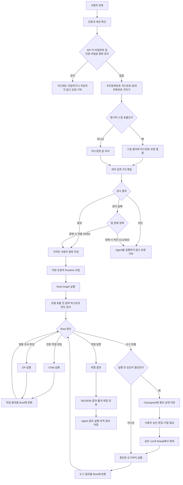

# 프로젝트 에이전트 내부 동작 상세 설명

> 이 문서는 현재 코드가 실제로 실행하는 최종 흐름만 다룬다. 한 단계의 결과가 어디로 넘어가는지, 어떤 설정을 넣었는지, 기본 동작 대신 왜 그 값을 골랐는지를 요청 순서대로 설명한다. 프롬프트 원문은 싣지 않고 실제 의미만 한국어로 정리했다.

## 1. 먼저 보는 전체 흐름



이 구조에는 별도 의도 분류 모델이 없다. Root 모델이 매번 다음 행동을 고른다.

- 바로 답한다.
- 도구를 호출한다.
- 전문 Child에게 맡긴다.
- 범용 GP에게 맡긴다.

코드는 Root의 결정을 대신하지 않는다. 대신 권한, 호출 횟수, 승인, 동시 실행, 저장 경계를 강제한다.

## 2. 핵심 구성요소와 책임

| 구성요소 | 하는 일 | 다음 단계로 넘기는 값 |
|---|---|---|
| Chat API | 인증, 세션 확인, 인증 비밀값 차단, 개인정보 가림, 가드레일 실행, 메시지 저장 | RuntimeContext, 안전 처리한 사용자 입력, 대화 정보 |
| AgentExecutor | 버전 로딩, Runtime 생성 요청, 스트림 시작 | 컴파일된 Graph와 실행 입력 |
| AgentRuntimeFactory | 모델·도구·Child·GP·메모리·스킬·HITL 조립 | Root Graph, 실제 모델 정보 |
| Root | 전체 계획, 도구 선택, 위임, 최종 답변 | Tool 요청 또는 Child/GP task, 최종 응답 |
| Child | 특정 분야의 전문 작업 | 결과와 근거를 Root에 반환 |
| GP | 범용 조사·분석 | 읽기 전용 결과를 Root에 반환 |
| ToolLoader | 도구 정의를 실행 가능한 LangChain Tool로 변환 | 모델에 노출할 Tool 객체 |
| Middleware | 모델·도구 호출 전후의 정책 강제 | 수정된 상태, Tool 결과 또는 중단 요청 |
| Checkpointer | 같은 세션의 대화 상태와 중단 위치 저장 | 다음 턴 또는 HITL 재개 상태 |
| Store | 개인 메모리와 스킬의 장기 저장 | 세션을 넘어 읽을 파일 데이터 |
| EventMapper | LangGraph 원시 이벤트를 UI 이벤트로 변환 | reasoning, tool, sources, result 이벤트 |

## 3. 요청 접수와 입력 보호

### 3.1 실제 실행 순서

입력 보호는 외부 가드레일보다 먼저 실행된다. 현재 API의 순서는 다음과 같다.

| 순서 | 처리 | 다음 단계로 전달하는 값 |
|---:|---|---|
| 1 | Bearer 인증과 요청 형식 확인 | 사용자 ID와 입력 문자열 |
| 2 | 세션을 조회하고 사용자 소유인지 확인 | 팀·프로젝트·에이전트 정보 |
| 3 | API 키·비밀번호 등 인증 비밀값 형태 검사 | 감지되면 즉시 400, 없으면 다음 단계 |
| 4 | 주민등록번호·카드번호·휴대전화번호를 `[가려짐]`으로 치환 | 저장 가능한 사용자 입력 |
| 5 | `/스킬이름` 형식인지 해석 | 일반 입력 또는 스킬 절차와 결합한 모델 입력 |
| 6 | 가려진 사용자 입력을 외부 가드레일 전용 작업 공간에 제출 | 아직 끝나지 않아도 다른 준비를 할 수 있는 검사 작업 |
| 7 | 검사 중에 대화 이력·RuntimeContext·실행 버전을 준비 | Graph 조립에 필요한 정보 |
| 8 | 앞서 시작한 가드레일 검사가 끝나기를 기다림 | 통과·차단·검사 실패 |
| 9 | 통과 또는 OPEN이면 가려진 사용자 입력을 DB에 저장 | 영구 대화 이력 |
| 10 | 같은 안전한 입력을 바탕으로 Runtime Graph 실행 | Root가 읽을 사용자 메시지 |

핵심은 3~4단계다. 원문은 HTTP 요청을 처리하는 메모리에서 검사와 치환에만 사용한다. 이후 스킬 해석, 외부 가드레일, 대화 DB, Graph와 checkpoint는 가려진 사용자 입력을 기준으로 동작한다.

명시적 스킬 호출만 예외적으로 Graph 입력의 모양이 달라진다. DB에는 가려진 사용자 발화를 저장하고, Graph에는 스킬 본문과 가려진 요청을 합친 문장을 보낸다. 비밀값이나 개인정보 원문을 다시 붙이지는 않는다.

### 3.2 가장 먼저 막는 인증 비밀값

코드의 내부 분류명은 `credential`이지만, 이 문서에서는 뜻이 분명하도록 **인증 비밀값**이라고 부른다. 실제 값이 유효한지 외부 서비스에 확인하지 않고 문자열 형태만 검사한다.

| 감지 대상 | 현재 판단 기준 | 예시 |
|---|---|---|
| `sk-` 계열 API 키 | `sk-` 뒤에 영문·숫자·밑줄·하이픈이 20자 이상 | OpenAI·Anthropic 계열 형식 |
| AWS Access Key ID | `AKIA` 뒤에 영문 대문자·숫자 16자 | AWS 키 형식 |
| Google API Key | `AIza` 뒤에 허용 문자 35자 | Google API 키 형식 |
| 이름이 붙은 비밀값 | `api_key`, `secret`, `token`, `password`, `passwd`, `pwd` 뒤에 `:` 또는 `=`와 값 | `token: ...` |
| 주요 비밀 필드 | `aws_secret`, `db_password`, `secret_key`, `private_key` 뒤에 `:` 또는 `=` | 설정값을 붙여 넣은 형태 |

하나라도 발견하면 요청 전체를 끝낸다.

```text
인증 비밀값 감지
→ 외부 가드레일 호출 안 함
→ chat_message 저장 안 함
→ Runtime·Graph 생성 및 실행 안 함
→ HTTP 400과 삭제 후 재전송 안내
```

로그에는 세션 ID와 “인증 비밀값 형태를 감지했다”는 사실만 남긴다. 매칭된 값과 사용자 원문은 남기지 않는다. 마스킹 후 계속 실행하지 않고 요청을 막는 이유는, 유효할 수 있는 키가 외부 가드레일·DB·checkpoint 가운데 어느 곳에도 닿지 않게 하기 위해서다.

이 검사는 정규식 기반이다. 띄어서 쓴 키, 여러 메시지로 나눈 값, 인코딩한 값, 등록하지 않은 공급자의 새로운 형식까지 모두 찾는 비밀정보 탐지기는 아니다. 따라서 “현재 정의한 명확한 형태를 앞단에서 차단하는 방어선”으로 이해해야 한다.

전용 API 테스트는 이 분기를 통과한 인증 비밀값이 400 응답으로 끝나는지, 대화 저장·외부 가드레일·Agent 실행 함수가 모두 호출되지 않는지를 함께 확인한다.

### 3.3 차단하지 않고 가리는 개인정보

인증 비밀값이 없으면 저장용 마스킹을 한 번 수행한다. 여기서 말하는 개인정보는 법률상 모든 개인정보가 아니라 코드에 등록한 다음 세 가지 형태다.

| 감지 대상 | 현재 판단 기준 | 저장·전달 값 |
|---|---|---|
| 주민등록번호 | 생년월일 6자리 + 뒷자리 첫 숫자 1~4 + 6자리, 하이픈·공백 허용 | `[가려짐]` |
| 카드번호 | 4자리 숫자 네 묶음, 하이픈·공백 허용 | `[가려짐]` |
| 국내 휴대전화번호 | 010·011·016·017·018·019 형식 | `[가려짐]` |

이름과 업무용 이메일은 이 단계에서 가리지 않는다. 담당자 조회와 Jira 업무에 필요한 정상 입력이기 때문이다. IP·MAC 주소도 저장용 정규식에는 없으며, 모델 입력·출력과 Tool 결과에서는 LangChain PII 미들웨어가 별도로 가린다.

마스킹이 끝난 사용자 입력은 한 번만 만들고 다음 소비자가 공유한다.

| 소비자 | 받는 값 |
|---|---|
| 명시적 스킬 호출 해석 | 가려진 입력 |
| 외부 가드레일 | 가려진 입력 |
| `chat_message.content` | 가려진 입력 |
| 일반 채팅의 `model_input` | 가려진 입력 |
| LangGraph checkpoint | 가려진 입력에서 시작한 메시지 상태 |

이렇게 한 값을 공유하면 어느 한 경로에서만 마스킹을 빼먹는 문제를 줄일 수 있다.

### 3.4 권한·보안 관련 문장은 왜 저장하는가

“관리자 비밀번호 알려줘”, “root 계정이 필요해” 같은 문장은 비밀번호 값 자체가 아니라 사용자의 요청 내용이다. 저장용 마스킹에서는 이 문장을 유지한다. 그래야 새로고침 뒤에도 무엇을 물었는지 알 수 있다.

다만 LLM에는 그대로 보내지 않는다. 모델을 호출하기 직전에 `SensitiveInputMask`가 다음 표현을 `[가려짐]`으로 바꾼다.

- 관리자 권한·계정·비밀번호
- 루트 계정과 root access
- 내부 접속 정보
- administrator privilege, admin password, superuser

따라서 대화 DB에는 요청 문맥이 남고, 모델 입력에서는 권한 우회 지시로 이용될 만한 표현을 한 번 더 제거한다.

### 3.5 화면에는 무엇이 보이는가

프런트엔드는 전송 직후 사용자가 입력한 문장을 로컬 상태로 먼저 그릴 수 있다. 이때는 원문이 잠깐 보일 수 있다. 서버에는 가려진 값만 저장되므로 새로고침하거나 세션을 다시 열면 `[가려짐]`이 포함된 문장이 보인다.

인증 비밀값이 발견된 요청은 저장하지 않는다. 화면에는 서버가 반환한 “API 키·비밀번호로 보이는 값을 삭제하고 다시 보내 달라”는 오류만 표시된다.

### 3.6 명시적 스킬 호출

가려진 입력이 `/스킬이름 요청` 형식이면 Graph 실행 전에 스킬을 찾는다.

```text
가려진 사용자 입력
→ 내장 스킬과 활성 개인 스킬에서 이름 조회
→ 찾음: SKILL.md 절차와 가려진 요청을 결합
→ 못 찾음: 일반 채팅 입력으로 처리
```

스킬을 찾았다면 결합한 문장이 `model_input`이 된다. DB에는 스킬 본문을 복사하지 않고 사용자가 보낸 가려진 발화만 저장한다. 화면에는 Graph 이벤트보다 먼저 `skill_applied` 이벤트를 보낸다.

### 3.7 실행 컨텍스트와 버전 준비

가드레일 검사가 도는 동안 서버는 이전 대화와 실행 컨텍스트를 준비한다. API가 조회하는 보조 이력은 사용자·Agent 텍스트 최근 20개다. 과거 reasoning과 Tool call/result 원문은 가져오지 않는다.

RuntimeContext에는 다음 값이 들어간다.

| 항목 | 값 | 쓰이는 곳 |
|---|---|---|
| account_id | 현재 사용자 | 개인 메모리·스킬·파일 접근 범위 |
| team_id | 현재 팀 | MCP, 가드레일, 팀 데이터 범위 |
| role | leader 또는 member | 상태 변경 도구 실행 권한 |
| session_id | 현재 채팅 세션 | LangGraph thread_id |
| project_id | 선택된 프로젝트 | 업무 Tool과 쓰기 잠금 범위 |
| run_id | 이번 실행 식별자 | 추적, Tool 멱등 처리, HITL 재개 |

| 세션 종류 | 버전 선택 | 이유 |
|---|---|---|
| 기본 채팅 | 요청마다 현재 live version 조회 | 기본 에이전트 개선을 기존 기본 채팅에도 다음 턴부터 반영 |
| 사용자가 고른 별도 에이전트 | 세션의 agent_version_id 유지 | 대화 중 에이전트 성격이 갑자기 바뀌지 않도록 재현성 유지 |

버전 고정은 Runtime 객체를 계속 들고 있다는 뜻이 아니다. 매 요청마다 Graph를 다시 조립하되 같은 버전 ID의 정의를 읽는다는 뜻이다.

## 4. 외부 입력 가드레일

### 4.1 가드레일이 받는 입력과 실행 위치

가드레일은 Agent Runtime 내부 미들웨어가 아니다. 인증 비밀값 검사를 통과하고 세 가지 개인정보 패턴까지 가린 사용자 입력을 Graph 실행 전에 검사한다.

```text
가려진 사용자 입력
→ 외부 가드레일 검사 제출
→ 검사 중 대화·Runtime 정보 준비
→ 검사 결과에 합류
→ 통과 또는 OPEN이면 DB 저장과 Runtime 실행
```

따라서 외부 공급자는 차단한 API 키·비밀번호 원문이나 앞 단계에서 가린 주민등록번호·카드번호·휴대전화번호를 받지 않는다.

### 4.2 공급자와 판정 범위

팀이 연결하고 활성화한 공급자 하나를 사용한다. CONNECTED는 주소·자격증명·정책을 저장하고 연결 확인까지 마친 상태다.

| 공급자 | 실제 판정 |
|---|---|
| OpenAI Guardrails | 팀 input pipeline의 Moderation, Jailbreak, PII, NSFW, Off Topic, 금지어 등 tripwire |
| Azure AI Content Safety | Hate, SelfHarm, Sexual, Violence와 선택적 blocklist |
| AWS Bedrock Guardrails | 팀의 AWS Guardrail에서 설정한 콘텐츠·단어·민감정보·금지 주제 |

가드레일은 앞단 정규식이 다루지 않는 유해성·탈옥 시도·정책 위반을 판정한다. 상세 기록에는 걸린 규칙 종류만 남기고 문제가 된 문장 조각은 복사하지 않는다.

### 4.3 검사 중 병렬로 준비하는 것

외부 검사는 최대 네 건을 동시에 처리하는 전용 스레드 풀에서 시작한다. 서버는 결과를 바로 기다리지 않고 다음 작업을 함께 진행한다.

- 이전 대화 조회
- 계정·팀·프로젝트 정보 구성
- 기본 채팅의 현재 live version 확인
- RuntimeContext 생성

준비가 끝나면 앞서 시작한 가드레일 검사가 끝나기를 기다린다. 외부 검사 시간과 내부 DB 조회 시간을 단순히 더하지 않기 위한 구조다.

### 4.4 시간과 장애 정책

| 항목 | 일반 기본 동작 | 우리 값 | 선택 이유 |
|---|---|---|---|
| 공급자 클라이언트 timeout | 공급자 SDK마다 다름 | 10초 | 외부 공급자가 웹 요청을 오래 붙잡지 않게 제한 |
| API 대기 상한 | 프로젝트가 정해야 함 | 12초 | 공급자 호출 제한 10초가 끝난 뒤 오류 정리와 결과 전달에 2초 여유 |
| 가드레일 pool | 프로젝트가 정해야 함 | 프로세스당 4개 | 채팅 요청과 분리하면서 무제한 외부 호출 방지 |
| 검사 실패 처리 | 정해진 공통 기본 없음 | 팀별 OPEN 또는 CLOSED | 서비스 가용성과 보안 우선순위를 팀이 선택 |

판정 뒤의 흐름은 다음과 같다.

| 결과 | 의미 | 다음 단계 |
|---|---|---|
| 통과 | 안전 검사를 끝냈고 차단 규칙에 걸리지 않음 | 가려진 발화를 DB에 저장한 뒤 Agent 실행 |
| 차단 | 위험하다고 판정 | 발화를 저장하지 않고 Agent도 실행하지 않음 |
| 실패 + OPEN | timeout·연결 오류 등으로 판정 불가 | 장애를 기록하고 가려진 발화를 저장한 뒤 Agent 실행 |
| 실패 + CLOSED | 판정 불가 | 안전을 확인하지 못했으므로 Agent 실행 안 함 |

감사 로그 저장 실패는 판정을 바꾸지 않는다. 감사 로그는 이미 나온 결정을 기록하는 부가 기능이다. 기록 DB 장애 때문에 통과 요청을 차단하거나 차단 요청을 허용하면 안전 판단과 실제 동작이 달라질 수 있기 때문이다.

## 5. 요청마다 Runtime을 조립하는 과정

### 5.1 호출 순서

```text
Chat API
→ build_default_executor(): 공용 Provider와 정책 준비
→ AgentExecutor.run(): 실행할 정의 로딩
→ AgentRuntimeFactory.build(): Root·Child·GP Graph 생성
→ DeepAgentStreamAdapter.stream(): 질문을 Graph에 입력
```

Graph 구조는 checkpoint에 저장되지 않는다. 그래서 새 요청과 HITL 재개 모두 같은 정의로 Runtime을 다시 조립한다. checkpoint에는 메시지와 중단 상태가 있고, factory는 그 상태를 실행할 Graph를 다시 만든다.

### 5.2 조립 순서와 전달값

| 순서 | 실제 처리 | 만들어지는 결과 |
|---:|---|---|
| 1 | agent_version_id로 모델, 프롬프트, 도구, max_iterations 조회 | AgentDefinition |
| 2 | 연결된 Child 정의와 alias 조회 | SubagentReference 목록 |
| 3 | 세션 Tool override가 있으면 Root 도구만 교체 | 이번 요청의 Root tool_refs |
| 4 | 모델 공급자와 자격증명 결정 | 실행 가능한 ChatModel |
| 5 | ToolLoader가 내장·MCP 도구를 실행 객체로 변환 | Tool 목록 |
| 6 | side_effect와 approval_when을 읽어 승인 규칙 생성 | interrupt_on |
| 7 | 각 Child를 leaf Graph로 먼저 컴파일 | CompiledSubAgent 목록 |
| 8 | Root 도구에서 읽기 전용 도구만 골라 GP 구성 | GP 명세 |
| 9 | 메모리·스킬 경로를 CompositeBackend에 연결 | backend, store, memory, skills |
| 10 | 호출 제한과 커스텀 미들웨어 조립 | middleware 목록 |
| 11 | PostgresSaver 연결 | checkpointer |
| 12 | create_root_graph에 모든 값을 전달 | 실행 가능한 Root Graph |

### 5.3 모델 설정

| 항목 | 라이브러리 기본값 | 우리 값 | 이유 |
|---|---|---|---|
| 기본 모델 | Deep Agents가 설치 환경에 따라 기본 모델을 고를 수 있음 | gpt-5.6-luna | 환경에 따라 모델이 달라지는 일을 막고 비용·속도 기준을 고정 |
| reasoning effort | 공급자·모델 기본값 | low | 일반 업무 채팅의 응답 지연과 비용을 우선 |
| 에이전트별 override | 선택 사항 | agent_versions 값이 있으면 우선 | 전문 Agent는 필요에 따라 다른 모델 사용 |
| 공급자 결정 | 단일 규칙 없음 | 팀 custom endpoint → claude 계열 Anthropic → 나머지 OpenAI | 팀 전용 연결을 먼저 존중하고 모델 이름에 맞는 SDK 사용 |

모델을 선택한 결과로 provider, endpoint와 endpoint hash도 함께 계산한다. 이 값은 agent_started 이벤트와 추적 DB에 들어가 실제 실행 환경을 나중에 확인할 수 있다.

### 5.4 Root Graph에 넣는 실제 값

| 인자 | 우리 값 | 기본값과의 차이 | 선택 이유 |
|---|---|---|---|
| model | 해석이 끝난 ChatModel 객체 | 문자열 기본 선택에 맡기지 않음 | 팀 endpoint와 실제 자격증명을 반영 |
| system_prompt | 공통 Runtime 지침 + 버전별 지침 | 버전 프롬프트만 쓰지 않음 | 공통 정책 변경 때문에 모든 버전을 다시 발행하지 않도록 함 |
| tools | 버전 도구 + 항상 켜는 스킬 도구 2개 | 빈 목록 또는 전달 목록 | 어떤 Agent에서도 스킬 생성 대화를 시작할 수 있게 함 |
| subagents | GP 1개 + 연결된 Child | 기본 GP 자동 생성에 의존하지 않음 | GP 권한과 스킬을 우리 정책대로 명시 |
| interrupt_on | 승인 대상 Tool 이름별 설정 | 기본 None | 상태 변경 전에 구조화된 HITL 적용 |
| middleware | 표준 제한·PII + 커스텀 정책 | 기본 미들웨어에 추가 | 프로젝트 DB와 MCP 경계를 코드로 강제 |
| backend | CompositeBackend | 기본 StateBackend | 세션 파일과 장기 데이터를 경로별로 분리 |
| store | PostgreSQL PostgresStore | 기본 없음 | 메모리·스킬을 세션 밖에서도 유지 |
| memory | `/memories/users/preferences.md` | 기본 없음 | 사용자별 안정적인 선호만 모델 컨텍스트에 제공 |
| skills | `/skills/builtin/`, `/skills/personal/` | 기본 없음 | 실행 가능한 내장·활성 개인 스킬만 노출 |
| checkpointer | PostgreSQL PostgresSaver | 기본 없음 | 같은 세션 대화와 HITL 중단 위치를 지속 저장 |
| fs_excluded_tools | `delete` | 기본 도구를 제외하지 않을 수 있음 | 팀 스킬 삭제가 역할 검사를 우회하는 경로를 막음 |

### 5.5 Backend 경로 라우팅

CompositeBackend는 가상 경로를 보고 실제 저장 위치를 고른다.

| 경로 | 저장소 | 수명 |
|---|---|---|
| 일반 작업 파일 | StateBackend | 현재 Graph 상태와 checkpoint |
| `/memories/users/` | StoreBackend | 사용자·팀·Agent 범위의 장기 저장 |
| `/skills/builtin/` | 읽기 전용 내장 소스 | 애플리케이션 배포 수명 |
| `/skills/personal/` | StoreBackend | 사용자 개인 스킬 수명 |
| `/skills/team/` | StoreBackend | 카탈로그와 가져오기용, 직접 실행 목록에서는 제외 |

memory 인자는 저장소가 아니다. MemoryMiddleware가 자동으로 읽을 파일 경로 목록이다. store는 실제 장기 저장소이고 backend는 가상 경로를 store 또는 state로 보내는 라우터다.

## 6. Root, Child, GP의 실행 경계

| 항목 | Root | 전문 Child | GP |
|---|---|---|---|
| 역할 | 전체 판단과 최종 답변 | 지정 분야의 전문 작업 | 범용 조사와 분석 |
| 모델 | Root 버전 모델 | Child 버전 모델 | Root 모델 |
| 도구 | Root 선택 도구 | Child 버전 도구 | Root의 side_effect=false 도구만 |
| 메모리 | 있음 | 별도 연결 없음 | 없음 |
| 스킬 | 내장 + 활성 개인 | 별도 연결 없음 | Root와 같은 스킬 경로 |
| 독립 checkpointer | Root에 있음 | 없음 | 없음 |
| 추가 위임 | 가능 | 불가 | 불가 |

### 6.1 위임 뒤 실제 흐름

1. Root가 task Tool을 호출한다.
2. task에는 목표, 배경, 확인된 사실, 제한 범위, 기대 출력, 출처 요구를 넣는다.
3. SubAgentMiddleware가 alias에 맞는 Child 또는 GP를 선택한다.
4. 선택된 하위 Agent가 자기 모델과 Tool로 실행된다.
5. 하위 Agent의 모델·Tool 이벤트도 `subgraphs=True` 스트림으로 나온다.
6. 하위 Agent의 최종 결과가 task Tool 결과가 된다.
7. 이 결과가 Root의 메시지 상태에 들어간다.
8. Root가 결과를 검토하고 추가 호출 또는 최종 답변을 고른다.

Child와 GP는 다시 task를 호출하지 못한다. `allow_subagents=false`로 컴파일해 위임 깊이를 Root → Child/GP 한 단계로 제한했다. 순환 위임과 폭발적인 실행을 막기 위한 선택이다.

### 6.2 스킬 전달의 정확한 범위

GP에는 factory가 SkillsProvider의 source 목록을 직접 전달한다. 따라서 GP는 내장·활성 개인 스킬을 찾아 읽을 수 있다.

Child에는 skills, backend, store를 전달하지 않는다. Root가 선택한 스킬 이름이나 SKILL.md 본문도 task에 자동 삽입하지 않는다.

```text
Root가 task에 스킬 절차를 적음
→ Child가 그 설명을 따를 수 있음

Root가 적지 않음
→ Child는 Root가 어떤 스킬을 읽었는지 알 수 없음
```

이 선택은 개인 스킬 전체를 모든 전문 Child에 노출하지 않고 Child를 가볍게 유지한다. 반면 반드시 같은 절차가 필요할 때 누락될 수 있다. 그런 작업은 Root가 직접 처리하거나 task에 필요한 절차를 명시해야 한다.

## 7. 도구 준비와 실행

### 7.1 ToolLoader가 하는 일

ToolLoader는 미들웨어가 아니다. Graph를 만들기 전에 도구 정의를 Runtime Tool로 바꾼다.

```text
DB의 tool_ref
→ 내장 registry 또는 팀 MCP에서 정의 조회
→ 모델이 사용할 안전한 이름으로 변환
→ 인자 schema와 설명 구성
→ RuntimeContext 주입 wrapper 추가
→ 역할 검사와 멱등 처리 추가
→ LangChain Tool 객체 반환
```

MCP의 저장용 이름 `mcp:MT001`처럼 모델 API에서 쓰기 어려운 문자는 안전한 이름으로 바꾸고, 실행 직전에 다시 원래 tool_ref로 복원한다.

### 7.2 side_effect가 맡는 세 가지 역할

registry의 side_effect는 단순 설명값이 아니다.

1. leader·member가 해당 Tool을 실행할 수 있는지 검사한다.
2. Root와 Child의 interrupt_on 승인 대상을 만든다.
3. GP에 줄 읽기 전용 Tool을 고른다.

| 값 | 의미 | 예 |
|---|---|---|
| false | 조회·계산처럼 외부 상태를 바꾸지 않음 | document_search, task_list, calculate |
| true | DB·파일·외부 서비스 변경 또는 사용자 응답 대기 | task_register, document_create, MCP, skill_register |

현재 leader와 member 모두 상태 변경 Tool을 실행할 수 있다. 역할을 허용했다고 바로 실행되는 것은 아니다. side_effect=true이면 HITL 승인 경계도 함께 적용된다.

### 7.3 approval_when

대부분의 side_effect Tool은 항상 승인한다. 같은 Tool이 인자에 따라 조회 또는 파일 생성을 모두 할 때만 approval_when으로 조건을 나눈다.

현재 대표 사례는 table_transform이다.

```text
output_format 없음
→ 변환 결과 미리보기
→ 파일을 만들지 않음
→ 승인 없이 실행

output_format 있음
→ 새 파일 생성
→ approval_when=true
→ HITL 승인 후 실행
```

side_effect는 Tool 전체의 위험 가능성을 표시하고 approval_when은 이번 호출이 실제 변경 호출인지 판단한다.

현재 interrupt_on에 들어갈 수 있는 내장 Tool은 다음과 같다. 단, 에이전트 버전에 실제로 선택된 Tool만 최종 목록에 들어간다.

| 범주 | 승인 대상 |
|---|---|
| 파일·문서 | table_export, document_create, document_convert, pdf_edit, file_sanitize, archive_manage |
| 업무·Jira | task_register, task_update, jira_create_issues |
| 시각화 파일 | diagram_create, chart_create, graph_create |
| 스킬 | skill_register, skill_creator_ask_followup |
| 조건부 | table_transform |
| 외부 연결 | 현재 연결된 모든 MCP Tool |

skill_creator_ask_followup은 외부 상태를 쓰지 않지만 사용자 답을 받아야 다음 단계로 갈 수 있어 respond 결정을 받는 중단 대상으로 표시한다.

### 7.4 실제 Tool 실행 순서

```text
모델이 Tool 이름과 인자를 출력
→ HumanInTheLoopMiddleware가 승인 대상인지 검사
→ 필요한 경우 checkpoint에 중단
→ 승인 후 Tool 실행 진입
→ 역할 검사
→ side_effect Tool의 멱등 claim 획득
→ Tool별 쓰기 잠금 또는 메모리 보호
→ MCP이면 timeout 적용
→ 실제 handler 실행
→ ToolMessage 생성
→ EventMapper가 tool_completed로 변환
→ 결과가 Root 또는 호출한 Child에게 전달
```

멱등 키는 run_id와 tool_call_id다. 승인 재개나 네트워크 재시도로 같은 호출이 다시 들어오면 저장된 결과를 반환해 Jira 이슈나 파일을 중복 생성하지 않는다.

## 8. 미들웨어와 실행 훅

### 8.1 미들웨어와 훅의 관계

미들웨어는 정책을 담은 실행 부품이고, 미들웨어 훅은 그 부품이 끼어드는 시점이다.

| 미들웨어 훅 | 시점 | 우리 코드의 사용 |
|---|---|---|
| before_agent | Agent 실행당 한 번, 시작 전 | 스킬 카탈로그 revision 갱신 |
| before_model | 매 모델 호출 전 | 모든 사용자 메시지에서 등록된 비밀값·개인정보·권한 표현을 다시 가림 |
| wrap_tool_call | 각 Tool 호출을 감싸서 실행 | MCP timeout, 쓰기 잠금, 메모리 보호 |

Deep Agents Code의 `.deepagents/hooks.json` command hook과는 다르다. 현재 웹 서비스에는 해당 파일과 `PreToolUse`, `PostToolUse` handler가 없으므로 Code Hook을 사용하지 않는다.

### 8.2 LangChain 표준 미들웨어

| 미들웨어 | 실행 시점 | 라이브러리 기본값 | 우리 값 | 선택 이유 |
|---|---|---|---|---|
| ModelCallLimit | 모델 호출 전후 | 명시하지 않으면 제한 없음 | Root·Child는 max_iterations, 보통 10, 상한 50. GP 50. 초과 시 error | 무한 반복 방지, Agent별 복잡도 설정 유지 |
| ToolCallLimit | 모델·Tool 호출 경계 | 명시하지 않으면 제한 없음 | 실행당 100, 초과 시 error | 잘못된 반복과 비용 폭증 방지 |
| PIIMiddleware | 입력·출력·Tool 결과 | 적용 범위를 선택해야 함 | credit_card, ip, mac_address. redact. output과 tool_results도 검사 | 업무 메일과 URL은 정상 데이터라 오탐이 많아 제외 |
| TodoListMiddleware | Agent 계획과 Tool 제공 | 기본 Tool 설명 | 기본 설명 + 팀 업무 Tool과의 차이 추가 | 개인 실행계획과 실제 팀 업무 등록의 혼동 방지 |

### 8.3 직접 만든 미들웨어

| 미들웨어 | 훅 | 실제 처리 | 선택 이유 |
|---|---|---|---|
| SensitiveInputMask | before_model | 모든 사용자 메시지에서 §3.2의 인증 비밀값, §3.3의 개인정보, §3.4의 권한 표현을 `[가려짐]`으로 치환 | 새 입력 경계를 우회한 메시지와 과거 checkpoint도 모델 호출 직전에 다시 검사 |
| MCP Tool Call Timeout | wrap_tool_call | MCP handler를 공유 ThreadPool에 제출하고 제한 시간만 대기 | 자유 연결 MCP가 웹 worker를 무기한 붙잡는 문제 방지 |
| Builtin Write Lock | wrap_tool_call | 같은 팀·프로젝트의 주요 쓰기를 PostgreSQL advisory lock으로 직렬화 | 병렬 task/Jira 등록 경합 방지 |
| Memory Write Guard | wrap_tool_call | 장기 메모리 경로에 민감정보가 있으면 handler를 호출하지 않고 오류 반환 | 입력 마스킹과 별도로 영구 저장 경계 재검사 |
| Memory Write Lock | wrap_tool_call | 같은 사용자 메모리 파일 수정을 직렬화 | 동시 edit로 한쪽 내용이 사라지는 문제 방지 |
| Skill Catalog Refresh | before_agent | catalog revision이 바뀐 경우 skills_metadata 재조회 | 백그라운드 등록 후 기존 세션의 낡은 카탈로그 갱신 |

새 요청은 API 앞단에서 인증 비밀값이 차단되고 세 가지 개인정보가 가려진 상태다. 이 미들웨어는 앞단 처리를 대신하는 주 방어선이 아니라 **모델 호출 직전의 두 번째 방어선**이다.

- 가장 최근 질문뿐 아니라 checkpoint에서 복원한 과거 사용자 메시지까지 모두 검사한다.
- API를 거치지 않는 테스트·내부 실행 경로의 메시지도 검사한다.
- 저장 단계에서는 유지한 “관리자 권한”, “root access” 같은 표현을 모델에 전달하기 전에 가린다.
- 같은 메시지를 여러 번 검사해도 이미 `[가려짐]`인 부분은 달라지지 않는다.

기존 DB와 checkpoint의 원문을 삭제하는 기능은 아니다. 등록된 정규식에 걸리는 값이 모델로 다시 전달되는 것을 줄일 뿐이므로, 과거 저장 데이터 자체를 없애야 한다면 별도의 정리 작업이 필요하다.

### 8.4 MCP timeout 값

| 항목 | 값 | 근거 |
|---|---:|---|
| 기본 MCP timeout | 480초 | 600초 Gunicorn worker보다 먼저 정상적인 Tool 오류를 반환 |
| override 최대값 | 540초 | worker 종료 전에 60초의 정리 여유 확보 |
| 공유 ThreadPool | 32 workers | MCP 대기를 Graph 실행 스레드와 분리하되 무제한 스레드 방지 |

timeout이 나도 이미 제출한 Python 스레드를 강제로 죽이지는 못한다. 사용자에게는 “결과를 확인하지 못한 호출”로 반환하고 자동 재시도하지 않는다. 원래 호출이 뒤늦게 성공한 상태에서 재시도하면 중복 변경이 생길 수 있기 때문이다.

### 8.5 Deep Agents가 자동으로 넣는 미들웨어

| 미들웨어 | 주요 시점 | 우리 설정 또는 교체값 | 이유 |
|---|---|---|---|
| SkillsMiddleware | before_agent | 공유 backend, 내장·활성 개인 source, 프로젝트 안내문 | 실제 Store의 스킬을 읽도록 연결 |
| FilesystemMiddleware | Tool 제공·실행 | Root는 CompositeBackend, Child는 StateBackend, delete 제외 | 작업 파일은 쓰되 권한 우회 삭제 차단 |
| SubAgentMiddleware | task Tool | Root에 GP와 Child, Child에는 하위 Agent 없음 | 한 단계 위임 강제 |
| SummarizationMiddleware | before_model | 컨텍스트 85%에서 요약, 최근 10% 유지 | 모델 한도 초과 전에 과거 대화를 압축 |
| PatchToolCallsMiddleware | before_agent | 자동값 유지 | 중단·정리 뒤 결과가 없는 Tool call에 취소 결과를 넣어 메시지 형식 오류 방지 |
| MemoryMiddleware | before_agent | preferences 경로, 공유 backend, cache control, 프로젝트 저장 기준 | 장기 선호를 시스템 컨텍스트로 제공 |
| HumanInTheLoopMiddleware | after_model | interrupt_on에 계산된 Tool별 approve/edit/reject/respond | 실제 handler 직전에 구조화된 승인 적용 |

SummarizationMiddleware는 오래된 메시지를 `/conversation_history/{thread_id}.md`에 보관하고 모델에는 요약과 최근 메시지만 남긴다. 이 파일은 StateBackend와 checkpoint에 속한 단기 대화 기록이지 개인 장기 메모리가 아니다.

## 9. 실행 한도와 동시성

| 한도 | 프레임워크 기본 | 우리 값 | 선택 이유 |
|---|---|---|---|
| Root·Child 모델 호출 | 제한이 없을 수 있음 | 버전의 max_iterations, DB 기본 10, 절대 상한 50 | 일반 요청의 비용을 제한하면서 복잡한 Agent는 설정으로 확대 |
| GP 모델 호출 | 별도 프로젝트 값 필요 | 50 | 범용 조사에 충분한 여유를 주되 무한 반복 차단 |
| Tool 호출 | 제한이 없을 수 있음 | Agent 실행당 100 | 다단계 조사 허용과 폭주 방지의 절충 |
| 동시 Tool 실행 | LangGraph는 미지정 시 별도 상한을 주지 않음 | super-step당 4 | 부하 시험 전 무제한 병렬을 유한하게 만든 방어값 |
| 위임 깊이 | 프레임워크가 하위 구성을 허용 | 1단계 | 순환과 병렬 폭증 방지 |

동시성 4는 처리량 최적화가 끝난 수치가 아니다. 현재 코드 주석도 잠정 방어값으로 명시한다. 한 Root super-step에서 네 개를 넘는 Tool call은 버리지 않고 대기시킨다.

## 10. 단기 상태와 장기 메모리

### 10.1 단기 상태

세션이 있으면 session_id를 LangGraph thread_id로 사용한다. PostgresSaver가 이전 메시지, todo, 중단 위치를 읽는다.

```text
같은 session_id의 다음 요청
→ checkpoint에서 이전 Graph 상태 복원
→ 앞단에서 안전 처리한 이번 사용자 메시지 한 개만 추가
→ 모델 호출 직전에 전체 사용자 메시지를 다시 검사
→ Agent 실행
```

API가 조회한 최근 대화 20개를 다시 Graph에 붙이지 않는다. checkpoint와 API 이력을 함께 넣으면 같은 메시지가 턴마다 중복되기 때문이다. 세션이 없는 테스트·스크립트 실행만 최근 대화를 입력 앞에 붙인다.

### 10.2 장기 메모리 읽기

Root의 MemoryMiddleware가 `/memories/users/preferences.md`를 읽어 모델의 시스템 컨텍스트에 넣는다. namespace는 team, agent, account 조합이라 다른 사용자나 Agent의 메모리와 섞이지 않는다.

모델은 현재 질문과 관련 있을 때만 이를 참고해야 한다. 현재 사용자 명령이나 최신 Tool 결과가 메모리와 충돌하면 현재 정보가 우선이다. Child와 GP에는 개인 장기 메모리를 연결하지 않는다.

### 10.3 장기 메모리 저장

저장 대상은 다음 대화에서도 도움이 되는 안정적인 사실이다.

- 보고서 형식 선호
- 반복 업무 방식
- 지속적인 의사소통 선호
- 장기간 유효한 사용자 사실

저장하지 않는 항목:

- 이번 프로젝트에만 쓰는 수치
- 한 번만 적용할 지시
- 확인되지 않은 추측
- 현재 순간의 상태
- 문서 원문 복사
- 비밀번호, API 키, 개인정보, 접근 권한 정보

Root가 파일 수정 Tool로 저장을 시도하면 Memory Write Guard가 내용을 검사하고 Memory Write Lock이 동시 수정을 막는다. 저장된 결과는 PostgresStore에 남아 다른 세션에서도 읽힌다.

## 11. 스킬 선택과 등록

### 11.1 실행 가능한 스킬

| 종류 | 경로 | Runtime에서 직접 실행 |
|---|---|---|
| 내장 | `/skills/builtin/{name}/SKILL.md` | 가능 |
| 활성 개인 | `/skills/personal/{name}/SKILL.md` | 가능 |
| 비활성 개인 | `/inactive-skills/personal/{name}/SKILL.md` | 불가 |
| 팀 공유 원본 | `/skills/team/{name}/SKILL.md` | 직접 실행하지 않고 가져오기용 |

Root와 GP는 스킬 설명이 현재 요청과 명확히 맞을 때 SKILL.md를 읽고 그 절차를 따른다. 팀 스킬은 개인 사본으로 가져온 뒤 활성화해야 실제 실행 목록에 들어간다. 공유 원본의 변경이 개인 사본을 갑자기 덮어쓰지 않도록 실행 소유권을 분리한 선택이다.

현재 코드에 고정된 내장 스킬은 `skill-creator` 하나다. 새 스킬의 사용 조건·입력·처리 순서·결과 형식을 확인하고 등록 절차를 시작한다. 다른 내장 스킬이 숨어 있는 공용 폴더가 아니라, 서버 시작 시 이 정의를 내장 스킬 저장 영역에 맞춰 두는 방식이다.

### 11.2 정보가 부족할 때

skill-creator 흐름은 다음 항목을 확인한다.

- 스킬 이름과 사용 시점
- 필요한 입력
- 처리 순서
- 결과 형식
- 사용할 Tool
- 예외와 금지 조건
- 비슷한 요청과 구별하는 기준

한 번에 질문 하나만 하고 최대 세 번까지만 묻는다. 이미 받은 정보는 반복해서 질문하지 않는다. 충분해지면 초안을 보여 준 뒤 skill_register를 호출한다. 별도의 “등록할까요?” 질문은 하지 않는다. 등록 실행 승인은 HITL 카드가 담당한다.

### 11.3 등록은 즉시 게시가 아니다

```text
skill_register 승인
→ 검증 job 생성
→ worker가 형식 검사
→ 평가 요청 생성과 의미 검토
→ 라우팅·행동 테스트
→ 점수 판정
→ hash와 Runtime 버전 재확인
→ 통과한 경우에만 개인 스킬 게시
→ catalog revision 증가
→ 다음 Agent 실행의 before_agent에서 카탈로그 갱신
```

핵심 기준은 다음과 같다.

| 검사 | 우리 값 | 선택 이유 |
|---|---:|---|
| 최종 라우팅 suite | 긍정 6개 + 부정 6개 | 적용해야 할 요청과 헷갈리지만 적용하면 안 되는 요청을 함께 검사 |
| 반복 실행 | 사례당 3회 | 모델의 단일 우연 결과를 줄임 |
| 사례 판정 | 3회 중 2회 이상 | 다수결로 라우팅 안정성 확인 |
| recall | 0.80 이상 | 필요한 요청을 충분히 잡는지 검사 |
| precision | 0.80 이상 | 관련 없는 요청에 남용되지 않는지 검사 |
| 행동 표본 | 대표 긍정 3개 | 답변뿐 아니라 필수 Tool 사용도 검사 |

검증 Tool은 stub으로 바꿔 Jira·파일·외부 시스템을 실제로 변경하지 않는다. 게시 직전 후보 hash, 기존 버전 hash, Runtime과 Tool registry 버전을 다시 확인한다. 평가 뒤 실행 환경이 바뀌었다면 오래된 검증 결과로 게시하지 않는다.

검증을 별도 worker에 둔 이유는 수분이 걸리는 모델 평가를 채팅 HTTP 연결과 분리하기 위해서다. worker는 lease와 heartbeat로 job을 점유하므로 프로세스 재시작과 중복 실행에도 복구할 수 있다.

## 12. HITL 승인과 재개

### 12.1 승인 대상을 만드는 방식

factory는 이번 Runtime에 실제로 들어간 Tool만 순회한다. side_effect=true이면서 현재 역할이 실행할 수 있는 Tool을 interrupt_on에 넣는다. 목록을 별도로 복사하지 않으므로 새 MCP나 쓰기 Tool도 등록 정보에 따라 자동으로 승인 대상이 된다.

MCP는 현재 모두 side_effect=true로 취급한다. 외부 서버가 정확히 어떤 상태를 바꾸는지 플랫폼이 완전히 알 수 없기 때문에 보수적으로 승인받는다.

### 12.2 왜 프롬프트 질문이 아니라 Graph 중단인가

모델이 “실행해도 될까요?”라고 묻는 방식은 다음 문제가 있다.

- 모델이 확인 질문을 빼먹을 수 있다.
- 병렬 Tool 중 어떤 호출을 승인했는지 모호하다.
- 승인 답변 뒤 모델이 다른 인자로 다시 호출할 수 있다.
- 네트워크 재시도로 같은 쓰기가 두 번 실행될 수 있다.

현재 방식은 실제 Tool handler 앞에서 Graph를 중단한다. Tool 이름, 인자, tool_call_id를 구조화된 카드로 저장하므로 사용자의 결정이 정확한 호출에 연결된다.

### 12.3 승인 대기 결과

중단되면 다음 값이 awaiting_confirmation 이벤트와 agent 메시지에 저장된다.

- 원래 run_id와 thread_id
- interrupt_id
- 병렬 호출을 포함한 action_requests
- Root 또는 Child의 중단 위치
- EventMapper의 Tool·하위 Agent 연결 상태
- Langfuse 재개 추적 정보

이때 HTTP 턴은 실패가 아니라 “승인 대기” 상태로 정상 종료된다.

### 12.4 사용자 결정

| 결정 | 의미 | Graph에 전달되는 결과 |
|---|---|---|
| approve | 표시된 인자로 실행 | 승인 decision |
| edit | 허용 필드를 수정해 실행 | 수정된 인자를 포함한 decision |
| reject | 실행하지 않음 | 거절 Tool 결과 |
| respond | Tool 실행 대신 질문에 답함 | 사용자 응답 decision |

병렬 action은 index별 결정을 모두 보내야 한다. 일부만 승인하고 나머지를 거절할 수 있다.

### 12.5 재개 순서

1. API가 decision 개수, index 중복·누락, edit schema를 검사한다.
2. 승인 카드에 저장한 원래 run_id, session_id, 에이전트 버전을 복원한다.
3. 같은 정의로 Runtime Graph를 다시 조립한다.
4. EventMapper의 하위 Agent와 Tool 상태를 복원한다.
5. `Command(resume={decisions: [...]})`를 같은 thread checkpoint에 보낸다.
6. HumanInTheLoopMiddleware가 결정을 받아 중단된 Tool부터 이어 간다.
7. 승인된 쓰기는 멱등 claim을 거쳐 한 번만 실행된다.
8. Tool 결과가 Root에 돌아가고 Root가 다음 행동을 정한다.

재개할 때 사용자 질문을 다시 넣지 않는다. 이전 모델 호출도 처음부터 반복하지 않는다.

## 13. 스트리밍과 이벤트 변환

### 13.1 Graph에서 구독하는 세 스트림

| stream_mode | 들어오는 내용 | 필요한 이유 |
|---|---|---|
| updates | 모델·Tool·Child 노드가 끝난 상태 | Tool 완료, 위임 완료, interrupt 확인 |
| messages | 모델의 토큰·reasoning summary 조각 | 답변을 실시간으로 표시 |
| custom | Tool이 직접 보낸 stage·sources | 오래 걸리는 도구의 진행과 검색 출처 표시 |

`subgraphs=True`를 사용하므로 Child 내부 이벤트도 함께 받는다.

제너레이터 Tool은 결과 하나만 즉시 반환하지 않고 작업 중간에 여러 값을 내는 Tool adapter다. 이 adapter가 `get_stream_writer()`로 stage와 sources를 보내면 custom 모드가 받는다. 별도의 Deep Agents Code Hook을 사용하는 흐름은 아니다.

### 13.2 EventMapper

EventMapper는 프레임워크마다 다른 원시 이벤트를 화면 공통 형식으로 바꾼다.

| 원시 사건 | 화면 이벤트 |
|---|---|
| Root 시작 | agent_started |
| Child 시작·종료 | subagent_started, subagent_completed |
| 모델 응답 조각 | reasoning |
| Tool 호출 | tool_started, tool_progress, tool_completed |
| 검색 근거 | sources |
| 사람 결정 필요 | awaiting_confirmation |
| 정상 종료 | result |
| 오류 | error |

하나의 AIMessage에 Tool call이 여러 개 있으면 원시 이벤트 하나를 여러 Tool 이벤트로 펼친다. Child Tool에는 subagent alias와 부모 run을 붙여 어느 Agent의 실행인지 유지한다.

### 13.3 NDJSON

API는 이벤트 하나를 JSON 한 줄로 보낸다.

```text
{"type":"agent_started", ...}
{"type":"reasoning", ...}
{"type":"tool_started", ...}
{"type":"sources", ...}
{"type":"result", ...}
```

큰 JSON 하나가 완성될 때까지 기다리지 않아도 UI가 진행 상황을 바로 표시할 수 있다. HTTP 헤더를 보낸 뒤에는 상태 코드를 바꾸기 어려우므로 실행 중 오류도 `error` 이벤트 한 줄로 보낸다.

## 14. 파일 산출물

파일 산출물은 모든 요청에서 생기지 않는다. 파일을 만드는 Tool이 성공했을 때만 Tool 결과에 포함된다.

예:

- document_create
- table_export
- document_convert
- pdf_edit
- output_format을 지정한 table_transform
- 압축·분할 Tool

처리 순서:

1. 입력 file_id가 현재 사용자에게 허용됐는지 확인한다.
2. 원본 storage 또는 연결 저장소에서 파일을 읽는다.
3. 별도 처리기에서 변환·생성한다.
4. 원본을 덮어쓰지 않고 GENERATED 문서를 만든다.
5. storage 저장과 DB revision을 확정한다.
6. 실패하면 이미 만든 부분 결과를 정리한다.
7. Tool 결과에 파일 정보를 넣는다.
8. EventMapper가 produced_files로 모은다.
9. UI가 최종 답변 아래에 다운로드 카드를 표시한다.

| 필드 | 의미 |
|---|---|
| file | 파일 한 개를 만든 Tool의 결과 객체 |
| files | 여러 파일을 만든 Tool의 결과 배열 |

Child가 만든 파일도 task 결과를 거쳐 Root의 최종 produced_files에 남는다. 사용자가 “내 파일에 저장”을 누르면 kept=true가 되어 일반 개인 파일 목록에 포함된다.

## 15. 추적과 Langfuse

### 15.1 프로젝트 내부 추적

스트림 이벤트와 함께 다음 정보를 DB에 기록한다.

- Root·Child agent_run
- 부모·자식 run 관계
- 실제 provider와 endpoint hash
- 모델·Tool 호출 수
- token 사용량
- Tool 시작·완료·거절 상태
- 검색 문서 ID와 출처
- 응답 시간과 오류 코드

사용자에게 답변을 보냈다는 사실과 별개로 실제 실행이 어떻게 끝났는지 확인하기 위한 기록이다.

### 15.2 Langfuse callback

환경에 Langfuse 키가 있을 때만 callback을 만든다. 이 callback을 LangGraph의 `config["callbacks"]`에 넣어 모델·Tool·노드 이벤트를 Langfuse로 보낸다.

Langfuse는 Agent 결정을 바꾸지 않는다. 실행을 관찰하고 trace를 남긴다. callback 결과를 EventMapper나 모델 입력으로 다시 가져오는 코드도 없다. 키가 없거나 Langfuse 기록이 실패해도 채팅 실행은 계속된다.

LangSmith 실행 연결은 없다. 문서 폴더 이름이나 실험 기록과 달리 현재 Runtime에는 LangSmith callback과 설정이 배선되지 않았다.

## 16. 턴 종료

한 번의 요청은 다음 세 상태 중 하나로 끝난다.

| 상태 | 저장과 화면 처리 |
|---|---|
| 완료 | 최종 답변, 출처, 파일, 사용량을 저장하고 result 전송 |
| 승인 대기 | action_requests와 재개 상태를 저장하고 awaiting_confirmation 전송 |
| 오류 | 안전한 오류 메시지와 추적 코드를 저장하고 error 전송 |

예상한 오류는 사용자가 고칠 수 있는 설명을 준다. 예상하지 못한 내부 오류는 원문 예외를 화면에 노출하지 않고 일반 메시지와 추적 코드만 준다. 내부 경로, SQL, 자격증명 같은 정보가 예외 문자열에 섞일 수 있기 때문이다. 운영 로그에는 원래 예외와 stack trace를 남긴다.

클라이언트 연결이 중간에 끊기고 최종 이벤트를 만들지 못하면 Agent 최종 메시지는 저장하지 않는다. 입력 보호와 가드레일을 통과한 뒤 먼저 저장한 가려진 사용자 발화는 남는다.

## 17. 문서 동기화와 현재 세션 반영

세션 생성 시 Drive 동기화를 daemon thread로 시작할 수 있다. daemon thread는 채팅 응답과 별도로 도는 일회성 백그라운드 스레드이며 서버 종료를 붙잡지 않는다.

- 세션 생성 응답은 동기화를 기다리지 않는다.
- 변경 파일의 다운로드와 색인이 끝나야 검색에 반영된다.
- 완료 뒤에는 같은 세션의 다음 document_search부터 수정본을 읽는다.
- 새 세션을 만들 필요는 없다.
- 이미 시작된 검색은 이전 색인을 사용할 수 있다.
- 사용자가 최신 반영을 명시적으로 요청하면 document_sync가 동기화와 색인 완료를 기다린다.

반영 기준은 세션 변경이 아니라 색인 성공 시점이다.

## 18. 프로젝트에서 선택한 설계의 의미

### 18.1 Runtime을 요청마다 조립한다

에이전트 버전, 팀 MCP, 개인 스킬, 세션 Tool override가 요청 시점의 상태를 반영한다. HITL 재개 때도 같은 정의를 다시 계산하므로 checkpoint와 실행 Graph의 책임이 분리된다.

### 18.2 GP는 구조적으로 읽기 전용이다

승인 화면만 숨긴 것이 아니라 side_effect=false Tool만 GP에 전달한다. GP가 쓰기 Tool을 알고 우회 호출하는 경로 자체가 없다. 변경이 필요하면 조사 결과를 Root에 돌려주고 Root가 HITL을 거쳐 실행한다.

### 18.3 메모리는 입력 보호와 저장 보호를 나눴다

요청 입구에서는 인증 비밀값을 차단하고 정해진 개인정보를 가린다. 모델 호출 직전에는 SensitiveInputMask와 PII 미들웨어가 다시 검사한다. 장기 메모리에 쓰기 직전에는 Memory Write Guard가 한 번 더 막는다. 각 경계를 따로 둬 한 경로의 누락이 외부 전송이나 영구 저장으로 이어질 가능성을 줄였다.

### 18.4 스킬을 검증 뒤 배포한다

스킬 파일을 바로 실행 목록에 넣지 않는다. 라우팅 정확도, 행동, Tool 사용, hash와 Runtime 버전을 검사한 뒤 게시한다. skill-creator가 작성 지원이라면 worker 과정은 배포 게이트다.

### 18.5 HITL과 멱등 처리를 연결했다

사람이 승인하는 것만으로는 재시도 중복을 막지 못한다. 같은 run_id와 tool_call_id로 실행권을 기록해 승인 재개와 네트워크 재시도가 겹쳐도 상태 변경이 한 번만 일어나게 했다.

## 19. 주요 코드 위치

| 관심사 | 코드 위치 |
|---|---|
| 채팅 요청, 가드레일, HITL API, 메시지 저장 | `apps/chat/api_views.py` |
| Executor 조립 | `services/agent_runtime/bootstrap.py` |
| 실행과 재개 | `services/agent_runtime/executor.py` |
| Root·Child·GP Graph 조립 | `services/agent_runtime/factory.py` |
| Deep Agents 호환 계층 | `services/agent_runtime/compat/deepagents_v075.py` |
| Runtime 한도와 역할 정책 | `services/agent_runtime/runtime_policy.py` |
| 표준·커스텀 미들웨어 조립 | `services/agent_runtime/middleware/factory.py` |
| Tool 정의와 side_effect | `services/harness/registry.py` |
| Tool 로딩과 실행 adapter | `services/agent_runtime/tools/loader.py`, `services/agent_runtime/tools/adapters.py` |
| Child 검증·컴파일 | `services/agent_runtime/subagents/` |
| 메모리 | `services/agent_runtime/memory/` |
| 스킬 | `services/agent_runtime/skills/` |
| 스킬 검증 worker | `apps/skills/management/commands/skill_validation_worker.py` |
| checkpoint | `services/agent_runtime/checkpoint/` |
| 스트림과 이벤트 변환 | `services/agent_runtime/stream_adapter.py`, `services/agent_runtime/events.py` |
| Langfuse | `services/agent_runtime/tracing/callbacks.py` |
| 외부 입력 가드레일 | `services/guardrails/` |
| 파일 생성·변환 | `services/harness/registry.py`, `services/builtin_tools/` |
