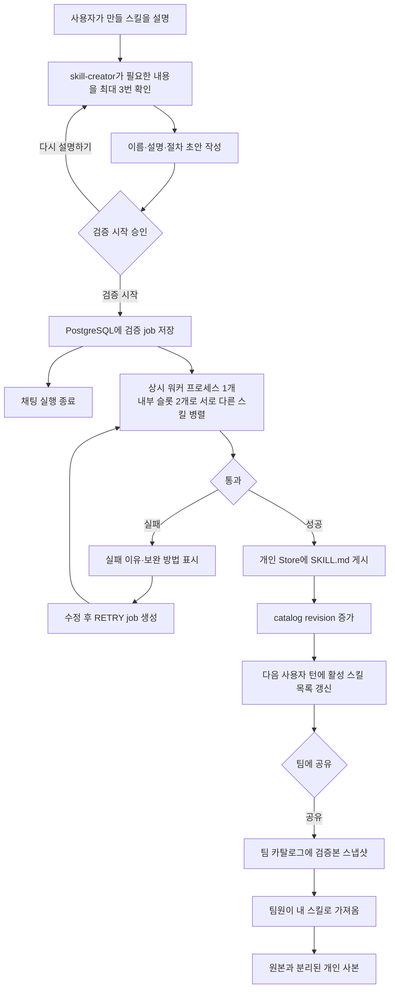

# 스킬 검증·등록 최종 설계

> 기준일: 2026-08-27
> 이 문서는 현재 코드에 반영된 최종 동작을 설명한다. 과거 안과 미구현 계획은 포함하지 않는다.

## 1. 전체 흐름



핵심 원칙:

1. 에이전트가 실행하는 것은 **활성화된 내 스킬과 내장 스킬**뿐이다.
2. 팀 스킬은 실행 공간이 아니라 **공유 카탈로그**다.
3. `검증 시작` 승인은 즉시 등록 승인이 아니다. 백그라운드 검증을 통과해야 `SKILL.md`가 생긴다.
4. 검증은 실제 개인 스킬·문서·외부 시스템을 바꾸지 않는 격리 환경에서 실행한다.
5. 스킬 선택은 공통 소재가 아니라 사용자가 원하는 최종 결과와 설명의 제외 조건을 기준으로 판단한다.

이유: 입력 소재만 비슷한 다른 업무에서 스킬을 읽는 오발동을 막기 위해서다.

## 2. 스킬 공간과 저장

### 공간별 역할

- **내장 스킬**: `skill-creator`처럼 플랫폼이 제공한다. 사용자가 수정·삭제할 수 없고, 예약된 이름은 개인·팀 스킬 이름으로 사용할 수 없다.
- **내 스킬**: 직접 만든 스킬과 팀에서 가져온 독립 사본을 보관한다. 활성화·비활성화·수정·삭제할 수 있다. 가져온 사본은 다시 공유할 수 없다.
- **팀 스킬**: 검증된 개인 스킬을 나누는 카탈로그다. 활성 상태가 없고 실행 source에 포함하지 않는다. 공유자는 중지, 팀장은 삭제할 수 있으며 이미 가져간 사본은 유지된다.

### Store namespace

```text
내장:        ("skill", "builtin")
활성 개인:   ("skill", "personal", account_id)
비활성 개인: ("skill", "inactive-personal", account_id)
팀 카탈로그: ("skill", "team", team_id)
```

활성 토글은 하나의 `SKILL.md`를 활성·비활성 namespace 사이에서 이동한다. 기존 활성 namespace의 `metadata.enabled=false` 파일도 자동 이관한다.

위 경로는 로컬 파일 경로가 아니라 `StoreBackend`가 제공하는 가상 경로다. 실제 `SKILL.md` 원문은 LangGraph `PostgresStore`의 `store` 테이블에 namespace와 key로 저장되며 로컬 디스크에는 쓰지 않는다. 운영 `SkillsProvider`는 모든 스킬 route에 같은 `PostgresStore` 인스턴스를 명시적으로 연결하며, runtime의 암묵적 backend 선택에 기대지 않는다.

이유: 웹·워커·여러 서버가 동일한 스킬 정본을 공유하고 계정·팀 namespace로 접근을 격리하기 위해서다.

### `SKILL.md`

하나의 Markdown 파일이 정본이다. `SkillDocument` parser/renderer는 `name`, `description`, 본문뿐 아니라 `allowed-tools`, `license`, `compatibility`, 추가 metadata와 알 수 없는 frontmatter를 손실 없이 보존한다.

- 플랫폼 `skill-creator`는 `allowed-tools`를 새로 생성하지 않는다.
- 업로드한 파일의 `allowed-tools`는 지우지 않는다.
- 스킬은 특정 에이전트에 속하지 않는다. `allowed-tools`는 도구를 에이전트에 추가하지 않는다. 실행 에이전트에 실제로 있는 도구만 호출하며, 필요한 도구가 없으면 본문의 대체 절차를 따르거나 가능한 범위와 제한을 안내한다.
- `status`, job ID, 평가 결과, 실패 이유는 `SKILL.md`가 아니라 job DB에 저장한다.

## 3. 초안 작성과 등록 계약

### `skill-creator`

`스킬 만들어줘`는 해당 업무를 지금 실행하라는 요청이 아니다. 스킬의 명세를 작성하는 과정이다.

- 맡을 일과 사용 조건
- 필요한 입력과 원하는 결과
- 처리 기준·예외·금지 행동
- 인접한 다른 작업과 구분할 기준

이미 대화에 답이 있는 내용은 다시 묻지 않는다. 가장 큰 모호함부터 일상적인 말로 한 번에 하나씩, 최대 3번만 묻는다. 실제 메일 수신자·번역할 문장처럼 현재 업무의 입력값을 요구하지 않는다.

### `skill_register`

`skill_register`는 Store 파일 쓰기 도구가 아니라 **개인 스킬 검증 job 생성 도구**다.

- `scope` 선택과 TEAM 직접 등록은 없다.
- HITL 카드는 `등록`이 아니라 `검증 시작`으로 표시한다.
- 반환값에 Store path를 넣지 않고 `job_id`, `status`, `stage`, 안내 문구를 넣는다.
- job 생성 후 채팅은 검증 시작을 알리고 종료한다. 완료된 LangGraph 실행을 백그라운드 결과로 재개하지 않는다.

### 공개 쓰기 경로

다음은 모두 `SkillRegistrationService.enqueue()`를 거친다.

- 채팅 `skill_register`
- 설정의 직접 작성
- `SKILL.md` 업로드
- 기존 스킬 설명·본문 수정

활성 토글과 삭제는 즉시 처리한다. 본문 수정과 활성 변경을 한 요청에 섞으면 거절한다. `POST /api/teams/skills/`, TEAM PATCH, `skill_register(scope=TEAM)`은 허용하지 않는다.

## 4. job, 워커, 상태

검증 job은 StoreBackend·StateBackend가 아니라 서비스 PostgreSQL의 `skill_registration_job`에 저장한다. 초안은 성공 게시 전까지 job에만 있으며 UPDATE가 실패해도 기존 `SKILL.md`는 바뀌지 않는다.

### `status`

| 값 | 의미 |
| --- | --- |
| `QUEUED` | 워커를 기다린다. |
| `RUNNING` | 워커가 처리 중이다. |
| `SUCCEEDED` | 검증과 개인 `SKILL.md` 게시가 끝났다. |
| `FAILED` | 형식·품질·시스템 오류로 종료됐다. |
| `CANCEL_REQUESTED` | 안전한 중단 지점을 기다린다. |
| `CANCELED` | 취소가 완료됐다. |

### 화면용 5단계

| 순서 | stage | 주요 작업 |
| --- | --- | --- |
| 1 | `WAITING` | job 저장, 워커 할당 |
| 2 | `CHECKING` | 형식, 이름 충돌, 환경 snapshot |
| 3 | `PREPARING_TESTS` | 질문 생성, 구조·의미 검토, suite 고정 |
| 4 | `TESTING` | 12개 질문×3회 실행, 질문별 다수결, 대표 3건 행동 검증 |
| 5 | `PUBLISHING` | hash·환경 재확인, Store 게시 |

화면은 5단계만 보여 주고 현재 작업은 `progress_message` 및 `18/36`같은 수치로 따로 표시한다. 모델의 내부 사고과정은 저장·노출하지 않는다.

### 워커와 제한

```text
python manage.py skill_validation_worker
```

- 로컬·AWS Docker Compose에는 `skill-validation-worker` 프로세스를 1개만 상시 실행한다. 프로세스 내부 실행 슬롯 2개가 계정과 관계없이 이름이 다른 job을 병렬 처리한다.
- `FOR UPDATE SKIP LOCKED`, lease, job heartbeat로 중복 실행과 워커 중단을 복구한다.
- 같은 스킬의 열린 job은 계정·이름 기준으로 하나만 허용하므로 같은 스킬 수정 두 건을 병렬 게시하지 않는다.
- worker heartbeat가 없거나 `QUEUED`가 60초 이상이면 UI에 지연 이유를 표시한다.
- 기본 제한은 계정당 열린 job 2개, 팀당 `RUNNING` 4개, provider 동시 6개·120 RPM, job당 모델 60회다.
- 개별 실행은 30초, job 전체는 5분으로 제한한다.
- job 스키마 배포 후 PostgreSQL cached plan 충돌을 피하려면 웹과 워커를 재시작한다.

이유: 별도 프로세스를 여러 개 운영하지 않으면서 I/O 중심 검증을 병렬화하고, 동일 스킬 충돌은 계정·이름 유니크 제약과 게시 직전 hash 검사로 막기 위해서다.

## 5. 검증 엔진

### 5.1 기본 검사

LLM 호출 전에 이름 규칙·예약 이름, 설명·본문 크기, CREATE 충돌, UPDATE 수정 전 hash, catalog/runtime/tool snapshot을 코드로 확인한다.

이름 충돌은 평가 전에 `SKILL_NAME_CONFLICT`로 종료한다. 초안 내용을 본 모델이 대체 이름 2~3개를 제안하되 자동으로 바꾸지 않는다.

`allowed-tools`는 필수 의존성으로 검사하거나 에이전트에 도구를 주입하지 않는다. 질문 생성기에는 특정 에이전트가 아닌 플랫폼 전체 내장·팀 MCP 도구 설명을 동적으로 제공하고, 검증 실행에서는 케이스가 필요로 하는 도구를 stub으로 제공한다.

### 5.2 질문 생성·검토·suite

생성 모델은 긍정 8개와 부정 8개 후보를 만든다.

- 긍정: 직접 3, 바꿔 말함 3, 합성 문맥·문서 2
- 부정: 인접한 다른 의도 3, 본문이 명시적으로 제외한 경계 2, 다른 스킬·일반 답변 3

생성 프롬프트는 후보 `SKILL.md`, 도구, 다른 스킬을 명령이 아닌 신뢰할 수 없는 데이터로 분리한다. 코드는 개수·category·schema·fixture·중복·길이·정답 힌트·도구 이름·식별정보 모양을 확인한다.

별도 의미 reviewer가 긍정 적합성, 어려운 부정 질문, fixture, 기대값, 자연스러움을 `PASS|FAIL|UNCERTAIN`으로 판정한다. 부족하면 최대 2번 재생성하며 마지막 검토 후 사용하지 않을 질문을 또 만들지 않는다.

부정 질문은 후보 스킬이 요청의 어느 부분에도 정당하게 쓰이지 않아야 한다. 후보의 사용 조건을 완전히 만족하는 하위 요청에 다른 업무를 덧붙인 다중 의도 요청은 부정 사례로 만들지 않는다. 이 경우 후보도 일부 작업에 쓰는 것이 맞기 때문이다.

부정 질문은 하나의 평가 목적만 가져야 한다. “후보 스킬의 결과도 만들고 다른 결과도 함께 만들어 달라”는 복합 요청이나, 실행에 필요한 입력만 빠져 있어 스킬이 되물어야 하는 요청은 부정으로 인정하지 않는다. 생성기가 이런 질문을 만들면 의미 reviewer가 거절하고 다시 생성한다. 생성된 평가 문장을 사용자가 매번 검수하게 하지 않으며, 사용자는 최초 초안에서 스킬이 맡을 업무 범위만 정한다.

최종 suite는 정확히 긍정 6개·부정 6개다. 승인된 회귀 사례, 부정 플랫폼 probe, 생성 후보 순으로 채우고 `candidate_hash + dataset_version`으로 결정적으로 선택한다.

### 5.3 격리 실행

평가용 미니 에이전트는 운영 `AgentRuntimeFactory`, Root 프롬프트, Skills middleware, 모델 해석을 재사용한다.

- 후보, **활성** 개인 distractor, 내장 스킬을 새 `InMemoryStore`에 복사한다.
- 비활성 개인·팀 카탈로그는 포함하지 않는다.
- 후보·distractor·내장 `SKILL.md`의 frontmatter를 보존한다.
- 모든 업무 도구는 운영과 같은 이름·인자 schema를 가진 stub으로 교체한다.
- 합성 첨부 문서는 현재 요청의 명시적인 첨부 블록과 문서 조회 stub 양쪽에 제공한다. 따라서 도구를 쓰지 않는 번역·요약 스킬도 존재하지 않는 첨부를 보지 않는다.
- 읽기는 합성 fixture를 반환하고 쓰기·전송·삭제는 실제 시스템을 바꾸지 않는다.
- side-effect 도구는 운영 HITL middleware와 인메모리 checkpointer로 승인·거절을 재생한다.
- 각 반복은 새 세션·checkpointer·recorder를 사용한다.

### 5.4 라우팅·행동·점수

라우팅은 12개 질문을 각 3회, 총 36회 실행한다. 후보 `SKILL.md`를 읽은 trace만 활성로 세고 예상 도구만 부른 것은 활성로 보지 않는다. 한 번의 확률적 흔들림을 스킬 전체 실패로 만들지 않도록 각 질문은 3회 중 2회 이상 나온 결과를 그 질문의 최종 결과로 확정한다. 2회 이상 같은 결과가 없으면 그 질문은 유효하지 않은 실행으로 처리한다.

행동 테스트는 직접 요청, 문서·문맥, 가장 복잡한 요청을 우선하되 서로 겹치면 나머지 긍정 케이스로 채워 **서로 다른 3건**을 실행한다. 필수·금지 도구, 횟수, 인자, 순서, HITL, timeout을 코드로 판정한다. 제한된 자연어 reviewer에는 assertion과 최종 답변뿐 아니라 원래 대화 메시지·합성 문서·도구 trace도 함께 제공해, 입력 보존 여부를 실제 자료와 비교하게 한다.

자연어 reviewer가 `UNCERTAIN`을 반환한 assertion은 한 번만 독립 재검토한다. 첫 판정이 명확한 `PASS|FAIL`은 다시 뽑지 않고, 두 번째도 불확실하면 보수적으로 실패 처리한다. 이 재검토를 포함해도 job당 모델 호출 상한을 넘지 않는다.

통과 기준:

- recall = 활성된 긍정 질문 / 유효한 긍정 질문 ≥ 0.80
- precision = 올바르게 활성된 긍정 질문 / 후보가 활성된 전체 질문 ≥ 0.80
- false activation rate = 활성된 부정 질문 / 유효한 부정 질문 ≤ 0.20
- deterministic forbidden-tool assertion 전부 통과
- behavior pass rate ≥ 0.80
- fixture·stub 누락 0건

provider 오류, 용량 대기, 예산 초과, timeout은 스킬 품질 실패와 구분한다.

recall 1.00은 “이번 긍정 질문 6개가 모두 질문별 다수결에서 활성됐다”는 뜻일 뿐, 실서비스의 모든 표현을 일반화했다는 뜻이 아니다. 아무 질문에서나 후보가 활성되는 문제는 precision과 false activation rate가 잡는다. 같은 `SKILL.md`에서 생성된 질문만으로 과적합 여부를 확정하지 않도록 플랫폼 고정 probe와 승인된 실제 회귀 사례를 함께 사용한다.

## 6. 게시, 동시 수정, RETRY

워커는 Store 쓰기 직전에 다시 확인한다.

1. job의 초안 전체 hash
2. UPDATE의 기존 스킬 실행 내용 hash
3. catalog revision, runtime profile, Tool Registry version
4. CREATE 이름 충돌

실행 내용 hash는 본문과 frontmatter를 포함하되 `enabled`, 공유·가져오기 출처, receipt 같은 저장 metadata는 제외한다. 따라서 `allowed-tools` 변경은 동시 수정으로 탐지하고 토글·공유만으로 검증을 무효화하지 않는다.

- CREATE는 활성 개인 namespace에 생성한다.
- UPDATE는 수정 전 활성·비활성 상태를 유지한다.
- `FAILED|CANCELED`만 RETRY할 수 있고 `retry_of_job_id`, `attempt`를 남긴다.
- CREATE 계보 RETRY는 기존 이름을 가리켜도 UPDATE로 바뀌지 않고 충돌로 막는다.
- UPDATE 계보 RETRY는 이름을 바꿀 수 없다.
- 실패 수정 창을 열거나 보완 대화를 시작한 것만으로 실패 기록을 지우지 않는다. 사용자가 보완 초안의 등록을 승인하고 새 RETRY job 생성까지 성공하면 부모 실패를 새 진행 작업으로 교체한다.
- 대기 중 다른 스킬 등록으로 catalog revision만 바뀌면 `CHECKING`에서 최신 revision으로 자동 갱신하고 계속한다. 테스트 중 runtime profile이나 Tool Registry 계약이 바뀐 경우에만 `STALE_EVAL_CONTEXT`로 멈추며, 재시도는 최신 환경에서 전 과정을 다시 실행한다.

이유: 활성 스킬 목록이 달라지면 후보와 경쟁하는 스킬도 달라져 이전 테스트 결과를 그대로 신뢰할 수 없기 때문이다.

## 7. 팀 공유과 가져오기

검증 receipt가 현재 개인 파일의 실행 hash와 일치하는 직접 생성 스킬만 공유할 수 있다. 팀 snapshot은 내용·frontmatter, validation hash, source job/revision, runtime/tool version, 공유자를 포함한다.

- 공유 중 원본의 새 버전이 검증을 통과하면 팀 snapshot을 갱신한다.
- 이미 가져간 사본은 자동 갱신하지 않는다.
- 공유 중지 후 재공유하면 현재 검증본으로 새 snapshot을 만든다.
- `VERIFIED` 내용 hash와 runtime/tool receipt가 호환되면 활성 개인 사본으로 즉시 가져온다.
- 레거시, hash 불일치, 환경 불일치는 즉시 쓰지 않고 개인 검증 job을 만든다.
- 가져온 사본은 출처를 남기고 재공유를 막는다.
- 가져온 사본을 삭제하면 팀 카탈로그에서 다시 등록할 수 있다.

## 8. UI와 실패 복구

### 진행·상세

- 전역 `SkillJobCenter`가 오른쪽 아래에 5단계를 한 줄로 보여 주고 `자세히보기`로 해당 상세를 연다.
- 화면 이동·새로고침 후에도 열린 job을 복원한다.
- 설정 목록은 진행·실패 job과 성공해 게시된 스킬을 구분한다.
- raw JSON과 내부 지표 이름 대신 실패 이유·보완 방법만 자연어로 보여 준다.
- 실패 이유의 설명과 대표 요청은 줄바꿈·글머리표로 분리한다.
- 실패 패널은 진한 빨간 면 대신 중립 배경, 충분한 간격, 왼쪽 오류 선으로 정리한다.
- 수정 창은 기존 이름·설명·본문을 먼저 보여 주고 현재 부족한 내용을 구체적인 질문으로 안내한다.
- 오발동 실패의 `현재 초안에 부족한 내용`은 대표 요청을 반복하지 않고 `현재 설명만으로 다음 요청과의 차이를 구분하지 못했습니다.` 한 문장만 표시한다.
- 보완 대화나 등록 확인을 취소하면 실패 기록을 유지한다. RETRY job 생성이 성공한 뒤에만 부모 실패를 스킬 목록과 하단 진행 카드에서 제외한다. DB의 부모 행은 재시도 계보를 위해 보존한다.

### 스킬 목록

- `활성화된 스킬`, `내 스킬`, `팀 스킬` 탭을 제공한다.
- 팀 탭에 `등록된 스킬`, `내가 공유한 스킬` 필터를 제공한다.
- 공유 버튼이 없는 가져온 스킬도 같은 열 공간을 예약해 모든 활성 토글을 같은 세로선에 맞춘다.
- 좁은 화면에서도 고정 열 크기를 줄이되 정렬을 유지한다.

## 9. 회귀 평가 데이터

채팅 답변 아래에는 `스킬 사용이 맞지 않아요`, `필요한 스킬이 빠졌어요` 같은 신고 문구나 버튼을 노출하지 않는다. 모든 답변에 고정 노출하면 실제 스킬 판정 결과로 오해되고, 스킬을 쓰지 않아야 하는 일반 대화의 QA 증거로도 사용할 수 없기 때문이다. QA는 화면 문구가 아니라 실행 trace에서 후보 `SKILL.md`를 실제로 읽었는지로 판정한다.

회귀 사례 저장소와 운영자 검토 API는 유지한다. 현재 승인 사례는 운영자가 식별정보를 제거해 직접 등록·검토하며, 채팅 UI에서 자동 수집하지 않는다.

- 원문을 회귀 DB에 복사하지 않고 message/session 참조, 관찰된 스킬, trace hash, 메모만 저장한다.
- 운영자가 식별정보를 제거한 실행 가능한 케이스로 전환한다.
- 코드가 이메일·전화번호·토큰·내부 ID 패턴, 크기·메시지 수, fixture schema를 재검사한다.
- `APPROVED`만 suite에 사용한다.
- 적용 우선순위는 같은 팀의 exact skill name → 같은 팀의 capability tag → GLOBAL이다. 다른 팀의 같은 이름 사례는 누출하지 않는다.
- GLOBAL은 team/skill이 없고, TEAM은 team만, SKILL은 skill과 선택적 team 경계를 가진다. DB CHECK와 API가 강제한다.

신고와 `DRAFT|REJECTED`는 기본 90일 후 정리하고 `APPROVED`는 데이터셋으로 유지한다.

## 10. API·카탈로그 갱신·보존

### 주요 API

```text
GET    /api/skill-registration-jobs/
GET    /api/skill-registration-jobs/?open=true
GET    /api/skill-registration-jobs/{job_id}/
POST   /api/skill-registration-jobs/{job_id}/retry/
POST   /api/skill-registration-jobs/{job_id}/cancel/
DELETE /api/skill-registration-jobs/{job_id}/

POST   /api/me/skills/{name}/share/
DELETE /api/me/skills/{name}/share/
POST   /api/teams/skills/{name}/import/
DELETE /api/teams/skills/{name}/

POST   /api/chat/messages/{message_id}/skill-feedback/  # 내부 호환 API, 현재 채팅 UI에서 호출하지 않음
GET|PATCH /api/ops/skill-eval-feedback/...
GET|POST|PATCH /api/ops/skill-eval-regression-cases/...
```

job API는 본인 계정, 팀 관련 API는 팀·공유자·팀장 권한, 회귀 평가 API는 운영자 권한을 서버에서 다시 확인한다.

### 카탈로그 갱신

기존 `SkillRegisterSyncMiddleware`는 제거한다. job 생성 즉시에는 파일이 없기 때문이다.

`SkillCatalogRefreshMiddleware`는 개인 `catalog_revision`과 세션 state를 비교한다. 첫 턴은 기존 스캔을 재사용하고, revision이 같으면 Store I/O를 하지 않으며, 변경된 다음 턴에 활성 개인 metadata를 다시 읽는다.

실행 source와 명시적 `/{skill-name}` 탐색 대상은 내장·활성 개인뿐이다.

### 보존·배포

- `SUCCEEDED` job 본문·trace는 기본 30일 후 비식별화하고 hash·version·점수를 남긴다.
- `FAILED|CANCELED`는 기본 30일 후 삭제한다.
- 내부 피드백 기록과 미승인 회귀 사례는 기본 90일 후 삭제한다.
- `cleanup_skill_validation_jobs [--dry-run]`으로 정리한다.
- 배포 전 `_apply.py --check`로 테이블·컬럼·제약·중요 타입을 확인한다.
- 기존 DB의 `skill_registration_job.operation`도 `RETRY`를 저장할 수 있는 `VARCHAR(10)`인지 확인한다.
- job 스키마 변경 배포 후 웹과 워커를 재시작한다.

## 11. 완료 판단 기준

다음을 모두 만족해야 완료로 판단한다.

- 검증을 거치지 않고 새 개인·팀 본문을 게시하는 공개 경로가 없다.
- 비활성 스킬은 Root·GP·명시 호출에서 제외된다.
- 본문과 frontmatter가 생성·수정·토글·공유·가져오기에서 손실 없이 보존된다.
- timeout·취소·워커 장애·provider 용량·비용 초과가 무한 대기나 품질 실패로 오분류되지 않는다.
- 합성 문맥·문서, 도구 인자·순서·횟수, HITL, 자연어 결과를 격리 검증한다.
- 초안·기존 스킬·catalog·runtime·Tool Registry가 바뀌면 오래된 결과로 게시하지 않는다.
- 팀 공유·가져오기가 receipt 호환성과 독립 사본 원칙을 지킨다.
- 실패 수정·취소·삭제·RETRY 계보가 UI와 API에서 일관되게 동작한다.
- 집중 테스트, 전체 백엔드 테스트, 프런트 build, DB schema check, 워커 heartbeat, 실제 모델 E2E job을 확인한다.

## 12. 필수 회귀 테스트 범위

- 개인 직접 작성·업로드·수정·채팅 등록의 job 생성과 TEAM 우회 차단
- 중복 job, 계정·팀 권한, idempotency, 취소·삭제·RETRY
- CREATE·UPDATE·RETRY 이름 충돌, 동시 수정, 활성 상태 보존
- 실행 frontmatter 변경과 저장 metadata를 구분하는 hash
- 비활성·팀 카탈로그의 Root·GP·`/skill-name` 제외
- 팀 receipt, 레거시 재검증, 공유·중지·재공유·가져오기·독립 사본
- 질문 생성·구조·의미 검토·결정적 suite·probe·승인 회귀 사례
- 활성 distractor만 복사되고 모든 frontmatter가 보존되는 격리 환경
- 모든 도구 stub, fixture fallback 차단, 연속 HITL, 인자·순서·횟수·금지 판정
- 12×3회 라우팅, 서로 다른 대표 행동 3건, timeout·예산·provider 제한
- 회귀 사례 원문 미복사, 식별정보 검사, scope 테넌트 경계, 승인 전 suite 제외
- 진행 상세, 실패 자연어, 수정 확정 전 기록 유지, 목록 새로고침
- 일반 채팅에서 스킬 신고 문구가 노출되지 않고, QA가 `SKILL.md` 읽기 trace만 사용하는지
