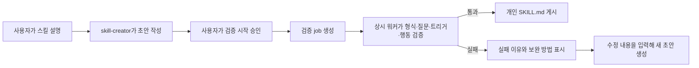

# 스킬 검증·등록 구현 현황

> 기준일: 2026-08-27  
> 정본 설계: [03_스킬_검증_등록_설계.md](03_스킬_검증_등록_설계.md)  
> 이 문서는 설계 문장의 완료 여부가 아니라 **현재 코드에서 실제로 동작하는 범위**를 기준으로 작성한다.

## 1. 현재 결론

스킬 등록의 핵심 종단 흐름은 구현되어 있다.



현재 다음 흐름은 실제 코드로 연결되어 있다.

- 채팅과 `설정 > 스킬 > 새 스킬`에서 스킬 초안을 만든다.
- `skill_register` 승인은 즉시 등록이 아니라 백그라운드 검증 job을 생성한다.
- Docker Compose의 상시 워커가 job을 가져가 5단계를 진행한다.
- 긍정·부정 질문 생성, 의미 검토, 격리 에이전트 반복 실행, 트리거 지표와 기본 행동 규칙 채점을 수행한다.
- 통과한 스킬만 개인 스킬 저장소에 게시한다.
- 실패하면 오른쪽 아래 진행 창과 설정 화면에서 자연어 실패 이유와 보완 방법을 확인할 수 있다.
- 실패 상세에서 `수정`을 누르면 기존 초안과 실패 원인에 맞춘 보완 질문을 함께 볼 수 있다. 취소하면 실패 기록은 유지되고, `다시 만들기`를 확정하면 보완 초안을 RETRY job으로 연결한다.
- 설정에서 새로 작성하거나 `SKILL.md`를 업로드하고, 기존 설명·본문을 수정할 때도 즉시 저장하지 않고 같은 검증 job을 거친다. 활성화 토글과 삭제만 즉시 처리한다.
- 게시된 개인 스킬은 활성화·비활성화할 수 있고, 팀 카탈로그에 공유하거나 팀 스킬을 개인 스킬로 가져올 수 있다.
- 비활성 스킬은 별도 namespace로 이동해 Root와 GP의 스킬 source에서 원천 제외된다. 기존 `enabled=false` 파일도 에이전트 조립 전에 자동 이관된다.
- 업로드·수정·검증 게시 과정에서 `license`, `compatibility`, `allowed-tools`, 추가 metadata와 사용자 정의 frontmatter를 손실 없이 보존한다.
- 팀 카탈로그는 개인 스킬 공유로만 채워진다. 팀장도 공개 TEAM POST/PATCH로 직접 생성·수정할 수 없다.

팀 검증 영수증, 워커 운영 안전장치, 평가 데이터 운영 경로까지 구현했다. 공개 등록·수정·공유 경로와 실패·취소·재검증 경로를 자동 테스트했고, 전체 백엔드 테스트와 프런트 빌드, 실제 PostgreSQL job을 확인했다. 현재 판단은 **최종 설계 구현 완료**다.

## 2. 상태 표시 기준

| 표시 | 의미 |
| --- | --- |
| ✅ 완료 | 설계의 핵심 동작이 코드와 테스트에 반영됨 |
| 🟡 부분 완료 | 기본 동작은 있으나 설계 일부 또는 운영 안전장치가 빠짐 |
| ❌ 미완료 | 설계된 경로가 없거나 기존 우회 경로가 남아 있음 |
| 🔴 우선 수정 | 이미 만든 기능에서 기능·권한·격리 문제가 발견됨 |

## 3. 설계 절별 구현 현황

| `03` 절 | 상태 | 현재 구현 | 남은 일 |
| --- | --- | --- | --- |
| §1 개인·팀 공간 | ✅ | 개인 스킬만 실행하고 팀 스킬은 가져오기용 카탈로그로 사용한다. 활성·비활성 개인 스킬은 별도 namespace에 있고, 기존 false 파일은 에이전트 조립 전에 자동 이관한다. Root와 GP는 활성 source만 받는다. | 없음. |
| §2 TEAM 직접 등록 제거 | ✅ | `TeamSkillListCreateAPIView.post()`와 `TeamSkillDetailAPIView.patch()`를 제거했다. 팀원·팀장 모두 공개 TEAM POST/PATCH에서 `405`를 받고, 개인 스킬 공유로만 팀 카탈로그를 채운다. | 없음. 공유·공유 중지·팀장 삭제 권한을 유지한다. |
| §3 공유·가져오기 | ✅ | 공유, 공유 중지, 개인 사본 가져오기, 가져온 스킬 삭제 후 재등록, 가져온 사본 재공유 차단, 팀장 삭제가 구현되어 있다. 검증 영수증과 `LEGACY_UNVERIFIED`, 원본 revision, 실행 환경 호환성도 확인한다. | 없음. |
| §4 `SKILL.md` 저장 | ✅ | 공통 `SkillDocument`가 하나의 `SKILL.md`를 읽고 쓴다. name·description·본문뿐 아니라 `license`, `compatibility`, `allowed-tools`, 추가 metadata와 알 수 없는 frontmatter도 업로드·수정·게시·공유에서 보존한다. | 없음. |
| §5 등록 계약·skill-creator | ✅ | `skill_register`에서 scope와 즉시 저장 경로를 제거했다. 반환값은 job 상태이며 승인 문구도 `검증 시작`으로 바뀌었다. creator는 최대 3번까지 사용 조건·비사용 조건·출력·규칙을 묻는다. `allowed-tools`는 새로 강제 생성하지 않고 업로드 원문에 있으면 보존한다. 평가 질문 생성기는 플랫폼 전체 내장 도구 목록을 참고한다. | 없음. |
| §6 채팅과 백그라운드 경계 | ✅ | 채팅은 검증 시작 승인까지만 담당하고 완료 결과는 전역 진행 창과 설정 화면에서 확인한다. 다른 채팅·화면으로 이동해도 job은 계속 실행된다. | 없음. 이 비동기 경계를 유지해야 한다. |
| §7 status·5단계 stage | ✅ | `QUEUED/RUNNING/SUCCEEDED/FAILED/CANCEL_REQUESTED/CANCELED`와 화면용 5단계를 저장한다. 오른쪽 아래 진행 창은 5단계를 한 줄로 표시한다. | 내부 세부 단계가 필요해도 사용자 화면 단계는 5개를 넘기지 않는다. |
| §8 검증 엔진 | ✅ | 질문 생성, 구조·의미 검사, 6+6 suite, 격리 실행, 문서 fixture, 모든 업무 도구 stub, 연속 HITL, 인자·순서·횟수 검사, 자연어 결과 reviewer, 3회 반복, 6개 동시 실행, 단일 30초·전체 5분 제한을 구현했다. 사용자 신고를 운영자가 익명 회귀 사례로 전환·승인하면 이후 suite에 편입한다. | 없음. |
| §9 job DB | ✅ | job, lease, heartbeat, 취소, 실패 정보, 평가 결과, 후보 문서, runtime/tool/catalog snapshot, RETRY 부모와 attempt를 저장한다. | 없음. |
| §10 워커 | ✅ | management command와 로컬/AWS Docker Compose 상시 서비스가 있다. `FOR UPDATE SKIP LOCKED`, lease 회수, heartbeat, 취소 확인, 전체 5분 제한, 오래된 QUEUED 안내, 계정·팀·provider·job별 제한을 구현했다. | 없음. |
| §11 게시·실패·동시성 | ✅ | 후보·기존 내용 hash와 runtime/tool/catalog snapshot을 게시 직전 재확인하고 변경되면 `STALE_EVAL_CONTEXT`로 막는다. CREATE/UPDATE/RETRY 게시와 활성 namespace 보존이 구현되어 있다. | 없음. |
| §12 카탈로그 갱신 | ✅ | 기존 `SkillRegisterSyncMiddleware`는 제거했다. `SkillCatalogRefreshMiddleware`는 `catalog_revision`이 바뀐 턴에만 활성 개인 스킬 source를 다시 읽는다. | 없음. |
| §13 UI | ✅ | 실패 유형을 자연어로 안내하고 수정·그대로 재검증을 구분한다. 후보 원문 전체 보기, 내용 기반 이름 대안, 오래 대기 중 안내, 사용자 답변 단위 스킬 사용 신고를 제공한다. | 없음. |
| §14 API | ✅ | job·retry·공유 API에 더해 답변 신고 API와 운영자 전용 신고 조회·기각·익명 회귀 사례 초안·수정·승인·거절 API가 있다. 원문은 회귀 DB에 자동 복사하지 않고 운영자 승인 전에는 suite에 들어가지 않는다. | 없음. |
| §15 구현 순서 | ✅ | P0~P3 구현과 운영 안전장치를 반영했다. | 없음. |
| §16 테스트 | ✅ | 관련 API·서비스·평가·권한·마이그레이션 테스트, 전체 백엔드 테스트, 실제 job, 프런트 빌드를 수행했다. | 공급자 정책이 바뀔 때 운영 점검을 반복한다. |

## 4. 완료된 구현

### 4.1 등록 계약과 백그라운드 job

- `skill_register`는 개인 스킬 검증 job만 만든다.
- 같은 계정·같은 이름의 열린 job 중복을 DB와 서비스에서 막는다.
- 반환값은 `job_id`, `status`, `stage`, 안내 메시지이며 등록 경로를 즉시 반환하지 않는다.
- 채팅 실행은 job 생성 후 끝나며 백그라운드 완료 시 채팅을 억지로 재개하지 않는다.
- 후보 초안은 게시 전까지 job DB에 있고 통과 시에만 Store의 개인 `SKILL.md`로 이동한다.

### 4.2 검증 파이프라인

`services/agent_runtime/skills/evaluation/`에 다음이 구현되어 있다.

- `generator.py`: 긍정 8개·부정 8개 후보 생성, JSON 구조 검사와 재생성
- `semantic_reviewer.py`: 질문 의미 품질 검토
- `platform_probes.py`, `platform_probes.v1.yaml`: 플랫폼 고정 부정 질문
- `backend/db/skill_eval.py`: 실제 오발동 회귀 사례 저장소
- `suite.py`: 최종 긍정 6개·부정 6개 조합
- `ephemeral_skills.py`: 후보 스킬과 방해 스킬을 임시로 구성
- `stub_tools.py`: 실제 schema를 유지하되 실행 handler는 stub으로 교체
- `harness.py`: 운영 AgentRuntimeFactory 기반 격리 실행
- `scoring.py`: 재현율·정밀도·오발동률·기본 행동 통과율 계산
- `pipeline.py`: PREPARING_TESTS와 TESTING 전체 오케스트레이션

각 라우팅 질문은 기본 3회 실행하며 최대 6개를 동시에 처리한다. 쓰기·전송·삭제 도구도 테스트에서는 실제 외부 동작을 수행하지 않는다. 이 제한은 **검증 테스트에만** 적용되며 게시된 실서비스 스킬은 사용자 승인과 실제 권한 아래에서 정상 도구를 사용할 수 있다.

### 4.3 워커와 장애 회수

- `python manage.py skill_validation_worker` 명령이 있다.
- 로컬과 AWS Compose에 `skill-validation-worker` 서비스가 등록되어 있다.
- 여러 워커가 동시에 떠도 `FOR UPDATE SKIP LOCKED`로 같은 job을 중복 처리하지 않는다.
- lease와 heartbeat로 죽은 워커의 job을 다시 회수한다.
- 단계 사이에 취소 요청을 확인한다.
- DB 컬럼 변경 뒤 기존 워커 연결에서 `cached plan must not change result type`이 발생할 수 있으므로, **스킬 job 스키마 배포 후 워커를 재시작해야 한다.**

### 4.4 UI와 실패 복구

- 전역 `SkillJobCenter`가 열린 job을 복원하고 상태를 polling한다.
- 화면용 5단계를 한 줄로 표시하고 버튼 문구는 `자세히 보기`를 사용한다.
- 5단계는 유지하면서 그 안에서 워커가 실제 수행 중인 세부 작업을 별도로 보여준다. 반복 테스트는 `18/36`처럼 완료 개수도 함께 표시한다.
- 상세 화면에는 같은 반복 문구를 합친 최근 작업 이력을 최대 5개 보여준다. LLM의 내부 사고과정이 아니라 질문 생성·의미 검토·격리 실행·결과 비교처럼 관찰 가능한 작업만 기록한다.
- 설정 화면에도 진행 중·실패한 job이 실제 개인 스킬과 별도로 보인다.
- 실패 이유는 raw JSON이나 `positive_valid` 같은 내부 필드 대신 사용자 자연어로 보여준다.
- 실패 이유에 맞춰 **현재 빠진 정보가 무엇인지**와 **무엇을 추가해야 하는지**를 구체적인 질문으로 안내한다.
- 실패 상세의 `수정`을 누르면 후보의 기존 이름·설명·본문을 보완 창에 먼저 보여준다. 이 시점에는 실패 job을 삭제하지 않는다.
- 사용자가 보완 창을 취소하면 설정 목록과 하단 진행 창의 실패 기록을 그대로 유지한다.
- 사용자가 보완 내용을 입력하고 `다시 만들기`를 누르면 목록·하단 진행 창에서 부모 실패를 치우고 기존 후보와 보완 내용을 skill-creator에 전달한다. 부모 DB 행은 삭제하지 않고 RETRY 계보로 보존한다.
- 성공하면 목록을 다시 불러와 게시된 개인 스킬이 바로 보인다.
- 취소된 job과 실패한 job의 기록을 삭제할 수 있다.

### 4.5 개인·팀 스킬 UI

- 내 스킬: 활성 필터, 팀에서 가져온 스킬 필터, 활성화·비활성화, 수정·삭제
- 공유 가능한 내 스킬: 공유·공유 중지
- 팀에서 가져온 스킬: 독립 사본이며 공유 버튼이 노출되지 않고 서버에서도 재공유를 거절
- 팀 스킬: 활성 상태를 갖지 않는 카탈로그, 내 스킬로 가져오기, 등록 여부 필터
- 공유자: 자신의 공유를 중지할 수 있음
- 팀장: 팀 카탈로그의 스킬을 삭제할 수 있음
- 공유 중지·팀 카탈로그 삭제 이후에도 이미 가져간 개인 사본은 유지됨
- 가져간 개인 사본을 삭제하면 팀 카탈로그에서 다시 `내 스킬로 등록`할 수 있음

## 5. 완료됐지만 반드시 고쳐야 하는 부분

### ✅ 5.1 비활성 스킬을 실행 source에서 분리함

활성 스킬은 `/skills/personal/`, 비활성 스킬은 `/inactive-skills/personal/` 라우트와 서로 다른 account namespace에 저장한다. `skill_sources()`는 활성 경로만 반환하므로 Root와 GP 모두 비활성 파일을 발견할 수 없다.

- 토글은 파일을 두 namespace 사이에서 이동한다.
- 기존 활성 namespace의 `metadata.enabled=false` 파일은 설정 조회와 에이전트 조립 전에 재실행 가능한 방식으로 자동 이관한다.
- 임시 필터였던 `SkillVisibilityMiddleware`와 관련 테스트는 제거했다.

### ✅ 5.2 공개 저장 경로를 검증 job으로 통일함

다음 공개 경로는 모두 `SkillRegistrationService.enqueue()`를 거친다.

- `MySkillListCreateAPIView.post()`의 직접 작성·파일 업로드
- `MySkillDetailAPIView.patch()`의 본문·설명 수정
- 채팅 `skill_register`

이 경로들은 job만 만들며 워커 검증이 성공하기 전에는 Store를 바꾸지 않는다. 활성화 토글과 삭제만 즉시 처리하고, 본문 수정과 활성 상태 변경을 한 요청에 섞으면 `400`으로 거부한다. TEAM 공개 POST/PATCH도 제거되어 공개 우회 경로는 닫혔다.

### ✅ 5.3 `SKILL.md` round-trip을 완성함

`SkillDocument`를 공통 parser/renderer로 사용한다. 업로드 원문은 job 후보에 frontmatter 전체를 저장하고, 검증 통과 게시·수정·활성 이동·팀 공유와 가져오기에서도 알 수 없는 필드를 포함해 그대로 유지한다. YAML 값은 JSONB에 안전한 문자열·목록·맵으로 읽는다.

### ✅ 5.4 실패 수정과 정식 RETRY 계보를 연결함

`POST /api/skill-registration-jobs/{job_id}/retry/`가 기존 초안 그대로 또는 수정된 초안으로 RETRY job을 만든다. 새 행은 `retry_of_job_id`와 증가한 `attempt`를 저장한다. 수정 창을 취소하면 부모 실패 기록은 유지되고, 다시 만들기를 확정해 보완 초안을 승인하면 부모는 DB에 계보로 보존하되 사용자 목록에서는 새 RETRY만 보여준다. 시스템 오류·timeout·평가 환경 변경은 `그대로 다시 검증`, 내용 품질 실패는 `수정`을 우선 노출한다.

### ✅ 5.5 `catalog_revision` 기반 카탈로그 갱신

`skill_catalog_revision` 테이블을 추가했다. 개인 스킬 생성·검증 게시·수정·토글·삭제 때 revision을 증가시키고, 공유·공유 중지는 개인 실행 카탈로그를 바꾸지 않으므로 증가시키지 않는다. 첫 turn에는 `SkillsMiddleware`가 이미 읽은 결과를 재사용하며 revision만 checkpoint에 심는다. 이후 revision이 같으면 Store I/O가 없고, 달라졌을 때만 활성 source를 다시 읽는다.

## 6. 검증 엔진과 운영 기능

### ✅ 6.1 실행 제한

라우팅 반복과 행동 실행은 각각 30초로 제한하고, 질문 생성부터 게시 직전까지 하나의 5분 deadline을 공유한다. timeout은 품질 실패로 섞지 않고 시스템 실패 그룹으로 기록해 내용 그대로 재검증할 수 있다.

### ✅ 6.2 문서·파일 문맥 fixture

케이스의 합성 문서를 실행별 메모리 fixture로 만들고 `document_list`와 `document_search` stub이 반환한다. 실제 문서 DB나 외부 저장소에는 쓰지 않는다.

### ✅ 6.3 연속 HITL

도구별 승인 fixture를 순서대로 소비하며 interrupt가 끝날 때까지 resume한다. fixture가 없으면 `UNEXPECTED_APPROVAL_REQUEST`, 20회를 넘으면 무한 루프로 실패시킨다.

### ✅ 6.4 행동 검증

필수·금지 도구, 최소·최대 횟수, JSON 경로 기반 equals/not-equals/contains/exists/regex 인자 규칙과 필수 도구 순서를 코드로 검사한다. 생성기는 긍정 케이스마다 결과 assertion을 만들며 별도 `BehaviorSemanticReviewer`가 최종 자연어 답을 PASS/FAIL/UNCERTAIN으로 판정한다. 결정적 도구 실패는 reviewer가 뒤집을 수 없다.

실제 E2E에서 올바른 번호 목록 결과를 reviewer가 `UNCERTAIN`으로 판정한 원인을 추적해 보니, 입력 보존 여부를 묻는 assertion과 달리 reviewer payload에는 원래 사용자 입력이 빠져 있었다. 원래 대화 메시지·합성 문서·도구 trace를 함께 제공하도록 고쳤고, 그래도 불확실한 assertion만 한 번 독립 재검토한다. 명확한 PASS/FAIL은 재검토하지 않으며 두 번째도 불확실하면 실패를 유지한다.

### ✅ 6.5 평가 환경 snapshot과 stale 판정

job 생성 때 개인 catalog 내용 revision, runtime profile version, Tool Registry version을 저장한다. 게시 직전에 셋을 다시 계산해 하나라도 달라지면 `STALE_EVAL_CONTEXT`로 중단하고 현재 환경에서 RETRY하게 한다. 평가에 실제 사용한 기본 agent/version과 모델·프롬프트·후보/방해 스킬 hash도 기존 재현성 필드에 남긴다.

### ✅ 6.6 실제 오발동 회귀 사례 운영

답변 단위 신고 API와 UI, 운영자 목록·기각·익명 회귀 사례 초안·수정·승인·거절 API를 구현했다. 원문은 자동 복사하지 않고 참조와 hash만 저장하며, 운영자가 식별정보를 제거한 뒤 승인한 사례만 suite에 들어간다. scope별 필드 정합성과 팀 경계는 API와 DB CHECK가 함께 강제한다.

## 7. 팀 스킬 검증 영수증 — 완료

- 기존 팀 항목은 조회 시 한 번만 `LEGACY_UNVERIFIED`로 표시한다.
- 검증 게시물에는 `validation_state`, `validated_hash`, `source_job_id`, `source_revision`, runtime/tool version을 함께 저장한다.
- 현재 개인 파일 hash가 영수증과 일치하는 검증 완료 스킬만 공유할 수 있다.
- 팀 공유본의 영수증·내용 hash·runtime/tool version이 모두 맞으면 독립 개인 사본으로 즉시 가져온다.
- 하나라도 맞지 않으면 개인 Store에 쓰지 않고 일반 검증 job을 만든다. UI는 `검증 후 내 스킬로 등록`으로 안내한다.
- 검증을 통과한 개인 수정은 공유 중인 팀 snapshot과 새 영수증도 함께 갱신한다.

## 8. P0~P3 완료 내역

### P0 — 기능·격리 문제부터 해결

1. ✅ TEAM 직접 POST/PATCH를 제거하고 공유 경로만 허용한다.
2. ✅ 개인 직접 생성·업로드·본문 수정 API를 검증 job으로 통일한다.
3. ✅ inactive namespace와 migration을 구현해 GP의 비활성 스킬 노출 가능성을 없앤다.
4. ✅ `SkillDocument` round-trip을 구현해 frontmatter 손실을 막는다.

### P1 — 검증 결과의 신뢰성 완성

5. ✅ 단일 실행 30초·전체 5분 timeout을 실제 적용했다.
6. ✅ 문서 fixture, 연속 HITL, 인자·순서 규칙, 자연어 결과 품질 검사를 구현했다.
7. ✅ runtime/tool/catalog version snapshot과 `STALE_EVAL_CONTEXT`를 구현했다.
8. ✅ 정식 RETRY API, 계보, 실패 그룹별 버튼을 구현했다.

### P2 — 팀 공유와 운영 안전성

9. ✅ 팀 스킬 검증 영수증과 `LEGACY_UNVERIFIED` 전환을 구현했다.
10. ✅ 워커 heartbeat와 queue 지연 판정, 하단 카드·설정 목록의 자연어 대기 안내를 추가했다.
11. ✅ 계정 열린 job 수, 팀 실행 수, provider 동시성/RPM, job별 모델 호출·예상 비용 예산을 설정 기반으로 제한했다.
12. ✅ 성공 기록 본문·trace 비식별화와 실패·취소 기록 삭제를 수행하는 보존 기간 설정 및 `cleanup_skill_validation_jobs` command를 구현했다.
13. ✅ `catalog_revision`이 달라질 때만 활성 스킬 source를 다시 읽도록 변경했다.

### P3 — 평가 데이터 운영과 UX 마감

14. ✅ 답변 단위 오발동·미사용 신고, 원문 참조·hash 보관, 운영자 수동 익명화, 코드 누출 검사, 초안·승인·거절, 승인 사례의 회귀 suite 편입을 구현했다.
15. ✅ 실패 상세에서 검증 후보 원문 전체를 보고, 이름 충돌 시 후보 내용으로 모델이 만든 유효한 이름 2~3개를 선택할 수 있다. 고정 접미사나 자동 이름 변경은 사용하지 않는다.
16. ✅ 활성 개인·내장 스킬만 허용하는 명시적 `/skill-name`, 비활성·팀 카탈로그 제외, 105개 catalog 갱신, provider별 용량 분리를 자동 테스트한다.
17. ✅ 진단·재검증 command에서 계정·팀·스킬 고정값을 제거하고 필수 인자로 받는다. `SKILL_EVAL_DEBUG_COMMANDS_ENABLED`가 꺼진 환경에서는 실행을 거부한다.

## 9. 테스트 현황

### 확인된 결과

- 평가 질문 생성·suite·채점·하네스 관련 자동 테스트가 추가되어 있다.
- 실제 Postgres job을 질문 생성 → 의미 검토 → 반복 실행 → 채점 → 실패 저장까지 실행한 기록이 있다.
- 수정 완료 후 실제 모델 job을 다시 실행해 라우팅 36회와 행동 3건을 통과하고 개인 Store 게시까지 `SUCCEEDED`를 확인했다. 최종 지표는 recall 1.00, precision 0.857, 오발동률 0.167, 행동 통과율 1.00이었다.
- 번역 스킬 검증에서 broad activation 문제를 실제로 찾아냈다. 검증 엔진이 무조건 통과시키지 않고 낮은 정밀도·높은 오발동률을 실패로 판정했다.
- 비활성 namespace, `SkillDocument`, API, 등록·게시, Root/GP 배선 집중 테스트를 통과했다.
- 실행 중인 `web` 컨테이너에서 최신 백엔드 전체 테스트 **1,545개**를 통과시켰다.
- 이번 현황 점검에서 프런트 production build를 다시 실행했고 통과했다.
- P2·P3와 기존 DB의 RETRY 컬럼 호환 migration을 실제 Docker DB에 적용한 뒤 `_apply.py --check` **49개 항목, 누락·타입 불일치 0건**을 확인했다.
- 보존 정리 command를 `--dry-run`으로 실행했고, 워커를 재시작해 heartbeat 저장 경로를 확인했다.
- 과거 워커 로그에서 발견된 OpenAI 구조화 출력의 임의 `dict` schema 오류를 명시적 assertion 모델로 수정했다. 실제 `gpt-5.6-luna` 호출에서 긍정 8개·부정 8개와 typed assertion 생성까지 확인했다.
- 실제 job에서 `read_file` 도구 결과를 최종 답변으로 오인하던 하네스 결함을 발견해, Root의 `result.text`만 행동 결과로 채점하도록 수정했다.
- 기존 DB의 `operation VARCHAR(5)` 때문에 `RETRY`가 저장되지 않는 호환 문제를 발견해 `VARCHAR(10)` migration과 배포 전 타입 검사를 추가했다.
- 부정 질문에 후보가 실제로 처리해야 하는 하위 요청과 다른 업무를 함께 넣어 오발동으로 잘못 채점하던 사례를 발견했다. 후보가 요청의 어느 부분이라도 정당하게 처리할 수 있으면 부정 사례로 만들지 않도록 생성·의미 검토 프롬프트를 보완했다.
- 실제 E2E 확인 후 테스트 전용 개인 스킬과 job 기록을 삭제해 사용자 목록에 남지 않게 했다.

실행한 명령:

```bash
docker compose -f infra/docker/docker-compose.yml exec -T web python manage.py test tests
cd frontend && npm run build
```

### 이후 운영 환경에서 반복 확인할 항목

- 여러 워커의 중복 claim 방지와 lease 회수
- provider별 실제 rate-limit 응답과 비용 한도는 공급자 정책 변경 때 장시간 통합 테스트로 다시 확인한다.
- 승인 회귀 사례가 늘어나면 dataset version별 분포와 특정 기능 분류 쏠림을 운영 지표로 확인한다.

## 10. 최종 설계 문서 반영

`03_스킬_검증_등록_설계.md`를 과거 안과 미구현 계획 없이 현재 구현 기준으로 다시 작성했다. 실패 UI, 최대 3회의 쉬운 확인 질문, `allowed-tools` 보존 정책, TEAM 직접 등록 차단, 모든 공개 쓰기 경로의 검증 job 통일을 최종 계약으로 명시했다.

## 11. 완료 판단 기준

다음 조건을 모두 만족할 때 `03` 설계 구현이 완료됐다고 판단한다.

- 검증을 거치지 않고 새 스킬 본문을 게시하는 공개 경로가 없다.
- 비활성 스킬이 Root·GP·직접 호출 어디에서도 실행되지 않는다.
- 후보 파일의 frontmatter와 본문이 손실 없이 저장된다.
- 검증이 timeout·취소·워커 장애에서 회수되고 사용자에게 이해 가능한 결과를 남긴다.
- 트리거뿐 아니라 문맥, 도구 인자·순서, HITL, 자연어 결과까지 격리 환경에서 검증한다.
- 게시 시 검증 환경이 달라졌으면 오래된 결과로 게시하지 않는다.
- 팀 공유와 가져오기는 검증 영수증과 독립 사본 원칙을 지킨다.
- 실패 수정과 재검증 계보를 조회할 수 있다.
- 최신 코드 기준 전체 백엔드 테스트와 프런트 build, 실제 E2E job이 모두 통과한다.
