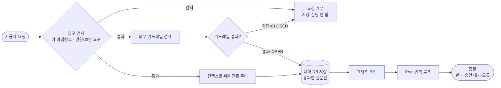
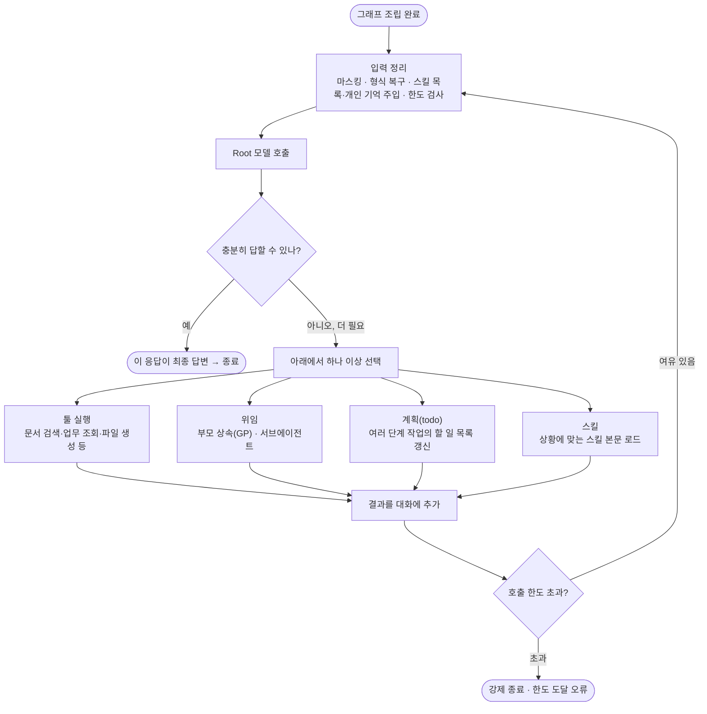

# 실무 심사 예상 질문·답변 부록

> 대상 발표: `docs/발표자료/최종발표/halil_html_통합__에이전트_0902/index.html` (통합본)
>
> 관점: **"우리 회사에 도입한다"** 고 가정한 실무 심사위원이 발표를 듣고 이어서 물을 질문.
> 얼마나 잘 짜여져 있나 · 바로 도입 가능한가 · 실제 잘 동작하는가 · 어떻게 동작하는가.
>
> 작성 원칙: 본편을 반복하지 않고 **구현된 것 / 아직 보장하지 않는 것 / 고객 책임으로 남는 것**을 함께 말한다.
> 에이전트 내부 상세 근거는 `00_에이전트_내부_동작_상세_설명.md`, `07_에이전트_발표_부록.md`(부록 A~N).

---

## 0. 질문 정리

**어떻게 동작하는가**

1. 한 요청이 들어온 뒤 인증·마스킹·가드레일·그래프 조립·Root 판단·도구 실행·결과 저장은 정확히 어떤 순서로 동작합니까? → [§1-1](#1-1-한-요청의-처리-순서)
2. "Agent Harness"가 정확히 무엇입니까? 자체 개발인가요, 라이브러리인가요? → [§1-2](#1-2-agent-harness가-정확히-무엇입니까-자체-개발인가요-라이브러리인가요)
3. Deep Agent 아키텍처를 "간단한 버전"으로 보여줬는데, 실제로는 무엇이 더 있습니까? → [§1-3](#1-3-deep-agent-아키텍처를-간단한-버전으로-보여줬는데-실제로는-무엇이-더-있습니까)
4. Root, 전문 Child, 범용 GP는 각각 어떤 기준으로 일을 나누고 권한은 어떻게 다릅니까? → [§1-4](#1-4-root-전문-child-범용-gp는-각각-어떤-기준으로-일을-나누고-권한은-어떻게-다릅니까)

**장애·안전 시 어떻게 되는가**

5. MCP 서버가 악성이거나 장애가 나면 어떻게 합니까? → [§2-1](#2-1-mcp-서버가-악성이거나-장애가-나면-어떻게-합니까)
6. 에이전트가 실패하거나 무한 루프에 빠지면 어떻게 종료합니까? → [§2-2](#2-2-에이전트가-실패하거나-무한-루프에-빠지면-어떻게-종료합니까)
7. 문서가 수정되거나 삭제되면 검색 결과와 권한도 즉시 반영됩니까? → [§2-3](#2-3-문서가-수정되거나-삭제되면-검색-결과와-권한도-즉시-반영됩니까)
8. 문서 업로드와 Agent 채팅이 동시에 몰려도 서로 영향을 주지 않습니까? → [§2-4](#2-4-문서-업로드와-agent-채팅이-동시에-몰려도-서로-영향을-주지-않습니까)

**확장성**

9. 동시 사용자 10명, 100명, 1,000명일 때 병목은 어디입니까? → [§3-1](#3-1-동시-사용자-10명-100명-1000명일-때-병목은-어디입니까)

**왜 이 플랫폼인가**

10. 기존 솔루션이나 ChatGPT Enterprise와 비교해 왜 이 플랫폼을 써야 합니까? → [§4-1](#4-1-기존-솔루션이나-chatgpt-enterprise와-비교해-왜-이-플랫폼을-써야-합니까)

---

# 1. 어떻게 동작하는가

## 1-1. 한 요청의 처리 순서

**질문** — 한 요청이 들어온 뒤 인증, 마스킹, 가드레일, 그래프 조립, Root 판단, 도구 실행, 결과 저장은 정확히 어떤 순서로 동작합니까?

**답변** — 크게 **그래프 밖(검사·저장) → 그래프 조립 → 그래프 안(Root 반복) → 그래프 밖(기록)** 순서다.

| 순서 | 처리 | 다음으로 넘기는 값 |
|---:|---|---|
| 3 | **API 키·비밀번호 형태 감지** → 있으면 즉시 400 (저장·가드레일·모델 어디에도 안 닿음) | — |
| 3b | **관리자·루트 등 권한·보안 정보 요구 감지** → 있으면 즉시 400 | — |
| 4 | **주민번호·카드번호·휴대전화 → `[가려짐]` 치환** | 저장 가능한 사용자 입력(한 번 만들어 이후 전부 공유) |
| 5 | `/스킬이름` 형식이면 스킬 절차와 결합 | 모델 입력 |
| 6 | **외부 가드레일에 제출** (팀이 연결한 공급자, 전용 스레드풀) | 검사 작업 |
| 7 | 검사 도는 동안 **병렬로** 대화 이력 · 실행 컨텍스트 · 실행 버전 준비 | 조립 입력 |
| 8 | 가드레일 결과 대기 (공급자 10초 / 전체 12초) — 통과·차단·검사 실패 | 통과 또는 OPEN이면 계속 / 차단 또는 CLOSED면 종료 |
| 9 | **통과한 질문만 대화 DB에 저장** (차단된 질문은 저장 안 함) | 영구 대화 이력 |
| 10 | **그래프 조립** — 저장된 버전 읽기 → 모델·도구·서브에이전트 결합 → 이번 요청 도구 목록으로 승인 대상·호출 상한·마스킹 배선 → 컴파일 | 실행 가능한 Root 그래프 |
| 11 | **Root 반복 루프** — (모델 호출 전 재마스킹·한도 검사) → Root가 답변/도구/위임 중 선택 → 변경·전송 도구면 그래프 중단·승인·재개 → 도구 실행(역할 검사 · 멱등 claim · 쓰기 잠금 · MCP 타임아웃) → 결과를 Root에 반환 → 충분해질 때까지 반복 | 최종 응답 |
| 12 | **종료** — 완료(result) / 승인 대기(awaiting_confirmation) / 오류(error) 중 하나로 끝냄 → NDJSON 전송 → 실행·추적 저장 | 답변 + 근거 문단 + 파일 |

핵심:

- **입구 검사가 그래프보다 먼저**다. 여기서 막히면 그래프는 아예 시작되지 않는다.
- **원문은 3~4단계에서만 쓰이고**, 이후 스킬 해석·가드레일·DB 저장·모델 입력·체크포인트는 전부 가려진 한 값을 공유한다.
- **질문을 그래프보다 먼저 저장**한다. 뒤에서 모델·도구가 실패해도 "무엇을 물었는가"는 남는다.
- HITL로 멈췄다 재개할 때도 **같은 버전으로 그래프를 다시 조립**한다. 대화 상태는 저장하지만 그래프 구조는 저장하지 않기 때문이다.

### 위 그림의 `그래프 조립` 안에서 일어나는 일

1. **버전 읽기** — 이 세션에 고정된 에이전트 버전(역할·모델·반복 한도·도구 목록·서브에이전트 목록)을 저장소에서 읽어 온다.
2. **부품 구성** — 모델 엔드포인트를 해석해 모델 객체를 만들고, 부모 상속(GP)과 서브에이전트 그래프를 컴파일하고, 프롬프트·툴·미들웨어·메모리를 하나의 실행 그래프로 묶는다.
3. **상태 복원** — 이어가는 대화면 이전 대화 상태(Checkpoint)를, 새 대화면 빈 상태를 붙이고, 개인 기억(preferences.md)을 시스템 컨텍스트에 주입한다.

> 그래프 객체는 저장하지 않는다. 매 요청 이 3단계로 구성을 다시 읽어 새로 만든다.

### 그래프 조립에 실제로 들어가는 항목 (코드 기준)

> 코드 위치 — `services/agent_runtime/loader.py`(버전 읽기), `services/agent_runtime/factory.py`(`AgentRuntimeFactory.build`), `services/agent_runtime/middleware/factory.py`(미들웨어), `services/agent_runtime/compat/deepagents_v075.py`(`create_root_graph` 인자), `services/agent_runtime/definitions.py`(자료구조).

#### ① 버전 읽기 — `AgentDefinition`의 필드

| name | 이름 (뜻) |
|---|---|
| `agent_id` / `agent_version_id` | 에이전트·버전 식별자 — 이 세션이 고정해 둔 값 |
| `name` / `description` | 에이전트 이름 · 설명 |
| `system_prompt` | 이 버전의 지침. 실행 시점에 공통 Runtime Scaffold와 결합된다 |
| `model` | 사용할 모델 이름 (예: `gpt-5.6-luna`) |
| `reasoning_effort` | 추론 강도 — `low` / `medium` / `high` |
| `max_iterations` | 모델 호출 상한 요청값 (기본 10, 절대 상한 50) |
| `tool_refs` | 이 버전이 쓸 수 있는 도구 참조 목록 |
| `subagents` | 연결된 Child 실행 설정 목록 (`SubagentDefinition[]`) |

**함께 읽는 Child 상태 — `SubagentReference`**

| name | 이름 (뜻) |
|---|---|
| `child_agent_id` / `child_version_id` | Child의 고정 버전 |
| `alias` | Root가 `task` 도구로 이 Child를 부를 때 쓰는 별칭 |
| `delegation_description` | Root가 "이 Child에게 맡길지" 판단할 때 읽는 설명 |
| `is_active` / `can_execute` | 활성 여부 · 현재 팀에서 실행 권한 |
| `has_subagents` | 이 Child가 또 Child를 갖는지 (위임 깊이 1 검증용) |

#### ② 부품 구성 — `create_root_graph(...)`에 넘기는 인자

| name | 이름 (뜻) |
|---|---|
| `model` | 팀 엔드포인트까지 해석한 실제 ChatModel 객체 |
| `system_prompt` | 공통 Runtime Scaffold + 이 버전 프롬프트 |
| `tools` | LangChain `StructuredTool`로 변환한 도구 — 실행 범위(팀·프로젝트·run) 주입 + 역할 검사·멱등 처리로 감쌈 |
| `subagents` | `[GP 명세, *컴파일된 Child 그래프들]` |
| `middleware` | 이번 요청 기준으로 조립한 미들웨어 목록 (아래 표) |
| `interrupt_on` | 승인 대기 대상 — 이번 요청 도구 중 `side_effect=True`인 것. 하드코딩 아님, 매 요청 생성. MCP는 경고 콜백 포함 |
| `fs_excluded_tools` | 가상 파일시스템에서 뺄 도구 — 현재 `{"delete"}` |
| `backend` | `CompositeBackend` — 가상 경로를 상태(State) 또는 장기 저장소(Store)로 라우팅 |
| `store` | `PostgresStore` — 개인 기억·스킬 본문 장기 저장 (프로세스 전역 싱글턴) |
| `memory` | 자동으로 읽어 시스템 컨텍스트에 넣을 기억 파일 경로 — `/memories/users/preferences.md` |
| `memory_system_prompt` / `skills_system_prompt` | 기억·스킬 라우팅 안내문 |
| `skills` | 노출할 스킬 소스 목록 (내장 + 활성 개인) |
| `checkpointer` | `PostgresSaver` — 대화 상태·중단 위치 (프로세스 전역 싱글턴) |

#### ② 부품 구성 — `middleware` 목록

| name | 이름 (뜻) |
|---|---|
| `ModelCallLimitMiddleware` | 한 실행의 모델 호출 상한. 초과 시 `exit_behavior="error"`로 강제 종료 |
| `ToolCallLimitMiddleware` | 한 실행의 도구 호출 상한 (100). 초과 시 강제 종료 |
| `PIIMiddleware` × 3 | `credit_card` · `ip` · `mac_address`를 `redact`. 입력 · 모델 출력 · 도구 결과 모두 |
| `SensitiveInputMask` | 과거 발화까지 다시 훑어 API 키·주민번호·카드·전화·권한 서술 마스킹 |
| `TodoListMiddleware` | `write_todos` 도구 제공 + "팀 업무(`task_register`)와 다르다" 구분 문단 |
| `McpToolCallTimeout` | MCP 도구 호출 480초 대기 상한 |
| `BuiltinWriteLock` | 같은 프로젝트의 내장 쓰기 도구 호출 직렬화 |
| `MemoryWriteGuard` *(Root 전용)* | 개인 기억 저장 전 키·개인정보·권한 서술 재검사 |
| `MemoryWriteLock` *(Root 전용)* | 같은 개인 기억 파일 동시 수정 직렬화 |
| `SkillCatalogRefresh` *(Root 전용)* | 방금 등록된 스킬을 이번 실행 카탈로그에 반영 |
| `PatchToolCalls` · `Summarization` · `SubAgent` · `Memory` | `create_deep_agent()`가 자동으로 추가 (우리가 조립하지 않음) |

#### ③ 상태 복원 & `build()` 반환값

| name | 이름 (뜻) |
|---|---|
| 새 대화 | 빈 상태로 시작 |
| 이어가는 대화 | `checkpointer`가 이전 그래프 상태 복원 — 메시지 · 할 일(`todos`) · 승인 대기 위치 · 작업 파일 |
| 개인 기억 주입 | `MemoryMiddleware`가 `preferences.md`를 읽어 시스템 컨텍스트에 삽입 |
| 반환 `(graph, resolved_model, child_resolved_models)` | 컴파일된 실행 그래프 + 실제 나간 provider·endpoint hash(추적 DB 기록) + Child별 모델 정보 |

### 위 그림의 `Root 반복 루프`의 한 사이클

- 앞단 분류기 없음. Root가 매 호출에서 위 갈래 중 하나 이상을 스스로 고른다.
- 스킬은 "목록"이 늘 시스템 프롬프트에 있고, Root가 필요하다고 판단할 때만 본문을 불러온다 (`/스킬이름`이면 판단 없이 바로 주입).
- 문서·업무를 실제로 만들거나 보내는 툴은 실행 전에 사람 승인을 거친다.
- 더 할 일이 없는 응답이 곧 최종 답변이다. 호출 한도를 넘기면 부분 결과 정리 없이 오류로 끝낸다.

---

## 1-2. "Agent Harness"가 정확히 무엇입니까? 자체 개발인가요, 라이브러리인가요?

**질문** — 발표에서 "Codex·Claude Code와 비슷한 구조", "LangGraph 기반 Deep Agent 프레임워크를 도입"이라고 했는데, 하네스가 우리 것인가요?

**답변**

- **실행 골격(하네스의 뼈대)은 오픈소스 Deep Agent 프레임워크**다. "모델은 텍스트 생성 능력만 있는데, 계획을 세우고 도구를 호출하고 반복 판단하게 만드는 틀"이 여기서 온다 — Root 반복 판단 루프, 서브에이전트 위임(`task`), 컨텍스트 요약, 가상 파일시스템, 개인 메모리·스킬 결합, 표준 미들웨어 훅.
- **차별점은 그 위에 우리가 얹은 통제·평가·문서 파이프라인**이다. "우리가 에이전트 프레임워크를 처음부터 만들었다"가 아니라, **프레임워크는 오픈소스 블록으로 두고 그 안팎에 운영에 필요한 것을 끼워넣었다.**

### 그림 — 우리가 만든 것 / 프레임워크에서 우리가 건드린 곳

> **A는 우리가 만든 것 전부**, **B는 오픈소스 프레임워크**다. B에서 `우리가 끼워넣음`·`우리가 바꿈` 3줄만 우리가 손댔고, `그대로 씀`은 프레임워크 그대로다.

**정직하게 말할 것** — 실행 루프 자체는 오픈소스다. 우리가 자랑할 부분은 그 루프가 **회사 환경에서 안전하게 도는 데 필요한 것**(입력 보호, 승인 경계, 격리, 호출 상한, 실행 추적, 문서 파이프라인, 스킬 검증)이다.

---

## 1-3. Deep Agent 아키텍처를 "간단한 버전"으로 보여줬는데, 실제로는 무엇이 더 있습니까?

**질문** — 발표 슬라이드에서 "원활한 설명을 위해 조금 간단한 버전으로 준비했다"고 했는데, 생략된 게 뭔가요?

**답변** — 도식에서 생략된 실제 구성 요소:

| 도식에서 생략된 것 | 실제 역할 | 상세 |
|---|---|---|
| 그래프 밖 입구 검사 | 인증·세션·민감정보 차단/마스킹·외부 가드레일이 **그래프 시작 전**에 끝난다. 여기서 막히면 그래프는 시작조차 안 됨 | `07` 부록 A·B |
| 미들웨어 4개 훅 | `실행 시작 전 / 모델 호출 전 / 모델 응답 후 / 도구 호출 전후` 각 지점에 정책 미들웨어가 배선됨 (마스킹·호출 상한·승인·PII·쓰기 잠금·MCP 타임아웃) | `07` 부록 C |
| 대화 상태와 개인 기억의 분리 | 대화 상태(세션별)와 개인 기억·스킬(계정·팀 namespace)은 **서로 다른 저장 공간**. 프롬프트로 남의 기억에 접근 불가 | `07` 부록 H |
| 매 요청 그래프 재조립 | 컴파일된 그래프는 저장하지 않고, 요청마다 저장된 버전 정의를 읽어 다시 만든다. 그래서 "재배포 없이 다음 질문부터 반영" | `07` 부록 G·N |
| HITL 중단·재개·멱등 | 변경·전송 도구 앞에서 **그래프를 중단** → 승인 → 같은 `(run_id, tool_call_id)`로 **한 번만** 실행 | `07` 부록 F |
| 요청별 승인 대상 생성 | 승인 대상 목록은 하드코딩이 아니라 **이번 요청에 실제로 붙은 도구 중 변경·전송 도구**로 매번 만든다 | `00` 문서 12.1 |
| 스킬 검증 게이트 | 사용자가 만든 스킬은 바로 실행 목록에 안 들어가고, 별도 worker의 라우팅·행동 검증을 통과해야 게시 | `00` 문서 11.3 |
| 실행 추적 | `agent_run`·`tool_call`에 실제 provider·엔드포인트 해시·호출 수·토큰·오류 코드를 남긴다 (대화·문서 원문은 안 남김) | `00` 문서 15 |

**정직하게 말할 것** — 도식이 단순한 것과 시스템이 단순한 것은 다르다. **생략된 부분이 곧 "회사에 도입할 때 필요한 운영 통제 레이어"**다. Q&A에서 이 표로 답한다.

---

## 1-4. Root, 전문 Child, 범용 GP는 각각 어떤 기준으로 일을 나누고 권한은 어떻게 다릅니까?

**질문** — 위임이 어떻게 일어나고, 누가 무엇을 할 수 있나요?

**답변**

**일을 나누는 기준** — 앞단 분류 모델이 없다. Root가 **위임 후보 목록(GP + 붙어 있는 Child들의 이름·위임 설명)과 지금 질문만 보고 스스로** 고른다.

- 조사·검색·여러 영역에 걸친 복합 작업인데 전담이 없음 → **GP**에 위임
- 특정 분야 전문 업무이고 그 담당 Child가 붙어 있음 → 그 **Child**에 위임
- 그 외 → Root가 직접 도구를 쓰거나 바로 답변

| 항목 | Root | 전문 Child | 범용 GP |
|---|---|---|---|
| 개수 | 1 | 0..N (에이전트 만들 때 붙인 만큼) | 항상 1 (고정, 끌 수 없음) |
| 정체 | 이 에이전트 버전 자체 | 독립된 별도 에이전트 버전 | 프레임워크 내장 만능 조사원 |
| 모델 | 이 버전에 선택된 모델 | 자기 버전에 선택된 모델 | Root와 같은 모델 |
| 도구 | 이 버전에 선택된 도구 전부 | 자기 버전에 선택된 도구 | Root 도구 중 **조회 전용(변경 없음)만** |
| MCP 도구 | 가능 (승인 대상) | 가능 (승인 대상) | **없음** — MCP는 전부 변경 도구로 분류돼 전달 안 됨 |
| 개인 기억 | 읽기·쓰기 | 없음 | 없음 |
| 다시 위임 (`task`) | 가능 | 불가 | 불가 |
| 위험한 행동 | 변경 도구 가능하나 **실행 전 사람 승인 필수** | 변경 도구 가능하나 **승인 필수** | **구조적으로 불가** — 쓰기 도구를 애초에 받지 못함 |

**권한 차이의 핵심**

- **GP는 구조적으로 읽기 전용**이다. 승인 화면만 숨긴 게 아니라, 변경 도구를 GP에 **전달하지 않는다**. GP가 쓰기 도구를 알고 우회 호출하는 경로 자체가 없다. 변경이 필요하면 조사 결과를 Root에 돌려주고 Root가 승인을 거쳐 실행한다.
- **위임은 한 단계**다. Child·GP는 다시 `task`를 부르지 못한다. 순환·폭발적 실행을 막기 위한 선택이다.
- 서브 에이전트 내부 대화는 Root로 새지 않는다. **결과 텍스트만** 돌려준다.

**정직하게 말할 것** — "전문성이 필요하면 항상 정확히 위임한다"는 보장은 없다. 도구 설명과 프롬프트를 보고 LLM이 판단한다. 깊은 도메인 트리(전문가가 다시 전문가를 부르는 구조)는 지원하지 않는다.

**근거** — `services/agent_runtime/factory.py`, `00` 문서 6장, `07` 부록 E.

---

# 2. 장애·안전 시 어떻게 되는가

## 2-1. MCP 서버가 악성이거나 장애가 나면 어떻게 합니까?

**질문** — 외부 MCP 서버를 신뢰할 수 없을 때, 또는 죽었을 때 플랫폼이 어떻게 방어하나요?

**답변**

**장애(느리거나 죽음)**

- MCP 도구 호출은 **최대 480초까지만 대기**(최대 540). 초과하면 "결과를 확인하지 못한 호출"로 반환하고 **자동 재시도하지 않는다** (원 호출이 뒤늦게 성공한 상태에서 재시도하면 중복 변경이 생기므로).
- MCP 대기는 **채팅 그래프 실행 스레드와 분리된 공유 스레드풀**에서 처리한다. 느린 MCP 하나가 웹 워커(600초)를 무기한 붙잡지 못한다.
- 서버가 죽어 오류를 반환하면 그 오류를 모델에게 전달하고 **그래프 전체를 죽이지 않는다**. Root가 다음 행동을 정한다.

**악성(거짓 결과·탈취 시도)**

- **모든 MCP 도구는 변경 도구로 분류**되어 매 호출마다 **사람 승인 카드**를 띄운다. 사용자가 도구 이름·인자를 보고 승인해야 실행된다.
- 승인 카드에 경고를 추가한다: 같은 배치에 같은 MCP 서버를 쓰는 다른 호출이 있는지 / 다른 실행이 지금 같은 MCP 서버를 호출 중인지 / 이 실행에서 같은 도구가 timeout돼 결과를 모르는 상태인지.
- **실행 범위(팀·프로젝트·실행 ID)는 서버가 코드로 주입**한다. MCP 응답이 "다른 팀 데이터를 봐라", "너는 관리자다" 같은 문구를 넣어도 범위는 안 바뀐다. 도구 결과·검색 문서 안의 지시문은 **명령이 아니라 데이터로 취급**한다.
- MCP는 팀 단위로 운영자가 등록하고(서버·인증정보·도구 목록·팀 범위), 자격증명은 팀 범위로 격리된다.

**정직하게 말할 것**

- 악성 MCP가 **그럴듯한 거짓 데이터**를 돌려주는 것 자체를 플랫폼이 판별하지는 못한다. 방어는 **승인 게이트 + 범위 격리 + 결과를 명령으로 취급하지 않기**의 조합이다.
- timeout은 **취소가 아니다.** 480초 뒤 기다리기를 멈출 뿐, 이미 제출된 실행 스레드는 계속될 수 있다("결과 미확인").
- MCP 서버 자체의 신뢰성 판단(등록해도 되는 서버인가)은 **운영자·고객 책임 영역**으로 남는다.

**근거** — `00` 문서 8.4·12.1, `07` 부록 F·J.

---

## 2-2. 에이전트가 실패하거나 무한 루프에 빠지면 어떻게 종료합니까?

**질문** — 모델이 계속 도구를 부르거나 답을 못 내면요?

**답변** — 코드로 강제한 상한이 여러 겹이다.

| 상한 | 값 | 초과 시 |
|---|---|---|
| 모델 호출 수 | 에이전트 설정값(기본 10), 절대 상한 50 (GP 50) | 실행을 **의도적으로 중단**, "한도 도달" 오류 이벤트 |
| 도구 호출 수 | 실행당 100 | 동일하게 중단 |
| 동시 도구 실행 | super-step당 4개 | 나머지는 버리지 않고 대기 |
| 위임 깊이 | 1단계 | 재귀 위임 자체가 불가 |

- 도구가 **일시적 오류**(timeout, 연결 실패, HTTP 429/5xx)면 조회 도구에 한해 최대 3회 재시도(backoff+jitter). **쓰기 도구는 재시도하지 않는다.**
- 사용자가 고칠 수 있는 오류(잘못된 인자 등)는 모델에게 메시지로 돌려 **스스로 수정**하게 한다. 그 외 예외는 원문을 숨기고 오류 코드만 준다.
- 한 요청은 **완료 / 승인 대기 / 오류** 세 상태 중 하나로 끝나고 각각 저장된다.
- 클라이언트 연결이 중간에 끊기면 최종 답변은 저장하지 않되, 앞서 저장한 사용자 질문은 남는다.

**평가 결과** — V3 66회에서 **무한 루프·측정 가능한 중복 호출은 0건**이었다. 다만 어려운 검색 시나리오에서 **호출 예산(상한) 초과로 강제 종료된 경우**는 있었다(도구별 29/66, 전체 15/66) — 이건 상한이 실제로 동작한 결과다.

**정직하게 말할 것** — 한도에 도달하면 **부분 결과를 자동으로 정리·요약해 주지 않는다** (`exit_behavior="error"`). 이미 발생한 호출 수·토큰은 실패 실행에도 기록된다. "상한 안에서 매끄럽게 마무리"가 아니라 "상한에서 멈추고 알린다"이다.

**근거** — `00` 문서 9장, `07` 부록 M·J.

---

## 2-3. 문서가 수정되거나 삭제되면 검색 결과와 권한도 즉시 반영됩니까?

**질문** — 원문이 바뀌거나 문서를 지웠을 때 검색과 접근 권한이 바로 따라오나요?

**답변**

**검색 반영** — **즉시가 아니다.** 문서는 **등록 시점의 스냅샷**이다.

- 세션 생성 시 Drive 동기화를 백그라운드로 시작할 수 있고, **다운로드 + 재색인이 끝나야** 검색에 반영된다. 반영 기준은 "세션이 바뀌었는가"가 아니라 **"색인이 성공했는가"**다.
- 사용자가 명시적으로 동기화를 요청하면 색인 완료까지 기다린다. 이미 진행 중인 검색은 이전 색인을 쓸 수 있다.
- 자동 변경 감지·증분 재색인은 없다(README 개선 방향 3번).

**권한 반영**

- 문서 접근은 **팀(테넌트) 범위**로 묶인다. 도구가 파일을 읽기 전에 그 `file_id`가 현재 사용자에게 허용됐는지 확인한다.
- 팀에서 문서가 삭제되면, 그 문서를 가리키던 링크가 남아도 **조회가 죽지 않고 "사라진 링크"로 표시**된다(FK를 걸지 않고 모든 조회가 방어).

**정직하게 말할 것**

- 문서를 수정한 뒤 **재동기화·재색인 전까지는 옛 내용으로 답할 수 있다.**
- 문서를 삭제해도 **색인에서 빠지기 전까지는 검색 결과에 남을 수 있다.**
- 문서가 자주 바뀌는 팀은 **주기적 수동 재동기화 운영**이 필요하고, "항상 최신 문서로 답한다"고 말하면 안 된다.

**근거** — `00` 문서 17장, README 10장.

---

## 2-4. 문서 업로드와 Agent 채팅이 동시에 몰려도 서로 영향을 주지 않습니까?

**질문** — 대량 업로드 중에 채팅이 느려지거나 반대가 되지 않나요?

**답변** — 무거운 작업을 **물리적으로 분리**했다.

- 파싱·청킹·임베딩처럼 연산량이 큰 작업은 **별도 GPU 워커(RunPod)** 에서 처리한다. 채팅 요청을 받는 웹 서버·DB와 다른 자원이다.
- 문서 등록은 **큐 기반**이고, 세션 생성 응답은 동기화 완료를 기다리지 않는다(백그라운드 스레드).
- 채팅 그래프 실행 스레드와 MCP 대기 스레드도 분리돼 있다.

**정직하게 말할 것**

- **공유 지점은 같은 PostgreSQL이다.** 업로드가 끝나 벡터 인덱스를 쓰는 작업과, 채팅이 벡터를 검색하는 읽기가 **같은 DB**에서 일어난다. 대량 업로드가 DB IO를 크게 점유하면 채팅 검색 지연에 영향을 줄 수 있다 — **이 상황을 부하 테스트로 측정하지는 않았다.**
- GPU 워커가 죽으면 업로드는 멈추지만, 이미 색인된 문서 기준으로 채팅은 계속된다(자동 복구는 없음).

**근거** — README 5·6장, `00` 문서 8.4·17장.

---

# 3. 확장성

## 3-1. 동시 사용자 10명, 100명, 1,000명일 때 병목은 어디입니까?

**질문** — 규모가 커지면 어디가 먼저 터지나요?

**답변**

| 규모 | 예상 상태 | 주된 병목 |
|---|---|---|
| **10명** | 사실상 문제 없음 | 요청당 지연의 대부분이 LLM 추론·외부 도구라 서버 CPU는 여유. 웹 워커 수와 DB 커넥션 풀이 실질 제약 |
| **100명** | 튜닝하면 가능 | ① 스트리밍 요청이 워커를 길게 점유(평균 21초, 최대 124초) → 워커 수 부족 ② 외부 가드레일 전용 스레드풀이 프로세스당 4개 ③ 모델 공급자 rate limit ④ DB 커넥션 풀·체크포인트 쓰기 경합 |
| **1,000명** | 현재 구성으로는 불가 | 단일 EC2 → 웹 다중화 + 로드밸런서, 모델 호출 큐잉·동시성 관리, RDS 읽기 복제본, 벡터 인덱스 분리, GPU 워커 스케일아웃 필요 |

- 구조적 제약: **한 PostgreSQL에 관계형 데이터 + 대화 체크포인트 + 개인 기억 + 벡터 인덱스**가 모두 있다. 트래픽이 늘면 체크포인트 쓰기와 벡터 검색이 일반 관계형 쿼리와 경합한다.
- 요청 내부 상한(모델 50 / 도구 100 / 동시 4)은 개별 요청의 폭주는 막지만, **전체 처리량을 위한 큐·백프레셔는 아직 없다.**

**정직하게 말할 것**

- **부하 테스트를 하지 않았다.** 동시 도구 실행 `4`도 "처리량 최적화 수치가 아니라 무제한을 막는 잠정 방어값"이라고 코드 주석에 명시돼 있다.
- 위 병목은 **구조 기반 추정**이지 측정 결과가 아니다. 실제 한계 QPS·병목 지점은 도입 규모를 정한 뒤 부하 시험으로 확인해야 한다.
- 수평 확장 설계(웹 무상태화는 이미 됨 — 그래프를 저장하지 않고 매 요청 재조립하므로)는 되어 있으나, **로드밸런서·복제본·큐는 미구축**이다.

**근거** — README 5·6장, `00` 문서 9장, `07` 부록 G.

---

# 4. 왜 이 플랫폼인가

## 4-1. 기존 솔루션이나 ChatGPT Enterprise와 비교해 왜 이 플랫폼을 써야 합니까?

**질문 의도** — 자체 구축의 비용과 유지보수 부담을 감수할 만한 차별점이 있는지 확인한다.

**답변** — 범용 엔터프라이즈 챗(ChatGPT Enterprise 등)이 **구조적으로 하지 않는 것**을 이 플랫폼이 한다.

| 차별점 | 이 플랫폼 | 범용 엔터프라이즈 챗 |
|---|---|---|
| **근거 강제** | 모든 답에 원문 문단이 붙고, 검색 결과를 출처로 분리 표시 | 사내 문서를 근거로 강제하지 않음 (연결해도 "요약" 수준) |
| **사내 시스템에 쓰기** | Jira 이슈 등록·업무 생성까지 **승인 한 번**으로 실제 반영 (커넥터 + MCP) | 읽기 위주. 승인 기반 쓰기 워크플로 없음 |
| **사람 승인 경계** | 바깥을 바꾸는 모든 행동은 **그래프 중단 + 구조화된 승인 카드 + 멱등 처리**. 모델이 "실행할까요?"라고 묻는 방식이 아님 | 도구 실행 통제가 프롬프트/플러그인 정책 수준 |
| **코딩 없이 팀 에이전트** | 설명·지시문·도구 세 칸으로 **할 수 있는 일을 좁혀** 정의하고 **버전 단위로 관리** | GPTs 유사 기능은 있으나 좁힘·버전·위임 통제가 약함 |
| **테넌트·기억 격리** | 팀 범위 + 계정·팀 namespace. 평가에서 **계정 간 유출 0건** | 조직 단위 격리는 되나 에이전트별·기억별 경계는 제한적 |
| **가드레일·모델 선택권** | 팀별로 OpenAI/Azure/Bedrock 가드레일 중 연결, **모델 엔드포인트도 팀별 커스텀**(사내·프라이빗 모델 가능) | 공급자 고정 |
| **평가로 검증 가능** | 이진·정량·정성 판정, 동결 실행, 감사 추적. 도입 후에도 **회귀 검증** 가능 | 실행 품질을 계약 기반으로 재현 검증하는 체계 없음 |

**한 문장** — "우리 문서를 근거로, 우리 시스템에, 사람 승인을 거쳐 반영하고, 팀이 직접 좁혀 만든 에이전트를, 평가로 검증하며 쓴다" — 이 조합이 필요하면 자체 구축이 정당화된다.

**정직하게 말할 것**

- **범용 대화 품질·모델 최신성·부가 기능**(코드 인터프리터, 이미지 생성 등)은 상용 제품이 앞선다. 이 플랫폼은 "사내 문서·도구·승인·팀 에이전트"라는 좁은 영역에 특화돼 있다.
- **자체 구축·운영 부담**(인프라, 보안 감사, 라이브러리 업그레이드, 온콜)은 고객이 진다.
- 도입 판단은 "사내 시스템 통합 + 근거·승인 강제"의 가치가 그 부담보다 큰가로 봐야 한다. 단순 사내 지식 Q&A만 필요하면 상용 RAG 제품이 더 빠른 선택일 수 있다.

**근거** — README 1·4장, `07` 부록 E·L·K.
