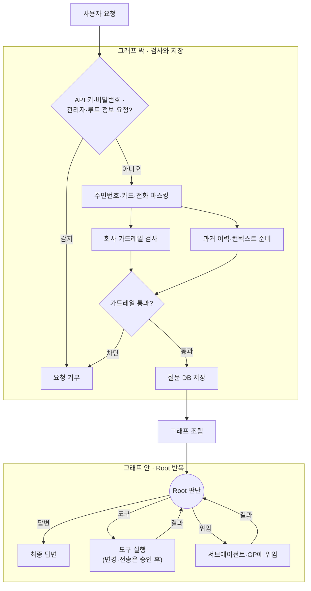
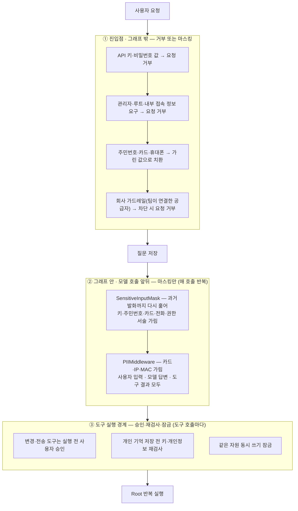
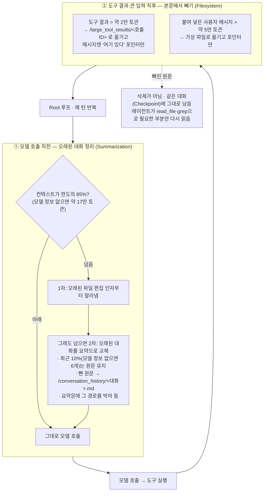
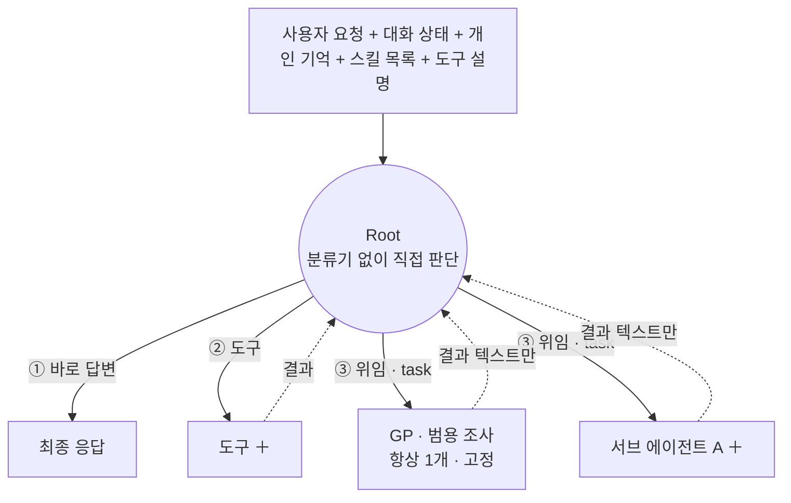
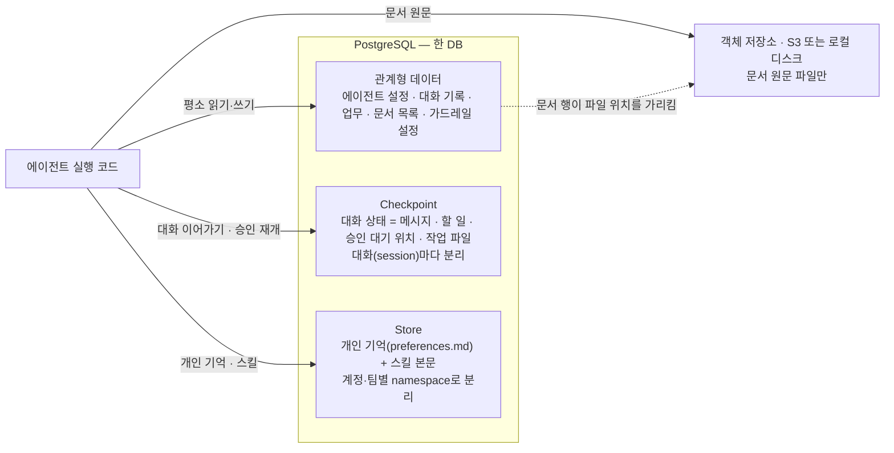
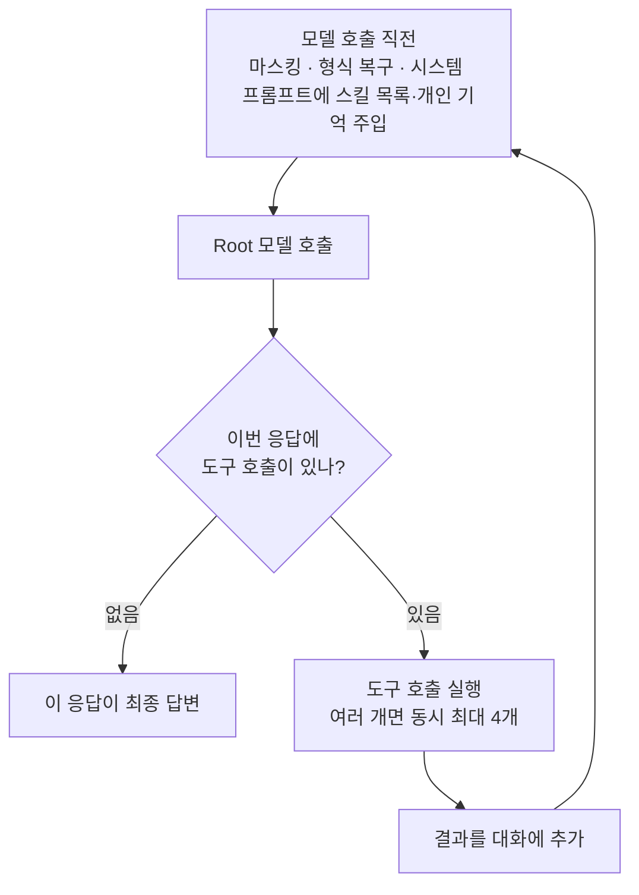
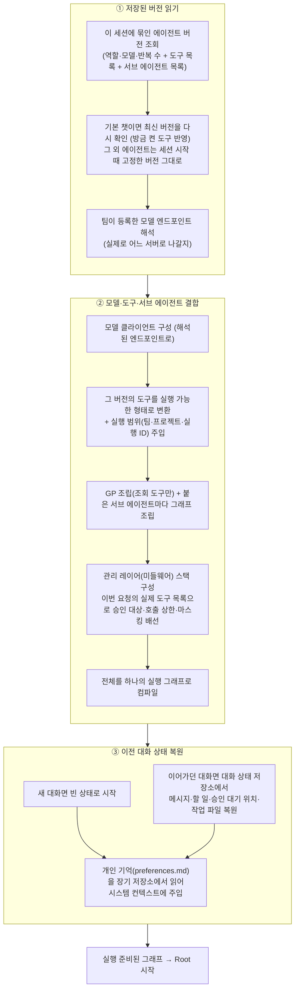

# 에이전트 발표 — 기술 질의응답 부록 최종안

> 비교 기준: `07_에이전트_발표_슬라이드_클로드.md` 전체(본편 1~8장과 기존 부록 A~H)
>
> 작성 원칙: 본편을 반복하지 않고, 청중이 본편을 듣고 자연스럽게 묻게 될 **“어디서, 무엇이, 어떤 순서로, 실패하면 어떻게 되는가”**를 답한다. 구현된 것과 아직 보장하지 않는 것을 함께 말한다.

---

## 0. 청중의 입장에서 가장 더 듣고 싶은 것

본편만 들으면 구조는 이해되지만, 기술 청중은 아래 질문을 이어서 할 가능성이 높다.

| 우선순위 | 청중이 실제로 물을 질문 | 본편에서 질문이 생기는 지점 | 답할 부록 |
|---:|---|---|---|
| 1 | 요청 한 건이 들어오면 실제 함수가 어떤 순서로 도나? 그래프 밖과 안의 경계는? | 1·6장 | A |
| 2 | 미들웨어는 정확히 무엇이 있고, 어느 훅에서 어떤 순서로 개입하나? | 2·3장 | C |
| 3 | 입력 보호가 무엇을 거부·마스킹하나? "가드레일"로 실제 가능한 것은? `SensitiveInputMaskMiddleware`·`PIIMiddleware`는? | 2·4장 | B |
| 4 | 매 요청 그래프를 새로 만들면 비싸지 않나? 무엇을 새로 만들고 무엇을 재사용하나? | 6장 | G |
| 5 | 승인 후 재개할 때 왜 중복 실행이 안 되나? 어디까지 보장하나? | 8장 | F |
| 6 | Root가 언제 도구를 쓰고 언제 위임하나? GP와 서브 에이전트의 권한 차이는? | 7장 | E |
| 7 | 대화가 길어지면 무엇을 요약하고, 빠진 원문은 어떻게 다시 읽나? | 2장 | D |
| 8 | Checkpoint와 Store는 무엇이 다르고 데이터가 어떻게 격리되나? | 2·6·8장 | H |
| 9 | Builder에서 저장하면 왜 배포 없이 다음 질문부터 바뀌나? | 5·6장 | I |
| 10 | 도구 실패·타임아웃·동시 쓰기는 어떻게 처리하나? | 3·7·8장 | J |
| 11 | 그래서 현재 제품이 보장하는 것과 보장하지 않는 것은 무엇인가? | 전체 | K |
| 12 | 기업이 실제 도입할 때 누가 무엇을 설정하고, 장애는 어디서 보나? | 4장 | L |
| 13 | Root가 매 모델 호출에서 고를 수 있는 경로는 정확히 무엇이고, `write_todos`는 내부에서 어떻게 도나? | 7장 | M |
| 14 | 우리 코드·PostgreSQL·객체 저장소(S3)·Store는 어떻게 연결되고, Store에는 무엇이 들어가나? | 2·6·8장 | H |
| 15 | 그래프 조립(저장된 버전 읽기 → 결합 → 상태 복원) 안에서 실제로 무엇을 하나? | 6장 | N |

### 추천 제시 순서

- Q&A 첫 장은 A로 연다. “한 요청의 전체 지도”를 먼저 보여주면 이후 질문을 어느 부록으로 넘길지 설명하기 쉽다.
- 보호 질문에는 B → C → J 순서로 답한다. **입구 검사·가드레일 → 미들웨어 조립 위치 → 도구 실행 보호**가 연결된다.
- 안전성 질문에는 F와 K를 같이 보여 준다. 기능만 말하지 말고 보장 범위를 함께 말한다.

---

# 부록 A — 요청 한 건은 그래프 밖에서 검사하고, 안에서 반복 실행된다

## 청중 질문

> “사용자가 메시지를 보낸 순간부터 답이 저장될 때까지 실제 호출 순서가 무엇입니까?”

## 화면에 그릴 흐름



## 설명할 내용

1. **그래프 밖에서 입구를 먼저 막는다**
   - 로그인·세션·팀을 확인해 이 요청이 건드릴 수 있는 범위를 확정한다. 사용자가 프롬프트에 다른 ID를 써도 이 범위는 안 바뀐다.
   - API 키·비밀번호 형태, 그리고 관리자·루트·내부 접속 정보를 달라는 요청은 저장도 외부 전송도 하기 전에 거부한다.
   - 주민등록번호·카드번호·휴대전화번호 형태는 가린 값으로 바꾸고, **그 뒤로는 가드레일·DB 저장·모델 입력이 전부 이 한 값을 쓴다.**
   - 회사 가드레일 검사와 대화 이력·컨텍스트 준비는 병렬로 돌리고, 그래프를 열기 전에 결과를 합친다.

2. **질문을 그래프보다 먼저 저장한다**
   - 가드레일을 통과한 질문은 그래프를 시작하기 전에 저장한다. 뒤에서 모델이나 도구가 실패해도 "무엇을 물었는가"는 남는다.
   - 반대로 가드레일이 차단한 질문은 보내지 않은 것으로 보고 저장하지 않는다.

3. **그래프 밖과 안의 경계**
   - **조립**은 저장된 에이전트 버전 하나를 읽어 "이번 요청을 처리할 그래프"를 만드는 단계다. 새로 만드는 건 그래프 구성이고, DB·저장소 연결은 재사용한다(비용은 부록 G, 조립 단계 내부는 부록 N).
   - **밖**에서 끝나는 것: 인증, 민감정보 검사, 회사 가드레일, 질문 저장. 밖에서 막히면 그래프는 아예 시작되지 않는다.
   - **안**에서 하는 것: Root가 답변·도구·위임 중 하나를 고르고, 결과를 받아 충분해질 때까지 반복한다. 변경·전송 도구는 실행 전 사용자 승인을 거친다.
   - 실행이 끝나면 다시 밖으로 나와 답변과 산출물, 실행 기록, 대화 제목을 남긴다.

## 한 문장 답변

> "인증·민감정보·회사 가드레일은 그래프 밖에서 먼저 끝내고, 통과한 요청만 저장한 뒤 저장된 버전으로 그래프를 조립합니다. 그래프 안에서는 Root가 도구·위임 결과를 반복해서 받아 최종 답을 만들고, 끝나면 다시 밖에서 기록을 남깁니다."

## 구현 근거

- `apps/chat/api_views.py`
- `services/agent_runtime/loader.py`
- `services/agent_runtime/factory.py`
- `services/agent_runtime/executor.py`
- `services/agent_runtime/stream_adapter.py`

---

# 부록 B — 입력 보호: 무엇을 거부하고, 무엇을 가리고, 회사 가드레일은 어디서 도나

## 청중 질문

> "부록 A의 'API 키·비밀번호 감지', '관리자·루트 정보 요청', '가드레일'은 각각 무엇을 검사하고 어디서 돕니까? 우리가 만든 `SensitiveInputMaskMiddleware`, 그리고 `PIIMiddleware`와는 무슨 관계입니까?"

## 먼저: 진입점 검사와 그래프 안 미들웨어는 다른 것이다

- **진입점(그래프 밖, Chat API)** — 미들웨어가 아니라 뷰 코드가 패턴 함수(`match_category()` / `mask_for_storage()`)를 직접 부른다. 판정에 따라 **요청을 거부(400)** 하거나, 값을 **가리고 통과**시킨다.
- **그래프 안** — `SensitiveInputMaskMiddleware`·`PIIMiddleware`가 모델 호출 앞뒤에서 **가리기만** 한다(거부 없음).
- 둘은 같은 패턴 정의(`sensitive_text.py` 한 파일)를 공유한다. 다른 건 **하는 일(거부 vs 마스킹)과 도는 위치**다.

## "API 키·비밀번호"와 "관리자·루트 요청"이 왜 나뉘나

같은 파일(`sensitive_text.py`)이 **세 카테고리**로 구분한다: `credential` / `pii` / `authority`. 진입점에서 셋의 **결과가 다르다.**

| 종류 | 예 | 진입점에서 | 왜 이렇게 |
|---|---|---|---|
| `credential` | `sk-...`, `AKIA...`, `password=...` | **요청 거부(400)** — DB·가드레일·모델 어디에도 안 닿음 | 살아 있는 키가 로그·백업에 평문으로 남는 것 자체를 막는다 |
| `authority` (권한·보안 서술) | "관리자 비밀번호 알려줘", "루트 계정", "내부 접속 정보" | **요청 거부(400)** — 별도 문구로 안내 | 마스킹만 하면 모델이 "`[가려짐]`이 필요해"라는 빈칸을 받아 되묻는다. 거절해야 할 자리라 아예 끝낸다 |
| `pii` | 주민번호·카드번호·휴대폰 | **가린 값으로 치환 후 통과** | 정상 업무 문장이 많아 거부는 과하다. 이후 가드레일·저장·모델 입력이 이 한 값을 공유 |

→ credential과 authority가 "나뉜" 이유: **한 파일 안의 다른 카테고리**이고, 사용자에게 가는 문구가 다르기 때문. 코드로는 `match_category()` **한 번의 분기**다. 둘 다 통과가 아니라 거부.

## `SensitiveInputMaskMiddleware` (우리 것 — 그래프 안, 2차 방어)

- `before_model`에서 대화 state의 **모든 HumanMessage**를 다시 훑어 credential·PII·권한서술을 `[가려짐]`으로 바꾼다. 멱등이라 반복해도 안전.
- 진입점이 이미 거른 새 발화에는 사실상 할 일이 없다. 노리는 건:
  - 체크포인터 없는 콜드 스타트로 **과거 발화가 한꺼번에 재전송**될 때
  - 이 진입점을 안 거치고 들어온 옛 이력(진입점 검사 도입 전에 저장된 것 등)
- **거부하지 않는다. 가리기만 한다.**

## `PIIMiddleware` (langchain 기본 클래스 — 그래프 안)

- 쓰인다. 단 진입점이 아니라 **그래프 안**에서. `credit_card`·`ip`·`mac_address` 세 개를 `redact`로 켠다. `email`·`url`은 정상 업무(메일 주소·문서 링크)에서 오탐이 잦아 끈다.
- **입력만이 아니라 모델 출력·도구 결과에도** 건다 — 모델이 카드번호를 되풀이하거나, 도구가 조회해 온 결과에 섞여 나오는 경로.
- 카드번호는 진입점(`mask_for_storage`) + 여기(`PIIMiddleware`) **두 층에서 두 번** 가려진다.
- GP에는 아직 안 붙는다(GP가 사용자 원문을 직접 보는 경로가 없어서).

## 회사 가드레일 (그래프 밖, 입력 단계)

**우리가 만든 검사 규칙은 없다.** 무엇을 막을지는 고객이 연결한 공급자가 정한다. 팀당 하나.

> 공통: 팀당 1개만 연결. 무엇을 막을지는 고객 공급자 설정이 정한다(우리 자체 규칙 없음). 공급자 호출 대기 10초.

| 공급자 | 검사 항목 | 고객이 등록하는 것 | 차단 기준 |
|---|---|---|---|
| OpenAI Guardrails | 유해 표현·탈옥 시도 (위저드에서 선택) | 검사 설정 + OpenAI 키 | 켠 항목 중 하나라도 걸림 |
| Azure Content Safety | 혐오·자해·성적·폭력 + 차단 단어 | 리소스 주소 + 키 | 심각도 '중간' 이상 또는 차단 단어 |
| AWS Bedrock Guardrails | 콘솔에서 정한 금지 주제·필터 | 가드레일 ID·리전 + 자격증명 | 가드레일이 '개입' 판정 |

- 등록하면 우리 서버가 사용자 문장을 그 공급자에 보내 검사받는다. Bedrock·Azure는 고객 콘솔에 만든 것을 우리가 좌표(ID·주소)로 가리킬 뿐, 규칙 내용은 우리가 들지 않는다.
- Chat API는 전체 검사를 **최대 12초** 기다린다. 공급자 오류·타임아웃이면 팀 설정대로 — **OPEN**: 기록하고 계속 / **CLOSED**: "가드레일에 연결하지 못했습니다"로 차단.
- 차단된 요청은 대화 DB에 저장하지 않고 그래프도 시작하지 않는다.

## 보안·가드레일이 어디서, 무엇을 검사하나



- **①은 거부 아니면 마스킹**, **②는 마스킹만**, **③은 승인·재검사·잠금.** 각 구역이 막는 대상이 다르다 — "가드레일 = 외부 공급자 하나"가 아니다.
- 이와 별개로, 서버가 실행 범위(팀·프로젝트·실행 ID)를 요청에 직접 주입한다. 사용자가 프롬프트로 다른 ID를 써도 범위는 안 바뀐다.
- ②·③은 Root 루프가 도는 동안 매 모델 호출·매 도구 호출마다 반복된다.

## 지금 하지 않는 것

- 우리 팀이 별도 유해성 모델이나 자체 정책 엔진을 운영하지 않는다. 무엇을 막을지는 고객 공급자가 정한다.
- 외부 공급자 검사는 **입력 단계만** 연결돼 있다. 최종 답변을 다시 공급자에게 보내는 출력 가드레일은 없다.
- Prompt injection을 완전히 판별하는 범용 보장은 없다. 공급자의 Jailbreak 규칙, 서버 범위 주입, 메모리를 "데이터"로 취급하는 프롬프트, 도구 승인으로 위험을 분산한다.
- `leader`/`member` 모두 side-effect 도구를 실행할 수 있다. 실질 경계는 역할 차단이 아니라 HITL 승인이다.
- 정규식·키워드 기반이라 분할·우회 표현을 모두 잡지는 못한다.

## 구현 근거

- `apps/chat/api_views.py` (`match_category` / `mask_for_storage` 직접 호출, 12초 대기)
- `services/agent_runtime/sensitive_text.py` (패턴 3종 정의, 4곳이 공유)
- `services/agent_runtime/middleware/sensitive_input.py` (`SensitiveInputMaskMiddleware`)
- `services/agent_runtime/middleware/factory.py` (`_build_pii_middleware`)
- `services/guardrails/` (`input_check.py`, `providers/{openai_guardrails,azure,bedrock}.py`)

---

# 부록 C — 미들웨어는 네 경계에서 개입한다

## 청중 질문

> “미들웨어가 뭐가 있고, 어디서 어떤 역할을 합니까?”

## 네 지점 — 어느 훅에 무엇을 붙였나

- `before_agent` — 실행이 시작되기 직전, 상태를 한 번 손본다.
- `before_model` — 모델에 보내기 직전, 입력·컨텍스트를 손본다. (일부는 모델 호출을 **통째로 감싸** 요약본으로 치환하거나 컨텍스트를 주입한다.)
- `after_model` — 모델 응답 직후, 출력을 검사하고 승인 대기 여부·호출 수를 판단한다.
- `wrap_tool_call` — 도구 실행 전후로 시간·권한·동시성·저장 경계를 통제한다.

```mermaid
flowchart LR
    subgraph H0["before_agent"]
        direction TB
        A0["SkillCatalogRefresh<br/>방금 등록된 스킬 반영"]
    end
    subgraph H1["before_model (모델 호출 직전·감쌈)"]
        direction TB
        B0["SensitiveInputMask<br/>과거 발화까지 마스킹"]
        B1["PIIMiddleware<br/>입력의 카드·IP·MAC 가림"]
        B2["PatchToolCalls<br/>끊긴 도구 호출 형식 복구"]
        B3["Summarization<br/>오래된 대화 요약 (감쌈)"]
        B4["Memory·Skills<br/>기억·스킬을 시스템 프롬프트에 주입 (감쌈)"]
        B5["TodoList<br/>계획 안내문 주입 (감쌈)"]
        B6["ToolExclusion<br/>제외 도구를 목록에서 뺌 (감쌈)"]
        B7["ModelCallLimit<br/>호출 수 확인"]
    end
    subgraph H2["after_model"]
        direction TB
        C0["HumanInTheLoop<br/>변경·전송 도구면 실행 전 중단·승인"]
        C1["PIIMiddleware<br/>모델 답변·도구 결과의 카드·IP·MAC 가림"]
        C2["Filesystem<br/>큰 결과·메시지를 가상 파일로 오프로딩"]
        C3["TodoList<br/>병렬 write_todos 거부"]
        C4["ModelCallLimit·ToolCallLimit<br/>호출 수 집계·상한 초과 시 종료"]
    end
    subgraph H3["wrap_tool_call"]
        direction TB
        D0["McpToolCallTimeout<br/>MCP 호출 480초 상한"]
        D1["BuiltinWriteLock<br/>같은 프로젝트 쓰기 직렬화"]
        D2["MemoryWriteGuard<br/>기억 저장 전 재검사"]
        D3["MemoryWriteLock<br/>같은 기억 파일 직렬화"]
    end
    H0 --> H1 --> H2 --> H3
```



## 우리가 쓰는 미들웨어

| 미들웨어 | 하는 일 | 적용한 값 | 훅 |
|---|---|---|---|
| `SkillCatalogRefresh` | 방금 등록된 스킬을 이번 실행 카탈로그에 반영 | Root만 | `before_agent` |
| `SensitiveInputMask` | 과거·현재 모든 사용자 메시지에서 키·주민번호·카드·전화·권한 서술 마스킹 | 3종 정규식(`sensitive_text.py`) 공유, 멱등 | `before_model` |
| `PatchToolCalls` | 중단·요약으로 결과가 빠진 도구 호출을 메꿔 다음 모델 호출이 안 깨지게 | — | `before_model` |
| `PIIMiddleware` ×3 | 카드번호·IP·MAC 가림 | `redact` / `email`·`url`은 끔 / 입력·모델 출력·도구 결과 모두 | `before_model` + `after_model` |
| `ModelCallLimit` | 한 실행의 모델 호출 수 상한, 초과 시 종료 | 기본 10, ceiling 50, `exit_behavior=error` | `before_model` + `after_model` |
| `ToolCallLimit` | 한 실행의 도구 호출 수 상한 | 100 / 실행, `exit_behavior=error` | `after_model` |
| `Summarization` | 한도 근처에서 오래된 대화를 요약으로 대체 (원문 보존) | 트리거 85% / 유지 10% (폴백 17만 토큰·최근 6개), Deep Agents 기본값 그대로 | 모델 호출 감쌈 |
| `Memory` · `Skills` | 개인 기억·필요한 스킬을 시스템 컨텍스트에 주입 | 라우팅 안내문은 우리가 덧댐 | 모델 호출 감쌈 |
| `TodoList` | `write_todos` 도구 제공 + 계획 안내문 주입 + 병렬 호출 거부 | 팀 업무(`task_register`) 구분 문단 우리가 덧댐 | 모델 호출 감쌈 + `after_model` |
| `ToolExclusion` | 정책상 제외한 기본 도구를 목록에서 뺌 | 현재 `delete` 제외 | 모델 호출 감쌈 |
| `Filesystem` | 가상 파일 도구 제공 + 큰 결과·메시지 오프로딩 | 도구 결과 2만 토큰·메시지 5만 토큰 초과 시 | `after_model` (+ 도구 제공) |
| `SubAgent` | `task` 도구 제공 — GP·서브 에이전트에 위임하고 결과 회수 | 위임 깊이 1 | 도구 제공 |
| `HumanInTheLoop` | 변경·전송 도구를 실행 전 중단, 승인·수정·거절·응답 | 승인 대상 = 이번 요청의 side-effect 도구 (우리가 매번 생성) | `after_model` |
| `McpToolCallTimeout` | MCP 도구 호출을 일정 시간까지만 대기, 초과 시 오류 반환 | 기본 480초 (최대 540) | `wrap_tool_call` |
| `BuiltinWriteLock` | 같은 프로젝트의 내장 쓰기 도구 호출 직렬화 | 자원 키 = `project_id` | `wrap_tool_call` |
| `MemoryWriteGuard` | 개인 기억 저장 전 키·개인정보·권한 서술 재검사, 있으면 저장 거부 | `/memories/users/` 경로 한정, Root만 | `wrap_tool_call` |
| `MemoryWriteLock` | 같은 개인 기억 파일 동시 수정 직렬화 | namespace `(팀·에이전트·계정)` | `wrap_tool_call` |

## “Deep Agents가 준 것 / 우리가 만든 것”을 설명하는 기준

- **하네스 제공**: 실행 루프, Filesystem, Summarization, SubAgent, PatchToolCalls, Memory/Skills/HITL 결합 방식.
- **우리 구현**: 어떤 도구를 누구에게 붙일지, 호출 상한, 민감정보 이중 방어, MCP timeout, 쓰기 잠금, 기억 저장 가드, 실제 Tool 목록 기반 승인 설정.
- **우리의 호환 어댑터**: 공개 인자로 못 바꾸는 Memory/Skills/Filesystem 설정은 같은 middleware 이름의 인스턴스를 넣어 자동 생성분을 치환한다.

## 현재 쓰지 않는 후보와 이유

| 후보 | 현재 미사용 이유 |
|---|---|
| `ContextEditingMiddleware` | Deep Agents 요약·Filesystem 오프로딩과 역할이 겹치며, 별도 계측 없이 추가하지 않음 |
| `LLMToolSelectorMiddleware` | Root가 현재 도구 설명을 직접 보고 선택. 별도 분류 모델 비용·오류 경로를 늘리지 않음 |
| 범용 Shell / 임의 SQL / 임의 Python | 권한과 부수효과 범위를 통제하기 어려워 MVP Tool 목록에서 제외 |
| Async SubAgent 경로 | 현재 동기 그래프·이벤트 계약을 기준으로 검증했으며 위임 깊이도 1단계로 제한 |

## 발표 팁

미들웨어 이름을 한 번에 읽지 말고 다음처럼 답한다.

> “모델 앞에서는 호출량과 민감정보를, 모델 뒤에서는 출력과 승인 필요 여부를, 도구 앞뒤에서는 시간·권한·중복·동시 쓰기를, 실행 시작 때는 스킬·상태를 관리합니다.”

---

# 부록 D — 컨텍스트 관리는 삭제가 아니라 “이번 모델 입력만 압축”한다

## 청중 질문

> “85%가 되면 과거 대화를 지우나요? 필요한 원문은 어떻게 되찾습니까?”

## 어디서, 어떻게 일어나나

context offloading은 Root 루프 안 **두 곳**에서 일어난다 — 모델 호출 직전(오래된 대화 정리)과 도구 결과 직후(큰 결과 빼기).



## 설명할 내용

- **①은 파괴적이지 않다.** LangChain 기본 요약처럼 그래프 state의 대화를 지우는 게 아니라, Deep Agents 방식으로 **이번 모델 호출에 넘기는 메시지만** 압축한다. state 원본은 그대로 남는다.
- **① 요약 전에 "인자 잘라내기"를 먼저 시도**한다 — 오래된 `write_file`/`edit_file` 호출의 큰 인자만 잘라 컨텍스트가 회복되면 요약을 건너뛴다.
- **②에서 빠진 원문·요약 원문 모두 가상 파일**이고, 개인 장기 기억(Store)이 아니라 그 대화(`thread_id = session_id`)의 Checkpoint에 속한다.
- 임계값(85% / 17만 / 2만 / 5만)은 Deep Agents 0.7.5 기본값 그대로다. 트래픽 기반으로 튜닝했다고 말하지 않는다.

## 한계

- 요약 품질이 낮으면 중요한 맥락이 축약될 수 있다.
- 원문을 다시 읽을 수 있어도 모델이 “다시 읽어야 한다”고 판단하지 못할 수 있다.
- 따라서 “정보 손실이 절대 없다”가 아니라 **원문을 보존하고 회수 경로를 둔다**고 표현한다.

---

# 부록 E — Root · GP · 서브 에이전트: 무엇이 다르고, GP를 어떻게 바꿨나

> 본편 7장에서 이 장을 실제로 설명한다. 여기서는 화면에 그릴 구조와, "우리가 Deep Agents 기본 GP에서 무엇을 바꿨는가"를 근거까지 답한다.

## 청중 질문

> "Root 앞에 라우터 모델이 있습니까? GP는 정확히 무엇이고, 저장된 서브 에이전트와 무엇이 다릅니까? Deep Agents가 주는 GP를 그대로 씁니까?"

## GP가 무엇인가

- **GP(general-purpose 서브 에이전트)는 Deep Agents가 기본으로 제공하는 "만능 조사원" 한 명이다.** 전용 서브 에이전트를 따로 안 붙여도, 조사·검색·여러 영역에 걸친 복합 작업을 Root가 통째로 맡길 수 있는 대상.
- Deep Agents는 원래 `create_deep_agent()` 호출 시 GP를 **자동으로 하나 끼워 넣는다**. 우리는 이 자동 삽입을 끄고(`register_harness_profile`의 `GeneralPurposeSubagentProfile(enabled=False)`), Factory가 **우리 조건에 맞춘 GP spec을 명시적으로 만들어** 넘긴다.
- GP는 Root마다 **정확히 1개**, 항상 붙는다. 켜고 끄는 스위치가 없다 — 조회 도구만 쓸 수 있어 위험하지 않기 때문.

## 화면에 그릴 구조



> **＋ = 같은 자리에 더 붙일 수 있다.** 도구도 서브 에이전트도 에이전트를 만들 때 고른 수만큼 붙는다(0..N). GP만 항상 1개로 고정.

그림에서 반드시 짚을 것:

- **①②③ 모두 Root가 만든 하나의 응답이다.** ②는 도구 호출, ③은 `task` 도구 호출. `task`를 받으면 `SubAgentMiddleware`가 해당 그래프를 돌려 **결과 텍스트만** Root에 돌려준다 — 서브 에이전트 내부 대화는 Root로 새지 않는다.
- **서브 에이전트는 각자 자기 버전**(모델·도구·프롬프트)이 따로 있고, 다른 에이전트에서 재사용된다. GP는 Root와 같은 모델을 쓰는 내장 조사원이다.
- **Root만 `task`를 가진다.** GP·서브 에이전트에는 `task`가 없어 위임은 한 단계로 끝난다.
- Root가 보는 후보 목록은 `task` 도구 설명의 `{available_agents}` 자리에 **GP + 붙은 서브 에이전트들의 이름·위임 설명**으로 채워진다. Root는 이 목록과 지금 질문만 보고 스스로 고른다 — 앞단 분류 모델 없음.

## Root · GP · 서브 에이전트 비교

| 항목 | Root | GP | 저장된 서브 에이전트 |
|---|---|---|---|
| 개수 | 1 | 항상 1 (고정) | 0..N (붙인 만큼) |
| 정체 | 이 에이전트 버전 자체 | Deep Agents 내장 만능 조사원 | 독립된 에이전트 버전 |
| 역할 | 다음 행동 판단·최종 종합 | 범용 조사·정리 | 지정 분야 전문 업무 |
| 모델 | 이 버전에 선택된 모델 | Root와 같은 모델 | 자기 버전에 선택된 모델 |
| Tool | 이 버전에 선택된 Tool | Root Tool 중 **`side_effect=False`만** | 자기 버전에 선택된 Tool |
| MCP Tool | 가능, 승인 대상 | **없음** — MCP는 어댑터가 모두 side-effect로 고정 | 가능, 승인 대상 |
| Skills | 개인+팀 활성 스킬 | Root와 같은 source를 **명시 전달** | 자동 상속 안 함 |
| 개인 Memory | 읽기·쓰기 | 없음 | 없음 |
| `task` 재위임 | GP·서브 에이전트로 가능 | 불가 | 불가 |
| system_prompt | 공통 Scaffold + 이 버전 프롬프트 | 공통 Scaffold + Deep Agents 기본 GP 프롬프트 | 공통 Scaffold + 위임범위 지침 + 자기 버전 프롬프트 |

## 우리가 Deep Agents 기본 GP에서 바꾼 것

| 항목 | Deep Agents 기본 | 우리 구현 | 왜 |
|---|---|---|---|
| 삽입 방식 | `create_deep_agent()`가 자동으로 GP 1개 끼움 | 자동 삽입 끄고 Factory가 `build_general_purpose_spec()`로 명시 생성 | 아래 항목들을 우리가 통제하려면 명시 생성뿐 |
| Tool 목록 | Root의 전체 Tool을 그대로 상속 | `zip(tools, langchain_tools)`에서 `side_effect=False`만 골라 전달 | GP가 쓰기·전송·삭제·MCP 도구를 갖지 못하게. **프롬프트로 "쓰지 마"가 아니라 목록에서 뺌** |
| 설명(description) | "복잡한 작업을 하는 범용 에이전트" 수준 | `GP_DESCRIPTION` — "조회·검색 도구만, 외부 변경은 Root가 승인받아 처리" 명시 | Root가 `{available_agents}`에서 이 문구를 읽고 위임 여부를 판단 |
| Skills 상속 | 기본 GP만 top-level `skills=`를 자동 상속 | 명시 생성한 GP엔 자동 상속이 안 됨 → 같은 source를 spec에 직접 채워 재현 | 스킬을 GP도 쓰게 하되, 자동 경로가 없어 수동으로 |
| system_prompt | Deep Agents 기본 GP 프롬프트만 | 그 앞에 팀 공통 `RUNTIME_SCAFFOLD`(근거 표시·추측 금지·간결한 답변)를 붙임 | GP도 위임받은 서브 에이전트처럼 팀 정책을 따라야 함 |
| 미들웨어 | Filesystem·Summarization·Skills·PatchToolCalls (Deep Agents가 GP 스택에 넣음) | 여기에 우리 `build_for_general_purpose()` = ModelCallLimit·ToolCallLimit **만** 추가 (MCP timeout·PII·SensitiveInputMask는 뺌) | GP엔 MCP 도구가 없고, 사용자 원문을 직접 보는 경로도 아직 없어서 |
| 호출 상한 | 에이전트별 필드 없음 | 모델 50 / 도구 100 (GP 전용 고정값) | GP엔 `max_iterations` 설정이 없어 이 값이 곧 실제 상한 |

## 위임 깊이 1 — 3중 강제

| 지점 | 무엇을 막나 |
|---|---|
| 저장·조립 검증 `validate_subagents()` | 붙이려는 서브 에이전트가 이미 자기 서브 에이전트를 가지면 `DelegationDepthError` |
| 로딩 (`allow_subagents=False`) | Child 그래프는 `subagents=[]`로 조립 |
| 빌드 `build_subagent()` | `definition_has_subagents()`면 거부 |
| 순환 참조 | `validate_no_cycle()` — 재사용되는 서브 에이전트의 의존 그래프에 순환이 생기면 거부 |

## 한계

- "전문성이 필요하면 항상 정확히 위임한다"는 보장은 없다. Tool 설명과 프롬프트를 보고 LLM이 판단한다.
- 깊이 1이라 서브 에이전트가 다시 전문가를 부르는 계층형 조직은 지원하지 않는다.
- GP는 조회만 하므로, "GP가 조사해서 초안을 만들고 Root가 승인받아 반영"이 유일한 쓰기 경로다.

## 구현 근거

- `services/agent_runtime/factory.py` (GP spec 조립, `gp_read_only_tools`)
- `services/agent_runtime/compat/deepagents_v075.py` (`register_default_harness_profile`, `build_general_purpose_spec`)
- `services/agent_runtime/prompts.py` (`GP_DESCRIPTION`, `assemble_general_purpose`)
- `services/agent_runtime/subagents/{validation,builder}.py` (깊이·순환)

---

# 부록 F — 승인·재개·멱등성은 같은 호출 ID를 기준으로 연결된다

## 청중 질문

> “승인 후 재개할 때 같은 작업이 두 번 실행되지 않는다는 근거는 무엇입니까?”

## 화면에 보일 흐름

```text
Root가 side-effect Tool call 생성
 → HumanInTheLoop interrupt
 → 승인 카드: approve / edit / reject / respond
 → Checkpoint에 멈춘 위치 보존
 → 같은 session_id + 같은 run_id로 Command(resume=...)
 → Tool 실행 직전 (run_id, langchain_tool_call_id) claim
    ├─ 처음이면 실행 후 결과 저장
    └─ 이미 성공했으면 실제 재실행 없이 저장 결과 재생
```

## 구현 설명

- `interrupt_on`은 하드코딩 목록이 아니라 **그 요청에 실제로 붙은 Tool 중 `side_effect=True`인 것**으로 매번 만든다.
- Checkpointer가 없으면 interrupt를 만들지 않는다. 멈춰도 다시 풀 방법이 없기 때문이다.
- 재개는 처음부터 다시 질문하는 것이 아니라 `Command(resume={decisions: ...})`로 멈춘 super-step을 잇는다.
- `context.run_id`는 새로 발급하지 않고 승인 대기 때의 값을 그대로 쓴다.
- side-effect Tool은 `(run_id, langchain_tool_call_id)`로 `claim_or_get()`을 수행한다.
- 이미 성공 결과가 있으면 JSON으로 저장한 결과를 복원하고 외부 Tool은 다시 부르지 않는다.

## MCP 승인 카드에 추가되는 경고

- 같은 승인 배치에 같은 MCP 서버를 쓰는 다른 호출이 있는지.
- 다른 실행이 지금 같은 MCP 서버를 호출 중인지.
- 이 run에서 같은 Tool이 timeout되어 결과를 모르는 상태인지.

## 반드시 함께 말할 한계

- 멱등성 키가 같은 호출만 막는다. 모델이 의미상 같은 작업을 **새 tool_call_id**로 다시 만들면 다른 호출이다.
- 외부 시스템 자체의 idempotency key까지 통합한 것은 아니다.
- MCP timeout 후 원 호출이 뒤늦게 성공하고, 사용자가 새 호출을 승인하면 중복될 수 있어 승인 카드에 경고한다.

## 정확한 표현

> “모든 의미상 중복을 막는 것이 아니라, 같은 실행에서 같은 Tool call이 재개·재생되는 중복을 막습니다.”

---

# 부록 G — 매 요청 재조립은 "구성 재생성"이지 "인프라 재연결"이 아니다

## 청중 질문

> "질문마다 새로 만든다면 느리지 않습니까? 정확히 무엇을 다시 만듭니까?"

## 매 요청 새로 만드는 것 vs 재사용하는 것

| 구분 | 매 요청 읽거나 새로 만드는 것 | 프로세스에서 재사용하는 것 |
|---|---|---|
| 정의 | 저장된 에이전트 버전 + 그 버전의 도구·서브 에이전트 참조 | 불변 버전 행 자체 |
| 모델 | 팀 엔드포인트를 해석해 모델 클라이언트 구성 | 공급자 SDK·연결 관리 영역 |
| 도구 | 그 버전의 도구를 실행 가능한 형태로 변환, 실행 범위(RuntimeContext) 주입 | 도구 목록 정의와 DB 커넥션 풀 |
| 위임 | GP와 서브 에이전트 그래프를 조립·컴파일 | 저장된 서브 에이전트 버전 정의 |
| 정책 | 이번 요청의 실제 도구 목록으로 미들웨어·승인 대상 목록 생성 | 정책 기본값과 코드 |
| 상태 | `thread_id = session_id`로 대화 상태 복원 | 프로세스 전역 Checkpoint·Store 연결(싱글턴) |

## 설명할 내용

- 저장되는 것은 **에이전트의 실행 구성**과 **대화 상태**이고, 컴파일된 그래프 객체 자체는 저장하지 않는다.
- 재조립 비용은 모델 추론이나 외부 도구 호출에 비해 작다 — 조립 단계에는 무거운 I/O가 거의 없다.
- DB 연결과 Checkpoint·Store는 매 요청 새로 연결하지 않는다. 프로세스가 처음 쓸 때 연결한 전역 인스턴스를 재사용한다.
- 이 방식의 장점: 공통 런타임 정책을 바꾸면 옛 에이전트 버전을 다시 발행하지 않아도 다음 요청부터 적용된다.
- HITL 재개 때는 **멈출 때 쓰던 같은 에이전트 버전·도구 구성**으로 다시 조립한다. 대화 상태는 저장하지만 그래프 구조는 저장하지 않기 때문이다.

## 주의해서 말할 것

> "매 요청 모든 인프라를 새로 띄운다"가 아니다. **그래프 구성은 새로 만들고, 연결·영속 저장소는 재사용한다.**

## 구현 근거

- `services/agent_runtime/factory.py` (`AgentRuntimeFactory.build`)
- `services/agent_runtime/loader.py`
- `services/agent_runtime/checkpoint/`, `services/agent_runtime/memory/store.py` (전역 싱글턴)

---

# 부록 H — 저장소: 코드 · PostgreSQL · 객체 저장소 · Store/Checkpoint

## 청중 질문

> "데이터가 어디에 저장됩니까? DB, S3, Store가 각각 무슨 역할이고 어떻게 연결됩니까? Store에는 정확히 무엇이 들어갑니까?"

## 화면에 그릴 아키텍처



- **checkpointer도 Store도 별도 서버가 아니라 같은 PostgreSQL 안의 다른 테이블 묶음**이다. 우리가 스키마를 따로 만들지 않아도 LangGraph가 자기 테이블을 만든다.
- **DB 밖에 있는 건 객체 저장소 하나** — 문서 원문 파일만 들어간다(근거 되짚기·재파싱용). DB의 문서 행이 그 파일 위치를 가리킨다.
- 에이전트가 대화 중 만드는 "가상 파일"(큰 도구 결과·요약 원문·작업 파일)은 객체 저장소가 아니라 **Checkpoint**에 들어간다.

## 세 저장 위치

| | Checkpoint | Store | 객체 저장소 |
|---|---|---|---|
| 어디 | PostgreSQL 안 | PostgreSQL 안 | DB 밖 (S3 또는 로컬) |
| 무엇 | 대화 상태 — 메시지·할 일·승인 대기 위치·작업 파일 | 개인 기억 + 스킬 본문 | 문서 원문 파일 |
| 분리 기준 | 대화(session)마다 | 계정·팀별 namespace | 팀별 폴더 |
| 수명 | 그 대화 안 | 세션 끝나도 유지 | 문서가 있는 한 |
| 그래프 구조 저장 | 안 함 | 안 함 | — |

## Store 안을 더 보면

| 경로 | 저장되는 것 | 분리 기준 |
|---|---|---|
| `/memories/users/preferences.md` | 개인 장기 선호 — 응답 형식·말투, 반복 작업 순서, "앞으로 기억해 줘"라고 한 것 | 팀·에이전트·계정 조합 — 같은 사람이라도 팀·에이전트가 다르면 다른 기억 |
| `/skills/builtin/…` | 기본 제공 스킬 본문 | 전원 공용 |
| `/skills/personal/…` | 개인이 만들거나 가져온 스킬 본문 | 계정별 |
| `/skills/team/…` | 팀 공유 스킬 본문 (등록은 팀장) | 팀별 |
| `/inactive-skills/personal/…` | 검증 전·비활성 개인 스킬 (노출 안 됨) | 계정별 |

- 같은 경로 문자열을 모두가 쓰지만 namespace가 달라 실제 저장 공간이 분리된다. 경로에 사용자 ID를 안 붙이므로 프롬프트로 남의 기억·스킬에 접근할 수 없다.
- 스킬은 "목록"만 늘 시스템 프롬프트에 있고, 실제로 부른 스킬의 "본문"만 붙는다.

## 개인 기억을 설명할 내용

- 다른 대화에서도 재사용할 지속적 선호만 저장한다: 응답 형식, 언어/말투, 작업 순서, 반복 도구 선호, 장기 직무 정보, “앞으로 기억해 줘” 같은 명시 지시.
- 프로젝트 한정 값, 일회 지시, 추측, 문서 원문은 저장하지 않는다.
- `/memories/users/preferences.md`는 파일처럼 보이지만 실제 로컬 파일이 아니라 Store route다.
- Root만 읽고 쓴다. GP와 Child에는 개인 Memory를 전달하지 않는다.
- 저장 전 `MemoryWriteGuardMiddleware`가 credential·PII·권한 서술을 막고, 같은 파일 수정은 Postgres advisory lock으로 직렬화한다.
- `StateBackend`를 “휘발성”이라고 말하면 안 된다. Checkpointer가 붙어 같은 thread에서는 Postgres에 남는다. 정확한 표현은 **다른 thread에 장기 공유되지 않는다**이다.

## 한계

- 장기 기억 저장 여부는 Root의 맥락 판단과 프롬프트에 의존한다.
- 여러 번의 `edit_file` 호출로 민감값을 조각내면 호출별 정규식 guard를 우회할 수 있다.
- 메모리는 명령이 아니라 참고 데이터로 취급하며, 현재 사용자 요청·최신 Tool 결과와 충돌하면 최신 정보를 따른다.

---

# 부록 I — Builder 저장은 불변 버전 발행이고, 세션은 버전을 고정한다

## 청중 질문

> “저장을 누르면 무엇이 생기며, 왜 재배포 없이 다음 질문부터 반영됩니까?”

## 화면에 보일 데이터 구조

```text
agents
 └─ current_version_id ──────────────┐
                                     ↓
agent_versions (불변) ── agent_version_tools
          └───────────── agent_version_subagents
```

## 설명할 내용

- 저장과 발행은 한 동작이다. 기존 버전을 덮어쓰지 않고 `agent_versions`에 새 행을 만든다.
- Tool과 Child 참조도 새 버전 ID에 고정한다. Child는 그 Child의 **특정 버전**을 참조한다.
- `agents.current_version_id`만 새 버전으로 이동하고 옛 버전은 남는다.
- 새 대화가 시작되면 선택한 Agent의 현재 버전을 세션에 고정한다. 이후 Agent가 새 버전을 발행해도 열린 세션은 기존 버전을 계속 사용한다.
- 예외는 기본 Chat Agent다. 기본 Chat은 새로 켠 Tool을 즉시 쓰기 위해 매 요청 live version을 다시 해석한다.
- “배포 없이” 가능한 이유는 애플리케이션 코드를 바꾸는 것이 아니라, 요청 시 DB 버전을 읽어 그래프 구성을 다시 만들기 때문이다.

## 저장 시 검증되는 것

- 모델 선택과 Tool ref 유효성.
- Child 자기 참조, 중복 선택, alias 중복/빈 값.
- Child 활성·실행 권한.
- 위임 깊이 1 초과.
- Agent 의존 그래프 순환.

## 검증하지 않는 것

- 저장 시 LLM 기반 프롬프트 품질 심사.
- 실제 업무 성공률 보장.
- 모든 Tool 조합의 의미적 충돌.

---

# 부록 J — Tool 보호는 재시도·시간 제한·잠금·승인을 도구 성격에 따라 다르게 쓴다

## 청중 질문

> “도구가 실패하거나 동시에 실행되면 어떻게 됩니까?”

## 화면에 보일 의사결정 표

| Tool 유형 | 자동 재시도 | Timeout | 동시 실행 보호 | 승인 |
|---|---|---|---|---|
| 내장 조회 Tool | 일시 오류에 한해 최대 3회(최초 포함), backoff+jitter | 전역 timeout 없음 | 보통 불필요 | 없음 |
| 내장 쓰기 Tool | 없음 | Tool 자체 정책 | 같은 project에 advisory lock | 있음 |
| MCP Tool | 없음 | 기본 480초 대기 상한 | 강제 직렬화 대신 승인 카드 경고 | 있음 |
| 가상 파일/기억 쓰기 | 없음 | Filesystem 자체 설정 | memory file 단위 advisory lock | `delete`는 현재 노출 제외, 기타 경계별 적용 |

## 상세 설명

- 조회 Tool만 timeout, 연결 실패, HTTP 429/5xx 같은 일시적 기술 오류를 `__cause__`/`__context__` 체인까지 보고 재시도한다.
- 쓰기 Tool은 자동 재시도하지 않는다. 호출 실패가 실제 실패인지 결과 미확인인지 구분하기 어렵기 때문이다.
- 사용자가 고칠 수 있는 `ToolInputError`, `RepositoryError`, `OAuthError`는 ToolException 메시지로 모델에게 돌려 스스로 수정하게 한다.
- 그 외 예외는 원문을 숨기고 error code만 모델에게 준다. 그래프 전체를 바로 죽이지 않는다.
- MCP timeout은 `ThreadPoolExecutor.future.result(timeout=...)`라 실행 thread를 죽이지 못한다. 그래서 “실패”가 아니라 **결과 미확인**이다.
- 한 super-step 동시 Tool call은 `max_concurrency=4`로 제한한다. Child도 같은 설정을 받아 현재 깊이 1에서 이론상 최악 4×4가 가능하며, 이 값은 부하 테스트로 최적화한 수치가 아니라 무제한을 막는 잠정 방어선이다.

## 기본 Tool 범주

| 범주 | 대표 Tool |
|---|---|
| 검색·조회 | 문서 검색/목록/추출, 웹 검색, 변경 확인 |
| 문서·파일 | Word/Excel 생성, 변환, PDF 편집, 압축, 메타데이터 제거 |
| 데이터 | 표 가공·집계, 품질 검사, 파일 비교 |
| 업무·프로젝트 | 프로젝트/업무 조회, 업무 등록·수정, Jira 조회·생성 |
| 팀·인력 | 팀원, 업무량, 부재 조회 |
| 계산·시각화 | 날짜/수식 계산, 차트·다이어그램·관계 그래프 |
| 시스템 | 스킬 등록, 스킬 생성 확인 |

회사가 연결한 MCP Tool은 이 목록에 추가되며, 현재 어댑터는 MCP Tool을 모두 `side_effect=True`로 보수적으로 분류한다.

---

# 부록 K — 현재 보장과 MVP 경계를 함께 제시한다

## 화면에 보일 표

| 현재 보장하는 것 | 아직 보장하지 않는 것 |
|---|---|
| 저장된 특정 Agent 버전으로 실행 정의를 조립 | 저장 시 LLM 기반 품질 게이트 |
| 같은 session의 Checkpoint 복원과 HITL 재개 | 의미상 같은 새 Tool call까지 막는 완전한 멱등성 |
| 동일 `(run_id, tool_call_id)` side-effect 재실행 방지 | 외부 MCP 작업의 실제 취소 전파 |
| GP에서 side-effect Tool을 코드로 제외 | LLM이 항상 최적의 Tool/Child를 선택한다는 보장 |
| 입력 저장 전 credential 차단·PII 마스킹 | 정규식/키워드 우회에 대한 완전한 탐지 |
| Root/Child 모델 전후 PII 처리 | GP 출력에 대한 동일 PII middleware 적용 |
| 프로젝트 쓰기와 개인 기억 쓰기 직렬화 | 모든 MCP 서버의 의미적 동시성 안전성 |
| 위임 깊이 1·순환 참조 차단 | 다단계 재귀 위임 조직 |
| 외부 Guardrail OPEN/CLOSED 정책 | 외부 공급자 기반 출력 guardrail |
| 모델/Tool 호출 상한과 오류 이벤트 | 호출 상한 도달 전 부분 결과의 자동 정리 응답 |

## 마무리 답변

> “저희가 강조하는 안전성은 모델이 절대 실수하지 않는다는 뜻이 아닙니다. 실행 범위, 저장 경계, 승인, 같은 호출의 중복 방지, 호출량과 동시성을 코드와 상태 저장소로 통제한다는 뜻입니다.”

---

# 부록 L — 기업 연결 지점과 운영 책임

## 청중 질문

> “기업이 실제 도입할 때 누가 무엇을 설정하고, 장애는 어디서 보나요?”

| 연결 지점 | 운영자가 등록하는 것 | 런타임에서 쓰이는 위치 | 운영 확인 |
|---|---|---|---|
| 모델 엔드포인트 | provider, endpoint, 모델, credential, 팀 범위 | Factory의 모델 설정 해석 | 실행별 resolved provider/endpoint hash, 사용량, 오류 |
| MCP 서버 | 서버·인증·Tool 목록·팀 범위 | Builder Tool 목록과 ToolLoader | Tool call 상태, timeout, 승인/거절, MCP 경고 |
| 가드레일 | 공급자 설정·credential·OPEN/CLOSED | Chat API 입력 검사 | 연결 확인, 차단/건너뜀 이벤트 |

## 과장하지 않을 것

- “세 가지만 연결하면 바로 쓴다”는 **플랫폼이 이미 배포된 상태에서 운영자가 연결·권한 설정을 마친 뒤**라는 뜻이다.
- 사내 데이터 이관이 없어도 각 시스템의 API/MCP 접근 권한과 데이터 품질은 고객 책임 영역이 남는다.
- 운영 추적은 실행·Tool·가드레일 이벤트를 남기지만, 이것이 자동 장애 복구를 뜻하지는 않는다.

---

# 부록 M — Root가 매 모델 호출에서 고르는 경로, 그리고 `write_todos` 내부 동작

## 청중 질문

> "Root의 '반복 판단'이 실제로는 무엇을 반복합니까? 매번 고를 수 있는 선택지가 정확히 몇 가지이고, `write_todos` 같은 건 내부에서 어떻게 돕니까?"

## 루프 한 사이클



Root의 "반복"은 이 사이클이다. 매 호출에서 응답 하나가 나오고, 도구 호출이 없으면 그게 답, 있으면 실행 후 다시 호출한다. 앞단 분류기는 없다.

## Root가 한 응답에서 고르는 것 — 무엇을 보고 어느 쪽을 고르나

시스템 프롬프트·대화·스킬 목록·도구 설명만 보고 스스로 정한다. 한 응답에 아래를 여러 개 동시에 부를 수도 있다.

| 무엇을 부르나 | Root가 이걸 고르는 상황 | 그래서 일어나는 일 |
|---|---|---|
| 아무것도 안 부름 | 이미 답할 수 있음 | 그 응답이 최종 답변이 된다 |
| **조회·처리 도구** | 정보·계산·조회가 더 필요함 | 도구 실행 → 결과가 대화에 붙는다. 큰 결과는 파일로 오프로딩(부록 D). 일시 오류면 최대 3회 자동 재시도 |
| **변경·전송 도구** | 실제로 뭔가 만들거나 보내야 함 (Jira 이슈 등록 등) | 실행 전 멈추고 사용자 승인 → 같은 작업이 두 번 실행되지 않게 멱등 처리(부록 F) |
| **`write_todos`** | 3단계 이상 다단계 작업이라 계획이 필요 | 계획 목록을 갱신한다 (아래 "write_todos 내부") |
| **스킬 본문 로드** | 시스템 프롬프트에 늘 떠 있는 스킬 "목록"에서 지금 상황에 맞는 스킬을 발견 | 그 스킬 파일을 `read_file` → 이후 턴부터 지침이 프롬프트에 포함. `/스킬이름`이면 모델 판단 없이 바로 주입 |
| **`task` → GP** | 조사·검색·여러 영역에 걸친 일인데 전용 담당이 없음 | 범용 조사원이 조회만 해서 결과 텍스트를 돌려준다 |
| **`task` → 서브 에이전트** | 특정 분야 전문 업무이고 그 담당 에이전트가 붙어 있음 | 그 에이전트가 자기 도구·프롬프트로 처리하고 결과 텍스트를 돌려준다 |

- **스킬 목록은 항상 시스템 프롬프트에 있다**(부록 C의 Skills 미들웨어). Root가 "지금 쓸모 있다"고 판단할 때만 본문을 불러온다.
- **GP·서브 에이전트 후보는 `task` 도구 설명의 목록에서 본다**(부록 E). GP는 항상 1개, 서브 에이전트는 붙인 수만큼. 위임은 한 단계.
- 동시에 부른 도구는 최대 4개까지 실행하고 나머지는 대기. `write_todos`만 한 번에 하나로 제한된다.

## `write_todos` 내부 동작

- **도구 이름**: `write_todos`. 인자는 `todos: list[Todo]`, `Todo = {content, status}` (`status` ∈ `pending` / `in_progress` / `completed`).
- **전체 교체다.** 호출할 때마다 그래프 state의 `todos` 리스트를 **통째로 새 값으로 바꾼다.** 항목 하나만 수정하는 API가 아니다 — 그래서 한 턴에 두 번 부르면 어느 게 맞는지 모호해지고, `TodoListMiddleware.after_model`이 병렬 `write_todos` 호출을 오류로 되돌린다.
- **모델 입력에 자동으로 안 실린다.** `todos`는 `PlanningState`에 `OmitFromInput`으로 저장된다. 모델은 이 리스트를 "상태 필드"로 자동으로 보지 못하고, 호출 직후 돌아오는 `"Updated todo list to [...]"` ToolMessage로만 확인한다. 계획을 유지하려면 모델이 매번 명시적으로 다시 써야 한다.
- **턴을 넘어 남는다.** `todos`도 다른 state처럼 Checkpoint(PostgreSQL)에 저장돼, 같은 세션의 다음 턴에도 이어진다. 다만 팀 전체가 보는 DB 데이터로 승격되지는 않는다.
- **팀 업무(`task_register`)와 다르다.** 우리가 도구 설명에 "이건 네 개인 실행 계획이고 팀원에게 안 보인다, 팀 업무는 `task_register`를 써라"는 문단을 덧댔다(`middleware/factory.py`). 구분 기준은 수명이 아니라 **"팀에 보이는가"**다.
- **강제되지 않는다.** 다단계 작업이 아니면 모델이 `write_todos`를 안 써도 된다 — 도구 설명 자체가 "3단계 미만이면 쓰지 말라"고 안내한다.
- 화면에는 이 리스트가 진행 상황(체크리스트)으로 표시된다.

## 호출 상한과 종료

- 모델 호출 수가 상한을 넘으면 실행을 **의도적으로 멈추고 "한도 도달"로 알린다**(내부적으로 오류 이벤트). 무한 루프를 막는 안전장치이며, 마지막에 부분 결과를 자동으로 정리해 주지는 않는다.
- 상한: 모델 호출 기본 10회(에이전트 설정값), 최대 50. 도구 호출은 실행당 100회.
- 멈춘 실행에도 지금까지의 호출 수·토큰 사용량은 기록된다.

## 한계

- 어떤 경로를 고를지는 전적으로 LLM 판단이다. "조사면 GP, 전문 업무면 서브 에이전트, 계획이 필요하면 `write_todos`"가 항상 지켜진다는 보장은 없다.
- `write_todos`는 실제 작업을 하지 않는다. 계획 텍스트일 뿐이고, 각 항목의 완료 여부도 모델이 스스로 표시한다.
- 스킬 자동 적용도 모델이 목록을 보고 판단하는 것이라, 관련 스킬이 있어도 안 부를 수 있다.

## 구현 근거

- `langchain/agents/middleware/todo.py` (`TodoListMiddleware`, `write_todos`, `PlanningState`)
- `services/agent_runtime/middleware/factory.py` (`_TODO_TOOL_DESCRIPTION` — 팀 업무 구분 문단)
- `services/agent_runtime/factory.py` (`_to_langchain_tool`, `interrupt_on`, 멱등성)
- `deepagents/middleware/{subagents,filesystem,skills}.py`

---

# 부록 N — 그래프 조립: 저장된 버전에서 실행 그래프까지 (부록 A의 가운데 구간 세부)

## 청중 질문

> "부록 A의 '저장된 버전 읽기 → 결합 → 이전 대화 상태 복원' 세 블록 안에서 실제로 무엇을 합니까?"

## 세 단계 안에서 일어나는 일



## 짚을 점

- **읽는 것은 "구성"이지 "그래프"가 아니다.** 저장소에는 버전 행과 도구·서브 에이전트 참조만 있다. 그래프 객체는 매번 이 단계에서 새로 만든다.
- **①의 비대칭**: 기본 챗만 매 요청 최신 버전을 다시 확인한다("+"로 방금 켠 도구를 바로 쓰게). 사용자가 고른 다른 에이전트는 세션 시작 때 버전을 고정해 대화 중간에 안 바뀐다.
- **②의 미들웨어 배선은 이번 요청 기준**이다. 승인 대상 목록(`interrupt_on`)도 하드코딩이 아니라 이번에 실제로 붙은 도구 중 변경·전송 도구로 매번 만든다.
- **③에서 복원되는 건 대화 상태(Checkpoint), 주입되는 건 개인 기억(Store).** 둘은 다른 저장 공간이다(부록 H).
- HITL로 멈췄다 재개할 때도 이 세 단계를 다시 밟는다. 그때는 멈출 때 쓰던 **같은 버전**으로 조립해야 상태와 그래프가 맞물린다.
- 비용: 이 단계에는 무거운 I/O가 거의 없다. 재조립이 "느리지 않냐"는 질문은 부록 G 참고.

## 구현 근거

- `services/agent_runtime/loader.py` (버전 로딩)
- `services/agent_runtime/factory.py` (`AgentRuntimeFactory.build` — 결합·컴파일)
- `services/agent_runtime/middleware/factory.py`, `services/agent_runtime/compat/deepagents_v075.py`
- `services/agent_runtime/checkpoint/`, `services/agent_runtime/memory/` (상태·기억 복원)

---

# Q&A 빠른 답변 카드

## Q1. 미들웨어는 어디서 붙습니까?

> `AgentRuntimeFactory.build()`가 Root/Child의 모델·Tool·정책을 만들고, `MiddlewareFactory.build()`가 호출 상한·PII·민감정보·Todo·MCP timeout·쓰기 잠금을 조립합니다. Deep Agents는 그 목록을 기본 Filesystem·Summarization·SubAgent·PatchToolCalls·Memory/Skills/HITL 스택과 합쳐 그래프를 만듭니다.

## Q2. 지금 가능한 가드레일은 무엇입니까?

> 입구 credential/권한 요청 차단, PII 저장 마스킹, OpenAI/Azure/Bedrock 중 팀당 외부 공급자 하나의 입력 검사, 모델 입력·출력·Tool 결과 PII redact, Tool 승인, 기억 저장 guard가 있습니다. 외부 공급자 출력 검사는 아직 없습니다.

## Q3. 승인 후 정확히 한 번만 실행됩니까?

> 같은 `(run_id, tool_call_id)`의 재개·재생은 한 번만 실행됩니다. 새 ID로 다시 만든 의미상 동일 요청까지는 보장하지 않습니다.

## Q4. MCP timeout이면 취소됩니까?

> 아닙니다. 480초 뒤 기다리기를 멈추지만 실행 thread는 계속될 수 있어 결과 미확인입니다. 자동 재시도하지 않고 승인 카드에 중복 위험을 경고합니다.

## Q5. 대화 요약 때 원문이 없어집니까?

> 원문을 같은 대화의 가상 파일에 보존하고 이번 모델 입력만 요약합니다. 필요하면 `read_file`이나 `grep`으로 다시 읽습니다.

## Q6. 팀원은 Jira 같은 쓰기 Tool을 못 쓰나요?

> 현재는 leader와 member 모두 실행 가능하고, 둘 다 실행 직전 본인 승인을 거칩니다. 역할별 쓰기 차단 구조는 있지만 기본 정책은 두 역할을 모두 허용합니다.

## Q7. GP가 Jira를 만들 수 있나요?

> 없습니다. GP에는 `side_effect=False`인 Tool만 코드에서 골라 주며, MCP Tool은 모두 side-effect로 분류되어 하나도 전달되지 않습니다.

## Q8. 왜 그래프를 캐시하지 않나요?

> 요청마다 버전·Tool override·팀 모델·정책을 정확히 반영하기 위해 구성은 새로 만듭니다. DB pool과 PostgresSaver/PostgresStore는 재사용해 인프라 재연결 비용은 피합니다.

---

# 원본 문서와의 최종 비교·통합 결과

## 공통 내용 중 합친 것

| 원본의 기존 부록 | 이번 최종안에서 통합한 위치 | 통합 방식 |
|---|---|---|
| A 실행 관리 레이어 | C | 훅별 배치도 + 미들웨어·하는 일·적용값·훅 표로 재구성 |
| B Root/서브/GP | E | Tool, Skills, Memory, 재위임 차이를 구현 기준으로 보강 |
| C Checkpoint/Store | H | namespace, thread_id, StateBackend 오해까지 보강 |
| D 가드레일과 보안 | B | 진입점 거부/마스킹, SensitiveInputMask·PII 위치, 공급자별 호출 방식·미구현 범위 추가 |
| E 개인 기억 | H | Checkpoint/Store 설명과 한 흐름으로 합침 |
| F 기본 Tool | J | Tool 성격별 재시도·timeout·lock·승인 정책과 합침 |
| G 기업 세 가지 연결 | L | 운영 주체·런타임 위치·관측 항목까지 확장 |
| H 컨텍스트 오프로딩 | D | 실제 Deep Agents 방식, 정확한 fallback 값과 한계 보강 |

## 원본보다 더 좋아서 교체한 내용

- 미들웨어를 단순 기능 목록이 아니라 `before_agent / before_model / after_model / wrap_tool_call` 경계로 설명한다.
- 요청 흐름을 “입력 검사 → 질문 저장 → Factory 조립 → Root loop → 기록”의 실제 호출 순서로 고정한다.
- 가드레일을 외부 공급자 하나로 뭉뚱그리지 않고 서버 범위·정규식 차단/마스킹·외부 공급자·PII middleware·HITL/저장 guard로 분리한다.
- HITL의 장점만 말하지 않고 멱등 키의 범위와 MCP timeout의 결과 미확인 한계를 같이 말한다.
- “재조립”과 “DB/Store 재연결”을 구분해 성능 질문에 답할 수 있게 했다.

## 원본에 없어서 추가한 내용

- A 요청 한 건의 end-to-end 실제 순서.
- G 매 요청 새로 만드는 것과 재사용하는 것.
- F HITL 재개와 `(run_id, tool_call_id)` 멱등성.
- H 코드·PostgreSQL·객체 저장소·Store/Checkpoint 아키텍처와 Store 상세 내용.
- J Tool 실패 복구, 재시도, 동시성, MCP timeout 의미.
- K 보장/미보장 표.
- M Root의 판단 경로 7가지와 `write_todos` 내부 동작.
- Q&A 빠른 답변 카드.

## 원본 본편에서 수정하거나 발표 시 표현을 보완할 부분

1. 슬라이드 6 발표자 노트의 요약 폴백은 “약 17만 토큰·최근 20개”가 아니라, Deep Agents 0.7.5 기본 기준으로 **약 17만 토큰·최근 6개 메시지**라고 설명한다. `HISTORY_LIMIT=20`은 Checkpointer가 없는 콜드 스타트 이력 전달 상한과 섞이면 안 된다.
2. 슬라이드 3의 “MCP 480초 시간 제한”은 **호출을 취소한다**가 아니라 **480초 후 기다리기를 멈춘다**로 말한다.
3. 슬라이드 8의 “같은 작업은 한 번만”은 **같은 `(run_id, tool_call_id)` 재개에 한해**라고 한정한다.
4. 슬라이드 4의 “세 가지만 연결하면 그날 쓴다”는 초기 운영자 연결·권한 설정 후라는 전제를 말한다.
5. “가드레일”은 외부 공급자 검사와 우리 정규식/PII/HITL을 구분해 부른다. 공급자 정책은 고객 설정이고, 우리 자체 유해성 모델은 없다.

---

# 1차 검토 결과

## 청중 질문 대비 누락 점검

- 요청 전체 흐름: A에서 답함.
- 미들웨어 종류·사용 위치·작동 방식: C에서 답함.
- 입력 보호(거부/마스킹)·SensitiveInputMask·PII·가드레일 공급자: B에서 답함.
- 매 요청 재조립 비용: G에서 답함.
- 긴 대화와 오프로딩: D에서 답함.
- 위임·GP·깊이 제한: E에서 답함.
- 승인·재개·멱등성: F에서 답함.
- 상태·저장소 아키텍처·장기 기억: H에서 답함.
- 버전과 무배포 반영: I에서 답함.
- Tool 실패·timeout·동시성: J에서 답함.
- 현재 한계: K에서 답함.
- 기업 도입과 운영: L에서 답함.
- Root 판단 경로·`write_todos` 내부: M에서 답함.
- 그래프 조립 세 단계의 내부: N에서 답함.

## 1차 검토에서 바로잡은 위험 표현

- “timeout = 취소” → “기다리기 중단, 결과 미확인”.
- “모든 중복 방지” → “동일 run/tool_call 재실행 방지”.
- “역할 기반 쓰기 차단” → “현재 두 역할 모두 허용, HITL이 실질 경계”.
- “요약 시 최근 20개 유지” → 모델 profile 없는 Deep Agents 폴백은 최근 6개.
- “StateBackend는 휘발성” → 같은 thread에서는 Checkpoint로 PostgreSQL에 유지.

---

# 2차 검토 — 그래도 더 궁금할 내용과 추가 답변

1차 검토 후에도 기술 심사위원은 “운영에서 증명할 수 있나?”를 물을 수 있다. 그래서 아래 세 질문을 추가한다.

## 추가 Q1. 실제 실행이 어느 모델·엔드포인트로 나갔는지 남습니까?

> Agent 실행 시작 이벤트와 `agent_run`에 resolved provider와 endpoint hash를 남긴다. 같은 저장 버전이어도 팀 커스텀 엔드포인트가 바뀔 수 있으므로, 선언된 모델명만이 아니라 실제 해석 결과를 실행 단위로 기록한다.

## 추가 Q2. 호출 상한에 도달하면 지금까지 결과를 정리해 주나요?

> 현재 `exit_behavior="error"`라 실행을 중단하고 사람이 읽을 수 있는 오류 이벤트를 낸다. 마지막 한 번의 모델 호출로 부분 결과를 자동 요약하는 기능은 없다. 비용이 이미 발생한 호출 수와 token 사용량은 실패 실행에도 기록한다.

## 추가 Q3. 무엇을 시연하면 이 부록을 가장 잘 증명합니까?

다음 네 장면이면 핵심 주장을 실제 화면으로 연결할 수 있다.

1. 같은 Agent에서 Tool을 켜 새 버전을 발행하고, 새 대화에서 Tool 목록이 바뀌는 장면.
2. Jira 생성 전 승인 카드를 띄우고, edit 후 승인하여 멈춘 지점에서 재개되는 장면.
3. credential 입력은 저장 전에 차단되고, 전화번호는 `[가려짐]`으로 저장되는 장면.
4. 긴 Tool 결과가 가상 파일로 빠지고 Root가 `read_file`로 필요한 부분을 다시 읽는 장면.

## 최종 체크

- 본편의 핵심 메시지를 반복하는 부록은 합치고, 질문에 답하는 데 필요한 기술 상세만 남겼다.
- 구현된 기능과 설계 의도, 현재 한계를 분리했다.
- 숫자(10/50/100, 480초, 4, 85%/10%, 17만/6, 2만/5만, 공급자 10초·Chat 12초)는 코드 또는 고정한 Deep Agents 0.7.5 분석과 맞췄다.
- Q&A에서는 한 장에 모든 내용을 읽지 말고, 질문에 해당하는 표의 한 행과 “한계” 한 줄만 짚어 답한다.
