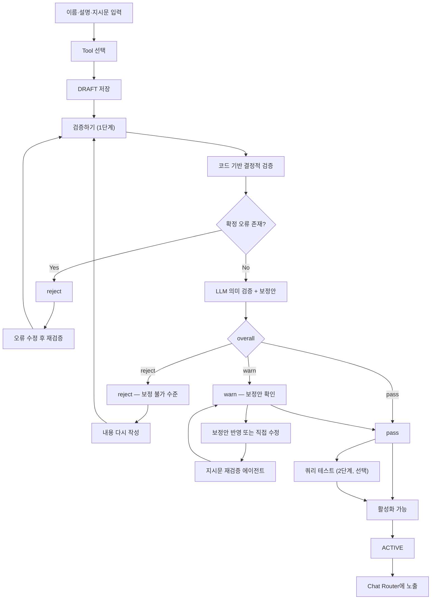
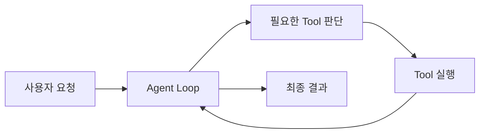
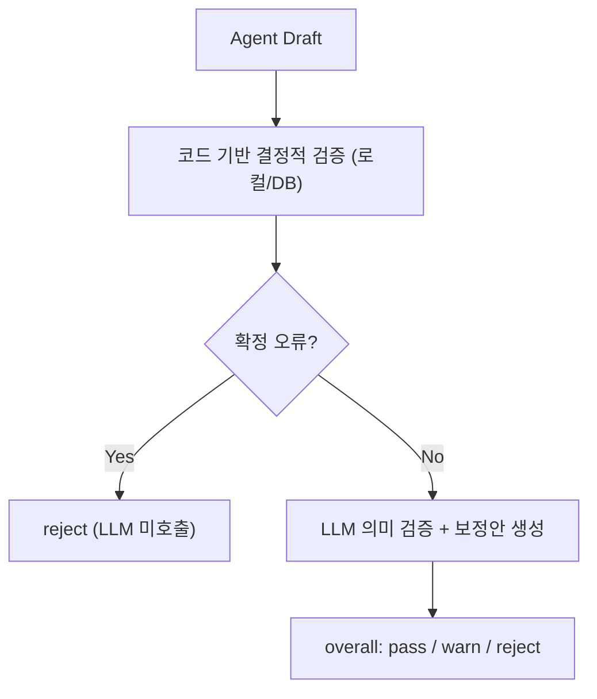

# 에이전트 빌더 최종 검증 방식 결정

> 작성일: 2026-08-12
> 개정: 2026-08-12 (3단계 → 2단계로 축소, 활성화 규칙 명확화)
> 문서 성격: 구현 완료 기록이 아니라, 에이전트 빌더의 생성·검증·활성화 방식에 관한 **최종 설계 결정문**
> 관련 범위: 기본 자율형 Agent, 고급 Workflow형 Agent, 1단계 검증 파이프라인, 지시문 재검증, Agent 생명주기

## 1. 최종 결론

사용자는 에이전트 초안을 작성한 뒤 검증을 **2단계**로 거친다.

1. **1단계 — 검증하기**: 코드 기반 결정적 검증과 LLM 기반 설명·지시문 의미 검증·보정을
   **하나의 흐름, 버튼 한 번**으로 실행한다. 결과는 `pass` / `warn` / `reject` 셋 중
   하나다.
2. **2단계 — 쿼리 테스트**: 실제 발화를 입력해 대화를 돌려보고 Tool 호출 여부·인자·
   결과를 눈으로 확인한다. 선택 사항이며 활성화의 필수 조건이 아니다.

1단계 안에서도 순서는 고정이다 — 코드 검증이 먼저이고, 거기서 확정 오류가 나오면
LLM을 부르지 않고 그 자리에서 `reject`로 끝낸다. 코드 검증을 통과해야 LLM 의미
검증으로 넘어간다.

```python
code_result = run_deterministic_checks(draft)
if code_result.has_blocker:
    return "reject", code_result.reason

llm_result = review_semantics(draft)  # description/instruction/tool_match + 보정안
return llm_result.overall, llm_result  # pass / warn / reject
```

1단계 코드 검증은 **로컬/DB로 확정할 수 있는 항목만** 본다. MCP 서버에 실제로
접속해보는 등 살아있는 외부 호출이 필요한 확인은 1단계에 넣지 않는다 — 텍스트만
고쳐서 "검증하기"를 눌러도 매번 외부 서버에 네트워크 호출이 나가면, 검증 속도와
성공 여부가 그 외부 서버의 순간 상태에 종속돼 버린다. 살아있는 연결·실행 확인은
전부 2단계(쿼리 테스트)의 몫이다.

사용자가 1단계 보정안을 보고 지시문을 직접 고치면, 처음부터 전체를 다시 검증하는
대신 **지시문만 가볍게 재검증하는 별도 에이전트**를 호출한다(§9).

## 2. 사용자 관점의 전체 흐름



`warn`과 `pass` 모두 활성화가 가능하다. `warn`은 사용자가 보정안을 검토하도록
안내만 할 뿐, 재검증을 강제로 막는 하드 게이트가 아니다 — LLM의 세부 판정은
같은 입력에도 미묘하게 흔들릴 수 있어, 이걸 활성화를 막는 조건으로 쓰면 사용자가
아무것도 안 바꿨는데 어느 순간 막히는 비결정적 차단이 생긴다. 실제로 확정적인
차단은 `reject`뿐이다.

## 3. 에이전트 초안 작성

사용자가 기본적으로 입력하는 값은 다음 네 가지다.

| 항목 | 역할 |
|---|---|
| 이름 | 사용자가 에이전트를 식별하는 표시명 |
| 설명 | Chat Router가 이 에이전트를 언제 선택할지 판단하는 정보 |
| 지시문 | 선택된 에이전트가 어떻게 일하고 어떤 결과를 반환할지 정하는 Prompt |
| Tool | 에이전트가 사용할 수 있도록 허용된 기능 목록 |

사용자가 Tool을 선택했다는 것은 해당 Tool을 반드시 매번 호출한다는 의미가 아니다.
기본 자율형 Agent에서는 사용 가능한 Tool 집합을 정한 것이며, 실제 사용 여부와 순서는
요청과 실행 결과에 따라 LLM이 결정한다.

## 4. Tool 선택 UI

Tool 선택은 별도의 팝업에서 제공한다.

```text
도구 추가
├── 기본 제공 Tool
├── MCP Tool
└── Tool 만들기
```

### 4.1 기본 제공 Tool

플랫폼이 직접 구현하고 관리하는 Built-in Tool이다.

예:

- 문서 검색
- 업무 추출
- 업무량 계산
- Jira Issue 조회·생성

### 4.2 MCP Tool

MCP 서버 전체 권한을 Agent에 주는 것이 아니라, MCP 서버가 제공하는 **개별 Tool**을
선택한다.

```text
Atlassian MCP
├── Jira Issue 검색
├── Jira Issue 조회
├── Jira Issue 생성
└── Jira Issue 수정
```

각 Tool에는 다음 정보를 표시한다.

- Tool 이름과 설명
- 기본 제공 또는 MCP 제공자
- 읽기 또는 쓰기 여부
- 연결·인증 상태
- 사용자 승인 필요 여부

### 4.3 Tool 만들기

P0의 Tool 만들기는 임의 코드를 생성해 서버에서 실행하는 방식보다, 제한된 API Tool
정의를 우선한다.

- Tool 이름과 설명
- HTTP Method와 URL
- 인증 방식
- 입력 파라미터 Schema
- 응답에서 사용할 출력 필드

임의 Python 실행이나 패키지 설치가 필요한 Tool은 Sandbox와 별도 보안 설계가
필요하므로 후속 범위로 둔다.

## 5. Agent 생성 방식

Agent 생성 방식은 기본 자율형과 고급 Workflow형으로 구분한다.

### 5.1 기본 자율형 Agent

사용자가 이름, 설명, 지시문, 허용 Tool만 정의한다. 실제 요청마다 LLM이 필요한 Tool과
호출 순서를 결정한다.



자율형 Agent 검증에서는 정확한 Tool 호출 순서를 강제하지 않는다. 2단계 쿼리
테스트에서 다음 행동을 눈으로 확인한다.

- 필요한 상황에서 적절한 Tool을 호출했는가
- 선택되지 않은 Tool을 호출하려 하지 않았는가
- Tool 인자가 Schema에 맞는가
- Tool 실패 시 무한 반복하지 않는가
- 쓰기 Tool 실행 전에 승인을 요구하는가
- 실패를 성공처럼 보고하지 않는가

### 5.2 고급 Workflow형 Agent

사용자가 Drag & Drop 방식으로 Node를 연결하여 실행 순서와 조건을 명시한다.


Workflow형에서는 Graph가 실행 순서를 결정한다. LLM은 LLM Node 또는 Agent Node 안에서
필요한 의미 판단만 담당한다.

P0의 최소 Node 종류는 다음과 같다.

- Start / User Input
- LLM 또는 Agent
- Built-in Tool / MCP Tool / Custom Tool
- Validation
- Human Approval
- IF/ELSE
- End / Output

Workflow형에서는 다음을 코드로 강하게 검증할 수 있다.

- Start와 End 존재 여부
- 연결되지 않았거나 도달할 수 없는 Node
- 앞 Node 출력과 다음 Node 입력의 Schema 호환성
- 분기별 종료 경로
- 종료되지 않는 순환
- 쓰기 Tool 전 승인 Node 존재 여부
- 정의된 Tool 실행 순서

착수 전이며, P0/P1 경계 범위다(§12).

## 6. 1단계 검증 파이프라인

사용자 화면에는 `AI 검증` 또는 `검증하기`로 표현하지만, 내부적으로는 코드 검증과
LLM 검증이 하나의 요청 안에서 순서대로 실행되는 단일 파이프라인이다.



중요한 규칙은 다음과 같다.

1. 코드 검증이 LLM 판단보다 먼저 실행된다.
2. 코드 검증에서 확정 오류가 나오면 LLM을 호출하지 않고 `reject`로 끝낸다 — 비용과
   응답 시간을 아낀다.
3. LLM은 코드 검증을 통과한 초안만 받으며, 코드 검증 항목의 결과를 뒤집을 수 없다.
4. LLM 단계의 `overall`이 그대로 1단계의 최종 `overall`이 된다 — 별도의 집계기가
   두 결과를 다시 합치지 않는다(코드가 이미 통과/차단으로 한 번 걸러줬기 때문에
   합칠 대상이 남지 않는다).

## 7. 1단계 코드 기반 결정적 검증

코드 검증은 의미를 추론하지 않는다. 일반 조건문, Schema Validator, Registry 조회 등
로컬 또는 DB 조회만으로 참·거짓을 확정할 수 있는 항목만 다룬다. 실제 네트워크 호출이
필요한 항목은 §10(2단계)로 분리한다.

### 7.1 Agent Definition

- 이름·설명·지시문 필수값 존재
- 필드 타입과 최대 길이
- 중복 Tool 참조
- 허용된 모델과 추론 설정

### 7.2 Tool Registry와 Schema (로컬/DB 조회)

- 선택 Tool이 Registry(내장) 또는 팀의 MCP Tool 목록(DB)에 존재하는가
- 저장된 Tool의 Input/Output Schema가 구조적으로 유효한가(`required` 필드가
  `properties`에 있는가, 배열에 `items`가 있는가 등)
- 동일한 Tool 이름이 충돌하지 않는가
- 선택 모델이 Tool Calling을 지원하는가

### 7.3 안전 정책 (정적 규칙)

- 쓰기 Tool(`side_effect=True`)에 승인 정책이 적용되는가

> **후속 확장 필요.** "Tool Timeout이 Run Timeout보다 비정상적으로 큰가", "재시도
> 횟수×Timeout의 최악 실행 시간이 Run Budget을 초과하는가"는 지금 `Tool` 모델에
> timeout·retry·budget 필드 자체가 없어 검사할 대상이 없다. 이 항목을 실제로
> 넣으려면 스키마 확장이 선행돼야 한다 — 지금은 범위에서 뺀다.

### 7.4 1단계에 넣지 않는 것 (2단계로 이동)

다음은 문서 초안 검토 과정에서 "1단계 코드 검증" 후보로 거론됐지만, 라이브 외부
호출이라 1단계(로컬/DB 전용)에서 뺐다. 2단계 쿼리 테스트에서 자연스럽게 확인된다.

- MCP 서버가 실제로 연결 가능한가(`initialize`, `tools/list` 성공 여부)
- 등록 당시와 현재 MCP Schema가 실제로 충돌하는가 — 현재는 등록 시점 Schema를
  별도로 보관하지 않고 동기화 때마다 덮어쓰므로, 드리프트 비교 자체가 스키마
  확장 없이는 불가능하다(후속)
- Tool의 실제 인증·Scope 유효성(만료 등)

사용자별 Credential을 실행 시 사용하는 Agent라면, 인증이 없다는 이유로 Agent 정의
전체를 1단계에서 차단하지 않고 `실행 시 연결 필요` 상태로만 표시한다.

## 8. 1단계 LLM 기반 의미 검증과 보정

코드 검사를 통과한 초안만 LLM 의미 검증으로 넘어간다. 지금 구현(`services/agent_
builder/service.py`)처럼 description_check·instruction_check·tool_match_check·
refined_instruction을 한 번의 구조화 출력으로 함께 받는다.

LLM은 다음을 검토한다.

- 설명이 Router가 선택할 만큼 구체적인가
- 설명과 지시문이 같은 목적을 가리키는가
- 지시문에 서로 충돌하는 규칙이 있는가
- 선택한 Tool과 목적이 의미적으로 일치하는가
- 필요한 Tool이 빠져 있거나 명백히 불필요한 Tool이 있는가
- 완료 조건과 실패 시 행동이 충분히 명확한가
- 공통 Scaffold와 중복되거나 충돌하는 지시가 있는가

의미 검증은 사용자의 원문을 임의로 덮어쓰지 않는다. 다음을 함께 반환한다.

- 현재 설명과 지시문
- 문제와 수정 이유(각 체크 항목의 note)
- 보정된 지시문(refined_instruction)
- 사용자가 직접 편집할 수 있는 수정 영역

`overall` 판정 기준:

- `reject` — 설명·지시문 중 하나라도 사실상 비어 있거나 "알아서 처리" 같은 위임
  표현뿐이라 다듬어서 쓸 지시문이 나오지 않는 수준
- `warn` — 세부 체크 중 하나 이상 걸리지만 다듬어서 실행 가능한 수준
- `pass` — 문제없음

사용자는 `제안 적용` 또는 `직접 수정`을 선택한다. 내용을 수정하면 §9의 지시문
재검증 에이전트로 다시 확인할 수 있다.

## 9. 지시문 재검증 에이전트

사용자가 1단계 보정안을 보고 지시문을 직접 고쳤을 때, 이름·설명·Tool 선택까지
포함한 전체 1단계를 처음부터 다시 도는 것은 느리고 낭비다. 지시문만 빠르게
다시 확인하는 경량 에이전트를 별도로 둔다.

이 에이전트는 다음 **두 가지만** 재검사한다.

- `instruction_check` — 수정된 지시문 자체의 명확성(트리거 조건, 절차, 도구 사용
  기준, 판단 기준)
- `tool_match_check` — 수정된 지시문이 기존에 선택된 Tool과 여전히 맞는가. 지시문을
  고치는 과정에서 새로 필요해진 Tool이나 더 이상 안 쓰이는 Tool이 생길 수 있으므로,
  지시문만 보고 이 항목을 빼면 Tool 불일치를 놓친다.

`description_check`는 재검증하지 않는다 — 설명 자체를 건드리지 않았다면 다시 볼
이유가 없다. 설명까지 고쳤다면 전체 1단계를 다시 돌려야 한다.

반환값은 1단계와 같은 형태(`overall: pass/warn/reject` + note)를 쓰되, description
관련 필드는 비워 둔다. 이 결과가 `pass`/`warn`이면 활성화 가능 상태를 유지하고,
`reject`면 다시 활성화가 막힌다.

## 10. 2단계 — 쿼리 테스트

1단계를 통과(pass/warn)한 뒤, 사용자는 실제 발화를 입력해 대화를 한 번 돌려볼 수
있다. 저장하지 않은 설정 그대로 실행하며, 승인 필요 Tool은 실제로 부르지 않고
시뮬레이션만 한다(`dry_run`).

이 단계가 다음을 함께 흡수한다.

- **Tool 연결·실행 확인** — 쿼리를 넣으면 LLM이 실제로 Tool을 호출하면서 연결·
  인증·응답 형식을 그대로 검증하게 된다. Tool마다 강제로 한 번씩 직접 불러보는
  별도 단계는 두지 않는다 — 필요하면 이 화면 안에서 개별 Tool을 직접 호출해보는
  보조 기능으로만 남긴다.
- **행동 검증** — 필요한 상황에서 적절한 Tool을 호출했는지, 선택하지 않은 Tool을
  부르려 하지 않는지, 실패를 성공처럼 보고하지 않는지를 눈으로 확인한다.

```yaml
test_case:
  input: "회의록에서 업무를 추출해줘"
  observed:
    tool_calls: [document_search, task_extraction]
    result: "..."
```

Tool 관련 문제는 다음 세 종류로 나누어 보여준다.

| 실패 종류 | 의미 |
|---|---|
| Tool 미선택 | 필요한 상황인데 Agent가 Tool을 호출하지 않음 |
| 인자 오류 | Agent가 Tool을 선택했지만 Schema와 맞지 않는 인자를 만듦 |
| 실행 실패 | 정상 인자였지만 인증, 연결, Timeout, 외부 서버 문제로 실패함 |

2단계는 **선택 사항**이다. 1단계가 pass/warn이면 2단계를 거치지 않고도 활성화할 수
있다(§11). 하나의 테스트 쿼리에서 호출되지 않은 Tool이 있다고 해서 그 Tool이
잘못됐다는 뜻은 아니다 — 그 요청에 필요하지 않았을 수 있다.

## 11. 최종 상태와 활성화 규칙

| `overall` | 의미 | 활성화 가능 여부 |
|---|---|---:|
| `reject` | 코드 검증에서 확정 오류가 있거나, LLM이 보정 불가 수준으로 판단함 | 불가능 |
| `warn` | 실행은 가능하지만 설명·지시문에 다듬을 점이 있음 | 가능(권장: 보정안 확인) |
| `pass` | 코드 검사와 의미 검사를 모두 문제없이 통과함 | 가능 |

**활성화 조건은 1단계 결과가 `reject`가 아닌 것 하나뿐이다.** 2단계 쿼리 테스트를
거쳤는지는 활성화 여부와 무관하다.

**1단계를 거치지 않고 활성화되는 경로는 없다.** 활성화 요청은 클라이언트가 들고
있는 이전 검증 결과를 신뢰하지 않는다 — 서버가 그 순간 DB에 저장된 최신 이름·
설명·지시문·Tool 선택으로 1단계를 그 자리에서 다시 실행하고, 결과가 `reject`가
아닐 때만 `ACTIVE`로 전환한다. 즉 활성화는 곧 "1단계를 최소 한 번 통과하는 것"과
동치이며, 사용자가 검증하기 버튼을 누른 적이 없어도 활성화를 누르는 순간 서버가
대신 1단계를 돌린다.

(검증 서비스 자체가 다운돼 1단계 호출이 실패하는 경우는 별개다 — 그건 검증 로직의
결함이 아니라 배포 사고이므로, 활성화를 막지 않고 경고만 남긴다.)

Agent 레코드의 영속 생명주기와 검증 결과는 구분한다.

```text
DRAFT → ACTIVE → DISABLED → ARCHIVED
```

- `DRAFT`: 작성 중인 초안. 검증 실패와 관계없이 저장할 수 있다.
- `ACTIVE`: 1단계를 통과(pass/warn)하고 활성화되어 Chat Router에 노출된다.
- `DISABLED`: 기존 정의는 보존하지만 Router와 실행 대상에서 제외한다.
- `ARCHIVED`: 삭제 또는 보관 처리된 상태다.

`pass`/`warn`/`reject`는 검증 Run의 결과다. 입력이나 Tool 설정이 바뀌면 기존 결과가
무효화될 수 있으므로 Agent의 장기 상태와 동일하게 취급하지 않는다 — DB 컬럼으로
영구 저장하지 않고, 활성화 시점마다 다시 계산한다.

## 12. 사용자 버튼과 동작

```text
[임시 저장]         언제든 DRAFT로 저장, 검증 불필요
[검증하기]           1단계(코드+LLM 결합) 실행. 최소 필수 입력이 있을 때 실행
[지시문 재검증]      1단계 결과를 보고 지시문을 고친 뒤, 지시문만 빠르게 다시 확인
[쿼리로 테스트]      2단계. 선택 사항, 언제든 실행 가능
[활성화]            1단계 최신 결과가 reject가 아닐 때 가능. 서버가 재검증 후 전환
```

## 13. 구현 우선순위

### P0

1. 기본 자율형 Agent Builder
2. DRAFT 저장과 ACTIVE 활성화 분리
3. 1단계: 코드 기반 Definition·Tool·Schema 검사(로컬/DB) + LLM 설명·지시문 의미
   검토·보정
4. 지시문 재검증 경량 에이전트
5. 2단계: 쿼리 테스트(대화 실행, dry_run)
6. pass / warn / reject 결과 화면
7. reject가 아닐 때만 활성화, 서버 측 재검증

### P0 또는 P1 경계

1. 2단계 안에서 개별 Tool 직접 호출 보조 기능
2. 시나리오별 Tool Call Trace 자동 평가
3. 실패 원인에 따른 지시문 재보정
4. 고급 Workflow Builder의 최소 Node와 Graph Validator

### 후속

1. Tool 모델에 timeout·retry·budget 필드 추가 + 관련 코드 검증
2. MCP 등록 시점 Schema 스냅샷 저장 + 드리프트 비교
3. 반복·병렬·Subagent Workflow
4. 임의 코드 Tool과 Sandbox
5. 복합 Workflow 중첩
6. 검증 Dataset과 버전별 성능 비교

## 14. 최종 설계 원칙

> 사용자는 Agent 초안을 작성하고 `검증하기`를 눌러 1단계(로컬/DB 코드 검증 →
> LLM 의미 검증·보정)를 하나의 흐름으로 거친다. 지시문을 고치면 경량 재검증
> 에이전트로 지시문만 다시 확인한다. 1단계 결과가 `reject`가 아니면 언제든
> 활성화할 수 있고, 활성화는 서버가 최신 값으로 1단계를 다시 돌려 확정한다.
> 2단계 쿼리 테스트는 실제 대화로 Tool 연결과 행동을 확인하는 선택적 수단이며
> 활성화의 필수 조건이 아니다. 기본 자율형에서는 LLM이 Tool 사용 순서를
> 결정하고, 고급 Workflow형에서는 사용자가 Graph로 실행 순서를 강제한다.
