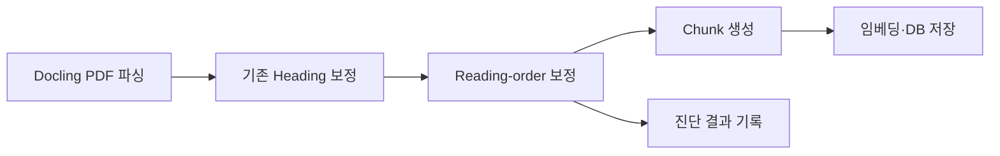
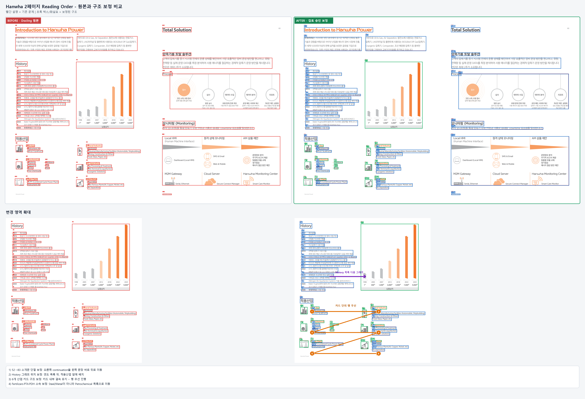
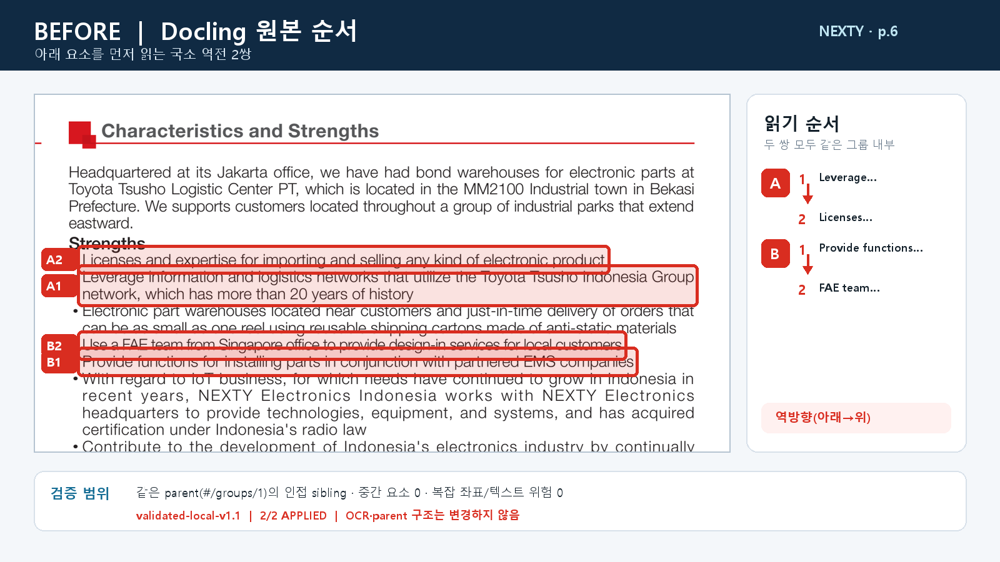
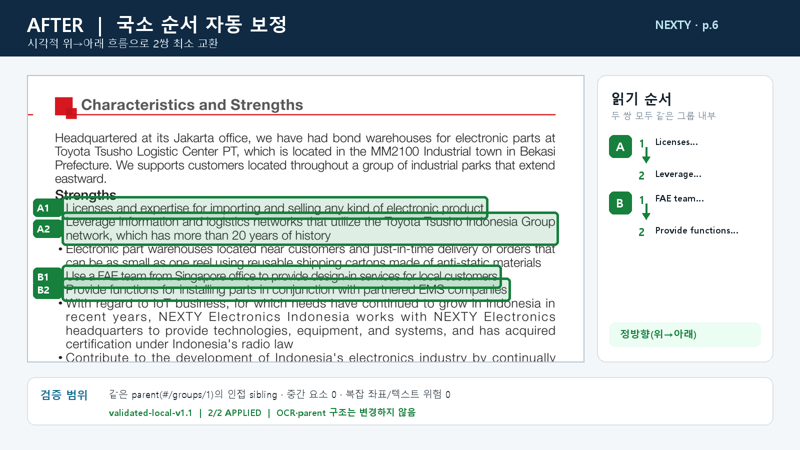
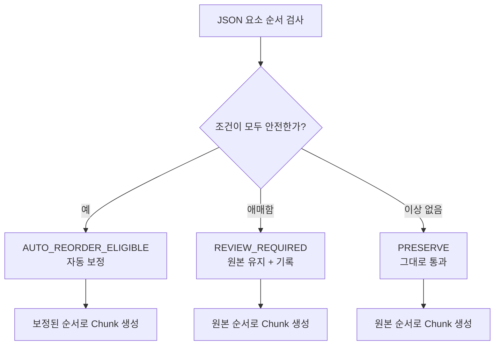

# Docling 읽기 순서 보정 룰 — 팀 공유용

## 한 줄 요약

Docling이 만든 최종 JSON에서 **같은 묶음 안의 위·아래 요소 순서가 뒤집힌 경우**만 찾아 보정하는 후처리 룰입니다.

Heading 검출, OCR, PaddleOCR-VL, PDF 파싱 자체를 대체하거나 수정하지 않습니다.

## 파이프라인에서의 위치



우리 룰은 Docling의 최종 결과와 Chunk 생성 사이에 들어갑니다.

## JSON에서 부모와 본문을 확인하는 방법

`parent_ref`는 우리가 좌표로 새로 만든 값이 아니라 Docling JSON의 `parent.$ref`를 그대로 읽은 값입니다. 같은 `parent_ref`라는 것은 **Docling 문서 트리에서 같은 직접 부모 그룹 아래에 있다**는 뜻입니다.

```json
{
  "self_ref": "#/texts/23",
  "parent": {"$ref": "#/groups/0"}
}
```

본문 순서는 JSON의 `body.children`에서 시작해 group 내부를 재귀적으로 따라가며 수집합니다. 헤더·푸터 같은 `furniture`는 제외하고, 좌표가 있는 본문·문단·불렛·캡션 등을 순서 비교 대상으로 삼습니다.

`parent_ref`가 없거나 좌표가 불완전하면 구조를 확신할 수 없으므로 자동 보정하지 않고 검토 대상으로 남기는 것이 병합 계약입니다. 현재 구현을 RunPod에 연결할 때 이 fail-closed 조건을 반드시 적용합니다.

## 자동 보정 조건

다음 조건을 모두 만족할 때만 `LOCAL_VERTICAL_INVERSION` 후보가 됩니다.

1. 두 요소가 같은 부모 그룹에 있다.
2. 두 요소가 서로 인접해 있다.
3. 좌우 위치가 거의 같다.
4. 화면 좌표상 한 요소가 명확히 위에 있다.
5. JSON 순서에서는 아래 요소가 먼저 나온다.
6. 중간에 다른 요소가 끼어 있지 않다.
7. 표·다단·이미지 겹침 같은 복잡한 구조가 아니다.

### 기준값과 기준을 둔 이유

| 확인 항목 | 현재 기준 | 기준을 둔 이유 |
|---|---:|---|
| 같은 페이지 | 반드시 같아야 함 | 페이지를 가로지르는 순서는 별도 판단이 필요해 오탐 위험이 큼 |
| 같은 부모 그룹 | `parent_ref`가 같아야 함 | 서로 다른 섹션이나 묶음을 섞지 않기 위해서 |
| JSON상 인접 | body 순서상 바로 붙어 있어야 함 | 멀리 떨어진 요소를 임의로 재배열하지 않기 위해서 |
| 좌우 정렬 차이 | `0.035` 이하 | 같은 열·같은 문단 흐름인지 확인하기 위해서 |
| 세로 위치 차이 | `0.005 ~ 0.08` | 너무 가까운 줄 간격이나 지나치게 먼 영역을 제외하기 위해서 |
| 중간 시각 요소 | `0개` | 다른 요소가 사이에 있으면 단순 swap으로 보기 어렵기 때문 |
| 복합 geometry | 없어야 함 | 표·다단·겹침은 별도 구조 문제로 자동 보정하지 않기 위해서 |
| 요소 종류 | 본문·문단·불렛·캡션 계열 | 순서 비교가 가능한 본문성 요소만 대상으로 제한하기 위해서 |
| 적용 방식 | 인접 요소 swap | 가장 작은 변경으로 원래 순서를 복원하기 위해서 |

좌표 기준값은 페이지 크기로 나눈 정규화 값이다. 예를 들어 페이지 높이가 1000이고 두 요소의 세로 차이가 20이면 `0.02`로 계산한다.

## 한화 PDF 실제 사례

한화 2페이지에서는 소개 문장이 두 개의 텍스트 박스로 나뉘어 있습니다.

화면상으로는 왼쪽 문장이 끝난 뒤 오른쪽 문장이 이어져야 합니다.

```text
왼쪽: 기술과 경험을 바탕으로 1997년 산업용 에너지 장비 시장에 진출 ...
오른쪽: 기반으로 Oil & Gas, Air Separation, 발전소에 사용되는 연료가스 ...
```

그런데 Docling body 순서는 왼쪽 텍스트(`#/texts/51`) 뒤에 바로 오른쪽 텍스트(`#/texts/81`)가 오지 않고, 다른 요소를 거친 뒤에 저장되어 있었습니다. 그래서 검토 결과를 다음처럼 제안했습니다.

```text
기존 JSON 흐름:  #/texts/51 → (다른 요소들) → #/texts/81
보정 흐름:      #/texts/51 → #/texts/81 → (다음 섹션)
```

코드는 텍스트가 이어질 가능성, 두 박스의 좌표·가로 관계, 중간 요소의 위치를 확인하고, 사람이 확인할 수 있는 `MOVE_AFTER` 후보를 만듭니다.



이 이미지는 왼쪽이 Docling 원본, 오른쪽이 검토 승인 보정본입니다. 빨간 표시는 원래 배치, 초록·파란 표시는 보정된 구조를 나타냅니다.

한화의 카드 그리드·History 그래프 보정은 구조가 복잡해 현재 `LOCAL_VERTICAL_INVERSION` 하나로 자동 처리하는 사례가 아닙니다. 따라서 이 이미지는 **순서 보정이 실제로 어떤 결과를 만드는지 설명하는 참고 사례**이고, 자동 적용 가능 여부는 별도 규칙과 검증이 필요합니다.

## NEXTY PDF 자동 보정 사례

한화 사례와 달리 NEXTY 6페이지는 같은 `parent_ref` 안에서 아래 요소가 먼저 저장된
인접 sibling 역전 2쌍이 모든 guard를 통과해 실제 자동 최소 교환 대상이 된 사례다.





두 쌍 모두 `validated-local-v1.1`에서 적용됐으며 OCR 결과, parent와 원문 텍스트는
바꾸지 않고 sibling 순서만 위→아래로 정리했다. 따라서 이 사례가 현재 자동 규칙의
실제 작동 범위를 한화 복합 사례보다 더 직접적으로 보여준다.

## AutoResearch와의 관계

순서보정에도 AutoResearch-lite 평가기와 입력 동결 구조는 준비했지만 threshold
전수탐색은 실행하지 않았다. 당시 근거가 DEV·사후검토·합성·독립 HOLDOUT으로
혼합돼 있어 한 표로 탐색하면 데이터 누수와 과적합이 생기기 때문이다. 준비도
평가 결과는 `EVIDENCE_NOT_READY_FOR_THRESHOLD_AUTORESEARCH`였고, 현재 threshold는
교차문서 검증과 보수적 회귀 검사를 통해 동결한 휴리스틱이다.

## 단순 국소 역전 사례의 처리 과정

현재 자동화 대상인 국소 역전은 다음처럼 처리됩니다.

```text
같은 페이지인가?                    예
parent_ref가 같은가?                예
JSON상 바로 붙어 있는가?            예
좌우 차이가 0.035 이하인가?         예
세로 차이가 0.005~0.08인가?         예
중간 sibling이 없는가?              예
복합 geometry가 없는가?             예
                    ↓
현재 JSON: 아래 요소 → 위 요소
보정 결과: 위 요소 → 아래 요소
```

이때 원본 JSON은 지우지 않고 원래 순서와 보정 순서를 함께 기록합니다.

```text
같은 부모
   + 인접
   + 같은 좌측 정렬
   + 위/아래 위치 명확
   + 중간 요소 없음
   + 복잡한 구조 아님
          ↓
   자동 보정 후보
```

텍스트의 쉼표, 하이픈, 한국어 연결 표현 등은 보조 힌트로만 사용합니다. 텍스트 단서 하나만으로 순서를 바꾸지는 않습니다.

## 결과 분기



운영에서는 모든 문서를 사람이 확인하지 않습니다.

- 확실한 국소 역전은 자동 보정
- 애매한 사례는 파이프라인을 멈추지 않고 원본 유지
- 후보와 판단 근거만 진단 정보로 기록

## 현재 적용하지 않는 문제

- Heading 레벨 자체가 틀린 경우
- OCR 누락·문자 깨짐
- 이미지 내부 글자 순서
- 표·타임라인·다단 구조 전체 재배열
- 서로 다른 부모 그룹 사이의 순서 변경
- 좌표가 불완전하거나 구조가 모호한 경우

이런 문제는 다른 담당 범위 또는 별도 `REVIEW_REQUIRED` 오류 유형으로 분리합니다.

## 현재 검증 결과

- 확정 후보 20건
- 실제 순서 오류 20건
- 오탐 0건
- 삼성SDS 신규 독립 문서에서 3건 재현
- 포스코퓨처엠·삼성SDS 총 28페이지 검토
- 자동 승격 기준은 아직 미충족하므로 현재는 검토 승인형으로 운영

## 팀원 작업과의 관계

```text
Docling + Heading + PaddleOCR-VL
             ↓
        최종 JSON
             ↓
      우리 순서 보정
             ↓
       Chunk / VLM / 업무 추출
```

우리 작업은 파싱 담당 팀원의 결과를 대체하지 않습니다. 최종 JSON에서 순서만 보완해 Chunk와 이미지 설명에 더 일관된 앞뒤 문맥을 제공하는 역할입니다.

## 현재 병합 시 계약

원본 JSON은 보존하고, 다음 정보를 함께 기록합니다.

```json
{
  "original_order": ["B", "A"],
  "corrected_order": ["A", "B"],
  "applied_rules": ["LOCAL_VERTICAL_INVERSION"],
  "review_required": []
}
```

현재 목표는 **명확한 국소 순서 오류를 자동 보정하고, 애매한 문제는 원본을 유지하면서 기록하는 안전한 후처리 모듈**입니다.

threshold별 근거와 PaddleOCR-VL/PP-Layout 비교 결과는
[`순서보정_threshold_및_Paddle_비교.md`](순서보정_threshold_및_Paddle_비교.md)에
정리했습니다.

전체 페이지 Paddle 비교 실행은 `external_validation/paddle_full_page_shadow_v1_runpod.zip`과 선택 PDF 묶음 `external_validation/paddle_full_page_shadow_v1_corpus.zip`을 사용합니다. 이 비교도 사람이 overlay를 확인하기 전에는 Docling JSON을 덮어쓰지 않습니다.
