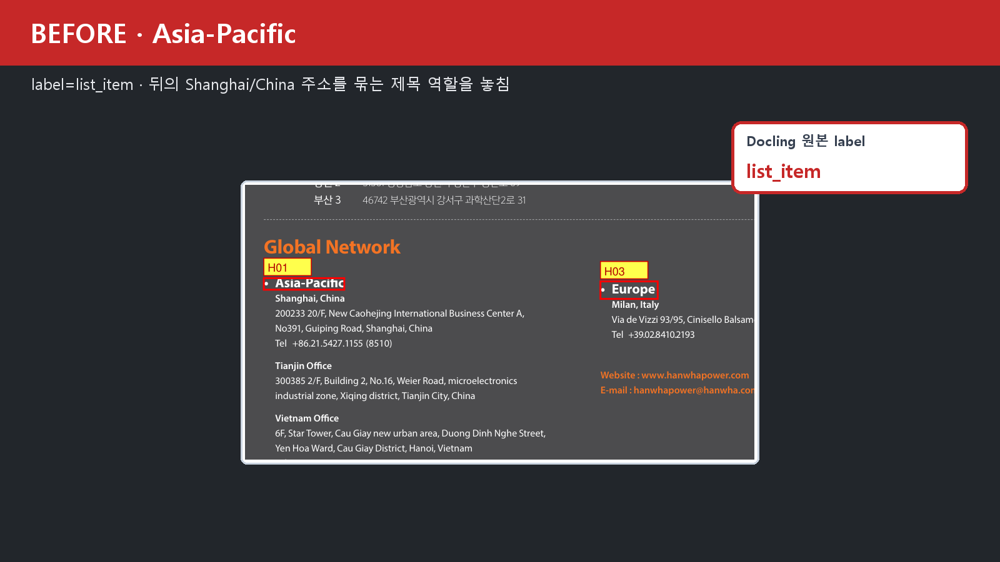
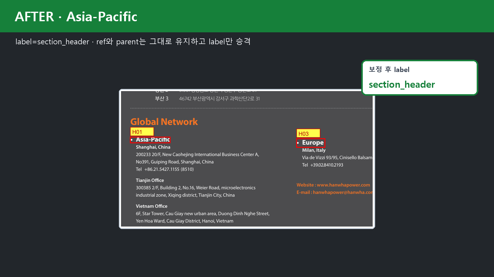
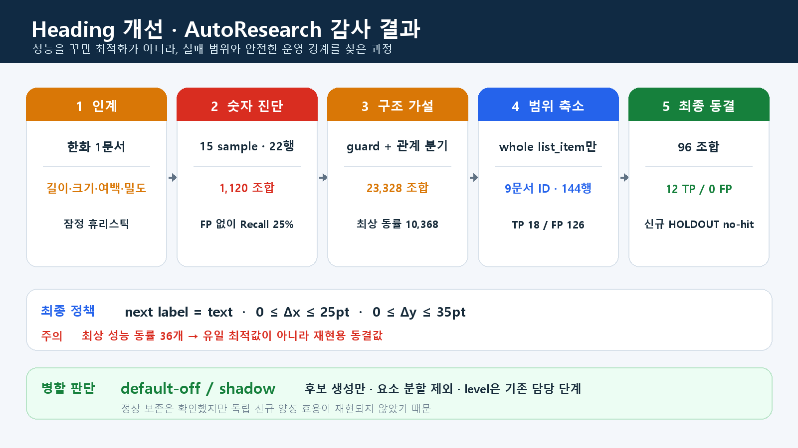

# Heading 개선 전체 이력

작성일: 2026-08-25
범위: 최초 density 코드 인계부터 Docling 2.119 검증·AutoResearch·HOLDOUT·실제 JSON 적용·동결까지

> 출처 표기: 본문의 `heading_validation/*`, `autoresearch_lite/*`, `practice/*`,
> `handoff/*`는 이 제품 저장소 내부 경로가 아니라 개인 Docling 실험 정본과
> canonical handoff `docling_postprocess_merge_handoff_20260825_v2`에서 검증한
> 원본 상대 경로다. 현재 저장소에는 큐레이션 문서와 대표 이미지만 포함한다.

## 1. 문제 정의

Docling이 실제 섹션 제목을 `text` 또는 `list_item`으로 내보내면 뒤의 Chunk 계층과 문맥이 약해질 수 있다. 최초 목표는 누락된 제목을 `section_header`로 복구하는 것이었다.

다만 진행 중 세 문제를 분리했다.

1. whole element의 label이 잘못된 경우
2. 한 element 안에 제목과 본문이 합쳐진 경우
3. heading level이 잘못된 경우

최종 담당 범위는 **1번 중에서도 whole-element `list_item` 승격 후보 생성**뿐이다. 요소 분할은 제외했고 level 결정은 기존 헤딩 담당 단계에 맡긴다.

## 2. 최초 인계 상태

인계 코드는 아래 네 시각 신호를 AND로 사용했다.

```text
짧음(≤60자)
AND 로컬 본문보다 큼(≥1.15배)
AND 위 공백(≥4pt)
AND 아래 밀도 - 위 밀도 ≥0, 창 120pt
```

장점은 설명 가능하고 계산이 가볍다는 점이었다. 한계는 한화 1문서 기반 잠정값이며, 고정 창이 이전 섹션까지 포함하고, 카드·목차·표 값도 짧고 크게 보일 수 있다는 점이었다.

## 3. Docling 2.119 전환과 기준선 재측정

팀 공통 버전이 2.119로 정해져 2.117과 지표를 섞지 않고 2.119 결과를 새 기준선으로 삼았다. 15개 교차문서 sample을 실행했고 Plana 66페이지만 pypdfium2 복구 backend를 사용했다.

표적 후보 22행에서 초기 broad 규칙은 오탐을 만들고 실제 헤딩을 놓쳤다. 숫자 threshold 1,120조합을 비교해도 최고 F1은 Precision 44.4%, 높은 Precision 조건에서는 Recall 25%였다.

결정: 숫자 조정만 계속하지 않고 구조 오탐을 먼저 막는다.

## 4. 구조 guard 도입

### 차단한 구조

- key-value 영역
- 목차/index 페이지
- 반복 카드 문구
- 기존 section header와 중복되는 이미지 텍스트

### 승격 가설

- 희소 페이지의 대문자 구분자
- 큰 짧은 소제목
- list item 뒤 들여쓴 body text
- text 제목 뒤 연속 list

같은 DEV에서 8 TP/0 FP가 됐지만, 같은 데이터를 보고 만든 규칙이므로 곧바로 운영 성능으로 간주하지 않았다.

## 5. AutoResearch-lite 기반 마련

입력·라벨·평가기 hash를 동결하고, 10개 파라미터 23,328개 설정을 전수 평가했다. 기준선과 똑같은 8 TP/0 FP 설정이 10,368개여서 threshold 식별력이 부족함을 확인했다.

AutoResearch의 첫 성과는 성능 숫자를 올린 것이 아니라 **임의 threshold 변경을 멈춰야 한다는 근거**를 만든 것이다.

## 6. broad 정책 HOLDOUT 실패

### HOLDOUT v1

- 8개 한국 기업 문서, 24페이지
- 후보 272건
- 자동승격 1건: 카드 제목이어서 FP
- Precision 0/1

실패 원인은 한국어 `목차`를 index guard가 인식하지 못한 것이었다. guard를 추가했지만, 실패를 본 뒤 바꿨으므로 v1은 회귀 DEV로 전환했다.

### HOLDOUT v2

- 10문서, 69페이지
- 후보 521건
- 자동승격 6건 전부 FP

FP는 광고 흐름 단계, 연혁 사건, 아이콘 라벨, 내비게이션, 장식 문자, 프로젝트 기간이었다.

결정: broad `text/list_item` 자동승격 정책은 운영 후보에서 제외한다.

## 7. 팀원 지침 반영: list-item 전용 문제로 축소

정확한 문제를 다음처럼 다시 정의했다.

> Docling 2.119가 `list_item`으로 분류한 whole element 중, 바로 뒤의 별도 `text` 본문을 여는 섹션 경계만 `section_header` 후보로 만든다.

요소 안의 bold lead-in과 설명을 쪼개지 않는다. 표지 제목, 표·카드 라벨, 날짜, 고객사 값도 이번 정답 범위가 아니다.

## 8. 라벨 데이터 구축

### DEV v1

- 회귀 DEV 4문서·8페이지의 list-item 122건: 전부 FP
- 기존 seed 6건: TP 3 / FP 3
- 합계: TP 3 / FP 125

양성 3건이 모두 한화 Global Network 한 페이지라 정책 확정을 중단했다.

### 웹 양성 보강

Docling issue #2246의 NOAA 문서를 2.119에서 재현했다.

- NOAA raw list-item: 16
- TP 15 / FP 1
- 부산·건설 지침은 목표 제목이 이미 section_header라 새 list-item 양성 0

### DEV v2

- 고유 문서 ID 9
- 총 라벨 144
- TP 18 / FP 126
- 양성 문서 2종: 한화, NOAA

이 수치가 실제 최종 파라미터 탐색 데이터다. 과거의 “7문서” 설명은 추출 문서와 CSV 포함 문서를 혼동한 것으로 정정해야 한다.

## 9. list-item AutoResearch 결과

96개 조합을 비교해 다음 정책을 기록값으로 선택했다.

```text
명시적 목차/반복 날짜 카드 제외
next label == text
next indent delta 0~25pt
next vertical delta 0~35pt
```

DEV 결과:

- TP 12 / FP 0 / FN 6 / TN 126
- Precision 100%
- Recall 66.7%
- F1 0.80
- Precision Wilson 95% 하한 75.8%
- 정상 보존율 100%

18개 실제 양성 중 12개만 자동 후보로 만들고, 바로 다음 요소가 text가 아닌 NOAA 6개는 원본 유지했다.

감사상 주의: 최상 성능 동률이 36개이므로 `0~25/35`를 유일한 최적값이라고 설명하지 않는다.

## 10. 동결 정책 독립 검증

### list-item HOLDOUT v1

- 3문서·13페이지
- raw list-item 67건
- TP 0 / FP 0 / TN 67
- 정상 보존 100%, Wilson 하한 94.6%

일반 불렛·목차·카드 상세를 건드리지 않는 안전성은 확인했지만, 양성이 없어 효용은 측정하지 못했다.

### 완전 신규 양성 표적 HOLDOUT

- Stanford·Baylor·Columbia, 3문서·7페이지
- raw list-item 36건
- 자동승격 0

### 공동 신규 HOLDOUT

- 5문서·9페이지
- raw list-item 97건
- 자동승격 0

두 번의 신규 HOLDOUT에서 no-hit가 반복됐다. 원인은 threshold가 너무 좁아서라기보다 Docling 2.119에서 `짧은 list_item → 별도 text` 형태가 희소하기 때문이다.

## 11. 실제 자동 적용 데모

한화 Global Network에서 다음 3개를 실제 JSON에 적용했다.

| 원문 | 변경 | 생성 level |
|---|---|---:|
| Asia-Pacific | list_item → section_header | 3 |
| Americas | list_item → section_header | 6 |
| Europe | list_item → section_header | 5 |

RunPod Docling 2.119에서 원본 불변, ref·parent·중복 무결성, DoclingDocument schema 검증을 통과했다.

하지만 동급 지역 제목 level이 3/6/5로 갈렸으므로:

- 이 규칙은 승격 후보만 제안한다.
- 최종 level은 기존 담당자의 heading level 단계에서 결정한다.





위 전후 이미지는 `max-promotions=3` 통제 실행에서 실제 JSON label 변경과 schema
검증이 성공했음을 보여주는 증거다. 독립 HOLDOUT의 운영 효용이 입증됐다는 뜻은
아니며, 아래와 같이 최종 정책은 `default-off / shadow`로 유지한다.



## 12. 현재 효용과 한계

### 유효한 것

- list-item whole element의 보수적인 승격 후보를 설명 가능한 구조 신호로 제안한다.
- 일반 불렛·목차·카드 193개 알려진 음성을 모두 보존했다(DEV 126 + 독립 HOLDOUT 67).
- 실제 JSON label 변경과 schema 안전 경로가 작동한다.
- 계산이 가벼워 Docling 후처리에 넣기 쉽다.

### 아직 입증되지 않은 것

- 신규 문서에서의 자동승격 Precision·Recall
- 전체 헤딩 누락 복구율
- element 내부 bold lead-in 분할
- heading level 정확도
- NOAA를 제외한 다양한 독립 양성 문서 일반화

## 13. 최종 병합 권고

```text
Docling 2.119
  → list-item whole-element heading 후보 생성(default-off)
  → 기존 팀원의 heading 확정·level 보정
  → Chunker
```

- 기본값: 비활성 또는 shadow
- 켤 수 있는 범위: 후보 감사/데모
- 운영 자동 활성화: 새로운 독립 양성 문서에서 효용 재현 후 재검토
- 요소 분할: 제외
- level 독자 결정: 제외

## 14. 발표에서 사용할 정확한 문장

> 처음에는 한화 한 문서 기반의 글자 크기·길이·여백·밀도 휴리스틱이었습니다. 15개 교차문서와 두 차례 broad HOLDOUT에서 카드·목차·타임라인 오탐을 확인해 숫자 조정만으로는 부족하다고 판단했습니다. 이후 문제를 whole-element list-item 승격으로 축소하고 NOAA 공식 이슈를 포함한 9개 문서 ID, 144개 라벨에서 96개 threshold 조합을 비교했습니다. DEV에서는 12 TP·0 FP였고 실제 JSON 적용·schema 검증도 통과했지만, 신규 HOLDOUT에서 양성 후보가 재현되지 않아 현재는 default-off 실험 기능으로 전달합니다.

## 15. 증거 지도

| 주장 | 증거 |
|---|---|
| 최초 4신호와 잠정값 | `heading_validation/density_promotion/DENSITY_HEADING_CORRECTION_SPEC.md:49-146` |
| 15 sample·22행·1,120조합 | `heading_validation/evaluation/heading_crossdoc_119_v2_결과요약.md:10-35` |
| broad 구조 가설 8/0 | `heading_validation/evaluation/crossdoc_119_v2_structure_hypothesis.json:counts,branch_counts,warning` |
| AutoResearch 23,328·10,368 동률 | `autoresearch_lite/EXPERIMENT_REPORT_20260824.md:11-22` |
| HOLDOUT v1 1 FP | `heading_validation/HEADING_STRUCTURE_HOLDOUT_V1_RESULT.md` |
| HOLDOUT v2 6 FP | `heading_validation/HEADING_STRUCTURE_HOLDOUT_V2_RESULT.md` |
| list-item v1 122 FP | `heading_validation/list_item_autoresearch_dev_v1/label_summary.json` |
| 최종 DEV 9문서·144행 | `heading_validation/list_item_autoresearch_dev_v2/artifacts/dataset_summary.json` |
| 최종 정책과 DEV 지표 | `heading_validation/list_item_autoresearch_dev_v2/artifacts/best_policy.json` |
| 96개 모든 결과 | `heading_validation/list_item_autoresearch_dev_v2/artifacts/all_results.json` |
| 독립 67 음성 보존 | `heading_validation/list_item_heading_holdout_v1/holdout_metrics.json` |
| 신규 36 list-item no-hit | `heading_validation/HEADING_UNSEEN_POSITIVE_HOLDOUT_V1_RESULT.md` |
| 공동 신규 97 list-item no-hit | `docs/JOINT_UNSEEN_VALIDATION_V1_RESULT.md:30-46` |
| 실제 3건 적용·schema PASS | `handoff/docling_postprocess_merge_handoff_20260825/heading_evidence/promotion_audit_max3_docling119.json` |
| 최종 동결 판단 | `docs/HEADING_EXPERIMENT_FREEZE.md` |
