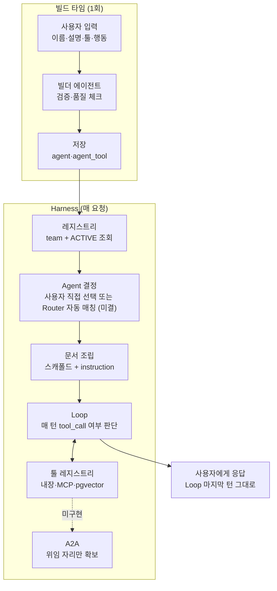

# Deep-Agent 활용 설계 정리

> 2026-08-10 작성. Cowork 세션에서 나눈 대화를 정리한 것.
> 관련 문서: `../2_아키텍처_초안.md`(Agent Harness 설계 골자),
> `deep-agents_분석.md`(참고 저장소 분석·적용 여부 표).
> 이 문서는 그 둘 사이에서 "왜 이렇게 판단했는지"의 대화록을 정리한 것이다.

## 1. 배경

Cohere North·IBM watsonx를 벤치마크로 검토하던 중, 8/8 멘토링에서 프로젝트
방향이 "업무 분배 단일 서비스 → 비개발자용 Agent Platform"으로 공식 피벗했다.
노코드 에이전트 빌더 + Agent Harness + Connector/MCP 구조가 확정됐고, 이
문서는 그중 **Deep-Agent를 어디에 얼마나 써야 하는가**를 처음부터 끝까지
따져본 기록이다.

## 2. 전체 구조 — 3층으로 나뉜다

| 층 | 언제 도는가 | 하는 일 |
|---|---|---|
| **Builder** | 에이전트 만들 때 1회 | 사용자 입력 검증 → `agent`/`agent_tool` 레코드 저장 |
| **Registry** | 조회할 때마다 | `team_id` + `status=ACTIVE`로 활성 에이전트 목록 제공 |
| **Harness** | 채팅 요청마다 | 라우팅 → 문서 조립 → Loop 실행 |

세 층은 책임과 실행 생명주기가 분리된다. 공통 스키마·Repository는 공유할 수
있지만, Builder 장애가 이미 활성화된 Agent 실행을 막지 않도록 Harness와
강하게 결합하지 않는다.

## 3. 에이전트 빌딩

사용자는 **name / description / tools / behavior 4개를 직접** 입력한다
(한 문단을 AI가 나눠주는 방식 아님). 이걸 받아 저장하는 "빌더 에이전트"가
실제로 판단(LLM 호출)해야 하는 건 생각보다 좁다.

| 항목 | 누가 하는가 |
|---|---|
| behavior → instruction 다듬기 | **빌더 에이전트(LLM)** |
| description이 라우팅에 쓸 만큼 명확한지 체크 | **빌더 에이전트(LLM)** |
| behavior 내용과 선택한 tools가 서로 맞는지 체크 | **빌더 에이전트(LLM)** |
| `team_id` 주입 | 백엔드 코드 (세션에서 가져옴) |
| `max_iterations` 기본값 | 백엔드 코드 (플랫폼 고정값) |
| 배포 전 확인 화면 | 화면 설계 (Builder 위저드 흐름) |
| 빌더 에이전트 자체를 Builder로 재생성 못 하게 막기 | 화면 + 백엔드 검증 (`is_prebuilt`/시스템 Agent 보호, 권한·Tool 허용 목록 확인) |
| 에이전트 편집 권한(팀 전체 vs 작성자만) | **미결 — IA §4 미결정 3과 동일** |

## 4. 활성화·연결 메커니즘

커넥터 · 툴 · 에이전트 · 레지스트리는 서로 미리 배선되지 않는다. 그냥
외래키로 참조만 걸어두고, 요청이 올 때마다 다시 조회한다.

```
활성 에이전트 = SELECT * FROM agent WHERE team_id=? AND status='ACTIVE'
   → 매칭된 에이전트의 tool_ids 로드
   → 각 tool이 요구하는 connector 상태 확인
   → 통과한 tool만 이번 실행에 노출
```

"비활성화"는 코드가 뭔가를 끊는 게 아니라 `status` 컬럼 하나를 바꾸는 것뿐이다
— 커넥터의 OAuth 토큰이나 에이전트 설정 자체는 그대로 남는다. 기존
`_require_team` 패턴 위에 `agent`·`agent_tool`·`tool` 테이블만 얹으면 된다.

### MCP Tool 보안·운영 경계 (미해결)

사용자가 Settings에서 MCP 서버 URL을 직접 등록하는 구조라서, 지금까지 설계에서
안 다룬 운영 리스크가 있다 — 특히 대표 E2E가 Jira에 실제로 쓰기 작업을 한다는
점에서 뒤로 미룰 항목이 아니다.

- **SSRF 방지**: 사용자가 등록한 URL을 서버가 그대로 호출하면 내부망 접근
  통로가 될 수 있다. 허용 프로토콜·도메인 화이트리스트가 필요하다.
- **인증정보 보호**: MCP 서버 인증 토큰을 평문으로 저장하지 않는다(암호화 저장).
- **쓰기 Tool 승인**: Jira 이슈 생성처럼 부작용이 있는 Tool은 §12에서 다룬
  Human-in-the-loop 확인 단계를 반드시 거치게 한다(이미 결정된 사항, 여기선
  경로만 재확인).
- **Idempotency**: 확인 후 재시도·중복 클릭으로 Jira 이슈가 두 번 생성되지
  않도록 요청에 idempotency key를 붙인다.

이 항목들은 화요일 아키텍처 확정 전에 §6(MCP 실행 구조)에 반영이 필요하다.

## 5. Deep-Agent란 결국 무엇인가

**일반적인 정의부터.** `langchain-ai/deepagents`(프로덕션판) 기준 Deep Agent는
Planning(TODO)·Context Offloading(가상 파일시스템)·Sub-agent Delegation·
Persistent Memory·Human-in-the-loop·Skills·Model-agnostic 연결·MCP까지 묶은
**opinionated harness**다. 이 중 어느 하나만으로 Deep Agent라 부르는 게 아니다.

**우리가 채택하는 범위는 이 중 일부다.** 8월 범위 안에서 실제로 동작하게
만드는 건 아래 **두 가지 장치**뿐이고, 나머지(Filesystem·Sub-agent·Memory·
Skills)는 §12에서 각각 이유를 들어 구조만 만들거나 아예 배제한다.

1. **루프 호출 횟수 상한** — 실제 원문(`RESEARCHER_INSTRUCTIONS`)엔 "Simple
   queries: 1-2회, Normal: 2-3회, Complex: 최대 5회, 5회 넘으면 무조건 중단"
   처럼 난이도별 숫자가 프롬프트 문장으로 박혀 있다. 다만 이건 **프롬프트
   지시(소프트)**이고, 실제로 멈추게 하려면 Harness 코드가 강제하는 **하드
   상한**이 따로 필요하다 — §6에서 구분한다.
2. **복잡한 작업이면 계획부터 세우라는 지시(Planning/TODO)** — `write_todos`
   툴의 실제 설명에도 "Avoid for single, trivial actions"라고 못박혀 있다.
   즉 계획 세우기는 필수 조건이 아니라, 스텝이 길어질 때만 쓰는 옵션이다.

**우리 범위 안에서의 핵심 결론 — 에이전트가 문서(스캐폴드+instruction)를 보고
매 턴 "더 할지 말지"를 판단하면서 루프를 여러 번(몇 번일지 미리 정해지지
않은 채로) 돌리면 그게 우리가 구현하는 Deep-Agent다.** 그 반복이 길어질 것
같으면 계획까지 세워가며 돈다 — 별개의 두 가지가 아니라 같은 판단의 연장선이다.
단, 이건 "Deep Agent 개념 전체"가 아니라 "우리가 지금 채택하는 부분집합"에
대한 결론이다.

### 3대 패턴 적용 여부 (`deep-agents_분석.md` §9 요약)

| 패턴 | 적용 여부 |
|---|---|
| Task Planning (TODO) | **적용** — 업무 추출 파이프라인이 이미 이 모양이다 |
| Context Offloading (가상 파일시스템) | **구조만** — 대표 E2E는 루프·Tool 결과 크기를 제한하므로 우선순위가 낮다 |
| Sub-agent Delegation | **여지만** — 완성 목표 아님(멘토링 §6-4) |
| Persistent Memory (세션 간 기억) | **비적용** — 테넌트 격리·최신성 무효화·평가 범위 부담이 큼 |

## 6. Harness가 실제로 하는 일

매 요청마다 이렇게 조립된다.

```
최종 system prompt
  = [Harness 공통 스캐폴드]   ← 개발자가 1회 작성, 모든 에이전트 공통
    "복잡하면 write_todos로 계획 세워라. 툴 호출은 최대 N번.
     근거 없이 추측하지 마라."
  + [agent.instruction]       ← 사용자가 Builder에 쓴 behavior 그대로
```

이 스캐폴드는 `agent` 레코드에 저장되는 게 아니라 **Harness 실행 코드 안의
고정 템플릿**이다 — 나중에 이 템플릿을 고쳐도 기존 에이전트를 하나하나
편집할 필요 없이 다음 실행부터 바로 적용된다.

**Loop 자체는 모든 에이전트에 항상 존재하는 틀**이고, 몇 번 도는지는 그
틀 안에서 에이전트가 매 턴 "tool_call을 낼지 최종 답을 낼지" 판단한 결과가
쌓인 것일 뿐이다. Deep이 되기로 미리 결정하는 단계는 없다.

### 상한은 두 겹이다 (소프트 + 하드)

스캐폴드에 적힌 "툴 호출은 최대 N번"은 **모델에게 주는 지시일 뿐**이다 —
`deep-agents-from-scratch` 원문도 프롬프트 문장으로만 되어 있고, 모델이 그
지시를 반드시 지킨다는 보장은 없다(멈춰야 할 상황을 못 알아채거나, 지시를
못 보고 지나칠 수 있다). 그래서 두 층이 같이 있어야 한다.

1. **소프트(프롬프트)** — 스캐폴드 문장. 모델이 스스로 판단해서 일찍 멈추게
   유도한다. 효율(불필요하게 5번까지 다 안 돌게)을 위한 장치다.
2. **하드(Harness 코드)** — Loop 실행기가 turn 수·tool_call 수를 직접 세고
   있다가 `agent.max_iterations`를 넘으면 모델 판단과 무관하게 강제 종료한다.
   실제 비용·무한루프를 막는 안전장치는 이쪽이다.

소프트만 있으면 실제 제어가 안 되고, 하드만 있으면 매번 상한까지 다 도는
비효율이 생긴다 — 둘 다 필요하다. (RunPod/OpenAI 비용 민감도는 AS-IS §9.)

### 사용자가 에이전트를 어떻게 고르는지는 아직 안 정했다

이 문서는 지금까지 "채팅 요청 → 라우터가 자동으로 에이전트 하나 매칭"을
전제로 썼다. 그런데 `1_서비스구조_IA.md`는 아직 확정 문서가 아니라 1차 초안
단계이고, 그 초안은 "Chat의 Agent 선택기"라는 표현을 쓴다 — 사용자가 직접
고른다는 뉘앙스로 읽힌다. 둘 중 뭐가 맞다고 이 문서가 임의로 정하지 않는다.

- **수동 선택**: 사용자가 Chat에서 에이전트를 직접 고른 뒤 요청. 라우팅
  실패 리스크가 원천 차단되지만, 에이전트 수가 늘면 사용자가 매번 골라야
  하는 부담이 생긴다.
- **자동 라우팅**(아래 서술의 전제): description 임베딩 매칭으로 시스템이
  고른다. 사용자 부담은 없지만, 매칭 실패를 어떻게 평가·복구할지가 별도
  과제로 따라온다(§19 평가 설계).

**미결 — 화요일 아키텍처 확정 때 IA §4 미결정 3개와 함께 논의.** 아래
"라우팅은 Deep이 아니다" 절은 자동 라우팅을 택할 경우를 전제로 쓴 것이다.

### 라우팅은 Deep이 아니다 (자동 라우팅을 택할 경우)

채팅 요청이 오면 라우터가 "이번 요청과 description이 제일 비슷한 에이전트"를
고른다 — 이건 한 번에 끝나는 가벼운 매칭이라, LLM 호출조차 필요 없을 수
있다(요청을 임베딩해서 활성 에이전트 description들과 코사인 유사도 비교 —
지금 있는 pgvector 검색을 문서 대신 description에 걸면 된다). 라우팅과
"매칭된 에이전트가 도는 것(Loop 초기화)"은 완전히 다른 단계다.

## 7. 여러 에이전트가 필요한 경우

- **순서를 미리 아는 조합** (예: 업무 추출 → 업무 분배, 회의록 §18 STEP 5) —
  별도 에이전트 두 개가 서로 부르게 만들 필요 없이, **한 에이전트의 계획을
  늘리는 것**으로 해결한다. 여기서 "계획을 늘린다"는 건 에이전트가 순서를
  매번 새로 추론한다는 뜻이 아니라, 이미 아는 순서(추출→분배)를
  instruction에 그대로 적어두고 Planning(TODO)은 그 순서를 실행·추적하는
  용도로만 쓴다는 뜻이다 — 순서를 모르는 임의의 Builder 에이전트가 스스로
  계획을 세우는 것과는 신뢰도 성격이 다르다. `services/recommendation` 등
  분배 로직이 아직 미완(AS-IS §8)인 지금 시점엔 이 방식이 더 적합하다.
- **미리 순서를 모르는, 서로 무관한 조합** (예: "지연 점검도 해주고 휴가
  정책도 알려줘") — 이건 진짜로 여러 에이전트를 동시에 다뤄야 하는데, 이걸
  풀려면 결국 A2A/Supervisor와 똑같은 기술이 필요하다. 대표 E2E 시나리오에
  없는 케이스라 이번 범위에서 의도적으로 지원하지 않는다.

## 8. A2A를 지금 안 만드는 이유 (기술 불가능이 아니다)

Harness의 Agent Loop이 `run_agent(agent_id, 입력) → 출력` 같은 재사용
가능한 함수로 잘 짜여 있다면, **호출 자체**는 그 함수를 툴 핸들러 안에서
한 번 더 부르는 것뿐이라 단순하다(`deepagents` 라이브러리의
`create_deep_agent(model=..., system_prompt="...")` 처럼, Planning·Loop은
라이브러리가 이미 갖고 있고 개발자는 task-specific 문장 한 줄만 쓴다는 게
같은 원리다). 하지만 **안전하게 운영 가능한 수준**까지 가려면 범위가 꽤
커진다 — 최소한 이런 것들이 더 필요하다.

- 권한·Tool 접근 범위 상속(자식 에이전트가 부모보다 넓은 권한을 갖지 않게)
- 비용·시간 budget의 부모→자식 전파(요청 전체의 툴콜 상한을 어떻게 나눌지)
- 순환 호출·최대 위임 깊이 제한 (A→B→A 방지)
- 취소·timeout·부분 실패 처리(자식이 멈췄을 때 부모는 어떻게 반응하는지)
- parent/child run 추적(`agent_run.parent_run_id`)
- 자식 결과 크기 제한과 컨텍스트 격리(부모 컨텍스트 오염 방지)
- 동시 실행 제어(병렬 위임 시 자원 경쟁)

**진짜 이유는 기술 난이도가 아니라 이거다:**

1. 위 항목들 때문에 실패 지점이 배로 늘어난다(잘못된 에이전트 호출, 순환 위임 위험)
2. 평가가 기하급수적으로 어려워진다(위임 판단·상대 선택·결과 품질을 다 따로 측정해야 함)
3. 정작 필수 E2E 데모(회의록 §18)엔 안 쓰인다 — 안 쓰이는 곳에 리스크만 얹는 셈

**그래도 지금 해둬야 할 것 한 가지**: Agent Loop을 chat_session에 종속되지
않은 순수 함수로 설계해두는 것. 호출 자체는 이것만으로 나중에 델리게이션
툴 하나 + `agent_run.parent_run_id` 컬럼 정도로 이어붙일 수 있지만, 위에 나온
운영 요소들은 A2A를 실제로 켜기로 결정하는 시점에 별도로 설계해야 한다.
반대로 지금 Loop을 chat 전용으로 대충 짜두면 나중에 리팩터링이 필요해진다.

## 9. MVP 실행 흐름 초안

1. 사용자가 Builder에서 이름·설명·툴·프롬프트 직접 작성
2. 빌더 에이전트가 검증해서 `agent`/`agent_tool`에 저장
3. 팀원이 활성화(`status=ACTIVE`)
4. 채팅에서 요청
5. Agent 결정 — 사용자가 직접 선택하거나 Router가 가볍게 자동 매칭한다
   (선택 방식은 §6 참고 — 미결). 자동 매칭 자체는 Deep이 아니며 계획·루프
   상한의 대상이 아니다. 결정된 Agent의 실행에는 §6의 소프트+하드 상한을
   적용한다.
6. 그 에이전트가 문서(스캐폴드+instruction)를 받아 자기 판단대로 (Simple이면
   한 번에, Deep이면 매 턴 판단하며 여러 번) 처리
7. 그 에이전트의 마지막 턴 텍스트가 그대로 사용자에게 출력 (별도 상위
   변환·종합 단계 없음 — Supervisor 패턴 아님)

## 10. 다음 액션

- [x] `docs/설계 및 구현/중간발표 이후/설계/3_Harness_조사/deep-agents_분석.md` 작성 완료 (8/10)
- [ ] `2_아키텍처_초안.md` §3 Agent Loop 행에 "Loop은 재사용 가능한 순수
      함수로 설계, chat_session에 종속되지 않는다" 원칙 추가
- [ ] Harness 공통 스캐폴드 초안 작성 (Planning 사용 규칙 + 소프트/하드
      루프 상한 값 + 근거 원칙(AS-IS §10 재사용)) — Priority 5 담당자가
      초안, 팀 리뷰
- [ ] Tool 결과 크기 제한·잘라내기/요약 정책을 Harness 실행 규칙에 추가
- [ ] `agent` 스키마에 `max_iterations`(또는 `step_budget`) 컬럼 추가 필요성
      화요일 스키마 확정 때 반영
- [ ] 에이전트 편집 권한(§3 미결) — IA §4 미결정 3과 함께 결정 필요
- [ ] 에이전트 선택 방식(수동 선택 vs 자동 라우팅, §6) — IA §4 미결정 3과
      함께 화요일 결정 필요
- [ ] MCP 보안·운영 경계(§4) — SSRF 방지, 인증정보 암호화, idempotency —
      화요일 아키텍처 §6(MCP 실행 구조) 반영
- [ ] 추출→분배 연결은 A2A가 아니라 단일 에이전트의 확장된 계획으로
      처리한다는 점, 화요일 아키텍처 확정 시 §3에 한 줄 명시

## 11. 아키텍처 다이어그램

`TODO_준_PM.md` §3의 필수 산출물 "Agent Harness Architecture"에 대응한다.
빌드 타임(1회)과 Harness(매 요청)를 위아래로 나누고, Loop→응답 화살표가
툴 레지스트리를 거치지 않고 바로 내려가는 것으로 "별도 상위 종합 단계
없음(Supervisor 아님)"을 표현했다. A2A는 점선으로 자리만 표시했다.



## 12. 왜 File System과 Sub-agent는 아직 안 쓰는가

§5·§9에서 "구조만"·"여지만"으로 짧게 정리한 두 항목을, 발표에서 근거로 바로
쓸 수 있게 풀어서 적는다.

### File System (Context Offloading)

**무엇인가.** 대화가 길어질 때 중간 결과를 프롬프트에 계속 쌓아두는 대신,
`ls()`/`read_file()`/`write_file()`/`edit_file()` 툴로 Agent State 안의 가상
파일시스템에 내려놓는 패턴이다. 토큰 사용량이 스텝 수에 비례해 무한정 늘지
않게 하는 게 목적이다.

**왜 지금 안 쓰는가.**

1. **대표 E2E의 실행 범위가 작다.** §6의 하드 상한(정상 2~3회, 복잡해도
   최대 5회)과 Tool 결과 크기 제한·잘라내기/요약 정책을 함께 적용하면, 현재
   시나리오에서는 Context Offloading의 우선순위가 낮다. 다만 호출 한 번의
   반환값도 클 수 있으므로 루프 횟수만으로 안전하다고 보지는 않는다.
   (`chunk`/`doc` 테이블은 검색용 지식 저장소라 역할이 다르므로 대체재로
   보지 않는다 — 이전 초안의 정정.)
2. **TODO와 달리 "그냥 프롬프트"가 아니다.** TODO는 상태를 몇 줄짜리
   리스트로 담아두면 끝나지만, File System은 실제 저장 인프라(어디에 얼마나
   저장할지, 세션마다 어떻게 격리할지, 언제 지울지)가 필요하다. 안 쓸 걸
   미리 만드는 건 낭비다.

**언제 필요해지는가.** 둘 중 하나가 생기면 그때 최소 버전(ls/read_file/
write_file)을 붙인다.

- Sub-agent 위임을 실제로 켜서 세션 하나가 수십 스텝을 넘어갈 때
- 툴 하나가 반환하는 결과 자체가 커서, 호출 횟수와 무관하게 한 번에
  컨텍스트를 크게 먹을 때 (예: 대용량 문서 원문을 통째로 반환하는 툴)

그 전까진 아키텍처 §3 "Compaction·장기 Memory는 구조만"으로 남겨둔다.

### Sub-agent (A2A)

**무엇인가.** 에이전트가 자기 툴 목록에 있는 "다른 에이전트에게 위임" 툴을
불러서, 하위 작업을 완전히 독립된 다른 에이전트 실행에 맡기고 최종 결과만
tool_result로 받아오는 패턴이다.

**왜 지금 안 쓰는가 — 기술적으로 어려워서가 아니다.** Agent Loop이
`run_agent(agent_id, 입력) → 출력` 형태의 재사용 가능한 함수로 짜여 있다면,
**호출 자체**는 그 함수를 툴 핸들러 안에서 한 번 더 부르는 것뿐이라 단순하다.
하지만 **안전하게 운영 가능한 수준**까지 가려면 권한·Tool 접근 범위 상속,
비용·시간 budget의 부모→자식 전파, 순환 호출·최대 위임 깊이 제한, 취소·
timeout·부분 실패 처리, parent/child run 추적(`agent_run.parent_run_id`),
자식 결과 크기 제한과 컨텍스트 격리, 동시 실행 제어까지 필요해서 범위가
꽤 커진다(§8 참고). 그런데도 지금 안 켜는 진짜 이유는 난이도가 아니라 켜는
순간 생기는 운영·평가 리스크 때문이다.

1. **실패 지점이 배로 늘어난다.** 위임할지 말지, 누구에게 위임할지까지
   모델이 즉흥으로 판단하게 되면서, 잘못된 상대를 고르거나 순환 위임
   (A→B→A)에 빠질 위험이 새로 생긴다.
2. **평가가 기하급수적으로 어려워진다.** 지금은 "이 에이전트가 맞는 답을
   냈나"만 측정하면 되는데, 켜지면 "위임 판단이 맞았나 + 상대를 맞게
   골랐나 + 그 상대 결과가 맞았나"까지 다 따로 측정해야 한다. 3주 안에
   그만큼 골든셋을 늘릴 여유가 없다(§4 평가 설계).
3. **정작 필수 E2E 데모(회의록 §18)엔 안 쓰인다.** 업무 추출→분배처럼 순서를
   미리 아는 조합은 A2A 없이 한 에이전트의 계획을 늘리는 것으로 풀린다(§7).
   A2A가 진짜 필요해지는 건 서로 무관한 에이전트 여러 개를 한 요청에서
   동시에 다뤄야 할 때(예: "지연 점검도 해주고 휴가 정책도 알려줘")인데,
   이런 복합 요청은 심사 시나리오에 없다 — 안 쓰이는 곳에 리스크만 얹는 셈이다.

**나중을 위해 지금 해둬야 할 것.** Agent Loop을 chat_session에 종속되지
않은 순수 함수로 설계해두는 것 하나뿐이다(§8). 이것만 지켜지면 호출 자체는
최소 추가로 이어붙일 수 있지만, 위 운영 요소들은 A2A를 실제로 켜기로
결정하는 시점에 별도로 설계해야 한다 — 반대로 지금 Loop을 chat 전용으로
얽어서 짜면 나중에 리팩터링이 필요해진다.
