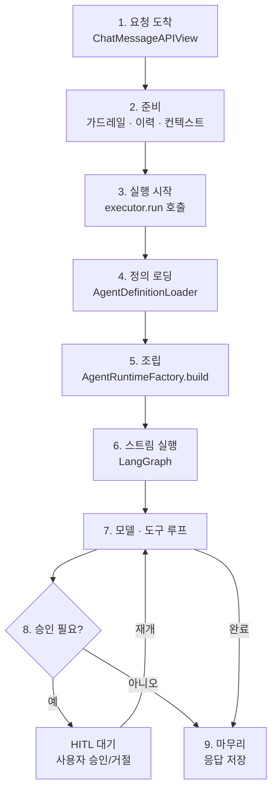

# 15. 실행 흐름 9단계 순서도

사용자 메시지가 도착해서 응답이 완성되기까지의 전체 순서. 승인(HITL)이 필요한
도구를 부르면 7번(모델·도구 루프)에서 잠깐 멈췄다가 사용자 결정을 받고
다시 루프로 돌아간다 — 이건 조건부 분기라 항상 지나가는 단계는 아니다.



## 단계별 요약

1. **요청 도착** — `apps/chat/api_views.py`의 `ChatMessageAPIView.post()`가
   사용자 발화를 받는다.
2. **준비** — 외부 가드레일 검사를 스레드풀에 먼저 던져 놓고, 그 사이 과거
   대화 이력(`_history()`)과 `RuntimeContext`(`_build_runtime_context()`)를
   준비한다. 레거시 `agent` 스키마 세션이면 `draft_from_legacy_agent()`로
   즉석 draft도 만든다.

   ```mermaid
   flowchart TD
       S["2. 준비 시작"] --> P["가드레일 검사<br/>스레드풀 제출(안 기다림)"]
       S --> Q["이력 조회<br/>_history()"]
       S --> R["RuntimeContext 조립"]
       S --> T["draft 준비<br/>레거시 세션이면"]
       P --> J["합류"]
       Q --> J
       R --> J
       T --> J
       J --> K{"가드레일<br/>blocked?"}
       K -->|예| L["400 응답<br/>저장 안 함"]
       K -->|아니오| M["사용자 발화<br/>DB 저장"]
       M --> N["3단계로"]
   ```

   가드레일 검사는 이 팀이 외부 가드레일을 연결해 놨고 그 연결이 "확인됨"
   상태일 때만 실제로 돈다. 안 걸려 있으면 그냥 통과다. 이 프로젝트 자체는
   무엇을 막을지 정하는 필터를 갖고 있지 않다 — 그건 전적으로 연결된
   서비스(Azure AI Content Safety, AWS Bedrock Guardrails, OpenAI
   가드레일 중 하나) 몫이다. 검사가 오래 걸릴 수 있어서 결과를 기다리지
   않고 먼저 던져만 놓고 다음 일을 한다. 나중에 다른 작업들이 다 끝나면
   그때 결과를 확인한다. 외부 서비스 호출 자체가 실패하면(타임아웃 등)
   막지 않고 통과시킨다 — 가드레일이 불안정하다고 채팅까지 막히면 안
   된다는 판단이다. (코드: `services/guardrails/input_check.py`의
   `check_user_input()` → `_connected_provider()`로 연결 여부 확인 →
   `kind`에 따라 `providers/azure.py`·`bedrock.py`·`openai_guardrails.py`
   중 하나로 위임.)

   이력 조회는 같은 대화방에서 오갔던 과거 메시지를 모델이 읽을 수 있는
   평문으로 바꾸는 작업이다. 최근 20턴까지만 가져오고, 승인 대기로
   끝났던 턴은 원래 내용 대신 "승인을 요청하고 기다림"이라는 한 줄로만
   남는다. (코드: `_history()`, `HISTORY_LIMIT`.)

   RuntimeContext 조립은 지금 말하는 사람이 누구고 어느 팀·어느 프로젝트
   소속인지, 이번 발화가 리더 권한인지 일반 멤버 권한인지를 확정하는
   작업이다. 계정 프로필을 조회해서 역할을 정하고, 이번 실행 전체를
   추적할 고유 번호(run_id)를 새로 발급한다. (코드:
   `_build_runtime_context()`, `AccountRepository.get_profile()`,
   `account_role()`.)

   draft 준비는 이 대화가 예전 방식(레거시 `agent` 스키마)으로 만들어진
   에이전트를 쓰고 있을 때만 필요하다. 그 경우 저장된 설정을 읽어서 지금
   실행 엔진이 이해하는 형태로 즉석 변환해 둔다(DB에 저장하진 않음). 새
   방식 에이전트면 이 단계는 아예 안 일어난다. (코드:
   `draft_from_legacy_agent()`.)

   네 가지가 다 끝나면 합류해서 가드레일 결과부터 본다. 막혔으면 그걸로
   끝 — 400 응답만 돌아가고 이 발화는 DB에 저장조차 안 된다. 안 막혔으면
   그제서야 사용자 발화를 저장하고 3단계로 넘어간다.
3. **실행 시작** — `_run_deep_agent()`가 `build_default_executor()`로
   `AgentExecutor`를 얻고 `executor.run(...)`을 호출한다(제너레이터,
   `StreamingHttpResponse`가 소비하기 시작해야 실제로 돈다).
4. **정의 로딩** — `AgentDefinitionLoader`가 저장된 `agent_version` 또는
   draft를 `AgentDefinition`(Root)+서브에이전트 참조로 바꾼다.
5. **조립** — `AgentRuntimeFactory.build()`. 모델 해석(`ModelConfigResolver`),
   도구·MCP 로딩(`ToolLoader`), 서브에이전트 컴파일(`CompiledSubAgent`),
   프롬프트 조립(`RuntimePromptAssembler`), 미들웨어 배선(호출상한·timeout·
   HITL)을 전부 마치고 `compat/deepagents_v075.py`가 실제
   `deepagents.create_deep_agent()`를 호출해 LangGraph 그래프를 컴파일한다.
6. **스트림 실행** — `DeepAgentStreamAdapter.stream()`이 `runtime.stream(...)`을
   돌린다. `thread_id`(=session_id)가 있으면 체크포인터가 이전 턴을 이미
   갖고 있으니 이번 발화만 보낸다.
7. **모델·도구 루프** — LangGraph가 모델 호출 → 도구 실행(내장/MCP) →
   필요하면 Child 위임 → 다시 모델을 반복한다. `EventMapper`가 이걸
   제품 이벤트로 바꾸고, `trace_events()`가 옆에서 `agent_run`/`tool_call`
   DB에 실시간 기록한다.
8. **승인 필요?** — `side_effect=True` 도구를 역할상 승인이 필요한 사람이
   부르면 `awaiting_confirmation`으로 멈춘다. 사용자가
   `ChatConfirmAPIView`에서 결정하면 `executor.resume()`이 멈췄던 run_id
   그대로 `Command(resume=...)`로 7번 루프를 재개한다.
9. **마무리** — 이벤트가 `_relay()`를 거쳐 NDJSON으로 실시간 전송되고,
   마지막(result/error/awaiting_confirmation)이 나오면 `_persist()`가
   `chat_message`로 확정 저장한다.
