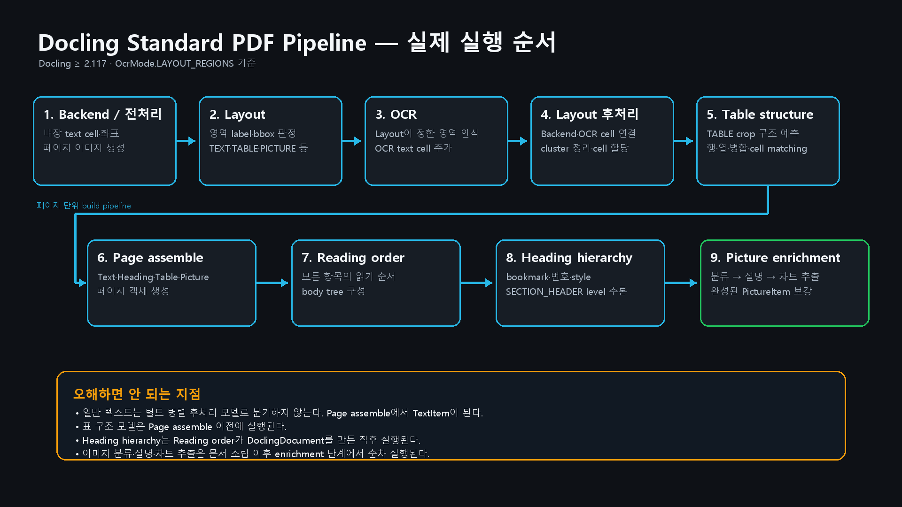

# Docling PDF 파싱 과정 — 판정 결과가 어떻게 연결되는가

> 현재 구성(`Docling >= 2.117`, `OcrMode.LAYOUT_REGIONS`)의 실제 실행 순서는 **Backend/전처리 → Layout → OCR → Layout 후처리 → Table structure → Page assemble → Reading order → Heading hierarchy → 이미지 enrichment**이다.



## 1. PDF Backend — 원본에서 읽어낸 영역


PDF Backend는 PDF 내부에 저장된 텍스트와 개별 이미지 객체를 읽는다. 이후 텍스트·이미지·도형을 모두 합친 페이지 전체 이미지를 생성하고, Layout 모델에게 넘긴다.

---

## 2. Layout Heron — 영역의 역할 판별


Layout 모델은 전달받은 페이지 전체 이미지를 분석해 각 영역을 `TEXT`, `SECTION_HEADER`, `TABLE`, `PICTURE` 등으로 분류한다. 이후 영역의 종류와 위치 정보를 OCR 및 후처리 단계에 넘긴다.

---

## 3. OCR — 선택된 영역의 텍스트 보완


OCR은 Layout 모델이 선택한 영역에서 이미지로 표현된 글자를 읽는다. 이후 인식한 문자열과 위치 정보를 후처리 단계에 넘겨 PDF Backend가 읽지 못한 텍스트를 보완한다.

---

## 4. Postprocessed Layout — 텍스트와 영역 결합


후처리 단계는 PDF Backend와 OCR이 추출한 문자열을 Layout 모델이 판별한 영역에 위치를 기준으로 연결한다. 이후 문자열과 영역의 역할이 결합된 결과를 표·헤딩·이미지 처리 단계에 넘긴다.

---

## 5. Table structure — 표 영역의 구조 복원

Layout이 `TABLE`로 판정한 영역의 이미지와 해당 영역에 연결된 text cell을 TableFormer에 넘긴다. TableFormer는 행·열·병합 구조를 예측하고 기존 문자열을 각 cell에 연결해 `TableItem`을 만든다.

> 표 처리는 텍스트·헤딩·이미지와 병렬로 갈라지는 후처리가 아니다. 현재 Standard PDF Pipeline에서 `Layout postprocess` 바로 다음, `Page assemble` 이전에 실행된다.

---

## 6. Page assemble — 페이지 객체 생성

후처리된 Layout cluster와 text cell, TableFormer 결과를 결합해 페이지 단위의 `TextItem`, `SectionHeaderItem`, `TableItem`, `PictureItem` 후보를 만든다. 일반 텍스트는 별도의 후속 모델로 다시 처리되는 것이 아니라 이 조립 단계에서 문서 항목이 된다.

---

## 7. Reading order → Heading hierarchy — 문서 구조 구성

모든 페이지를 조립한 뒤 Reading order가 텍스트·표·이미지를 포함한 문서 전체 항목의 순서와 `body` 트리를 구성한다. 그 직후 Heading hierarchy가 이미 `SECTION_HEADER`로 판정된 항목의 `level`을 PDF bookmark, 번호 체계, font style 순으로 추론한다.

> Heading hierarchy는 Layout 후처리에서 바로 분기되지 않으며, Reading order가 `DoclingDocument`를 만든 다음 실행된다.

---

## 8. 이미지·차트 enrichment — 완성된 PictureItem 보강

문서 조립과 Reading order·Heading hierarchy가 끝난 뒤, 완성된 `DoclingDocument`의 `PictureItem`을 순회한다. Picture classifier, Picture description, Chart extraction이 설정된 순서대로 해당 항목을 보강한다. 분류 결과는 `classification` annotation으로 저장되며, 일반 이미지는 SmolVLM이 자연어 설명을 생성해 `description` annotation으로 추가한다.

차트 추출에 성공하면 Granite Vision V4가 차트의 수치를 표 형태로 구조화한다. 이 결과는 `annotations[]`가 아니라 다음 경로에 저장된다.

```text
pictures[i]
└─ meta
   └─ tabular_chart
      └─ chart_data
         ├─ num_rows
         ├─ num_cols
         ├─ table_cells[]
         └─ grid[][]
```

현재 확인한 `hanwha (1).json`에는 크롭 이미지 픽셀이나 base64가 저장되지 않는다. 대신 `pictures[i].prov`에 원본 `page_no`와 `bbox`가 남으므로, 필요한 경우 원본 PDF에서 동일 영역을 다시 crop할 수 있다.

```text
Picture crop
→ 모델의 입력으로 사용
→ JSON에는 crop 자체가 아닌 page_no + bbox 저장
```

또한 차트로 분류됐다고 항상 `chart_data`가 생성되는 것은 아니다. 확인한 파일에서는 최상위 분류가 `bar_chart`인 그림 3개 중 2개에만 구조화된 차트 데이터가 존재했다.

### 최종 결과

```text
Layout·OCR·Table structure
        ↓
Page assemble
        ↓
Reading order → Heading hierarchy
        ↓
Picture classification → description → chart extraction
        ↓
최종 DoclingDocument
```

> **핵심:** Layout의 label은 후속 처리를 결정하지만 실행은 단순 병렬 분기가 아니다. 표 구조는 페이지 조립 전에, 읽기 순서와 헤딩 계층은 문서 조립 중에, 이미지 보강은 문서 조립 후에 순차 실행된다.

---

## 단계 간 전달 정보 요약

| 연결 | 전달되는 정보 | 다음 단계에서 하는 일 |
|---|---|---|
| PDF Backend → Layout Heron | 렌더링된 페이지 전체 이미지 | 영역의 종류와 bbox 판정 |
| Layout Heron → EasyOCR | Layout cluster의 bbox | 선택된 영역의 이미지 문자열 인식 |
| Backend·Layout·OCR → Postprocess | 내장 text cell, OCR text cell, 영역 label·bbox | 문자열을 해당 영역에 연결하고 중복·포함 관계 정리 |
| Layout postprocess → Table structure | `TABLE` 영역, crop 이미지, text cell | 행·열·병합 구조 예측과 cell matching |
| Table structure → Page assemble | 후처리 cluster, text cell, 표 구조 | 페이지 단위 Text·Heading·Table·Picture 항목 생성 |
| Page assemble → Reading order | 모든 페이지 항목 | 문서 읽기 순서와 body tree 구성 |
| Reading order → Heading hierarchy | 완성된 문서, heading 문자열·bbox·style, PDF outline | heading level 추론 |
| 완성된 DoclingDocument → Picture classifier | `PictureItem`의 bbox 기반 crop | 이미지 유형과 confidence 생성 |
| Picture classifier → Picture description | 분류된 picture crop | 자연어 설명을 `description` annotation에 저장 |
| Picture classifier → Chart extraction | 차트 후보 picture crop | 수치 구조를 `meta.tabular_chart.chart_data`에 저장 |
| Heading hierarchy·이미지 enrichment → 최종 결과 | 계층이 반영된 TextItem과 보강된 PictureItem | 최종 DoclingDocument 반환 |

> **핵심:** Backend가 재료를 확보하고 Layout이 역할을 판정하며, 그 Layout 결과가 OCR 대상 영역을 정한다. OCR 뒤 Layout postprocess가 문자열과 영역을 결합한다. 이후 표 구조 → 페이지 조립 → 읽기 순서 → 헤딩 계층 → 이미지 보강 순으로 진행된다.

## 실제 JSON 확인 결과

분석 대상: `C:\final_project\parser\output\hanwha (1).json`

| 확인 항목 | 결과 |
|---|---:|
| `PictureItem` | 54개 |
| `classification` annotation | 54개 |
| `description` annotation | 7개 |
| 구조화된 `tabular_chart.chart_data` | 2개 |
| JSON에 포함된 crop 이미지·URI·base64 | 없음 |

구조화된 차트 예시:

```text
picture[5]  : 8행 × 3열 — Year / Rank / Value
picture[20] : 6행 × 3열 — Series / Min Pressure / Max Pressure
```

> **해석:** Picture classifier는 crop 이미지를 분석하지만, JSON은 이미지 자체보다 분류·설명·차트 수치와 원본 위치를 저장하는 구조다.

---

### 발표자 메모

“첫 번째 그림에서 Backend가 내장 텍스트와 좌표를 확보합니다. 두 번째 그림에서는 Layout 모델이 페이지 이미지에서 영역의 역할을 판정하고, 이 결과를 바탕으로 OCR 대상과 표·이미지 등의 후속 처리 경로를 정합니다.”

“세 번째 그림에서 OCR은 Layout이 선택한 영역의 이미지 문자열을 읽어 Backend 텍스트를 보완합니다. 이후 Layout 후처리, 표 구조 복원, 페이지 조립, 읽기 순서와 헤딩 계층, 이미지 보강이 정해진 순서로 실행됩니다.”

“따라서 앞 단계가 영역을 놓치거나 잘못 읽으면 그 오류가 다음 단계로 전달됩니다. 실제 기업 문서에서는 이 과정에서 헤딩, 표, 복잡한 이미지, 이미지 설명의 네 가지 문제가 확인됐습니다.”

## 문제 발생 지점: 공통 입력과 후속 구조화를 구분해야 한다

```text
1. Layout·OCR
   정확한 영역과 문자열 확보
             ↓
2. 영역별 후속 구조화
   ├─ 표: TableFormer + cell matching
   ├─ 헤딩: bookmark + numbering + style
   └─ 이미지: VLM + 연결된 문서 문맥
             ↓
3. 후속 결과 별도 검증
```

> **중요:** Layout·OCR은 모든 후속 처리의 입력 품질을 결정하지만, 모든 오류의 유일한 원인은 아니다. 경계와 문자열이 정확해도 표 구조 모델, 헤딩 계층 추론, VLM·차트 추출 단계에서 별도의 오류가 발생할 수 있다.

| 영역 | 확인된 문제 | Layout·OCR의 영향 | 후속 단계의 원인 | 보완 방향 |
|---|---|---|---|---|
| 표 | 오버랩된 셀, 다중 컬럼, 경계선 없는 표에서 행·열·병합 매핑 오류 | 표의 마지막 행·열이 잘리거나 문자열이 누락되면 TableFormer와 cell matching의 입력이 불완전해진다. | TableFormer가 시각적으로 모호한 행·열·병합 구조를 잘못 예측하거나, text bbox가 잘못된 cell에 연결될 수 있다. | 먼저 `TABLE` crop과 OCR 문자열을 검증하고, 이후 `num_rows`, `num_cols`, `row_span`, `col_span`, `grid`의 구조 무결성을 검사한다. |
| 읽기 순서·헤딩 | 제목은 검출되지만 heading level이 대부분 1레벨로 평탄화됨 | 제목 영역 또는 `1.1` 같은 번호 문자열이 누락·오인식되면 hierarchy 추론 단서가 사라진다. | Layout의 `SECTION_HEADER` 검출과 heading level 추론은 별개다. PDF bookmark·번호·font style이 부족하거나 보존되지 않으면 레벨을 구분하기 어렵다. | 제목 검출과 레벨 정확도를 분리하고, bookmark·번호·style을 결합해 문서 전체 계층을 재구성한다. |
| 복합 이미지 | 그림·차트·범례·캡션이 분리 또는 과도하게 병합되고 이미지 내부 텍스트가 누락됨 | `PICTURE` bbox가 부정확하면 잘못된 crop이 OCR·분류·설명·차트 추출에 그대로 전달된다. | 이미지 OCR은 작은 글자와 낮은 대비에 약하고, 후속 VLM은 crop만으로 문서상의 의미를 충분히 알기 어렵다. | 경계를 재검증하고 고해상도 OCR을 수행한 뒤, 이미지와 연결된 캡션·주변 본문·상위 헤딩을 VLM에 함께 전달한다. |
| 차트 | 차트로 분류됐지만 수치가 구조화되지 않거나 범례·시리즈 연결이 틀림 | 차트 본체·축·범례·단위가 하나의 crop에 포함되면 추출 성공률이 개선된다. | crop이 정확해도 차트 모델이 막대·선·범례·수치를 잘못 연결할 수 있다. | Layout 개선 후에도 `classification`, OCR 수치, `chart_data`를 교차 검증한다. |

## 현재 디버그 이미지가 증명하는 범위

새 디버그 결과는 동일한 페이지 또는 동일한 bbox를 네 단계에서 비교한다.

```text
Backend Cells    | Raw Layout
-----------------+-----------------
OCR              | Postprocessed Layout
```

이를 통해 다음을 직접 확인한다.

- Layout 경계 밖으로 실제 내용이 잘렸는가
- 서로 다른 열·그림·캡션이 하나의 영역으로 잘못 병합됐는가
- OCR이 선택된 영역 안의 번호·수치·문자열을 누락했는가
- Raw Layout의 경계가 Postprocess에서도 유지됐는가

이 자료는 후속 처리의 **입력 경계와 문자열이 정확한지** 설명하는 근거다. 표의 최종 grid, heading level, 이미지 설명, 차트 수치의 정답 여부는 각 후속 결과에서 별도로 확인한다.

## 표: 영역 검출과 구조 복원을 분리한다

```text
Layout
→ TABLE 영역과 crop 결정

TableFormer
→ 행·열·cell·병합 구조 예측

Cell matching
→ Backend/OCR text cell을 예측된 표 cell에 연결
```

Layout이 표 경계를 잘못 잡으면 TableFormer 입력부터 불완전해진다. 그러나 경계가 정확해도 경계선 없는 표, 오버랩된 셀, 다중 컬럼에서는 TableFormer가 구조를 잘못 예측할 수 있다. 구조가 맞아도 PDF/OCR 문자열이 다른 cell에 연결될 수 있다.

최종 검증 항목:

- `num_rows`, `num_cols`
- `start/end_row_offset_idx`, `start/end_col_offset_idx`
- `row_span`, `col_span`
- 중복 점유 또는 비어 있는 `grid` 위치
- 숫자·날짜·금액·단위가 올바른 cell에 보존됐는지
- 페이지를 넘어가는 표의 헤더와 열 위치가 이어지는지

근거 문서: `C:\final_project\parser\base\도클링 테이블 추출 방법.md`

## 헤딩: 제목 검출과 레벨 추론을 분리한다

```text
Layout
→ TEXT / SECTION_HEADER / TITLE 판정

Backend·OCR
→ 제목 문자열과 번호 확보

Heading hierarchy
→ bookmark + numbering + font style로 level 추론
```

`SECTION_HEADER` 판정은 “제목처럼 보이는 영역인가”를 판단한다. Heading hierarchy는 이미 검출된 제목에 대해 “몇 레벨인가”를 판단한다. 따라서 제목 영역이 정확해도 bookmark·번호·style 단서가 부족하면 모든 제목이 `level=1`로 남을 수 있다.

보완 기준:

- `heading_detection_accuracy`와 `heading_level_accuracy`를 분리한다.
- `1`, `1.1`, `1.1.1` 같은 번호 깊이와 최종 level을 비교한다.
- PDF bookmark 깊이와 본문 제목을 문자열 유사도로 연결한다.
- font size·굵기·family 등 style 정보를 보존하고 문서 전체에서 상대 비교한다.
- level 점프와 전체 level 1 평탄화를 경고 대상으로 기록한다.

근거 문서: `C:\final_project\parser\base\도클링 텍스트 및 헤딩 추출 방법.md`

## 이미지 설명: 이미지와 연결된 문맥을 함께 전달한다

```text
Picture crop
+ 이미지 내부 OCR
+ 연결된 caption
+ 앞뒤 설명 문장
+ 상위 heading
+ 페이지·문서 정보
        ↓
VLM
        ↓
문서 맥락을 반영한 이미지 설명
```

이미지만 VLM에 전달하면 기업 문서에서 해당 그림이 무엇을 의미하는지 충분히 알기 어렵다. 따라서 DoclingDocument의 관계와 위치 정보를 이용해 캡션·주변 본문·상위 헤딩을 연결하고, 이미지 내부 OCR 문자열과 함께 구조화된 프롬프트로 전달한다.

## 차트: 정확한 crop은 필요조건이지 충분조건은 아니다

Layout 경계를 명확하게 잡으면 차트 본체·축·범례·단위가 함께 입력되므로 수치 추출이 크게 개선된다. 그러나 차트 구조화 모델이 시리즈와 범례를 잘못 연결하거나 값을 생성하지 못하는 문제는 남을 수 있다.

```text
차트 전체 경계 확보
→ 이미지 내부 OCR
→ 차트 유형·범례·시리즈·수치 구조화
→ OCR 수치와 chart_data 교차 검증
```

실제 `hanwha (1).json`에서는 최상위 분류가 `bar_chart`인 그림 3개 중 2개에만 `meta.tabular_chart.chart_data`가 존재했다. 따라서 **차트 분류 성공과 수치 구조화 성공은 별도로 검증해야 한다.**

## 발표 핵심 문장

> Docling의 Layout과 OCR은 표·헤딩·이미지 처리의 공통 입력을 만든다. 먼저 경계와 문자열을 정확히 확보하고, 이후 TableFormer·Heading hierarchy·VLM의 결과를 각각 검증하고 실패 영역만 선택적으로 보완한다.

### 다음 슬라이드 연결

> 다음 단계에서는 Layout·OCR의 입력 품질과 표·헤딩·이미지 후속 결과를 분리해 검증하고, 오류가 발생한 영역만 재처리하는 보완 파이프라인을 구성한다.
